# 🗄️🤖 SQL & GenAI Course
**🎯 Quality Education for Anyone, Anywhere, Anytime — 💫 with Comfort, Convenience at no Cost**

## 🏗️ **Level 1: Projects Pathway Guide**
### Build Your Portfolio: From Guided Projects to Independent Creation
---

## 🎯 **Your Project Journey Overview**

Welcome to the **Projects Phase** of your apprenticeship! You've built your SQL foundation (Weeks 1-4) and mastered AI collaboration (Week 5). Now you'll apply everything you've learned through a structured progression of projects.

**This guide contains the circular navigation for:**  
1. Module 6: HR Analytics Dashboard  
2. Bonus Project: University Course Manager  
3. Independent Projects  
4. Level 1 Completion Process

---

## 🔄 **The Complete Circular Journey**

```mermaid
flowchart LR
    A["<span style='font-size:16px'>🚀<br/>START HERE<br/>Module 1-5 Complete</span>"]
    B["<span style='font-size:14px'>Module 6<br/>HR Analytics Dashboard<br/>Guided Project</span>"]
    C["<span style='font-size:14px'>↩️ RETURN HERE<br/>After Module 6<br/>(Section 2)</span>"]
    D["<span style='font-size:14px'>Bonus Project<br/>University Course Manager<br/>Analysis & Study</span>"]
    E["<span style='font-size:14px'>↩️ RETURN HERE<br/>After Bonus Project<br/>(Section 3)</span>"]
    F["<span style='font-size:14px'>Apprentice's Induction<br/>Mindset Shift to<br/>Independent Creator</span>"]
    G["<span style='font-size:14px'>Independent Projects<br/>Build Your Own<br/>Portfolio Pieces</span>"]
    H["<span style='font-size:14px'>↩️ RETURN HERE<br/>After Projects<br/>(Section 5)</span>"]
    I["<span style='font-size:16px'>🏆<br/>LEVEL 1<br/>COMPLETE</span>"]
    
    A --> B --> C --> D --> E --> F --> G --> H --> I
    
    style A fill:#a5d6a7,stroke:#2e7d32,stroke-width:3px
    style I fill:#a5d6a7,stroke:#2e7d32,stroke-width:3px
    style C fill:#fff8e1,stroke:#ff9800,stroke-width:2px
    style E fill:#fff8e1,stroke:#ff9800,stroke-width:2px
    style H fill:#fff8e1,stroke:#ff9800,stroke-width:2px
    style F fill:#e1f5fe,stroke:#2196f3,stroke-width:2px
```



**Follow This Path:** Complete each step, return here for guidance, then proceed to next step.

---

## 📊 **Section 1: Module 6 - HR Analytics Dashboard**

### **Project Overview**
**Type:** Guided Professional Project  
**Database:** HR Management System  
**Outcome:** Complete analytics dashboard with professional documentation

### **What You'll Build:**
1. Employee demographic analysis
2. Department performance metrics
3. Salary distribution reports
4. Tenure and retention analytics
5. Professional presentation of insights

### **Project Structure:**
```
Module-6-HR-Analytics-Dashboard/
├── README.md (Project instructions)
├── hr_database.db (Complete HR dataset)
├── solutions/ (Reference implementations)
├── templates/ (Professional report templates)
└── deliverables/ (Your work goes here)
```

### **Learning Objectives:**
- Apply all SQL skills from Weeks 1-4
- Use AI effectively for complex queries (Week 5 skills)
- Create professional business intelligence
- Document work for portfolio presentation

### **Begin Module 6:**
➡️ **[Start HR Analytics Dashboard](../Module6-HR-Analytics-Dashboard-Project/README.md)**

> **After completing Module 6, return to Section 2 below.**

---

## 🔄 **Section 2: Post-Module 6 Return Point**

> **Complete this section AFTER finishing Module 6**

### **Congratulations!** 
You've completed your first professional data project. Before proceeding, let's consolidate your learning.

### **Reflection Questions:**
1. **Technical Skills Applied:**
   - Which SQL concepts were most valuable in this project?
   - What complex queries did you build?
   - How did you use AI differently than in practice exercises?

2. **Professional Skills Developed:**
   - How did you organize your work?
   - What documentation practices did you use?
   - How would you present these findings to a business stakeholder?

3. **Portfolio Artifact:**
   In your **Tab 4: The Vault**, ensure you have:
   - All SQL queries from the project
   - AI conversations about complex problems
   - Business insights summary
   - Professional documentation

### **Prepare for Bonus Project:**
The Bonus Project: University Course Manager will:
- Show you a different domain (education vs. HR)
- Provide more complex database relationships
- Challenge you to analyze without step-by-step guidance

### **Proceed to Bonus Project:**
➡️ **[Begin Bonus Project: University Course Manager](../../Projects/University-Course-Manager/README.md)**

> **After completing Bonus Project, return to Section 3 below.**

---

## 🎓 **Section 3: The Apprentice's Induction**

> **Complete this section AFTER finishing Bonus Project**

### **Welcome to Your Induction, Creator!**

You have now:
- ✅ Built SQL foundation through guided practice
- ✅ Mastered AI collaboration techniques
- ✅ Completed professional guided projects
- ✅ Analyzed complex system implementations

### **The Mindset Shift**

You're transitioning from **Apprentice** (following instructions) to **Creator** (designing solutions). This requires a different approach.

### **Your Induction Task: The Creator's Pledge**

In your **Tab 4: The Vault**, create `induction-reflection.md`:

```markdown
# My Creator's Pledge

## Part 1: Skills I Now Own
1. Three SQL concepts I can apply without reference:
   - 
   - 
   - 

2. My problem-solving process:
   - Step 1: 
   - Step 2: 
   - Step 3: 

## Part 2: AI Collaboration Philosophy
- I will use AI for: 
- I will not use AI for:
- My guiding principle: 

## Part 3: Project Creation Approach
For my independent projects, I will:
1. **Analyze Requirements:** 
2. **Design Solution:** 
3. **Implement & Test:** 
4. **Document & Present:** 

Signed: [Your Name]
Date: [Today's Date]
```

### **Independent Projects Overview**

You'll now build **two original projects** from scratch:

1. **Personal Budget Tracker**
   - Design: Income/expense database
   - Build: Financial analysis queries
   - Create: Reporting dashboard

2. **Recipe Nutrition Calculator**
   - Design: Recipe/ingredient database
   - Build: Nutritional calculation queries
   - Create: Meal planning tools

### **Begin Independent Projects:**
➡️ **[Start Independent Project 1: Personal Budget Tracker](../../Projects/Independent-Projects/Budget-Tracker/README.md)**

> **After completing both independent projects, return to Section 5 below.**

---

## 🛠️ **Section 4: Independent Project Guidelines**

### **Project 1: Personal Budget Tracker**

**Business Requirements:**
- Track income sources and amounts
- Categorize expenses
- Calculate monthly summaries
- Analyze spending patterns
- Generate financial reports

**Suggested Database Structure:**
```sql
-- Example tables you might create:
- transactions (id, date, amount, category, type, description)
- categories (id, name, budget_limit)
- income_sources (id, name, frequency, amount)
- monthly_summaries (month, total_income, total_expenses, savings)
```

**Deliverables:**
1. Database schema design
2. SQL queries for all requirements
3. Business insights report
4. User documentation

### **Project 2: Recipe Nutrition Calculator**

**Business Requirements:**
- Store recipes with ingredients
- Calculate nutritional values per serving
- Plan meals for specific nutrition goals
- Generate shopping lists
- Analyze recipe nutrition profiles

**Suggested Database Structure:**
```sql
-- Example tables you might create:
- recipes (id, name, servings, instructions)
- ingredients (id, name, calories_per_100g, protein, carbs, fat)
- recipe_ingredients (recipe_id, ingredient_id, quantity, unit)
- meals (id, date, recipe_id, servings_consumed)
```

**Deliverables:**
1. Database schema design
2. Nutritional calculation queries
3. Meal planning tools
4. User-friendly documentation

---

## 🏆 **Section 5: Level 1 Completion & Mastery Review**

> **Complete this section AFTER finishing both independent projects**

### **Level 1 Mastery Achieved!**

You have completed the full SQL Apprenticeship:
**✅ ACQUIRE** Foundation Skills (Modules 1-4)  
**✅ ACCELERATE** with AI (Module 5)  
**✅ ANALYZE** Professional Work (Module 6 & Bonus)  
**✅ ARCHITECT** Original Projects (Independent Projects)

### **Portfolio Assembly Instructions**

In your **Tab 4: The Vault**, create your professional portfolio:

#### **Step 1: Portfolio Structure**
```
Level-1-Portfolio/
├── 01-Foundation-Skills/
│   ├── Module-1-4-Exercises/
│   ├── Key-Concepts-Summary.md
│   └── Skills-Checklist.md
├── 02-AI-Collaboration/
│   ├── Prompt-Strategies.md
│   ├── AI-Conversations/
│   └── Socratic-Method-Examples.md
├── 03-Guided-Projects/
│   ├── HR-Analytics-Dashboard/
│   ├── University-Course-Manager/
│   └── Project-Reflections.md
├── 04-Independent-Projects/
│   ├── Budget-Tracker/
│   ├── Nutrition-Calculator/
│   └── Project-Documentation/
├── 05-Skill-Assessment/
│   ├── Skill-Matrix.md
│   ├── Growth-Areas.md
│   └── Learning-Journey-Reflection.md
└── README.md (Portfolio Overview)
```

#### **Step 2: Skill Matrix Completion**
Create `Skill-Matrix.md`:

```markdown
# Level 1 Skill Assessment

## SQL Technical Skills (Rate 1-5 ⭐)
- Basic Data Retrieval: _____
- Complex Filtering: _____
- Sorting & Organization: _____
- Data Aggregation: _____
- Multi-Table Operations: _____
- Complex Logic Implementation: _____

## Professional Competencies
- Problem Analysis: _____
- Solution Design: _____
- AI Collaboration: _____
- Documentation: _____
- Project Management: _____
- Business Insight Generation: _____

## Key Growth Areas for Level 2:
1. 
2. 
3. 
```

#### **Step 3: Learning Journey Reflection**
Answer in `Learning-Journey-Reflection.md`:

1. **Most Valuable Insight:** What surprised you about data work?
2. **Biggest Challenge Overcome:** What was difficult that you now master?
3. **AI Partnership Evolution:** How has your AI use changed?
4. **Personal Growth:** How has your problem-solving mindset evolved?
5. **Favorite Project:** Which project was most rewarding and why?

### **The Artisan's Creed**

You began as an apprentice; you leave as an artisan. You have proven:

> **"Foundation skills, intelligently combined with AI partnership, create genuine competence that no tool can replace."**

Your confidence is built on **actual skill**, not borrowed capability.

### **Prepare for Level 2: The Data Artisan**

In Level 2, you'll build on this foundation with:
- Advanced SQL techniques and optimization
- Complex database design patterns
- Full-stack application development
- Professional deployment workflows
- Real-world client scenarios

**Your apprenticeship is complete. Your artistry begins.**

---

🎯 **[Proceed to Level 2: The Data Artisan](../../Level-2-intermediate/README.md)**

---

## 📋 **Project Completion Checklist**

### **Before Proceeding to Level 2:**
- [ ] All Module 1-6 exercises completed
- [ ] HR Analytics Dashboard fully implemented
- [ ] Bonus Project analyzed and documented
- [ ] Both independent projects built from scratch
- [ ] Portfolio organized in Tab 4: The Vault
- [ ] Skill matrix and reflections completed
- [ ] All work committed to GitHub repository

### **Success Indicators:**
- You can explain SQL concepts in simple terms
- You can design database solutions for new problems
- You use AI as a thinking partner, not a crutch
- Your portfolio tells a coherent skills story
- You feel genuine confidence in your abilities

---

## 🔄 **Navigation Support**

### **Lost? Return to These Points:**
- **Starting Projects:** Section 1 (Module 6)
- **After Module 6:** Section 2 (Return Point)
- **After Bonus Project:** Section 3 (Induction)
- **During Independent Projects:** Section 4 (Guidelines)
- **After All Projects:** Section 5 (Completion)

### **Need Help?**
- Technical issues: **[Setup & Workspace Guide](./LEVEL1_SETUP_WORKSPACE.md)**
- Schedule questions: **[Weekly Schedule Guide](./LEVEL1_WEEKLY_SCHEDULE.md)**
- General navigation: **[Journey Map](./LEVEL1_JOURNEY_MAP.md)**

---

## 🚀 **Begin Your Project Journey**

Ready to apply your skills and build your portfolio?

➡️ **[Start with Module 6: HR Analytics Dashboard](../Module6-HR-Analytics-Dashboard-Project/README.md)**

---

*Part of our mission for 🎯 Quality Education for Anyone, Anywhere, Anytime — 💫 with Comfort, Convenience at no Cost.*

**Level 1 Complete | The SQL Apprentice → The Data Artisan | Portfolio Ready**


