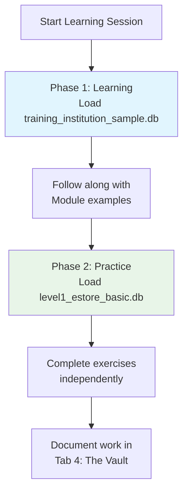

# 🗄️🤖 SQL & GenAI Course
**🎯 Quality Education for Anyone, Anywhere, Anytime — 💫 with Comfort, Convenience at no Cost**

## 🛠️ **Level 1: Setup & Workspace Guide**
### Configure Your Browser Office for Optimal Learning
---

## 🎯 **Quick Setup Promise**

In **25 minutes or less**, you'll configure a complete professional learning environment—no installations, just your browser. This guide works with the **[Technical Guide](../../Setup/TECHNICAL_GUIDE_L1L2.md)** to ensure your workspace is ready for 6 weeks of focused learning.

---

## 🏢 **The Browser Office: Your Universal Workshop**

**🚀 Kickstart: Any Computer, Any Browser, Anytime.**  
**🌍 Destination: Any country, Any city, Any Platform.**

### **Your Four-Tab Workspace:**
| Tab | Purpose | Tool | Keyboard Shortcut |
| :--- | :--- | :--- | :--- |
| **1: The Map** | Course navigation & instructions | Course Repository (GitHub) | `Ctrl+1` / `Cmd+1` |
| **2: The Factory** | Hands-on SQL practice | SQLite Online | `Ctrl+2` / `Cmd+2` |
| **3: The Consultant** | AI guidance & explanations | ChatGPT, Claude, or Gemini | `Ctrl+3` / `Cmd+3` |
| **4: The Vault** | Portfolio & progress tracking | Your GitHub Repository | `Ctrl+4` / `Cmd+4` |

---

## 📋 **Essential Setup Checklist**

### **Before You Begin Learning:**
- [ ] **Tab 1 (The Map):** Can access course materials in GitHub
- [ ] **Tab 2 (The Factory):** SQLite Online loads without errors
- [ ] **Tab 3 (The Consultant):** AI platform ready with Student Mode configured
- [ ] **Tab 4 (The Vault):** Personal GitHub repository created and accessible

### **If Any Item is Unchecked:**
Complete the **[Technical Guide: Setup for Levels 1 & 2](../../Setup/TECHNICAL_GUIDE_L1L2.md)** first. This 25-minute guide provides step-by-step instructions for each tab.

---

## 🗃️ **Level 1 Database Configuration**

### **Dual-Database Learning System**
Level 1 uses two carefully designed databases:

| Database | File Name | Purpose | When to Use |
| :--- | :--- | :--- | :--- |
| **Training Database** | `training_institution_sample.db` | **"Watch and Learn"** - Guided examples | Module demonstrations, following along with lessons |
| **Practice Database** | `level1_estore_basic.db` | **"Now You Do It"** - Hands-on practice | Independent exercises, skill application |

### **Database Location:**
Both databases are available in:  
`../../Resources/sample_databases/`

### **Loading Databases in SQLite Online:**
1. Open **Tab 2: SQLite Online** (`sqliteonline.com`)
2. Click **"File" → "Open DB"**
3. Navigate to or upload the appropriate database file
4. Verify tables appear in the left panel

---

## 🏗️ **The Level 1 Browser Office Layout**

Before beginning each module, ensure your four-tab environment follows this layout:

| Tab | Level 1 Resource | Specific Actions |
| :--- | :--- | :--- |
| **1: The Map** | `Level-1-beginner/Module-X.md` | Follow instructional "Watch Me" guides exactly |
| **2: The Factory** | **Dual-Phase Protocol** | **Lesson Phase:** Load `training_institution_sample.db`<br>**Exercise Phase:** Load `level1_estore_basic.db` |
| **3: The Consultant** | **Student Mode Active** | Use **[STUDENT_MODE_PROMPT_LEVEL1.md](../STUDENT_MODE_PROMPT_LEVEL1.md)**<br>Discuss logic, don't ask for complete solutions |
| **4: The Vault** | `my-sql-journey/Level-1/` | Create folder structure for each module<br>Document every exercise and insight |

---

## ⚙️ **The Dual-Phase Factory Protocol**

### **Why Two Phases?**
Clear mental separation between learning and practice prevents confusion and builds stronger skills.

### **Implementation:**
1. **When reading/learning:** Load `training_institution_sample.db`
2. **When practicing/exercising:** Load `level1_estore_basic.db`
3. **Clear transition:** Close one database before opening the other

### **Visual Workflow:**


---

## 🧪 **Setup Validation Test**

### **Test 1: Basic Navigation (2 minutes)**
1. **Tab 1:** Navigate to `Level-1-beginner/README.md`
2. **Tab 2:** Load `training_institution_sample.db` in SQLite Online
3. **Tab 3:** Start new chat with AI, paste Student Mode prompt
4. **Tab 4:** Create folder `setup-test/` in your repository

### **Test 2: First Query Execution (3 minutes)**
1. In **Tab 2** with `training_institution_sample.db` loaded:
   ```sql
   SELECT first_name, last_name FROM students LIMIT 3;
   ```
2. Click **Run** - Should see 3 student names
3. In **Tab 4**, create file `setup-test/first-query.md` with:
   - The SQL command
   - What results you saw
   - Today's date

### **Test 3: AI Configuration (2 minutes)**
1. In **Tab 3**, ask: "I'm learning SQL. What does the SELECT statement do?"
2. AI should **explain the concept** not write code (Student Mode working)
3. Copy the conversation to **Tab 4** in `setup-test/ai-test.md`

---

## 🆘 **Common Setup Issues & Solutions**

### **Issue: "SQLite Online won't load my database"**
**Solution:**
1. Check file format (must be `.db` or `.sqlite`)
2. Try smaller file first (`training_institution_sample.db` is smaller)
3. Use **"Open DB"** not "Open SQLite"
4. Alternative: Use **[DB Browser for SQLite Online](https://sqlitebrowser.org/dl/)** if persistent issues

### **Issue: "AI keeps giving me code instead of explanations"**
**Solution:**
1. Ensure you're using **NEW chat** (not continuing old one)
2. Paste entire Student Mode prompt as **FIRST message**
3. Some AIs need reminder: "Remember you're in Student Mode"
4. Try different AI platform if issue persists

### **Issue: "GitHub repository permissions error"**
**Solution:**
1. Ensure you're in **YOUR fork** (your username should be in URL)
2. Check repository is **public** (private repos may have issues)
3. Try incognito/private browsing mode
4. Clear browser cache and cookies

---

## 📁 **Recommended Folder Structure**

In **Tab 4: The Vault** (your GitHub repository), create:

```
my-sql-journey/
├── Level-1/
│   ├── Module-1/
│   │   ├── exercises/
│   │   ├── notes.md
│   │   └── ai-conversations.md
│   ├── Module-2/
│   ├── ... (all modules)
│   ├── Projects/
│   │   ├── HR-Dashboard/
│   │   ├── Bonus-Project/
│   │   └── Independent/
│   └── Resources/
│       ├── prompts.md
│       └── references.md
└── README.md (portfolio overview)
```

---

## 🎯 **Next Steps After Setup**

### **Your Setup is Complete When:**
- [ ] All four tabs open correctly
- [ ] Databases load in SQLite Online
- [ ] AI responds in Student Mode
- [ ] You can save work to your GitHub repository

### **Ready to Begin Learning:**
➡️ **[Return to Journey Map](./LEVEL1_JOURNEY_MAP.md)** for next steps  
➡️ **Or start directly with** **[Weekly Schedule Guide](./LEVEL1_WEEKLY_SCHEDULE.md)**

---

## 💡 **Pro Tips for Optimal Setup**

1. **Bookmark All Tabs:** Save each tab as a bookmark for 1-click access
2. **Browser Profiles:** Consider separate browser profile for learning
3. **Keyboard Shortcuts:** Practice `Ctrl+1` through `Ctrl+4` until automatic
4. **Session Templates:** Save SQLite Online with databases pre-loaded if supported
5. **Backup Regularly:** Commit work to GitHub after each session

---

## 🔄 **Return to Navigation**

Need different information? Return to the main navigation hub:
➡️ **[Level 1 Journey Map](./LEVEL1_JOURNEY_MAP.md)**

---

*Part of our mission for 🎯 Quality Education for Anyone, Anywhere, Anytime — 💫 with Comfort, Convenience at no Cost.*

**Setup Complete? Begin your learning journey with the Weekly Schedule Guide.**


