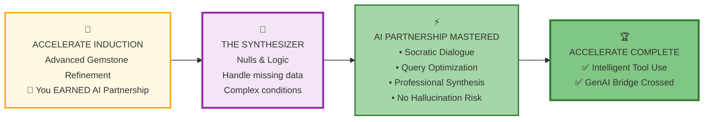
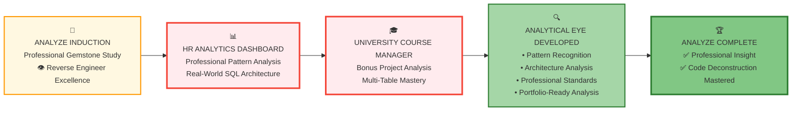
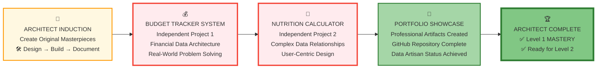

# 🗄️🤖 SQL & GenAI Course
**🎯 Quality Education for Anyone, Anywhere, Anytime — 💫 with Comfort, Convenience at no Cost**

## 🏁 **Level 1: The SQL Apprentice - Your 6-Week Journey Guide**

---

## 🎯 **Welcome to Your Command Center**

Welcome, Apprentice! You stand at the threshold of a transformative 6-week journey. By the end of Level 1, you will have transformed from a data observer to a **Data Investigator**—someone who can ask precise questions of databases and extract meaningful insights with confidence.

**If you're feeling overwhelmed:** That's normal. Every master was once an apprentice. This guide isn't a test—it's a **treasure map**. You don't need to memorize it; you just need to trust it and take the first step.

**Your Apprenticeship Goal:** Master the "Big Four" SQL commands (SELECT, FROM, WHERE, ORDER BY) and build your first professional data artifacts, establishing a foundation that will serve you through Levels 2 and 3.

**Everything you need is one click away.** This Master Guide is your central navigation hub for the entire Level 1 journey. Every tool, every guide, every next step—ready at your command. This Guide puts the complete Level 1 journey at your fingertips. No searching, no confusion, just clear navigation.

**Follow the natural flow:** Induction → Learning → Completion → Next Induction

---

## 🧭 **YOUR LEVEL 1 JOURNEY MAP & TIMELINE**

### **📋 Document Purpose & Your Position**
**This document is your:** 6-Week Learning Companion & Motivational Guide  
**You are here:** After completing your Browser Office setup  
**Next step:** Begin with your Induction Ritual  

### **📅 Your 6-Week Journey Breakdown**
| Phase | Duration | AI Partnership Level | Core Outcome |
| --- | --- | --- | --- |
| **🔴 ACQUIRE** | Weeks 1-4 | **Conceptual Guide Only** | Raw Skill & Syntax Confidence |
| **🔴 ACCELERATE** | Week 5 | **Intelligent Collaborator** | AI Prompting & Optimization |
| **🔴 ANALYZE** | Week 6 | **Analysis Partner** | Pattern Recognition & Architecture |
| **🔴 ARCHITECT** | Post-Course | **Full Development Partner** | Portfolio-Ready Original Projects |

**All setup complete? Your four tabs ready? Then you're in the right place.**

---

## 🏢 **The Apprenticeship Framework: The 4 A's Progression**

**🚀 Foundation First, AI Next, Projects Last.**  
**💎 Gemstone by Gemstone, Skill by Skill.**

### **📋 The 4 A's Learning Architecture**
Your apprenticeship follows a deliberate path designed to build genuine mastery through structured phases:

| Phase | Duration | Core Focus | AI Role | Outcome |
| :--- | :--- | :--- | :--- | :--- |
| **🔴 1 ACQUIRE** | Weeks 1-4 | Foundation SQL Skills | **Conceptual Guide Only** | Raw skill building, no code generation |
| **🔴 2 ACCELERATE** | Week 5 | AI Partnership Mastery | **Intelligent Collaborator** | Socratic dialogue, query optimization |
| **🔴 3 ANALYZE** | Week 6 | Professional Code Study | **Analysis Partner** | Pattern recognition, architecture understanding |
| **🔴 4 ARCHITECT** | Post-Course | Original Project Creation | **Full Development Partner** | End-to-end solution building |

### The journey is designed as a **logical progression of power**.

You do not get the "keys to the AI kingdom" until you have proven you can swing the "SQL hammer" manually.

### **1. 🔴 ACQUIRE: The Foundation**

*Building the "Internal Engine" of logic.*

* **Modules 1-4:** Focus on the "Big Four": `SELECT`, `FROM`, `WHERE`, `ORDER BY`.
* **The Rule:** AI acts as a dictionary, not a ghostwriter. You write every line of code.
* **Goal:** "I can solve this myself."

### **2. 🔴 ACCELERATE: The Multiplier**

*Learning the Socratic AI Method™.*

* **Module 5:** Integrate AI to refine, optimize, and explain.
* **The Rule:** Dialogue-driven coding. You ask "Why?" and "How can this be better?"
* **Goal:** "Now I can work 10x faster."

### **3. 🔴 ANALYZE: The Deconstructor**

*Reverse-engineering professional excellence.*

* **Module 6 & Bonus:** Study the **HR Analytics Dashboard** and **University Manager**.
* **The Rule:** AI acts as a Senior Architect explaining design choices.
* **Goal:** "I see the patterns behind the code."

### **4. 🔴 ARCHITECT: The Creator**

*Building for the real world.*

* **Projects:** **Budget Tracker** & **Nutrition Calculator**.
* **The Rule:** Full partnership. AI assists in end-to-end development and documentation.
* **Goal:** "I am a Data Artisan."

---

### 💎 **Why This Progression Matters**

**Week 1-4 (ACQUIRE):** You build **unshakable confidence** — "I can solve this myself"  
**Week 5 (ACCELERATE):** You gain **professional speed** — "Now I can work 10x faster"  
**Week 6+ (ANALYZE → ARCHITECT):** You develop **professional identity** — "I am a Data Artisan"

*This isn't just learning SQL. This is building a new identity.*

---

## 🧭 **Visualizing the 4 A's Learning Architecture**

This guide follows the **4 A's progression** from the Level 1 README—a deliberate path designed to build genuine mastery through structured phases. **The 4 A's are the four pillars for building your Foundation SQL skills.**

**The SQL Journey Logic:**
$$\text{Acquire (Raw SQL)} \rightarrow \text{Accelerate (AI Logic)} \rightarrow \text{Analyze (Patterns)} \rightarrow \text{Architect (Systems)}$$

```mermaid
flowchart LR
    A["<span style='font-size:16px'>1. ACQUIRE<br/>Foundation Skills<br/>Modules 1-4</span>"]
    B["<span style='font-size:16px'>2. ACCELERATE<br/>AI Refinement<br/>Module 5</span>"]
    C["<span style='font-size:16px'>3. ANALYZE<br/>Study Projects<br/>Module 6 & Bonus</span>"]
    D["<span style='font-size:16px'>4. ARCHITECT<br/>Build Portfolio<br/>Independent Projects</span>"]
    E["<span style='font-size:18px'>🏆<br/>PORTFOLIO<br/>COMPLETE</span>"]
    
    A -- "Build Raw SQL<br/>Skills" --> B
    B -- "Master AI<br/>Collaboration" --> C
    C -- "Study Professional<br/>Code" --> D
    D -- "Create Your<br/>Own Work" --> E
    
    style A fill:#e1f5fe,stroke:#2196f3,stroke-width:3px
    style B fill:#f3e5f5,stroke:#9c27b0,stroke-width:3px
    style C fill:#ffebee,stroke:#f44336,stroke-width:3px
    style D fill:#ffebee,stroke:#f44336,stroke-width:3px
    style E fill:#a5d6a7,stroke:#2e7d32,stroke-width:4px
```

### **📍 Quick Navigation Guide**

#### **Based on Your Progress:**
| Your Status | Next Action |
| :--- | :--- |
| **Just starting Level 1?** | [SECTION 1: ACQUIRE Foundation Skills](#-section-1-acquire-foundation-skills) |
| **Finished Modules 1-4?** | [SECTION 2: ACCELERATE with AI](#-section-2-accelerate-with-ai) |
| **Completed AI Module?** | [SECTION 3: ANALYZE Professional Code](#-section-3-analyze-professional-code) |
| **Ready for projects?** | [SECTION 4: ARCHITECT Original Work](#-section-4-architect-original-work) |

**Your journey through this guide:** Each section below follows this progression, with **induction preparation** before you begin and **completion reflection** after you finish.

---

### **🎯 Your First Action: The Induction Ritual**

**What is an Induction?** A 2-3 day focused preparation phase that sets up your workspace, tools, and mindset for success. Think of it as "sharpening your tools before building."

**Your Induction includes:**
✓ Browser Office configuration for this phase  
✓ AI rule implementation  
✓ Learning ritual establishment  
✓ Success criteria definition  

---

## 🔴 **1 ACQUIRE Foundation Skills**

✅ **Browser Office Status:** All four tabs operational | ✅ **AI Rule:** Conceptual guidance only

### **📊 SECTION 1 WORKFLOW: Your Foundation Building Journey**

```mermaid
flowchart LR
    A["<span style='font-size:14px'>💎<br/>ACQUIRE INDUCTION<br/>Foundation Gemstone Collection<br/>🤖 AI: Conceptual Polishing ONLY</span>"]
    B["<span style='font-size:14px'>📘<br/>MODULE 1<br/>Introduction to Databases<br/>Conceptual Foundation</span>"]
    C["<span style='font-size:14px'>🔍<br/>MODULE 2<br/>SELECT & WHERE<br/>Basic Data Retrieval</span>"]
    D["<span style='font-size:14px'>📊<br/>MODULE 3<br/>Sorting, Aggregation, Grouping<br/>Organizing & Summarizing</span>"]
    E["<span style='font-size:14px'>🔗<br/>MODULE 4<br/>Joining Tables<br/>Combining Data Sources</span>"]
    F["<span style='font-size:14px'>💎<br/>FOUNDATION BUILT<br/>4 Core Modules Mastered<br/>Factory Protocol Active</span>"]
    G["<span style='font-size:14px'>🏆<br/>ACQUIRE COMPLETE<br/>✅ Watch Me → Now You Do It<br/>✅ Dual-Phase Mastery</span>"]
    
    A --> B --> C --> D --> E --> F --> G
    
    style A fill:#fff8e1,stroke:#ff9800,stroke-width:2px
    style B fill:#e1f5fe,stroke:#2196f3,stroke-width:2px
    style C fill:#e1f5fe,stroke:#2196f3,stroke-width:2px
    style D fill:#e1f5fe,stroke:#2196f3,stroke-width:2px
    style E fill:#e1f5fe,stroke:#2196f3,stroke-width:2px
    style F fill:#a5d6a7,stroke:#2e7d32,stroke-width:2px
    style G fill:#81c784,stroke:#2e7d32,stroke-width:3px
```

### **📋 SECTION 1 PROGRESSION**

| Phase | Purpose | Preparation Required | **Core Deliverable / Outcome** |
| :--- | :--- | :--- | :--- |
| **INDUCTION** | Prepare for Foundation Building | Setup Toolkit for Section 1 | **Induction Mindset & Prepared Workspace** |
| **MODULE 1** | Introduction to Databases & AI Co-pilot (Conceptual) | Complete Induction preparation | **Understanding of databases, tables, and AI co-pilot role** |
| **MODULE 2** | SELECT & WHERE (Basic Retrieval) | Finish Module 1 | **Ability to retrieve and filter data from single tables** |
| **MODULE 3** | Sorting, Aggregation & Grouping | Finish Module 2 | **Skill to organize, summarize, and group query results** |
| **MODULE 4** | Joining Tables | Finish Module 3 | **Capability to combine data from multiple tables** |
| **COMPLETION** | Reflect & Transition | Finish Module 4 | **Solidified foundation & readiness for AI partnership** |

---

### 🚀 **Kickstart Your Journey**

**➡️ [Begin Your Induction: ACQUIRE Foundation Skills](./SECTION1_INDUCTION.md)**  
*Take this step. The map becomes the territory.*

---

### **🎯 SECTION 1 COMPLETE - READY FOR NEXT PHASE**

**🎉 Congratulations!** You've built a solid SQL foundation through deliberate practice. Now you're going to sharpen the skills you've acquired with AI Acceleration. You're on your way to becoming a Master Craftsman.

**Your Foundation is Complete.** You've earned the right to use powerful tools. Good luck on your Section 2 journey.

**Proceed to Next Phase:**
➡️ **📖 Next Step:** Read the SECTION 2 Workflow below  
   **🎯 Action:** Start your next leg of Foundation Building journey

---

### ✅ **BEFORE YOU BEGIN SECTION 2**

**What are the 3 Impressive Milestones you achieved in SECTION 1 JOURNEY?**

1. _________________________________________
2. _________________________________________
3. _________________________________________

**Document these **3 foundational insights** in your Vault**

*This step marks your official completion of the ACQUIRE phase.*

**Ready for the next phase?**  
➡️ **[Proceed to ACCELERATE Phase](#-2-accelerate-with-ai)**

<small>⏱️ *Estimated time for next phase: 1 week*</small>

---

## 🔴 **2 ACCELERATE with AI**

✅ **Browser Office Status:** All four tabs operational | ✅ **AI Rule:** Intelligent collaboration enabled

### **📊 SECTION 2 WORKFLOW: Your AI Acceleration Journey**

### **📋 SECTION 2 PROGRESSION**

| Phase | Purpose | Preparation Required | **Core Deliverable / Outcome** |
| :--- | :--- | :--- | :--- |
| **INDUCTION** | Prepare for AI Partnership | Complete Section 1 Foundation | **Mindset for Socratic collaboration & AI guardrails** |
| **MODULE 5** | Master AI & SQL Collaboration | Finish Induction preparation | **Ability to use AI as an intelligent thinking partner for SQL** |
| **COMPLETION** | Reflect & Transition | Finish Module 5 | **Mastery of the Socratic AI Method™ for query refinement** |

---

### 🚀 **Kickstart Your Journey**
You've built the foundation. Now, learn to sharpen it with intelligence.

**➡️ [Begin Your Induction: ACCELERATE with AI](./SECTION2_INDUCTION.md)**

---

### **🎯 SECTION 2 COMPLETE - READY FOR NEXT PHASE**

**🎉 Excellent work!** You've mastered the Socratic AI Method™ and learned to wield AI as a professional tool, not a crutch. You now understand intelligent collaboration.

**Your AI Partnership is Forged.** You can enhance your skills with powerful assistance while maintaining genuine understanding. Well done!

**Proceed to Next Phase:**
➡️ **📖 Next Step:** Read the SECTION 3 Workflow below  
   **🎯 Action:** Start your next leg of Foundation Building journey

---

### ✅ **BEFORE YOU BEGIN SECTION 3**

**What are the 3 Impressive Milestones you achieved in SECTION 2 JOURNEY?**

1. _________________________________________
2. _________________________________________
3. _________________________________________

**Document these 3 AI collaboration breakthroughs in your Vault**

*This step marks your official completion of the ACCELERATE phase.*

**Ready for the next phase?**  
➡️ **[Proceed to ANALYZE Phase](#-3-analyze-professional-code)**

<small>⏱️ *Estimated time for next phase: 1 week*</small>

---

## 🔴 **3 ANALYZE Professional Code**

✅ **Browser Office Status:** All four tabs operational | ✅ **AI Rule:** Analysis partner mode active

### **📊 SECTION 3 WORKFLOW: Your Professional Analysis Journey**

### **📋 SECTION 3 PROGRESSION**

| Phase | Purpose | Preparation Required | **Core Deliverable / Outcome** |
| :--- | :--- | :--- | :--- |
| **INDUCTION** | Prepare for Professional Analysis | Complete Section 2 AI Skills | **Analytical mindset for deconstructing professional systems** |
| **MODULE 6** | Explore HR Analytics Dashboard | Finish Induction preparation | **Insight into real-world SQL architecture and design patterns** |
| **BONUS PROJECT** | Delve into Course Manager | Finish Module 6 | **Ability to reverse-engineer complex, multi-table database solutions** |
| **COMPLETION** | Reflect & Transition | Finish Bonus Project | **Sharpened analytical eye for professional-grade code** |

---

### 🚀 **Kickstart Your Journey**
Shift from writing code to reading it like a professional.

**➡️ [Begin Your Induction: ANALYZE Professional Code](./SECTION3_INDUCTION.md)**

---

### **🎯 SECTION 3 COMPLETE - READY FOR NEXT PHASE**

**🎉 Impressive analysis!** You've studied complete professional systems and understand how real-world solutions are built. You can now deconstruct professional code to learn design patterns.

**Your Analytical Eye is Sharpened.** You see beyond code to architecture, beyond solutions to design thinking. This is professional-level insight. Well done!

**Proceed to Final Phase:**
➡️ **📖 Next Step:** Read the SECTION 4 Workflow below  
   **🎯 Action:** Start your final leg of Foundation Building journey

---

### ✅ **BEFORE YOU BEGIN SECTION 4**

**What are the 3 Impressive Milestones you achieved in SECTION 3 JOURNEY?**

1. _________________________________________
2. _________________________________________
3. _________________________________________

**Document these 3 professional patterns in your Vault**

*This step marks your official completion of the ANALYZE phase.*

**Ready for the next phase?**  
➡️ **[Proceed to ARCHITECT Phase](#-4-architect-original-work)**

<small>⏱️ *Estimated time for next phase: Self-paced*</small>

---

## 🔴 **4 ARCHITECT Original Work**

✅ **Browser Office Status:** All four tabs operational | ✅ **AI Rule:** Full development partner mode

### **📊 SECTION 4 WORKFLOW: Your Original Creation Journey**

### **📋 SECTION 4 PROGRESSION**

| Phase | Purpose | Preparation Required | **Core Deliverable / Outcome** |
| :--- | :--- | :--- | :--- |
| **INDUCTION** | Prepare for Original Creation | Complete Section 3 Analysis | **Designer mindset for end-to-end solution architecture** |
| **PROJECT 1** | Build Personal Budget Tracker | Finish Induction preparation | **A complete, documented financial data system from scratch** |
| **PROJECT 2** | Build Recipe Nutrition Calculator | Finish Project 1 | **A complex, user-centric application with multi-table relationships** |
| **COMPLETION** | Reflect & Level 1 Transition | Finish Both Projects | **A professional portfolio and the status of a Data Artisan** |

---

### 🚀 **Kickstart Your Journey**
This is where you become the architect.

**➡️ [Begin Your Induction: ARCHITECT Original Work](./SECTION4_INDUCTION.md)**

---

### **🎯 SECTION 4 COMPLETE - LEVEL 1 MASTERY ACHIEVED**

**🎉 MASTERY ACCOMPLISHED!** You've designed, built, and documented complete data solutions from scratch. Your portfolio showcases professional-grade work.

**You are now a Data Artisan.** Your confidence is built on **actual skill**, not borrowed capability.  You've completed the full apprenticeship journey. Congratulations on this incredible achievement!

**Proceed to Final Challenge:**
➡️ **📖 Next Step:** Read the Designer's Perigon exercise below  
   **🎯 Action:** Complete your final apprenticeship wisdom exercise

---

### ✅ **BEFORE YOU BEGIN DESIGNER'S PERIGON**

**What are the 3 Impressive Milestones you achieved in SECTION 4 JOURNEY?**

1. _________________________________________
2. _________________________________________
3. _________________________________________

**Document these 3 moments of pride in your Vault**

*This step marks your official completion of Level 1.*

**Ready for the final challenge?**  
➡️ **[Begin Your Designer's Perigon Exercise](#-designers-perigon)**

<small>⏱️ *Self-paced | Mastery achieved: Upon project completion*</small>

---

## 💎 **DESIGNER'S PERIGON**
### **The Final Apprenticeship Wisdom**

**Congratulations on mastering Level 1!** Before proceeding to Level 2, here is a visionary exercise that will transform how you perceive the world:

Data is **not a static object** that sits in your database. Data is **dynamic** - flowing everywhere, engulfing you, and waiting to be recognized. 

Consider these everyday examples:
- **Your flight's Boarding pass** is data
- **Your bus ticket** is data  
- **Your restaurant bill** is data
- **Your shopping list** is data

**The whole Universe is data-driven.** Learn to **discover the data surrounding you.**

**The Vision:** Train your eyes to see **database patterns in everyday life**. The true mark of a data professional isn't just writing SQL—it's **recognizing data structures in the wild**.

**Four Everyday Documents to Analyze:**
1. 🍽️ **Restaurant Menu Card** - Hierarchical categorization, pricing tiers, ingredient relationships
2. 🛒 **Grocery Store Bill** - Transactional systems, inventory tracking, discount logic  
3. 🎬 **Netflix Subscription** - User profiles, content catalogs, viewing history, payment plans
4. 🎟️ **Movie Ticket** - Temporal data, seating arrangements, pricing models, reservation systems

**For Each Document, Create in a Private Repository:**
1. **Brief Analysis** (5-6 lines): What business problem does this document solve? Who interacts with it? What data is captured?
2. **Dataset Design**: What tables, columns, and relationships would store this information?
3. **Data Flow**: How does information move through this system? What CRUD operations occur?

### **🛠️ How to Complete This Challenge:**

1. **Create a private GitHub repository:** `real-world-data-analysis`
2. **Structure your analysis:** One markdown file per document
3. **Apply your Level 1 wisdom:** Use all SQL concepts you've mastered
4. **Think like an architect:** Design complete database systems
5. **Keep it private:** This is your personal thinking space **— Your SECRET SAUCE.**

### *The Final Level 1 Wisdom*

Data is not just rows in a table; it is the fabric of modern life. To pass Level 1, you must develop **Data Clairvoyance**—the ability to see schemas in the wild.

> **The Challenge:** Pick up a restaurant menu. Don't see "Pizza" or "Pasta." See:
> * **Table:** `Categories` (Appetizers, Mains, Drinks)
> * **Table:** `Items` (Name, Price, Description, CategoryID)
> * **Table:** `Ingredients` (Name, Supplier, StockLevel)
> * **Relationship:** A many-to-many link between Items and Ingredients.

---

### **🎯 The Designer's Clairvoyance: Parallel Preparation**

**What Other Courses Tell You:**
> "We will give you tips after the course for Interview preparation."

**What the Designer's Clairvoyance Tells You:**
> "Interview preparation and Learning must be done parallely. By the time you complete the course you should be Interview-ready and Employable."

**This is Our Approach:** Throughout Levels 1, 2, and 3, you're not just learning—you're building your **interview portfolio, developing professional communication skills, and solving real-world problems** that hiring managers actually care about.

### **🎯 Why This Matters Profoundly:**

- **Develops systems thinking** beyond SQL syntax
- **Prepares you for database design interviews** (Level 2 focus)
- **Teaches reverse-engineering** of real business systems
- **Creates unique portfolio pieces** that demonstrate deep understanding
- **Transforms you** from SQL writer to **Data Architect**

### **🚀 In Level 2, You'll Learn to Leverage This For:**

- **Acing technical interviews** with real-world examples
- **Communicating effectively** with business stakeholders  
- **Designing efficient, scalable systems** from first principles
- **Thinking like a true data professional** who sees opportunities everywhere

**This exercise is your bridge** from technical competence to professional wisdom—the final step in your SQL Apprenticeship.

---

## 📝 **Final Reflection: What does being a "Data Artisan" mean to you now?**

<h4 style="color: #2e7d32; text-align: center;">The Artisan's Creed:</h4>
<blockquote style="font-size: 1.1em; text-align: center; font-style: italic; color: #555;">
"Foundation skills, intelligently combined with AI partnership, create genuine competence that no tool can replace."
</blockquote>

Your apprenticeship is complete. Your artistry begins in Level 2.

---

## 🚀 **YOUR APPRENTICESHIP TRANSFORMATION COMPLETE!**

### **✅ Ready to begin your journey from observer to Data Artisan?**

# [▶️ **BEGIN YOUR LEVEL 2 JOURNEY NOW!**](#-section-1-acquire-foundation-skills)

**Your transformation starts here:** You're not just learning SQL—you're developing a **professional data mindset** that will serve you through evolving technologies and career advancements.

**The Factory stood commissioned.**  
**The Consultant guided you.**  
**The Vault now holds your treasures.**  
**And your journey map glows brightly with completed milestones. 🏢🤖🗄️**

---

*Part of our mission for 🎯 Quality Education for Anyone, Anywhere, Anytime — 💫 with Comfort, Convenience at no Cost.*

**Level 1 of 3 | The SQL Apprentice | 4 A's Mastery Journey | Command Center**

