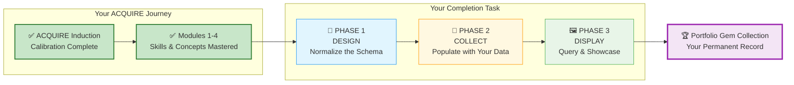
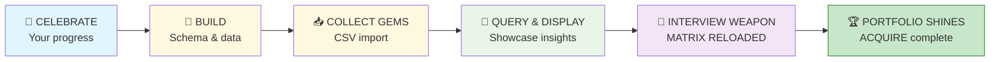
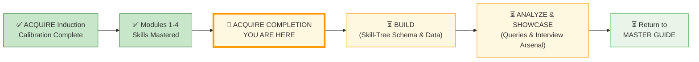

# 🗄️🤖 SQL & GenAI Course
**🎯 Quality Education for Anyone, Anywhere, Anytime — 💫 with Comfort, Convenience at no Cost**

---

## 🏆 ACQUIRE COMPLETION: The Gemstone Vault & Schema Blueprint

## 💌 A Brief from the Designer

Hello, Artisan.

If you are reading this, you have done something extraordinary. You have stayed the course through four modules, countless queries, late nights of debugging, and moments of quiet triumph when a complex `JOIN` finally clicked.

This task is not a test. It is a **celebration**. You are going to build a **database** of your own **learning journey.**

You are building a **Skill‑Tree database** – a permanent, queryable record of every skill you mastered, every insight you gathered, and every challenge you overcame. When you finish, you will have a portfolio piece that proves, in SQL itself, that you have **transformed** from a learner into a **Data Artisan.**

| 🌳 **Your Skill‑Tree Database = Your Live Transcript for Recruiters** |
|:---------------------------------------------------------------------|
| A permanent, queryable record of every skill, insight, and challenge – proving your transformation from learner to Data Artisan. |

The database you build will capture your entire journey from **Day 1** in the ACQUIRE phase to ACCELERATE, ANALYZE and ARCHITECT phases in **Level 1**.  This is **not a one‑time task** – it’s a **living record** that will grow with you throughout level 1. You are simply **kick‑starting** it now, not finishing it.

Take a deep breath. Open your Vault. Let's begin.

**The SQLVerse is proud of you.**

---

You have already completed your ACQUIRE Induction and mastered Modules 1–4. Now, your completion task has three phases:

---

## 🌌 SQLVerse Check-In

**You are no longer a student. You are a Data Artisan.** This is not a test – it’s a celebration. Your database will prove your transformation.

**The difference between a coder and an Artisan is discipline.**

---

## 🧭 Your ACQUIRE Completion Journey

---

## 🔧 Tools You'll Need

| Tab | Purpose |
|-----|---------|
| **Tab 1 (The Map)** | Course files – all concept files, reference guides, and module content from Modules 1–4 |
| **Tab 2 (The Factory)** | SQLite Online – to create tables, insert data, and run queries |
| **Tab 3 (The Consultant)** | AI Co-pilot – for conceptual guidance (configured with Student Mode Prompt) |
| **Tab 4 (The Vault)** | Your GitHub repository – to save all files |

> 💡 **Note:** You will need to refer to the course files extensively to extract your learning data. Keep Tab 1 open as you work through this task.

---

## 📍 Your Progress Tracker

###  🧭 How This Works

**This document is your mission control.** Your ACQUIRE Completion is split into two logical parts:

1. **BUILD** (Parts 0–2) – You will design your database schema (the “Skill‑Tree”), then collect and add your learning data using a professional CSV import workflow. This creates the permanent record of your journey.

2. **ANALYZE & SHOWCASE** (Parts 3–4) – You will query your data to uncover insights, build your portfolio README, and prepare the **MATRIX RELOADED** interview weapon that turns your database into a live demo for employers.

Work through BUILD first. Once your database is populated, move to ANALYZE & SHOWCASE. Each step builds on the previous.

- 🎉 **PART 0 – Celebrate Your Journey** (in BUILD)
- 🧱 **PART 1 – Build Your Core Schema** (in BUILD)
- 📥 **PART 2 – Collect & Add Your Data (CSV Import)** (in BUILD)
- 🧠 **PART 3 – Query & Display the Gems** (in ANALYZE)
- 🧨 **PART 4 – Your Interview Weapon (MATRIX RELOADED)** (in ANALYZE)

---

## 💎 DESIGNER'S PERIGON

### *The Metadata Management*

You are applying every technical skill you have learned – Normalization, Schema design, JOIN logic, Aggregation – to the most personal data possible: your **Portfolio Capstone**.

You are not building a database. You are building a **relational engine** that proves your evolution from a student into a Data Artisan.

When an **interviewer** asks about your portfolio, you can simply say:

> *“I tracked my progression from basic `SELECT` to complex `JOIN` logic.”*

That’s not boasting. That’s **storytelling through data** – and your **Skill‑Tree database** proves every word of it.

---

## 🚀 Ready to Begin?

---

### 🧭 Navigation

| Previous Step | Next Step |
|:---:|:---:|
| – | ➡️ [Go to BUILD instructions](./Section1-ACQUIRE/SECTION1_COMPLETION_BUILD.md) |

---

*Part of our mission for 🎯 Quality Education for Anyone, Anywhere, Anytime — 💫 with Comfort, Convenience at no Cost.*

**Level 1 | ACQUIRE Completion | Mission Control**

