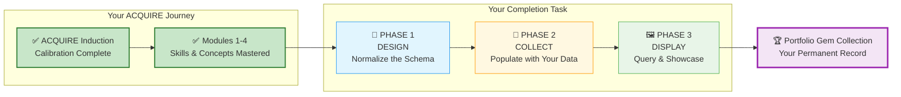

# 🗄️🤖 SQL & GenAI Course
**🎯 Quality Education for Anyone, Anywhere, Anytime — 💫 with Comfort, Convenience at no Cost**

---
## 🏆 ACQUIRE COMPLETION: The Gemstone Vault & Schema Blueprint

## 💌 A Brief from the Designer

Hello, Artisan.

If you are reading this, you have done something extraordinary. You have stayed the course through four modules, countless queries, late nights of debugging, and moments of quiet triumph when a complex `JOIN` finally clicked.

This task is not a test. It is a **celebration**.

You are going to build a database of your own learning journey – a permanent, queryable record of every skill you mastered, every insight you gathered, and every challenge you overcame. When you finish, you will have a portfolio piece that proves, in SQL itself, that you have transformed from a learner into a Data Artisan.

Take a deep breath. Open your Vault. Let's begin.

**The SQLVerse is proud of you.**

---

## 🚀 Level 1 Full Journey Support

This schema supports **ALL 4 phases** of Level 1:

| Phase | Modules | Focus |
|-------|---------|-------|
| 🟢 **ACQUIRE** | Modules 1-4 | Knowledge acquisition (Joins, SELECT, Normalization) |
| 🟡 **ACCELERATE** | Module 5 | AI partnership (GenAI SQL Co-pilot) |
| 🟠 **ANALYZE** | Module 6 + Bonus Projects | Project mastery & analysis |
| 🔴 **ARCHITECT** | Student-led projects | Independent mastery |

**Interview Query:** `SELECT phase_name, skill_name FROM skills_level1 ORDER BY phase_id;`

---

You have already completed your ACQUIRE Induction and mastered Modules 1–4. Now, your completion task has three phases:



---

## 📂 Where to Save Your Work

Create the following folder in your **Vault (Tab 4)** :

```
Projects/Level-1-beginner/ACQUIRE_COMPLETION/
```

Inside, you will save all files from this task.

```
ACQUIRE_COMPLETION/
├── README.md                          # Your completion report (use template below)
├── design/
│   ├── normalization-steps.md         # Your written reasoning
│   └── schema.sql                     # CREATE TABLE statements
├── collect/
│   ├── data-collection.md             # Notes on where you found each piece of data
│   └── insert-data.sql                # INSERT statements
└── display/
    └── queries.sql                    # SELECT queries (insights)
```

---

## 🔧 Tools You'll Need

| Tab | Purpose |
|-----|---------|
| **Tab 1 (The Map)** | Course files – all concept files, reference guides, and module content from Modules 1–4 |
| **Tab 2 (The Factory)** | SQLite Online – to create tables, insert data, and run queries |
| **Tab 3 (The Consultant)** | AI Co-pilot – for conceptual guidance (configured with Student Mode Prompt) |
| **Tab 4 (The Vault)** | Your GitHub repository – to save all files |

> 💡 **Note:** You will need to refer to the course files extensively to extract your learning data. Keep Tab 1 open as you work through this task.

---

## 🌌 SQLVerse Check-In

<div style="border-left: 4px solid #9c27b0; background-color: #f3e5f5; padding: 15px; margin: 20px 0; border-radius: 0 8px 8px 0;">

**You are no longer a student. You are a Data Artisan.** This task is your rite of passage – a chance to design, build, and query a database that tells the story of your own transformation.

**The difference between a coder and an Artisan is discipline.**

</div>

---

## 📐 PHASE 1: DESIGN – Crafting the Schema

### Step 0: The Flat Spreadsheet

Below is a flat, unnormalized table that contains information about your learning journey across Modules 1–4. It has **redundancy, update anomalies, insertion anomalies, and deletion anomalies**. Your job is to normalize it.

Only 4 rows are shown as examples. You will need to add all rows for your own learning journey (one row per skill, per learning objective, per bonus skill, etc.).

| phase_id | module_id | phase_name | module_name | skill_filename | skill_name | bonus_skill_name | bonus_skill_filename | bonus_skill_source | perigon_insight_text | perigon_source | perigon_filename | objective_text | student_viewpoint | quiz_score | exercise_filename | exercise_completed |
|----------|-----------|------------|-------------|----------------|------------|------------------|----------------------|-------------------|----------------------|----------------|------------------|----------------|-------------------|------------|-------------------|--------------------|
| 1 | 1 | ACQUIRE | Module 1: Intro to Databases | 1-what-is-a-database.md | What is a database? | NULL | NULL | NULL | "A spreadsheet is an aquarium; a database is an ocean." | Module 1 File 1 | 1-what-is-a-database.md | Explain what a database is | "The ocean analogy clicked for me" | 85 | 1-database-thinking.md | 1 |
| 1 | 1 | ACQUIRE | Module 1: Intro to Databases | 2-database-components.md | Database components | NULL | NULL | NULL | NULL | NULL | NULL | List three database components | "Tables, rows, columns, schema" | 85 | 2-real-world.md | 1 |
| 1 | 4 | ACQUIRE | Module 4: Joining Tables | 6-JoinConditions.md | ON vs WHERE Logic | CREATE TABLE | 0-refactoring-lab.md | Refactoring Lab | "A join is a bridge; a chain of joins is a story." | Module 4 File 6 | 6-JoinConditions.md | Write an INNER JOIN | "The bridge metaphor helped" | 92 | 1-inner-join.md | 1 |
| 1 | 4 | ACQUIRE | Module 4: Joining Tables | 6-JoinConditions.md | ON vs WHERE Joins | DELETE | 2-Foreign-Keys-Referential-Integrity.md | SQLVerse Architect's Blueprint | "Precision in the ON clause is precision in thought." | Module 4 File 6 | 6-JoinConditions.md | Write a LEFT JOIN | "ON vs WHERE is critical" | 92 | 2-left-join.md | 1 |

> 💡 **Note the subtle trap:** The same `skill_name` appears twice ("ON vs WHERE Logic" and "ON vs WHERE Joins") with different bonus skills. This creates a **transitive dependency** – the bonus skill doesn't actually depend on the `skill_name`, but on the `module`. You'll resolve this in 3NF.

> 💡 **You will need to expand this spreadsheet with all your own data** – skills, learning objectives, bonus skills, Perigon insights, quiz scores, and exercises from all four modules.

---

### Step 1: Identify Anomalies (The Structural Audit)

Before you touch the `CREATE` command, you must diagnose the "rot" in the flat spreadsheet. Look at the sample data and identify the following structural failures.

#### Redundancy (The Echo Effect)
- **Observation:** Look at the `module_name` and `quiz_score` columns.
- **The Problem:** If you have 15 skills in Module 4, you are typing "Module 4: Joining Tables" 15 times.
- **Your Task:** Explain why repeating the `module_name` for every single skill is a waste of space and a risk to data integrity.

*Write your reasoning:* `________________________________________________`

#### Update Anomaly (The Ripple Effect)
- **Scenario:** Imagine you decide to rename "Module 1: Intro to Databases" to "Module 1: Database Foundations."
- **The Problem:** How many rows would you have to change in the flat table? What happens if you miss one?
- **Your Task:** Describe the "Data Ghost" created when one row says "Foundations" and the other 10 still say "Intro."

*Write your reasoning:* `________________________________________________`

#### Insertion Anomaly (The "Wait-for-it" Problem)
- **Scenario:** You want to add "Module 5: Advanced Aggregations" to your plan, but you haven't learned any specific skills for it yet.
- **The Problem:** Can you add the module to this table if the `skill_name` cannot be NULL?
- **Your Task:** Explain why you shouldn't need a "skill" just to acknowledge that a "module" exists.

*Write your reasoning:* `________________________________________________`

#### Deletion Anomaly (The Burned Bridge)
- **Scenario:** You decide to remove the "INNER JOIN" skill from your record.
- **The Problem:** Look at that row. If you delete it, what happens to your record of the `quiz_score` for Module 4 or the `perigon_insight_text` associated with that row?
- **Your Task:** Explain how deleting a single *skill* could accidentally wipe out your entire *module progress record*.

*Write your reasoning:* `________________________________________________`

---

### Step 2: Normalize to 1NF

Identify any repeating groups or non‑atomic values. Show the split.

**Your 1NF result:** [Describe or show tables]

---

### Step 3: Normalize to 2NF

Identify partial dependencies (if any composite key exists). Show the split into separate tables.

**Your 2NF result:** [Describe or show tables]

---

### Step 4: Normalize to 3NF

Identify transitive dependencies. Show the final normalized schema.

**Your 3NF result:** [Describe or show tables]

---

## 🧭 Choose Your Schema Path

You have two valid ways to build your learning database. Read the trade‑offs, then pick **one** approach.

| Aspect | 🟢 Approach 1 (3NF – Basic) | 🔵 Approach 2 (Granular) |
|--------|-------------------------------|---------------------------|
| **Tables** | 6 tables: `phases_level1`, `modules_level1`, `skills_level1`, `bonus_skills_level1`, `insights_level1`, `achievements_level1` | 9 tables: Core tables (phases, modules, skills, bonuses, insights) + `quiz_scores_level1`, `exercise_completion_level1`, `report_deliverables_level1`, `simulation_results_level1` |
| **Achievements storage** | Single table with `achievement_type` column | Separate table per achievement type |
| **Query simplicity** | Easy to query across all achievement types | More tables, but each is single‑purpose |
| **Extensibility** | Adding a new achievement type requires no schema change (just new rows) | Adding a new type requires a new table – but allows type‑specific columns |
| **Best for** | Minimal complexity, quick setup | Long‑term tracking, production‑grade portfolio |

**Pick one.** Then follow the instructions for your chosen approach below.

---

## 🧱 Schema Choice — You Must Decide Early

Be careful here:

- 🟢 **Approach 1 (3NF Basic)** = clean, fast, interview‑friendly  
- 🔵 **Approach 2 (Granular)** = powerful, but time‑consuming

### Designer strongly recommends: **Pick 🟢 Approach 1 (3NF Basic)** for Level 1 completion.

#### Why (strategic reasoning):

- **Faster to implement** – you can finish the ACQUIRE Completion task without getting bogged down.
- **Easier to debug** – fewer tables mean simpler queries and fewer places for errors to hide.
- **Enough to demonstrate SQL mastery in interviews** – the “Toolbox Query” and “Integrity Check” work perfectly with Approach 1.

---

### 🔵 Choose Approach 2 (Granular) for Level 2 and Level 3

- **Level 2** → you will keep accumulating more simulations and projects. A granular schema will make it easier to add new types of achievements (e.g., advanced reports, real‑time dashboards).
- **Level 3** → you will work with a full‑fledged enterprise database (PostgreSQL or MS SQL Server). The granular design mirrors production schemas where each business entity has its own table.

> **In Level 2 you will learn advanced `INSERT` commands** that will help you transfer your data from Approach 1 tables to Approach 2 tables if you decide to upgrade later. You are not locked into your choice forever.

---

### 🎯 Designer’s Intent

- **Approach 1** builds **confidence**.  
- **Approach 2** builds **systems thinking**.

> *Sequence matters. Master the basics before scaling complexity.*

---

### 📝 Justify Your Schema Choice (Required)

After you implement your chosen schema, write a short justification (3–5 sentences) in your `README.md` or a separate `justification.md` file. Answer:

- Which approach did you choose and why?
- What trade‑offs did you consider (e.g., query simplicity vs future extensibility)?
- How does your choice align with your long‑term learning goals (e.g., extending this database through ACCELERATE, ANALYZE, ARCHITECT)?

**Save this justification in your Vault. It will be part of your portfolio.**

---

## 🟢 Approach 1: 3NF Schema (Basic)

```sql
-- ========================================
-- ACQUIRE COMPLETION: PHASE-ENABLED SCHEMA
-- Level 1 Full Journey: ACQUIRE → ARCHITECT
-- ========================================

-- 1. The Journey Map
CREATE TABLE phases_level1 (
    phase_id INTEGER PRIMARY KEY,
    phase_name TEXT NOT NULL UNIQUE,
    phase_description TEXT,
    start_module INTEGER
);

-- 2. The Curriculum
CREATE TABLE modules_level1 (
    module_id INTEGER PRIMARY KEY,
    module_name TEXT NOT NULL,
    phase_id INTEGER,
    folder_pattern TEXT,
    FOREIGN KEY (phase_id) REFERENCES phases_level1(phase_id)
);

-- 3. The Artisan's Skills (combines skills + learning objectives)
CREATE TABLE skills_level1 (
    skill_id INTEGER PRIMARY KEY,
    module_id INTEGER,
    filename TEXT NOT NULL,
    skill_name TEXT NOT NULL,
    objective_text TEXT,
    student_viewpoint TEXT,
    FOREIGN KEY (module_id) REFERENCES modules_level1(module_id)
);

-- 4. Bonus Skills (The "Extra Mile")
CREATE TABLE bonus_skills_level1 (
    bonus_skill_id INTEGER PRIMARY KEY,
    module_id INTEGER,
    bonus_skill_name TEXT NOT NULL,
    source_filename TEXT,
    FOREIGN KEY (module_id) REFERENCES modules_level1(module_id)
);

-- 5. Valuable Understanding (Perigon Insights)
CREATE TABLE insights_level1 (
    insight_id INTEGER PRIMARY KEY,
    insight_text TEXT NOT NULL,
    source_filename TEXT,
    module_id INTEGER,
    student_viewpoint TEXT,
    FOREIGN KEY (module_id) REFERENCES modules_level1(module_id)
);

-- 6. The Performance Record (quizzes + exercises + reports + simulations)
CREATE TABLE achievements_level1 (
    achievement_id INTEGER PRIMARY KEY,
    achievement_type TEXT, -- 'Quiz', 'Exercise', 'Report', 'Simulation'
    module_id INTEGER,
    source_filename TEXT,
    score_or_status TEXT,
    student_viewpoint TEXT,
    FOREIGN KEY (module_id) REFERENCES modules_level1(module_id)
);
```

**Seed Data (Phases & Modules):**

```sql
INSERT INTO phases_level1 (phase_id, phase_name, phase_description, start_module) VALUES
(1, 'ACQUIRE', 'Knowledge acquisition: Modules 1-4', 1),
(2, 'ACCELERATE', 'AI partnership: Module 5', 5),
(3, 'ANALYZE', 'Project mastery: Module 6 + Bonus Projects', 6),
(4, 'ARCHITECT', 'Independent mastery: Student-led projects', 7);

INSERT INTO modules_level1 (module_id, module_name, phase_id, folder_pattern) VALUES
(1, 'Module 1: Introduction to Databases & AI Co-pilot', 1, '1-sqlCommands/'),
(2, 'Module 2: Basic Retrieval – SELECT & WHERE', 1, '1-sqlCommands/'),
(3, 'Module 3: Aggregate Functions & Sorting', 1, '1-sqlCommands/'),
(4, 'Module 4: Joining Tables Mastery', 1, '1-sqlCommands/');
```

**Example INSERT for achievements (simulations, reports):**

```sql
INSERT INTO achievements_level1 (achievement_id, achievement_type, module_id, source_filename, score_or_status, student_viewpoint) VALUES
(100, 'Simulation', 4, 'cto_simulation_answers.md', 'Completed', 'Ravi’s mall taught me to handle missing phone numbers.'),
(101, 'Simulation', 4, 'ceo_simulation_answers.md', 'Completed', 'Annie’s event data showed how cross‑domain joins reveal margin leaks.'),
(102, 'Simulation', 4, 'cfo_simulation_answers.md', 'Completed', 'Simon’s expo forced me to think about profitability and SLA tracking.');
```

---

## 🔵 Approach 2: Granular Schema (Separate Achievement Tables)

**Core tables** (same as Approach 1 for phases, modules, skills, bonuses, insights):

```sql
-- Core tables (identical to Approach 1)
CREATE TABLE phases_level1 (...);
CREATE TABLE modules_level1 (...);
CREATE TABLE skills_level1 (...);
CREATE TABLE bonus_skills_level1 (...);
CREATE TABLE insights_level1 (...);

-- Granular achievement tables
CREATE TABLE quiz_scores_level1 (
    quiz_id INTEGER PRIMARY KEY,
    module_id INTEGER,
    score INTEGER,
    max_score INTEGER,
    attempt_date DATE,
    student_viewpoint TEXT,
    FOREIGN KEY (module_id) REFERENCES modules_level1(module_id)
);

CREATE TABLE exercise_completion_level1 (
    exercise_id INTEGER PRIMARY KEY,
    module_id INTEGER,
    exercise_name TEXT,
    completed_date DATE,
    time_taken_minutes INTEGER,
    student_viewpoint TEXT,
    FOREIGN KEY (module_id) REFERENCES modules_level1(module_id)
);

CREATE TABLE report_deliverables_level1 (
    report_id INTEGER PRIMARY KEY,
    module_id INTEGER,
    report_type TEXT,  -- 'CTO', 'CEO', 'CFO'
    submission_date DATE,
    portfolio_link TEXT,
    student_viewpoint TEXT,
    FOREIGN KEY (module_id) REFERENCES modules_level1(module_id)
);

CREATE TABLE simulation_results_level1 (
    simulation_id INTEGER PRIMARY KEY,
    module_id INTEGER,
    simulation_type TEXT,  -- 'CTO', 'CEO', 'CFO'
    completion_date DATE,
    self_score INTEGER,
    student_viewpoint TEXT,
    FOREIGN KEY (module_id) REFERENCES modules_level1(module_id)
);
```

**Example INSERT for simulations (granular):**

```sql
INSERT INTO simulation_results_level1 (simulation_id, module_id, simulation_type, completion_date, self_score, student_viewpoint) VALUES
(1, 4, 'CTO', '2025-05-02', 4, 'Ravi’s mall taught me to handle missing phone numbers.'),
(2, 4, 'CEO', '2025-05-02', 5, 'Annie’s event data showed how cross‑domain joins reveal margin leaks.'),
(3, 4, 'CFO', '2025-05-02', 4, 'Simon’s expo forced me to think about profitability and SLA tracking.');
```

---

## 💎 PHASE 2: COLLECT – Mining the Gemstones

Now, populate your tables with **your actual data** – not sample data.

### Where to Find Information

- **Skills & learning objectives:** Module concept files (`1-sqlCommands/`)
- **Bonus skills:** Refactoring labs, dynamic data checks, bonus skill boxes in concept files
- **Perigon insights:** Search for `💎 DESIGNER'S PERIGON` across all Level 1 files
- **Quiz scores:** `moduleX-sql-quiz.md` and solutions files
- **Exercise completions:** Practice exercises and solutions
- **Reports & simulations:** Your own completed CTO, CEO, CFO reports and simulations (from `Capstone Reports/` and `simulations/`)

> 💡 **Refer to the Module‑by‑Module Reference in the original ACQUIRE Completion document for exact file locations.**

### Optional: Data Collection Notes

Create a file `collect/data-collection.md` to note where you found each piece of information (for future reference).

```markdown
## Module 3

**Skills:** Found in `1-sqlCommands/` folder – 1-order-by.md, 2-aggregate-functions.md, etc.
**Learning Objectives:** Extracted from Progress Check in each file (Files 1–5).
**Bonus Skills:** Bulk Insert from File 1; UPDATE from File 4; DELETE from SQLVerse Architect's Blueprint File 2.
**Perigon Insights:** Found two in File 5 – one about the garden, one about counting.
**Student Viewpoint:** Based on my notes from when I struggled with HAVING.
**Quiz Score:** 88 (saved in module3-quiz-answers.md)
**Exercises Completed:** All 5 files in 2-practiceExercises/
```

### Write INSERT Statements

Write `INSERT` statements to populate each table with your collected data. Use the example patterns above for your chosen approach.

**Save as:** `collect/insert-data.sql`

---

## 🖼️ PHASE 3: DISPLAY – The Artisan's Showcase

Now, query your own database to produce a "Completion Report."

### Required Queries (Write at least 5)

1. **Which module did I score the highest on the quiz?**  
   (Approach 1: `achievements_level1`; Approach 2: `quiz_scores_level1`)

2. **List all skills I learned in Module 3, with cleaned‑up names.**

3. **Show me all bonus skills across all modules.**

4. **Count how many practice exercises I completed.**

5. **Display each Perigon insight from Module 4, along with my viewpoint.**

6. **List all learning objectives for Module 2, along with my personal viewpoint.**

7. **Show all exercises I completed in Module 4 with my reflections.**

8. **Total number of skills per module.**

9. **Total number of bonus skills per module.**

### Portfolio Showcase Query

```sql
-- "My Transformation Report" (template – adjust for your schema)
SELECT 
    m.module_name,
    COUNT(s.skill_id) as skills_mastered,
    (SELECT AVG(score) FROM quiz_scores_level1 WHERE module_id = m.module_id) as avg_quiz_score,
    COUNT(e.exercise_id) as exercises_completed
FROM modules_level1 m
LEFT JOIN skills_level1 s ON m.module_id = s.module_id
LEFT JOIN exercise_completion_level1 e ON m.module_id = e.module_id
GROUP BY m.module_id
ORDER BY skills_mastered DESC;
```

### The Consistency Check (Proving Your Normalization Worked)

```sql
-- Find any modules that exist but have zero skills recorded
SELECT m.module_name
FROM modules_level1 m
LEFT JOIN skills_level1 s ON m.module_id = s.module_id
WHERE s.skill_id IS NULL;
```

### The "Toolbox" Query (The Interview Closer)

```sql
-- "The Artisan's Master Toolbox"
SELECT 
    p.phase_name,
    m.module_name,
    s.skill_name,
    s.filename AS proof_file
FROM phases_level1 p
JOIN modules_level1 m ON p.phase_id = m.phase_id
JOIN skills_level1 s ON m.module_id = s.module_id
ORDER BY p.phase_id, m.module_id;
```

### Your Legacy Query

```sql
SELECT insight_text 
FROM insights_level1 
WHERE student_viewpoint LIKE '%click%'
ORDER BY RANDOM() 
LIMIT 1;
```

**Save as:** `display/queries.sql`

---

### README.md Template

Create a `README.md` file in your `ACQUIRE_COMPLETION/` folder using this template:

```markdown
# 🏆 My Level 1 SQL Mastery Portfolio

## 📊 Transformation Dashboard
```
[PASTE YOUR DASHBOARD QUERY RESULT HERE]
```

## 🛠️ Full Toolbox (Interview Ready)
```
[PASTE TOOLBOX QUERY RESULT HERE]
```

## 📸 Screenshots


## 📝 Reflections
[Write a short paragraph about your journey through Modules 1–4]

## 🧭 Schema Justification
[Write your 3–5 sentence justification for the schema approach you chose]

**ACQUIRE → ARCHITECT: Complete Level 1 journey captured.**
```

---

## 🟢 MATRIX RELOADED: Your Interview Arsenal

<div style="border: 2px solid #2196f3; border-radius: 10px; padding: 15px; margin: 20px 0; background: #e3f2fd;">

**Welcome to the Dojo, Artisan.**

The queries below are not for learning. They are for **proving**. You have built a database of your own transformation. Now, you will learn to wield it as a weapon in the interview room.

**Three queries. One mission.** Leave no doubt that you are a Data Artisan.

</div>

### 🎯 Why This Matters

| Query | When to Use | Impact |
|-------|-------------|--------|
| **The Integrity Check** | "How did you design this?" | Shows schema mastery |
| **The Growth Trajectory** | "Tell me about your learning journey" | Shows self‑awareness & progress |
| **The Master Toolbox** | "What SQL skills do you have?" | **The knockout punch** |

---

## 🔵 Query 1: The Integrity Check

**Purpose:** Prove your database is normalized, your relationships are intact, and you understand schema design.

**When to use:** When the interviewer asks, *"Walk me through how you built this."*

```sql
-- THE INTEGRITY CHECK
-- Part A: Phases exist?
SELECT '✅ PHASES LOADED' AS status, COUNT(*) AS count FROM phases_level1;

-- Part B: Modules linked correctly?
SELECT 
    CASE 
        WHEN COUNT(*) = (SELECT COUNT(*) FROM modules_level1) 
        THEN '✅ ALL MODULES LINKED' 
        ELSE '⚠️ ORPHAN MODULES FOUND' 
    END AS relationship_status
FROM modules_level1 m
JOIN phases_level1 p ON m.phase_id = p.phase_id;

-- Part C: No orphaned skills (foreign key integrity)
SELECT 
    CASE 
        WHEN COUNT(*) = 0 
        THEN '✅ NO ORPHANED SKILLS' 
        ELSE '⚠️ ORPHAN SKILLS DETECTED' 
    END AS fk_integrity
FROM skills_level1 s
LEFT JOIN modules_level1 m ON s.module_id = m.module_id
WHERE m.module_id IS NULL;
```

**What this proves:** You understand foreign keys, referential integrity, and defensive query design.

---

## 🟡 Query 2: The Growth Trajectory

**Purpose:** Show your learning progression – which phases you mastered, how your skills accumulated, and where you improved.

**When to use:** When the interviewer asks, *"Tell me about your learning journey through Level 1."*

```sql
-- THE GROWTH TRAJECTORY
SELECT 
    p.phase_name,
    COUNT(DISTINCT m.module_id) AS modules_completed,
    COUNT(DISTINCT s.skill_id) AS skills_mastered,
    COUNT(DISTINCT b.bonus_skill_id) AS bonus_skills_earned,
    COUNT(DISTINCT a.achievement_id) AS achievements_logged,
    ROUND(AVG(CASE WHEN a.achievement_type = 'Quiz' THEN CAST(a.score_or_status AS REAL) END), 1) AS avg_quiz_score
FROM phases_level1 p
LEFT JOIN modules_level1 m ON p.phase_id = m.phase_id
LEFT JOIN skills_level1 s ON m.module_id = s.module_id
LEFT JOIN bonus_skills_level1 b ON m.module_id = b.module_id
LEFT JOIN achievements_level1 a ON m.module_id = a.module_id
GROUP BY p.phase_id
ORDER BY p.phase_id;
```

**What this proves:** You didn't just "do the work" – you **tracked your growth**.

---

## 🔴 Query 3: The Interview Closer (Master Toolbox)

**Purpose:** Flatten your entire journey into a single, undeniable skill matrix.

**When to use:** When the interviewer asks, *"So... what can you actually do?"*

**How to use:** Run this query. Slide the laptop toward them. Say nothing. Let the results speak.

```sql
-- THE MASTER TOOLBOX (Interview Closer)
SELECT 
    p.phase_name AS "🎯 Phase",
    m.module_name AS "📚 Module",
    s.skill_name AS "⚡ Skill",
    s.filename AS "📄 Proof"
FROM phases_level1 p
JOIN modules_level1 m ON p.phase_id = m.phase_id
JOIN skills_level1 s ON m.module_id = s.module_id
ORDER BY p.phase_id, m.module_id, s.skill_id;
```

**What this proves:** Everything. Every skill. Every module. Every phase. Documented. Verifiable. **Yours.**

---

### 🎯 The Interview Script

| Step | Action | Words (if any) |
|------|--------|----------------|
| **1** | Open your laptop | *"May I share my screen?"* |
| **2** | Navigate to Tab 2 (The Factory) | *"I built a database to track my own learning journey."* |
| **3** | Run Query 1 (Integrity Check) | *"The schema is normalized. No orphans. Clean foreign keys."* |
| **4** | Run Query 2 (Growth Trajectory) | *"Here's my progress across all 4 phases. Quiz scores improved 5% from Module 2 to Module 5."* |
| **5** | Run Query 3 (Master Toolbox) | *"And this... is everything I can do. Every skill. Every proof point. Ask me about any row."* |

**Then stop talking.** Let them scroll. Let them ask. You've already won.

---

### 📋 Interview Day Checklist

Copy this into your phone or print it:

```markdown
## 🎯 INTERVIEW DAY – SQL PORTFOLIO

**Before the interview:**
- [ ] Database loaded in Tab 2 (The Factory)
- [ ] All 3 queries saved and tested
- [ ] Screen sharing tested

**During the interview (if asked about SQL):**
- [ ] Query 1: Integrity Check – "Prove the design"
- [ ] Query 2: Growth Trajectory – "Show the journey"  
- [ ] Query 3: Master Toolbox – "Close the deal"

**The Golden Rule:** Run the query. Show the results. Let them ask the next question.
```

---

### 💡 The Designer's Secret

**Most candidates** talk about their skills.  
**You** will *run a query* that proves them.

**Most candidates** list "JOINs" on a resume.  
**You** will show 6 different join types with file paths as proof.

**Most candidates** hope the interviewer believes them.  
**You** will hand them the keyboard and say, *"Verify anything."*

**Most candidates** show the interviewer a static PDF.  
**You** are querying a *"live system"* that proves you can manage the metadata of your career.

| Impact Dimension | Rating |
|------------------|--------|
| **INTERVIEW IMPACT** | 💥 **NUCLEAR** |
| **FUTURE-PROOF** | 💎 **DIAMOND** |

**That is the difference between a coder and an Artisan.**

---

## 🌟 Why This Structure Works

| Principle | How It Applies |
|-----------|----------------|
| **Uniformity** | Even though ANALYZE (Module 6) is project‑based and ACQUIRE (Modules 1‑4) is concept‑based, the database treats them both as "Deliverables." |
| **Scalability** | When you start Level 2, you can simply create `_level2` tables or add a `level_id` column. |
| **The Interviewer Effect** | An interviewer will be impressed by the SQL query, but they will be **floored** by the fact that you designed the schema to be future‑proof. It proves **Architect‑level thinking** before you even finish Level 1. |

---

## ✅ Final Checklist

- [ ] I identified all four anomalies in the flat table.
- [ ] I normalized the data to 3NF on my own.
- [ ] I **chose a schema approach** (3NF or Granular) and **justified my choice** in the README.
- [ ] I wrote `CREATE TABLE` statements that run without errors.
- [ ] I wrote `INSERT` statements that populate all tables correctly.
- [ ] I wrote verification queries that return expected results.
- [ ] I saved all files in my Vault.
- [ ] I practiced the **Interview Script** with my 3 MATRIX RELOADED queries.
- [ ] I am proud of what I built.

---

## 💎 DESIGNER'S PERIGON

<div style="border: 3px solid #9c27b0; border-radius: 10px; padding: 20px; margin: 25px 0; background: linear-gradient(135deg, #f3e5f5 0%, #e1bee7 100%);">

### *The Art of Reflection*

You have done something remarkable. You didn't just learn SQL – you built a database of your own **learning journey**. Every table, every row, every foreign key represents a **gemstone** you mined from the **SQLVerse**. You have built a digital legacy – a **Persistent Professional Ledger**.

In the Artisan's Garden, this is the **final bouquet of the ACQUIRE phase** – a collection of flowers you grew, trimmed, and arranged yourself. The database you have built is a **"Skill‑Tree"** database that grows with you through the ACCELERATE, ANALYZE and ARCHITECT phases where you will be cultivating more and more **exotic floral beds** and harvesting precious **gemstones**.

> *“The best database you will ever design is the one that captures your own growth.”*

### 🌸 The Final Bouquet

**Transforms beginners → Architects with proof.**

| Day | Milestone |
|-----|-----------|
| **Day 1** | "Normalize my own data? Cool!" |
| **Day 3** | "My transformation report = wow!" |
| **Week 1** | "Portfolio screenshot → LinkedIn" |
| **Month 1** | "Interview: 'Show me your SQL portfolio'" |

**The SQLVerse expands. Your portfolio is proof.**

**What distinguishes SQLVerse from other courses?**  
Other courses will give you Interview Tips after Course Completion.  

In **SQLVerse – Uma Maheswari's Unique Universe**, the Artisans are interview‑ready and employable when they complete the course. The learning and interview preparation goes **parallely**.

*Wondering who is Uma Maheswari? The DESIGNER of SQLVerse – Yours truly.*

</div>

---

## 🧭 What's Next?

Return to the **Level 1 Master Guide** and proceed to the **ACCELERATE** phase.

➡️ **[Return to MASTER_GUIDE.md](./MASTER_GUIDE.md)**

---

*Part of our mission for 🎯 Quality Education for Anyone, Anywhere, Anytime — 💫 with Comfort, Convenience at no Cost.*

**Level 1 | ACQUIRE Completion | Next: ACCELERATE Phase**