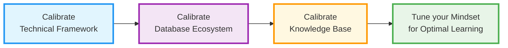
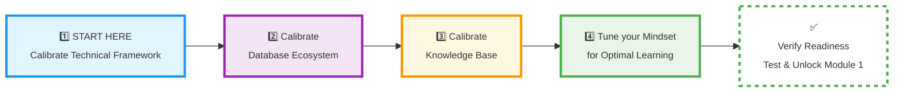

# 🗄️🤖 SQL & GenAI Course
**🎯 Quality Education for Anyone, Anywhere, Anytime — 💫 with Comfort, Convenience at no Cost**

## 🔴 SECTION 1 INDUCTION: ACQUIRE Foundation Skills

<table align="center" style="width: 90%; border-collapse: collapse; border: 2px solid #2196f3; border-radius: 8px; overflow: hidden; margin: 20px 0; background: #e3f2fd;">
<tr>
<td style="padding: 15px; text-align: center; border-right: 1px solid #90caf9;">
<h4 style="margin: 0; color: #0d47a1;">🎯 Focus</h4>
<p style="margin: 5px 0 0 0; font-weight: bold;">Foundation Building & Raw SQL Mastery</p>
</td>
<td style="padding: 15px; text-align: center; border-right: 1px solid #90caf9;">
<h4 style="margin: 0; color: #0d47a1;">⏱️ Duration</h4>
<p style="margin: 5px 0 0 0; font-weight: bold;">2–3 Days (The "Sharpening" Phase)</p>
</td>
<td style="padding: 15px; text-align: center;">
<h4 style="margin: 0; color: #0d47a1;">🤖 AI Status</h4>
<p style="margin: 5px 0 0 0; font-weight: bold;">Conceptual Guidance ONLY<br>(Zero Code Generation)</p>
</td>
</tr>
</table>

---

*"Give me six hours to chop down a tree and I will spend the first four sharpening the axe." — Abraham Lincoln*

**🎯 Purpose of this Induction**

This induction prepares you for the **first 'A' in the 4 A's progression** - the **ACQUIRE phase** where you build foundational SQL skills through conceptual understanding before AI collaboration.

Before you extract your first "Gemstone" (data point), you must ensure your environment is sterile and your mindset is clinical. In the ACQUIRE phase, we strip away the magic of AI to ensure your internal logic engine is built on solid rock, not shifting sand.

---

## 🏢 **Your Induction Journey: The Four Pillars of Calibration**

**🚀 Foundation First, AI Next, Projects Last.**  
**💎 Gemstone by Gemstone, Skill by Skill.**

This 3-day calibration follows a structured, professional sequence. Each pillar builds upon the previous, transforming any computer into a precision learning environment.

| Pillar | Duration | Core Focus | **Calibration Outcome** |
| :--- | :--- | :--- | :--- |
| **🏗️ 1. Technical Framework** | Day 1 | Browser Office & Tool Configuration | **Sterile Laboratory:** A perfectly configured 4-tab workspace with no cognitive shortcuts. |
| **🗄️ 2. Database Ecosystem** | Day 1 | Datasets, Schema Anchors & AI Rules | **Rules of Engagement:** Clear dual-dataset strategy and AI constrained to conceptual guidance only. |
| **📚 3. Knowledge Base** | Day 2 | Professional Documentation System | **The Vault:** A structured GitHub repository ready to preserve every gemstone and struggle. |
| **🧠 4. Mindset** | Day 3 | Learning Psychology & Identity Shift | **The Artisan's Ego:** Resilience to handle `Syntax Error` and the identity of a **Data Investigator.** |

**Total Time:** 2-3 hours over 3 days → **Result:** A perfectly calibrated workspace for Weeks 1-4 of foundational mastery.

---

## 📊 **SECTION 1 WORKFLOW: Your Foundation Building Journey**

```mermaid
flowchart LR
    A["<span style='font-size:14px'>💎<br/>ACQUIRE INDUCTION<br/>Foundation Gemstone Collection<br/>🤖 AI: Conceptual Polishing ONLY<br/>📍 You are here</span>"]
    B["<span style='font-size:14px'>🔍<br/>THE LENS<br/>SELECT & FROM<br/>Extract raw gemstones</span>"]
    C["<span style='font-size:14px'>🧹<br/>THE SIEVE<br/>WHERE Clause<br/>Filter impurities</span>"]
    D["<span style='font-size:14px'>⚖️<br/>THE COMPARATOR<br/>Operators<br/>Assess quality</span>"]
    E["<span style='font-size:14px'>📊<br/>THE ORGANIZER<br/>ORDER BY & LIMIT<br/>Arrange collection</span>"]
    F["<span style='font-size:14px'>💎<br/>FOUNDATION BUILT<br/>4 Core Gemstones Mastered<br/>Factory Protocol Active</span>"]
    G["<span style='font-size:14px'>🏆<br/>ACQUIRE COMPLETE<br/>✅ Watch Me → Now You Do It<br/>✅ Dual-Phase Mastery</span>"]
    
    A --> B --> C --> D --> E --> F --> G
    
    style A fill:#fff8e1,stroke:#ff9800,stroke-width:3px
    style B fill:#e1f5fe,stroke:#2196f3,stroke-width:2px
    style C fill:#e1f5fe,stroke:#2196f3,stroke-width:2px
    style D fill:#e1f5fe,stroke:#2196f3,stroke-width:2px
    style E fill:#e1f5fe,stroke:#2196f3,stroke-width:2px
    style F fill:#a5d6a7,stroke:#2e7d32,stroke-width:2px
    style G fill:#81c784,stroke:#2e7d32,stroke-width:3px
```



---

## 🏗️ **Visualizing the Calibration Architecture**

### 💎 **The Calibration Philosophy**

#### **The Professional's Secret**

Amateurs jump to content and fight their tools.  
Professionals calibrate their environment first, then focus entirely on skill building.

**You have chosen the professional path.**

### 🎯 **Your 3-Day Workspace Preparation**



### **Two Entry Paths - One Destination**

**Path A: Technical Guide Complete**
If you've finished the Technical Guide, this induction **recalibrates** your Browser Office for the ACQUIRE phase with specific configurations and boundaries.

**Path B: Starting Fresh**
If you're beginning here, this induction **includes** all necessary setup steps within the calibration process.

### **The Four-Step Calibration Sequence**

1. **🏗️ Calibrate Technical Framework** - Tools & environment optimization
2. **🗄️ Calibrate Database Ecosystem** - Datasets, schema anchors, AI rules
3. **📚 Calibrate Knowledge Base** - Documentation system & structure
4. **🧠 Tune your Mindset for Optimal Learning** - Learning psychology & preparation

**Each step builds on the previous.** Complete them in order for maximum effectiveness.

---

## 📋 **WHAT YOU'LL ACHIEVE**

### **By the End of This 3-Day Preparation:**

| **Day** | **Focus** | **Outcome** |
| :--- | :--- | :--- |
| **1** | Technical + Database | Fully configured Browser Office with clear boundaries |
| **2** | Knowledge Base | Professional GitHub Vault with documentation system |
| **3** | Mindset + Integration | Fortified psychology and readiness for Module 1 |

### **The Professional Advantage You Gain:**
1. **Environment Mastery:** Your tools work FOR you, not against you
2. **Boundary Clarity:** Clear rules prevent distraction and dependency
3. **Habit Formation:** Professional patterns established from day one
4. **Confidence Foundation:** Systematic preparation creates unshakable confidence

---

## 🛠️ YOUR CALIBRATION JOURNEY

## 🧭 THE ARTISAN'S PATH AHEAD

**As you begin your 3-day calibration, remember what you're building toward:**

**🎯 Pillar 1: The Sterile Laboratory**  
*"Your browser is not a collection of tabs. It is a calibrated workspace where each tab has a single purpose. You are not just opening browser tabs—you are architecting your learning environment."*

**🗃️ Pillar 2: The Database Ecosystem**  
*"You do not see databases as black boxes. You see them as structured landscapes you can map and navigate. You do not use AI as a crutch—you use it as a thinking partner that strengthens your own mind."*

**📚 Pillar 3: The Professional Vault**  
*"You document not to remember, but to understand. You structure not to organize, but to clarify. You preserve not to hoard, but to build. Your Vault is not storage—it's where learning becomes permanent evidence."*

**🧠 Pillar 4: The Artisan's Identity**  
*"You are not learning SQL. You are building data intuition. You are not memorizing syntax. You are internalizing structures."*

**These four pillars will transform you from a student into a data artisan. Begin your calibration.**

This is your actionable 3-day calibration plan. Follow the sequence below.

### 🚀 **PHASE 1: BEGIN YOUR CALIBRATION**
*[This is Day 0 - The Launch Pad]*

<div align="center" style="border: 3px solid #4caf50; border-radius: 10px; padding: 25px; margin: 30px 0; background: linear-gradient(135deg, #e8f5e8 0%, #f1f8e9 100%); box-shadow: 0 8px 20px rgba(76, 175, 80, 0.2);">

### **🎯 Your 3-Day Calibration Journey Navigation**

**Complete ALL 4 calibration steps, then proceed to verification:**



**🔒 Module 1 remains locked until ALL 4 calibration steps are completed and verified.**

# [▶️ **BEGIN STEP 1: TECHNICAL FRAMEWORK**](./Section1-ACQUIRE/1_Technical_Framework.md)

**Complete all 4 steps → Then go to verification → Unlock Module 1**

<small>*All four calibration steps must be completed before verification*</small>

</div>

### ✅ **WHAT HAPPENS AFTER CALIBRATION?**
*[After completing all 4 steps - Day 3+]*

**After completing Steps 1-4, your next action is:**

1. **Go to** [SECTION1 INDUCTION FINISH STEP](./SECTION1_INDUCTION_FINISH.md)
2. **Complete** the 16-point verification test
3. **If you score 10+ points:** You'll receive the Module 1 link immediately
4. **If you score ≤9 points:** Revisit the specific calibration steps needed

**Your Journey Path:**
```
Start Here → Step 1 → Step 2 → Step 3 → Step 4 → Verification → Module 1
```
---

<div align="center" style="margin-top: 40px; padding: 15px; background: #f5f5f5; border-radius: 6px; font-size: 0.9em;">

**Calibration Time:** 2-3 hours over 3 days  
**Verification Required:** Complete verification test in `SECTION1_INDUCTION_FINISH.md`  
**Module 1 Access:** Granted after passing verification (10+ points)  
**Remember:** Foundation First, AI Next, Projects Last. 💎 Gemstone by Gemstone.

</div>

---

*Part of our mission for 🎯 Quality Education for Anyone, Anywhere, Anytime — 💫 with Comfort, Convenience at no Cost.*

**Level 1 | ACQUIRE Phase | Begin Calibration | Module 1 Locked**


