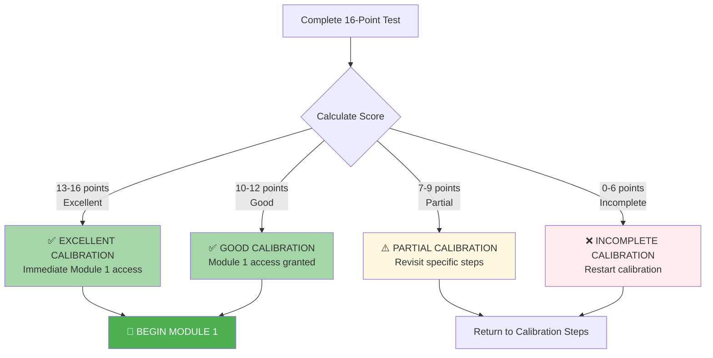

# 🗄️🤖 SQL & GenAI Course
**🎯 Quality Education for Anyone, Anywhere, Anytime — 💫 with Comfort, Convenience at no Cost**

## ✅ SECTION 1 INDUCTION COMPLETE: Verification & Module 1 Unlock
---

## 🎯 Quick Win Promise

**What you'll accomplish in 15-30 minutes:**
1. **Verify** your 3-day calibration was successful  
2. **Confirm** all 4 pillars of your learning environment are operational  
3. **Unlock** Module 1 with certified readiness  
4. **Begin** your foundation building journey with confidence  

**Prerequisite:** You must have completed ALL 4 calibration steps from [SECTION1_INDUCTION.md](./SECTION1_INDUCTION.md) before attempting verification.

---

## 🏢 The Browser Office: Your Verification Workspace

**🚀 Your Four Tabs for Verification:**

| Tab | Purpose in Verification | **Verification Activity** |
| :--- | :--- | :--- |
| **1: The Map** | Navigation & reference | Open this verification guide |
| **2: The Factory** | Dataset confirmation | Verify both databases accessible |
| **3: The Consultant** | AI boundary check | Confirm conceptual-only mode active |
| **4: The Vault** | Documentation access | Open your GitHub repository |

**🔍 Verification Method:** You'll test each Browser Office component as part of this verification.

---

## ⏱️ Step-by-Step Verification Process

### **Step 1: Complete the 16-Point Verification Test**
Assess each item honestly. This is your self-audit for learning readiness.

### **Step 2: Calculate Your Total Score**
Each checked item = 1 point. Maximum = 16 points.

### **Step 3: Follow Your Outcome Path**
- **10+ points:** Proceed to Module 1  
- **7-9 points:** Revisit specific calibration steps  
- **0-6 points:** Restart calibration process  

---

## 📋 POST-CALIBRATION READINESS TEST

### **🏗️ TECHNICAL FRAMEWORK VERIFICATION**
*Your Browser Office and tool configuration*

- [ ] **Four browser tabs properly configured** with correct tools and bookmarks
- [ ] **Practice databases loaded and accessible** in SQLite/SQLBrowser
- [ ] **AI boundaries set and confirmed** (GenAI limited to conceptual guidance only)
- [ ] **Workspace named and organized** with clear file structure

### **🗄️ DATABASE ECOSYSTEM VERIFICATION**
*Your data environment and AI rules*

- [ ] **Dual dataset strategy understood** (Training Institution + E-Store Basic)
- [ ] **Schema anchors available and referenced** when writing queries
- [ ] **AI boundary rules clear and enforced** (no code generation, only concepts)
- [ ] **Workflow between tabs efficient** and mentally mapped

### **📚 KNOWLEDGE BASE VERIFICATION**
*Your documentation and progress tracking system*

- [ ] **GitHub repository created and structured** with proper folders
- [ ] **Initial documentation commits completed** (at least 3 commits)
- [ ] **Daily tracking system established** for logging progress
- [ ] **Progress milestones defined** for the ACQUIRE phase

### **🧠 MINDSET VERIFICATION**
*Your learning psychology and preparation*

- [ ] **Foundation-first philosophy embraced** (skills before shortcuts)
- [ ] **Struggle management protocols in place** for handling errors
- [ ] **Learning commitment solidified** with dedicated time blocks
- [ ] **Module 1 goals set** and written down

---

## ✅ Validation & Gateway Decision

### **📊 SCORING MATRIX & OUTCOMES**

**Your Score:** ___ / 16  
**Minimum Passing Score:** 10/16 (62.5%)

---

## 📚 The Strategic Importance of Verification

### **Why This Verification Process Matters**

**Foundation First in Practice:** This verification implements our core "Foundation first, AI Next" philosophy by ensuring your learning environment is perfectly calibrated before you begin active learning. You're not just checking boxes—you're establishing the cognitive and technical foundation for genuine mastery.

**The Learning Psychology Behind This Approach:**

1. **Prevents "Hallucination of Competence"**  
   Without verification, you might think you're ready when you're not. This honest self-assessment ensures you can't fool yourself about your preparedness.

2. **Builds Genuine Confidence**  
   Verified readiness creates unshakable self-trust. When you encounter challenges in Module 1, you'll know your tools and mindset are solid—the issue is in the learning, not your setup.

3. **Eliminates Setup Friction**  
   Proper calibration means all tools work FOR you from day one. No time wasted troubleshooting during precious learning moments.

4. **Establishes Professional Standards**  
   Quality assurance from the beginning trains you to think like a professional who verifies their environment before beginning work.

### **The Socratic Method in Your Self-Assessment**

This test uses **self-assessment** (Socratic questioning) rather than external evaluation. You must honestly assess your own readiness, developing the critical self-awareness essential for professional growth. This isn't about passing a test—it's about learning to evaluate your own preparedness, a skill that will serve you throughout your career.

### **The Browser Office as a Cognitive Framework**

Your four-tab workspace isn't just a tool configuration—it's a **cognitive framework** that:
- **Separates concerns** (learning, doing, asking, documenting)
- **Establishes boundaries** (AI has specific, limited roles)
- **Creates workflow muscle memory** (professional patterns from day one)
- **Builds environmental mastery** (you control your tools, not vice versa)

### **Verification as Gateway Psychology**

By making Module 1 **deliberately inaccessible** until verification is passed, we:
- **Increase perceived value** of the learning to come
- **Create earned access** psychology (you've worked for this)
- **Establish quality standards** (nothing worthwhile comes without preparation)
- **Build anticipatory momentum** (you're excited to begin, not just proceeding)

**For Passing Students (10+ points):**  
You've not just configured tools—you've **engineered a learning environment**. This is what separates professionals from amateurs. Professionals don't just start working; they first ensure their workshop is properly equipped.

**For Non-Passing Students (≤9 points):**  
This is not failure—it's **early detection**. Finding gaps now prevents weeks of frustration later. The calibration process is designed to catch these issues before they sabotage your learning.

> **Remember:** The amateur practices until they get it right. The professional verifies they cannot get it wrong. This verification is your first step toward professional data craftsmanship.

---

## 🚀 Clear Next Step

### **If you scored 10+ points:**
**Congratulations!** Your verification is complete. You have successfully calibrated your learning environment and are now ready to begin building foundational SQL skills.

---

## 🏆 **YOUR ACQUIRE FOUNDATION: COMPLETE**

**You leave the ACQUIRE framework with more than skills—you've built a professional investigative system.** Each component serves a distinct purpose that together creates a seamless learning-to-execution pipeline.

### 🔄 **THE ECOSYSTEM YOU'VE CALIBRATED: YOUR PROFESSIONAL WORKSPACE**

**These four outcomes are powered by your Browser Office—a professional investigative system where four components work in concert:**

<h4 style="margin-top: 0; color: #ff9800;">🗺️ Tab 1: The Map</h4>

<strong>Your Gateway to Expertise</strong>

• <strong>✨ 19 Years of Curated Wisdom:</strong> Architected and presented to guide your path 
• <strong>📈 Progressive Complexity:</strong> Smooth guidance through technical and operational levels 
• <strong>🏗️ Project Building:</strong> Tools to create cutting-edge projects that showcase your capabilities

<h4 style="margin-top: 0; color: #2196f3;">🏭 Tab 2: The Factory</h4>

<strong>Your Crafting Workshop</strong>

• <strong>🏢 Professional Simulator:</strong> Mirrors isolated, focused environments of real-world development 
• <strong>🌐 Global Application Builder:</strong> Foundation for mobile, desktop, and web applications used worldwide 
• <strong>📱 Social Platform Foundation:</strong> Where platforms like Facebook, YouTube, and Instagram are built

<h4 style="margin-top: 0; color: #9c27b0;">🤖 Tab 3: The Consultant</h4>

<strong>Your Socratic Guide</strong>

• <strong>🎓 Concept Clarifier:</strong> Translates technical jargon into understandable language 
• <strong>⚡ Learning Accelerator:</strong> Keeps you unstuck and progressing forward 
• <strong>🧠 Socratic Guide:</strong> Teaches you how to think, not what to think

<h4 style="margin-top: 0; color: #4caf50;">🗄️ Tab 4: The Vault</h4>

<strong>Your Professional Foundation</strong>

• <strong>📚 Knowledge Base:</strong> Solved problems become reusable patterns for future challenges 
• <strong>🏆 Professional Showcase:</strong> Demonstrates not just what you know, but how you think and work 
• <strong>🚀 Career Springboard:</strong> Concrete examples for resumes, interviews, and promotions

### **The Orchestrated Flow You Now Command:**

**1. The Map directs** → **2. The Factory builds** → **3. The Consultant refines** → **4. The Vault preserves**

This isn't just four tabs—it's a **calibrated system** that transforms confusion into clarity, questions into insights, and learning into career capital. You've built the foundation; now use it.

---

### **🚀 THE ARTISAN'S CHARGE**

**You stand at the threshold, tools in hand, mindset forged.**

**The Factory awaits your craft.**  
**The Consultant stands ready to refine your thinking.**  
**The Vault stands open to receive your artifacts.**  
**Your Artisan Identity now guides your hand.**

**You are no longer a student trying to learn SQL.**  
**You are a Data Artisan, apprenticed to your own growth.**

**You leave the INDUCTION framework with:**
1. **A calibrated workspace** that reduces friction
2. **A proven investigation process** that builds real skill
3. **A professional documentation system** that accumulates evidence
4. **A resilient mindset** that transforms struggle into growth

**This is your foundation. Everything builds from here.**

> **🎉 Your First Artisan Ceremony:** Take 30 seconds. Close your eyes. Acknowledge that you've built what most never do: a professional learning foundation. Open your Vault. Look at your first investigation. You've already grown.

---

# [▶️ **BEGIN MODULE 1: THE LENS (SELECT & FROM)**](../Modules/Module1-Introduction-Database-AICo-pilot/README.md)

**Start your foundation building journey**  
*Extract your first gemstone with precision*

<small>⏱️ *Estimated time for Module 1: 3-5 days*</small>

### **If you scored 9 or below:**
**Action Required:** Your calibration needs additional work before beginning Module 1.

**Required Steps:**
1. **Review your score** to identify which areas need improvement
2. **Return to the specific calibration steps** where you missed points:
   - [Step 1: Technical Framework](./Section1-ACQUIRE/1_Technical_Framework.md)
   - [Step 2: Database Ecosystem](./Section1-ACQUIRE/2_Database_Ecosystem.md)  
   - [Step 3: Knowledge Base](./Section1-ACQUIRE/3_Knowledge_Base.md)
   - [Step 4: Mindset](./Section1-ACQUIRE/4_Mindset.md)
3. **Complete all missing configuration items** thoroughly
4. **Return here and retake this verification**

---

**Verification Time:** 15-30 minutes  
**Verification Requirement:** 10+ points (62.5%) to unlock Module 1  
**Next Step:** Module 1 - The Lens (SELECT & FROM)  
**Remember:** Foundation First, AI Next, Projects Last. 💎 Gemstone by Gemstone.

---

*Part of our mission for 🎯 Quality Education for Anyone, Anywhere, Anytime — 💫 with Comfort, Convenience at no Cost.*

**Level 1 | ACQUIRE Phase | Calibration Complete | Module 1 Ready**

