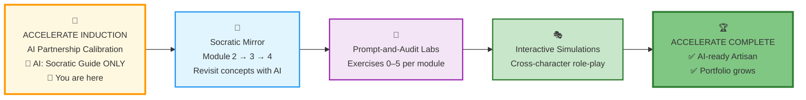
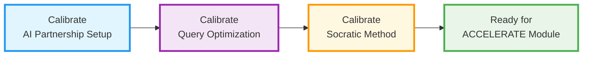
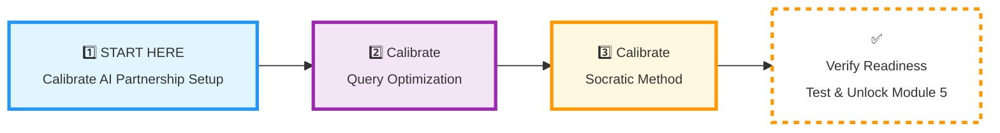

# 🗄️🤖 SQL & GenAI Course
**🎯 Quality Education for Anyone, Anywhere, Anytime — 💫 with Comfort, Convenience at no Cost**

---

## 🔴 SECTION 2 INDUCTION: ACCELERATE AI Partnership

<table align="center" style="width: 90%; border-collapse: collapse; border: 2px solid #ff9800; border-radius: 8px; overflow: hidden; margin: 20px 0; background: #fff8e1;">
<tr>
<td style="padding: 15px; text-align: center; border-right: 1px solid #ffcc80;">
<h4 style="margin: 0; color: #e65100;">🎯 Focus</h4>
<p style="margin: 5px 0 0 0; font-weight: bold;">AI‑augmented Review & Socratic Collaboration</p>
</td>
<td style="padding: 15px; text-align: center; border-right: 1px solid #ffcc80;">
<h4 style="margin: 0; color: #e65100;">⏱️ Duration</h4>
<p style="margin: 5px 0 0 0; font-weight: bold;">2–3 Days (The “Acceleration” Phase)</p>
</td>
<td style="padding: 15px; text-align: center;">
<h4 style="margin: 0; color: #e65100;">🤖 AI Status</h4>
<p style="margin: 5px 0 0 0; font-weight: bold;">Socratic Guide ONLY<br>(No Code Generation)</p>
</td>
</tr>
</table>

---

> *“Give me six hours to write a complex query, and I will spend the first four learning how to prompt the AI.”*  
> — *SQLVerse Artisan*

**🎯 Purpose of this Induction**

This induction prepares you for the **second ‘A’ in the 4 A’s progression** – the **ACCELERATE phase** where you revisit Level 1 topics (Modules 2, 3, and 4) with a Socratic AI Co‑pilot. You will **not** learn new SQL syntax. Instead, you will learn to:

- Prompt for logic, not code.
- Validate AI suggestions against your own manual mastery.
- Work at professional speed while keeping the AI a **mentor, not a ghostwriter**.

All six SQLVerse characters – **Arjun, Geetha, Raj, Ravi, Annie, Simon** – return to anchor every concept in a real business context.

---

## 📌 Note for ACCELERATE Induction

While working through ACCELERATE, you can **parallel‑ly keep building the Skill‑Tree database** you kick‑started in ACQUIRE Completion. This is relatively easy because we will be discussing the **same Modules (2, 3, and 4)** you already completed in ACQUIRE – now through the lens of AI Acceleration.

> *“Every time you revisit a concept, add a new row to your `skills_level1` or `insights_level1`. Your database grows as you grow.”*

> 💡 **A Note on Data Entry**  
> The ACQUIRE Completion task asked you to log a significant amount of data (skills, objectives, quiz scores, insights, etc.). To save you from manual `INSERT` syntax fatigue,  a professional **data loading technique** with Google Forms and CSV import was recommended. That same workflow will serve you well as you continue to grow your Skill‑Tree database during ACCELERATE – just add new rows to `skills_level1` or `insights_level1` whenever you revisit a concept.

---

## 🛩️ Pre‑flight Check: Is Your Skill‑Tree Database Ready?

Before you accelerate, confirm your ACQUIRE Completion database is healthy. Run these quick checks in Tab 2 (The Factory).

| Check | SQL to Run | ✅ Expected |
|-------|------------|-------------|
| **Phases exist** | `SELECT COUNT(*) FROM phases_level1;` | 4 rows (ACQUIRE, ACCELERATE, ANALYZE, ARCHITECT) |
| **Modules exist** | `SELECT COUNT(*) FROM modules_level1;` |  4 rows (Modules 1–4) |
| **Skills exist** | `SELECT COUNT(*) FROM skills_level1;` | At least **10 rows** (from your ACQUIRE journey) |
| **Insights exist** | `SELECT COUNT(*) FROM insights_level1;` | At least **5 rows** (Perigon wisdom) |

> ⚠️ **If any check fails**, return to `SECTION1_COMPLETION.md` and complete your database first. ACCELERATE builds directly on this foundation – don’t skip it.

Once all checks pass, proceed to the calibration pillars below.

---

## 🏢 **Your Induction Journey: The Three Pillars of AI Partnership**

**🚀 Foundation First, AI Next, Projects Last.**  
**💎 Gemstone by Gemstone, Skill by Skill.**

This 3‑day calibration prepares you to work with AI as a Socratic partner. Each pillar builds on the previous, transforming your learning environment into an AI‑augmented professional workspace.

| Pillar | Duration | Core Focus | **Calibration Outcome** |
| :--- | :--- | :--- | :--- |
| **🎭 1. AI Partnership Setup** | Day 1 | Guardrails, Persona & Socratic Journal | **AI as Mentor:** A configured co‑pilot that never writes code, only explains logic. |
| **⚡ 2. Query Optimization** | Day 2 | Efficiency Patterns & Anti‑Patterns | **Speed Mindset:** Knowing how to prompt for performance and spot AI hallucinations. |
| **🧠 3. Socratic Method** | Day 3 | Prompting Ladder, Validation, Context Feeding | **Critical Thinking:** The art of extracting reliable logic from an AI. |

**Total Time:** 2–3 hours over 3 days → **Result:** A calibrated AI partnership for the ACCELERATE module (Module 5).

---

## 📊 **SECTION 2 WORKFLOW: Your AI Acceleration Journey**



---

## 🏗️ **Visualizing the AI Partnership Architecture**

### 💎 **The Acceleration Philosophy**

#### **The Professional’s Secret**

Amateurs ask AI to write code.  
Professionals ask AI to sharpen their thinking.

**You have chosen the professional path.**

### 🎯 **Your 3‑Day AI Partnership Preparation**



### Your Entry Point – One Clear Path

You enter the ACCELERATE phase **only after** you have completed the **ACQUIRE Completion** task. This means you already have:

- Finished all four ACQUIRE modules (1–4)
- Built your normalized Skill‑Tree database (`phases_level1`, `modules_level1`, `skills_level1`, etc.)
- Populated it with your learning data (using either manual `INSERT` or the CSV import workflow)

> ⚠️ **If you have not completed ACQUIRE Completion, stop here.** Go back to `SECTION1_COMPLETION.md` and finish that first. ACCELERATE builds directly on your existing database.

Once your Skill‑Tree database is ready, proceed with the three calibration steps below.


### **The Three‑Step Calibration Sequence**

1. **🎭 Calibrate AI Partnership Setup** – Guardrails, persona, Socratic Journal
2. **⚡ Calibrate Query Optimization** – Efficiency patterns, anti‑patterns, speed challenges
3. **🧠 Calibrate Socratic Method** – Prompting ladder, validation checklist, context feeding

**Each step builds on the previous.** Complete them in order for maximum effectiveness.

---

## 📋 **WHAT YOU’LL ACHIEVE**

### **By the End of This 3‑Day Preparation:**

| **Day** | **Focus** | **Outcome** |
| :--- | :--- | :--- |
| **1** | AI Partnership Setup | Socratic Journal configured, AI persona fixed to “never write code” |
| **2** | Query Optimization | Ability to prompt for performance and spot AI hallucinations |
| **3** | Socratic Method + Integration | Mastery of the Prompting Ladder and validation checks |

### **The Professional Advantage You Gain:**
1. **AI Collaboration Mastery:** You lead the AI – it never leads you.
2. **Faster Problem‑Solving:** You use AI to reason, not to type.
3. **Portfolio Continuity:** Your Skill‑Tree database grows with every revisited concept.
4. **Interview Readiness:** You can explain *why* a query works, not just that it runs.

---

## 🛠️ YOUR CALIBRATION JOURNEY

## 🧭 THE ARTISAN’S PATH AHEAD

> *“The master craftsman never blames his tools; he sharpens his own mind.”*  
> — *SQLVerse Proverb*

**As you begin your 3‑day calibration, remember what you’re building toward:**

**🎭 Pillar 1: The Socratic Journal**  
*“You don’t ask AI for code. You ask: ‘What is the logical relationship between these entities?’ Then you write the SQL yourself. Every dialogue is logged in your Vault – proof of your thinking, not just your typing.”*

**⚡ Pillar 2: Speed & Efficiency**  
*“You know that `SELECT *` is a lie. You know that `LIMIT` is your friend. You spot an AI hallucination before it runs. You don’t just write queries – you engineer them for performance.”*

**🧠 Pillar 3: The Socratic Method**  
*“You climb the Prompting Ladder: from ‘I’m stuck’ to ‘Explain the relationship between these two tables.’ You validate every AI answer with five questions. You feed the AI your schema so its advice is grounded in reality.”*

**These three pillars will transform you from a manual SQL coder into an AI‑accelerated Artisan. Begin your calibration.**

This is your actionable 3‑day calibration plan. Follow the sequence below.

### 🚀 **PHASE 1: BEGIN YOUR CALIBRATION**
*[This is Day 0 – The Launch Pad]*

<div align="center" style="border: 3px solid #ff9800; border-radius: 10px; padding: 25px; margin: 30px 0; background: linear-gradient(135deg, #fff8e1 0%, #ffe0b2 100%); box-shadow: 0 8px 20px rgba(255, 152, 0, 0.2);">

### **🎯 Your 3‑Day Calibration Journey Navigation**

**Complete ALL 3 calibration steps, then proceed to verification:**



**🔒 Module 5 (ACCELERATE) remains locked until ALL 3 calibration steps are completed and verified.**

# [▶️ **BEGIN STEP 1: AI PARTNERSHIP SETUP**](./Section2-ACCELERATE/1_AI_Partnership_Setup.md)

**Complete all 3 steps → Then go to verification → Unlock Module 5**

<small>*All three calibration steps must be completed before verification*</small>

</div>

### ✅ **WHAT HAPPENS AFTER CALIBRATION?**
*[After completing all 3 steps – Day 3+]*

**After completing Steps 1‑3, your next action is:**

1. **Go to** [SECTION2 INDUCTION FINISH STEP](./SECTION2_INDUCTION_FINISH.md)
2. **Complete** the verification test
3. **If you pass:** You’ll receive the Module 5 link immediately
4. **If you need more practice:** Revisit the specific calibration steps

**Your Journey Path:**
```
Start Here → Step 1 → Step 2 → Step 3 → Verification → Module 5
```

---

<div align="center" style="margin-top: 40px; padding: 15px; background: #f5f5f5; border-radius: 6px; font-size: 0.9em;">

**Calibration Time:** 2‑3 hours over 3 days  
**Verification Required:** Complete verification test in `SECTION2_INDUCTION_FINISH.md`  
**Module 5 Access:** Granted after passing verification  
**Remember:** AI is your Socratic mentor – never your ghostwriter.

</div>

---

*Part of our mission for 🎯 Quality Education for Anyone, Anywhere, Anytime — 💫 with Comfort, Convenience at no Cost.*

**Level 1 | ACCELERATE Phase | Begin Calibration | Module 5 Locked**