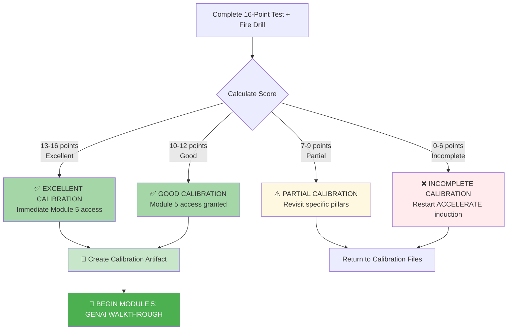

# 🗄️🤖 SQL & GenAI Course
**🎯 Quality Education for Anyone, Anywhere, Anytime — 💫 with Comfort, Convenience at no Cost**

---

## ✅ SECTION 2 INDUCTION COMPLETE: Verification & Module 5 Unlock


## 🎯 Quick Win Promise

**What you'll accomplish in 15-30 minutes:**
1. **Verify** your 4‑pillar calibration (AI Partnership, Query Optimization, Socratic Method, Mirror Bridge + Vault Build)
2. **Confirm** all ACCELERATE tools and mental models are operational
3. **Unlock Module 5** (GenAI SQL Co‑pilot Walkthrough) with certified readiness
4. **Create a permanent calibration artifact** – proof of your AI collaboration discipline

**Prerequisite:** You must have completed ALL 4 calibration steps (Pillars 1‑3 and 4a+4b) from the ACCELERATE induction files before attempting verification.

---

## 🏢 The Browser Office: Your ACCELERATE Verification Workspace

**🚀 Your Four Tabs for Verification:**

| Tab | Purpose in ACCELERATE | **Verification Activity** |
| :--- | :--- | :--- |
| **1: The Map** | Socratic Mirror files & induction guides | Open this verification guide and reference pillar files if needed |
| **2: The Factory** | Manual SQL execution | Run the `employees` table script and your final CEO query |
| **3: The Consultant** | Socratic AI mentor (no code generation) | Confirm persona is active, no code responses |
| **4: The Vault** | Permanent ACCELERATE Vault (`INDUCTION_TASKS/`, `Socratic_Journals/`, etc.) | Locate your migrated scratchpad, Fire Drill logs, and culmination challenge file |

> *“The same four tabs, now tuned for AI acceleration.”*

---

## ⏱️ Step-by-Step Verification Process

### **Step 1: Complete the 16-Point Verification Test**
Assess each item honestly. This is your self‑audit for ACCELERATE readiness.

### **Step 2: Calculate Your Total Score**
Each checked item = 1 point. Maximum = 16 points.

### **Step 3: Follow Your Outcome Path**
- **10+ points:** Proceed to Module 5 and create your calibration artifact.
- **7-9 points:** Revisit specific calibration pillars.
- **0-6 points:** Restart the ACCELERATE induction process.

---

## 📋 ACCELERATE READINESS TEST (4 Pillars × 4 Items)

### **🤖 PILLAR 1: AI PARTNERSHIP SETUP**
*Persona, No‑Code rule, and temporary capture workspace*

- [ ] **AI persona configured** – Your AI Consultant (Tab 3) has the Socratic SQL Mentor prompt and never writes code.
- [ ] **6‑step configuration completed** – You fed generic schema anchors, character stories, verified the persona, and set recovery protocol.
- [ ] **`Temporary Scratchpad` created** – A single text file exists (as specified in Pillar 1) containing your raw Socratic dialogues from Pillars 1‑3.
- [ ] **No‑Code guardrails internalised** – You can distinguish between “Never ask” and “Instead ask” without looking at the table.

### **⚡ PILLAR 2: QUERY OPTIMIZATION**
*Performance patterns, anti‑patterns, and index reasoning*

- [ ] **Execution order understood** – You know that SQL executes `FROM → WHERE → GROUP BY → HAVING → SELECT → ORDER BY → LIMIT`.
- [ ] **Index trade‑offs explained** – You can explain why an index speeds up `SELECT` but slows `INSERT`/`UPDATE`.
- [ ] **Common anti‑patterns spotted** – You can identify risks of `SELECT *`, missing `ON` clause, and filtering after joins.
- [ ] **Optimisation insights logged** – Your `Temporary Scratchpad` contains at least one dialogue about performance (e.g., full table scan vs index lookup).

### **🧠 PILLAR 3: SOCRATIC METHOD**
*Prompting Ladder, validation checklist, context feeding*

- [ ] **Prompting Ladder mastered** – You can ask Level 4 (System Architecture) questions without requesting code.
- [ ] **5‑point validation checklist used** – You consistently ask about NULLs, edge cases, SQLite syntax, scaling, and hidden assumptions.
- [ ] **Context feeding & reset understood** – You know when to load generic anchors (Modules 2‑3) and when to reset for Module 4 specialised databases.
- [ ] **Socratic dialogue logged** – Your `Temporary Scratchpad` contains a complete Socratic exchange (your prompt, AI’s logic, your manual SQL, reflection).

### **📚 PILLAR 4: MIRROR BRIDGE + VAULT BUILD**
*Structural isomorphism, permanent Vault, migration, and Fire Drill*

- [ ] **Mirror mapping understood** – You know that `01-The-Socratic-Mirror/ACQUIRE-MODULE*/` mirrors ACQUIRE `1-sqlCommands/` filenames 1:1.
- [ ] **Vault folder structure created** – Your `ACCELERATE/` folder contains `INDUCTION_TASKS/`, `Socratic_Journals/`, `01-The-Socratic-Mirror/`, `02-Exercises/`, `03-Solutions/`, `04-Interactive-Simulations/`.
- [ ] **Scratchpad migrated** – Your raw `Temporary Scratchpad` content has been moved to `ACCELERATE/INDUCTION_TASKS/` and reformatted using the Quick Summary Format (at least 3 entries).
- [ ] **Fire Drill completed (Tiers 1‑4)** – You have passed the practical verification below and saved the `fire_drill_results.md` and `culmination_challenge.md` in `INDUCTION_TASKS/` or `Socratic_Journals/`.

---

## 🧪 Fire Drill – Practical Verification (Required for Pillar 4)

Complete all four tiers. Log your results in `fire_drill_results.md` (save in `ACCELERATE/INDUCTION_TASKS/`).

### 🔥 Tier 1 – Persona Retrieval (60 seconds)

**Goal:** Find the 6‑step AI configuration workflow without searching.

**Source:** Your memory or Vault (`AI_PERSONA_PROMPT.md`)

**Check if you can list the 6 steps:**
1. Provide generic schema context
2. Feed character stories
3. Copy persona prompt
4. Veracity check
5. Quick test
6. Recovery protocol

✅ **Pass** if you recalled all 6 steps (or found them in under 60s).

### 🔥🔥 Tier 2 – Context Retrieval (60 seconds)

**Goal:** Recall the 5‑step context feeding strategy.

**Source:** `BROWSER-OFFICE-ACCELERATE.md` (or your notes)

**Check if you can list:**
1. Feed character stories first
2. Understand two‑tier context strategy
3. Load generic schema anchors (Modules 2‑3)
4. Use file‑specific context boxes (Module 4)
5. Reset instruction when switching databases

✅ **Pass** if you recalled all 5 steps.

### 🔥🔥🔥 Tier 3 – Schema Anchor Retrieval (2 minutes)

**Goal:** Find `tourism_planet_self_join.db` schema anchor and list its tables.

**Source:** `Module5-GenAI-Walkthrough/schema_anchors/SCHEMA_ANCHOR_TOURISM_SELF_JOIN.md`

✅ **Pass** if you located the file and listed at least 4 tables (e.g., `tours`, `guides`, `customers`, `bookings`).

### 🔥🔥🔥🔥 Tier 4 – Culmination Challenge (Integration)

**Goal:** Complete the full Socratic workflow in under 10 minutes.

**Scenario:** You are given a fresh SQLite database with a single table `employees`. You need to find the CEO (the employee with no manager).

**Starting Point – Create the `employees` table in Tab 2:**

```sql
CREATE TABLE employees (
    employee_id INTEGER PRIMARY KEY,
    name TEXT NOT NULL,
    manager_id INTEGER
);

INSERT INTO employees (employee_id, name, manager_id) VALUES
(1, 'Alice', NULL),
(2, 'Bob', 1),
(3, 'Charlie', 1),
(4, 'Diana', 2),
(5, 'Eve', 2);
```

**Your Tasks:**

| Step | Action |
|------|--------|
| 1 | **Feed context** – Tell the AI the table structure |
| 2 | **Ask a Socratic question** – “What is the logical relationship between employee_id and manager_id? Explain how to find the CEO without writing SQL.” |
| 3 | **Detect a hallucination** – If AI writes code, redirect: “Explain the logic, don’t write SQL.” |
| 4 | **Write SQL manually** – Based on AI’s logic, write the query to find the CEO. |
| 5 | **Validate** – Ask the AI: “Does this handle multiple CEOs? What if the table is empty?” |
| 6 | **Log** – Save the dialogue and final SQL in `ACCELERATE/INDUCTION_TASKS/culmination_challenge.md` using the Quick Summary Format. |

**Expected SQL:**
```sql
SELECT employee_id, name
FROM employees
WHERE manager_id IS NULL;
```

**Pass Criteria:** All 6 steps completed, no code generated by AI, final SQL correct, log saved.

---

### Bonus: Recovery Under Failure Scenario (Reflective)

**Scenario:** The AI ignores your instructions and keeps generating SQL code despite repeated requests to “explain logic only.”

**Write your answers in `fire_drill_results.md`:**

1. **How would you reset the AI’s context?** (Hint: Use the reset instruction from Pillar 3.)
2. **How would you reinforce the persona prompt?**
3. **When would you restart the session entirely?**
4. **What would you feed again after restarting?** (Generic anchors, character stories, etc.)

✅ **Pass** if you can describe a clear recovery sequence (no need to execute – just demonstrate understanding).

---

## 📊 Fire Drill Results Log Template

Save as `fire_drill_results.md` in `ACCELERATE/INDUCTION_TASKS/`.

```markdown
## Fire Drill Results - ACCELERATE - [Date]

### Tier 1: Persona Retrieval
- **Time taken:** ___ seconds
- **Steps completed:** [Yes/No]
- **Confidence:** [High/Medium/Low]

### Tier 2: Context Retrieval
- **Time taken:** ___ seconds
- **Steps completed:** [Yes/No]
- **Insight:** [One thing you noticed about the context strategy]

### Tier 3: Schema Anchor Retrieval
- **Time taken:** ___ seconds
- **File found:** [Yes/No]
- **Tables listed:** [Number]

### Tier 4: Culmination Challenge
- **Time taken:** ___ minutes
- **AI wrote code?** [Yes/No – if yes, did you redirect?]
- **SQL correct?** [Yes/No]
- **Validation questions asked?** [List them]
- **Log saved?** [Yes/No]

### Bonus: Recovery Under Failure
- [ ] I described a clear recovery sequence.

### Total Time:** ___ minutes
### System Efficiency Score:** ___ /10

### Artisan's Reflection:
[One sentence about what this exercise revealed about your ACCELERATE mastery.]
```

---

## 📜 Calibration Passed Artifact

After you pass the verification, create the following file to **celebrate and document your achievement**.

**Create folder:** `ACCELERATE/CERTIFICATION/` (if not exists)

**Save as:** `calibration_passed.md`

```markdown
# ACCELERATE Calibration Complete

**Date:** [YYYY-MM-DD]
**Verification Score:** ___ / 16
**Fire Drill Status:** ✅ Passed (Tiers 1-4 + Recovery Scenario)
**Module 5 Access:** ✅ Granted

## Artisan's Note
[Write one sentence about your readiness to lead AI, not follow it.]

---
*“The Artisan doesn't ask for the answer. The Artisan asks for the path.”*
```

This file becomes part of your portfolio – proof of your AI collaboration discipline.

---

## ✅ Validation & Gateway Decision

### **📊 SCORING MATRIX & OUTCOMES**



**Your Score:** ___ / 16  
**Minimum Passing Score:** 10/16 (62.5%)

> **Note:** The Fire Drill (Tiers 1‑4) and the Recovery Scenario are included in the 16‑point test as items under Pillar 4. If you completed them successfully, count those items as checked.

---

## 🔄 What Changes in Module 5?

**Until now:**  
- You calibrated the system – persona, guardrails, vault, retrieval discipline.

**From Module 5 onward:**  
- You **operationalize** it.

You will now:
- Conduct full Socratic AI dialogues on real SQL concepts (Modules 2‑4).
- Validate AI logic using the 5‑point sanity protocol.
- Manually implement SQL from AI‑provided strategies.
- Build retrieval‑ready intelligence logs in `01-The-Socratic-Mirror/`.
- Tackle 8 interactive simulations with cross‑character role‑play.

> *“Calibration ends. Mastery begins.”*

---

## 🏆 THE ARTISAN’S CHARGE – ACCELERATE EDITION

**You leave the ACCELERATE induction with:**

1. **A calibrated AI partnership** – No‑code discipline, Socratic questioning, recovery skills.
2. **Performance intuition** – Index trade‑offs, anti‑patterns, execution order.
3. **A validated Vault** – `INDUCTION_TASKS/` with migrated scratchpad, Fire Drill logs, culmination challenge, and a calibration artifact.
4. **The Mirror Bridge** – You see the structural symmetry between manual and AI‑guided learning.

**The Factory (Tab 2) awaits your manual SQL.**  
**The Consultant (Tab 3) will sharpen your thinking – never type for you.**  
**The Vault (Tab 4) holds your proof.**

**You are no longer a student learning SQL.**  
**You are a Data Artisan who leads the AI, verifies its logic, and builds a permanent record of professional growth.**

> *“The Artisan doesn’t ask for the answer. The Artisan asks for the path – and then walks it alone, with AI as a compass.”*

---

## 🚀 Clear Next Step

### **If you scored 10+ points:**

**Congratulations!** Your ACCELERATE calibration is complete. You have proven that you can lead the AI, spot hallucinations, retrieve knowledge instantly, and log your reasoning.

Before moving to Module 5, **create your Calibration Artifact** as described above.

Then:

<div align="center" style="border: 3px solid #4caf50; border-radius: 10px; padding: 30px; margin: 30px 0; background: linear-gradient(135deg, #e8f5e8 0%, #f1f8e9 100%); box-shadow: 0 8px 20px rgba(76, 175, 80, 0.2);">

# [▶️ **BEGIN MODULE 5: GENAI SQL CO‑PILOT WALKTHROUGH**](../Module5-GenAI-Walkthrough/README.md)

**Start your AI‑accelerated SQL journey**  
*Learn to prompt, verify, and collaborate with AI as a Socratic mentor*

<small>⏱️ *Estimated time for Module 5: 5-7 days*</small>

</div>

### **If you scored 9 or below:**

**Action Required:** Your ACCELERATE calibration needs additional work before Module 5.

**Required Steps:**
1. **Review your score** to identify which pillars need reinforcement.
2. **Return to the specific calibration files:**
   - [Pillar 1: AI Partnership Setup](./Section2-ACCELERATE/1_AI_Partnership_Setup.md)
   - [Pillar 2: Query Optimization](./Section2-ACCELERATE/2_Query_Optimization.md)
   - [Pillar 3: Socratic Method](./Section2-ACCELERATE/3_Socratic_Method.md)
   - [Pillar 4a: Mirror Bridge](./Section2-ACCELERATE/4a_ACCELERATE_MIRROR.md)
   - [Pillar 4b: Vault Build](./Section2-ACCELERATE/4b_ACCELERATE_VAULT_BUILD.md)
3. **Re‑run the Fire Drill** (especially the Recovery Scenario) after addressing gaps.
4. **Return here and retake this verification**.

> *“Professional readiness means knowing when to pause and strengthen your foundation.”*

---

<div align="center" style="margin-top: 40px; padding: 15px; background: #f5f5f5; border-radius: 6px; font-size: 0.9em;">

**Verification Time:** 15-30 minutes  
**Verification Requirement:** 10+ points (62.5%) to unlock Module 5  
**Next Step:** Module 5 – GenAI SQL Co‑pilot Walkthrough  
**Remember:** You write the SQL. AI explains the logic. The Vault preserves the proof.

</div>

---

*Part of our mission for 🎯 Quality Education for Anyone, Anywhere, Anytime — 💫 with Comfort, Convenience at no Cost.*

**Level 1 | ACCELERATE Phase | Calibration Complete | Module 5 Ready**


