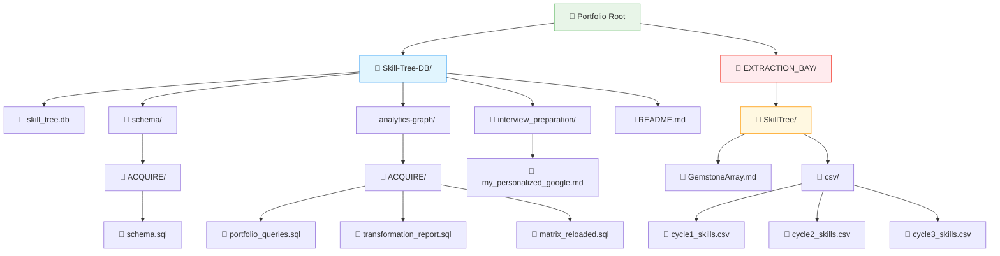
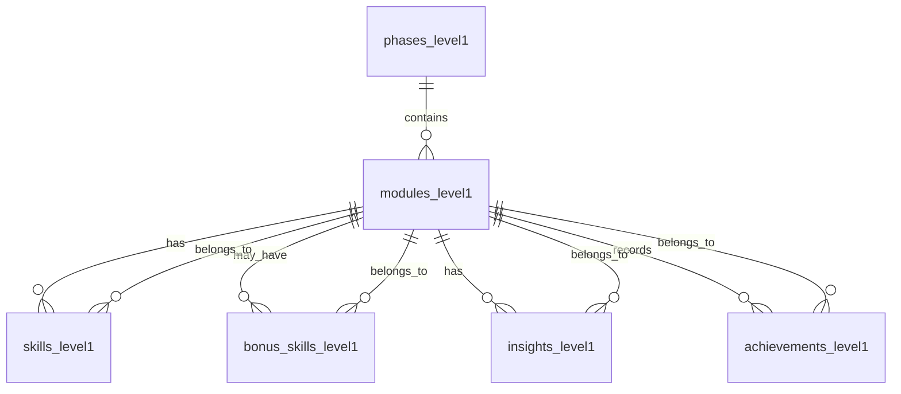

# 🗄️🤖 SQL & GenAI Course
**🎯 Quality Education for Anyone, Anywhere, Anytime — 💫 with Comfort, Convenience at no Cost**

---

# 🌲 SKILL‑TREE ARCHITECTURE: The Complete Reference

## 1. Philosophy

The **Skill‑Tree** is not a phase artifact. It is a **cross‑phase cognitive backbone** – a permanent, queryable knowledge graph that grows with you through ACQUIRE, ACCELERATE, ANALYZE, and ARCHITECT.

It sits at the **portfolio root**, separate from the curriculum flow. Every skill, insight, and pattern you extract becomes a node in this living database. By the end of Level 1, you will have a searchable record of your transformation.

---

## 2. 🏢 The Workspace Blueprint: Permanent Portfolio Tree



**Key points:**
- `Skill-Tree-DB/` is tracked in version control (your permanent portfolio).
- `EXTRACTION_BAY/` is **excluded** from version control (transient workspace).
- The `csv/` folder stores exported CSV files before import.

### Folder Structure (Full Architecture)

```
Portfolio Root/
├── Skill-Tree-DB/                         # Permanent knowledge graph (tracked in version control)
│   ├── skill_tree.db                      # Live SQLite database (opened in Tab 2)
│   │
│   ├── schema/                            # Phase‑by‑phase table definitions
│   │   ├── ACQUIRE/
│   │   │   └── schema.sql                 # CREATE TABLE statements
│   │   ├── ACCELERATE/                    # (future)
│   │   ├── ANALYZE/                       # (future)
│   │   └── ARCHITECT/                     # (future)
│   │
│   ├── analytics-graph/                   # Intelligence queries
│   │   ├── ACQUIRE/
│   │   │   ├── transformation_report.sql
│   │   │   ├── matrix_reloaded.sql
│   │   │   └── other_queries.sql
│   │   ├── ACCELERATE/                    # (future)
│   │   ├── ANALYZE/                       # (future)
│   │   └── ARCHITECT/                     # (future)
│   │
│   └── interview_preparation/             # Career readiness artifacts
│       └── my_personalized_google.md      # Your isomorphic mirror bridge proof

```
---

## 3. Core Table Schemas

This is the foundation of your permanent, queryable portfolio. All tables use `_level1` suffix to allow future levels (`_level2`, `_level3`) without breaking existing data.

### ACQUIRE COMPLETION: PHASE-ENABLED SCHEMA

**This table represents: The Journey Map**

### 3.1 `phases_level1`

| Column | Type | Description |
|--------|------|-------------|
| `phase_id` | INTEGER | Primary key |
| `phase_name` | TEXT | ACQUIRE, ACCELERATE, ANALYZE, ARCHITECT |
| `phase_description` | TEXT | Optional description |
| `start_module` | INTEGER | First module of the phase |

**This table represents: The Curriculum**

### 3.2 `modules_level1`

| Column | Type | Description |
|--------|------|-------------|
| `module_id` | INTEGER | Primary key |
| `module_name` | TEXT | e.g., 'Module 4: Joining Tables Mastery' |
| `phase_id` | INTEGER | Foreign key to `phases_level1` |
| `folder_pattern` | TEXT | e.g., '1-sqlCommands/' |

**This table represents: The Artisan's Core Skills**

### 3.3 `skills_level1`

| Column | Type | Description |
|--------|------|-------------|
| `skill_id` | INTEGER | Primary key |
| `module_id` | INTEGER | Foreign key to `modules_level1` |
| `filename` | TEXT | Concept file name |
| `skill_name` | TEXT | Name of the skill |
| `objective_text` | TEXT | Learning objective |
| `student_viewpoint` | TEXT | Personal reflection |

**This table represents: Bonus Skills**

### 3.4 `bonus_skills_level1`

| Column | Type | Description |
|--------|------|-------------|
| `bonus_skill_id` | INTEGER | Primary key |
| `module_id` | INTEGER | Foreign key to `modules_level1` |
| `bonus_skill_name` | TEXT | Name of the bonus skill |
| `source_filename` | TEXT | File where it appears |

**This table represents: The Perigon Insights**

### 3.5 `insights_level1`

| Column | Type | Description |
|--------|------|-------------|
| `insight_id` | INTEGER | Primary key |
| `insight_text` | TEXT | Perigon wisdom |
| `source_filename` | TEXT | File where insight appears |
| `module_id` | INTEGER | Foreign key to `modules_level1` |
| `student_viewpoint` | TEXT | Personal reflection |

**This table represents: The Artisan's Achievements**

### 3.6 `achievements_level1`

| Column | Type | Description |
|--------|------|-------------|
| `achievement_id` | INTEGER | Primary key |
| `achievement_type` | TEXT | 'Quiz', 'Exercise', 'Report', 'Simulation' |
| `module_id` | INTEGER | Foreign key to `modules_level1` |
| `source_filename` | TEXT | File name |
| `score_or_status` | TEXT | Score or completion status |
| `student_viewpoint` | TEXT | Personal reflection |

---

**Seed Data (Phases & Modules):**

```sql
INSERT INTO phases_level1 (phase_id, phase_name, phase_description, start_module) VALUES
(1, 'ACQUIRE', 'Knowledge acquisition: Modules 1-4', 1),
(2, 'ACCELERATE', 'AI partnership: Module 5', 5),
(3, 'ANALYZE', 'Project mastery: Module 6 + Bonus Projects', 6),
(4, 'ARCHITECT', 'Independent mastery: Student-led projects', 7);

INSERT INTO modules_level1 (module_id, module_name, phase_id, folder_pattern) VALUES
(1, 'Module 1: Introduction to Databases & AI Co-pilot', 1, '1-sqlCommands/'),
(2, 'Module 2: Basic Retrieval – SELECT & WHERE', 1, '1-sqlCommands/'),
(3, 'Module 3: Aggregate Functions & Sorting', 1, '1-sqlCommands/'),
(4, 'Module 4: Joining Tables Mastery', 1, '1-sqlCommands/');
```

---

## 4. Entity Relationship Diagram (ERD)



All relationships use `module_id` as the foreign key. No many‑to‑many relationships exist, which simplifies JOIN queries.

---
## 5. ACCELERATE Table Schemas

In ACCELERATE, you will capture not just the skills you learn, but the **process of interrogation** – the Socratic dialogue that led to those skills. The `socratic_logs_level1` table stores your probing questions, the AI's guidance, and your own reasoning shifts.

### 5.1 `socratic_logs_level1`

| Column | Type | Description |
|--------|------|-------------|
| `log_id` | INTEGER | Primary key |
| `module_id` | INTEGER | Foreign key to `modules_level1` (2, 3, or 4) |
| `sub_module` | TEXT | 'ACQUIRE-MODULE2', 'ACQUIRE-MODULE3', 'ACQUIRE-MODULE4' |
| `cycle` | TEXT | 'AUGMENT', 'APPLY', or 'AUDIT' |
| `filename` | TEXT | The concept file name (e.g., '1-the-sieve-select.md') |
| `structural_question` | TEXT | The probing question you asked the AI |
| `ai_guidance` | TEXT | The logic/strategy the AI suggested (no code) |
| `student_final_sql` | TEXT | Your manually written SQL after the Socratic dialogue |
| `initial_understanding` | TEXT | What you thought before the Socratic exchange |
| `realised_insight` | TEXT | What you learned from the exchange |

```sql
CREATE TABLE socratic_logs_level1 (
    log_id INTEGER PRIMARY KEY,
    module_id INTEGER,
    sub_module TEXT NOT NULL,
    cycle TEXT NOT NULL,
    filename TEXT NOT NULL,
    structural_question TEXT,
    ai_guidance TEXT,
    student_final_sql TEXT,
    initial_understanding TEXT,
    realised_insight TEXT,
    FOREIGN KEY (module_id) REFERENCES modules_level1(module_id),
    CHECK (cycle IN ('AUGMENT', 'APPLY', 'AUDIT'))
);
```

**Why this table matters:** It turns your Socratic dialogues into searchable, queryable assets. This is the evidence that you led the AI, not the other way around.

---

## 6. ETL Workflow for Populating the Skill‑Tree

### 📥 ETL Workflow for ACQUIRE

You have already populated your Skill‑Tree with complete ACQUIRE Module 1 data during the ACQUIRE Completion Phase using the strategy described in `SECTION1_COMPLETION_BUILD.md`.

### 📥 ETL Workflow for ACCELERATE, ANALYZE and ARCHITECT

In ACCELERATE, you will grow your Skill‑Tree further by extracting gemstones from Modules 2, 3, and 4 (ACQUIRE lessons, exercises, quizzes, solutions) plus gemstones from AI collaboration from all ACCELERATE files. By the time you complete ACCELERATE, your Skill‑Tree will be up to date with ACQUIRE and ACCELERATE data. 

For ACCELERATE, ANALYZE, and ARCHITECT you will use the ETL workflow described below, where the dedicated workspace `EXTRACTION_BAY` is used for accumulating gemstone data.

**ETL (Extract, Transform, Load)** is the standard data pipeline pattern you will follow for populating the Skill-Tree.

## 📋 Gemstone Source Map – Where to Find Data for Each Table (ACQUIRE)

Before you extract gemstones, you need to know where to look. Use this map to locate source material for each core table from your ACQUIRE module files.

| Core Table | Source Location | What to Look For |
|------------|-----------------|------------------|
| **`skills_level1`** | `1-sqlCommands/` – every lesson file | 🎯 What You'll Learn (skills) + ✅ Progress Check (verified capabilities) |
| **`bonus_skills_level1`** | `1-sqlCommands/` – bonus skill sections<br>`2-practiceExercises/` – bonus skills in practice files | Bonus skill names and source filenames |
| **`insights_level1`** | `1-sqlCommands/` – Perigon sections<br>`2-practiceExercises/` – Perigon sections<br>`4-exerciseAndQuizSolutions/` – Perigon sections | 💎 DESIGNER'S PERIGON – insights, wisdom, reflections |
| **`achievements_level1`** | `2-practiceExercises/` | Quiz scores, exercise completions, capstone reports, simulation results |

### 🔹 EXTRACT – Mining the Gemstones (Using the Extraction Bay)

**“A gemstone is any reusable learning artifact extracted into the Skill‑Tree ecosystem.”**

The **Extraction Bay** (`EXTRACTION_BAY/SkillTree/`) is your temporary workspace for collecting gemstones. Inside it, you will maintain `GemstoneArray.md` – a Markdown table where you append a row for every gem you extract.

**What is a gem?**  
A reusable pattern or insight, not raw code. Examples:
- Skill name (e.g., “NULL handling in SQLite”)
- Insight about AI collaboration (e.g., “when to use `IN` vs `EXISTS`”)
- Anti‑pattern you caught (e.g., `SELECT *` causing memory bloat)
- Validation question that uncovered a hallucination

**Gemstone Table Format (for `skills_level1`):**

```markdown
| skill_id | module_id | filename | skill_name | objective_text | student_viewpoint |
|----------|-----------|----------|------------|----------------|--------------------|
| (auto)   | 2         | 1-the-sieve-select.md | SELECT fundamentals | Choose columns | "Select is like a lens" |
```

- **skill_id** – leave empty (SQLite auto‑increments) or use a placeholder.
- **module_id** – 2 for ACCELERATE Cycle 1, 3 for Cycle 2, 4 for Cycle 3.
- **filename** – exact name of the concept file.
- **skill_name** – short name of the skill.
- **objective_text** – what the concept teaches.
- **student_viewpoint** – your personal reflection.

> **For other tables** (`bonus_skills_level1`, `insights_level1`, `achievements_level1`), use the same Markdown table pattern with the appropriate columns. Refer to the schemas in Section 3.

As you navigate through the ACCELERATE phase, for every concept file you work on, you will keep accumulating the gems from ACQUIRE files as well as ACCELERATE files and adding them to `EXTRACTION_BAY/SkillTree/GemstoneArray.md`. The exact workflow for this gemstone mining will be described when you reach the **ACCELERATE module**.

### 🔹 TRANSFORM – Markdown Table → Spreadsheet → CSV

At the end of each **major learning batch** (e.g., after completing a set of related concepts, a cycle, a module, or a project phase):

1. **Copy** the entire Markdown table (including header row) from `GemstoneArray.md`.
2. **Paste** into a new Google Sheet (or Excel).
3. **Export as CSV** (File → Download → CSV) and save as `cycle1_skills.csv` (or `cycle2_skills.csv`, etc.) inside `EXTRACTION_BAY/SkillTree/csv/`.

### 🔹 LOAD – Staging Table Pattern (Safe CSV Import)

Run the following SQL in **Tab 2 (The Factory)** for each CSV:

```sql
-- 0. Clean up any leftover staging table from previous session
DROP TABLE IF EXISTS temp_skills_level1;

-- 1. Create staging table (explicit columns, no constraints)
CREATE TABLE temp_skills_level1 (
    skill_id INTEGER,
    module_id INTEGER,
    filename TEXT,
    skill_name TEXT,
    objective_text TEXT,
    student_viewpoint TEXT
);

-- 2. Import CSV using SQLite Online's import tool (Menu: Import → CSV)
--    Map the CSV columns to the staging table columns.

-- 3. Validate row count (optional)
SELECT COUNT(*) FROM temp_skills_level1;

-- 4. Insert into main table (constraints enforced here)
INSERT INTO skills_level1 (skill_id, module_id, filename, skill_name, objective_text, student_viewpoint)
SELECT skill_id, module_id, filename, skill_name, objective_text, student_viewpoint
FROM temp_skills_level1;

-- 5. Clean up
DROP TABLE temp_skills_level1;
```

### 🔍 Verify the Import (After Each Cycle)

Run these verification queries to confirm the new rows are present:

```sql
SELECT COUNT(*) FROM skills_level1 WHERE module_id = 2;  -- Cycle 1
SELECT COUNT(*) FROM skills_level1 WHERE module_id = 3;  -- Cycle 2
SELECT COUNT(*) FROM skills_level1 WHERE module_id = 4;  -- Cycle 3
```

Also inspect the latest entries:

```sql
SELECT * FROM skills_level1 ORDER BY skill_id DESC LIMIT 10;
```

### 🔄 Clear the Gemstone Array

After successful import, clear the data rows from `GemstoneArray.md` (keep the header row) for the next cycle.

> *“This staging pattern is what real data engineers use to load data safely into production databases.”*

---

### Follow the same pattern for other core tables

Repeat the staging table pattern for `bonus_skills_level1`, `insights_level1`, and `achievements_level1`. Use the **same `GemstoneArray.md`** file, but add a separate Markdown table section for each core table.

**Example structure in `GemstoneArray.md`:**

```markdown
## Skills (skills_level1)
| skill_id | module_id | filename | skill_name | objective_text | student_viewpoint |
|----------|-----------|----------|------------|----------------|--------------------|
| (auto)   | 2         | ...      | ...        | ...            | ...                |

## Insights (insights_level1)
| insight_id | insight_text | source_filename | module_id | student_viewpoint |
|------------|--------------|-----------------|-----------|--------------------|
| (auto)     | ...          | ...             | ...       | ...                |

## Bonus Skills (bonus_skills_level1)
| bonus_skill_id | module_id | bonus_skill_name | source_filename |
|----------------|-----------|------------------|------------------|
| (auto)         | ...       | ...              | ...              |

## Achievements (achievements_level1)
| achievement_id | achievement_type | module_id | source_filename | score_or_status | student_viewpoint |
|----------------|------------------|-----------|------------------|-----------------|--------------------|
| (auto)         | ...              | ...       | ...              | ...             | ...                |
```

For each table:

1. **Append** rows to its corresponding Markdown table in `GemstoneArray.md` as you extract gemstones.
2. **Copy** only that specific table (including its header row) when you are ready to export.
3. **Paste** into a new Google Sheet, export as CSV, and save with a descriptive name (e.g., `cycle1_insights.csv`).
4. **Create a staging table** with columns matching the target table schema (see Sections 3.4–3.6).
5. **Import the CSV** into the staging table using SQLite Online's import tool.
6. **Insert into the main table**:

```sql
INSERT INTO insights_level1 (insight_id, insight_text, source_filename, module_id, student_viewpoint)
SELECT insight_id, insight_text, source_filename, module_id, student_viewpoint
FROM temp_insights_level1;
```

7. **Clean up** by dropping the staging table.
8. **Clear** only the data rows from that section in `GemstoneArray.md` (keep the section header and table header row) after successful import.

> *“One `GemstoneArray.md` to rule them all – separate sections keep each core table organised without creating file sprawl.”*

---

## 7. Summary / Quick Reference Checklist

| Action | When | Location |
|--------|------|----------|
| Create or clear `GemstoneArray.md` | At the start of any phase where you will extract gemstones (create if missing; clear existing data if available) | `EXTRACTION_BAY/SkillTree/` |
| Append gemstones | As you work through concepts, exercises, or project tasks | `GemstoneArray.md` |
| Export to CSV | At the end of each major learning batch (e.g., a cycle, module, or project phase) | Google Sheets → CSV → `EXTRACTION_BAY/SkillTree/csv/` |
| Import using staging table | After each CSV export | Tab 2 (The Factory) |
| Clear `GemstoneArray.md` | After each successful import | Keep header, delete data rows |
| Verify with `SELECT COUNT(*)` | After each import | Tab 2 |

---

## 8. Next Steps

This document is your **reference** for all Skill‑Tree operations. Keep it handy during ACCELERATE, ANALYZE, and ARCHITECT. When you encounter a new concept, remember:

1. **Extract** gemstones into `GemstoneArray.md`.
2. **Export** to CSV at the end of each cycle.
3. **Import** using the staging table pattern.
4. **Verify** with `SELECT COUNT(*)`.

After ACCELERATE, ANALYZE, and ARCHITECT phases, you may add one or two **new tables** for **specialized skillsets** specific to each phase. This will be described in detail when you come across those stages.

Your Skill‑Tree will grow with you – a permanent, queryable record of your evolution from Apprentice to Artisan.

---

*Part of our mission for 🎯 Quality Education for Anyone, Anywhere, Anytime — 💫 with Comfort, Convenience at no Cost.*

**Level 1 | Skill‑Tree Architecture | Complete Reference**


