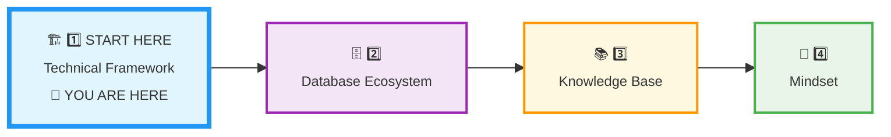
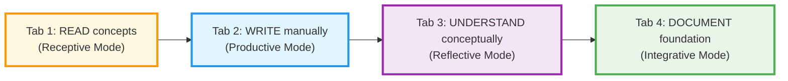
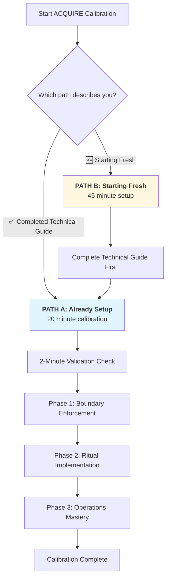
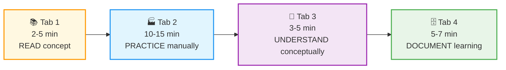
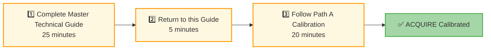
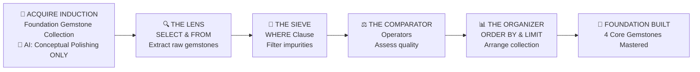
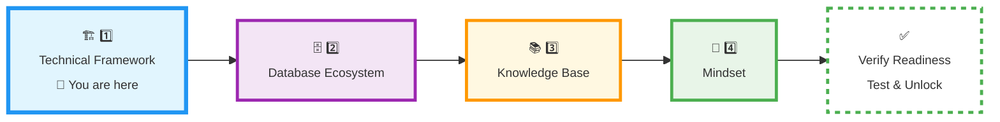

# 🗄️🤖 SQL & GenAI Course
**🎯 Quality Education for Anyone, Anywhere, Anytime — 💫 with Comfort, Convenience at no Cost**

## 🏗️ **1 TECHNICAL FRAMEWORK: ACQUIRE Phase Calibration**
---
## 📍 **YOUR PILLAR PROGRESSION**
**Current Status:** Beginning the ACQUIRE Framework • First of Four Pillars


---
## 🎯 **Quick Win Promise**

**In the next 20-30 minutes,** you'll calibrate your Browser Office specifically for the **ACQUIRE phase**—establishing strict boundaries and optimizing your workspace for pure foundation building without AI shortcuts.

**Your Goal:** ACQUIRE-ready Browser Office with conceptual-only AI, manual SQL practice, and organized documentation for foundation skills.

---

## 📋 **Prerequisites & Quick Checklist**

### **Two Paths to ACQUIRE Calibration:**

**Path A: Already Completed Master Technical Guide**
- [x] **STEP1:** Browser Office commissioned (all 4 tabs configured)
- [x] **STEP2:** Learning ritual established (daily workflow internalized)  
- [x] **STEP3:** Tab operations mastered (advanced features known)
- [x] **Module 0:** Validation ritual completed successfully

**Path B: Starting Fresh (First-Time Setup)**
- [ ] **Computer:** Any device with modern browser
- [ ] **Internet connection:** Stable for setup
- [ ] **Email ID:** For GitHub account (create if needed)
- [ ] **Same email ID:** For AI platform configuration

**If Path B:** Complete the [Master Technical Guide](../../Setup/🗂️%20MASTER%20GUIDES/TECHNICAL_GUIDE_L1L2.md) first (25 minutes), then return here for ACQUIRE-specific calibration.

---

## 🏢 **ACQUIRE PHASE: The Foundation-First Configuration**

**🚀 ACQUIRE MANDATE:**  
**Manual Skill Building | Conceptual AI Only | Cognitive Separation | Documentation Discipline**

### **📋 ACQUIRE-Specific Tab Configuration**

| Tab | **ACQUIRE Purpose** | **ACQUIRE Restrictions** | **Save Rule** |
| :--- | :--- | :--- | :--- |
| **1: The Map** | Module navigation & instructions | Reference only - never modify | 🚫 No saving here |
| **2: The Factory** | **100% manual SQL practice** | No AI-generated code allowed | 💾 Copy to Tab 4 |
| **3: The Consultant** | **Conceptual guidance ONLY** | No SQL code generation | 📋 Valuable convos to Tab 4 |
| **4: The Vault** | Foundation skill documentation | Structured ACQUIRE folders | ✅ Everything here |

**Pro Tip:** Use keyboard shortcuts for rapid tab switching: `Ctrl+1` / `Cmd+1` (Tab 1: Map), `Ctrl+2` / `Cmd+2` (Tab 2: Factory), `Ctrl+3` / `Cmd+3` (Tab 3: Consultant), `Ctrl+4` / `Cmd+4` (Tab 4: Vault).

### **📅 Your 3-Day Calibration Ritual**

**Total Time:** 2-3 hours over 3 days → **Result:** A perfectly calibrated workspace for Weeks 1-4 of foundational mastery.

| Pillar | Duration | Core Focus | **Calibration Outcome** |
| :--- | :--- | :--- | :--- |
| **🏗️ 1. Technical Framework** | Day 1 | Browser Office & Tool Configuration | **Sterile Laboratory:** A perfectly configured 4-tab workspace with no cognitive shortcuts. |
| **🗄️ 2. Database Ecosystem** | Day 1 | Datasets, Schema Anchors & AI Rules | **Rules of Engagement:** Clear dual-dataset strategy and AI constrained to conceptual guidance only. |
| **📚 3. Knowledge Base** | Day 2 | Professional Documentation System | **The Vault:** A structured GitHub repository ready to preserve every gemstone and struggle. |
| **🧠 4. Mindset** | Day 3 | Learning Psychology & Identity Shift | **The Artisan's Ego:** Resilience to handle `Syntax Error` and the identity of a **Data Investigator.** |

### **🧠 ACQUIRE Cognitive Workflow**



**ACQUIRE GOLDEN RULE:**  
**You write every line of SQL manually. AI explains concepts only. No code generation until Module 5.**

---

## ⏱️ **Step-by-Step ACQUIRE Calibration**

### **🔍 Choose Your Path & Verify Readiness**

<div align="center" style="border: 3px solid #2196f3; border-radius: 10px; padding: 20px; margin: 25px 0; background: linear-gradient(135deg, #e3f2fd 0%, #bbdefb 100%);">



</div>

---

### **🔧 Path A Quick Validation (2 minutes)**

**Before ACQUIRE calibration, verify your Technical Guide mastery:**

- [ ] **Tab switching is fluid:** `Ctrl+1/2/3/4` works without thinking
- [ ] **Core purposes clear:** Map (read), Factory (execute), Consultant (ask), Vault (document)
- [ ] **Module 0 executable:** Can navigate Tab 1 → Tab 3 → Tab 2 → Tab 4 sequence
- [ ] **Save rules understood:** Know what to save where and why

**All checked? → Proceed to Phase 1.**  
**Missing checks? → Review [Technical Guide](../../Setup/TECHNICAL_GUIDE_L1L2.md) for 5 minutes.**

---

## 🎯 **Phase 1: ACQUIRE Boundary Enforcement**

**Focus:** Applying ACQUIRE-specific restrictions to your existing setup

### **Step 1: Configure Tab 3 (Consultant) for ACQUIRE Rules**

**Verify your Student Mode prompt is active and configured for ACQUIRE phase:**

1. **Switch to Tab 3** (Consultant) and ensure your AI is in Student Mode
2. **Confirm the ACQUIRE boundaries** are active by checking:
   - No SQL code generation
   - Only conceptual explanations
   - Socratic questioning approach
3. **Note:** The complete Student Mode prompt is already configured from Module 0. Ensure it's still active.

### **Step 2: Optimize Tab 2 (Factory) for Manual Practice**
- **Disable** any AI autocomplete features in SQLite Online
- **Practice** typing SQL manually (no copy-paste from AI)
- **Create** a `manual-practice.sql` file in Tab 4 for tracking

### **Step 3: Clean Tab 1 (Map) for Focus**
- **Bookmark** ONLY ACQUIRE phase materials
- **Remove** Level 2/3 materials during ACQUIRE sessions
- **Create** ACQUIRE-specific reading list

---

## 🔄 **Phase 2: ACQUIRE Ritual Implementation**

**Focus:** Daily workflow patterns optimized for manual foundation building

### **📅 Morning ACQUIRE Setup (2-3 minutes)**
1. Open fresh browser window for ACQUIRE work only
2. Set explicit boundary: **"No AI code generation today"**
3. Review yesterday's manual SQL progress in Tab 4

### **🎯 ACQUIRE Learning Session (25-45 minutes)**



### **📝 Evening ACQUIRE Review (3-5 minutes)**
1. Document all manual SQL written today
2. Note concepts clarified (without code)
3. Commit with message: **"ACQUIRE Day X: Manual practice completed"**

---

## ⚙️ **Phase 3: ACQUIRE Operations Mastery**

**Focus:** Advanced techniques optimized for foundation building

### **🏭 Tab 2 (Factory) - ACQUIRE Operations**

| Operation | ACQUIRE Focus | Key Practice |
|-----------|---------------|--------------|
| **Core Operation** | Manual SQL writing only | Type every query from scratch |
| **Error Strategy** | Understand conceptually before fixing | Ask "why" before "how to fix" |
| **Progress Tracking** | Document every manual query attempt | Log attempts in Tab 4 |

### **🤖 Tab 3 (Consultant) - ACQUIRE Operations**

| Dialogue Pattern | ACQUIRE Rule | Example |
|------------------|--------------|---------|
| **Concept Explanation** | No SQL code generation | "Explain WHERE clause conceptually without showing SQL" |
| **Question Framework** | Focus on understanding | "Why does this error occur?" not "Fix this error" |
| **Learning Focus** | Underlying principles | "What's the logic behind JOIN operations?" |

---

## 🆕 **For Path B Students (Starting Fresh)**

<div style="border: 2px solid #ff9800; border-radius: 10px; padding: 20px; margin: 25px 0; background: linear-gradient(135deg, #fff8e1 0%, #ffecb3 100%);">

### **📋 Complete This Sequence First**



**Required Action:** Complete the **[Master Technical Guide](../../Setup/TECHNICAL_GUIDE_L1L2.md)** first (25 minutes)

**After Completion:** Return here and follow the **Path A calibration steps** above.

</div>

---

## 🧠 **Deep Philosophy: The ACQUIRE Mindset**

<div align="center" style="border: 2px solid #ff9800; border-radius: 8px; padding: 20px; margin: 20px 0; background: #fff8e1;">

### **🚀 Foundation First, AI Next, Projects Last.**
### **💎 Gemstone by Gemstone, Skill by Skill.**

</div>

**Your ACQUIRE Mandate:**  
**Manual Skill Building | Conceptual AI Only | Cognitive Separation | Documentation Discipline**

### **Why Manual Practice Builds Genuine Skill**

**The Neuroscience of Foundation Building:**
- **First Exposure Effect:** Initial learning creates the deepest neural pathways
- **Struggle = Strength:** Cognitive effort builds robust mental models
- **Manual Execution:** Writing code manually develops syntax intuition
- **Error Ownership:** Fixing your own mistakes builds debugging skills

**The Strategic Withholding:**
By restricting AI code generation during ACQUIRE phase, we ensure:
- **Your brain** builds SQL circuitry, not just pattern recognition
- **Your confidence** comes from actual capability, not borrowed intelligence
- **Your foundation** supports advanced learning without collapse

### **📊 Visualizing Your ACQUIRE Journey**

**The ACQUIRE Phase Gemstone Collection Workflow:**


### **The Craftsman's First Tool: Manual Dexterity**

**Before Power Tools, Master Hand Tools:**
- The carpenter learns with hand saw before circular saw
- The chef masters knife skills before food processor
- The musician practices scales before complex compositions

**Your ACQUIRE Phase = Hand Tool Mastery:**
- **Tab 2 (Factory):** Your hand saw (manual SQL)
- **Tab 3 (Consultant):** Your measuring tape (conceptual guidance)
- **Tab 4 (Vault):** Your toolbox (organized skills)
- **Tab 1 (Map):** Your blueprint (instructions)

### **The Identity Transformation Begins Here**

This calibration isn't about tools—it's about **becoming the type of professional** who:
1. **Prepares meticulously** before beginning work
2. **Resists shortcuts** that compromise genuine learning
3. **Documents systematically** to track authentic growth
4. **Builds foundations** that supports advanced work

**The ACQUIRE Phase Investment:**
Every minute spent calibrating saves hours of frustration later. Every boundary established prevents weeks of dependency. This is your investment in **genuine competence**.

### **The Long Game: From Consumer to Creator**

**Most learners:** Consume AI-generated solutions → Create dependency  
**ACQUIRE learners:** Create manual solutions → Build capability

**Your progression:**
- **ACQUIRE (Now):** Manual creator of basic SQL
- **ACCELERATE (Module 5):** Intelligent user of AI tools
- **ANALYZE (Module 6):** Critical evaluator of professional code
- **ARCHITECT (Projects):** Original designer of complete systems

> **Remember:** The master doesn't just use tools well—they understand when **not** to use powerful tools. Restraint during foundation building creates capability that lasts a lifetime. Your ACQUIRE calibration today is that moment of professional restraint.

---

## 🔧 **ACQUIRE Tool Mastery Challenge**

<div style="border: 3px solid #4caf50; border-radius: 10px; padding: 25px; margin: 30px 0; background: linear-gradient(135deg, #e8f5e8 0%, #f1f8e9 100%); box-shadow: 0 8px 20px rgba(76, 175, 80, 0.2);">

### **🧪 Test Your Tool Literacy & ACQUIRE Boundaries**

**Time:** 15 minutes  
**Objective:** Prove you can use your tools WITHOUT content assistance - pure tool literacy and boundary enforcement.

#### **🎯 The 3-Part Tool Literacy Test:**

**Part 1: Tab Navigation Speed Run**
```markdown
Complete this sequence in under 30 seconds:
1. Start in Tab 1 (Map)
2. Switch to Tab 2 (Factory) → Type "SELECT 1+1;" → Run
3. Switch to Tab 3 (Consultant) → Type "I'm ready for ACQUIRE mode"
4. Switch to Tab 4 (Vault) → Create empty file "tool-test.md"
5. Return to Tab 1

**Success:** Completed in ≤30 seconds with no errors
```

**Part 2: Keyboard-Only Navigation**
```markdown
Complete WITHOUT using mouse:
1. Open new browser window (Ctrl+N / Cmd+N)
2. Open 4 tabs with keyboard shortcuts
3. Navigate to correct URLs using Ctrl+L / Cmd+L
4. Create bookmarks with Ctrl+D / Cmd+D
5. Close all without mouse (Ctrl+W / Cmd+W)

**Success:** All actions completed mouse-free
```

**Part 3: Tool Boundary Enforcement**
```markdown
Test each tool's ACQUIRE boundary:
1. **Tab 1:** Try to edit a course file (should feel "wrong" - read-only mindset)
2. **Tab 2:** Recall the SQL command you used in Module 0 and type that command here (manually, without copy-paste)
3. **Tab 3:** Recall and type the Student Mode prompt you used in Module 0 and ask for SQL code
4. **Tab 4:** Try to NOT document something (should feel incomplete)

**Success:** Each boundary feels natural and enforced
```

#### **🧠 The Psychology Behind This Exercise:**

**Why this works:**
- **Premature optimization prevention:** Forces tool familiarity BEFORE content
- **Cognitive load reduction:** Makes tool use automatic, freeing mental space for SQL
- **Boundary reinforcement:** Makes ACQUIRE rules feel natural, not restrictive
- **Confidence building:** Proves you control your tools, not vice versa

**The "Empty Factory" Metaphor:**
Before you start manufacturing (SQL learning), you need to:
1. **Know your machine controls** (keyboard shortcuts)
2. **Test safety protocols** (boundaries)
3. **Run empty production cycles** (tool navigation without content)
4. **Document procedures** (even when "nothing" is produced)

**This exercise is your "factory safety check" before loading raw materials (SQL concepts).**

#### **📊 ACQUIRE Tool Mastery Score:**
- **Perfect (12/12 checks):** Excellent tool literacy → Proceed to Database Ecosystem
- **Good (9-11/12):** Solid foundation → Practice weak areas for 5 minutes
- **Needs Work (≤8/12):** Requires recalibration → Repeat Technical Guide exercises

**Your Score:** ___ / 12

</div>

---

## 🚀 **Your Calibration Navigation Journey**

**Complete ALL 5 steps in sequence before Module 1:**



### **🔄 Navigation Controls:**

**⬅️ Previous Step:** You came from [SECTION1_INDUCTION.md](../SECTION1_INDUCTION.md)

**➡️ Next Step:** Continue your calibration with Database Ecosystem

<div align="center" style="border: 3px solid #2196f3; border-radius: 10px; padding: 25px; margin: 30px 0; background: linear-gradient(135deg, #e3f2fd 0%, #bbdefb 100%); box-shadow: 0 8px 20px rgba(33, 150, 243, 0.2);">

### **🎯 Technical Calibration Complete**

**Proceed to configure your data environment:**

# [▶️ **NEXT: DATABASE ECOSYSTEM CONFIGURATION**](./2_Database_Ecosystem.md)

**Configure datasets, schema anchors, and AI rules for ACQUIRE phase**

<small>⏱️ *Estimated time: 20-25 minutes*</small>

</div>

**🚫 Module 1 remains locked until ALL 5 calibration steps are complete.**

---

<div align="center" style="margin-top: 40px; padding: 15px; background: #f5f5f5; border-radius: 6px; font-size: 0.9em;">

**Calibration Time:** 20-30 minutes  
**Calibration Focus:** ACQUIRE Phase Boundaries & Manual Practice  
**Next Step:** Database Ecosystem Configuration  
**Core Principle:** Foundation First, AI Next. Manual practice builds genuine capability.

</div>

---

*Part of our mission for 🎯 Quality Education for Anyone, Anywhere, Anytime — 💫 with Comfort, Convenience at no Cost.*

**Level 1 | ACQUIRE Phase | Technical Framework Calibrated | Ready for Database Setup**

