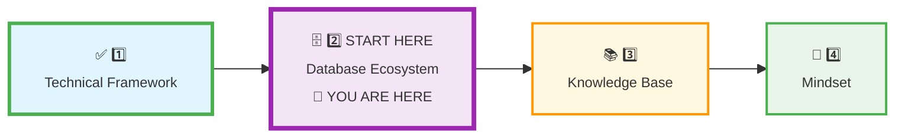
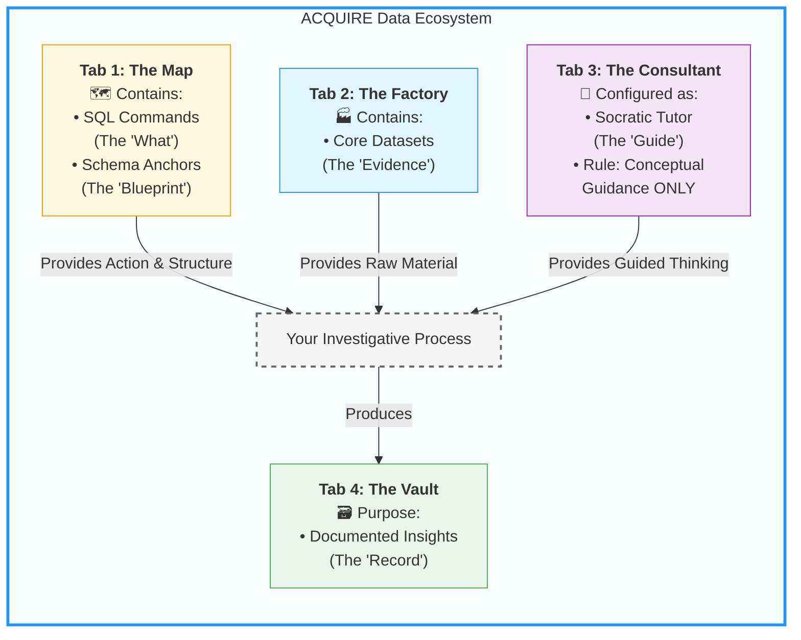
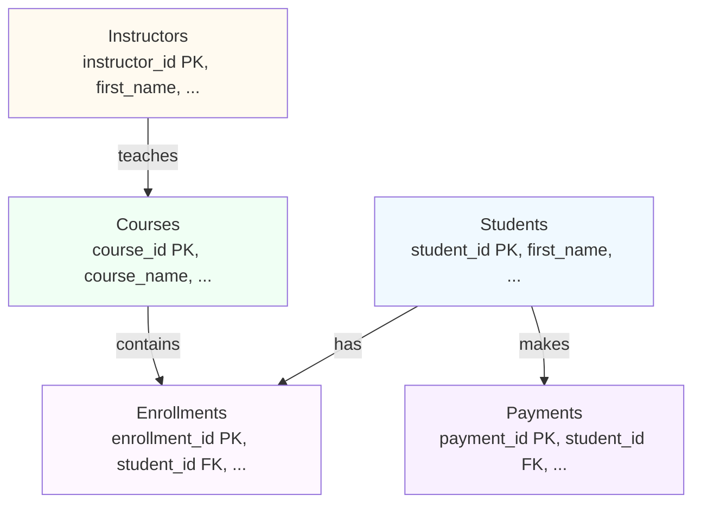
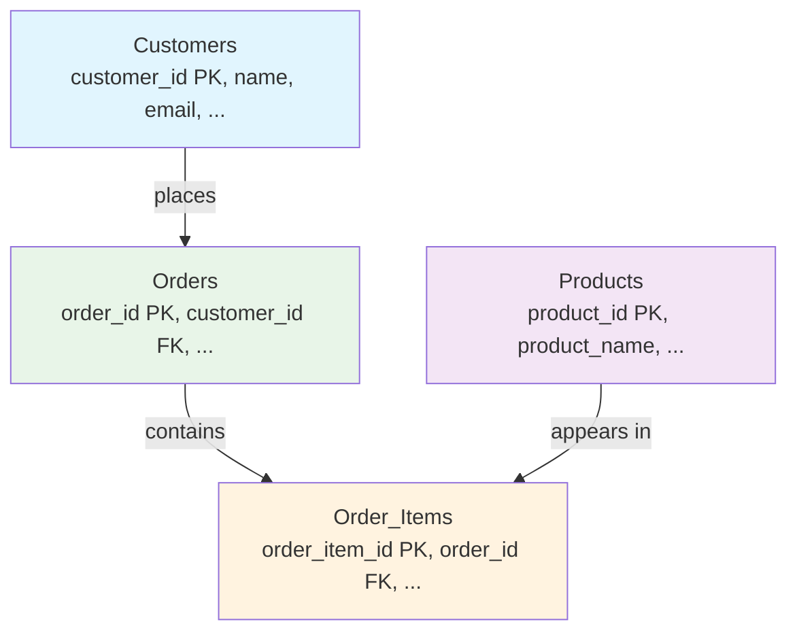
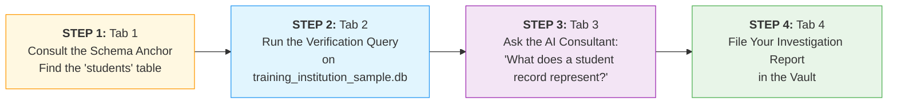
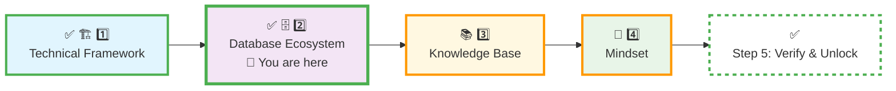

# 🗄️🤖 SQL & GenAI Course
**🎯 Quality Education for Anyone, Anywhere, Anytime — 💫 with Comfort, Convenience at no Cost**

## 🗄️ **2 DATABASE ECOSYSTEM: ACQUIRE Phase Calibration**
---

## 📍 **YOUR PILLAR PROGRESSION**
**Current Status:** Pillar 1 ✅ Complete • Pillar 2 begins now



## 🎯 **Quick Win Promise**

**In the next 20-25 minutes,** you will move from having tools to wielding a **professional investigative system**. You will experience how your four key components work in concert to turn a data question into a documented insight. This is your first act as a Data Investigator.

**Your Goal:** To understand and perform the core ritual of the ACQUIRE phase, transforming uncertainty into structured inquiry.

---

## 📋 **Prerequisites & Quick Checklist**

**Before you begin, ensure you have completed:**
- [x] **Pillar 1: Technical Framework** calibrated ([`1_Technical_Framework.md`](./1_Technical_Framework.md))
- [x] **Tab 2: The Factory** configured with `training_institution_sample.db`
- [x] **Tab 3: The Consultant** configured with the Student Mode prompt
- [ ] **Mindset:** Curiosity activated. You are about to conduct your first investigation.

**Database Ecosystem Mission:**  
**System Fluency | First Insight | Rule Confidence**

---

## 🏗️ **The ACQUIRE Data Landscape: Your Investigative System**

Your power doesn't come from a single tool, but from a **calibrated system** where four components interact with precision. This ecosystem is designed for one purpose: to build your foundational SQL skill through a replicable, professional investigative ritual.

### **The Four Components of Your System**



**The System in Action:**
1.  **From The Map:** You receive a SQL command (the mission) and consult a Schema Anchor (the case file).
2.  **To The Factory:** You apply the command to the relevant Core Dataset (the evidence scene).
3.  **With The Consultant:** You discuss concepts and understanding with your AI guide, adhering strictly to conceptual dialogue.
4.  **Into The Vault:** You document the insight, cementing the learning and building your professional portfolio.

This closed-loop system ensures every learning cycle is intentional, documented, and builds towards genuine mastery.

---

## 📊 **Core Learning Datasets: Your Investigative Materials**

In your Factory (Tab 2), you will work with two primary databases. Each has a distinct, strategic purpose in your learning journey.

| Dataset | Code Name | Purpose | Your Cognitive Mode |
| :--- | :--- | :--- | :--- |
| **[training_institution_sample.db](../../../Resources/sample_databases/training_institution_sample.db)** | **"The Blueprint Archive"** | Used for **all guided examples** in the modules. You observe patterns, see correct syntax in action, and deconstruct working solutions. | **"Watch Me"** – Learn from a demonstrated investigation. |
| **[level1_estore_basic.db](../../../Resources/sample_databases/level1_estore_basic.db)** | **"The Proving Ground"** | Used for **all hands-on exercises**. You independently apply concepts, test hypotheses, and validate your understanding in a fresh context. | **"Now You Do It"** – Conduct your own investigation. |

**The Dual-Dataset Strategy is Non-Negotiable.** This separation prevents solution memorization and forces **skill transfer**—the true mark of understanding. You learn the pattern in one domain (training institution) and execute it in another (e-store), proving the concept is yours.

---

## 📊 **Understanding Your Data Models**

Before writing queries, an investigator reviews the case file. In our system, the **Schema Anchor** (in Tab 1) serves this purpose. Below is a preview of the landscape you'll be investigating, highlighting how key tables connect—a fundamental concept for writing useful queries.


### 1. The Training Institution Dataset (For "Watch Me")
This dataset, used for module demonstrations, models a vocational training institution with a **normalized relational structure**. The `Enrollments` table links `Students` and `Courses`, while `Instructors` are stored separately and linked to `Courses` via `instructor_id`.


**Key Insights:**
- A student can enroll in many courses, and a course can have many students – a **many‑to‑many** relationship resolved by the `Enrollments` linking table.
- An instructor can teach many courses – a **one‑to‑many** relationship via `instructor_id`.
- All payments are tied to students, not directly to enrollments, allowing flexible tracking of payments across multiple courses.


### **2. The E-Store Practice Dataset (For "Now You Do It")**
This is your independent practice sandbox. It follows a standard retail logic where `Order_Items` connects products to specific customer orders.

**Key Insight**: A Customer can place many Orders. An Order can contain many Products through the `Order_Items` table. This structure efficiently handles **multiple items per order**.

**Remember:** You will **not** memorize these. For any investigation, you will open the full **Schema Anchor** file in Tab 1 to get precise column names and details in Module3. These diagrams simply show you the "shape" of the evidence you'll be working with.

> **💡 A Note on Memorization:**
>
> You don't need to memorize these diagrams. Think of them as your **orientation map** – they show you the "shape" of the data and how tables connect.
>
> When you need precise column names, data types, or specific details, you'll find them in the complete reference guides. We'll introduce those formally when you're ready for them in **Module 3**.
>
> For now, just get comfortable with the landscape. The details will come when you need them.


---
## 📋 **Quick Data Snapshots**

Before writing queries, it helps to see what actual data looks like. Here are previews from each table to orient your investigations.

### **Training Institution Dataset**


#### `students` Table (First 2 Rows)
| student_id | first_name | last_name | email | phone | enrollment_date | total_fees | fees_paid |
|------------|------------|-----------|-------|-------|-----------------|------------|-----------|
| 101 | Sarah | Chen | sarah.chen@email.com | 555-0101 | 2024-01-15 | 4500.00 | 3000.00 |
| 102 | Mike | Rodriguez | mike.rod@email.com | 555-0102 | 2024-01-20 | 5200.00 | 5200.00 |

#### `instructors` Table (First 2 Rows)
| instructor_id | first_name | last_name | email | specialization |
|---------------|------------|-----------|-------|----------------|
| 501 | Emily | Watson | emily.w@institution.com | Web Development |
| 502 | James | Wilson | james.w@institution.com | Backend & SQL |

#### `courses` Table (First 2 Rows)
| course_id | course_code | course_name | course_track | duration_weeks | instructor_id | course_fee | max_seats | is_active |
|-----------|-------------|-------------|--------------|----------------|---------------|------------|-----------|-----------|
| 201 | WD101 | Frontend Development | Web Development | 8 | 501 | 1500.00 | 15 | 1 |
| 202 | WD102 | Backend with Node.js | Web Development | 10 | 502 | 1800.00 | 12 | 1 |

#### `enrollments` Table (First 2 Rows)
| enrollment_id | student_id | course_id | enrollment_date | completion_status | test1_score | test2_score | final_exam_score | certificate_issued |
|---------------|------------|-----------|-----------------|-------------------|-------------|-------------|------------------|---------------------|
| 1 | 101 | 201 | 2024-01-15 | Completed | 78.50 | 82.00 | 85.00 | 1 |
| 2 | 101 | 202 | 2024-03-01 | Ongoing | 75.00 | NULL | NULL | 0 |

#### `payments` Table (First 2 Rows)
| payment_id | student_id | amount | payment_date | payment_method | description |
|------------|------------|--------|--------------|----------------|-------------|
| 301 | 101 | 1500.00 | 2024-01-10 | Credit Card | Frontend Development Course |
| 302 | 101 | 1500.00 | 2024-02-28 | Bank Transfer | Backend Course - First Payment |
---

### **E-Store Practice Dataset**

#### `customers` Table (First 2 Rows)
| customer_id | name | email | city | phone |
|-------------|------|-------|------|-------|
| 1 | Alice Smith | alice@email.com | New York | 555-1001 |
| 2 | Bob Johnson | bob@email.com | Los Angeles | 555-1002 |

#### `products` Table (First 2 Rows)
| product_id | product_name | price | category |
|------------|--------------|-------|----------|
| 101 | Laptop | 999.99 | Electronics |
| 102 | Novel | 14.99 | Books |

#### `orders` Table (First 2 Rows)
| order_id | customer_id | order_date |
|----------|-------------|------------|
| 1001 | 1 | 2024-01-15 |
| 1002 | 2 | 2024-01-16 |

#### `order_items` Table (First 2 Rows)
| order_item_id | order_id | product_id | quantity |
|---------------|----------|------------|----------|
| 5001 | 1001 | 101 | 1 |
| 5002 | 1001 | 102 | 2 |

---


## 🔍 **Your First Investigation: The Case of the Missing Table**

**The Mission:** Experience the full power of your calibrated system. We will locate a specific table in our "training institution" archive, verify its contents, and consult an expert to understand its significance.

This exercise has one goal: to make the workflow between your four tabs feel **natural, powerful, and exciting.** You are not just loading a database; you are completing a professional intelligence cycle.



### **STEP 1: Get Your Intel (Tab 1 - The Map)**
1.  Navigate to **Tab 1** (The Map).
2.  Find and open the file: **[SCHEMA_ANCHOR_TRAINING_INSTITUTION_SAMPLE.md](../../SCHEMA_ANCHOR_TRAINING_INSTITUTION_SAMPLE.md)**.
3.  **Your Task:** Scan this document. Find the section that describes the **`students`** table. Skim the column names (like `first_name`, `email`).
    > **💡 Investigator's Note:** This is your blueprint. You're checking the case file *before* visiting the scene.

### **STEP 2: Verify the Evidence (Tab 2 - The Factory)**
1.  Switch to **Tab 2** (The Factory). Ensure `training_institution_sample.db` is loaded.
2.  **Run the Verification Query:** Manually type the following SQL command and execute it:
    ```sql
    SELECT 'The students table EXISTS!' AS verification, COUNT(*) AS total_records FROM students;
    ```
3.  **Observe the Result:** You will get a clear confirmation message and a number. This is your proof of life for the `students` table. Note the `total_records` count.

### **STEP 3: Consult the Expert (Tab 3 - The Consultant)**
1.  Switch to **Tab 3** (The Consultant). Your Student Mode prompt is active.
2.  **Ask a Conceptual Question:** Paste the following question, replacing `[X]` with the number you found in STEP 2:
    > "I just verified that the `students` table in my training institution database has `[X]` records. In this context, what kind of information might each student record represent? Please explain conceptually, without any SQL code."
3.  **Analyze the Response:** Your AI Consultant will give you a conceptual breakdown—likely mentioning things like name, contact info, enrollment date. Notice how its explanation mirrors the column names you saw in the Schema Anchor. **This is the system working.**

**🔐 The Boundary Ceremony Moment:**
When you paste the Student Mode prompt and the AI acknowledges its role, you're not just configuring a tool—you're **performing a ceremony of commitment**. This boundary transforms the AI from an answer machine into a thinking partner that strengthens *your* mind. The slight frustration of not getting code is actually building your problem-solving muscles.

### **STEP 4: File Your Report (Tab 4 - The Vault)**
1.  Switch to **Tab 4** (The Vault).
2.  Create a new file called `first_investigation.md`.
3.  **Document your findings:**
    ```markdown
    # First Investigation Report: The Students Table

    **Date:** [Today's Date]
    **Objective:** Verify the existence and understand the purpose of the `students` table.

    ## 📋 Evidence Gathered
    1.  **Schema Intel:** Located the `students` table blueprint in the Schema Anchor.
    2.  **Field Verification:** Ran query: `SELECT 'The students table EXISTS!' AS verification, COUNT(*) AS total_records FROM students;`
    3.  **Result:** Confirmed. The table contains **`[X]`** records.

    ## 🧠 Expert Consultation
    **Question Asked:** "What kind of information might each student record represent?"
    **AI's Conceptual Insight:** "[Paste one key sentence from the AI's response here]"

    ## 💎 My Insight
    [Write one sentence about what you learned from this process. For example: "I learned to use the blueprint first, then verify data in the factory, and use the consultant to understand the *meaning* of the data."]
    ```

**Congratulations, Investigator.** You have just completed the core learning cycle of the ACQUIRE phase. You used all four components of your ecosystem as a unified system to go from a question to a documented insight. This exact ritual—adapted and repeated—will build your foundation.

---

## **🌉 THE BRIDGE YOU JUST CROSSED**

**What you've just experienced works identically across ANY domain:**

```markdown
**Education Data (what you just did):**
1. Schema Anchor → Students table description
2. Factory → `SELECT ... FROM students`
3. Consultant → "What does a student record represent?"
4. Vault → Document findings

**E-commerce Data (what you'll do next):**
1. Schema Anchor → Customers table description  
2. Factory → `SELECT ... FROM customers`
3. Consultant → "What does a customer record represent?"
4. Vault → Document findings
```

**The pattern is identical. The data changes. The skill doesn't.**

This is your first glimpse of a fundamental truth: **Data investigation skills transfer**. Education data, retail data, healthcare data—your four-tab system works the same way. The confusion of new data is temporary; the investigative process is permanent.

---

## 🧠 **Deep Philosophy: The Investigator's Mindset**

<div align="center" style="border: 2px solid #ff9800; border-radius: 8px; padding: 20px; margin: 20px 0; background: #fff8e1;">

### **🚀 Foundation First, AI Next, Projects Last.**
### **💎 Gemstone by Gemstone, Skill by Skill.**

</div>

**Your ACQUIRE Mandate:**  
**Manual Skill Building | Conceptual AI Only | Cognitive Separation | Documentation Discipline**

You have now calibrated the most critical part of your foundation: **the system for turning confusion into clarity.** The Database Ecosystem is not about the files; it's about the **protocol**.

The "AI Next" rule is your safeguard. By forcing conceptual dialogue, it ensures every gemstone of understanding is truly *yours*. The schema anchor is your source of truth. The Vault is your record of growth.

This calibrated, rule-bound environment is what allows for rapid, genuine skill acquisition. You are not just learning SQL; you are building the disciplined, replicable workflow of a professional. This mindset is the second gemstone in your foundation.

---

## ✅ **Database Ecosystem Validation Test**

<div style="border: 3px solid #4caf50; border-radius: 10px; padding: 25px; margin: 30px 0; background: linear-gradient(135deg, #e8f5e8 0%, #f1f8e9 100%); box-shadow: 0 8px 20px rgba(76, 175, 80, 0.2);">

### **🧪 System Fluency Audit**

**Objective:** Confirm you can navigate your investigative system with confidence.

#### **📋 Self-Assessment Checklist:**
- [ ] **I understand the role** of each of the four components in the ACQUIRE phase.
- [ ] **I successfully completed** "The Case of the Missing Table" and filed my report in the Vault.
- [ ] **I observed the AI's boundary:** It discussed concepts without writing SQL code.
- [ ] **I see the connection:** The AI's conceptual explanation related to the column names in the Schema Anchor.
- [ ] **I feel ready** to use this same four-step process to tackle a new SQL command from the Map.

#### **🎯 Final Confidence Challenge:**
**On your own, initiate a second, mini-investigation.**

1.  In **Tab 1**, open the same Schema Anchor and look at the **`courses`** table.
2.  In **Tab 2**, write and run a *modified* verification query for the `courses` table.
3.  **Do not use Tab 3 for this.** Rely only on your Schema Anchor and what you just learned.

**Success is:** Adapting the query yourself and getting a confirmation message for the `courses` table. This proves you own the process.

**Score yourself:** ___ / 5 Checklist Items Complete & Mini-Challenge Accomplished.

</div>

---

## 🚀 **Your Calibration Navigation Journey**

**Complete ALL 5 steps in sequence before Module 1:**



### **🔄 Navigation Controls:**

**⬅️ Previous Step:** [Technical Framework Calibration](./1_Technical_Framework.md)

**➡️ Next Step:** Structure your professional knowledge vault.

<div align="center" style="border: 3px solid #ff9800; border-radius: 10px; padding: 25px; margin: 30px 0; background: linear-gradient(135deg, #fff8e1 0%, #ffecb3 100%); box-shadow: 0 8px 20px rgba(255, 152, 0, 0.2);">

### **🎯 Investigation Protocol Calibrated**

**Proceed to build your permanent repository of insights:**

# [▶️ **NEXT: KNOWLEDGE BASE CONFIGURATION**](./3_Knowledge_Base.md)

**Construct your GitHub Vault and master the art of progress documentation.**

<small>⏱️ *Estimated time: 20-25 minutes*</small>

</div>

**🚫 Module 1 remains locked until ALL 5 calibration steps are complete.**

---

<div align="center" style="margin-top: 40px; padding: 15px; background: #f5f5f5; border-radius: 6px; font-size: 0.9em;">

**Calibration Time:** 20-25 minutes  
**Calibration Focus:** System Fluency & First Insight  
**Next Step:** Knowledge Base Configuration  
**Core Principle:** Mastery is not knowing every answer; it is trusting the system to guide you to it.

</div>

---

*Part of our mission for 🎯 Quality Education for Anyone, Anywhere, Anytime — 💫 with Comfort, Convenience at no Cost.*

**Level 1 | ACQUIRE Phase | Database Ecosystem Calibrated | Ready for Knowledge Base Setup**


