# 🗄️🤖 SQL & GenAI Course
**🎯 Quality Education for Anyone, Anywhere, Anytime — 💫 with Comfort, Convenience at no Cost**

---
## 📚 **3 KNOWLEDGE BASE: ACQUIRE Phase Calibration**


## 📍 **YOUR PILLAR PROGRESSION**
**Current Status:** Pillar 1-2 ✅ Complete • Pillar 3 begins now

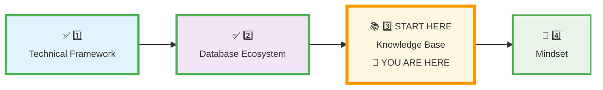

## 🧭 Calibration Step 1: Understand the Vault Architecture

### Phase 1 – Launch

## 🎯 **Quick Win Promise**

**In the next 25 minutes,** you will transform your Vault from a blank page into the living, structured architecture of your professional mind. You will move from *taking notes* to *building your knowledge portfolio*—a system engineered to grow with you from ACQUIRE to ARCHITECT.

**Your Goal:** To commission your personal knowledge archive and master the daily ritual that turns practice into permanent, portfolio-ready skill.

---

## ✅ Today’s Actual Goal (Simple Version)

Today you only need to:

1. **Create the folder structure** shown in the action plan
2. **Move your first investigation file** into its home
3. **Create `prompts.md` and `META_VAULT`**

That’s it. Everything else in this document explains *why* this system matters.

---

<div style="border: 3px solid #ff9800; border-radius: 10px; padding: 20px; margin: 20px 0; background: linear-gradient(135deg, #fff8e1 0%, #ffecb3 100%);">

### 💎 **The Ultimate Treasure Vault Insight**

**What you're building isn't just organization—it's learning freedom.** Your calibrated Vault gives you **Anytime, Anywhere, Any Device access to your growing expertise.** Whether you're on your laptop at home, your tablet at a cafe, or your phone between meetings, your entire learning journey travels with you. This is a cloud-based extension of your brain that never sleeps.

> 💼 **PROFESSIONAL PARALLEL**  
> Senior engineers maintain version‑controlled, cloud‑synchronized knowledge systems. You are installing that same discipline now.

</div>

---

## 📋 **Prerequisites & Quick Checklist**

**Before you begin, ensure you have completed:**
- [x] **Pillar 1: Technical Framework** calibrated ([`1_Technical_Framework.md`](./1_Technical_Framework.md))
- [x] **Pillar 2: Database Ecosystem** calibrated ([`2_Database_Ecosystem.md`](./2_Database_Ecosystem.md))
- [x] **Tab 4: The Vault** accessible (your GitHub or local repository)
- [ ] **Mindset:** Ready to transition from student to **archivist**.

**Knowledge Base Mission:**  
**Isomorphic Structure | Ritualized Documentation | Portfolio-First Thinking**

---

### Phase 2 – Vision

## 🧠 **Deep Philosophy: The Archivist's Mindset & The Ultimate Vision**

<div align="center" style="border: 2px solid #ff9800; border-radius: 8px; padding: 20px; margin: 20px 0; background: #fff8e1;">

### **🚀 Foundation First, AI Next, Projects Last.**
### **💎 Gemstone by Gemstone, Skill by Skill.**

</div>

**Your ACQUIRE Mandate:**  
**Manual Skill Building | Conceptual AI Only | Cognitive Separation | Documentation Discipline**

Your Vault is **not a drawer for scraps of paper**. It is the **engine of your professional transformation**—an externalized cognitive map. The "Documentation Discipline" is fulfilled here: every note, prompt, and reflection forges your identity as a Data Artisan.

**The Archivist's Creed:** "I do not just consume knowledge; I **structure it**. I do not just complete exercises; I **curate my evidence**."

> 💼 **PROFESSIONAL PARALLEL**  
> Juniors have scattered notes; seniors have a **retrieval system**. Your Vault is that system.

---

### 🌟 **Your North Star: Visualize The Destination**

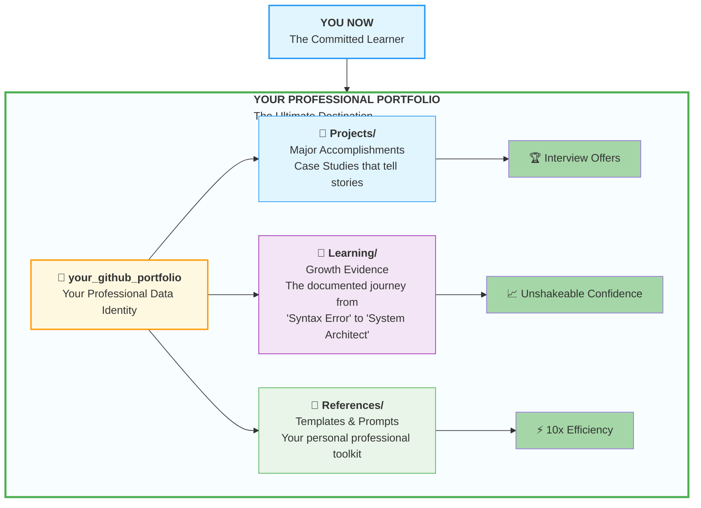

**Every file you save is a brick in this edifice.** You are building the public proof of your transformation.

---

### Phase 3 – Vault Architecture

## 📐 **The Four Views of Your Knowledge Architecture**

We examine your Vault through four progressive views, zooming from the professional portfolio down to your daily workspace.

### 🔭 **View 1: Bird's-Eye View - The Employer-Ready Structure**

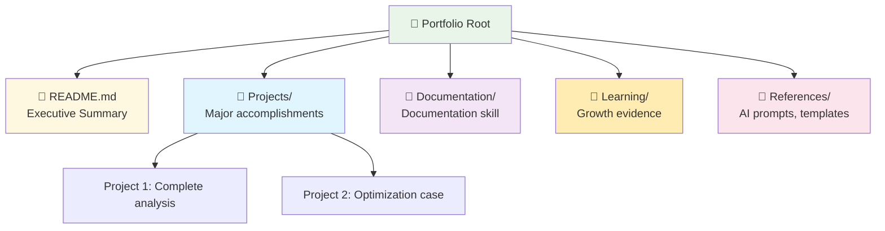

> 💼 **PROFESSIONAL PARALLEL** – Enterprise teams separate production systems, documentation, and learning artifacts. Your Vault mirrors that structure.

---

### 📐 **View 2: Telescopic View - The Learning Journey**

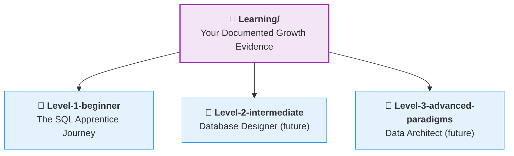

**The Architectural Principle:** This creates a 1:1 map between the course content (Tab 1) and your personal work (Tab 4). You are building a parallel version of the course knowledge.

---

### 📐 **View 2b: Telescopic View - The Projects Journey**

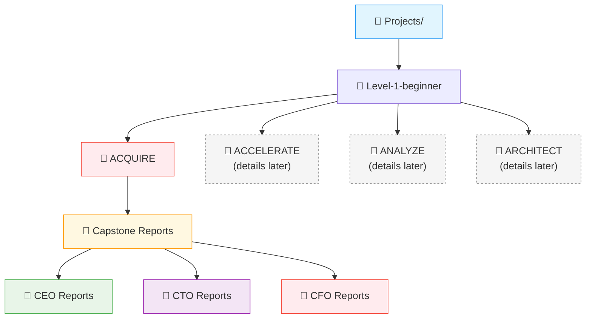

> *Only the ACQUIRE phase folders are created now. The other phases will be detailed when you reach them.*

---

### 🔬 **View 3: Microscopic View - The Level 1 Phase Architecture**

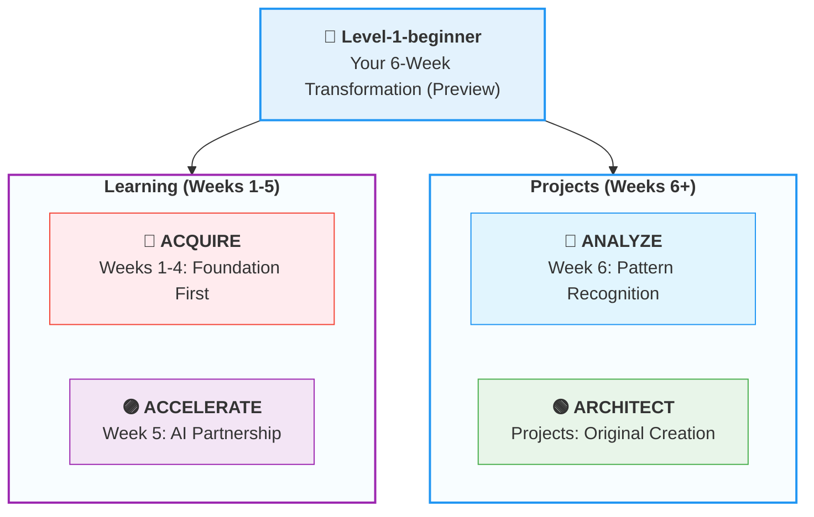

**The Growth Insight:** Your foundational work (`ACQUIRE`) is separate from project work (`ARCHITECT`), telling a clear story of growth.

---

### 📁 **View 4: Detail View - The Workspace Contrast**

> **Preview of Full Level‑1 Structure** – only the ACQUIRE module workspace is actionable now.

#### The ACQUIRE Module Workspace

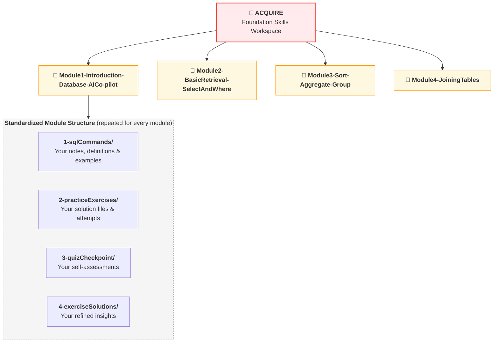

> **Why Mirror the Course Structure?** This is *isomorphic mapping* – your Vault mirrors the course repository. You never wonder where to save anything. (See the “AHA!” moment for a concrete example.)

---

### Phase 4 – ACQUIRE Composition

## 🌱 **A Growing Portfolio (ACQUIRE Focus)**

Your first portfolio assets – the **Capstone Reports** – live in `Projects/Level-1-beginner/ACQUIRE/Capstone Reports/`. They prove you can satisfy every stakeholder: the CEO (results), the CTO (reliability), and the CFO (efficiency).

| Suite | Focus | When Created |
|-------|-------|--------------|
| **CEO Reports** | Business strategy, executive insights | Modules 2, 3, 4 |
| **CTO Reports** | Technical methodology, query hygiene | Modules 3 & 4 |
| **CFO Reports** | Cost analysis, financial auditing | Module 4 |

---

## 📁 **The Meta Workspace: Tracking Your Growth**

**META_VAULT** sits at the **portfolio root level** alongside `Learning/` and `Projects/`.

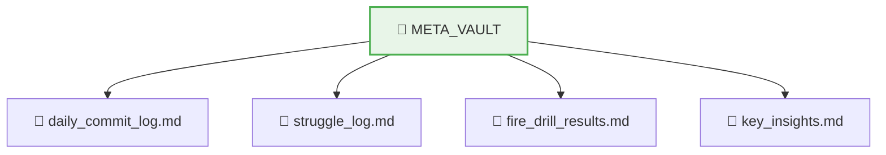

This is your **learning laboratory** – tracking patterns, struggles, and breakthroughs across modules.

---

## 🧠 **The Complete Structural Contrast (Preview)**

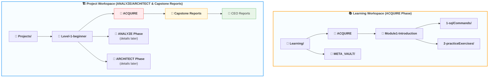

> *The diagram shows the full journey. Only the ACQUIRE workspace is built now.*

---

## 🧠 **The Structural Logic Behind the Four Phases**

| Phase | Role | Resembles |
|-------|------|-----------|
| **ACQUIRE** | Foundational skill acquisition | – |
| **ACCELERATE** | AI‑assisted refinement | ACQUIRE (learning) |
| **ANALYZE** | Learning from professional code | ACQUIRE (learning) |
| **ARCHITECT** | Building original projects | ANALYZE (project work) |

> ACQUIRE and ANALYZE are both **learning phases**. ANALYZE and ARCHITECT both involve **project organisation**.

---

## 🎯 **FOR THE ABSOLUTE BEGINNER: YOUR “AHA!” MOMENT**

<div style="border: 3px solid #2196f3; border-radius: 10px; padding: 20px; margin: 25px 0; background: linear-gradient(135deg, #e3f2fd 0%, #bbdefb 100%);">

### **✨ The 1:1 Isomorphic Mirror – Your Secret Weapon**
**Every folder in the course (`Tab 1`) has a twin in your Vault (`Tab 4`).**

| Course Repository (Tab 1) | → | Your Vault (Tab 4) |
|---------------------------|---|---|
| `Level-1-beginner/Module1/1-sqlCommands/` | → | `Learning/Level-1-beginner/ACQUIRE/Module1/1-sqlCommands/` |
| `Level-1-beginner/Module2/2-practiceExercises/` | → | `Learning/Level-1-beginner/ACQUIRE/Module2/2-practiceExercises/` |

**Why this is magic:** You never have to think about where to save anything. The path is determined by where you are learning. This 1:1 mirror eliminates friction.

**Real-world example – Interview preparation:**  
Imagine you are preparing for a mock interview and need to revise **aggregate functions** (Module 3) and **joining multiple tables** (Module 4).  
- Open the concept files in your **course map (Tab 1)**: `Module3/1-sqlCommands/2-aggregate-functions.md` and `Module4/1-sqlCommands/4-JoiningMultipleTables.md`.  
- To refer to your personal notes and insights saved in your **Vault (Tab 4)**, all you need is to open the **exact same filenames** in your Vault: `ACQUIRE/Module3/1-sqlCommands/2-aggregate-functions.md` and `ACQUIRE/Module4/1-sqlCommands/4-JoiningMultipleTables.md`.  

You can do this within **2 minutes** – no frantic searching, no broken links. This is the **convenience of 1:1 isomorphic mapping**.

**The secret:** This isn't just organization – it's **cognitive alignment**. When your external structure matches the expert's internal mental model, you are not just storing files; you are **installing the expert's operating system**.

</div>

---

## 🛠️ Calibration Step 2: Vault Creation Action Plan

### ✅ **What to Create – Right Now (ACQUIRE Phase Only)**

```
Portfolio Root/
├── Learning/
│   └── Level-1-beginner/
│       └── ACQUIRE/
│           ├── Module1-Introduction-Database-AICo-pilot/
│           │   ├── 1-sqlCommands/
│           │   ├── 2-practiceExercises/
│           │   ├── 3-quizCheckpoint/
│           │   └── 4-exerciseSolutions/
│           ├── Module2-BasicRetrieval-SelectAndWhere/ (same subfolders)
│           ├── Module3-Sort-Aggregate-Group/ (same subfolders)
│           └── Module4-JoiningTables/ (same subfolders)
├── Projects/
│   └── Level-1-beginner/
│       └── ACQUIRE/
│           └── Capstone Reports/
│               ├── CEO Reports/
│               ├── CTO Reports/
│               └── CFO Reports/
├── META_VAULT/
└── References/
```

> ⚠️ **Do not create ACCELERATE/, ANALYZE/, or ARCHITECT/ under Projects/ yet.** They will be detailed later.

**Action Steps:**
1. Create `Learning/Level-1-beginner/ACQUIRE/` and the four module folders inside.
2. Inside each module folder, create `1-sqlCommands/`, `2-practiceExercises/`, `3-quizCheckpoint/`, `4-exerciseSolutions/`.
3. Create `Projects/Level-1-beginner/ACQUIRE/Capstone Reports/` with the three subfolders.
4. Create `META_VAULT/` and `References/` at the portfolio root.

> *“You are pre‑allocating space for your future competence and first portfolio pieces.”*

---

## ⚙️ **Calibration Step 3: Populate with Foundational Artifacts**

1. **Migrate Your First Investigation:**  
   Move `first_investigation.md` (from Pillar 2) to `Learning/Level-1-beginner/ACQUIRE/Module1-Introduction-Database-AICo-pilot/2-practiceExercises/`

2. **Establish Your System Core:**  
   - In `References/`, create `prompts.md` and paste your Student Mode Prompt.
   - In `META_VAULT/`, create `daily_commit_log.md` and `struggle_log.md`.

---

## 🚨 **Calibration Step 4: The Archivist's Fire Drill**

**Time budget:** 5 minutes total. Complete three tiers.
**Mission:** Prove your cognitive map works through **three progressive challenges** that test different aspects of your system mastery.

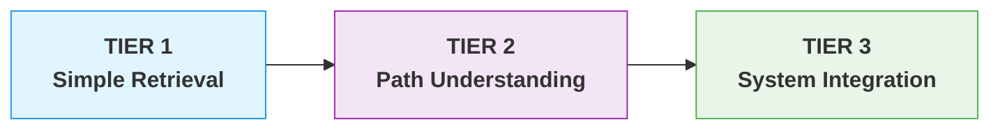

### 🔥 **TIER 1: Simple Retrieval (Beginner)**
**Challenge:** “What was the first SQL command you ever ran in your Factory?”
**Time Target:** 1 minute

**Your Path:**
1. Navigate to `my-first-day/sql-commands.md` (created in Pillar 1, Module 0)
2. Copy the first SQL command
3. Paste it here: `________________________________________`

**Why This Matters:** Tests basic navigation to known, early work.

---

### 🔥🔥 **TIER 2: Path Understanding (Intermediate)**
**Challenge:** “Where should your Module 1 practice exercises be saved?”
**Time Target:** 1 minute

**Your Path:**
1. Navigate to the exact folder path for Module 1 practice
2. Copy the full path from your browser/file explorer
3. Paste it here: `________________________________________`

**Expected Answer:** `Learning/Level-1-beginner/ACQUIRE/Module1-Introduction-Database-AICo-pilot/2-practiceExercises/`

**Why This Matters:** Tests understanding of the isomorphic structure.

---

### 🔥🔥🔥 **TIER 3: System Integration (Advanced)**
**Challenge:** “What’s the core AI rule for ACQUIRE phase, and which document contains your proof of using it?”
**Time Target:** 3 minutes

**Your Path:**
1. **Find the Rule:** Navigate to `References/prompts.md` → Student Mode boundary
2. **Find the Proof:** Navigate to your first investigation file
3. **Complete this statement:**
   
   > “During ACQUIRE, the AI provides ______ instead of ______. My proof is in ______, which shows I used this rule when investigating the ______ table.”

**Expected Completion:**
> “During ACQUIRE, the AI provides **conceptual guidance** instead of **complete code**. My proof is in **first_investigation.md**, which shows I used this rule when investigating the **students** table.”

**Why This Matters:** Tests integration of rules, documentation, and system understanding.

---

## 📊 **Fire Drill Results Log**

**Action:** Create a new file `fire_drill_results.md` in your `META_VAULT/` folder and log:

```markdown
## Fire Drill Results - [Date]

### Tier 1: Simple Retrieval
- **Time taken:** [ ] seconds
- **Command found:** [Paste the SQL command]
- **Confidence:** [High/Medium/Low]

### Tier 2: Path Understanding  
- **Time taken:** [ ] seconds
- **Path confirmed:** [Yes/No]
- **Insight:** [One thing you noticed about the structure]

### Tier 3: System Integration
- **Time taken:** [ ] seconds
- **Statement completed:** [Yes/No]
- **Key realization:** [What you learned about your system]

### Total Time:** [ ] minutes
### System Efficiency Score:** [Rate 1-10]

### Archivist's Reflection:
[Write one sentence about what this exercise revealed about your system mastery.]
```

**The Lesson:** This progressive challenge proves your system connects past work, current organisation, and conceptual understanding. Each tier builds your confidence in navigating your cognitive map.

---

## ⏱️ **Your Daily 5-Minute Vault Ritual**

**Every learning session, spend 5 minutes on these 3 actions:**

1. **Open:** Navigate to today's module folder (2 minutes of muscle memory)
2. **Review:** Look at yesterday's work (1 minute of continuity)
3. **Commit:** Make one small save before you start (2 minutes of discipline)

**Why 5 minutes matters:** It's not about the time—it's about the **ritual**. This tiny habit wires your brain to see your Vault as an essential part of learning, not an optional chore.

<div style="border: 3px solid #2196f3; border-radius: 10px; padding: 20px; margin: 20px 0; background: linear-gradient(135deg, #e3f2fd 0%, #bbdefb 100%);">

### 🌐 **Your Anytime, Anywhere Learning Engine**

Your Vault lives in the cloud (GitHub). The 5‑minute ritual **activates** it – building the muscle memory to navigate, retrieve, and commit.


- **Anytime access** – notes on your phone during commute  
- **Anywhere retrieval** – review concepts on a tablet at a coffee shop  
- **Any device continuity** – switch seamlessly between laptop, tablet, and phone  

> ⚡ **PROFESSIONAL SUPERPOWER** – This is what separates hobbyists from professionals: your knowledge is no longer trapped on a single machine. It’s a portable career asset.

</div>

---
## ✅ **Knowledge Base Validation Test**

<div style="border: 3px solid #4caf50; border-radius: 10px; padding: 25px; margin: 30px 0; background: linear-gradient(135deg, #e8f5e8 0%, #f1f8e9 100%); box-shadow: 0 8px 20px rgba(76, 175, 80, 0.2);">

### **🧪 The Archivist's Readiness Audit**

**Objective:** Confirm your Vault is calibrated for active, professional use.

#### **📋 Self-Assessment Checklist:**
- [ ] **The four-view structure** is fully created for the ACQUIRE phase, from `Learning/Level-1-beginner/ACQUIRE/` down to each module's sub‑folders.
- [ ] **Capstone Reports folders** are created under `Projects/Level-1-beginner/ACQUIRE/Capstone Reports/` (`CEO Reports/`, `CTO Reports/`, `CFO Reports/`).
- [ ] **Foundational artifacts are seeded:** `first_investigation.md` is moved to Module 1, `prompts.md` is initialized in `References/`, and tracking logs are ready in `META_VAULT/`.
- [ ] **The Archivist's Fire Drill** is complete, and your times/reflections are fully logged inside `META_VAULT/fire_drill_results.md`.
- [ ] **I understand that this Vault evolves across all future phases** and is not a temporary course folder.

**If all items are checked, your Vault is officially commissioned. You have successfully graduated from a consumer of information to an Archivist of Knowledge.**

</div>

---

## 🚀 **Your Calibration Navigation Journey**

**Complete ALL 5 steps in sequence before Module 1:**

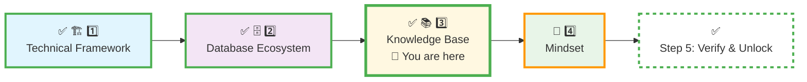

### **🔄 Navigation Controls:**

**⬅️ Previous Step:** [Database Ecosystem Calibration](./2_Database_Ecosystem.md)

**➡️ Next Step:** Fortify the psychological foundation for your journey.

<div align="center" style="border: 3px solid #ff9800; border-radius: 10px; padding: 25px; margin: 30px 0; background: linear-gradient(135deg, #fff8e1 0%, #ffecb3 100%); box-shadow: 0 8px 20px rgba(255, 152, 0, 0.2);">

### **🎯 Knowledge Architecture Commissioned**

**Proceed to forge the resilient mindset that will bring this structure to life:**

# [▶️ **NEXT: MINDSET TUNING**](./4_Mindset.md)

**Build the Artisan's Ego to wield your newly calibrated tools.**

<small>⏱️ *Estimated time: 20-25 minutes*</small>

</div>

**🚫 Module 1 remains locked until ALL 5 calibration steps are complete.**

---

<div align="center" style="margin-top: 40px; padding: 15px; background: #f5f5f5; border-radius: 6px; font-size: 0.9em;">

**Calibration Time:** 25-30 minutes  
**Calibration Focus:** Four-View Architecture & Documentation Ritual  
**Next Step:** Mindset Tuning  
**Core Principle:** A professional's knowledge is not what they've read, but what they've **archived in a system they can instantly retrieve.** When in doubt, look up at your North Star diagram—you are building something monumental.

</div>


---

*Part of our mission for 🎯 Quality Education for Anyone, Anywhere, Anytime — 💫 with Comfort, Convenience at no Cost.*

**Level 1 | ACQUIRE Phase | Knowledge Base Commissioned | Ready for Mindset Tuning**
