# 🗄️🤖 SQL & GenAI Course
**🎯 Quality Education for Anyone, Anywhere, Anytime — 💫 with Comfort, Convenience at no Cost**

## 📚 **3 KNOWLEDGE BASE: ACQUIRE Phase Calibration**
---

## 📍 **YOUR PILLAR PROGRESSION**
**Current Status:** Pillar 1-2 ✅ Complete • Pillar 3 begins now

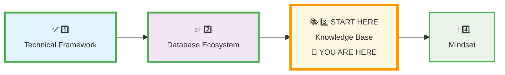

## 🎯 **Quick Win Promise**

**In the next 25 minutes,** you will transform your Vault from a blank page into the living, structured architecture of your professional mind. You will move from *taking notes* to *building your knowledge portfolio*—a system engineered to grow with you from ACQUIRE to ARCHITECT.

**Your Goal:** To commission your personal knowledge archive and master the daily ritual that turns practice into permanent, portfolio-ready skill.

<div style="border: 3px solid #ff9800; border-radius: 10px; padding: 20px; margin: 20px 0; background: linear-gradient(135deg, #fff8e1 0%, #ffecb3 100%);">

### 💎 **The Ultimate Treasure Vault Insight**

**What you're building isn't just organization—it's learning freedom.** Your calibrated Vault gives you **Anytime, Anywhere, Any Device access to your growing expertise.** Whether you're on your laptop at home, your tablet at a cafe, or your phone between meetings, your entire learning journey travels with you. This is the 24-carat gold of modern skill-building: a cloud-based extension of your brain that never sleeps.

</div>

---

## 📋 **Prerequisites & Quick Checklist**

**Before you begin, ensure you have completed:**
- [x] **Pillar 1: Technical Framework** calibrated ([`1_Technical_Framework.md`](./1_Technical_Framework.md))
- [x] **Pillar 2: Database Ecosystem** calibrated ([`2_Database_Ecosystem.md`](./2_Database_Ecosystem.md))
- [x] **Tab 4: The Vault** accessible (your GitHub or local repository)
- [ ] **Mindset:** Ready to transition from student to **archivist**.

**Knowledge Base Mission:**  
**Isomorphic Structure | Ritualized Documentation | Portfolio-First Thinking**

---

## 🧠 **Deep Philosophy: The Archivist's Mindset & The Ultimate Vision**

<div align="center" style="border: 2px solid #ff9800; border-radius: 8px; padding: 20px; margin: 20px 0; background: #fff8e1;">

### **🚀 Foundation First, AI Next, Projects Last.**
### **💎 Gemstone by Gemstone, Skill by Skill.**

</div>

**Your ACQUIRE Mandate:**  
**Manual Skill Building | Conceptual AI Only | Cognitive Separation | Documentation Discipline**

Your Vault is **not a drawer for scraps of paper**. It is the **engine of your professional transformation**—your externalized cognitive map, a mirror of how expert data minds organize knowledge. Every folder you create is wiring your brain with professional thought patterns. The "Documentation Discipline" of the ACQUIRE Mandate is fulfilled here. Every note you file, every prompt you save, every reflection you write is an act of forging your identity as a Data Artisan.

**The Archivist's Creed:** "I do not just consume knowledge; I **structure it**. I do not just complete exercises; I **curate my evidence**. My Vault is the tangible proof of my journey from observer to Artisan."

This pillar calibrates that engine.

**The Emotional Shift You're Making:**
For the first time, you're not just "doing homework" - you're **building your professional brain in public.** Each folder is a neural pathway. Each file is a memory you can retrieve. Each commit is a timestamp of growth. This structure turns the invisible process of learning into visible, tangible progress that you - and future employers - can actually see and measure.

### **🌟 Your North Star: Visualize The Destination**

When the work feels granular or your spirits dip, return to this vision. This is what you are building—not just folders, but **your professional data identity.**

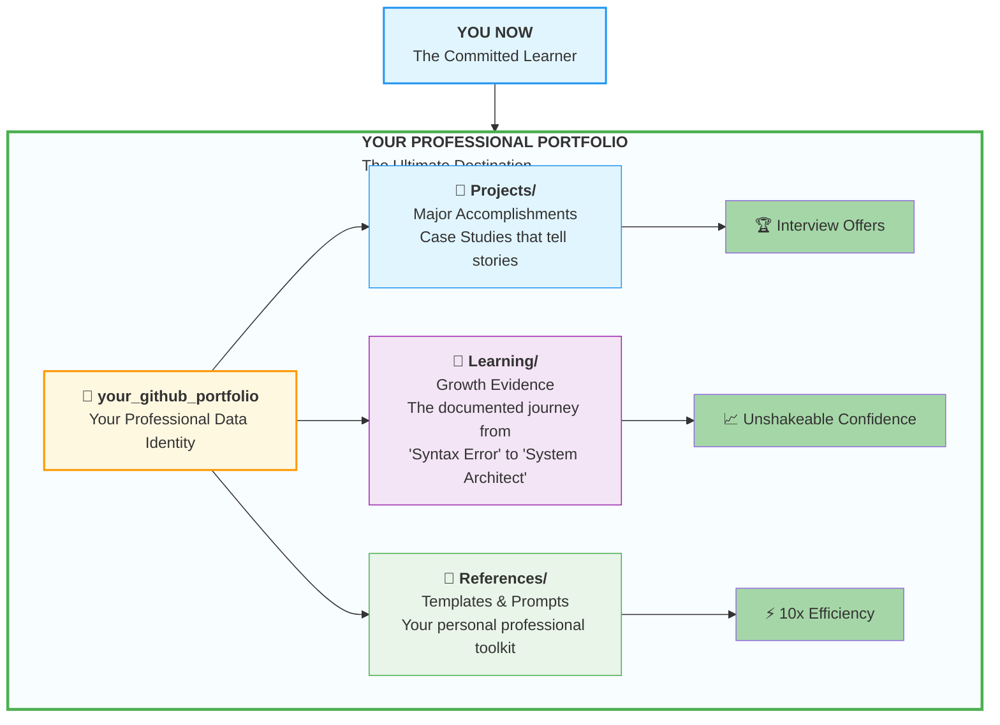

**Remember this when motivation wanes:** Every `struggle_log.md` entry, every query in `practiceExercises/`, is a brick in this edifice. You are not just learning SQL—you are constructing the public proof of your transformation.

---

## 📐 **The Four Views of Your Knowledge Architecture**

To build like a professional, you must see like an architect. We will examine your Vault through four progressive views, zooming from the professional portfolio down to your daily workspace.

### **🔭 View 1: Bird's-Eye View - The Employer-Ready Structure**

This is the *professional why*. It shows the top-level portfolio structure that hiring managers actually want to see—clean, organized, and telling a clear story of your growth.

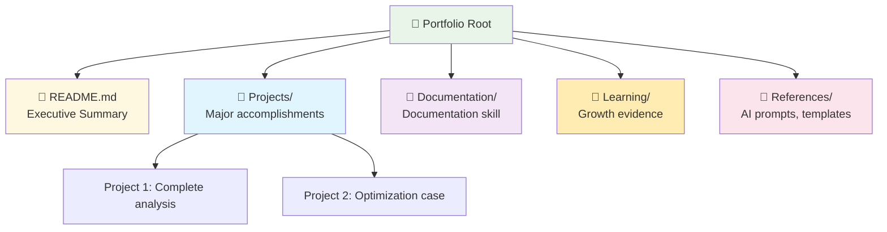

This is your portfolio's public face. The `Learning/` folder is where your entire course journey will be meticulously documented as **growth evidence** for employers and your future self.

**The Professional Insight:** This structure isn't arbitrary—it's engineered for career impact. The `README.md` is your elevator pitch. `Projects/` showcase what you can build, following a clear progression from study to creation. We'll explore this fully when you're ready. `Documentation/` demonstrates your ability to communicate clearly about technical work—a critical professional skill. `Learning/` documents your growth journey. `References/` contain your professional toolkit. Together, they create an undeniable case for your competence.

**The `Projects/` folder** will eventually contain your growing portfolio, following a clear progression from study to creation. We'll explore this fully when you're ready.

---

### **📐 View 2: Telescopic View - The Learning Journey**

Zooming into the `Learning/` folder, this view reveals its structure, which **mirrors the course repository itself**. This is the *isomorphic what*.

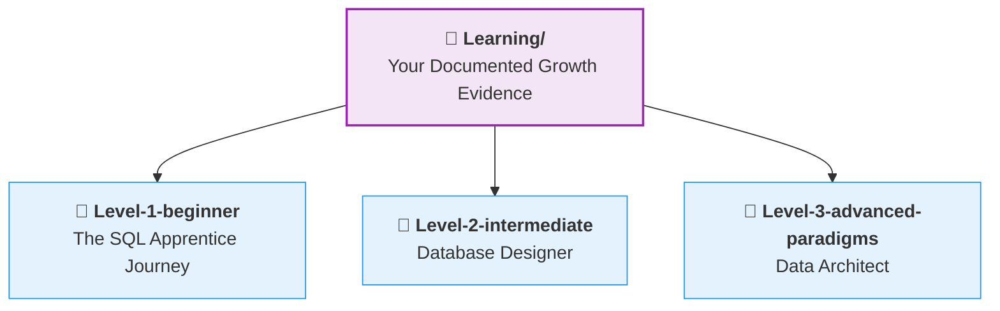

**The Architectural Principle:** This creates a perfect 1:1 map between the course content in **Tab 1** and your personal work in **Tab 4**. You are systematically building your own parallel version of the course knowledge.

---

### **📐 View 2b: Telescopic View - The Projects Journey**

Zooming into the `Projects/` folder, this view shows how your professional work is organized by skill level, mirroring your learning journey.

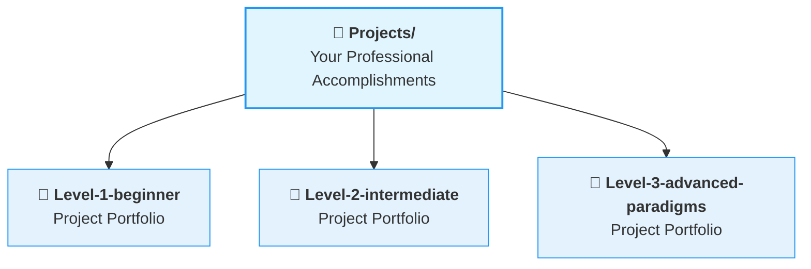

**The Career Progression:** Your project work grows with your skills. Beginner projects demonstrate foundational competence, intermediate projects show design thinking, and advanced projects showcase architectural mastery.

---

### **🔬 View 3: Microscopic View - The Level 1 Phase Architecture**

This view zooms into the Level-1-beginner folder, now showing the clear separation between **learning phases** and **project phases.** This is the *progressive when*.

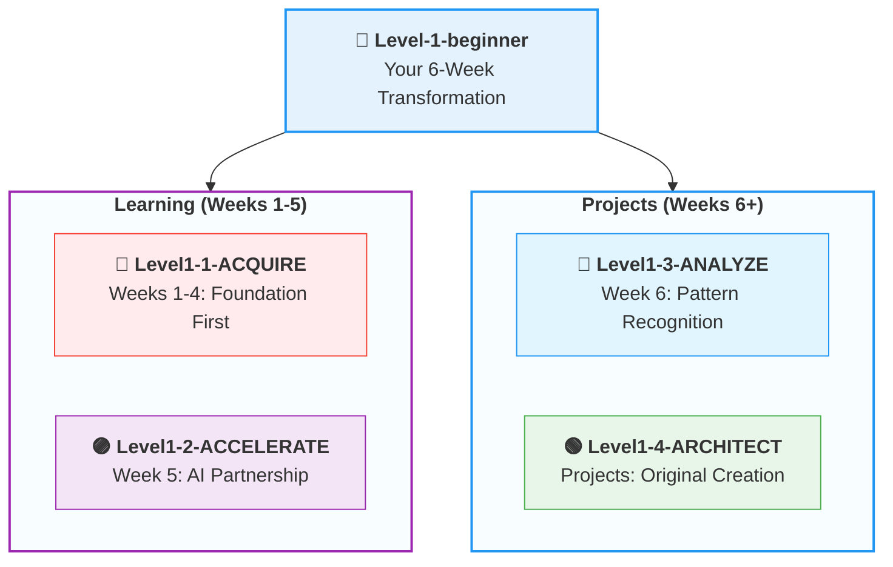

**The Growth Insight:** Your skills evolve deliberately. This structure ensures your early **foundational work (`ACQUIRE`)** is kept separate from your advanced **project work (`ARCHITECT`)**, telling a clear, compelling story of your growth to anyone who views your portfolio.

---


## 📁 View 4: Detail View - **The Workspace Contrast**

This view reveals a critical professional insight: **You organize learning differently from how you organize work.** This is the *ritualistic how*.

---

### **The ACQUIRE Module Workspace**
This view shows the standardized workspace structure within the ACQUIRE phase (under `Learning/`).

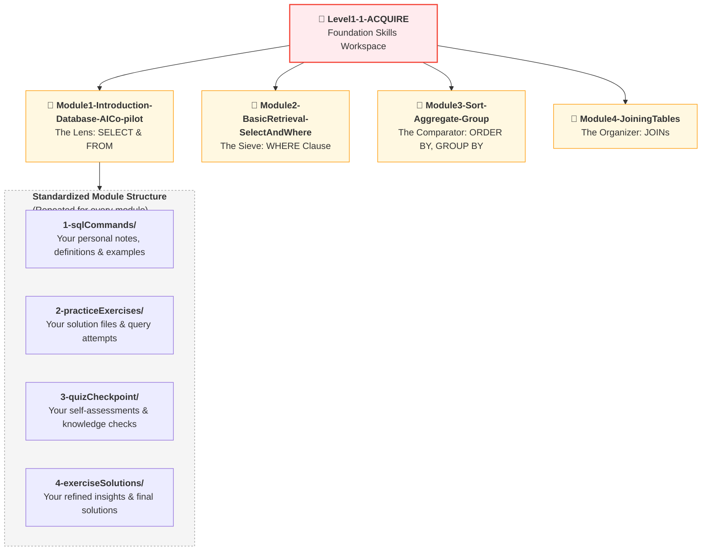

**Learning Workspace Pattern:** Every module follows the exact same four-folder structure. This consistency builds **habit** and **automaticity** – you never have to wonder where to save anything.

---

### **The ANALYZE & ARCHITECT Project Workspace**
This view shows how project phases have a different, more professional structure under `Projects/`. This is where your portfolio grows.

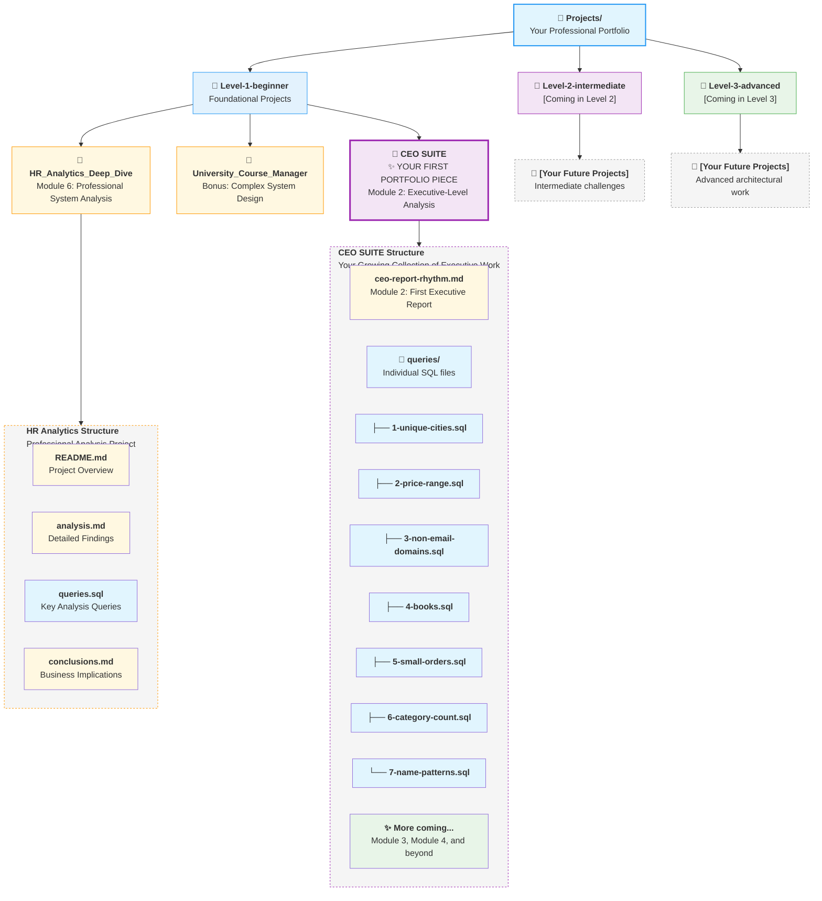

**Project Workspace Pattern:** Unlike the rigid learning structure, each project has a custom structure tailored to its needs. The **CEO SUITE** shows individual query files (perfect for discrete business questions), while **HR Analytics** shows a more narrative structure with README and conclusions.

---

### **The Meta Workspace: Tracking Your Growth**
Alongside your learning and project workspaces, you maintain a dedicated **META_VAULT** for tracking your journey. This folder lives at the same level as your phase folders within `Learning/`.

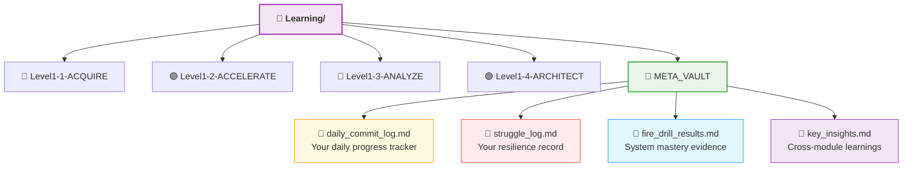

**Meta Workspace Purpose:** This is your **learning laboratory** – where you track patterns, struggles, and breakthroughs that span across modules.

---

### **The Complete Structural Contrast**
This master diagram shows how all three workspaces interact, now including the **CEO SUITE** as a premium project folder and showing the growth path across levels.

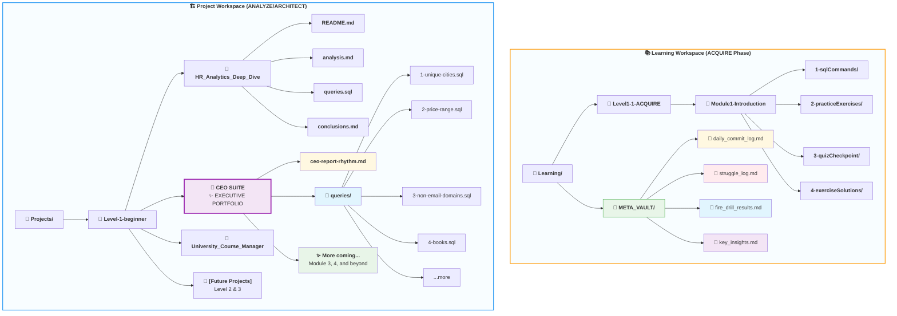

---

### 🌱 **A Growing Portfolio**

The **CEO SUITE** is your first portfolio piece – but not your last.

| Level | What You'll Add |
|-------|-----------------|
| **Level 1 (Now)** | CEO SUITE, HR Analytics Deep Dive, University Course Manager |
| **Level 2 (Next)** | Intermediate projects with complex joins, optimization, and system design |
| **Level 3 (Future)** | Advanced architectural projects, full-scale systems, and original applications |

Your `Projects/` folder will grow with you. Each level adds new achievements, building toward a comprehensive portfolio that proves your evolution from Apprentice to Artisan.

---

### 🧠 **The Cognitive Science Behind This Contrast**

| Workspace | Structure | Cognitive Purpose |
|-----------|-----------|-------------------|
| **Learning** | Rigid, repeatable, standardized | Builds habits, reduces decision fatigue, automates organization |
| **Project** | Flexible, custom, outcome-focused | Trains adaptability, mirrors real-world work, showcases creativity |
| **Meta** | Reflective, tracking, cross-cutting | Develops metacognition, captures patterns, builds resilience |

**The Professional Insight:** You don't organize learning the same way you organize work – and your Vault reflects that distinction. This isn't just storage; it's a **cognitive map** of how experts think.

---

### ✅ **What This View Teaches**

| Lesson | Why It Matters |
|--------|----------------|
| **Learning is structured** | Consistency builds automaticity |
| **Projects are unique** | Real work doesn't fit templates |
| **Growth is visible** | Your portfolio tells your story |
| **CEO SUITE is special** | First portfolio piece – but not last |
| **Future is anticipated** | Placeholders for Level 2 & 3 create excitement |

---

### **🔄 The Complete Learning Loop**

This final diagram synthesizes the *why* from the beginning with the *how* from your new structure, showing the complete flow of knowledge from learning to portfolio.

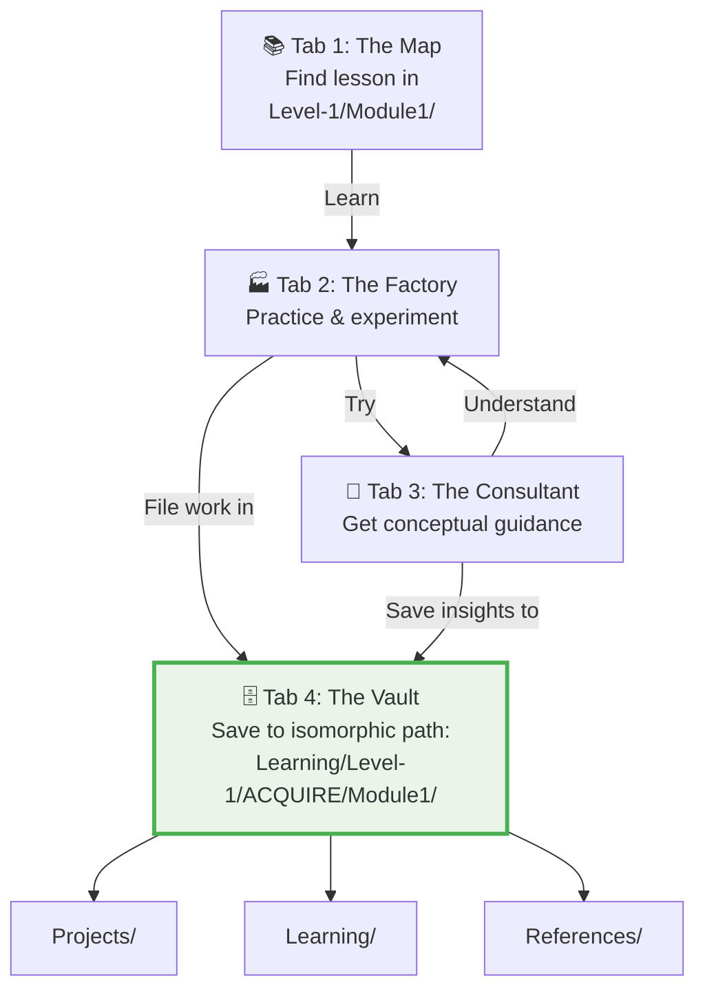

**The System in Motion:** When you learn a concept in Tab 1, you now have an automatic, unambiguous destination for your work in Tab 4. This seamless flow is the calibrated state of your Knowledge Base.

---

## 🧭 **THE COGNITIVE MAP REVELATION**

<div style="border: 3px solid #9c27b0; border-radius: 10px; padding: 20px; margin: 25px 0; background: linear-gradient(135deg, #f3e5f5 0%, #e1bee7 100%);">

### **🚨 This Is NOT A Storage System**

**What you are building is a COGNITIVE MAP—an external representation of how expert data professionals organize knowledge in their minds.**

| What It Looks Like | What It Actually Is |
|-------------------|----------------------|
| `Projects/` folder | **Your "solution thinking" neural pathway** |
| `Module1-The_Lens/` | **Your "SELECT & FROM" mental category** |
| `1-sqlCommands/` | **Your personal definitions repository** |
| `struggle_log.md` | **Your resilience record** – proof that you transform obstacles into growth |
| Each commit | **A timestamp of cognitive growth** |

**The Cognitive Science Behind This:**
Experts don't just know more facts—they organize knowledge differently. Your brain naturally creates **categories** and **connections**. This folder structure is those categories made visible.

**When you save your first SQL query to:**
```
Learning/Level-1-beginner/Level1-1-ACQUIRE/Module1-The_Lens/2-practiceExercises/
```
**You are doing two things:**
1. **Externally:** Filing a query for later retrieval
2. **Internally:** Strengthening the neural pathway for "SELECT queries are practice exercises in the ACQUIRE phase of beginner SQL"

**This is why isomorphic structure matters:** You're not just mirroring folder names—you're **installing the expert's mental operating system.**
</div>

---
### 🧠 **The Psychology of Isomorphic Structure**

**Why This Feels Different (And Better):**
When you save your Module 1 work to `Learning/Level-1-beginner/Level1-1-ACQUIRE/Module1-The_Lens/`, you're doing something profound: you're **installing the expert's cognitive map.** 

The course creator has organized knowledge this way for a reason. By creating an identical structure for your own work, you're:
1. **Internalizing professional organization patterns** from day one
2. **Building mental models that scale** (this same structure works for any skill)
3. **Creating retrieval paths** that match how experts think about the domain
4. **Eliminating the "where did I put that?"** frustration forever

**But there's a deeper layer:** This isn't just about organization—it's about **cognitive wiring.** Every time you navigate this structure, you're reinforcing the same mental pathways that experts use. You're not just storing files; you're building an **externalized cognitive map** that trains your brain to think in professional patterns.

**The Cognitive Science Behind It:**
- **Chunking:** Grouping related concepts (like all `WHERE` clause exercises) reduces cognitive load and speeds up learning.
- **Pattern Recognition:** The consistent structure (Module 1, 2, 3, etc.) helps your brain recognize the progression of skills and how they build on each other.
- **Mental Retrieval Cues:** The folder names and paths become cues that trigger related knowledge in your mind.

**The beginner's secret:** Experts aren't smarter - they're better organized. You're now building that organization system.

**The Isomorphic Insight:** When your external structure (folders) matches the expert's internal structure (mental models), you're not just organizing—you're **aligning your cognition with mastery.** And by including a dedicated space for struggle, you're acknowledging that challenges are not detours but essential parts of the journey.

---
## 🎯 **FOR THE ABSOLUTE BEGINNER: YOUR "AHA!" MOMENT**

<div style="border: 3px solid #2196f3; border-radius: 10px; padding: 20px; margin: 25px 0; background: linear-gradient(135deg, #e3f2fd 0%, #bbdefb 100%);">

### **✨ What You're Actually Doing Here:**

**Right now, this structure might feel overwhelming. Let me simplify it:**

**You're building ONE THING: A perfect mirror of your learning journey.**

| What It Looks Like | What It Actually Is |
|-------------------|----------------------|
| `Projects/` folder | **Your trophy case** - Finished work you're proud of |
| `Documentation/` folder | **Your communication proof** - Shows you can explain complex topics clearly |
| `Learning/` folder | **Your journey map** - Every step you took to get here |
| `References/` folder | **Your toolkit** - The tools that helped you learn |
| `struggle_log.md` | **Your resilience gallery** - Every challenge you overcame |

**The magic happens here:**
```
Course Repository (Tab 1)   →   Your Vault (Tab 4)
Level-1/Module1/            →   Learning/Level-1-beginner/Level1-1-ACQUIRE/Module1-The_Lens/
```

**When you save your Module 1 work, you're creating YOUR version of Module 1.**  
**When you complete Level 1, you'll have YOUR version of Level 1.**  
**When you finish the course, you'll have YOUR version of the entire course.**

**That's the secret: You're not just learning—you're building a parallel universe of your expertise.**

> **🧠 Cognitive Map vs. Storage System:**
> 
> **Storage System Thinking:** "Where should I put this file?"
> **Cognitive Map Thinking:** "Which part of my growing expertise does this represent?"
> 
> The moment you shift from the first question to the second, you stop being a student and start being an artisan.

</div>

---

## 🏗️ **A Quick Glimpse at Your Project Future**

**Right now:** You're setting up your tools and learning the basics. That's perfect.

**Soon:** You'll work on projects that grow with your skills. Here's the simple version:

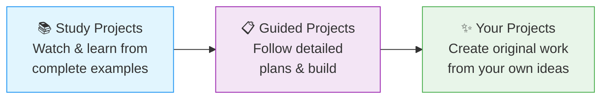

**The best part:** Every project uses the same professional structure. Once you learn it, you'll use it for everything.

**For now:** Just focus on building your knowledge base. The project details will unfold at exactly the right time.

> 🎯 **Beginner's Mantra:** "First I learn my tools. Then I learn my craft. Then I create."

---

## 📁 Quick Project Preview

In your `Projects/` folder, you'll eventually build three types of work:
- **Study projects** (complete examples to learn from)
- **Guided projects** (plans for you to implement)  
- **Your original projects** (from your own ideas)

**Don't worry about the details yet.** We'll reveal each layer when you're ready for it.

> **✨ Coming Soon: The CEO SUITE**
>
> In Module 2, File 7, you'll create your first executive-level deliverable – a complete analysis for a CEO. It will live in its own dedicated folder: `Projects/Level-1-beginner/CEO SUITE/`.
>
> This isn't just practice. It's portfolio gold.

---

## ⚙️ **Calibration Step 1: Impose the Isomorphic Structure**

**Action:** Build the physical framework. In your **Tab 4 (The Vault)**, create the exact folder tree revealed in the four views.

1.  Create the employer-ready root: `your_github_portfolio/`
2.  Inside, create: `Projects/`, `Learning/`, `References/`.
3.  Within `Learning/`, create: `Level-1-beginner/`.
4.  Within `Level-1-beginner/`, create the four phase folders: `Level1-1-ACQUIRE/`, `Level1-2-ACCELERATE/`, `Level1-3-ANALYZE/`, `Level1-4-ARCHITECT/`.
5.  Within `Level1-1-ACQUIRE/`, create the four module folders: `Module1-Introduction-Database-AICo-pilot/`, `Module2-BasicRetrieval-SelectAndWhere/`, `Module3-Sort-Aggregate-Group/`, `Module4-JoiningTables/`.
6.  **Within each module folder**, create the four standardized sub-folders: `1-sqlCommands/`, `2-practiceExercises/`, `3-quizCheckpoint/`, `4-exerciseSolutions/`.

> **🎯 Professional Insight:** You are not just making folders. You are **pre-allocating space for your future competence**. This act of creation is the first step in thinking like an architect who builds systems before filling them.

---

## 🧪 **Calibration Step 2: Populate with Foundational Artifacts**

**Action:** Seed your Vault with the first artifacts of your journey, creating immediate value and context.

1.  **Migrate Your First Investigation:**
    *   Locate your `first_investigation.md` file from Pillar 2.
    *   Move it to: `Learning/Level-1-beginner/Level1-1-ACQUIRE/Module1-Introduction-Database-AICo-pilot/2-practiceExercises/`

2.  **Establish Your System Core:**
    *   In the `References/` folder, create a file named `prompts.md`.
    *   Paste your complete **Student Mode Prompt** into this file. This is now your master prompt reference.
    *   In `Learning/`, create a `META_VAULT/` folder. Inside it, create two files:
        *   `daily_commit_log.md` – to track your daily progress.
        *   `struggle_log.md` – to document challenges and breakthroughs. (You'll learn how to use this in **Pillar 4: Mindset**; for now, just create the file to reserve its place in your cognitive map.)

---

## 🚨 **Calibration Step 3: The Archivist's Fire Drill**

**Mission:** Prove your cognitive map works through **three progressive challenges** that test different aspects of your system mastery.

**Time Budget:** Complete all three challenges in **5 minutes total**.

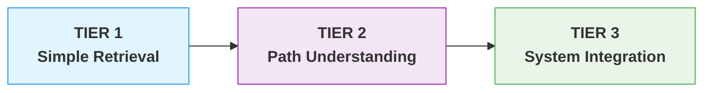

---

### **🔥 TIER 1: Simple Retrieval (Beginner)**
**Challenge:** "What was the first SQL command you ever ran in your Factory?"
**Time Target:** 1 minute

**Your Path:**
1. Navigate to `my-first-day/sql-commands.md` (created in Pillar 1, Module 0)
2. Copy the first SQL command
3. Paste it here: `________________________________________`

**Why This Matters:** Tests basic navigation to known, early work.

---

### **🔥🔥 TIER 2: Path Understanding (Intermediate)**
**Challenge:** "Where should your Module 1 practice exercises be saved?"
**Time Target:** 1 minute

**Your Path:**
1. Navigate to the exact folder path for Module 1 practice
2. Copy the full path from your browser/file explorer
3. Paste it here: `________________________________________`

**Expected Answer:** `Learning/Level-1-beginner/Level1-1-ACQUIRE/Module1-Introduction-Database-AICo-pilot/2-practiceExercises/`

**Why This Matters:** Tests understanding of the isomorphic structure.

---

### **🔥🔥🔥 TIER 3: System Integration (Advanced)**
**Challenge:** "What's the core AI rule for ACQUIRE phase, and which document contains your proof of using it?"
**Time Target:** 3 minutes

**Your Path:**
1. **Find the Rule:** Navigate to `References/prompts.md` → Student Mode boundary
2. **Find the Proof:** Navigate to your first investigation file
3. **Complete this statement:**
   
   > "During ACQUIRE, the AI provides ______ instead of ______. My proof is in ______, which shows I used this rule when investigating the ______ table."

**Expected Completion:**
> "During ACQUIRE, the AI provides **conceptual guidance** instead of **complete code**. My proof is in **first_investigation.md**, which shows I used this rule when investigating the **students** table."

**Why This Matters:** Tests integration of rules, documentation, and system understanding.

---

## 📊 **Fire Drill Results Log**

**Action:** Create a new file `fire_drill_results.md` in your `Learning/META_VAULT/` folder and log:

```markdown
## Fire Drill Results - [Date]

### Tier 1: Simple Retrieval
- **Time taken:** [ ] seconds
- **Command found:** [Paste the SQL command]
- **Confidence:** [High/Medium/Low]

### Tier 2: Path Understanding  
- **Time taken:** [ ] seconds
- **Path confirmed:** [Yes/No]
- **Insight:** [One thing you noticed about the structure]

### Tier 3: System Integration
- **Time taken:** [ ] seconds
- **Statement completed:** [Yes/No]
- **Key realization:** [What you learned about your system]

### Total Time: [ ] minutes
### System Efficiency Score: [Rate 1-10]

### Archivist's Reflection:
[Write one sentence about what this exercise revealed about your system mastery.]
```

**The Lesson:** This progressive challenge proves your system connects past work, current organization, and conceptual understanding. Each tier builds your confidence in navigating your cognitive map.

---
## ⏱️ **Your Daily 5-Minute Vault Ritual**

**Every learning session, spend 5 minutes on these 3 actions:**

1. **Open:** Navigate to today's module folder (2 minutes of muscle memory)
2. **Review:** Look at yesterday's work (1 minute of continuity)
3. **Commit:** Make one small save before you start (2 minutes of discipline)

**Why 5 minutes matters:** It's not about the time—it's about the **ritual**. This tiny habit wires your brain to see your Vault as an essential part of learning, not an optional chore.

<div style="border: 3px solid #2196f3; border-radius: 10px; padding: 20px; margin: 20px 0; background: linear-gradient(135deg, #e3f2fd 0%, #bbdefb 100%);">

### 🌐 **Your Anytime, Anywhere Learning Engine**

**The magic of this 5-minute ritual:** It transforms your Vault from a static archive into a **living, cloud-based extension of your brain**. 

**You now have:**
- **🚀 Anytime access:** Pull up notes on your phone during commute
- **🌍 Anywhere retrieval:** Review concepts on your tablet at a coffee shop  
- **💻 Any device continuity:** Switch seamlessly between laptop, tablet, and phone

**This is professional learning redefined:** No more "I left my notebook at home." No more "Which computer was that on?" Your expertise lives in the cloud, synchronized across every device, growing with every 5-minute ritual.

</div>

**Bonus:** After each session, ask yourself: *"What one thing will I want to find again in 6 months?"* Save that in your Vault—your future self, on whatever device they're using, will thank you.

---

## ✅ **Knowledge Base Validation Test**

<div style="border: 3px solid #4caf50; border-radius: 10px; padding: 25px; margin: 30px 0; background: linear-gradient(135deg, #e8f5e8 0%, #f1f8e9 100%); box-shadow: 0 8px 20px rgba(76, 175, 80, 0.2);">

### **🧪 The Archivist's Readiness Audit**

**Objective:** Confirm your Vault is calibrated for active, professional use.

#### **📋 Self-Assessment Checklist:**
- [ ] **The four-view structure** is fully created in my Tab 4, from the `Projects/` root down to module sub-folders.
- [ ] **Foundational artifacts** are placed (`first_investigation.md`, `prompts.md`).
- [ ] **META_VAULT folder created** with `daily_commit_log.md` and `struggle_log.md`.
- [ ] **The Fire Drill** was completed successfully in under 3 minutes.
- [ ] **I understand the four views:** I can explain the purpose of each zoom level and how they connect.
- [ ] **I can articulate the ritual:** I know the exact path where work from Module 3 will be saved.

#### **🎯 Final Confidence Check:**
Look at your Vault's structure. Can you immediately see the path for:
1.  Your notes on the `WHERE` clause syntax?
2.  Your solution to a complex `ORDER BY` exercise?
3.  Your final project documentation?
4.  Where you'll log your next struggle?

If the path is instantly clear, your calibration is complete. Your knowledge now has a permanent, logical home—and space has been reserved for every challenge you'll overcome.

</div>

---

## 🚀 **Your Calibration Navigation Journey**

**Complete ALL 5 steps in sequence before Module 1:**

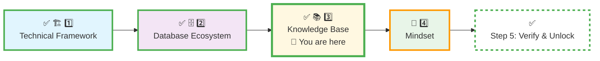

### **🔄 Navigation Controls:**

**⬅️ Previous Step:** [Database Ecosystem Calibration](./2_Database_Ecosystem.md)

**➡️ Next Step:** Fortify the psychological foundation for your journey.

<div align="center" style="border: 3px solid #ff9800; border-radius: 10px; padding: 25px; margin: 30px 0; background: linear-gradient(135deg, #fff8e1 0%, #ffecb3 100%); box-shadow: 0 8px 20px rgba(255, 152, 0, 0.2);">

### **🎯 Knowledge Architecture Commissioned**

**Proceed to forge the resilient mindset that will bring this structure to life:**

# [▶️ **NEXT: MINDSET TUNING**](./4_Mindset.md)

**Build the Artisan's Ego to wield your newly calibrated tools.**

<small>⏱️ *Estimated time: 20-25 minutes*</small>

</div>

**🚫 Module 1 remains locked until ALL 5 calibration steps are complete.**

---

<div align="center" style="margin-top: 40px; padding: 15px; background: #f5f5f5; border-radius: 6px; font-size: 0.9em;">

**Calibration Time:** 25-30 minutes  
**Calibration Focus:** Four-View Architecture & Documentation Ritual  
**Next Step:** Mindset Tuning  
**Core Principle:** A professional's knowledge is not what they've read, but what they've **archived in a system they can instantly retrieve.** When in doubt, look up at your North Star diagram—you are building something monumental.

</div>

---

*Part of our mission for 🎯 Quality Education for Anyone, Anywhere, Anytime — 💫 with Comfort, Convenience at no Cost.*

**Level 1 | ACQUIRE Phase | Knowledge Base Commissioned | Ready for Mindset Tuning**


