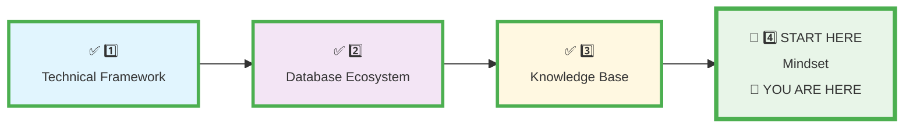
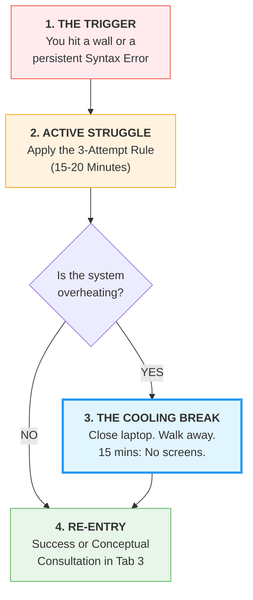
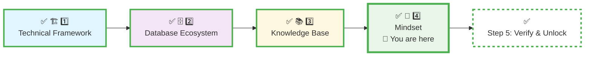

# 🗄️🤖 SQL & GenAI Course
**🎯 Quality Education for Anyone, Anywhere, Anytime — 💫 with Comfort, Convenience at no Cost**

## 🧠 **4 MINDSET: ACQUIRE Phase Calibration**
---
## 📍 **YOUR PILLAR PROGRESSION**
**Current Status:** Pillar 1-3 ✅ Complete • Final Pillar begins now


---

## 🎯 **Quick Win Promise**

**In the next 25 minutes,** you will perform the final and most critical calibration: upgrading your **Internal Operating System** required for high-level data investigation. You will transform your relationship with struggle, installing the resilient, curious, and systematic mindset of the Data Artisan.

**Your Goal:** To forge your **Artisan's Ego**—the psychological engine that will turn confusion into curiosity and every error into your most precise teacher.

---

## 📋 **Prerequisites & Quick Checklist**

**Before you begin, ensure you have completed:**
- [x] **Pillar 1: Technical Framework** calibrated ([`1_Technical_Framework.md`](./1_Technical_Framework.md))
- [x] **Pillar 2: Database Ecosystem** calibrated ([`2_Database_Ecosystem.md`](./2_Database_Ecosystem.md))
- [x] **Pillar 3: Knowledge Base** calibrated ([`3_Knowledge_Base.md`](./3_Knowledge_Base.md))
- [ ] **Openness:** Willingness to engage with discomfort as a tool.

**Mindset Mission:**  
**Deep Work Protocol | Error Reframing | The Cooling Protocol | The 3-Attempt Rule | Artisan Ego**

---

## 🧠 **Deep Philosophy: The Artisan's Operating System**

<div align="center" style="border: 2px solid #ff9800; border-radius: 8px; padding: 20px; margin: 20px 0; background: #fff8e1;">

### **🚀 Foundation First, AI Next, Projects Last.**
### **💎 Gemstone by Gemstone, Skill by Skill.**

</div>

**Your ACQUIRE Mandate:**  
**Manual Skill Building | Conceptual AI Only | Cognitive Separation | Documentation Discipline**

Your tools are sterile, your rules are clear, and your archive is perfect. Now, we calibrate the most complex component: **You**.

In the **ACQUIRE phase**, we have intentionally removed the "magic" of AI code generation. Why? Because **struggle is the only way to build neural density.** **The Artisan's Ego** is a specific psychological state where you:

1. **Welcome Errors:** A `Syntax Error` is not a judgment on your intelligence; it is a precise feedback signal from the machine.
2. **Value the Process over the Answer:** Finding the answer is easy (AI can do it); *understanding why* the answer is correct is the only thing that makes you employable.
3. **Respect the Boundaries:** You understand that "shortcuts" are actually "skill-cuts."

A Data Artisan is not defined by writing flawless code on the first try. An Artisan is defined by a **resilient, curious, and systematic mind** that treats every `Syntax Error` as valuable feedback and every block as a puzzle to be methodically solved. Your mindset is your primary development environment. This pillar installs the **Artisan's Operating System**.

---

<div align="center" style="border: 2px solid #2196f3; border-radius: 8px; padding: 20px; margin: 25px 0; background: #e1f5fe;">

### **🎯 Your North Star: Remember What You Are Building**

The resilience you are about to forge is not for its own sake. It is the **fuel** for a monumental project: **your professional portfolio.**

When frustration builds or motivation dips, pause. Close your eyes and visualize the **North Star** from your Knowledge Base. See the `Projects/`, `Learning/`, and `References/` folders you built. See the clear path from your first `Syntax Error` to becoming a `System Architect`.

Every entry in your `struggle_log.md` is a brick in that edifice. Every moment of deliberate patience is strengthening its foundation.

**This mindset is the builder's spirit for that cathedral.**

➡️ **[Revisit Your North Star Diagram](../Section1-ACQUIRE/3_Knowledge_Base.md#-your-north-star-visualize-the-destination)**

</div>

---
## 🚫 MINDSET PITFALLS & ANTIDOTES

### 🎯 Pitfall 1: The Comparison Trap
**Symptom:** "Others are building walls while I'm still digging"
**Antidote:** "They might be building on sand. I'm building on bedrock."
**Action:** Focus on YOUR foundation depth, not others' visible progress.

### 🎯 Pitfall 2: The Impatience Spiral
**Symptom:** "I just want to BUILD something real!"
**Antidote:** "Cathedrals take years. Foundations take months. I'm on schedule."
**Action:** Review your progress notes - you ARE building something real.

### 🎯 Pitfall 3: The Complexity Craving
**Symptom:** "This is too basic, I need something challenging"
**Antidote:** "Mastery lives in the basics. Professionals drill fundamentals daily."
**Action:** Challenge yourself to explain basics MORE simply, not do more complex things.

### 🎯 Pitfall 4: The Tool Obsession
**Symptom:** "Maybe a different IDE/AI/book would help..."
**Antidote:** "The shovel doesn't dig the foundation. The digger does."
**Action:** Stick with your tools for 4 weeks minimum before evaluating.

### 🎯 Pitfall 5: The Motivation Dip
**Symptom:** "I don't feel like doing this today"
**Antidote:** "Foundation digging isn't about feeling. It's about showing up."
**Action:** 5-minute rule: Just do 5 minutes. Usually leads to more.

### 🎯 Pitfall 6: The Isolation Illusion
**Symptom:** "I'm learning alone. Everyone else is ahead."
**Antidote:** "Your Vault connects you to your past self and future employers. You're part of a lineage of Artisans."
**Action:** Open your Vault. Look at your first investigation. See your growth. You're not alone - your documented journey is your companion.

---
---

## ❄️ **The Cooling Protocol: Thermal Management for the Brain**

When you hit a true roadblock and feel cognitive “head-spinning”: This is your brain rewiring. Your subconscious needs time to process. Do not force it. ** Close the Browser Office. Disengage Physically.**

Frustration is a physical state. When you "overheat," your logical brain (Prefrontal Cortex) shuts down and your emotional brain takes over. You cannot learn in this state. You must use the **Cooling Protocol.**



### **The Protocol Rules:**

* **The 15-Minute Struggle:** You must try to solve a problem for at least 15 minutes using only your **Map (Tab 1)** and **Factory (Tab 2)** before seeking help.
* **The Hard Break:** If frustration turns to anger or "fog," you **must** walk away. Physical movement (a walk, water, stretching) triggers "Diffuse Mode" thinking, where your brain solves the problem in the background.
* **The "Cold" Re-entry:** When you return, you are "cold" (calm). You don't ask the AI for the answer; you describe your struggle to **The Consultant (Tab 3)** to find the missing concept.

---

## ⚖️ **The 3-Attempt Rule: Forging Resilience**

To ensure you are actually building skill, never move to Tab 3 until you have performed the **3-Attempt Sequence**:

1. **Attempt 1: The Intuition Check.** Write the query based on what you remember.
2. **Attempt 2: The Map Check.** Go back to **Tab 1 (The Map)**. Compare your query to the schema anchors and definitions. Correct and re-run.
3. **Attempt 3: The Deconstruction.** Break the query into smaller pieces. Run just `SELECT 1+1;` then `SELECT * FROM table;`. Find where it breaks.

**Only after these 3 attempts** are you allowed to use the **Consultant (Tab 3)** for conceptual guidance.

---

## ⚙️ **Calibration Step 1: Create Your "Deep Work" Sanctuary**

**Objective:** Eliminate environmental friction. Your workspace must support intense focus, not compete for it. Deep work requires deep space.

### **The Sanctuary Protocol**

1.  **Eliminate Digital Distractions:**
    *   **Phone:** Turn it off. Put it in another room. This is non-negotiable. A "digital detox" is essential for the neural rewiring you're about to do.
    *   **Browser:** Close ALL tabs unrelated to your four-tab Browser Office. Social media, news, email—closed.

2.  **Designate Your Cognitive Space:**
    *   Work in a quiet, organized, and well-lit area. A clean, tidy space minimizes cognitive load and signals to your brain: **"It is time to focus."**
    *   If possible, use this space only for learning. This builds a powerful environmental trigger for concentration.

3.  **Establish Your Focus Ritual (The 5-Minute Bridge):**
    *   Develop a consistent pre-work routine. Examples:
        *   5 minutes of meditation or deep breathing.
        *   Writing down your single goal for the session.
        *   Physically clearing your desk.
    *   This ritual bridges your everyday mind into the "focus state" required for Artisan work.

4.  **Implement The Pomodoro Technique:**
    *   Work in high-intensity, focused blocks of **25-90 minutes**.
    *   Follow each block with a **5-15 minute break** where you step away from the screen. Stand up, stretch, look out a window.
    *   This rhythm keeps your brain fresh and prevents burnout, making long sessions sustainable.

**Your First Action:** *Before proceeding to Step 2, configure your physical space using the protocol above. This is the foundation upon which your Artisan's Ego will be built.*

---

## 🔧 **Calibration Step 2: Install The "Internal Debugger"**

**Objective:** Reframe `Syntax Error` from a sign of failure to a **diagnostic signal** from the machine.

**Embrace Confusion:** Accept that confusion is not a sign of failure. It is a sign that your brain is grappling with new, complex information. In learning science, this "head spinning" feeling is often **Cognitive Dissonance**—your old way of thinking making room for a new, professional mental model. Your brain is literally rewiring itself.

### **Exercise: The Error Autopsy**
Perform this ritual the next time you see an error—and perform it now with a deliberate mistake.

1.  **Trigger the Signal:**
    *   In **Tab 2 (The Factory)**, with the `training_institution_sample.db` loaded, deliberately write and run this broken query:
    ```sql
    SELCT first_name FROM students;
    ```
2.  **Observe Without Judgement:**
    *   Read the error message aloud. Example: `"Error: near "SELCT": syntax error"`
    *   Your goal is not to fix it, but to **listen** to what the system is telling you.
3.  **Perform the Autopsy:**
    *   In your Vault, navigate to `Learning/META_VAULT/` and create a file named `struggle_log.md`.
    *  Log this first entry:
    ```markdown
    ## [TODAY'S DATE] - Autopsy: Deliberate Syntax Error
    *   **The Signal:** The system output: `[Paste the exact error here]`
    *   **My Debugger's Translation:** "My Internal Debugger translates this as: 'The machine doesn't recognize the command `SELCT`. It's likely a typo for the keyword `SELECT`.'"
    *   **The Fix:** Change `SELCT` to `SELECT`.
    *   **The Gemstone:** An error message is not a stop sign. It is the system's best attempt to point me toward the problem.
    ```

**The Mindshift:** You have just practiced treating an error as **data**. You listened, interpreted, and documented. This is the core skill of the Artisan.

---

## 🛡️ **Calibration Step 3: Activate The "3-Attempt Rule" Protocol**

**Objective:** Build independent problem-solving muscle. The AI (Tab 3) is a consultant of last resort, not a first responder.

### **Exercise: The Triple-Bypass Drill**
When stuck, you must generate three distinct approaches before seeking help.

1.  **The Challenge:**
    *   "Write a query to find all customers from the `customers` table in the **`level1_estore_basic.db`** who have not placed any orders."
2.  **Execute the Protocol:**
    *   **Attempt 1 (From Memory):** Try it based on your current intuition. Run it. Note the result.
    *   **Attempt 2 (With Schema Intel):** Open the `SCHEMA_ANCHOR_LEVEL1_ESTORE_BASIC.md` in **Tab 1**. Study the relationship between `customers` and `orders`. Write a new query based on this insight.
    *   **Attempt 3 (The Wild Guess):** Use a different SQL keyword or logic you've seen but aren't sure about (e.g., `NOT IN`, `LEFT JOIN`). The goal is exploration, not correctness.
3.  **Log the Struggle:**
    *   In your `struggle_log.md`, document this process *before* moving to Tab 3.
    ```markdown
    ## [TODAY'S DATE] - Drill: Finding Customers Without Orders
    *   **The Block:** How to find customers absent from the orders table?
    *   **3 Attempts:**
        1.  `SELECT * FROM customers WHERE order_id = NULL;` (Failed - wrong logic)
        2.  `SELECT customer_id FROM customers WHERE customer_id NOT IN (...);` (Unfinished subquery)
        3.  `SELECT * FROM customers LEFT JOIN orders...` (Unfamiliar syntax)
    *   **Breakthrough Pending:** Moving to Tab 3 for **conceptual guidance only** on linking tables for this filter.
    ```

**The Mindshift:** Perseverance is systematized. You are not "stuck"; you are systematically exhausting solution paths, which is a form of progress.

---

## 📖 **Calibration Step 4: Commission The "Struggle Log"**

**Objective:** Transform frustration into your most valuable learning portfolio. The Struggle Log is not a diary of failure; it is your **curated gallery of growth**.

1.  **Formalize the Artifact:** Ensure your `struggle_log.md` file in `Learning/META_VAULT/` has this structure as its template:
    ```markdown
    # The Struggle Log: My Gallery of Growth

    ## [YYYY-MM-DD] - Struggle: [Brief, Specific Title]
    *   **The Block:** What was I trying to achieve?
    *   **3 Attempts:** What distinct approaches did I try?
    *   **The Breakthrough:** What concept, hint, or realization unlocked it?
    *   **The Gemstone:** What is the one SQL or thinking principle I now own because of this struggle?
    ```
2.  **Initial Curation:** Your first two log entries are already complete (the Error Autopsy and the Triple-Bypass Drill).

**The Mindshift:** By documenting struggle, you claim ownership over it. You declare that the process of overcoming difficulty is the source of your expertise.

---

## 🐢 **Calibration Step 5: Embrace Slow & The Cooling Protocol**

**Objective:** Grant yourself psychological permission for deep, slow work and a structured retreat. Speed is the enemy of foundation building; knowing when to stop is a professional skill.

### **Part A: Sign The "Embracing Slow" Contract**
Your goal is **NOT** efficiency. Your goal is **depth**.

1.  **The Task:**
    *   In **Tab 2**, with `training_institution_sample.db`, write a query to: "Find students who are enrolled in more than one course and have made at least one payment."
2.  **The Contract:**
    *   Read the following and commit to it:
    > **"I, [Your Name], accept that my success metric for this exercise is to spend a focused 20-30 minutes thinking, writing, and testing. I will not rush. I will document every dead end and hypothesis in my Struggle Log. I am mining for understanding, not just an answer. Slow is professional. Depth is the goal."**

### **Part B: Your Official Cooling Protocol**
**When you hit a true roadblock and feel cognitive "head-spinning":** This is your brain rewiring. Your subconscious needs time to process. Do not force it.

1.  **Close the Browser Office:** Close all four tabs. **The Map, the Factory, the Consultant, and the Vault will all be there exactly as you left them tomorrow.** This act is a declaration of trust in your system.
2.  **Disengage Physically:** Take a brief walk. Make a cup of tea. Do something analog and unrelated.
3.  **Forget the SQL:** Consciously decide not to think about `SELECT` or `FROM` for the rest of the day. Let your subconscious process the "spiral" while you relax. The "eureka" moment often arrives when you cool off.

**The Mindshift:** You are counteracting the "tutorial speed run" anxiety. You are practicing the Artisan's pace: deliberate, attentive, and balanced with the wisdom to step away, trusting that your brain is still at work.

---

## ✅ **Mindset Validation Test: Forging Your Creed**

<div style="border: 3px solid #9c27b0; border-radius: 10px; padding: 25px; margin: 30px 0; background: linear-gradient(135deg, #f3e5f5 0%, #e1bee7 100%); box-shadow: 0 8px 20px rgba(156, 39, 176, 0.2);">

### **🧪 The Artisan's Self-Assessment**

**Objective:** Prove your internal operating system has been upgraded.

#### **📋 Internal Checklist:**
- [ ] **I have created a Deep Work Sanctuary.** My environment is prepared for focus.
- [ ] **I have performed an Error Autopsy.** I can look at a `Syntax Error` and see a helpful signal.
- [ ] **I have run the Triple-Bypass Drill.** I understand the "3-Attempt Rule" as a mandatory protocol.
- [ ] **My Struggle Log is commissioned and active.** I have documented my first intentional struggles.
- [ ] **I understand the Cooling Protocol.** I know the professional steps to take when truly stuck.

#### **🎯 The Final Forging: Write Your Artisan's Creed**
This is your mindset, codified. In your Vault, in `Learning/META_VAULT/`, create a file named `artisans_creed.md`.

Answer this prompt to write your **3-sentence creed**:
> *"When I face a difficult problem, I will first... because I believe that... This is how I am building the identity of a Data Artisan."*

**Example Creed:**
> "When I face a difficult problem, I will first interrogate it with three separate attempts from a place of deep focus, because I believe that true understanding is forged in the struggle and my subconscious is my partner. I will listen closely to every error as a teacher, document every block, and trust the cooling process. This is how I am building the identity of a Data Artisan: not by avoiding falls, but by mastering the art of getting up with a clear and resilient mind."

</div>

---

## 🚀 **Your Calibration Navigation Journey**

**Complete ALL 5 steps in sequence before Module 1:**



### **🔄 Navigation Controls:**

**⬅️ Previous Step:** [Knowledge Base Calibration](./3_Knowledge_Base.md)

**➡️ Final Step:** Verify your readiness and unlock the journey.

<div align="center" style="border: 3px solid #4caf50; border-radius: 10px; padding: 25px; margin: 30px 0; background: linear-gradient(135deg, #e8f5e8 0%, #f1f8e9 100%); box-shadow: 0 8px 20px rgba(76, 175, 80, 0.2);">

### **🎯 The Artisan's Ego Forged & Sanctuary Ready**

**Proceed to the final verification and claim your access to Module 1:**

# [▶️ **FINAL STEP: VERIFY & UNLOCK**](../SECTION1_INDUCTION_FINISH.md)

**Complete the 16-point verification test to unlock your Foundation Journey.**

<small>⏱️ *Estimated time: 15-20 minutes*</small>

</div>

**🔓 Module 1 is within reach. Complete the verification to begin.**

---

<div align="center" style="margin-top: 40px; padding: 15px; background: #f5f5f5; border-radius: 6px; font-size: 0.9em;">

**Calibration Time:** 25-30 minutes  
**Calibration Focus:** Deep Work Setup, Error Reframing, Struggle Protocol, Deliberate Practice, Cooling Wisdom  
**Next Step:** Final Verification & Induction Completion  
**The Artisan's Truth:** The strongest foundation is built in a sanctuary of focus, with a mindset that treats patience and struggle as its primary tools.

</div>

---

*Part of our mission for 🎯 Quality Education for Anyone, Anywhere, Anytime — 💫 with Comfort, Convenience at no Cost.*

**Level 1 | ACQUIRE Phase | Mindset Forged | Ready for Verification**