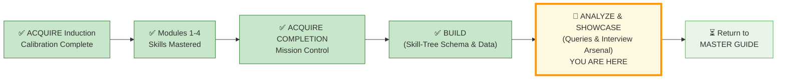
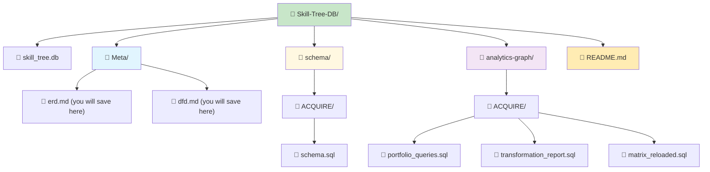
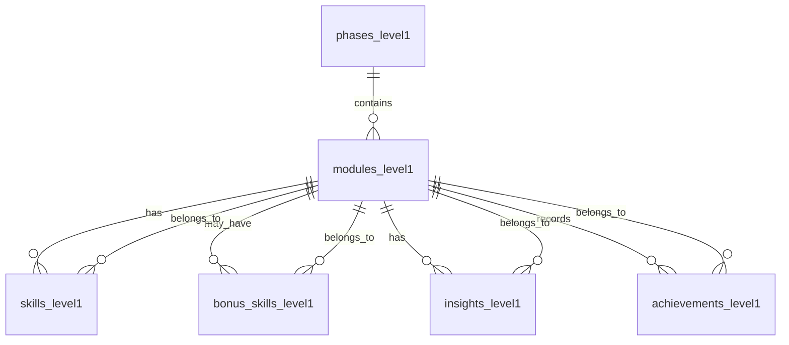
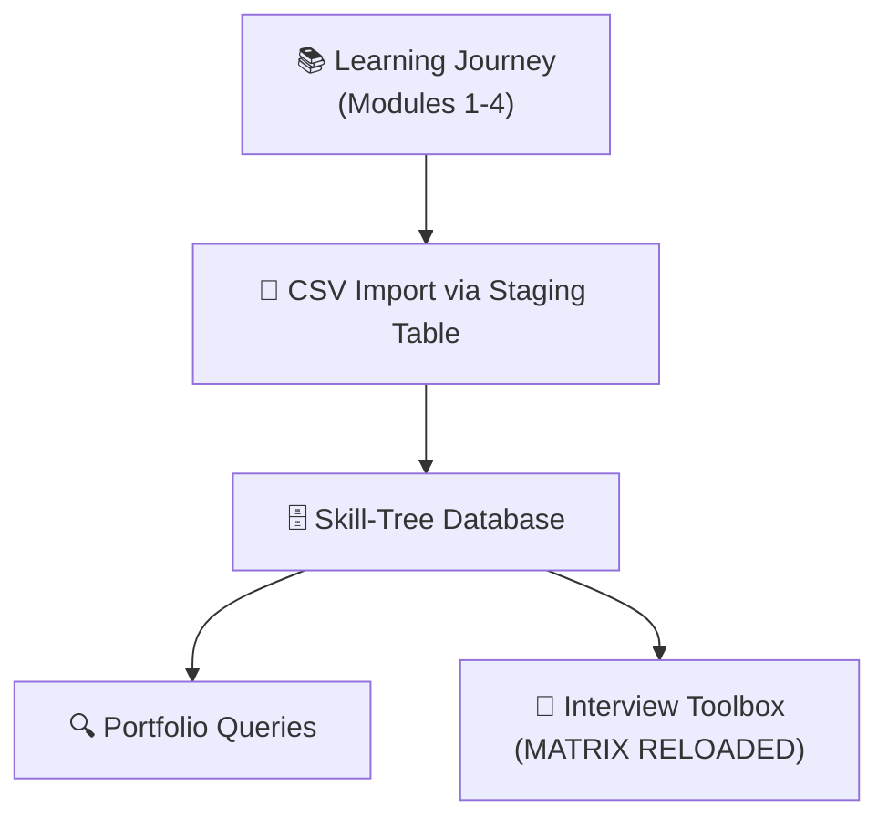
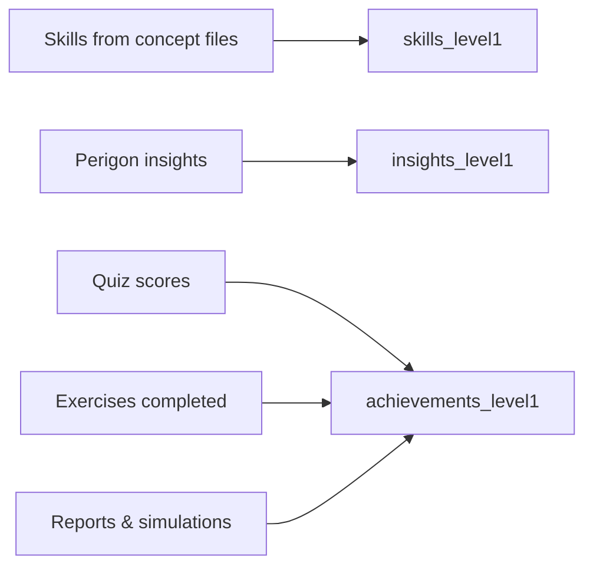
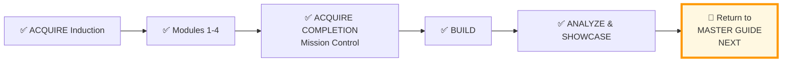

# 🗄️🤖 SQL & GenAI Course
**🎯 Quality Education for Anyone, Anywhere, Anytime — 💫 with Comfort, Convenience at no Cost**

---

## 🏆 ACQUIRE COMPLETION – ANALYZE & SHOWCASE

### Query. Portfolio. Interview Arsenal.

You have mined the gemstones. Now you will cut, polish, and set them into a **live portfolio** – one that proves your SQL mastery to any recruiter who asks.

In this file you will:

- **Query** your Skill‑Tree database to uncover insights.
- **Build** a professional `README.md` portfolio page.
- **Prepare** the MATRIX RELOADED interview weapon – three queries that turn your GitHub repo into a live, interactive demo.

> 📘 **Prerequisite:** You have completed the BUILD file. Your Skill‑Tree database (`Skill-Tree-DB/skill_tree.db`) is populated with data.

---

## 🌌 SQLVerse Check-In

<div style="border-left: 4px solid #9c27b0; background-color: #f3e5f5; padding: 15px; margin: 20px 0; border-radius: 0 8px 8px 0;">

Now that your Skill-Tree database is built and populated, you will transform **raw data** into a narrative of **technical mastery**. In this phase, you will write **analytic queries** to build a dynamic portfolio dashboard and construct your structural **Interview Arsenal**.

The data is inside the vault. Now, we make it speak.

Data without analysis is dormant footprint. **Data with queries** is an **undisputed portfolio**.

**The difference between a coder and an Artisan is discipline.**

</div>

---

### 📍 Your Current Stage



---

## 🏗️ PART 1 – Your Skill‑Tree Database in the Vault at a Glance

### 📁 Your Permanent Skill‑Tree Folder Structure



**Action:** Open `Skill-Tree-DB/skill_tree.db` in **Tab 2 (The Factory)**.

---

### 🗂️ Entity Relationship Diagram (ERD)



---

### 🔄 Data Flow Diagram (DFD)

**Context Level (High‑Level)**



**Detailed Flow – How Data Populates Tables**



---

### 💡 Save These Diagrams to Your Permanent Portfolio

Now that you have seen the folder structure and the diagrams, save them:

- Create the folder `Skill-Tree-DB/Meta/` (if not already present).
- Save the ERD mermaid code as `Skill-Tree-DB/Meta/erd.md`.
- Save the DFD mermaid code (context + detailed) as `Skill-Tree-DB/Meta/dfd.md`.

These diagrams will become part of your permanent portfolio documentation.


---

## 📊 PART 2 – Showcase Queries : Portfolio Intelligence

Write SQL queries to answer these questions. Use your knowledge of the schema.

1. Which module did I score the highest on the quiz?
2. List all skills I learned in Module 3, with cleaned‑up names.
3. Show me all bonus skills across all modules.
4. Count how many practice exercises I completed.
5. Display each Perigon insight from Module 4, along with my viewpoint.
6. List all learning objectives for Module 2, along with my personal viewpoint.
7. Show all exercises I completed in Module 4 with my reflections.
8. Total number of skills per module.
9. Total number of bonus skills per module.

**Save all 9 queries** in `Skill-Tree-DB/analytics-graph/ACQUIRE/portfolio_queries.sql`.

---

## 💎 PART 3 – ACQUIRE Gemstone Queries

These queries turn your raw data into insights. These queries prove to technical recruiters that you don't just write queries—you **analyze structural patterns.**

Save each one as a separate file in the same `analytics-graph/ACQUIRE/` folder.

### 📊 Portfolio Showcase Query – `transformation_report.sql`

This query compiles a high-level executive summary of your progress across all modules. It calculates exact skill counts, maps phase locations, and uses aggregation mechanics to showcase your momentum.

```sql
-- =====================================================================
-- SCRIPT 1: THE TRANSFORMATION REPORT
-- Focus: Aggregate progress tracking across the curriculum matrix
-- =====================================================================

SELECT 
    m.module_name,
    COUNT(s.skill_id) as skills_mastered,
    (
        SELECT AVG(CAST(score_or_status AS REAL))
        FROM achievements_level1
        WHERE module_id = m.module_id
          AND achievement_type = 'Quiz'
    ) as avg_quiz_score,
    COUNT(a.achievement_id) as achievements_logged
FROM modules_level1 m
LEFT JOIN skills_level1 s ON m.module_id = s.module_id
LEFT JOIN achievements_level1 a 
    ON m.module_id = a.module_id 
   AND a.achievement_type = 'Exercise'
GROUP BY m.module_id
ORDER BY skills_mastered DESC;
```

### 🔍 The Consistency Check – `consistency_check.sql`

```sql
-- =====================================================================
-- SCRIPT 2: THE CONSISTENCY CHECK
-- Focus: Proving that the Normalization worked
-- =====================================================================

SELECT m.module_name
FROM modules_level1 m
LEFT JOIN skills_level1 s ON m.module_id = s.module_id
WHERE s.skill_id IS NULL;
```

### 🛠️ The Toolbox Query (Interview Closer) – `toolbox_query.sql`

```sql
-- =====================================================================
-- SCRIPT 3: THE TOOLBOX QUERY
-- Focus: Showcasing the Artisan's Master Toolbox
-- =====================================================================

SELECT 
    p.phase_name AS "🎯 Phase",
    m.module_name AS "📚 Module",
    s.skill_name AS "⚡ Skill",
    s.filename AS "📄 Proof"
FROM phases_level1 p
JOIN modules_level1 m ON p.phase_id = m.phase_id
JOIN skills_level1 s ON m.module_id = s.module_id
ORDER BY p.phase_id, m.module_id, s.skill_id;
```

### 📝 Your Legacy Query – `legacy_query.sql`

```sql
-- =====================================================================
-- SCRIPT 4: THE LEGACY QUERY
-- Focus: Curated and accumulated Wisdom
-- =====================================================================

SELECT insight_text 
FROM insights_level1 
WHERE student_viewpoint LIKE '%click%'
ORDER BY RANDOM() 
LIMIT 1;
```

### 🎯 Module Difficulty Ranking – `difficulty_ranking.sql`

```sql
-- =====================================================================
-- SCRIPT 5: THE DIFFICULTY RANKING QUERY
-- Focus: Skill Audit
-- =====================================================================

SELECT 
    m.module_name,
    COUNT(s.skill_id) AS total_skills
FROM modules_level1 m
LEFT JOIN skills_level1 s ON m.module_id = s.module_id
GROUP BY m.module_id
ORDER BY total_skills DESC;
```

---

## 📄 PART 4 – README.md Template for Your Portfolio

Create `Skill-Tree-DB/README.md` using this template:

```markdown
# 🏆 My Level 1 SQL Mastery Portfolio

## 📊 Transformation Dashboard
```
[PASTE YOUR TRANSFORMATION REPORT QUERY RESULT HERE]
```

## 🔍 Quick Query – See My Data Instantly

Copy this query, open **[SQLite Online](https://sqliteonline.com)**, paste it, and explore my learning journey:

```sql
-- My top 5 skills and their modules
SELECT m.module_name, s.skill_name
FROM modules_level1 m
JOIN skills_level1 s ON m.module_id = s.module_id
ORDER BY m.module_id LIMIT 5;
```

*(Replace the query with one that best showcases your skills.)*

## 📝 Reflections
[Write a short paragraph about your journey through Modules 1–4]

**ACQUIRE → ARCHITECT: Complete Level 1 journey captured.**


*(Screenshots are optional – you can add them later if you wish.)*

---

## 🧨 PART 5 – Your Interview Weapon (15 mins)

## 🟢 MATRIX RELOADED: Your Interview Arsenal

<div style="border: 2px solid #2196f3; border-radius: 10px; padding: 15px; margin: 20px 0; background: #e3f2fd;">

**Welcome to the Dojo, Artisan.**

The queries below are not for learning. They are for **proving**. You have built a database of your own transformation. Now, you will learn to wield it as a weapon in the interview room.

**Three queries. One mission.** Leave no doubt that you are a Data Artisan.

</div>

### 🎯 Why This Matters

| Query | When to Use | Impact |
|-------|-------------|--------|
| **The Integrity Check** | "How did you design this?" | Shows schema mastery |
| **The Growth Trajectory** | "Tell me about your learning journey" | Shows self‑awareness & progress |
| **The Master Toolbox** | "What SQL skills do you have?" | **The knockout punch** |

Save all three in `Skill-Tree-DB/analytics-graph/ACQUIRE/matrix_reloaded.sql`.

---

### 🔵 Query 1: The Integrity Check

A stellar data engineer monitors system health. **This diagnostic script** scans for orphan milestones, mismatched structural entries, and logs potential data-entry gaps before a system audit flags them.

```sql
-- =====================================================================
-- RELATIONAL INTEGRITY CHECK
-- Focus: Finding unmatched modules, orphan metrics, or data-entry gaps
-- =====================================================================

-- Part A: Phases exist?
SELECT '✅ PHASES LOADED' AS status, COUNT(*) AS count FROM phases_level1;

-- Part B: Modules linked correctly?
SELECT 
    CASE 
        WHEN COUNT(*) = (SELECT COUNT(*) FROM modules_level1) 
        THEN '✅ ALL MODULES LINKED' 
        ELSE '⚠️ ORPHAN MODULES FOUND' 
    END AS relationship_status
FROM modules_level1 m
JOIN phases_level1 p ON m.phase_id = p.phase_id;

-- Part C: No orphaned skills (foreign key integrity)
SELECT 
    CASE 
        WHEN COUNT(*) = 0 
        THEN '✅ NO ORPHANED SKILLS' 
        ELSE '⚠️ ORPHAN SKILLS DETECTED' 
    END AS fk_integrity
FROM skills_level1 s
LEFT JOIN modules_level1 m ON s.module_id = m.module_id
WHERE m.module_id IS NULL;
```

**What this proves:** You understand foreign keys, referential integrity, and defensive query design.

---

### 🟡 Query 2: The Growth Trajectory

A reflective data artisan tracks their own evolution. This query reveals your skill accumulation, phase completion, and performance trends – proving **continuous growth**, not just checklist completion.

```sql
-- =====================================================================
-- GROWTH TRAJECTORY
-- Focus: Aggregating and showcasing accumulated skills across the module journey
-- =====================================================================

SELECT 
    p.phase_name,
    COUNT(DISTINCT m.module_id) AS modules_completed,
    COUNT(DISTINCT s.skill_id) AS skills_mastered,
    COUNT(DISTINCT b.bonus_skill_id) AS bonus_skills_earned,
    COUNT(DISTINCT a.achievement_id) AS achievements_logged,
    ROUND(AVG(CASE WHEN a.achievement_type = 'Quiz' THEN CAST(a.score_or_status AS REAL) END), 1) AS avg_quiz_score
FROM phases_level1 p
LEFT JOIN modules_level1 m ON p.phase_id = m.phase_id
LEFT JOIN skills_level1 s ON m.module_id = s.module_id
LEFT JOIN bonus_skills_level1 b ON m.module_id = b.module_id
LEFT JOIN achievements_level1 a ON m.module_id = a.module_id
GROUP BY p.phase_id
ORDER BY p.phase_id;
```

**What this proves:** You didn't just "do the work" – you **tracked your growth**.

---

### 🔴 Query 3: The Interview Closer (Master Toolbox)

This is your knockout punch. A flattened, undeniable inventory of every skill, module, and phase – with file‑level proof. No more ‘what can you do?’ Just results.

```sql
-- =====================================================================
-- INTERVIEW CLOSER
-- Focus: The Artisan's Pride
-- =====================================================================

SELECT 
    p.phase_name AS "🎯 Phase",
    m.module_name AS "📚 Module",
    s.skill_name AS "⚡ Skill",
    s.filename AS "📄 Proof"
FROM phases_level1 p
JOIN modules_level1 m ON p.phase_id = m.phase_id
JOIN skills_level1 s ON m.module_id = s.module_id
ORDER BY p.phase_id, m.module_id, s.skill_id;
```

**What this proves:** Everything. Every skill. Every module. Every phase. Documented. Verifiable. **Yours.**

---

## 🎤 PART 6 – Interview Preparation: The Elevator Pitch

### 🎯 The Interview Script

| Step | Action | Words (if any) |
|------|--------|----------------|
| **1** | Open your laptop | *"May I share my screen?"* |
| **2** | Navigate to Tab 2 (The Factory) | *"I built a database to track my own learning journey."* |
| **3** | Run Query 1 (Integrity Check) | *"The schema is normalized. No orphans. Clean foreign keys."* |
| **4** | Run Query 2 (Growth Trajectory) | *"Here's my progress across all 4 phases."* |
| **5** | Run Query 3 (Master Toolbox) | *"And this... is everything I can do. Ask me about any row."* |

**Then stop talking.** Let them scroll. Let them ask. You've already won.

### 📋 Interview Day Checklist

Copy this into your phone or print it:

```markdown
## 🎯 INTERVIEW DAY – SQL PORTFOLIO

**Before the interview:**
- [ ] Database loaded in Tab 2 (The Factory) – `Skill-Tree-DB/skill_tree.db`
- [ ] All 3 MATRIX RELOADED queries saved and tested
- [ ] Screen sharing tested

**During the interview (if asked about SQL):**
- [ ] Query 1: Integrity Check – "Prove the design"
- [ ] Query 2: Growth Trajectory – "Show the journey"  
- [ ] Query 3: Master Toolbox – "Close the deal"

**The Golden Rule:** Run the query. Show the results. Let them ask the next question.
```

### 🎯 The "Elevator Pitch" Architecture

When a hiring manager asks: "Tell me about a time you handled complex relational data structures," you will not speak in abstract concepts. You will walk them through the physical architecture of your own tracking core.

"Instead of tracking my learning progress on a static, unnormalized checklist, I designed a 3rd Normal Form relational schema to track my progression as an engineer. I mapped out the core learning modules, decoupled many-to-many achievements, isolated transitive dependencies like bonus tools, and set up an automated staging-table design pattern using SQLite to parse my structural data securely without anomalies."

---

### 💡 The Designer’s Secret

**Most candidates** talk about their skills.  
**You** will *run a query* that proves them.

**Most candidates** list "JOINs" on a resume.  
**You** will show 6 different join types with file paths as proof.

**Most candidates** hope the interviewer believes them.  
**You** will hand them the keyboard and say, *"Verify anything."*

**Most candidates** show the interviewer a static PDF.  
**You** are querying a *"live system"* that proves you can manage the metadata of your career.

| Impact Dimension | Rating |
|------------------|--------|
| **INTERVIEW IMPACT** | 💥 **NUCLEAR** |
| **FUTURE-PROOF** | 💎 **DIAMOND** |

**That is the difference between a coder and an Artisan.**

---

## 🌟 PART 7 – Why Your Skill‑Tree DB Structure Works

| Principle | How It Applies |
|-----------|----------------|
| **Separation of concerns** | `schema/` holds definitions; `analytics-graph/` holds queries; `Meta/` holds diagrams. |
| **Scalability** | Add `ACCELERATE/`, `ANALYZE/`, `ARCHITECT/` subfolders as you grow. |
| **Version control** | `Skill-Tree-DB/` is tracked; temporary files go elsewhere. |
| **Interview‑ready** | Your entire skills inventory is one query away. |

---

## ✅ Final Checklist

- [ ] I opened `Skill-Tree-DB/skill_tree.db` in Tab 2.
- [ ] I wrote the 9 required queries and saved them in `analytics-graph/ACQUIRE/portfolio_queries.sql`.
- [ ] I saved the Gemstone Queries (transformation report, consistency check, toolbox, legacy, difficulty) in the same folder.
- [ ] I saved the 3 MATRIX RELOADED queries in `matrix_reloaded.sql`.
- [ ] I created `Skill-Tree-DB/README.md` using the template.
- [ ] I practiced the Interview Script and Elevator Pitch.
- [ ] I am proud of what I built.

---
## 💎 DESIGNER'S PERIGON

<div style="border: 3px solid #9c27b0; border-radius: 10px; padding: 20px; margin: 25px 0; background: linear-gradient(135deg, #f3e5f5 0%, #e1bee7 100%);">

### *The Art of Reflection*

You have done something remarkable. You didn't just learn SQL – you built a database of your own **learning journey**. Every table, every row, every foreign key represents a **gemstone** you mined from the **SQLVerse**. You have built a digital legacy – a **Persistent Professional Ledger**.

> *“The best database you will ever design is the one that captures your own growth.”*

---

### 🌸 The Final Bouquet

In the Artisan's Garden, this is the **final bouquet of the ACQUIRE phase** – a collection of flowers you grew, trimmed, and arranged yourself. The database you have built is a **"Skill‑Tree"** database that grows with you through the ACCELERATE, ANALYZE and ARCHITECT phases where you will be cultivating more and more **exotic floral beds** and harvesting precious **gemstones**.

**Transforms beginners → Architects with proof.**

| Day | Milestone |
|-----|-----------|
| **Day 1** | "Normalize my own data? Cool!" |
| **Day 3** | "My transformation report = wow!" |
| **Week 1** | "Portfolio screenshot → LinkedIn" |
| **Month 1** | "Interview: 'Show me your SQL portfolio'" |

**The SQLVerse expands. Your portfolio is proof.**

---

### 📅 **Suggested Pacing Guide – Grow Your Skill‑Tree**  

| Week | Daily Target | Weekly Total | Milestone |
|------|--------------|--------------|-----------|
| **Week 1** | 10–15 rows/day | 60–90 rows | Foundation laid (phases, modules, basic skills) |
| **Week 2** | 10–15 rows/day | 60–90 rows | Core skills + first insights |
| **Week 3** | 10–15 rows/day | 60–90 rows | Advanced concepts + bonus skills |
| **Week 4** | 10–15 rows/day | 60–90 rows | All ACQUIRE data captured – sapling → mature tree 🌳 |

> **Total after 4 weeks:** 240–360 rows – a fully documented learning journey.
> 
> *This is a suggested rhythm, not a deadline. Some weeks you’ll add more, some weeks less. The goal is steady growth, not perfection.*

*The ACQUIRE Completion task has kick‑started your database building process – but you cannot collect and add all your ACQUIRE data in one day. Don’t rush. Take your own time. If you simply read one concept file per day and add just five records, that is perfectly fine. This is a marathon, not a sprint.*

---

**What distinguishes SQLVerse from other courses?**  
Other courses will give you Interview Tips after Course Completion.  

In **SQLVerse – Uma Maheswari's Unique Universe**, the Artisans are interview‑ready and employable when they complete the course. The learning and interview preparation goes **parallely**.

*Wondering who is Uma Maheswari? The DESIGNER of SQLVerse – Yours truly.*

</div>

---

## 🧭 Next Steps



| Previous Step | Next Step |
|:---:|:---:|
| [← Back to BUILD File](./SECTION1_COMPLETION_BUILD.md) | [Return to MASTER GUIDE →](../SECTION1_COMPLETION.md) |

---

*Part of our mission for 🎯 Quality Education for Anyone, Anywhere, Anytime — 💫 with Comfort, Convenience at no Cost.*

**Level 1 | ACQUIRE Completion | ANALYZE & SHOWCASE Phase**
