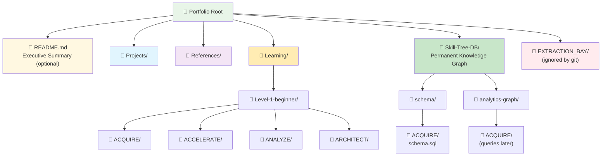
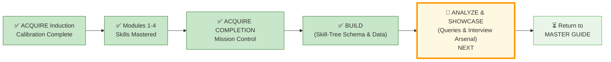

# 🗄️🤖 SQL & GenAI Course
**🎯 Quality Education for Anyone, Anywhere, Anytime — 💫 with Comfort, Convenience at no Cost**

---

## 🏆 ACQUIRE COMPLETION – BUILD: Skill‑Tree Schema & Data

In this **BUILD** file you will create your **Skill‑Tree** database schema, **normalize** your learning data, and **populate** the tables using a professional **ETL (Extract, Transform, Load)** workflow. This is the **foundation** of your permanent, queryable portfolio.

> 📘 **Prerequisite:** You have read the mission control file (`SECTION1_COMPLETION.md`). Now you will **build** your database.

---

## 🌌 SQLVerse Check-In

<div style="border-left: 4px solid #9c27b0; background-color: #f3e5f5; padding: 15px; margin: 20px 0; border-radius: 0 8px 8px 0;">

**You are in the BUILD phase – creating your Skill‑Tree database and filling it with your learning data.**  
No queries yet. No interview arsenal. Just pure construction.

**The difference between a coder and an Artisan is discipline.**

</div>

---

## 🏗️ PART 1 – Build Your Vault

### 🏢 The Workspace Blueprint: Permanent Portfolio Tree

Before writing any SQL, mirror this **permanent Skill‑Tree knowledge graph** at the **portfolio root**. This will ensure your professional knowledge graph scales flawlessly from your first query through advanced system design.



**Action – Create the following folder structure for your Skill tree database:**

```
Portfolio Root/
├── Skill-Tree-DB/                         # Permanent knowledge graph (tracked in version control)
│   ├── skill_tree.db                      # Live SQLite database (opened in Tab 2)
│   │
│   ├── schema/                            # Phase‑by‑phase table definitions
│   │   ├── ACQUIRE/
│   │   │   └── schema.sql                 # CREATE TABLE statements
│   │   ├── ACCELERATE/                    # (future)
│   │   ├── ANALYZE/                       # (future)
│   │   └── ARCHITECT/                     # (future)
│   │
│   └── analytics-graph/                   # Intelligence queries
│       ├── ACQUIRE/
│       │   ├── transformation_report.sql
│       │   ├── matrix_reloaded.sql
│       │   └── other_queries.sql
│       ├── ACCELERATE/                    # (future)
│       ├── ANALYZE/                       # (future)
│       └── ARCHITECT/                     # (future)
```

> **Note:** The `Learning/Level-1-beginner/` folders (`ACQUIRE/`, `ACCELERATE/`, etc.) already exist from the main course content. You do **not** need to recreate them. The mermaid above shows the entire ecosystem (including `EXTRACTION_BAY/`, which will be created in ACCELERATE). For now, only create the `Skill-Tree-DB/` folder and its subfolders.

**Action steps:**
1. Create `Skill-Tree-DB/` at your repository root.
2. Inside it, create `schema/ACQUIRE/` and `analytics-graph/ACQUIRE/`.


> *“The Extraction Bay is coming in ACCELERATE. For now, build your permanent knowledge graph.”*

---

## 🔍 PART 2 – Design the Schema

In this part, you will start from a messy flat spreadsheet that represents your learning journey. You will identify its structural flaws (redundancies, anomalies), then apply **normalization (1NF → 2NF → 3NF)** to design a clean, professional schema.

### Step 0: The Flat Spreadsheet (Understanding the Mess)

Below is a flat, unnormalized table that contains information about your learning journey across Modules 1–4. It has **redundancy, update anomalies, insertion anomalies, and deletion anomalies**. Your job is to normalize it.

Only 4 rows are shown as examples. You will need to add all rows for your own learning journey (one row per skill, per learning objective, per bonus skill, etc.).

| phase_id | module_id | phase_name | module_name | skill_filename | skill_name | bonus_skill_name | bonus_skill_filename | bonus_skill_source | perigon_insight_text | perigon_source | perigon_filename | objective_text | student_viewpoint | quiz_score | exercise_filename | exercise_completed |
|----------|-----------|------------|-------------|----------------|------------|------------------|----------------------|-------------------|----------------------|----------------|------------------|----------------|-------------------|------------|-------------------|--------------------|
| 1 | 1 | ACQUIRE | Module 1: Intro to Databases | 1-what-is-a-database.md | What is a database? | NULL | NULL | NULL | “A spreadsheet is an aquarium; a database is an ocean.” | Module 1 File 1 | 1-what-is-a-database.md | Explain what a database is | “The ocean analogy clicked for me” | 85 | 1-database-thinking.md | 1 |
| 1 | 1 | ACQUIRE | Module 1: Intro to Databases | 2-database-components.md | Database components | NULL | NULL | NULL | NULL | NULL | NULL | List three database components | “Tables, rows, columns, schema” | 85 | 2-real-world.md | 1 |
| 1 | 4 | ACQUIRE | Module 4: Joining Tables | 6-JoinConditions.md | ON vs WHERE Logic | CREATE TABLE | 0-refactoring-lab.md | Refactoring Lab | “A join is a bridge; a chain of joins is a story.” | Module 4 File 6 | 6-JoinConditions.md | Write an INNER JOIN | “The bridge metaphor helped” | 92 | 1-inner-join.md | 1 |
| 1 | 4 | ACQUIRE | Module 4: Joining Tables | 6-JoinConditions.md | ON vs WHERE Joins | DELETE | 2-Foreign-Keys-Referential-Integrity.md | SQLVerse Architect’s Blueprint | “Precision in the ON clause is precision in thought.” | Module 4 File 6 | 6-JoinConditions.md | Write a LEFT JOIN | “ON vs WHERE is critical” | 92 | 2-left-join.md | 1 |

> 💡 **Note the subtle trap:** The same `skill_name` appears twice (“ON vs WHERE Logic” and “ON vs WHERE Joins”) with different bonus skills. This creates a **transitive dependency** – the bonus skill doesn’t actually depend on the `skill_name`, but on the `module`. You’ll resolve this in 3NF.

> 💡 You will need to expand this spreadsheet with all your own data – skills, learning objectives, bonus skills, Perigon insights, quiz scores, and exercises from all four modules.

### Step 1: Identify Anomalies (The Structural Audit)

Before you touch the `CREATE` command, you must diagnose the “rot” in the flat spreadsheet. Look at the sample data and identify the following structural failures.

> ✏️ **Optional Reflection:** The blank lines below are for you to write your answers if you wish. These are for your own understanding – no need to save or commit them. The value is in the thinking, not the artifact.

- **Redundancy (The Echo Effect)**  
  *Observation:* Look at the `module_name` and `quiz_score` columns.  
  *The Problem:* If you have 15 skills in Module 4, you are typing “Module 4: Joining Tables” 15 times.  
  *Your Task:* Explain why repeating the `module_name` for every single skill is a waste of space and a risk to data integrity.  
  Write your reasoning: ________________________________________________

- **Update Anomaly (The Ripple Effect)**  
  *Scenario:* Imagine you decide to rename “Module 1: Intro to Databases” to “Module 1: Database Foundations.”  
  *The Problem:* How many rows would you have to change in the flat table? What happens if you miss one?  
  *Your Task:* Describe the “Data Ghost” created when one row says “Foundations” and the other 10 still say “Intro.”  
  Write your reasoning: ________________________________________________

- **Insertion Anomaly (The “Wait‑for‑it” Problem)**  
  *Scenario:* You want to add “Module 5: Advanced Aggregations” to your plan, but you haven’t learned any specific skills for it yet.  
  *The Problem:* Can you add the module to this table if the `skill_name` cannot be NULL?  
  *Your Task:* Explain why you shouldn’t need a “skill” just to acknowledge that a “module” exists.  
  Write your reasoning: ________________________________________________

- **Deletion Anomaly (The Burned Bridge)**  
  *Scenario:* You decide to remove the “INNER JOIN” skill from your record.  
  *The Problem:* Look at that row. If you delete it, what happens to your record of the `quiz_score` for Module 4 or the `perigon_insight_text` associated with that row?  
  *Your Task:* Explain how deleting a single *skill* could accidentally wipe out your entire *module progress record*.  
  Write your reasoning: ________________________________________________

### Step 2: Normalize to 1NF

Identify any repeating groups or non‑atomic values. Show the split.

**Your 1NF result:** [Describe or show tables]

### Step 3: Normalize to 2NF

Identify partial dependencies (if any composite key exists). Show the split into separate tables.

**Your 2NF result:** [Describe or show tables]

### Step 4: Normalize to 3NF

Identify transitive dependencies. Show the final normalized schema.

**Your 3NF result:** [Describe or show tables]

---

## 🧭 PART 3 – Choose the Schema for Level 1

You have two valid ways to build your learning database. Read the trade‑offs, then pick **one** approach.

| Aspect | 🟢 Approach 1 (3NF – Basic) | 🔵 Approach 2 (Granular) |
|--------|-------------------------------|---------------------------|
| **Tables** | 6 tables: `phases_level1`, `modules_level1`, `skills_level1`, `bonus_skills_level1`, `insights_level1`, `achievements_level1` | 9 tables: Core tables + `quiz_scores_level1`, `exercise_completion_level1`, `report_deliverables_level1`, `simulation_results_level1` |
| **Achievements storage** | Single table with `achievement_type` column | Separate table per achievement type |
| **Query simplicity** | Easy to query across all achievement types | More tables, but each is single‑purpose |
| **Extensibility** | Adding a new achievement type requires no schema change | Adding a new type requires a new table – but allows type‑specific columns |
| **Best for** | Minimal complexity, quick setup | Long‑term tracking, production‑grade portfolio |

**Designer strongly recommends: Pick 🟢 Approach 1 (3NF Basic) for Level 1 completion.**

- **Faster to implement** – you can finish the ACQUIRE Completion task without getting bogged down.
- **Easier to debug** – fewer tables mean simpler queries and fewer places for errors to hide.
- **Enough to demonstrate SQL mastery in interviews** – the “Toolbox Query” and “Integrity Check” work perfectly with Approach 1.

> 🔵 **Approach 2 is for Level 2 and Level 3.** In Level 2 you will learn advanced `INSERT` commands that will help you transfer your data from Approach 1 tables to Approach 2 tables if you decide to upgrade later. You are not locked into your choice forever.

---

## 🛠️ PART 4 – Create Schemas with Seed Data

Create `Skill-Tree-DB/schema/ACQUIRE/schema.sql` and save the following (Approach 1):

```sql
-- ========================================
-- ACQUIRE COMPLETION: PHASE-ENABLED SCHEMA
-- Level 1 Full Journey: ACQUIRE → ARCHITECT
-- ========================================

-- 1. The Journey Map
CREATE TABLE phases_level1 (
    phase_id INTEGER PRIMARY KEY,
    phase_name TEXT NOT NULL UNIQUE,
    phase_description TEXT,
    start_module INTEGER
);

-- 2. The Curriculum
CREATE TABLE modules_level1 (
    module_id INTEGER PRIMARY KEY,
    module_name TEXT NOT NULL,
    phase_id INTEGER,
    folder_pattern TEXT,
    FOREIGN KEY (phase_id) REFERENCES phases_level1(phase_id)
);

-- 3. The Artisan's Skills
CREATE TABLE skills_level1 (
    skill_id INTEGER PRIMARY KEY,
    module_id INTEGER,
    filename TEXT NOT NULL,
    skill_name TEXT NOT NULL,
    objective_text TEXT,
    student_viewpoint TEXT,
    UNIQUE(module_id, skill_name),
    FOREIGN KEY (module_id) REFERENCES modules_level1(module_id)
);

-- 4. Bonus Skills
CREATE TABLE bonus_skills_level1 (
    bonus_skill_id INTEGER PRIMARY KEY,
    module_id INTEGER,
    bonus_skill_name TEXT NOT NULL,
    source_filename TEXT,
    FOREIGN KEY (module_id) REFERENCES modules_level1(module_id)
);

-- 5. Perigon Insights
CREATE TABLE insights_level1 (
    insight_id INTEGER PRIMARY KEY,
    insight_text TEXT NOT NULL,
    source_filename TEXT,
    module_id INTEGER,
    student_viewpoint TEXT,
    FOREIGN KEY (module_id) REFERENCES modules_level1(module_id)
);

-- 6. Achievements
CREATE TABLE achievements_level1 (
    achievement_id INTEGER PRIMARY KEY,
    achievement_type TEXT CHECK(achievement_type IN ('Quiz', 'Exercise', 'Report', 'Simulation')),
    module_id INTEGER,
    source_filename TEXT,
    score_or_status TEXT,
    student_viewpoint TEXT,
    FOREIGN KEY (module_id) REFERENCES modules_level1(module_id)
);
```

**Seed Data (Phases & Modules):**

```sql
INSERT INTO phases_level1 (phase_id, phase_name, phase_description, start_module) VALUES
(1, 'ACQUIRE', 'Knowledge acquisition: Modules 1-4', 1),
(2, 'ACCELERATE', 'AI partnership: Module 5', 5),
(3, 'ANALYZE', 'Project mastery: Module 6 + Bonus Projects', 6),
(4, 'ARCHITECT', 'Independent mastery: Student-led projects', 7);

INSERT INTO modules_level1 (module_id, module_name, phase_id, folder_pattern) VALUES
(1, 'Module 1: Introduction to Databases & AI Co-pilot', 1, '1-sqlCommands/'),
(2, 'Module 2: Basic Retrieval – SELECT & WHERE', 1, '1-sqlCommands/'),
(3, 'Module 3: Aggregate Functions & Sorting', 1, '1-sqlCommands/'),
(4, 'Module 4: Joining Tables Mastery', 1, '1-sqlCommands/');
```

**Execute** these statements in **Tab 2 (The Factory)** to create your database. Save the database as `Skill-Tree-DB/skill_tree.db`.

**Example Data for achievements (simulations, reports):**

```sql
INSERT INTO achievements_level1 (achievement_id, achievement_type, module_id, source_filename, score_or_status, student_viewpoint) VALUES
(100, 'Simulation', 4, 'cto_simulation_answers.md', 'Completed', 'Ravi’s mall taught me to handle missing phone numbers.'),
(101, 'Simulation', 4, 'ceo_simulation_answers.md', 'Completed', 'Annie’s event data showed how cross‑domain joins reveal margin leaks.'),
(102, 'Simulation', 4, 'cfo_simulation_answers.md', 'Completed', 'Simon’s expo forced me to think about profitability and SLA tracking.');
```

<details>
<summary>🔵 Approach 2: Granular Schema (for reference – not required now)</summary>

```sql
-- Core tables (identical to Approach 1)
CREATE TABLE phases_level1 (...);
CREATE TABLE modules_level1 (...);
CREATE TABLE skills_level1 (...);
CREATE TABLE bonus_skills_level1 (...);
CREATE TABLE insights_level1 (...);

-- Granular achievement tables
CREATE TABLE quiz_scores_level1 (...);
CREATE TABLE exercise_completion_level1 (...);
CREATE TABLE report_deliverables_level1 (...);
CREATE TABLE simulation_results_level1 (...);
```
</details>

---

### 🎉 Celebrate Your Journey

Reflect on how far you’ve come. You’ve mastered `SELECT`, `WHERE`, `JOIN`, aggregation, and even self‑joins. You’ve normalized flat tables and built executive reports.

**You have already created two tables for your Skill‑Tree database and planted the seed data.** This database will prove your transformation.

Remember: this is a **living record** that will grow with you through all of Level 1.  
Take 30 seconds. Look at your database. You built that.

> *“One gemstone at a time.”*

---

## 🚀 Level 1 Full Journey Support

The Skill-Tree database schema you have created supports **ALL 4 phases** of Level 1:

| Phase | Modules | Focus |
|-------|---------|-------|
| 🟢 **ACQUIRE** | Modules 1-4 | Knowledge acquisition (Joins, SELECT, Normalization) |
| 🟡 **ACCELERATE** | Module 5 | AI partnership (GenAI SQL Co-pilot) |
| 🟠 **ANALYZE** | Module 6 + Bonus Projects | Project mastery & analysis |
| 🔴 **ARCHITECT** | Student-led projects | Independent mastery |

**Interview Query:** `SELECT phase_name, skill_name FROM skills_level1 ORDER BY phase_id;`

---

## 📥 PART 5 – Populate Your Skill‑Tree Data (ETL Workflow for ACQUIRE)

**ETL (Extract, Transform, Load)** is a standard data pipeline pattern used in professional data engineering. You will now apply it to fill your Skill‑Tree database with real learning data from your ACQUIRE module files.

### 🔹 EXTRACT – Mining the Gemstones

Your Skill‑Tree database already has **8 rows** from the seed data (phases and modules). To lay a solid foundation, you only need to add **15 more rows**:

- **10 rows** to `skills_level1` (one skill per concept you mastered)
- **5 rows** to `insights_level1` (your favorite Perigon takeaways)

That’s it. Once you’ve added these, **celebrate** – you’ve laid the foundation for your permanent learning record. You can always add more rows later as you continue through ACCELERATE, ANALYZE, and ARCHITECT.

#### 📋 Where to Find Information (Extraction Templates)

**Module 4 Skills (copy‑paste template):**

| Skill Name | Filename |
|------------|----------|
| Intro to Joins | 1-IntroToJoins.md |
| INNER JOIN | 2-InnerJoin.md |
| LEFT JOIN | 3-LeftJoin.md |
| Joining Multiple Tables | 4-JoiningMultipleTables.md |
| Self Join | 5-SelfJoin.md |
| Join Conditions | 6-JoinConditions.md |

**Bonus Skills (look in these files):**
- `0-refactoring-lab.md` → CREATE TABLE, ALTER TABLE, DROP TABLE
- `5-SelfJoin.md` (Dynamic Data Check) → INSERT OR IGNORE
- `SQLVerse-Architects-Blueprint/2-Foreign-Keys-Referential-Integrity.md` → DELETE

**Perigon Insights:** Search for `💎 DESIGNER'S PERIGON` across every Level 1 file.

> 💡 **Refer to the Module‑by‑Module Reference in the original ACQUIRE Completion document for exact file locations.**

### 🔹 TRANSFORM – Table → Spreadsheet → CSV

1. **Create a spreadsheet** (Google Sheets or Excel) with columns matching the staging table (e.g., `skill_id`, `module_id`, `filename`, `skill_name`, `objective_text`, `student_viewpoint`).
2. **Copy** the extracted data from the templates (or from your own notes) into the spreadsheet.
3. **Export as CSV** (File → Download → CSV) and _and save the file locally (e.g., in your Downloads folder). You will import it using the staging table pattern.”_


### 🔹 LOAD – Staging Table Pattern (Safe CSV Import)

Use the following **staging table pattern** for each CSV file. Always drop any leftover staging table first to avoid conflicts.

```sql
-- 0. Clean up any leftover staging table from previous session
DROP TABLE IF EXISTS temp_skills_level1;

-- 1. Create staging table (explicit columns, no constraints)
CREATE TABLE temp_skills_level1 (
    skill_id INTEGER,
    module_id INTEGER,
    filename TEXT,
    skill_name TEXT,
    objective_text TEXT,
    student_viewpoint TEXT
);

-- 2. Import CSV using SQLite Online's import tool (Menu: Import → CSV)
--    Map the CSV columns to the staging table columns.

-- 3. Validate row count (optional)
SELECT COUNT(*) FROM temp_skills_level1;

-- 4. Insert into main table (constraints enforced here)
INSERT INTO skills_level1 (skill_id, module_id, filename, skill_name, objective_text, student_viewpoint)
SELECT skill_id, module_id, filename, skill_name, objective_text, student_viewpoint
FROM temp_skills_level1;

-- 5. Clean up
DROP TABLE temp_skills_level1;
```

Repeat the same pattern for `insights_level1` (create a staging table with columns matching the target table). You can reuse the same SQL structure – just change table and column names.

> *“This staging pattern is what real data engineers use to load data safely into production databases.”*

---

## ✅ PART 6 – Verification

Run these queries in **Tab 2 (The Factory)** to confirm that all tables exist and contain data.

```sql
SELECT '✅ phases_level1' AS table_name, COUNT(*) AS rows FROM phases_level1
UNION ALL
SELECT '✅ modules_level1', COUNT(*) FROM modules_level1
UNION ALL
SELECT '✅ skills_level1', COUNT(*) FROM skills_level1
UNION ALL
SELECT '✅ bonus_skills_level1', COUNT(*) FROM bonus_skills_level1
UNION ALL
SELECT '✅ insights_level1', COUNT(*) FROM insights_level1
UNION ALL
SELECT '✅ achievements_level1', COUNT(*) FROM achievements_level1;
```
> 📊 **Validation Thresholds:**
> - `phases_level1`: Exactly **4** rows (from seed data)
> - `modules_level1`: Exactly **4** rows (from seed data)
> - `achievements_level1`: Exactly **3** rows (from seed data)
> - `skills_level1`: **≥ 10** rows (populated via your Part 5 ETL import)
> - `insights_level1`: **≥ 5** rows (populated via your Part 5 ETL import)
> - `bonus_skills_level1`: **≥ 0** rows (*Will show 0 initially until you extract custom bonus file items!*)

---

## 📊 Next Step Gateway

Your portfolio infrastructure is initialized, the relational engine is locked down, and the foundation metadata is securely seeded into your tracking folders.

**Next:** Proceed to the **ANALYZE & SHOWCASE** phase to query your Skill‑Tree and build your interview arsenal.

---
## 🧭 Next Steps




| Previous Step | Next Step |
|:---:|:---:|
| [← Back to Mission Control](../SECTION1_COMPLETION.md) | ➡️ [Go to ANALYZE & SHOWCASE](./SECTION1_COMPLETION_ANALYZE.md) |

---

*Part of our mission for 🎯 Quality Education for Anyone, Anywhere, Anytime — 💫 with Comfort, Convenience at no Cost.*

**Level 1 | ACQUIRE Completion | BUILD Phase**
