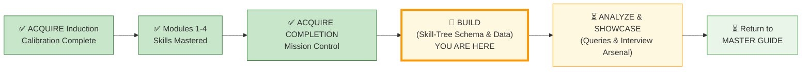
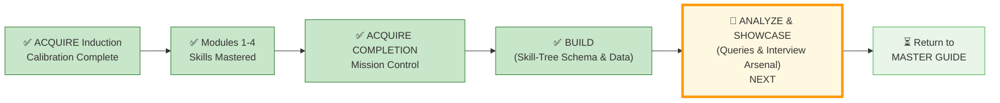

# 🗄️🤖 SQL & GenAI Course
**🎯 Quality Education for Anyone, Anywhere, Anytime — 💫 with Comfort, Convenience at no Cost**

---

## 🏆 ACQUIRE COMPLETION – BUILD: Skill‑Tree Schema & Data

In this **BUILD** file you will create your **Skill‑Tree** database schema, **normalize** your learning data, and **populate** the tables using a professional **CSV import** workflow. This is the **foundation** of your permanent, queryable portfolio.

> 📘 **Prerequisite:** You have read the mission control file (`SECTION1_COMPLETION.md`). Now you will **build** your database.

---

## 🌌 SQLVerse Check-In

<div style="border-left: 4px solid #9c27b0; background-color: #f3e5f5; padding: 15px; margin: 20px 0; border-radius: 0 8px 8px 0;">

**You are in the BUILD phase – creating your Skill‑Tree database and filling it with your learning data.**  
No queries yet. No interview arsenal. Just pure construction.

**The difference between a coder and an Artisan is discipline.**

</div>

---

## 📂 Where to Save Your Work

Create the following folder in your **Vault (Tab 4)** :

```
Projects/Level-1-beginner/ACQUIRE_COMPLETION/
```

Inside, you will save all files from this task.

```
ACQUIRE_COMPLETION/
├── README.md                          # Your completion report (use template below)
├── design/
│   ├── normalization-steps.md         # Your written reasoning
│   └── schema.sql                     # CREATE TABLE statements
├── collect/
│   ├── data-collection.md             # Notes on where you found each piece of data
│   ├── data/                          # 📁 Store your CSV files here (if using CSV import)
│   │   ├── phases_level1.csv
│   │   ├── modules_level1.csv
│   │   ├── skills_level1.csv
│   │   └── ... (other tables)
│   └── insert-data.sql                # ⚠️ Optional – only if you wrote INSERT statements manually
└── display/
    └── queries.sql                    # SELECT queries (insights)
```

> **Note:** Depending on the method you chose (manual INSERT vs CSV import), you will have either `insert-data.sql` or a populated `data/` folder (or both). Both are perfectly acceptable – the goal is to have your data in the database, not the format of the source files.

---

## 🧭 Your ACQUIRE Completion Journey

### 📍 Your Current Stage



---

## 🚀 Quickstart – Create 2 Skill‑Tree Tables in 2 Minutes 

### Just follow the instructions below (No Thinking Required)

1. **Pick 🟢 Approach 1 (3NF Basic)** – it’s the recommended path for Level 1.
2. **Copy the `CREATE TABLE` statements** for `phases_level1` and `modules_level1` only (ignore the rest for now).
3. **Run them in Tab 2 (The Factory)**.
4. **Copy the `INSERT` statements for the seed data** (phases and modules) and run them in Tab 2.
5. **Run `SELECT * FROM phases_level1;` and `SELECT * FROM modules_level1;`** – see your first portfolio data appear.

**That’s it. You’ve started.**  
Now you can come back later to add more tables, more rows, and explore the advanced sections at your own pace.

> *“The Artisan doesn’t build everything at once. The Artisan builds one gemstone at a time.”*

---

## 🎉 PART 0 – Celebrate Your Journey (5 mins)

Reflect on how far you’ve come. You’ve mastered `SELECT`, `WHERE`, `JOIN`, aggregation, and even self‑joins. You’ve normalized flat tables and built executive reports. You have already created two tables for your Skill‑Tree database and planted the seed data. This database will **prove** your transformation.

The rest of this document is your blueprint. **You don’t have to finish it in one sitting.** Work through it one part at a time – and remember, this is a living record that will grow with you through all of Level 1.

---

## 🧱 PART 1 – Build Your Core Schema (30–60 mins)

In this part, you will start from a messy flat spreadsheet that represents your learning journey. You will identify its structural flaws (redundancies, anomalies), then apply **normalization** (1NF → 2NF → 3NF) to **design** a clean, **professional schema.** Finally, you will choose between two valid schema paths and write the **`CREATE TABLE`** statements for your **Skill‑Tree** database.


### Step 0: The Flat Spreadsheet (Understanding the Mess)

Below is a flat, unnormalized table that contains information about your learning journey across Modules 1–4. It has **redundancy, update anomalies, insertion anomalies, and deletion anomalies**. Your job is to normalize it.

Only 4 rows are shown as examples. You will need to add all rows for your own learning journey (one row per skill, per learning objective, per bonus skill, etc.).

| phase_id | module_id | phase_name | module_name | skill_filename | skill_name | bonus_skill_name | bonus_skill_filename | bonus_skill_source | perigon_insight_text | perigon_source | perigon_filename | objective_text | student_viewpoint | quiz_score | exercise_filename | exercise_completed |
|----------|-----------|------------|-------------|----------------|------------|------------------|----------------------|-------------------|----------------------|----------------|------------------|----------------|-------------------|------------|-------------------|--------------------|
| 1 | 1 | ACQUIRE | Module 1: Intro to Databases | 1-what-is-a-database.md | What is a database? | NULL | NULL | NULL | "A spreadsheet is an aquarium; a database is an ocean." | Module 1 File 1 | 1-what-is-a-database.md | Explain what a database is | "The ocean analogy clicked for me" | 85 | 1-database-thinking.md | 1 |
| 1 | 1 | ACQUIRE | Module 1: Intro to Databases | 2-database-components.md | Database components | NULL | NULL | NULL | NULL | NULL | NULL | List three database components | "Tables, rows, columns, schema" | 85 | 2-real-world.md | 1 |
| 1 | 4 | ACQUIRE | Module 4: Joining Tables | 6-JoinConditions.md | ON vs WHERE Logic | CREATE TABLE | 0-refactoring-lab.md | Refactoring Lab | "A join is a bridge; a chain of joins is a story." | Module 4 File 6 | 6-JoinConditions.md | Write an INNER JOIN | "The bridge metaphor helped" | 92 | 1-inner-join.md | 1 |
| 1 | 4 | ACQUIRE | Module 4: Joining Tables | 6-JoinConditions.md | ON vs WHERE Joins | DELETE | 2-Foreign-Keys-Referential-Integrity.md | SQLVerse Architect's Blueprint | "Precision in the ON clause is precision in thought." | Module 4 File 6 | 6-JoinConditions.md | Write a LEFT JOIN | "ON vs WHERE is critical" | 92 | 2-left-join.md | 1 |

> 💡 **Note the subtle trap:** The same `skill_name` appears twice ("ON vs WHERE Logic" and "ON vs WHERE Joins") with different bonus skills. This creates a **transitive dependency** – the bonus skill doesn't actually depend on the `skill_name`, but on the `module`. You'll resolve this in 3NF.

> 💡 **You will need to expand this spreadsheet with all your own data** – skills, learning objectives, bonus skills, Perigon insights, quiz scores, and exercises from all four modules.

---

### Step 1: Identify Anomalies (The Structural Audit)

Before you touch the `CREATE` command, you must diagnose the "rot" in the flat spreadsheet. Look at the sample data and identify the following structural failures.

#### Redundancy (The Echo Effect)
- **Observation:** Look at the `module_name` and `quiz_score` columns.
- **The Problem:** If you have 15 skills in Module 4, you are typing "Module 4: Joining Tables" 15 times.
- **Your Task:** Explain why repeating the `module_name` for every single skill is a waste of space and a risk to data integrity.

*Write your reasoning:* `________________________________________________`

#### Update Anomaly (The Ripple Effect)
- **Scenario:** Imagine you decide to rename "Module 1: Intro to Databases" to "Module 1: Database Foundations."
- **The Problem:** How many rows would you have to change in the flat table? What happens if you miss one?
- **Your Task:** Describe the "Data Ghost" created when one row says "Foundations" and the other 10 still say "Intro."

*Write your reasoning:* `________________________________________________`

#### Insertion Anomaly (The "Wait-for-it" Problem)
- **Scenario:** You want to add "Module 5: Advanced Aggregations" to your plan, but you haven't learned any specific skills for it yet.
- **The Problem:** Can you add the module to this table if the `skill_name` cannot be NULL?
- **Your Task:** Explain why you shouldn't need a "skill" just to acknowledge that a "module" exists.

*Write your reasoning:* `________________________________________________`

#### Deletion Anomaly (The Burned Bridge)
- **Scenario:** You decide to remove the "INNER JOIN" skill from your record.
- **The Problem:** Look at that row. If you delete it, what happens to your record of the `quiz_score` for Module 4 or the `perigon_insight_text` associated with that row?
- **Your Task:** Explain how deleting a single *skill* could accidentally wipe out your entire *module progress record*.

*Write your reasoning:* `________________________________________________`

---

### Step 2: Normalize to 1NF

Identify any repeating groups or non‑atomic values. Show the split.

**Your 1NF result:** [Describe or show tables]

---

### Step 3: Normalize to 2NF

Identify partial dependencies (if any composite key exists). Show the split into separate tables.

**Your 2NF result:** [Describe or show tables]

---

### Step 4: Normalize to 3NF

Identify transitive dependencies. Show the final normalized schema.

**Your 3NF result:** [Describe or show tables]

---

## 🚀 Level 1 Full Journey Support

This schema supports **ALL 4 phases** of Level 1:

| Phase | Modules | Focus |
|-------|---------|-------|
| 🟢 **ACQUIRE** | Modules 1-4 | Knowledge acquisition (Joins, SELECT, Normalization) |
| 🟡 **ACCELERATE** | Module 5 | AI partnership (GenAI SQL Co-pilot) |
| 🟠 **ANALYZE** | Module 6 + Bonus Projects | Project mastery & analysis |
| 🔴 **ARCHITECT** | Student-led projects | Independent mastery |

**Interview Query:** `SELECT phase_name, skill_name FROM skills_level1 ORDER BY phase_id;`

---

## 🧭 Choose Your Schema Path

You have two valid ways to build your learning database. Read the trade‑offs, then pick **one** approach.

| Aspect | 🟢 Approach 1 (3NF – Basic) | 🔵 Approach 2 (Granular) |
|--------|-------------------------------|---------------------------|
| **Tables** | 6 tables: `phases_level1`, `modules_level1`, `skills_level1`, `bonus_skills_level1`, `insights_level1`, `achievements_level1` | 9 tables: Core tables (phases, modules, skills, bonuses, insights) + `quiz_scores_level1`, `exercise_completion_level1`, `report_deliverables_level1`, `simulation_results_level1` |
| **Achievements storage** | Single table with `achievement_type` column | Separate table per achievement type |
| **Query simplicity** | Easy to query across all achievement types | More tables, but each is single‑purpose |
| **Extensibility** | Adding a new achievement type requires no schema change (just new rows) | Adding a new type requires a new table – but allows type‑specific columns |
| **Best for** | Minimal complexity, quick setup | Long‑term tracking, production‑grade portfolio |

**Pick one.** Then follow the instructions for your chosen approach below.

---

## 🧱 Schema Choice — You Must Decide Early

Be careful here:

- 🟢 **Approach 1 (3NF Basic)** = clean, fast, interview‑friendly  
- 🔵 **Approach 2 (Granular)** = powerful, but time‑consuming

### Designer strongly recommends: **Pick 🟢 Approach 1 (3NF Basic)** for Level 1 completion.

#### Why (strategic reasoning):

- **Faster to implement** – you can finish the ACQUIRE Completion task without getting bogged down.
- **Easier to debug** – fewer tables mean simpler queries and fewer places for errors to hide.
- **Enough to demonstrate SQL mastery in interviews** – the “Toolbox Query” and “Integrity Check” work perfectly with Approach 1.

---

### 🔵 Choose Approach 2 (Granular) for Level 2 and Level 3

- **Level 2** → you will keep accumulating more simulations and projects. A granular schema will make it easier to add new types of achievements (e.g., advanced reports, real‑time dashboards).
- **Level 3** → you will work with a full‑fledged enterprise database (PostgreSQL or MS SQL Server). The granular design mirrors production schemas where each business entity has its own table.

> **In Level 2 you will learn advanced `INSERT` commands** that will help you transfer your data from Approach 1 tables to Approach 2 tables if you decide to upgrade later. You are not locked into your choice forever.

---

### 🎯 Designer’s Intent

- **Approach 1** builds **confidence**.  
- **Approach 2** builds **systems thinking**.

> *Sequence matters. Master the basics before scaling complexity.*

---

### 📝 Justify Your Schema Choice (Required)

After you implement your chosen schema, write a short justification (3–5 sentences) in your `README.md` or a separate `justification.md` file. Answer:

- Which approach did you choose and why?
- What trade‑offs did you consider (e.g., query simplicity vs future extensibility)?
- How does your choice align with your long‑term learning goals (e.g., extending this database through ACCELERATE, ANALYZE, ARCHITECT)?

**Save this justification in your Vault. It will be part of your portfolio.**

---

## 🟢 Approach 1: 3NF Schema (Recommended for Level1)

```sql
-- ========================================
-- ACQUIRE COMPLETION: PHASE-ENABLED SCHEMA
-- Level 1 Full Journey: ACQUIRE → ARCHITECT
-- ========================================

-- 1. The Journey Map
CREATE TABLE phases_level1 (
    phase_id INTEGER PRIMARY KEY,
    phase_name TEXT NOT NULL UNIQUE,
    phase_description TEXT,
    start_module INTEGER
);

-- 2. The Curriculum
CREATE TABLE modules_level1 (
    module_id INTEGER PRIMARY KEY,
    module_name TEXT NOT NULL,
    phase_id INTEGER,
    folder_pattern TEXT,
    FOREIGN KEY (phase_id) REFERENCES phases_level1(phase_id)
);

-- 3. The Artisan's Skills (combines skills + learning objectives)
CREATE TABLE skills_level1 (
    skill_id INTEGER PRIMARY KEY,
    module_id INTEGER,
    filename TEXT NOT NULL,
    skill_name TEXT NOT NULL,
    objective_text TEXT,
    student_viewpoint TEXT,
    UNIQUE(module_id, skill_name),
    FOREIGN KEY (module_id) REFERENCES modules_level1(module_id)
);

-- 4. Bonus Skills (The "Extra Mile")
CREATE TABLE bonus_skills_level1 (
    bonus_skill_id INTEGER PRIMARY KEY,
    module_id INTEGER,
    bonus_skill_name TEXT NOT NULL,
    source_filename TEXT,
    FOREIGN KEY (module_id) REFERENCES modules_level1(module_id)
);

-- 5. Valuable Understanding (Perigon Insights)
CREATE TABLE insights_level1 (
    insight_id INTEGER PRIMARY KEY,
    insight_text TEXT NOT NULL,
    source_filename TEXT,
    module_id INTEGER,
    student_viewpoint TEXT,
    FOREIGN KEY (module_id) REFERENCES modules_level1(module_id)
);

-- 6. The Performance Record (quizzes + exercises + reports + simulations)
CREATE TABLE achievements_level1 (
    achievement_id INTEGER PRIMARY KEY,
    achievement_type TEXT CHECK(achievement_type IN ('Quiz', 'Exercise', 'Report', 'Simulation')),
    module_id INTEGER,
    source_filename TEXT,
    score_or_status TEXT,
    student_viewpoint TEXT,
    FOREIGN KEY (module_id) REFERENCES modules_level1(module_id)
);

> 💡 This ensures that only valid achievement types are inserted – especially important when using CSV import.

```

**Seed Data (Phases & Modules):**

```sql
INSERT INTO phases_level1 (phase_id, phase_name, phase_description, start_module) VALUES
(1, 'ACQUIRE', 'Knowledge acquisition: Modules 1-4', 1),
(2, 'ACCELERATE', 'AI partnership: Module 5', 5),
(3, 'ANALYZE', 'Project mastery: Module 6 + Bonus Projects', 6),
(4, 'ARCHITECT', 'Independent mastery: Student-led projects', 7);

INSERT INTO modules_level1 (module_id, module_name, phase_id, folder_pattern) VALUES
(1, 'Module 1: Introduction to Databases & AI Co-pilot', 1, '1-sqlCommands/'),
(2, 'Module 2: Basic Retrieval – SELECT & WHERE', 1, '1-sqlCommands/'),
(3, 'Module 3: Aggregate Functions & Sorting', 1, '1-sqlCommands/'),
(4, 'Module 4: Joining Tables Mastery', 1, '1-sqlCommands/');
```
**Example Data for achievements (simulations, reports):**

```sql
INSERT INTO achievements_level1 (achievement_id, achievement_type, module_id, source_filename, score_or_status, student_viewpoint) VALUES
(100, 'Simulation', 4, 'cto_simulation_answers.md', 'Completed', 'Ravi’s mall taught me to handle missing phone numbers.'),
(101, 'Simulation', 4, 'ceo_simulation_answers.md', 'Completed', 'Annie’s event data showed how cross‑domain joins reveal margin leaks.'),
(102, 'Simulation', 4, 'cfo_simulation_answers.md', 'Completed', 'Simon’s expo forced me to think about profitability and SLA tracking.');
```

---

## 🔵 Approach 2: Granular Schema (Separate Achievement Tables)

**Core tables** (same as Approach 1 for phases, modules, skills, bonuses, insights):

<details>


```sql
-- Core tables (identical to Approach 1)
CREATE TABLE phases_level1 (...);
CREATE TABLE modules_level1 (...);
CREATE TABLE skills_level1 (...);
CREATE TABLE bonus_skills_level1 (...);
CREATE TABLE insights_level1 (...);

-- Granular achievement tables
CREATE TABLE quiz_scores_level1 (
    quiz_id INTEGER PRIMARY KEY,
    module_id INTEGER,
    score INTEGER,
    max_score INTEGER,
    attempt_date DATE,
    student_viewpoint TEXT,
    FOREIGN KEY (module_id) REFERENCES modules_level1(module_id)
);

CREATE TABLE exercise_completion_level1 (
    exercise_id INTEGER PRIMARY KEY,
    module_id INTEGER,
    exercise_name TEXT,
    completed_date DATE,
    time_taken_minutes INTEGER,
    student_viewpoint TEXT,
    FOREIGN KEY (module_id) REFERENCES modules_level1(module_id)
);

CREATE TABLE report_deliverables_level1 (
    report_id INTEGER PRIMARY KEY,
    module_id INTEGER,
    report_type TEXT,  -- 'CTO', 'CEO', 'CFO'
    submission_date DATE,
    portfolio_link TEXT,
    student_viewpoint TEXT,
    FOREIGN KEY (module_id) REFERENCES modules_level1(module_id)
);

CREATE TABLE simulation_results_level1 (
    simulation_id INTEGER PRIMARY KEY,
    module_id INTEGER,
    simulation_type TEXT,  -- 'CTO', 'CEO', 'CFO'
    completion_date DATE,
    self_score INTEGER,
    student_viewpoint TEXT,
    FOREIGN KEY (module_id) REFERENCES modules_level1(module_id)
);
```
</details>

**Example Data for simulations (granular):**

```sql
INSERT INTO simulation_results_level1 (simulation_id, module_id, simulation_type, completion_date, self_score, student_viewpoint) VALUES
(1, 4, 'CTO', '2025-05-02', 4, 'Ravi’s mall taught me to handle missing phone numbers.'),
(2, 4, 'CEO', '2025-05-02', 5, 'Annie’s event data showed how cross‑domain joins reveal margin leaks.'),
(3, 4, 'CFO', '2025-05-02', 4, 'Simon’s expo forced me to think about profitability and SLA tracking.');
```

---

## 📥 PART 2 – Collect & Add Your Data (1–2 hours)

### Mining the Gemstones

#### 🎯 Your First Milestone – Just 15 Rows

Your Skill‑Tree database already has **8 rows** from the seed data (phases and modules).

To lay a solid foundation, you only need to add **15 more rows**:

- **10 rows** to `skills_level1` (one skill per concept you mastered)
- **5 rows** to `insights_level1` (your favorite Perigon takeaways)

That’s it. Once you’ve added these, **celebrate** – you’ve started your permanent learning record.

You can always add more rows later as you continue through ACCELERATE, ANALYZE, and ARCHITECT.

---

### 📋 Where to Find Information (Extraction Templates)

**Module 4 Skills (copy-paste template):**

| Skill Name | Filename |
|------------|----------|
| Intro to Joins | 1-IntroToJoins.md |
| INNER JOIN | 2-InnerJoin.md |
| LEFT JOIN | 3-LeftJoin.md |
| Joining Multiple Tables | 4-JoiningMultipleTables.md |
| Self Join | 5-SelfJoin.md |
| Join Conditions | 6-JoinConditions.md |

**Bonus Skills (look in these files):**
- `0-refactoring-lab.md` → CREATE TABLE, ALTER TABLE, DROP TABLE
- `5-SelfJoin.md` (Dynamic Data Check) → INSERT OR IGNORE
- `SQLVerse-Architects-Blueprint/2-Foreign-Keys-Referential-Integrity.md` → DELETE

**Perigon Insights:** Search for `💎 DESIGNER'S PERIGON` across every Level 1 file.

> 💡 **Refer to the Module‑by‑Module Reference in the original ACQUIRE Completion document for exact file locations.**

---

### 🧠 Essential Project Skill: Staging Table Pattern + CSV Import

**Standard ETL (Extract‑Transform‑Load) technique** used in real‑world data pipelines. This approach lets you:

1. **Import raw CSV into a temporary table** (same structure as the target table).
2. **Inspect and validate** the data (e.g., `SELECT * FROM temp_skills_level1`).
3. **Insert only after verification** – preventing garbage data from polluting the main Skill‑Tree.
4. **Clean up** – drop or truncate the temp table.

This skill introduces:

- **Staging tables** – a production practice.
- **`INSERT INTO ... SELECT`** – a powerful SQL command not yet covered.
- **Data quality discipline** – never load unverified data into a production table.

---

#### 📋 Step‑by‑Step for One Table: `skills_level1`

> 💡 **A Note on Data Entry**  
> The ACQUIRE Completion task asks you to log a significant amount of data (skills, objectives, quiz scores, insights, etc.). To save you from manual `INSERT` syntax fatigue, a professional **data loading technique** with Google Forms and CSV import is recommended. Follow the steps below – it will save you hours of typing and teach you a real‑world skill.

1. **Create the table** – you already have the `CREATE TABLE` statement for `skills_level1` from Part 1. Run it in Tab 2.
2. **Create a Google Form** that collects exactly the columns of `skills_level1`:
   - `skill_id` (number)
   - `module_id` (number)
   - `filename` (text)
   - `skill_name` (text)
   - `objective_text` (text)
   - `student_viewpoint` (text)
3. **Fill out the form** – one response per skill you mastered in ACQUIRE (start with 5–10 skills from Module 1 or 2).
4. **Download the responses as a CSV** (Google Sheets → File → Download → .csv). Save as `skills_level1.csv`.
5. **Import the CSV into a temporary staging table** using the “Import” button in [SQLite Online](https://sqliteonline.com):

   ```sql
   -- Create temporary table (same structure as skills_level1)
   CREATE TABLE temp_skills_level1 (
       skill_id INTEGER PRIMARY KEY,
       module_id INTEGER,
       filename TEXT NOT NULL,
       skill_name TEXT NOT NULL,
       objective_text TEXT,
       student_viewpoint TEXT
   );
   ```

   Then use the CSV import tool to load `skills_level1.csv` into `temp_skills_level1`.

6. **Verify the data** – run `SELECT * FROM temp_skills_level1;` to check for errors.
7. **Insert into the main table** – once verified:

   ```sql
   INSERT INTO skills_level1 (skill_id, module_id, filename, skill_name, objective_text, student_viewpoint)
   SELECT skill_id, module_id, filename, skill_name, objective_text, student_viewpoint
   FROM temp_skills_level1;
   ```

8. **Clean up** – drop the temporary table:

   ```sql
   DROP TABLE temp_skills_level1;
   ```

> 💡 **Why this matters:** In production systems, you never load raw CSV files directly into your main tables. You always stage, validate, and then insert. This pattern protects your data integrity and gives you an opportunity to catch errors before they become permanent.

> 💡 **Pro‑tip:** Save each Google Form as a **template** (Google Forms allows “Make a copy”). This way you don’t have to rebuild the form for every table – just adjust the column names.

---

### 🔁 Replicate for All Other Tables

Use the same **staging table pattern** (temporary table → verify → `INSERT INTO ... SELECT`) for:

- `bonus_skills_level1`
- `insights_level1`
- `achievements_level1` (or the granular tables if you chose Approach 2)

> ✅ **Manual SQL option (for those who prefer it):** You can still write `INSERT` statements by hand.  
> <details>
> <summary>Click to see manual INSERT example</summary>
> 
> ```sql
> INSERT INTO skills_level1 (skill_id, module_id, filename, skill_name, objective_text, student_viewpoint) VALUES
> (1, 1, '1-what-is-a-database.md', 'What is a database?', 'Explain what a database is', 'The ocean analogy clicked for me');
> ```
> </details>

---

### Optional: Data Collection Notes

Create a file `collect/data-collection.md` to note where you found each piece of information (for future reference).

```markdown
## Module 3

**Skills:** Found in `1-sqlCommands/` folder – 1-order-by.md, 2-aggregate-functions.md, etc.
**Learning Objectives:** Extracted from Progress Check in each file (Files 1–5).
**Bonus Skills:** Bulk Insert from File 1; UPDATE from File 4; DELETE from SQLVerse Architect's Blueprint File 2.
**Perigon Insights:** Found two in File 5 – one about the garden, one about counting.
**Student Viewpoint:** Based on my notes from when I struggled with HAVING.
**Quiz Score:** 88 (saved in module3-quiz-answers.md)
**Exercises Completed:** All 5 files in 2-practiceExercises/
```

---

## 💎 Populate and Preserve Your Skill‑Tree Data – Permanently

Your Skill‑Tree database will grow over days or weeks. Here’s how to **never lose your work** – and keep a perfect audit trail.

### 🔁 Backup Your Database File

After each session (or whenever you add important data):

1. In **SQLite Online**, click the **“Save”** or **“Export”** button (floppy disk or download icon).
2. Download the entire database file (e.g., `skill_tree.db`) to your local computer.
3. Upload it to your **Vault (GitHub)** – store it in your `ACQUIRE_COMPLETION/` folder.

> 💡 **Pro‑tip:** Name your backup files with the date, e.g., `skill_tree_2026-05-09.db`. This gives you a history.

### 📋 Session Log – Track Every Load

After each table load, update your session log (save as `collect/session_log.md`):

| Date | Table Name | Rows Added | CSV Filename | Vault Folder (CSV location) |
|------|------------|------------|--------------|------------------------------|
| 2026-05-09 | skills_level1 | 12 | skills_level1.csv | `ACQUIRE_COMPLETION/collect/data/` |
| 2026-05-10 | insights_level1 | 5 | insights_level1.csv | `ACQUIRE_COMPLETION/collect/data/` |

> Why log? This creates an **audit trail**. If something breaks, you know exactly which CSV was used and when. It’s a professional habit for any data pipeline.

### 🔄 Restore a Previous Backup

If you ever close your browser and lose the in‑memory database:

1. Go to your Vault (GitHub) and download the latest backup `.db` file.
2. In SQLite Online, click **“Open”** or **“Import”** and upload that file.
3. Run `SELECT * FROM skills_level1;` to confirm everything is there.

### 📦 Version Control for Your Data

Because your `.db` file and CSV files are stored in GitHub:

- You can **revert** to an older version if something goes wrong.
- You can see exactly **when** you added which skills (via commit history).

> *“ True SQLVerse Artisans are not just skilled – they are prepared for any kind of scenario.”*

---

### ✅ You’ve Completed BUILD

Your Skill‑Tree database now has a schema and your data. You are ready to move to the ANALYZE & SHOWCASE phase.

📌 **Before moving to ANALYZE:**  
- Download your `.db` file and commit it to your Vault.  
- Update your session log.  
- You’ll need the database for the next phase.

---

## 🧭 Next Steps




| Previous Step | Next Step |
|:---:|:---:|
| [← Back to Mission Control](../SECTION1_COMPLETION.md) | ➡️ [Go to ANALYZE & SHOWCASE](./SECTION1_COMPLETION_ANALYZE.md) |

---

*Part of our mission for 🎯 Quality Education for Anyone, Anywhere, Anytime — 💫 with Comfort, Convenience at no Cost.*

**Level 1 | ACQUIRE Completion | BUILD Phase**


