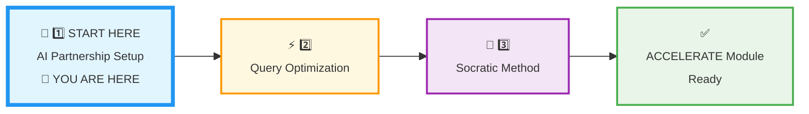
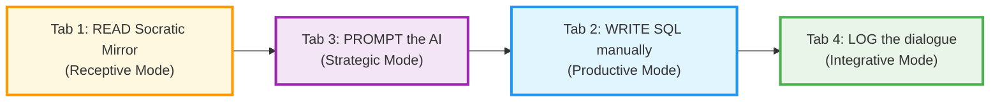
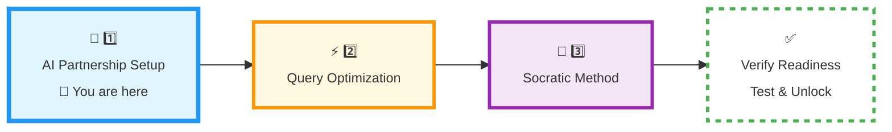

# 🗄️🤖 SQL & GenAI Course
**🎯 Quality Education for Anyone, Anywhere, Anytime — 💫 with Comfort, Convenience at no Cost**

---

## 🤖 **1 AI PARTNERSHIP SETUP: ACCELERATE Phase Calibration**


## 📍 **YOUR PILLAR PROGRESSION**
**Current Status:** Beginning the ACCELERATE Framework • First of Three Pillars



---

## 🎯 **Quick Win Promise**

**In the next 20-30 minutes,** you'll configure your AI as a **Socratic mentor** – a partner that sharpens your thinking, never writes code for you. You will establish the "No‑Code" protocol and create your **Socratic Journal** in your Vault.

The **AI** is your **Senior Architect.** It explains logic, suggests strategies, and **validates your reasoning.** You write every line of **SQL yourself.**

**Your Goal:** ACCELERATE‑ready AI partnership with guardrails, a configured persona, and a structured log for every dialogue.

 
---

## 📋 **Prerequisites & Quick Checklist**

**Before starting this pillar, confirm:**

- [x] **ACQUIRE Completion** is finished (your Skill‑Tree database is populated).
- [x] You have your AI platform ready (ChatGPT, Claude, or Gemini).
- [x] Your Vault (GitHub) is open in Tab 4.

> ⚠️ **If you have not completed ACQUIRE Completion, stop here.** Go back to `SECTION1_COMPLETION.md` and finish that first. ACCELERATE builds directly on your Skill‑Tree database.

---

## 🏢 **ACCELERATE PHASE: The AI Partnership Configuration**

**🚀 ACCELERATE MANDATE:**  
**Socratic Guidance | No Code Generation | Strategy Over Syntax | Dialogue Logging**

### **📋 ACCELERATE-Specific Tab Configuration**

| Tab | **ACCELERATE Purpose** | **ACCELERATE Restrictions** | **Save Rule** |
| :--- | :--- | :--- | :--- |
| **1: The Map** | ACCELERATE instructions & Socratic Mirror files | Reference only | 🚫 No saving here |
| **2: The Factory** | **Write SQL manually** after AI logic | No AI‑generated code pasted here | 💾 Copy to Tab 4 |
| **3: The Consultant** | **Socratic guidance ONLY** | ❌ Never ask for code | 📋 Log all dialogues in Tab 4 |
| **4: The Vault** | Socratic Journal & ACCELERATE logs | Structured `Socratic_Journals/` folder | ✅ Everything here |

**Pro Tip:** Use `Ctrl+3` / `Cmd+3` to jump to your AI Consultant – but remember: ask for logic, not code.

### **📅 Your 3‑Day ACCELERATE Calibration Ritual**

**Total Time:** 2–3 hours over 3 days → **Result:** A calibrated AI partnership for Module 5.

| Pillar | Duration | Core Focus | **Calibration Outcome** |
| :--- | :--- | :--- | :--- |
| **🤖 1. AI Partnership Setup** | Day 1 | Guardrails, Persona & Socratic Journal | **AI as Mentor:** A configured co‑pilot that never writes code. |
| **⚡ 2. Query Optimization** | Day 2 | Efficiency Patterns & Anti‑Patterns | **Speed Mindset:** Prompt for performance, spot AI hallucinations. |
| **🧠 3. Socratic Method** | Day 3 | Prompting Ladder, Validation, Context Feeding | **Critical Thinking:** Extract reliable logic from any AI. |

### **🧠 ACCELERATE Cognitive Workflow**



**ACCELERATE GOLDEN RULE:**  
**You write every line of SQL manually. AI explains logic only. Never ask for code.**

---

## ⏱️ **Step-by-Step ACCELERATE Calibration**

### **🔍 Choose Your Path & Verify Readiness**

**Before ACCELERATE calibration, verify your ACQUIRE Completion is ready:**

- [ ] Your Skill‑Tree database has `phases_level1`, `modules_level1`, `skills_level1` tables.
- [ ] You have at least 10 skills and 5 insights logged.
- [ ] You can successfully run `SELECT * FROM skills_level1;` in Tab 2.
- [ ] Your database file is saved in your Vault.

**All checked? → Proceed to Phase 1.**  
**Missing checks? → Complete `SECTION1_COMPLETION.md` first.**

---

## 🎯 Phase 1: Configure AI Persona for ACCELERATE

**Focus:** Establish the “No‑Code” protocol and configure your AI as a Socratic mentor.

### Step 1: Complete the Browser Office Context Setup

Before configuring the persona, you must feed the AI the necessary context (character stories and database schemas).

👉 Follow the instructions in **[`BROWSER-OFFICE-ACCELERATE.md`](../../Module5-GenAI-Walkthrough/BROWSER-OFFICE-ACCELERATE.md)**.

This file guides you through:
- Feeding the SQLVerse character stories
- Loading generic schema anchors (Modules 2 & 3)
- Understanding the two‑tier context strategy

> 💡 Complete this **before** moving to Step 2.

---

### Step 2: Copy the AI Persona Prompt

Once the context is loaded, configure the AI persona.

👉 Follow the instructions in **[`AI_PERSONA_PROMPT.md`](../../Module5-GenAI-Walkthrough/AI_PERSONA_PROMPT.md)**.

That file contains:
- The complete persona prompt
- Veracity check (hallucination prevention)
- Quick test to confirm the persona is working
- Recovery protocol for when AI writes code

---

### Step 3: Verify the Persona

After completing the persona setup, ask the AI a Socratic question to confirm it responds with logic, not code.

**Example test prompt (Training Institution):**  
*“How would I find the names of students who are enrolled in courses taught by instructor_id 501?”*

**Expected response:** Logic and strategy – no SQL code.

If the AI writes code, remind it: *“Explain the logic, don’t write SQL.”*


---

## 📓 **Phase 2: Create Your Socratic Journal**

**Focus:** Build a permanent log of every AI dialogue – proof of your thinking, not just your typing.

### **Step 1: Create the Folder Structure**

In your Vault (Tab 4), create the following folder:

```
Vault/
└── Socratic_Journals/
    ├── README.md
    └── (your journal files will go here)
```

### **Step 2: Copy the Journal Template**

Save this template as `Socratic_Journals/README.md` or as a separate file for each session:

```markdown
# [Date] – [Concept]

## Business problem
(Describe the real‑world question you were answering)

## My prompt to AI
(Exact words you used)

## AI’s guidance (logic only, no code)
(What the AI said – strategies, relationships, edge cases)

## My final SQL (written manually)
`(Your SQL code)`

## The Delta
**Before:** (what I thought the solution might be)  
**After:** (what I realised after the AI’s guidance)

## Reflection
(What clicked? What was hard?)
```

> 💡 **Future‑Proofing:** Keep your Socratic Journals tidy! In **Module 5 (Calibration)** , you will migrate these logs into your actual Skill‑Tree database to build a searchable history of your AI‑assisted logic.

### **Step 3: Log Your First Dialogue**

After each interaction with the AI (during the Socratic Mirror exercises), fill out a journal entry. This becomes **evidence** that you lead the AI, not the other way around.

> 💡 **Why log?** Your journal is a portfolio of your thinking process. In an interview, you can say: *“Here’s how I reasoned through every JOIN decision.”*

---


## 🚫 **Phase 3: ACCELERATE Guardrails – What to NEVER Ask**

**Focus:** Internalise the boundaries that make this partnership effective.

| ❌ Never ask | ✅ Instead ask |
|--------------|----------------|
| “Write me a query that…” | “What is the logical relationship between these tables?” |
| “Fix this SQL for me” | “What could cause this error? Hint me, don’t fix it.” |
| “Generate a schema for…” | “Based on my 3NF design, what entities should I consider?” |
| “Give me the answer” | “Guide me through the steps to discover the answer.” |

---

###  🧠 **The Artisan’s Veracity Check**  

 If the AI suggests a logic pattern or a specific SQL function you haven’t seen before, ask the AI for the official documentation link or a “Logic Stress Test” question to validate the suggestion for SQLite.

We have discussed this in detail in **AI_PERSONA_PROMPT** markdown file you used in **Phase 1.**

> *“The AI is your co‑pilot, not your autopilot.”*

---

## 🔄 Recovery Protocol (When AI Accidentally Writes Code)

If the AI generates SQL (even by accident), Redirect the AI to explain the logic and continue. We have discussed the **Workflow for Recovery Protocol** in **AI_PERSONA_PROMPT** markdown file you used in Phase 1.

---

## 🧠 **Deep Philosophy: The ACCELERATE Mindset**

<div align="center" style="border: 2px solid #ff9800; border-radius: 8px; padding: 20px; margin: 20px 0; background: #fff8e1;">

### **🚀 Foundation First, AI Next, Projects Last.**
### **💎 Gemstone by Gemstone, Skill by Skill.**

</div>

**Your ACCELERATE Mandate:**  
**Socratic Guidance | No Code Generation | Strategy Over Syntax | Dialogue Logging**

### **Why the “No‑Code” Protocol Builds Real Skill**

**The Paradox of AI Assistance:**
- **If AI writes code → You learn dependency.**  
- **If AI explains logic → You learn strategy.**

**ACCELERATE Phase trains you to:**
- **Think in relationships** (foreign keys, join logic) before writing syntax.
- **Validate AI suggestions** against your own manual mastery.
- **Own every line of code** you write.

### **The Socratic Journal Is Your Proof**

**What most students have:**  
- A folder of AI‑generated queries they don’t fully understand.

**What you will have:**  
- A **log of reasoning** – problem → AI guidance → manual SQL → reflection.  
- Evidence that you **lead the AI**, not the other way around.

> *“The master doesn’t ask ‘What’s the code?’ The master asks ‘What’s the logic?’”*

---
### 🔍 The “No‑Code” Protocol – At a Glance

| Your Role | AI’s Role |
|-----------|-----------|
| Write every line of SQL manually | Explain logic, never write code |
| Decide which join type to use | Explain the difference between `INNER` and `LEFT` JOIN conceptually |
| Build the final query | Validate your reasoning with questions |
| Log the dialogue in your Socratic Journal | Suggest strategies and edge cases |

> *“You are the Artisan. AI is your sharpening stone.”*

---

## 🔧 **ACCELERATE Tool Mastery Challenge**

<div style="border: 3px solid #9c27b0; border-radius: 10px; padding: 25px; margin: 30px 0; background: linear-gradient(135deg, #f3e5f5 0%, #e1bee7 100%); box-shadow: 0 8px 20px rgba(156, 39, 176, 0.2);">

### **🧪 Test Your AI Partnership Boundaries**

**Time:** 10 minutes  
**Objective:** Prove you can interact with the AI without breaking the “No‑Code” rule.

#### **🎯 The 3‑Part Boundary Test:**

**Part 1: Prompt Discipline (3 minutes)**
```markdown
Ask the AI a SQL question. It must **not** write code. If it does, correct it with:
“Please explain the logic, don’t write SQL.”

Write the AI’s response here (should be strategy only):
```

**Part 2: Journal Entry (5 minutes)**
```markdown
Create a journal entry for the dialogue above using the template.
```

**Part 3: Guardrail Recall (2 minutes)**
```markdown
List 3 things you must NEVER ask the AI:
1.
2.
3.
```

#### **📊 ACCELERATE Partnership Score:**
- **Perfect (all checks):** Excellent AI discipline → Proceed to Query Optimization.
- **Needs Practice:** Repeat the test until the AI never writes code.

**Your Score:** ___ / 3

</div>

---

## 🌱 What This Opens Up Later

Your Socratic AI partnership is not just for ACCELERATE. It lays the foundation for professional‑grade data engineering workflows:

- **AI‑assisted query tuning** – Ask the AI to reason about performance without rewriting your SQL.
- **Execution plans** – Have the AI explain how a query executes, step by step.
- **Indexing strategy** – Let the AI suggest where indexes would help, then you implement them.
- **Prompt engineering for analytics** – Craft prompts that extract deeper business logic from complex schemas.
- **Schema generation critique** – Feed your schema to the AI and ask: “What would you improve, and why?”
- **AI audit workflows** – Use the AI to verify that your queries meet compliance rules (e.g., no accidental cross‑joins).
- **SQL debugging conversations** – Paste an error message and ask for possible causes – without asking for the fix.
- **Business requirement extraction** – Describe a business goal in plain English; let the AI translate it into a logical query structure.
- **Multi‑step reasoning pipelines** – Break a complex reporting task into a chain of logical steps before writing any SQL.

All of this stays true to the **“No‑Code” protocol** – the AI guides, you build. Your Skill‑Tree database and Socratic Journal will be the evidence that you lead the AI, not the other way around.

> 🔮 **Level 2 Preview:** These are not requirements for ACCELERATE. They are a glimpse of the professional workflows you will master in the next phase.

> *“The Artisan doesn't ask for the answer. The Artisan asks for the path.”*

---

## 🚀 **Your Calibration Navigation Journey**

**Complete ALL 3 pillars in sequence before Module 5:**



### **🔄 Navigation Controls:**

**⬅️ Previous Step:** You came from [SECTION2_INDUCTION.md](../SECTION2_INDUCTION.md)

**➡️ Next Step:** Continue your calibration with Query Optimization

<div align="center" style="border: 3px solid #9c27b0; border-radius: 10px; padding: 25px; margin: 30px 0; background: linear-gradient(135deg, #f3e5f5 0%, #e1bee7 100%); box-shadow: 0 8px 20px rgba(156, 39, 176, 0.2);">

### **🎯 AI Partnership Setup Ready**

**After you pass the Tool Mastery Challenge, continue to Query Optimization**:

# [▶️ **NEXT: QUERY OPTIMIZATION**](./2_Query_Optimization.md)

**Learn efficiency patterns, anti‑patterns, and how to prompt for performance**

<small>⏱️ *Estimated time: 20-25 minutes*</small>

</div>

**🚫 Module 5 remains locked until ALL 3 calibration steps are complete.**

---

<div align="center" style="margin-top: 40px; padding: 15px; background: #f5f5f5; border-radius: 6px; font-size: 0.9em;">

**Calibration Time:** 20-30 minutes  
**Calibration Focus:** AI Partnership, Socratic Journal, “No‑Code” Protocol  
**Next Step:** Query Optimization  
**Core Principle:** You write the SQL. AI explains the logic.

</div>

---

*Part of our mission for 🎯 Quality Education for Anyone, Anywhere, Anytime — 💫 with Comfort, Convenience at no Cost.*

**Level 1 | ACCELERATE Phase | AI Partnership Calibrated | Ready for Query Optimization**

