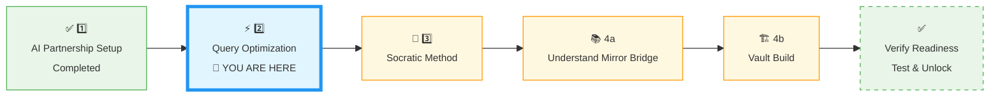
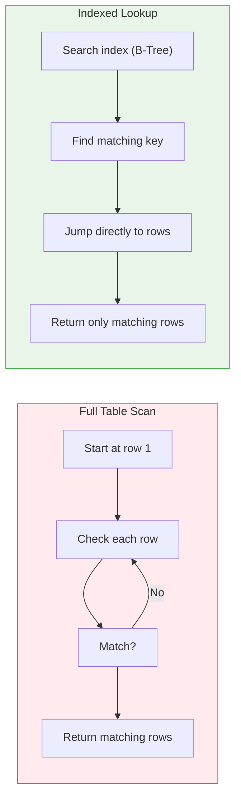
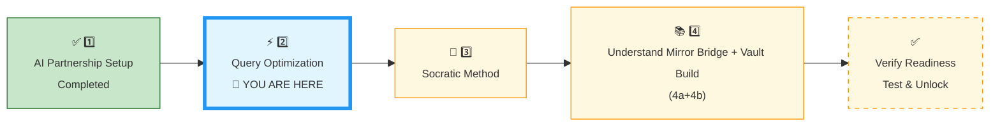

# 🗄️🤖 SQL & GenAI Course
**🎯 Quality Education for Anyone, Anywhere, Anytime — 💫 with Comfort, Convenience at no Cost**

---

## ⚡ 2 QUERY OPTIMIZATION: The Speed of Logic


## 📍 YOUR PILLAR PROGRESSION
**Current Status:** Continuing the ACCELERATE Framework • Pillar 2 of 4



---

## 🎯 Quick Win Promise

**In the next 20-30 minutes,** you will learn how to use your **Socratic AI** mentor to **identify** performance bottlenecks, avoid common anti‑patterns, and **reason clearly** about query execution order. You will also learn to **recognize** and challenge **AI hallucinations** regarding SQLite performance limitations.

**Your Goal:** Confidently **extract** performance‑related **architectural logic** from your AI partner without writing or copying a single line of external code.

> *Reminder:* You are still using your `Temporary Scratchpad` (created in Pillar 1) to capture all outputs. The permanent Vault and `INDUCTION_TASKS/` folder will be built in Pillar 4b.
> 
---

## 🧠 Phase 1: Understanding Performance Patterns

### 📖 Execution Order Refresher

SQL does not run your query in the top-to-bottom sequence you write them. The logical execution order is:

1. `FROM` / `JOIN` – Gather the raw source tables and combinations
2. `WHERE` – Filter rows at the earliest possible stage
3. `GROUP BY` – Agglomerate data into structural groups
4. `HAVING` – Filter those generated groups
5. `SELECT` – Project columns and resolve aliases
6. `ORDER BY` – Sort the resulting output records
7. `LIMIT` – Trim the final response payload

**Why this matters for performance:**  
Reducing rows earlier in the execution pipeline often helps the optimizer do less work.

---

## ⚡ Introduction to Indexes: The Speed Pillar

### 🎯 The Core Concept

An **Index** is a dedicated database structure that that **accelerates** data retrieval at the cost of additional disk storage and marginally slower data modification speeds. Without an index, database engine must execute a **Full Table Scan**, checking every single row to find a match.


### 🛠️ The Artisan’s Metaphor

- **The Library (Table):** Millions of multi-colored books piled randomly across vast warehouse shelves.
- **The Full Scan:** Walking past every single book title one by one to find a book by a specific author.
- **The Index:** The structured **Card Catalog** at the entry lobby. You look up the author’s name (the indexed column) to find the exact shelf and position of the book instantly.

### ⚙️ How the Query Optimizer Works

Behind every query, the database engine's **Query Optimizer** **maps out**  the fastest way to **fetch** your data. It weighs two core execution paths:



- **Full Table Scan (Red Path):** The database traverses **every row** in the table. Fast for tiny tables, disastrous for large ones; **catastrophic** for production **scaling**.

- **Indexed Lookup (Green Path):** The database navigates an **index** (like a card catalog) to jump straight to the matching rows. Extremely fast for targeted, selective searches.

> *“The optimizer chooses the green path when an index exists and the query is selective. Without an index, it has no choice but to walk the red path.”*

In the **SQLVerse**, an **index** isn't just a technical feature; it is the **Architectural Compass**. It allows a data artisan to **navigate** millions of rows without getting lost in a full table scan. It separates brute-force scripting from professional **database engineering.**

---

## 📖 **The Artisan’s Secret: The Index**

Imagine **Annie** is scanning a massive, automated e‑commerce warehouse layout looking for a specific vintage dress variant stored inside the `products` table: – our E‑store database.

- **The Amateur Way (Full Table Scan):** Annie walks down every single aisle (from aisle 1 to aisle 10,000 manually), checking every single box until she finds the dress. This works for 10 boxes, but completely crashes the operation when dealing with 10 million distinct SKUs.

- **The Artisan Way (The Index):** Annie references a high-speed **master ledger** at the front of the warehouse. The ledger lists **"Vintage Dresses"** and tells her exactly which aisle and shelf to go to. She **bypasses** the search and executes immediate retrieval.

---

### 📋 Key Points for ACCELERATE

**1. The "Why" (Performance Patterns)**  
Indexes are essential for columns frequently used in `WHERE` clauses, `JOIN` conditions, and `ORDER BY` statements.

**2. The "Trade‑off" (The Cost of Speed)**  
An Engineering Artisan recognizes that every tool has a cost attached to it:
- **Storage Cost:** Indexes take up extra disk space.
- **Write Latency:** Every time you `INSERT`, `UPDATE`, or `DELETE`, the database must also update the index to re-balance the index tracking structure.

**3. The Socratic Challenge**  
Instead of asking for code samples, challenge your AI mentor with strategic scenarios:

> *“In Raj’s Library database, if we frequently search for books by their `ISBN` or members by their `email`, which operation would be faster: searching a table with an index on that column, or a table without one? What happens to the speed of adding a new book or member?”*

Indexes **bridge** the gap between understanding how to **write a query** and how to **make a query perform** like a professional.

> 🔮 **Level 2 Preview:** Some queries benefit from indexes across multiple columns – called composite indexes. You will master them in Level 2.

---

## 🛠️ **Optimization Patterns & Anti‑Patterns**

Leverage these structural boundaries with your AI Consultant to master **indexing** and **access patterns**.

### **1. The Selective Search (Indexes)**

**Concept:** Use an index on columns you search often (like `email`, `order_id`, or `product_sku`).

- **Socratic Question to AI:** *“If I frequently filter Raj’s tourism data by 'travel_date', how does an index change the way SQLite handles the query underlying execution path?”*
- **The Trade‑off:** Every index makes `SELECT` faster but makes `INSERT` slightly slower (because the ledger must be updated). Always evaluate whether **read-frequency** justifies the minor **write-performance penalty** on your specific table.

### **2. The "Surgical" SELECT**

**Concept:** Eliminate `SELECT *` from your production vocabulary. Only ask for the columns you need.

- **Anti‑Pattern:** `SELECT * FROM orders;` (Annie drags the whole structural warehouse to the pickup counter).
- **Optimization:** `SELECT order_date, total_amount FROM orders;` (Annie only pulls the two parameters needed for the receipt).

### **3. The Hallucination Check**

**Concept:** Large Language Models frequently blend **multi-engine SQL syntax**, recommending operations unsupported by the local environment (SQLite in our case).

- **The Integrity Test:** If the AI suggests `DATEDIFF()` or `CONCAT()`, ask: *“Is that native SQLite syntax, or should I use `JULIANDAY()` and the `||` operator?”*

---

### ⚠️ Common Performance Anti‑Patterns

| Anti‑Pattern | Why It’s Bad | What to Ask the AI |
|--------------|--------------|---------------------|
| `SELECT *` | Returns unnecessary columns, Pollutes memory buffers, increases disk I/O, and wastes network bandwidth. | “What are the structural architectural risks of utilizing `SELECT *` in an application production layer?” |
| No `LIMIT` during exploration | Risks fetching millions of records, crash browser or server | “Why is a defensive `LIMIT` boundary standard practice when inspecting unfamiliar datasets?” |
| Missing `ON` clause | Triggers an accidental Cartesian product (combines every row with every other row). | “What happens if I forget the `ON` clause in a JOIN?” |
| Filtering after join | More rows processed than necessary | “How does moving a filter statement from a `HAVING` phase into a `WHERE` phase alter resource consumption?” |
| Using functions in `WHERE` | Prevents index usage (e.g., `WHERE DATE(created_at) = '2025-01-01'`). Invalidates indexing utility by forcing the engine to calculate a function value for every row (sargability failure) | “Why does running an explicit operation like `WHERE DATE(created_at) = '2025-01-01'` break index efficiency?” |

---

## 🧪 Phase 2: Example – Prompting About a Slow Query

### Case Analysis – Strategic Bottleneck Spotting

**Instead of a hands‑on exercise, we show an example.**

**Scenario:** You encounter a legacy analytical query that is lagging heavily:

```sql
SELECT * FROM orders o, customers c WHERE o.customer_id = c.customer_id AND o.order_date > '2025-01-01';
```

**An exact Socratic verification prompt for your AI Consultant (Tab 3):**

> *“Without rewriting this query or outputting any SQL syntax, analyze the performance risks present here. What legacy join pattern is being used, why does it complicate query planning for the optimizer, and what approach provides a clean alternative?”*

**The expected structural conceptual breakdown from your AI:**

- The comma‑join (`FROM orders o, customers c`) is an old‑style cross join with a filter in `WHERE` – harder for the optimiser.
- Suggest using explicit `JOIN` syntax (`FROM orders o JOIN customers c ON ...`). Moving to **standard, readable, explicit ANSI** join notation is the best solution.
- Explain that filtering early (within `ON` or as early as possible) is better.

> 💡 *“The Artisan doesn’t just write queries. The Artisan writes queries that scale.”*

---

## 🛡️ Phase 3: Guardrails & Anti‑Patterns

### Strategy Application

Use the table in Phase 1 as a reference. When diagnostic analysis indicates a slow query, ask the AI:

> *“Without rewriting my query or providing an updated script, explain which anti‑pattern might be causing it to run slowly. Walk me through the execution steps.”*

**Remember the Veracity Check:** If the AI suggests a performance trick you’ve never heard of (e.g., “use `WITH` clause for magic speed”), ask: *“Is that valid for SQLite? Explain the trade‑offs.”*

---

## ✅ Tool Mastery Challenge

**Time:** 5 minutes

**Objective:** Deconstruct an indexing execution path using your AI Consultant.

**Scenario:** You are querying the `enrollments` table (1 million rows) to find students enrolled in a specific course.

**The Bottleneck:** The database is checking every row one by one – a full table scan. The database execution logs show a full table scan occurs on every runtime request.

**Your Task:** Have a Socratic dialogue with your **AI Consultant** (Tab 3)  and fix the problem.

### 🎯 Your Challenge Action Steps:

**Step 1: Prompt Your AI Consultant (Tab 3):**

> *“I have a million rows in `enrollments`. What is the fundamental logical difference between a **‘Full Table Scan’** and an **indexed lookup** when I’m looking for a specific `course_id`?”*

**Step 2: Follow Up on Resource Allocation**

> *“What is the specific architectural trade-off here? If I add an index on `course_id`, what happens to the speed of inserting a new enrollment?”*

**Step 3: Log Your Insights**

Add the core insights from your conversation to your `Temporary Scratchpad` (the file you created in Pillar 1). In Pillar 4b, you will migrate these raw notes into their permanent home within your ACCELERATE Vault (`INDUCTION_TASKS/`) with the defined Quick Summary Format in Pillar 4b.


### **Pillar 2 Completion Checklist:**
- [ ] I asked about the performance difference without requesting code.
- [ ] The AI explained the concept of indexed lookup vs full table scan.
- [ ] The AI described the trade‑off (faster reads, slower writes).
- [ ] I logged the exchange in my `Temporary Scratchpad`.

*You will reorganise these logs into `INDUCTION_TASKS/` during Pillar 4b.*

---

## 🌱 What This Opens Up Later

Mastering query execution theory equips you to cleanly handle advanced architecture layers in **Level 2**:

-   Complex performance auditing tasks (`EXPLAIN QUERY PLAN` analysis).
    
-   Multi-column strategy deployment (Composite and Covering Indexes).
    
-   Engine-level storage differences (SQLite B-Trees vs. PostgreSQL execution strategies).

> *“The Artisan doesn’t just make queries work. The Artisan makes them work fast.”*

---

## 🚀 Your Calibration Navigation Journey

**Complete ALL 3 pillars in sequence before Module 5:**



### 🔄 Navigation Controls

**⬅️ Previous Step:** You came from [1_AI_Partnership_Setup.md](./1_AI_Partnership_Setup.md)

**➡️ Next Step:** Continue your calibration with Socratic Method

<div align="center" style="border: 3px solid #ff9800; border-radius: 10px; padding: 25px; margin: 30px 0; background: linear-gradient(135deg, #fff8e1 0%, #ffe0b2 100%); box-shadow: 0 8px 20px rgba(255, 152, 0, 0.2);">

### 🎯 Query Optimization Calibration Complete

**After you pass the Tool Mastery Challenge, continue to Socratic Method:**

Now that you know how to make queries fast, it's time to learn how to make your **prompts** even faster. Let us accelerate your actual communication pipeline with your AI mentor. In the next file, we unpack the **Inquiry Prompting Ladder**.


# [▶️ **NEXT: SOCRATIC METHOD**](./3_Socratic_Method.md)

**Learn the Prompting Ladder, validation checklist, and context feeding**

<small>⏱️ *Estimated time: 20-25 minutes*</small>

</div>

**🚫 Module 5 remains locked until ALL 4 calibration steps are complete.**

---

*Part of our mission for 🎯 Quality Education for Anyone, Anywhere, Anytime — 💫 with Comfort, Convenience at no Cost.*

**Level 1 | ACCELERATE Induction | Query Optimization**


