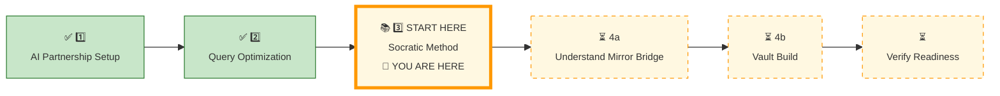
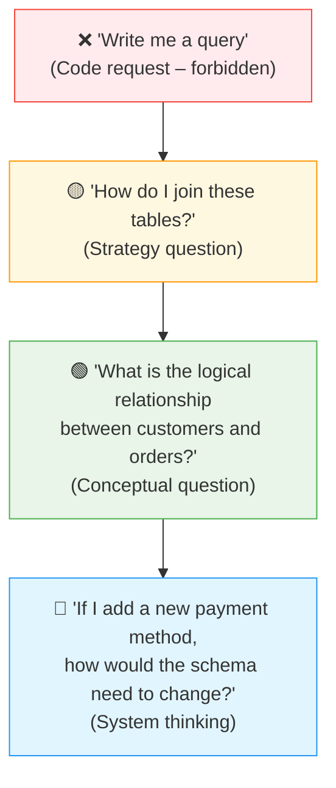
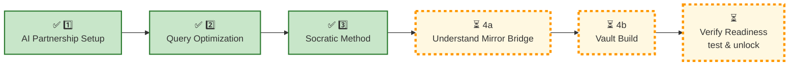

# 🗄️🤖 SQL & GenAI Course
**🎯 Quality Education for Anyone, Anywhere, Anytime — 💫 with Comfort, Convenience at no Cost**

---

## 🧠 3 SOCRATIC METHOD: Strategic Questioning

### The Prompting Ladder & Validation

In this pillar, you will learn how to **ask the right questions** – prompting the AI for logic, not code. You will climb the Prompting Ladder, use a validation checklist to spot hallucinations, and master the art of context feeding.

*The Artisan doesn’t ask for the answer. The Artisan asks for the path.*

---

## 📍 YOUR PILLAR PROGRESSION
**Current Status:** Continuing the ACCELERATE Framework • Pillar 3 of 4


---

## 🎯 Quick Win Promise

**In the next 20-25 minutes,** you will master the **Socratic Method** – the art of prompting and provoking strategic logic from your AI partner, validating the responses, isolating systemic edge cases, and feeding context efficiently. You will learn to climb the **Prompting Ladder**, run live sanity verifications, and manage context across databases.

**Your Goal:** Confidently ask questions that produce **pure architectural strategy, not code** – and know how to verify that the AI’s advice is accurate for SQLite.

> *Reminder:* You are still using your `Temporary Scratchpad` (created in Pillar 1) to capture all Socratic dialogues, AI responses, and reflections. The permanent Vault and `INDUCTION_TASKS/` folder will be built in Pillar 4b. For now, simply add your insights to the scratchpad – no formal structure needed.

---

## 🧠 Phase 1: The Prompting Ladder

Not all prompts are created equal. The Socratic Method is about  intentionally **climbing the ladder** – from vague requests to precise, logical inquiries.



| Level | Prompt Type | Objective | Example |
|-------|-------------|-----------|---------|
| 1 | The Surface Trap | Surface troubleshooting | “I’m stuck understanding how JOIN logic matches up lines.” |
| 2 | Concept Extraction | Structural mechanics | “Explain the abstract difference between INNER and LEFT JOIN operations.” |
| 3 | Relationship Isolation | Entity map mapping | “What is the underlying cardinality and relationship between students and enrollments?” |
| 4 | System Architecture | Structural impact simulation | “If I append a new course variant to the platform model, how does that update propagate through the database schema?” |


---

## 🧪 Phase 2: Validation Checklist – Spot AI Hallucinations

After receiving any strategy breakdown from your AI Consultant, immediately pass its response through this **5-Point Sanity Protocol** before beginning manual query assembly:

| # | Sanity Query | Objective | Why It Matters |
|---|--------------|-----------|----------------|
| 1 | “Does this logic implicitly handle NULL records safely?” | Access Stability | Prevents unexpected empty arrays and silent data drop-outs. |
| 2 | “What internal edge cases break this specific design?” | Edge Case Analysis | Forces immediate consideration of empty states, single-row anomalies, and boundary values. |
| 3 | “Is this strictly valid native SQLite syntax?” | Engine Sanity | Exposes hallucinated external engine operators like DATEDIFF or NVL. |
| 4 | “Does this structure scale gracefully if the dataset hits millions of records?” | Performance Sizing | Surfaces full table scans and unsargable structures before deployment. |
| 5 | “What structural assumptions are you making about my tables?” | Bias Isolation | Clears hidden logic assumptions regarding column defaults or key uniqueness. |

---

### 🔍 **Case Study: Intercepting an Optimization Hallucination**

**The AI may confidently recommend:**

```sql
SELECT TOP 5 product_name, price
FROM products
ORDER BY price DESC;
```

**Your  Automated Validation Check:**  
*“Is that valid SQLite syntax? What should I use instead?”*

**Correct response:** SQLite does not support `TOP 5`. It uses `LIMIT 5` at the end of the query.

```sql
SELECT product_name, price
FROM products
ORDER BY price DESC
LIMIT 5;
```

> *“The Artisan never trusts blindly. The Artisan verifies every logical pass.”*
> *“Verification is the difference between AI assistance and AI dependency.”*


---

## 🔄 Phase 3: Context Feeding & Memory Reset

### For Modules 2 & 3 (Anchored Generic Context)

Feed the AI the fundamental core schemas **once** at the start of ACCELERATE:

- `SCHEMA_ANCHOR_TRAINING_INSTITUTION_SAMPLE.md`
- `SCHEMA_ANCHOR_LEVEL1_ESTORE_BASIC.md`

Tell the AI: *“These are the core schemas for ACCELERATE.  These profiles serve as my global schemas for ACCELERATE operations. Remember them.”*
 
### For Module 4 (File‑Specific Context Extraction)

Each Socratic Mirror file in `ACQUIRE-MODULE4/` contains a **Context box** pinned to its header at the top. Copy and paste it into the AI **before** asking questions.

**Example from `5-SelfJoin.md`:**

> **Database:** `level1_estore_self_join.db`  
> **Tables:** `employees` (employee_id, name, manager_id)  
> **Business problem:** Find employee–manager relationships using a self join.

---

### 🔄 Reset Instruction – Critical for Module 4

🧹 **The Memory Eraser Protocol – Crucial for Isolated Datasets**

When shifting focus between distinct Module 4 schemas (e.g., executing a jump from `level1_estore_self_join.db` over to `tourism_planet_self_join.db`), you must **explicitly force** an a**ctive clear** of the  AI's active working memory.

Say this exact phrase:

> *“Discard previous specific table structures for Module 4. Here is the new context for [Concept Name].”*

⚠️ **Artisan Warning:** Skipping this memory flush causes the language model to synthesize tables from separate databases, outputting fragmented, hallucinated architecture models.

---

**📋 Context Eraser Template (Copy-Paste):**

```text
Discard previous specific table structures for Module 4. Here is the new context for [Concept Name].
```

**Example:**  
> *“Discard previous specific table structures for Module 4. Here is the new context for Self Join.”*

**Action:** Paste this into your AI Consultant before pasting a new context box.

---

### 📦 Prompt Compression vs. Expansion Dynamics


**Context Compression** (Leveraged inside shared systems like Modules 2 & 3):

> *“Same schema. Maintain existing loaded schema parameters. Now optimise for NULL-safe aggregation.”*

**Context Expansion** (when switching databases – Module 4 Required when executing jumps across Module 4 databases):

> *“New tourism schema. Reset previous context. Execute schema wipe. Erase past transactional contexts. Here are the fresh tables, relationships, and operational business goals.”*

> ## 💡 Pro Tip
> 
> **“Compression saves time. Expansion prevents confusion. Know when to use each.”**

---

🧠 **The Artisan’s Anti‑Hallucination Principle**

The quality of AI output is constrained by the quality of context and reasoning supplied by the Artisan. Not better prompts alone.  Better models help, but **structured context and disciplined reasoning** matter far more than model size alone.

---
## 🧠 Session Memory Management

**You are now the curator of the AI’s working memory.** Every time you start a new conversation, switch databases, or move between modules, the AI’s memory resets – unless you explicitly manage it.

- **Generic context (Modules 2‑3):** Load once at the start of the session.
- **Compression prompts:** Use phrases like *“Same schema. Now optimise for NULL‑safe aggregation.”* These work only while the AI still holds the context from earlier in the same conversation.
- **Specialised context (Module 4):** Load per concept. Use the **reset instruction** before each new database.
- **Session start ritual:** Begin every ACCELERATE session by re‑loading the generic schema anchors and the persona prompt. The AI does not remember past conversations unless you feed the context again.

> *“Discipline over memory is discipline over hallucinations.”*
---

## 🧪 Phase 4: Example – Socratic Dialogue in Action

**Scenario:** You need to find customers who have placed orders, but only those who bought products from the 'Electronics' category.

**❌  Bad Prompt : The Dependent Approach (Code Request):**  
*“Write me a query to fetch all  customers who purchased Electronics products.”*

**✅ Good Socratic Prompt: The Professional approach (Strategic Extraction)**  
*“In the E‑Store database, what is the exact **chain of relationships** connecting  customers, orders, order_items, products, and categories? How would I trace a customer back to the category of products they bought? Map out the **structural join sequence** without writing any SQL code blocks.”*

**The AI’s Aligned Strategic Output:**  
*“Start with customers. Join to orders via customer_id. Then join to order_items via order_id. Then join to products via product_id. Finally, join to categories via category_id. Filter by category_name = ‘Electronics’. Use DISTINCT if you want each customer once, even if they bought multiple Electronics products.”*

**Your Execution Phase:** Transition to **The Factory (Tab 2)** and write the SQL manually using the **architectural blueprint** provided above.

```sql
-- Your SQL here (manual, no copy-paste)
```

**Validation Check:** Ask the AI – *“Does this query handle customers who never bought anything from Electronics? What happens if a customer bought multiple Electronics products?”*

---

### 🧠 Prompt Evolution Matrix – From Weak to Artisan

| Prompt Type | Example |
|-------------|---------|
| **Weak** | “Write SQL for this.” |
| **Better** | “How should these tables relate?” |
| **Artisan‑Level** | “What business assumptions am I making in this join logic, and what edge cases could invalidate them?” |

> *“The Artisan doesn’t ask for code. The Artisan questions the assumptions behind the code.”*

---

## 📋 **The Blueprint Socratic Prompt Architecture**

To guarantee pristine execution without accidental code delivery, construct your interactions using this three-part assembly matrix:

**1. [THE CONTEXT]    ->** 

**2. [THE INQUIRY]    ->**

**3. [THE CONSTRAINT] ->** 


| Component | Example |
|-----------|---------|
| **Context** | “In the Training Institution database…” |
| **Core Question** | “…what is the logical relationship between students, enrollments, and courses?” |
| **Constraint (Guardrail)** | “…Explain how to find students enrolled in a specific course **without writing SQL**.” |

**Complete prompt:**
> *“In the Training Institution database, what is the logical relationship between students, enrollments, and courses? Explain how to find students enrolled in a specific course without writing SQL.”*

---

## ⚡ Advanced Socratic Prompt: Internalizing the Optimizer

### Thinking Like the Query Planner

True database mastery means configuring your queries to align cleanly with engine execution pipelines. Optimisation is not about asking the AI to “fix my slow query.” It is about understanding **how the database thinks**. The following Level 4 (System Thinking) prompt forces the AI to explain execution strategy, not just hand you rewritten code.

**Socratic Optimization Prompt:**

> *“I am working with the E-Store database, specifically joining the orders table to the products table. The query is running slowly when I filter by category_name. Without writing any SQL code, can you explain how SQLite executes a JOIN combined with a WHERE filter? Which operation does the database engine usually try to perform first to minimize the rows it has to process, and how can I structure my logical thinking to support that?”*

**Why This Works:** The AI will explain concepts like filter reduction and index usage – giving you the strategic insight to optimise your own SQL manually.

---

## 🛡️ Phase 5: Guardrails – What to NEVER Ask

Review these strict operational boundaries before interacting with **The Consultant (Tab 3)**:

| ❌ Never ask (Forbidden Dependency Inquiries) | ✅ Instead ask (Approved Socratic Alternatives) |
|--------------|----------------|
| “Write me a query that…” | “What is the logical relationship between these tables?” |
| “Fix this SQL for me” | “What could cause this error? Hint me, don’t fix it.” |
| “Generate a schema for…” | “Based on my 3NF design, what entities should I consider?” |
| “Give me the answer for this challenge” | “Guide me through the steps to discover the answer.” |

> *“The AI is your co‑pilot, not your autopilot.”*

---

## ✅ Tool Mastery Challenge

**Time:** 10 minutes

**Task:** Write a Socratic prompt to the AI about a concept you struggled with in ACQUIRE. The AI must explain the reasoning process without generating SQL.

**Your prompt:** _________________________________

**AI’s response (strategy only):** _________________________________

**Checklist:**
- [ ] I asked about a concept without requesting code.
- [ ] The AI explained the logical relationship.
- [ ] I validated the AI’s response using the 5‑point checklist.
- [ ] I logged the exchange to my `Temporary Scratchpad`.

> *All scratchpad content will be migrated to `INDUCTION_TASKS/` in Pillar 4b.*

---

## 🌱 What This Opens Up Later

Mastering the Socratic Method prepares you for:

- **Complex debugging conversations** – describing errors without pasting code
- **Business requirement extraction** – translating stakeholder requests into query logic
- **AI audit workflows** – verifying that AI‑generated logic meets compliance rules
- **Multi‑step reasoning pipelines** – breaking complex reports into logical steps before writing SQL

> *“The Artisan doesn’t ask for the answer. The Artisan asks for the path.”*

---
## 🪜 The Deeper Inquiry Ladder – Where to Find Each Layer

The Socratic Method is not a single question – it is a **progression of depth**. Each layer builds on the previous, moving from surface observation to system‑level thinking. The table below shows each layer, the question it answers, and where in this file you can master it.

| Layer | Question | Section in This File |
|-------|----------|----------------------|
| **Observation** | “What tables/entities matter?” | Prompting Ladder (Levels 1-2) |
| **Relationship** | “How are these entities connected?” | Prompting Ladder (Level 3) |
| **Constraint** | “What filters or business rules exist?” | Guardrails |
| **Edge Cases** | “What breaks this logic?” | Validation Checklist (Q2) |
| **Validation** | “How do I verify correctness?” | Validation Checklist |
| **Optimization** | “How would this scale?” | Thinking Like the Query Planner |

> *“Each layer deepens your inquiry. The Artisan climbs one rung at a time.”*

>  🧠 **Clarification:** The goal is not to avoid SQL generation forever. The goal is to ensure you **understand the reasoning** before accepting generated code. Once you comprehend the logic, writing the SQL yourself (or later, with AI assistance) builds genuine mastery.
>  
> **SQL generation is unlocked in Level 3 and for complex projects** – provided you can **validate** the output and **spot accidental errors** in the generated SQL. The Artisan always verifies before trusting.

---

## 💭 Ponder & Reflect – The Culmination Challenge (Preview)

Before you complete ACCELERATE induction, consider this scenario:

**You are given a fresh schema (no context loaded). You need to:**

1. Load the schema context correctly
2. Ask progressively deeper Socratic questions
3. Detect a hallucination in the AI’s response
4. Redirect the AI
5. Write the SQL manually
6. Log your reasoning chain using the **Quick Summary Format** established in Pillar 4b

**This is the ultimate test of all 4 pillars working together.**

You will complete this challenge in the **verification step** (`SECTION2_INDUCTION_FINISH.md`). For now, reflect on how you would approach it.

> *“The Artisan doesn’t just learn the tools. The Artisan learns the ritual.”*

---

## 🚀 Your Calibration Navigation Journey

**Complete ALL 4 pillars before starting the ACCELERATE Module (Module 5):**



### 🔄 Navigation Controls

**⬅️ Previous Step:** [2_Query_Optimization.md](./2_Query_Optimization.md)

**➡️ Next Step:** [4a ACCELERATE MIRROR](./4a_ACCELERATE_MIRROR.md)

<div align="center" style="border: 3px solid #ff9800; border-radius: 10px; padding: 25px; margin: 30px 0; background: linear-gradient(135deg, #fff8e1 0%, #ffe0b2 100%); box-shadow: 0 8px 20px rgba(255, 152, 0, 0.2);">

### 🎯 Socratic Method Calibration Complete

**Proceed to the next pillar – understand the high-level pattern mapping that ties your work together. Let's step into the structural bridge.:**

# [▶️ **NEXT: ACCELERATE MIRROR**](./4a_ACCELERATE_MIRROR.md)

**Learn why ACCELERATE mirrors ACQUIRE**

<small>⏱️ *Estimated time: 10-15 minutes*</small>

</div>

**🚫 Module 5 remains locked until ALL 4 calibration pillars are complete.**

---

<div align="center" style="margin-top: 40px; padding: 15px; background: #f5f5f5; border-radius: 6px; font-size: 0.9em;">

**Calibration Time:** 20-25 minutes  
**Calibration Focus:** Prompting Ladder, Validation Checklist, Context Feeding  
**Next Step:** 4a ACCELERATE MIRROR  
**Core Principle:** You write the SQL. AI explains the logic.

</div>

---

*Part of our mission for 🎯 Quality Education for Anyone, Anywhere, Anytime — 💫 with Comfort, Convenience at no Cost.*

**Level 1 | ACCELERATE Induction | Socratic Method | Next: [4a ACCELERATE MIRROR](./4a_ACCELERATE_MIRROR.md)**


