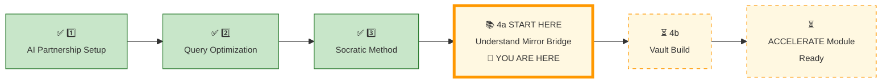
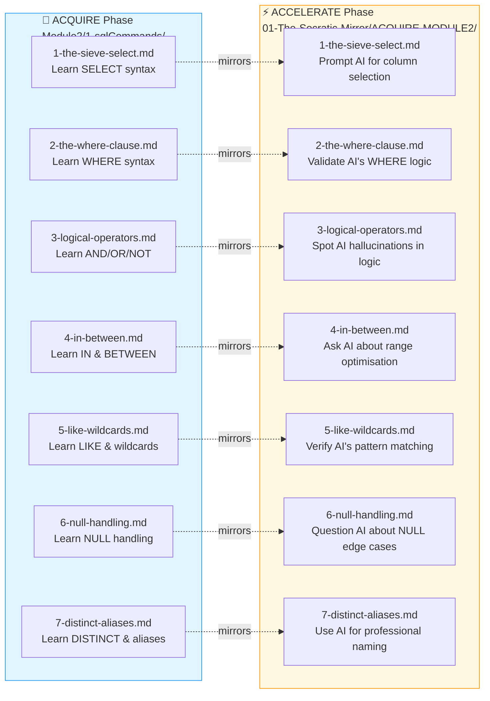
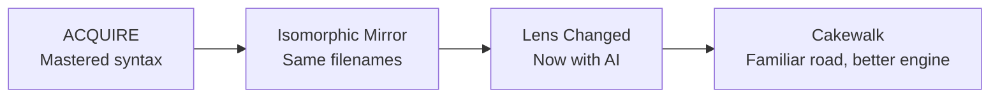
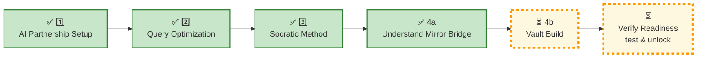

# 🗄️🤖 SQL & GenAI Course
**🎯 Quality Education for Anyone, Anywhere, Anytime — 💫 with Comfort, Convenience at no Cost**

---

## 📚 **4a KNOWLEDGE BASE: ACCELERATE MIRROR**

### The Structural Symmetry of Mastery


Before you build the Vault, you must understand the **mirror** – an **isomorphic** mirror **bridge** that connects **ACQUIRE** and **ACCELERATE.** This page explains why ACCELERATE feels familiar – because it is designed to be.

*Same filenames. Same databases. Same characters. Only the lens changes.*

In this pillar, you will discover the **underlying architecture** of this course. By understanding why and how the **ACCELERATE** phase perfectly mirrors the **ACQUIRE** tasks you just completed, you will unlock the secret to converting short-term concept recognition into long-term, subconscious muscle memory. 🧠

*The Apprentice memorizes a solution. The Artisan masters the pattern.*

Now, see where you are in the journey.

---

## 📍 **YOUR PILLAR PROGRESSION**
**Current Status:** Pillar 1-3 ✅ Complete • Pillar 4 begins now



---

## 🎯 **Quick Win Promise**

**In the next 10-15 minutes,** you will decode the structural blueprint of the course. You will learn how to map an independent challenge back to its guided counterpart, using your **AI Consultant** as a Socratic thinking partner – not a crutch, but a co-pilot.

**Your Goal:** Understand how the **ACQUIRE-to-ACCELERATE Mirror** works so you can navigate advanced challenges with confidence, knowing you have both the mirror and the AI to guide you.

---

## 🧠 The Mirror Philosophy

### 🔗 The Isomorphic Principle

ACCELERATE is **not a new journey** – it is the **same road you already travelled**, now driven with a high‑performance engine (AI).

- **ACQUIRE** taught you *how to write* SQL.
- **ACCELERATE** teaches you *how to prompt, verify, and strategise* with AI.

You will retrace the exact path of Modules 2 through 4, revisiting every concept you already mastered – `SELECT`, `WHERE`, `JOIN`, `GROUP BY`, and all the rest. But this time, the objective shifts from **learning syntax** to **mastering Socratic dialogue**.

### 🗺️ The Mirror Roadmap

| ACQUIRE (Manual) | ACCELERATE (AI‑Powered) |
|------------------|-------------------------|
| `1-sqlCommands/` | `01-The-Socratic-Mirror/` (identical filenames) |
| “How do I write this?” | “How do I prompt for this?” |
| Learn the syntax | Learn the strategy |
| Manual execution | AI‑guided reasoning + manual execution |

Every file in the Socratic Mirror has the **exact same name** as its ACQUIRE counterpart. When you see `1-the-sieve-select.md` again, you will have an instant **“aha!” moment**:

> *“I already know how to write SELECT. Now I will learn how to **ask the AI** to help me select the right columns from a messy, 50‑column table.”*

### 🛡️ Why This Works (The “Cakewalk” Effect)

| Reason | Why It Matters |
|--------|----------------|
| **Familiarity** | You don’t have to learn a new map. You are driving the same road with a better engine. |
| **No Code Generation** | Because you already know the syntax, you are less tempted to ask the AI to “write” the code. You use the AI to **refine your strategy**. |
| **Mental Anchors** | Identical filenames create instant recognition. Your brain says: *“I’ve seen this before. I can do this.”* |
| **Natural Extension** | You are not starting over. You are **upgrading** – from manual craftsman to AI‑accelerated Artisan. |

### 🚀 The ACCELERATE Realisation

ACCELERATE is not a detour. It is the **power‑user layer** on top of the foundation you already built. The structure is the same. The databases are the same. The characters are the same. Only your **speed and depth** will change.

First you built the **foundation.** Now you add the **AI accelerator**. The map is the same – but your **vehicle** just got a **turbo.**

---

## ✅ Sample 1:1 Mapping (7 Identical Filenames)

| ACCELERATE – `01-The-Socratic-Mirror/ACQUIRE-MODULE2/` | ACQUIRE – `Module2-BasicRetrieval-SelectAndWhere/1-sqlCommands/` |
|--------------------------------------------------------|----------------------------------------------------------------|
| `1-the-sieve-select.md` | `1-the-sieve-select.md` |
| `2-the-where-clause.md` | `2-the-where-clause.md` |
| `3-logical-operators.md` | `3-logical-operators.md` |
| `4-in-between.md` | `4-in-between.md` |
| `5-like-wildcards.md` | `5-like-wildcards.md` |
| `6-null-handling.md` | `6-null-handling.md` |
| `7-distinct-aliases.md` | `7-distinct-aliases.md` |

Every concept you studied in **ACQUIRE** has a corresponding twin sister waiting for you in **ACCELERATE**.

This approach works because your brain relies on **structural mapping** to build real skills. When you face an ACCELERATE problem, you aren't looking at something brand new; you are looking at a **beautiful reflection** of a problem you have already solved!

---

## 🗺️ Mermaid – The Perfect Mirror



---

## 🛠️ From Mirror to Action – The Strategic Playbook

### The Mirror Philosophy (Training Wheels → Accelerator)

- **ACQUIRE** was your training wheels phase. You had step-by-step guidance, explicit hints, and micro-explanations. 🚲
- **ACCELERATE** drops you into a parallel business scenario with the exact same logical complexity. You now have the **mirror** (to see the pattern) and the **AI Consultant** (to guide your reasoning) – no hand-holding needed because you already hold the tools.

### Side-by-Side Blueprint Mapping

To understand how this reflection works, look at this direct comparison of Module 4 tasks:

| 📘 ACQUIRE Task (Guided) | 🍊 ACCELERATE Mirror Task (Independent) | Core Logical Pattern |
| --- | --- | --- |
| **Database:** `level1_estore_self_join.db`<br>**Problem:** Find employee-manager pairs to map out an internal corporate reporting hierarchy. | **Database:** `tourism_planet_self_join.db`<br>**Problem:** Find parent-child regional destination relationships to map out a global travel catalog routing network. | **The Self-Join Pattern**<br>Joining a table back to a subset of itself using a single matching foreign key indicator. |

### 🛠️ The Strategic Playbook

If you find yourself struggling with a complex destination routing problem in ACCELERATE, you do not throw your hands up. Instead, you:

1. **Open your previous ACQUIRE files** – find the employee-manager problem you already solved.
2. **Examine your handwritten notes** – the logic is the same.
3. **Use your AI Consultant** – ask Socratic questions to confirm your reasoning.
4. **Write the SQL manually** – applying the pattern to the new domain.

The mirror shows you the pattern. The AI sharpens your thinking. You write the code.


##  ⚡ The “AHA!” moment

The **isomorphic mapping** between ACQUIRE and ACCELERATE is now crystal clear . The mirror is perfect, but the lens has changed. 

I already mastered `1-the-sieve-select.md` in ACQUIRE. Now in ACCELERATE, I’m not learning `SELECT` again – I’m learning how to **ask AI** to help me with `SELECT`.



---

 I don’t have to struggle with new concepts. I just need to learn how to **talk to AI** about the concepts I already know. This will be a **cakewalk**.
 

> 🎯 **ACCELERATE Insight**
>
> You are **NOT** relearning SQL.  
> You are learning **how to think WITH AI** about the SQL you already know.
>
> *The syntax is the same. The databases are the same. The characters are the same. Only your **speed, depth, and strategic thinking** will change.*

---
## 🌳 **Persistent Professional Ledger – Grow Your Skill‑Tree Naturally**

> 🧠 **Skill‑Tree Reminder** – *This is not extra work. It’s a 30‑second habit.*

**The double purpose of revisiting ACQUIRE files:**

When you read an ACQUIRE file again to deepen your understanding for ACCELERATE, you are already **redrafting and reiterating** the concept. Adding a row to your Skill‑Tree database captures that reinforcement instantly.

| Step | What You Do | Time |
|------|-------------|------|
| **1** | Read the Socratic Mirror file | 10–15 min |
| **2** | Revisit the corresponding ACQUIRE file | 5–10 min |
| **3** | Add one row to `skills_level1` or `insights_level1` | **30 seconds** |

That’s it. Your Skill‑Tree grows **as you learn** – not as a separate chore.

> *“The Artisan doesn’t document after learning. The Artisan documents **while** learning – and the documentation becomes the proof.”*

---

### 🔍 Query Your Skill‑Tree – The Web of Knowledge

You don’t need fragile hyperlinks to connect your skills back to their sources. Your Skill‑Tree database already has a `filename` column. Use **self joins and queries** to navigate your web of knowledge.

**Example 1 – Find all skills from Module 4 files:**

```sql
SELECT skill_name, filename
FROM skills_level1
WHERE module_id = 4
ORDER BY skill_name;
```

**Example 2 – Link every skill back to its source file and module:**

```sql
SELECT 
    s.skill_name,
    s.filename AS source_file,
    m.module_name
FROM skills_level1 s
JOIN modules_level1 m ON s.module_id = m.module_id
ORDER BY m.module_id;
```

**Example 3 – Find insights from a specific concept file:**

```sql
SELECT insight_text, student_viewpoint
FROM insights_level1
WHERE source_filename = '6-JoinConditions.md';
```

> *“The Skill‑Tree is not a static record. It is a **queryable web of knowledge** – and you already know how to query it.”*

> “Your knowledge is no longer trapped in folders — it becomes **relational, searchable, and composable.**”

---

### 🌱 Seed Data for ACCELERATE

Just as you seeded your Skill‑Tree database for ACQUIRE, add the ACCELERATE phase and its module:

#### 🗄️ Before You Begin – Load Your Skill‑Tree Database

**Open your Skill‑Tree database in Tab 2 (The Factory).** This is the database you built during ACQUIRE Completion.

If you haven’t created it yet, return to `SECTION1_COMPLETION.md` and complete the BUILD phase first.


```sql
-- Add ACCELERATE phase
INSERT INTO phases_level1 (phase_id, phase_name, phase_description, start_module)
VALUES (2, 'ACCELERATE', 'AI partnership: Module 5 (GenAI SQL Co-pilot)', 5);

-- Add Module 5 (ACCELERATE core)
INSERT INTO modules_level1 (module_id, module_name, phase_id, folder_pattern)
VALUES (5, 'Module 5: GenAI Walkthrough', 2, 'Module5-GenAI-Walkthrough/01-The-Socratic-Mirror');
```

**Action:** Run these `INSERT` statements in your Factory (Tab 2). Then run `SELECT * FROM phases_level1;` and `SELECT * FROM modules_level1;` to confirm.

> *“Your Skill‑Tree now captures both ACQUIRE and ACCELERATE – a complete record of your Level 1 journey.”*

> *“Your Skill‑Tree is the living record of your journey. ACCELERATE will add to it.”*


---

## 🚀 **Your Calibration Navigation Journey**

**Complete ALL 4 pillars before proceeding to verification:**



### 🔄 Navigation Controls:

**⬅️ Previous Step:** [3_Socratic_Method.md](./3_Socratic_Method.md)

**➡️ Next Step:** [Build Your ACCELERATE Vault →](./4b_ACCELERATE_VAULT_BUILD.md)

<div align="center" style="border: 3px solid #ff9800; border-radius: 10px; padding: 25px; margin: 30px 0; background: linear-gradient(135deg, #fff8e1 0%, #ffe0b2 100%); box-shadow: 0 8px 20px rgba(255, 152, 0, 0.2);">


Mirror Structural Bridge Decoded. Now it’s time to **build your ACCELERATE Vault**. Proceed to the next sub-pillar to construct your analytical storage system:


# [▶️ **NEXT: BUILD ACCELERATE VAULT**](./4b_ACCELERATE_VAULT_BUILD.md)

**Complete the Vault Build phase and verification test to unlock Module 5.**

<small>⏱️ *Estimated time: 5-10 minutes*</small>

</div>

**🚫 Module 5 remains locked until you pass the verification test.**

</div>

---

*Part of our mission for 🎯 Quality Education for Anyone, Anywhere, Anytime — 💫 with Comfort, Convenience at no Cost.*

**Level 1 | ACCELERATE Phase | Knowledge Base Commissioned | Ready for Module 5**


