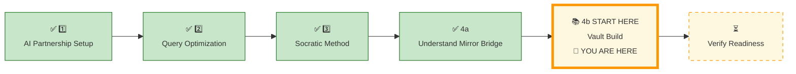
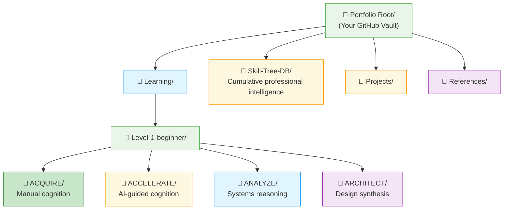
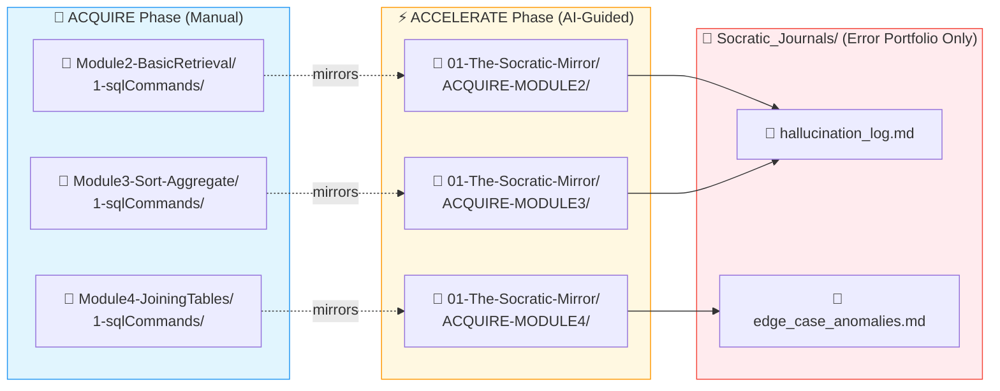
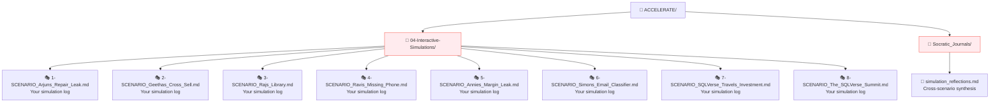
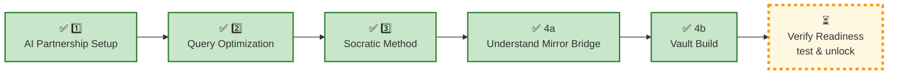

# 🗄️🤖 SQL & GenAI Course
**🎯 Quality Education for Anyone, Anywhere, Anytime — 💫 with Comfort, Convenience at no Cost**

---

## 📚 **4b KNOWLEDGE BASE: ACCELERATE VAULT BUILD**

### Create Your Knowledge System

Now that you understand the mirror, it’s time to **build**. This page is your action plan – a step‑by‑step guide to creating the folder structure that will house every Socratic prompt, AI dialogue, and simulation log.

*Your Vault is not storage. It is an **operational knowledge retrieval system.***

*The amateur lets insights slip away in scrolling chat histories. The Artisan builds a Vault.*

Now, roll up your sleeves and build.

---

## 📍 **YOUR PILLAR PROGRESSION**
**Current Status:** Pillar 1-3 ✅ Complete • Pillar 4 in progress. Mirror understood ✅ • Now building the Vault



---

## 🎯 **Quick Win Promise**

**In the next 20 minutes,** you will build your ACCELERATE Vault – a professional, **queryable extension** of your brain. You will know exactly where every Socratic prompt, every AI dialogue, and every optimisation insight will live – and how to **retrieve** them in **seconds.**

**Your Goal:** To commission your ACCELERATE Knowledge Base – a living archive that mirrors the course structure and captures your **evolution** from **manual coder** to **AI‑accelerated Artisan.**

---

## 🧠 Your Externalised Cognitive Map

<div style="border: 3px solid #9c27b0; border-radius: 10px; padding: 20px; margin: 25px 0; background: linear-gradient(135deg, #f3e5f5 0%, #e1bee7 100%);">

**Your Vault is not storage – it is your externalised cognitive map.**

*When you can retrieve any concept in seconds, you have mastered the system.*

</div>

---

## 📐 **The Four Views of Your ACCELERATE Knowledge Architecture**

We will examine your ACCELERATE Vault through four progressive views, zooming from the professional portfolio down to your daily workspace.

### 🏗️ Your Task – Build the Vault

**Set up the folder structure shown in the four views below.** This will become your ACCELERATE Vault – a place where you can find every Socratic prompt, AI dialogue, and simulation log in seconds. 

Without structure, retrieval becomes friction. With structure, knowledge becomes **operational.** You will navigate your knowledge as fluidly as you navigate a well‑organised library. Create the **structure** that will make your insights **retrievable**.

Build these folders in your Vault (Tab 4) as you study each view.

---

### 🔭 View 1: Bird’s‑Eye View – The Portfolio Root (ACQUIRE + ACCELERATE)



---

### 📂 What to Create for View 1

In your Vault (Tab 4), create this folder structure:

```
Portfolio Root/
├── Learning/
│   └── Level-1-beginner/
│       ├── ACQUIRE/          # Your manual work (already exists)
│       ├── ACCELERATE/       # NEW – create this folder
│       ├── ANALYZE/          # (future phase)
│       └── ARCHITECT/        # (future phase)
├── Skill-Tree-DB/            # Your queryable portfolio (already exists from ACQUIRE)
├── Projects/
└── References/
```

**Action:** Create only the `ACCELERATE/` folder inside `Learning/Level-1-beginner/` for now. Do not copy any course files – this folder is for **your work only**.  The `ANALYZE/` and `ARCHITECT/` folders are placeholders for future phases. The `Skill-Tree-DB/` already exists from ACQUIRE Completion – do not move it.

---

**What this shows:** The complete ACCELERATE module structure – every file and folder you will use.

**Why a recruiter cares:** When you share your GitHub portfolio, a recruiter sees **professional organisation**. They don’t see a mess of files – they see a deliberate, well‑architected learning system. This signals that you understand how to structure work for scale.

**How this elevates ACQUIRE:** In ACQUIRE, you learned SQL syntax. Here, you learn **how to organise AI‑assisted work** – a skill that translates directly to real‑world data engineering teams.

---

### 📐 View 2: Telescopic View – The Socratic Mirror (ACQUIRE vs ACCELERATE Contrast)



**The Structural Contrast:**
- **ACQUIRE folders** are organised by **module number** (Module2, Module3, Module4)
- **ACCELERATE folders** are organised by **concept mirror** (ACQUIRE-MODULE2, ACQUIRE-MODULE3, ACQUIRE-MODULE4)
- The **filenames inside** are identical – but the **folder structure** reflects the phase
- **Regular lesson logs** (Socratic conversations) live directly inside `01-The-Socratic-Mirror/ACQUIRE-MODULEx/` with the same filename as the manual lesson.
- **`Socratic_Journals/`** is reserved **only** for AI mistakes (hallucinations, edge cases).

---
### 📂 What to Create for View 2

Inside your `ACCELERATE/` folder, create:

```
ACCELERATE/
├── INDUCTION_TASKS/                # Dedicated folder for ACCELERATE induction artifacts (migrated scratchpad contents)
├── Socratic_Journals/              # AI error portfolio only
├── 01-The-Socratic-Mirror/
│   ├── ACQUIRE-MODULE2/
│   ├── ACQUIRE-MODULE3/
│   └── ACQUIRE-MODULE4/
├── 02-Exercises/
│   ├── MODULE2/
│   ├── MODULE3/
│   └── MODULE4/
├── 03-Solutions/
│   ├── MODULE2/
│   ├── MODULE3/
│   └── MODULE4/
└── 04-Interactive-Simulations/
```

**Action:** Create all folders above. The `ACQUIRE-MODULE2/` etc. folders will contain your **regular Socratic logs**, each with the **exact same filename** as the corresponding ACQUIRE concept file. (See next section for the mapping rule.)

> *`INDUCTION_TASKS/` holds the formalised outputs from your Pillars 1‑3 `Temporary Scratchpad`. This includes your Socratic dialogues, AI responses, manual SQL, and reflections – now migrated and structured. All future lesson logs will go into `01-The-Socratic-Mirror/`; `INDUCTION_TASKS/` is a dedicated archive of your ACCELERATE induction journey.*

---

**What this shows:** How ACCELERATE mirrors the ACQUIRE module structure – every concept from Modules 2, 3, and 4 revisited with AI polish.

**Professional Signal:** Recruiters look for **continuous improvement**. Seeing that you revisited every foundational concept with a more advanced tool (AI) proves you don’t just “move on” – you deepen your understanding. This is the mark of a craftsman, not a tourist.

**How this elevates ACQUIRE:** You are not learning new SQL. You are learning **how to think about SQL with AI** – using the same databases, the same business problems, and the same characters. **ACCELERATE** is an **overlay**, not a detour.

---

### 🔬 View 3: Microscopic View – Exercise & Solution Workspace

```mermaid
flowchart TD
    ACCELERATE["📁 ACCELERATE/"]
    
    ACCELERATE --> Exercises["📁 02-Exercises/"]
    ACCELERATE --> Solutions["📁 03-Solutions/"]
    ACCELERATE --> Journals["📁 Socratic_Journals/"]
    
    Exercises --> E2["📁 MODULE2/"]
    E2 --> E2_1["🧪 1-the-sieve-select-LAB.md<br/>Your attempt"]
    E2 --> E2_2["🧪 2-the-where-clause-LAB.md<br/>Your attempt"]
    E2 --> E2_3["🧪 3-logical-operators-LAB.md<br/>Your attempt"]
    E2 --> E2_4["🧪 4-in-between-LAB.md<br/>Your attempt"]
    E2 --> E2_5["🧪 5-like-wildcards-LAB.md<br/>Your attempt"]
    E2 --> E2_6["🧪 6-null-handling-LAB.md<br/>Your attempt"]
    E2 --> E2_7["🧪 7-distinct-aliases-LAB.md<br/>Your attempt"]
    
    Solutions --> S2["📁 MODULE2/"]
    S2 --> S2_1["✅ 1-the-sieve-select-KEY.md<br/>Compare & learn"]
    S2 --> S2_2["✅ 2-the-where-clause-KEY.md<br/>Compare & learn"]
    S2 --> S2_3["✅ 3-logical-operators-KEY.md<br/>Compare & learn"]
    S2 --> S2_4["✅ 4-in-between-KEY.md<br/>Compare & learn"]
    S2 --> S2_5["✅ 5-like-wildcards-KEY.md<br/>Compare & learn"]
    S2 --> S2_6["✅ 6-null-handling-KEY.md<br/>Compare & learn"]
    S2 --> S2_7["✅ 7-distinct-aliases-KEY.md<br/>Compare & learn"]
    
    Journals --> J2["📄 hallucination_log.md<br/>Only AI mistakes"]
    
    style Exercises fill:#f3e5f5,stroke:#9c27b0
    style Solutions fill:#e8f5e8,stroke:#4caf50
    style Journals fill:#ffebee,stroke:#f44336
```




---

### 📂 What to Create for View 3

Inside `02-Exercises/MODULE2/`, create LAB files matching **every concept file** from ACQUIRE Module2 `1-sqlCommands/`:

```
02-Exercises/MODULE2/
├── 1-the-sieve-select-LAB.md
├── 2-the-where-clause-LAB.md
├── 3-logical-operators-LAB.md
├── 4-in-between-LAB.md
├── 5-like-wildcards-LAB.md
├── 6-null-handling-LAB.md
└── 7-distinct-aliases-LAB.md
```

Inside `03-Solutions/MODULE2/`, create matching KEY files:

```
03-Solutions/MODULE2/
├── 1-the-sieve-select-KEY.md
├── 2-the-where-clause-KEY.md
├── 3-logical-operators-KEY.md
├── 4-in-between-KEY.md
├── 5-like-wildcards-KEY.md
├── 6-null-handling-KEY.md
└── 7-distinct-aliases-KEY.md
```

**Action:** Repeat for `MODULE3/` (5 LAB + 5 KEY) and `MODULE4/` (7 LAB + 7 KEY). Use the exact naming convention shown above.

---
**What this shows:** The LAB and KEY files – where you practice and validate your AI‑assisted reasoning.

**Why This Matters in Real Terms**: Every LAB file represents a **real business problem** solved with AI guidance (not AI code). Recruiters value candidates who can **lead AI**, not follow it.

**How this elevates ACQUIRE:** Same characters, same domains, same databases – but now with AI as your thinking partner.

---


### 🔍 View 4: Detail View – The Simulation Workspace



---


### 📂 What to Create for View 4

Inside `04-Interactive-Simulations/`, create placeholder files for the 8 scenarios:

```
04-Interactive-Simulations/
├── 1-SCENARIO_Arjuns_Repair_Leak.md
├── 2-SCENARIO_Geethas_Cross_Sell.md
├── 3-SCENARIO_Rajs_Library.md
├── 4-SCENARIO_Ravis_Missing_Phone.md
├── 5-SCENARIO_Annies_Margin_Leak.md
├── 6-SCENARIO_Simons_Email_Classifier.md
├── 7-SCENARIO_SQLVerse_Travels_Investment.md
└── 8-SCENARIO_The_SQLVerse_Summit.md
```

**Action:** Create these files. You will fill them with your simulation logs as you complete each scenario.

You may also create `simulation_reflections.md` inside `Socratic_Journals/` for cross‑scenario synthesis – this file is for **higher‑level patterns** you notice across simulations.

---

**What this shows:** The 8 cross‑character role‑play scenarios – the crown jewel of ACCELERATE.

**Industry Relevance:** These simulations are **interview pressure tests**. Each scenario forces you to prompt the AI for logic, write SQL manually, and defend your decisions – exactly what happens in a technical interview. A portfolio with these logs proves you have **hands‑on experience** with AI‑assisted problem‑solving under ambiguity.

**How this elevates ACQUIRE:** The characters (Arjun, Geetha, Raj, Ravi, Annie, Simon) are the same. The business domains (toll, banking, library, mall, events, expo) are the same. But now you tackle **more complex, ambiguous problems** with AI as your thinking partner. This is where ACQUIRE knowledge becomes **professional intuition**.

---

## 🏗️ 1:1 Mapping: The Lesson‑to‑Chat Mirror

To eliminate friction and keep your workspace clean, your Vault operates on a **strict 1:1 mapping principle** between your manual work and your AI-guided reflections. When you **complete** a lesson in ACCELERATE, you will document your corresponding regular AI conversation directly inside the mirrored concept folder using the **exact same filename**.

```text
📁 Learning/Level-1-beginner/ACCELERATE/
└── 📁 01-The-Socratic-Mirror/          # Regular lesson logs & insights
    ├── 📁 ACQUIRE-MODULE2/
    │   ├── 📄 1-the-sieve-select.md    # 1:1 Match with the manual lesson name
    │   └── 📄 2-the-filter-where.md    # (same as ACQUIRE filename)
    ├── 📁 ACQUIRE-MODULE3/
    │   └── ... (same filenames as Module3 manual concepts)
    └── 📁 ACQUIRE-MODULE4/
        └── ... (same filenames as Module4 manual concepts)
```

This will capture your AI interactions during Module 5, transforming ephemeral chat histories into a **permanent, searchable professional asset**. 📈


### 📓 The Specialized Error Hub

The `Socratic_Journals/` directory is reserved **only** for capturing unusual occurrences—such as when the AI hallucinates, hits an edge case, or makes a mistake that you successfully catch and correct. It is your **dedicated AI error portfolio**, not a dumping ground for daily logs.

```text
📁 Learning/Level-1-beginner/ACCELERATE/
└── 📁 Socratic_Journals/              # ⚠️ AI Mistakes & Special Notes Only
    ├── 📄 hallucination_log.md
    └── 📄 edge_case_anomalies.md
```

> *“Recruiters will look at your Projects, Skill‑Tree database, and Socratic_Journals/ – the proof that you catch AI errors. They don’t need to wade through every day‑to‑day conversation.”*

---

## 📝 Regular Entry: Quick Summary Format

You do not need to paste massive, raw chat transcripts into your mirror files. For your day‑to‑day lesson logs inside `01-The-Socratic-Mirror/`. 

Use the **Quick Summary Format** available in the Standard Template file **`Module5-GenAI-Walkthrough/SOCRATIC_LOG_TEMPLATE.md`** to capture the core insights efficiently. 

Open that file, copy the template, and use it for every lesson log in `01-The-Socratic-Mirror/`. For your migrated scratchpad entries, reformat them using this template.

> *The template includes: Context Anchor, Inquiry Ladder, Verified Implementation, and Entry Delta.*

### Example Entry:

```markdown
# 🪵 Socratic Log: Filtering with WHERE

### 🧭 Context Anchor
* **Target Database:** `training_institution_sample.db`
* **Core Concept:** Filtering rows with WHERE clause

### 🪜 The Inquiry Ladder
* **The Structural Question:** “How do I find students who enrolled after March 1, 2024, but only those who have paid more than $2000 in total fees?”
* **AI Guidance Path:** The AI explained: start with the `students` table, filter `enrollment_date > '2024-03-01'`, then check `fees_paid > 2000`. It reminded me that both conditions must be true, so use `AND`. It also noted that `fees_paid` could be NULL for students with no payments – those would be excluded automatically with `> 2000`.

### 🛠️ Verified Implementation
```sql
SELECT student_id, first_name, last_name, enrollment_date, fees_paid
FROM students
WHERE enrollment_date > '2024-03-01'
  AND fees_paid > 2000;

### 📋 The Entry Delta

- **Before:** I thought I needed to join with `payments` table and sum amounts.
- **After:** The AI showed that `fees_paid` is already a running total in the `students` table – a simpler, faster approach. I learned to check for pre-aggregated columns before joining.

```
---

### **Why this format works:**
- It forces you to **think about the AI’s logic**, not just copy code.
- The **Delta** captures growth – invaluable for interviews.
- It’s concise; you can write it in 2–3 minutes after each AI interaction.


---

## 🧭 The Structural Contrast Summary

| Aspect | ACQUIRE Phase (Manual) | ACCELERATE Phase (AI‑Guided) |
|--------|------------------------|------------------------------|
| **Folder naming** | `Module2-BasicRetrieval/` | `01-The-Socratic-Mirror/ACQUIRE-MODULE2/` |
| **Organisation principle** | By module number | By concept mirror (same as ACQUIRE) |
| **Filenames inside** | `1-the-sieve-select.md` (syntax focus) | **Same filename** – but content is your Socratic log (Quick Summary Format) |
| **What you save** | Your SQL queries, quiz answers | Your Socratic prompts, AI guidance, final SQL (in the summary format) |
| **The heart of the phase** | `2-practiceExercises/` | `01-The-Socratic-Mirror/` (lesson logs) + `Socratic_Journals/` (error portfolio) |

> *“The folders mirror. The filenames are identical. But the **content** reflects the phase: ACQUIRE stores *what* you learned. ACCELERATE stores *how* you learned with AI – and where you caught AI mistakes.”*

---

### 🛠️ The “Logic‑First” Commit Strategy

In a professional environment, **how you save your work** is as important as the work itself. Your Vault is your portfolio – and your commit history tells a story.

**Practice Atomic Commits:** Save one logical unit of work at a time.

**Example – After completing `1-the-sieve-select.md`:**

```text
feat: logic-mapped SELECT strategy for 50-column tables via Socratic prompt
```

**Commit Message Pattern:**
| Prefix | Use Case |
|--------|----------|
| `feat:` | New logic, new strategy, new insight |
| `fix:` | Correcting a previous misunderstanding |
| `docs:` | Updating comments, README, or journal entries |
| `refactor:` | Restructuring your notes without changing meaning |

> *“_A clean commit history demonstrates **operational retrieval** and knowledge continuity._.”*

---

### 🧠 The “Hallucination Log” – Your AI Error Portfolio

**This is not a regular lesson log. This is your exceptional case portfolio.**

Every time you catch the AI making a mistake – a wrong function, a missing edge case, a logical contradiction, or a hallucinated feature – document it. These entries live in `Socratic_Journals/` as individual markdown files (e.g., `error1.md`, `hallucination_selfjoin.md`) or collected in a single file.

Use the **[`AI_ERROR_HALLUCINATION_LOG.md`](../../Modules/Module5-GenAI-Walkthrough/AI_ERROR_HALLUCINATION_LOG.md)** template to structure each entry.

### Example Entry

```markdown
# Entry: 2025-05-21 – `TOP 5` hallucination

**What the AI said:**  
*“Use `SELECT TOP 5 product_name FROM products ORDER BY price DESC;`”*

**What was actually correct:**  
SQLite does not support `TOP`. Use `LIMIT 5` at the end of the query:  
`SELECT product_name FROM products ORDER BY price DESC LIMIT 5;`

**How I caught it:**  
I remembered that `TOP` is SQL Server syntax and asked: *“Is that valid SQLite?”*

**What I learned:**  
Always verify engine‑specific syntax. When in doubt, ask for the official SQLite documentation.

**Source context:**  
- Concept: LIMIT clause  
- Database: level1_estore_basic.db
```


**Why this is portfolio gold:**  
Showing a recruiter that you caught and corrected an AI error is **more valuable** than showing a perfect query. It proves you are **the pilot, not the passenger**.

> *“Perfect queries are expected. Catching AI mistakes is exceptional – and it’s what builds engineering discipline.”*

---

## 📓 The Three Pillars of Logging Mastery

During Pillars 1–3, you practiced three logging principles without worrying about permanent storage. Now that your Vault exists, here are those three disciplines formalised:

| Pillar | What It Means | Where It Is Applied in Your Vault |
|--------|---------------|-----------------------------------|
| **1. Architecture Paths** | Different types of logs live in different places. | – Regular lesson logs → `01-The-Socratic-Mirror/ACQUIRE-MODULE*/` (1:1 filename mapping)<br>– AI error portfolio → `Socratic_Journals/`<br>– Induction artifacts → `INDUCTION_TASKS/` |
| **2. Quick Summary Format** | A standard template for all regular lesson logs. | See `Module5-GenAI-Walkthrough/SOCRATIC_LOG_TEMPLATE.md` – use it for every entry in `01-The-Socratic-Mirror/`. |
| **3. Error Hub Clean** | Only AI mistakes go into `Socratic_Journals/`. Regular dialogues never go there. | Use `AI_ERROR_HALLUCINATION_LOG.md` template. Hallucination catches are portfolio gold – keep them separate. |

These three disciplines are now **embedded in your Vault structure**. You will use them for all future ACCELERATE work.

---

## 🏛️ From Scratchpad to Structured Vault

**You have already generated valuable cognitive artifacts during Pillars 1–3.** Your `Temporary Scratchpad` holds raw Socratic dialogues, AI responses, and reflections.

Now you will **transform those scattered notes into a structured retrieval system** – your permanent ACCELERATE Vault. This is not a folder exercise. It is a **professional knowledge consolidation event**.

### Migration: Collect Your Gemstones

Open your `Temporary Scratchpad` and extract the following **key artifacts** from each pillar. For each, create a new markdown file inside `ACCELERATE/INDUCTION_TASKS/`. Use the suggested filenames (or invent your own – the important thing is that you know where to find them).

| From Pillar | Artifact | Suggested Filename |
|-------------|----------|---------------------|
| **Pillar 1 (AI Partnership Setup)** | Tool Mastery Challenge – 3‑Part Boundary Test (prompt discipline, journal entry, guardrail recall) | `boundary_test.md` |
| **Pillar 1** | Your first Socratic log (if you practiced the template) | `first_socratic_log.md` |
| **Pillar 2 (Query Optimization)** | Tool Mastery Challenge – indexing dialogue (full table scan vs index, trade‑offs) | `optimization_patterns.md` |
| **Pillar 3 (Socratic Method)** | Tool Mastery Challenge – your Socratic prompt + AI’s response + validation checklist | `socratic_prompt_exercise.md` |
| **Any pillar** | Any additional insight or dialogue you want to preserve | `insightful_note.md` |

> *These are suggestions, not prescriptions. The goal is to capture what you learned, not to fill a quota.*

### Example: Migrated Log from Pillar 2

Here is how a migrated log from the **Query Optimization** challenge might look after reformatting using the Quick Summary Format:

```markdown
# 🪵 Socratic Log: Indexing Trade‑offs

### 🧭 Context Anchor
* **Target Database:** `enrollments` (1M rows)
* **Core Concept:** Full table scan vs index lookup

### 🪜 The Inquiry Ladder
* **The Structural Question:** “What is the fundamental logical difference between a full table scan and an indexed lookup when I’m searching for a specific `course_id`?”
* **AI Guidance Path:** The AI explained that a full table scan touches every row, while an index uses a B‑Tree to jump directly to matching rows. It also highlighted the trade‑off: indexes make `SELECT` faster but `INSERT`/`UPDATE` slower.

### 🛠️ Verified Implementation
*(No SQL – this was a conceptual dialogue.)*

### 📋 The Entry Delta
- **Before:** I thought indexes were always good, with no downside.
- **After:** I now understand the write‑performance penalty. Indexes are tools – use them when reads dominate writes.
```

### Final Migration Steps

1. Create the folder `ACCELERATE/INDUCTION_TASKS/` (if you haven’t already).
2. For each artifact listed above, copy the relevant content from your `Temporary Scratchpad` into a new markdown file inside that folder.
3. Where possible, reformat using the **Quick Summary Format** (see `SOCRATIC_LOG_TEMPLATE.md`).
4. If you caught any AI hallucinations during Pillars 1‑3, ensure they are logged in `Socratic_Journals/` using the `AI_ERROR_HALLUCINATION_LOG.md` template. They do **not** belong in `INDUCTION_TASKS/`.
5. (Optional) Archive or delete your original `Temporary Scratchpad` – you now have a structured home for your induction work.

> *“Capture first. Structure later. Retrieve forever.”*

---

## 🧭 Pause & Reflect

**Congratulations!** You have built your ACCELERATE Vault structure and understood the 1:1 mapping principle. Your knowledge now has a permanent, logical home.

Before you move on, take a moment to reflect:

- You know that **regular lesson logs** go into `01-The-Socratic-Mirror/ACQUIRE-MODULEx/` with the **exact same filename** as the ACQUIRE concept.
- You know that `Socratic_Journals/` is **only for AI mistakes** – not daily logs.
- You have a **Quick Summary Format** to capture insights efficiently.

Next, run through the validation checklist to confirm your readiness.

---

## ✅ **Knowledge Base Validation Test**

<div style="border: 3px solid #4caf50; border-radius: 10px; padding: 25px; margin: 30px 0; background: linear-gradient(135deg, #e8f5e8 0%, #f1f8e9 100%); box-shadow: 0 8px 20px rgba(76, 175, 80, 0.2);">

### 🧪 **The Archivist's Readiness Audit – ACCELERATE Edition**

**Objective:** Confirm your ACCELERATE Vault is calibrated for active, professional use.

#### 📋 Self‑Assessment Checklist:
- [ ] **The four‑view structure** is understood – I can explain the purpose of each zoom level.
- [ ] **The isomorphic mapping** is clear – I know that `01-The-Socratic-Mirror/` mirrors the ACQUIRE `1-sqlCommands/` folder.
- [ ] **I understand the 1:1 mapping** – my regular lesson logs go into `01-The-Socratic-Mirror/` with the **same filename** as the manual lesson.
- [ ] **I know `Socratic_Journals/` is for AI mistakes only** – not daily conversations. 
- [ ] **I have created the folder structure** for `ACCELERATE/` as shown in the four views.
- [ ] **I have my Quick Summary Format template** ready to use for each Socratic log.
- [ ] **I have migrated my `Temporary Scratchpad`** content to `ACCELERATE/INDUCTION_TASKS/`.
- [ ] **I have reformatted at least** three scratchpad entries using the `SOCRATIC_LOG_TEMPLATE.md`.
- [ ] **I understand that `INDUCTION_TASKS/`** holds calibration artifacts, while future module logs go into `01-The-Socratic-Mirror/`.
- [ ] **I understand the dual‑phase workflow** – revisiting ACQUIRE files and adding to Skill‑Tree as I go.

#### 🎯 Final Confidence Check:
Look at your ACCELERATE Vault. Can you immediately find:

1. The folder for your regular lesson logs (e.g., `1-the-sieve-select.md`)?
2. The `hallucination_log.md` file inside `Socratic_Journals/`?
3. The LAB exercise file for `SELECT`?
4. The solution KEY for `LEFT JOIN`?
5. The simulation scenario for Raj’s Library?

If the path is instantly clear, your calibration is complete. **If retrieval is instant, knowledge compounds.**

Your ACCELERATE knowledge now has a permanent, logical home.

</div>

---

## 🚀 **Your Calibration Navigation Journey**

**Complete ALL 4 pillars before proceeding to verification:**



---

## 🔄 Navigation Controls

**⬅️ Previous Step:** [4a ACCELERATE MIRROR](./4a_ACCELERATE_MIRROR.md)

**➡️ Next Step:** [Verify Readiness →](../../Guides/SECTION2_INDUCTION_FINISH.md)

<div align="center" style="border: 3px solid #ff9800; border-radius: 10px; padding: 25px; margin: 30px 0; background: linear-gradient(135deg, #fff8e1 0%, #ffe0b2 100%); box-shadow: 0 8px 20px rgba(255, 152, 0, 0.2);">

The Vault architecture has been successfully initialized. You now possess the structural workspace needed to capture elite AI interactions safely and efficiently.


# [▶️ **NEXT: VERIFY READINESS TO UNLOCK MODULE 5**](../../Guides/SECTION2_INDUCTION_FINISH.md)

**Complete the verification test to unlock Module 5**

<small>⏱️ *Estimated time: 5-10 minutes*</small>

</div>

**🚫 Module 5 remains locked until you pass the verification test.**

---

*Part of our mission for 🎯 Quality Education for Anyone, Anywhere, Anytime — 💫 with Comfort, Convenience at no Cost.*

**Level 1 | ACCELERATE Phase | Knowledge Base Commissioned | Ready for Module 5**


