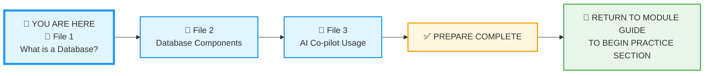
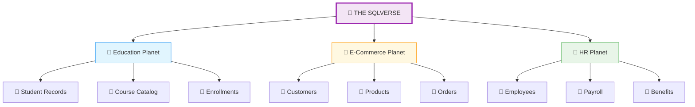
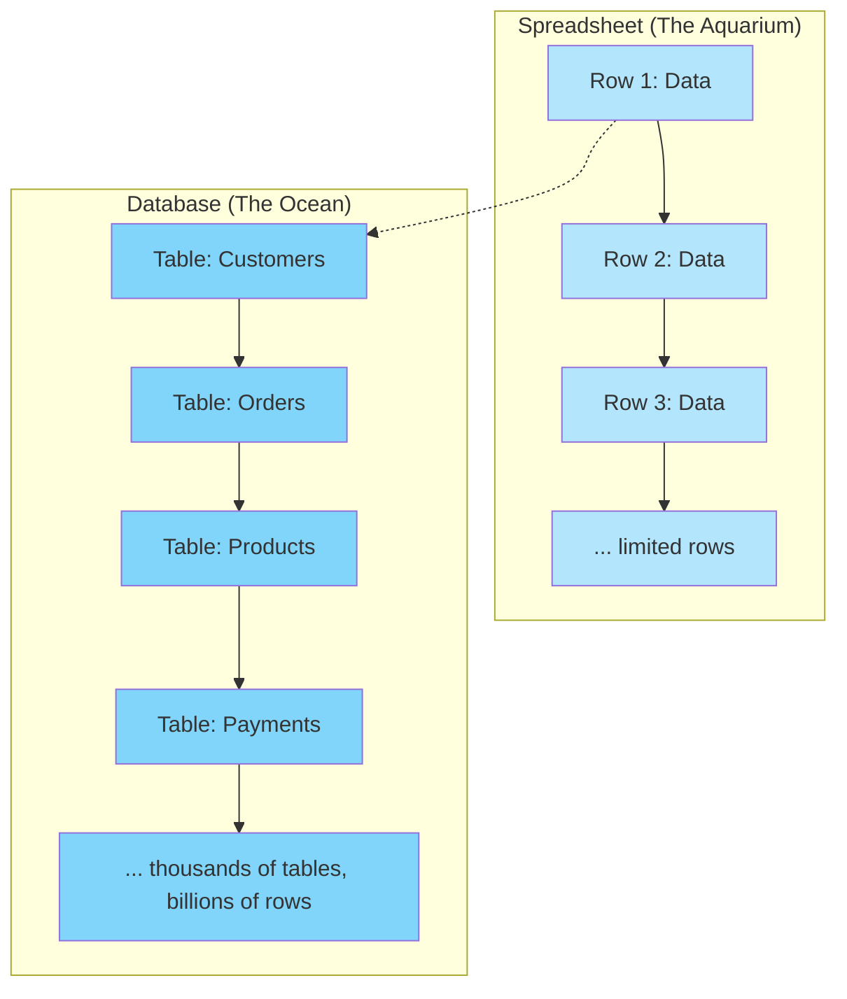
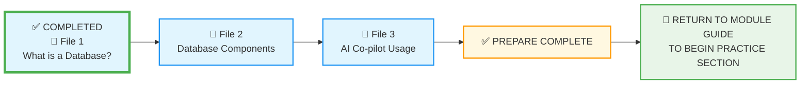

# 🗄️🤖 SQL & GenAI Course
**🎯 Quality Education for Anyone, Anywhere, Anytime — 💫 with Comfort, Convenience at no Cost**

## 📘 File 1: What is a Database?

### 📍 Your Current Stage – PREPARE Journey

You're in **Stage 1: PREPARE**, working through the three core concept files. After completing all three, you'll return to the Module Guide to begin the PRACTICE stage.

---

## 🔧 Enhanced Browser Office for PREPARE

**🚀 Kickstart: Any Computer, Any Browser, Anytime.**  
**🌍 Destination: Any country, Any city, Any Platform.**

| Tab | Purpose | Tools & Examples for This Module |
| :--- | :--- | :--- |
| **1: The Map** | Learn core concepts | • [What is a Database? (this file)](./1-what-is-a-database.md) • [Database Components (File 2)](./2-database-components.md) • [AI Co-pilot Usage (File 3)](./3-ai-copilot-usage.md) |
| **2: The Factory** | Visual exploration (not querying yet) | • Open **[`training_institution_sample.db`](../../../../../Resources/sample_databases/training_institution_sample.db)** – just LOOK at the tables in the left panel • Open **[`level1_estore_basic.db`](../../../../../Resources/sample_databases/level1_estore_basic.db)** – observe table names, column names |
| **3: The Consultant** | Conceptual Q&A only | • Ensure your AI is configured with the **[Student Mode Prompt](../../../../STUDENT_MODE_PROMPT_LEVEL1.md)** • Apply the **3-Question Rule**:   1. "What do I think this means?" (your intuition)   2. "What does the material say?" (check Tab 1)   3. "What does the Consultant explain?" (ask conceptually) • Try prompts like: "What's another analogy for a database?" or "Why can't Excel handle what Facebook handles?" ❌ **NO SQL – conceptual only** |
| **4: The Vault** | Concept notes & mental models | • Save concept notes to: `Learning/Level-1-beginner/Level1-1-ACQUIRE/Module1-Introduction-Database-AICo-pilot/1-sqlCommands/` • Draw your own mental models • Answer reflection questions |

---

### 🛠️ Module 1 Toolkit

🚀 Foundation First, AI Next, Projects Last.  
💎 Gemstone by Gemstone, Skill by Skill.

| | | | |
|---|---|---|---|
| **Browser Office** | 🔧 [Troubleshooting Common Issues](../../../../../Setup/STEP1_COMMISSION_BROWSER_OFFICE.md) | 🔄 [Browser Office Workflow](../../../../../Setup/STEP2_ESTABLISH_LEARNING_RITUAL.md) | ⌨️ [Tab Operations & Shortcuts](../../../../../Setup/STEP3_MASTER_TAB_OPERATIONS.md) |
| **ACQUIRE Section** | 🗄️ [Database Ecosystem](../../../../Guides/Section1-ACQUIRE/2_Database_Ecosystem.md) | 📚 [Knowledge Base (Vault)](../../../../Guides/Section1-ACQUIRE/3_Knowledge_Base.md) | 🧠 [Mindset Tuning](../../../../Guides/Section1-ACQUIRE/4_Mindset.md) |

---

## 🗄️ The Engine That Powers Every Application

**"Databases are the invisible engine that powers every digital experience in your life."**

Think of a **database** as the high-performance engine behind every application you use – storing, securing, and serving data at lightning speed.

### 📱 Databases in Your Daily Life

**From Your Perspective:**

| You Do This | What Happens Behind the Scenes |
|-------------|-------------------------------|
| Search contacts | Database finds names from thousands instantly |
| Order food online | Database checks inventory, processes payment |
| Watch Netflix | Database remembers what you watched, suggests more |
| Use GPS navigation | Database stores maps and finds fastest routes |

**From the App's Perspective:**

| Application | Database Superpower |
|-------------|---------------------|
| Phone Contacts | Instant search through thousands of contacts |
| Online Store | Real-time inventory + secure payment processing |
| Netflix Subscription | Reads frequently accessed data (personalized homepages, recommendations) *(In database circles, we call this **Caching** or **High Availability**.)* |
| Road Networks | Reads complex digital maps with road networks and traffic info |

---

## 🎮 Quick Thought Exercise

**Think about your morning routine:**
- ✅ Checked social media → Database stored your feed preferences
- ✅ Ordered coffee online → Database processed your payment  
- ✅ Checked bank balance → Database secured your financial data
- ✅ Sent messages → Database delivered them instantly

**Question:** How many databases did you interact with before breakfast? (Answer: At least 4!)

---

### 🌍 Real-World Database Power

| Everyday Application | What the Database Engine Powers |
|---------------------|--------------------------------|
| **Phone Contacts** | Instant search through thousands of contacts |
| **Online Store** | Real-time inventory + secure payment processing |
| **Social Media** | Personalized feeds for billions of users |
| **Banking App** | Secure transactions + instant balance updates |

---

## 📊 Database vs. Spreadsheet: What's the Difference?

A spreadsheet is a tool individuals use to store and analyze personal information. You can use a spreadsheet for your monthly budget and for tracking expenses. Managers in offices use spreadsheets to analyze sales data and project schedules. A spreadsheet is used by a **single individual** to analyze and track simple data.

A database is accessed by **thousands of people concurrently** – like banking applications, Amazon shopping, and credit card systems. A spreadsheet simply cannot handle the scale of data these applications store.

| Aspect | Spreadsheet | Database |
|--------|-------------|----------|
| **Best For** | Small datasets (under 10,000 rows), one person, simple calculations, quick analysis | Large datasets (thousands to millions), multiple users, complex relationships, security needs |
| **When to Use** | Your data fits in one file and one person uses it | You need real-time updates, security, backup, and concurrent access |
| **Simple Rule** | If it fits in one spreadsheet → use spreadsheet | If you need more → use database |

---

## 🔍 Myth vs. Reality

| Myth | Reality |
|------|---------|
| "Databases are only for big companies" | Your phone uses databases for contacts, messages, photos |
| "I need to be a programmer to use databases" | You'll learn enough SQL in weeks to be useful |
| "Databases are complicated and scary" | They're just organized digital filing cabinets |

---

## 🎯 Why Databases Matter: The Digital Foundation

### The Engine Behind Everything Digital
Every modern application relies on databases as its **beating heart**:

- 🏦 **Your Bank** – Processes thousands of secure transactions per second
- 🛒 **Amazon** – Handles millions of simultaneous orders during peak sales  
- 📱 **Instagram** – Serves personalized content to billions in real-time
- 🎵 **Spotify** – Recommends music based on your listening history

### Enterprise-Grade Engine Capabilities

**⚡ High-Performance Engine**
- Process thousands of operations per second
- Retrieve specific data from millions of records instantly
- Handle traffic spikes (Black Friday, product launches) without failing

**🔒 Secure & Reliable Foundation**  
- Encrypt sensitive data (passwords, financial information)
- Control precise access permissions
- Ensure zero data loss with automatic backups
- Maintain perfect accuracy with transaction protection

**📈 Scalable Growth Engine**
- Scale from startup to enterprise seamlessly
- Serve global users 24/7 across time zones
- Handle exponential growth without system redesign

---

## 💡 The Big Picture: More Than Storage

A database isn't just a storage closet—it's the **high-performance engine room** that powers every digital experience. While you see the beautiful application interface, the database engine is working tirelessly to:

- Remember your preferences instantly
- Keep your data fortress-secure
- Deliver lightning-fast results
- Serve millions of users simultaneously

**Industry Truth:** Companies invest millions in database systems because when the database engine stops, the business stops. It's that critical.

---

## ⚡ Key Insight: The Mission-Critical Engine

While you see the beautiful application interface, the database is working tirelessly behind the scenes to:
- Remember your preferences
- Keep your data safe
- Deliver instant results
- Handle millions of users simultaneously

---

### 🎓 Remember This:
> **Database = The Mission-Critical Backbone**
> 
> It's not just storage—it's the secure, high-performance engine that powers every digital service you rely on daily. Your data's security, application speed, and business scalability all depend on it.

---

## 📊 Data vs. Information: What's the Difference?

Understanding the distinction between **data** and **information** is key to thinking like a data professional.

- **Data** are raw, unprocessed facts – like individual numbers, words, or measurements. On their own, they have little meaning.
- **Information** is data that has been given context, structure, or meaning – turning it into something useful for decision‑making.

**A Simple Analogy:**

> Total Expenditure for this month is: **$2500** → Does not mean anything by itself. It's just a number – raw data.
> 
> Total Expenditure for the previous month is: **$2100** → Now we have context. This month we spent **$400 more** than last month. That's **information** – and it tells us we may need to cut unwanted expenses.

> **💡 In the ACCELERATE Section**, you'll see how AI acts as the translator between your natural language and the database's engine – turning your questions into powerful insights even faster.

**The Designer's Insight:**  
Most people stop at Information. This course is designed to take you to **Knowledge**—where you don't just see the spend increase of $400, but you know exactly which SQL query found it and which AI prompt explained why it happened.

The first number alone is just data. The comparison gives it meaning and makes it actionable. And with the skills you'll gain, you'll be able to dig deeper and understand the *why* behind the numbers.

**Real-World Examples:**

| Data (Raw) | Information (Processed) |
|------------|-------------------------|
| A list of temperatures: 72°, 68°, 75° | The average temperature for the week: 71.7° |
| Customer names and purchase amounts | "Top 10 customers by spending" report |
| Log of website visits: timestamp, page, IP | "Most visited pages between 2‑4 PM" insight |
| Database of student grades | "Students at risk of failing" alert |

**Why It Matters for Databases:**  
A database stores **data**, but the real value comes when you query it to produce **information** – insights that drive decisions. The SQL you'll learn transforms raw data into meaningful information.

**Think about your own life:**  
- Your bank has data: every transaction amount, date, location.  
- When you check your monthly spending summary, you're seeing **information** derived from that data.  
- The summary helps you decide: "I need to spend less on dining out."

---

## 💎 DESIGNER'S PERIGON

### *The Visionary's Lens on Data*

 Welcome to the **SQLVerse** – where every domain is a planet and every database is a world waiting to be explored.

 **What's a "domain"?** Think of it as a category of human activity – Education, Healthcare, Finance, Retail. Each domain has its own unique data challenges, but the laws of the SQLVerse (the SQL you're learning) work the same way across all of them. You will begin learning the fundamental laws that govern all data from Module2.

Today, you're on **Education Planet**. Soon, you'll visit E-Commerce, HR, and beyond.

---

**A spreadsheet** is like an aquarium you have at home – you control it, you feed it, you maintain it. One person, one tank, simple life.

**A database** is an ocean – vast, dynamic, with its own ecosystem, supporting countless forms of life (and data) simultaneously. Thousands of people swim in these waters every second.

You're not just learning to manage an aquarium. You're learning to navigate the ocean.

### 🌊 Visualizing the Ocean vs. the Aquarium

*On the left, a simple, flat aquarium. On the right, an interconnected ocean ecosystem.*

**The Artisan's Truth:**

> *"A spreadsheet is a tool. A database is a world. Today, you've learned to see the ocean. In the coming modules, you'll learn to sail it."*

---

## ✅ Progress Check

After reading this, can you:

- [ ] Name 3 apps that use databases
- [ ] Explain "database" in one simple sentence  
- [ ] Describe why databases matter for security
- [ ] Differentiate between spreadsheet and database use cases
- [ ] Explain the difference between data and information with an example
- [ ] Articulate the "aquarium vs. ocean" distinction
- [ ] Define what caching/high availability means in database terms

**If yes → You're ready for the next lesson!**

---

## 🧭 Prepare Navigation

| Previous Step | Next Step |
|:---:|:---:|
| [← Back to Module Guide](../MODULE1_GUIDE.md) | [Continue to File 2: Database Components →](./2-database-components.md) |

---

*Part of our mission for 🎯 Quality Education for Anyone, Anywhere, Anytime — 💫 with Comfort, Convenience at no Cost.*

**Level 1 | Module 1 | File 1: What is a Database? | Next: [Database Components](./2-database-components.md)**

