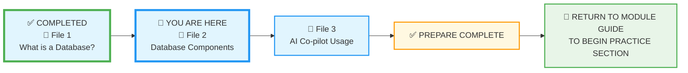

# 🗄️🤖 SQL & GenAI Course
**🎯 Quality Education for Anyone, Anywhere, Anytime — 💫 with Comfort, Convenience at no Cost**

## 📘 File 2: Database Components – What's Under the Hood

### 📍 Your Current Stage – PREPARE Journey



You're in **Stage 1: PREPARE**, working through the three core concept files. You've completed File 1 and are now on File 2. After File 3, you'll return to the Module Guide to begin the PRACTICE stage.

---

## 🔧 Enhanced Browser Office for PREPARE

**🚀 Kickstart: Any Computer, Any Browser, Anytime.**  
**🌍 Destination: Any country, Any city, Any Platform.**

| Tab | Purpose | Tools & Examples for This Module |
| :--- | :--- | :--- |
| **1: The Map** | Learn core concepts | • [What is a Database? (File 1)](./1-what-is-a-database.md)<br>• [Database Components (this file)](./2-database-components.md)<br>• [AI Co-pilot Usage (File 3)](./3-ai-copilot-usage.md) |
| **2: The Factory** | Visual exploration (not querying yet) | • Open **[`training_institution_sample.db`](../../../../../Resources/sample_databases/training_institution_sample.db)** – just LOOK at the tables in the left panel<br>• Open **[`level1_estore_basic.db`](../../../../../Resources/sample_databases/level1_estore_basic.db)** – observe table names, column names |
| **3: The Consultant** | Conceptual Q&A only | • Ensure your AI is configured with the **[Student Mode Prompt](../../../../STUDENT_MODE_PROMPT_LEVEL1.md)**<br>• Apply the **3-Question Rule**:<br>  1. "What do I think this means?" (your intuition)<br>  2. "What does the material say?" (check Tab 1)<br>  3. "What does the Consultant explain?" (ask conceptually)<br>• Try prompts like: "What's the difference between a table, row, and column?"<br>❌ **NO SQL – conceptual only** |
| **4: The Vault** | Concept notes & mental models | • Save concept notes to: `Learning/Level-1-beginner/Level1-1-ACQUIRE/Module1-Introduction-Database-AICo-pilot/1-sqlCommands/`<br>• Draw your own mental models<br>• Answer reflection questions |

---

### 🛠️ Module 1 Toolkit

🚀 Foundation First, AI Next, Projects Last.  
💎 Gemstone by Gemstone, Skill by Skill.

| | | | |
|---|---|---|---|
| **Browser Office** | 🔧 [Troubleshooting Common Issues](../../../../../Setup/STEP1_COMMISSION_BROWSER_OFFICE.md) | 🔄 [Browser Office Workflow](../../../../../Setup/STEP2_ESTABLISH_LEARNING_RITUAL.md) | ⌨️ [Tab Operations & Shortcuts](../../../../../Setup/STEP3_MASTER_TAB_OPERATIONS.md) |
| **ACQUIRE Section** | 🗄️ [Database Ecosystem](../../../../Guides/Section1-ACQUIRE/2_Database_Ecosystem.md) | 📚 [Knowledge Base (Vault)](../../../../Guides/Section1-ACQUIRE/3_Knowledge_Base.md) | 🧠 [Mindset Tuning](../../../../Guides/Section1-ACQUIRE/4_Mindset.md) |

---

## ⚙️ Peeking Inside the Database Engine

Now that we know a database is the **engine** powering applications, let's look at what makes this engine run. If you've ever used **Excel or Google Sheets**, you already understand the basic concepts!

### The Spreadsheet-to-Database Translation

| Spreadsheet Concept | Database Equivalent | Purpose |
|---------------------|---------------------|---------|
| **Workbook** | **Database** | The entire file/container |
| **Sheet/Tab** | **Table** | Stores one type of data |
| **Column Header** | **Column/Field** | Defines what information goes here |
| **Data Row** | **Row/Record** | One complete set of information |
| **File Structure** | **Schema** | The overall design and layout |

---

## 🎨 Visualizing the Structure

```text
DATABASE "Online Store"
├── TABLE "customers"           (Like "Customers" spreadsheet tab)
│   ├── COLUMN "customer_id"    (Like column A: Customer ID)
│   ├── COLUMN "name"          (Like column B: Customer Name)
│   ├── COLUMN "email"         (Like column C: Email)
│   └── COLUMN "join_date"     (Like column D: Join Date)
│       ├── ROW 1: John Smith, john@email.com, 2024-01-15
│       ├── ROW 2: Jane Doe, jane@email.com, 2024-01-16
│       └── ROW 3: ... (and millions more!)
```

---

## 📊 Databases vs. Spreadsheets: A Clear Comparison

### Spreadsheet
A spreadsheet organizes data in rows and columns. Data is stored in **cells** at the intersection of rows and columns.

**Use Cases:** Small Businesses and Individuals

### Database
A database is a structured data collection managed by a **Database Management System (DBMS)** designed to handle large amounts of data efficiently.

**Use Cases:** Large Organizations and Complex Applications

**Key Distinction:** Databases separate data from presentation, whereas spreadsheets combine them.

---

### Key Comparison

| Aspect | Spreadsheet | Database |
|--------|-------------|----------|
| **Structure** | Uses cells in rows/columns for flexible, ad‑hoc data entry | Uses rigid, predefined tables with set relationships (Relational Databases) |
| **Data Volume** | Struggles with large data, leading to slow performance | Processes millions of rows within seconds |
| **Data Integrity** | Prone to human error; formulas break due to errors | Offers robust constraints and validation – like **guardrails** that prevent you from entering text in a numeric field |
| **Collaboration** | Cannot be shared between multiple users simultaneously | Supports simultaneous multi‑user access and secure, role‑based permissions |

---

## 🌊 Database vs Spreadsheet: Ocean vs Aquarium

**Think of it this way:**
- 📊 **A Spreadsheet** = An Aquarium at home
- 🗄️ **A Database** = The entire ocean

### The Scale Difference Will Blow Your Mind

| Capability | Spreadsheet | Database |
|------------|-------------|----------|
| **Maximum Rows** | ~1 million rows | **Trillions of rows** (yes, with a T!) |
| **Performance** | Slows with 100,000+ rows | **Lightning fast** with billions of rows |
| **Concurrent Users** | 1-2 users editing | **Millions of users** simultaneously |
| **Data Integrity** | Manual validation | **Automatic enforcement** of rules |
| **Real-world Use** | Personal budgets | **Amazon, Facebook, Banks** |

> **💡 Did You Know?** Google Search handles over **8.5 billion searches per day** – every single one of them hitting multiple databases in milliseconds. That's the power of database scale.

---

## 📊 Understanding Tables: Your Data Sheets

A **table** is exactly like a spreadsheet tab – but imagine having **thousands of these tabs** that all work together seamlessly.

**Spreadsheet Reality:**
- You might have 10-20 tabs max before it becomes unmanageable
- Each tab is pretty much on its own
- Cross-referencing between tabs is manual and error-prone

**Database Power:**
- Thousands of tables working together automatically
- Instant relationships and connections between all tables
- **Facebook example:** Separate tables for users, posts, comments, likes, photos – all connected in real-time

---

## 🗂️ Columns: Your Column Headers

**Columns** define exactly what information you can store, just like column headers in a spreadsheet.

### The Scale Comparison

**Spreadsheet Limitations:**
- "Oops, I put text in the date column again!"
- "Why is this calculation returning #VALUE?"
- Manual cleanup required constantly

**Database Enforcement:**
- **Billions of rows** and every value follows the rules
- Automatic type checking on every insert/update
- Zero data corruption even at massive scale

Think of database constraints as **guardrails** on a mountain road. They don't stop you from driving, but they prevent you from accidentally plunging off a cliff of bad data. In a spreadsheet, there are no guardrails – one wrong keystroke and your formulas break, your analysis crumbles. Databases protect you from yourself.

---

## 📝 Rows: Your Data Rows – But at Galactic Scale

### Let's Talk Numbers

**Spreadsheet Maximum:**
- Excel: ~1,048,576 rows
- Google Sheets: ~5 million cells total
- **Reality:** Becomes unusably slow at 100,000+ rows

**Database Scale:**
- **Facebook:** 2+ billion active users (rows in users table)
- **Amazon:** Billions of products and orders
- **Banks:** Trillions of transactions processed
- **And it's all instant**

---

### 🛂 The Power of Primary Keys

Every row in a database table has a unique identifier called a **Primary Key**. Think of it as a **passport** for that specific record. Just as your passport identifies you anywhere in the world, a primary key (like `customer_id` or `order_id`) lets the database instantly find and connect that exact record across thousands of tables.

When you log into Amazon, your `customer_id` is your passport. It tells the database: "This is me – show my cart, my order history, my saved addresses." Without this passport, the ocean of data would be a chaotic mess. With it, your data travels safely and finds you wherever you are.

---

## 🏗️ Schema: Your Workbook's Master Plan

The **schema** is what makes the "ocean" possible:

**Spreadsheet Chaos:**
- Different formats across tabs
- Inconsistent column names
- Broken formulas when adding data
- "Who changed the structure?!"

**Database Order:**
- **Standardized structure** across thousands of tables
- **Automatic relationships** that never break
- **Version control** and change management
- **Enterprise-grade reliability**

---

## 🔄 From Spreadsheet Thinking to Database Power

**The Mental Shift:**
- You: "I need to analyze 50,000 rows of sales data"
- Spreadsheet: "This will take 10 minutes to open and will crash twice"
- Database: "Here are your results in 0.2 seconds"

**Real-World Examples:**
- 🛒 **Amazon Prime Day:** Millions of simultaneous orders processed instantly
- 📱 **WhatsApp:** Billions of messages delivered in real-time  
- 💳 **Visa:** Processes 65,000 transactions **per second**
- ✈️ **Airlines:** Manages global booking systems across thousands of flights

---

## 🗃️ Quick Note: Different Database Types

**Relational Databases (What we're learning):**
- Organize data in tables with rows/columns
- Examples: PostgreSQL, MySQL, SQL Server
- Used by: Banks, e-commerce, most business apps

**Other types you might hear about:**
- NoSQL databases: Handle unstructured data (social media posts, sensor data)
- Graph databases: Model relationships (social networks, recommendations)

---

## ⚡ Key Insight: Beyond Human Scale

Spreadsheets work with data **you can see and touch** – maybe thousands of rows. Databases work with data **beyond human comprehension** – millions, billions, trillions of records that no human could ever manually manage.

**This is why every major company, app, and service you use runs on databases – spreadsheets simply can't handle the scale of modern digital life.**

---

### 🎓 Remember This:
> **If spreadsheets are a single drop of water...**
> **Databases are the entire ocean.**
> 
> You're not just learning a new tool – you're learning to work with systems that power global civilization. Every click, every purchase, every message you send flows through databases.

---

## 🧠 Quick Understanding Check

**Match the concepts:**
1. Database → A) Like a single spreadsheet tab
2. Table → B) Like an entire Excel workbook  
3. Column → C) Like a row of data in Excel
4. Row → D) Like a column header in Excel

**Answer:** 1-B, 2-A, 3-D, 4-C

**True or False:**
- Databases can handle millions of simultaneous users → **True**
- Spreadsheets are better for large-scale applications → **False**
- Every row in a table represents one complete record → **True**

---

## ✅ Progress Check

After reading this, can you:

- [ ] Explain what a table is and how it differs from a spreadsheet sheet
- [ ] Describe the role of rows and columns in a table
- [ ] Explain why database constraints are like guardrails
- [ ] Define what a primary key is and why it matters (like a passport)
- [ ] Define what a schema is and why it matters
- [ ] Give an example of a real‑world system that would need multiple related tables
- [ ] Articulate why databases can handle billions of rows while spreadsheets struggle

---

## 🚀 Coming Up: Your First Database

**In Module 2, you'll:**
- ✅ Create your own table (like making a new spreadsheet tab)
- ✅ Add real data (like typing in rows)
- ✅ Query that data (like filtering in Excel)
- ✅ All in your browser, no installation needed!

**The best part?** You'll do in minutes what used to take teams of engineers months.

---

## 💎 DESIGNER'S PERIGON


<div style="border: 3px solid #9c27b0; border-radius: 10px; padding: 20px; margin: 25px 0; background: linear-gradient(135deg, #f3e5f5 0%, #e1bee7 100%);">

### *The Visionary's Lens on Structure*

Welcome back to the **SQLVerse** – where every domain is a planet and every database is a world waiting to be explored.  You're still on **Education Planet**, but now you're venturing deeper – from seeing the world to understanding its geography. Today on **Education Planet**, you're discovering the anatomy of a database world: tables, rows, columns, and the invisible threads that connect them all.

**Most people see a table as just a grid of data.** But look closer – a table is a **contract**. Every column defines a promise: "This field will always contain a customer ID," "This field will always contain a valid email." That promise is enforced by the database, automatically, billions of times over. The Amazon database assures me that my Email ID field will be accurate and secure whenever I shop on Amazon for weeks, months, or years – unless I choose to change it.

**A schema isn't just a blueprint – it's a constitution.** It governs how data lives, relates, and is protected. When you design a schema, you're not just organizing information; you're architecting the rules that will safeguard your company's most valuable asset – its data – for years to come. This ensures that my Shipping address I store in Amazon database will reside there permanently unless I move to another home and modify it.

### 🏛️ The Art of Seeing Relationships

**Let us look at how tables in a database work in perfect unison to give a smooth and seamless shopping experience in Amazon.**

The real magic of databases isn't in the tables themselves – it's in how they connect. A `customer_id` in an `orders` table isn't just a number; it's a thread linking a person to their purchase history, their preferences, their lifetime value. That `customer_id` is a **passport** that lets every related table identify you instantly. Learning to see these threads is what transforms a data handler into a data architect.

**What does this mean for my Amazon Shopping? Let us break it down:**

1. The items I add to my Shopping Cart are automatically mapped to my Customer ID, billed and delivered safely.
2. When I choose the Grocery page in Amazon, the items I buy every month are immediately listed and recommended.
3. When I choose to make the payment, my preferred payment option is automatically selected.
4. The moment I pay and place the order, the delivery details are emailed to me immediately and updated in my mobile app.
5. **A Critical Scenario:** Imagine it's the Christmas season – there's an unexpected rush of thousands of customers, and a serious technical fault halts my shopping just as I'm about to complete payment. I don't know if the payment went through or if my account has been debited. My order details need to go into multiple tables: the `Payments` table, the `Orders` table, etc. What if my details are updated in the `Payments` table but *not* in the `Orders` table? That would mean I've paid for my goods, but since they're not recorded in `Orders`, they won't be delivered.

**No worries  GOOD NEWS.** The database is designed to handle this scenario by default. Amazon will process my entire order as a **Transaction**. In database terminology, a transaction means **either all related tables are updated, or none of them are updated**. This guarantees that I will never be charged for items that aren't going to be delivered.

We'll discuss **Transactions** and **Referential Integrity** in the Advanced level. For now, rest assured that the database is 100% safe and secure – it has guardrails built into every layer.

**The Artisan's Truth:**

> *"Spreadsheets show you the cells. Databases show you the connections."*

> *"You're not just learning to build tables – you're learning to weave the fabric of the digital world, where every row has a passport and every road has guardrails."*

> *"On Education Planet, you're learning the geography. Soon, on E-Commerce and HR Planets, you'll navigate these connections yourself."*

</div>


## 🧭 Prepare Navigation


| Previous Step | Next Step |
|:---:|:---:|
| [← Back to File 1: What is a Database?](./1-what-is-a-database.md) | [Continue to File 3: AI Co-pilot Usage →](./3-ai-copilot-usage.md) |

---

*Part of our mission for 🎯 Quality Education for Anyone, Anywhere, Anytime — 💫 with Comfort, Convenience at no Cost.*

**Level 1 | Module 1 | File 2: Database Components | Next: [AI Co-pilot Usage](./3-ai-copilot-usage.md)**


