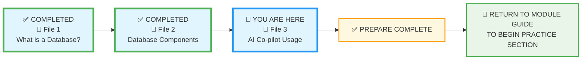
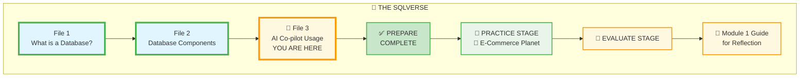

# 🗄️🤖 SQL & GenAI Course
**🎯 Quality Education for Anyone, Anywhere, Anytime — 💫 with Comfort, Convenience at no Cost**

## 📘 File 3: AI Co-pilot – Your SQL Learning Partner

### 📍 Your Current Stage – PREPARE Journey



You're in **Stage 1: PREPARE**, and this is the final concept file. You've completed Files 1 and 2. After this, you'll return to the Module Guide to begin the PRACTICE stage.

---
### 🌌 The SQLVerse Journey – Your Destination


You're about to complete your journey through Education Planet. Here's the path you've walked:



**This is where you're headed.** The path ahead is clear – complete this file, then:

1. 🛒 **PRACTICE STAGE on E-Commerce Planet** – Apply your knowledge with hands-on exercises
2. 📝 **EVALUATE STAGE** – Test your understanding with the module quiz
3. 📖 **Return to Module 1 Guide** – Reflect on your journey before venturing to Module2 🚀.

---

## 🔧 Enhanced Browser Office for PREPARE

**🚀 Kickstart: Any Computer, Any Browser, Anytime.**  
**🌍 Destination: Any country, Any city, Any Platform.**

| Tab | Purpose | Tools & Examples for This Module |
| :--- | :--- | :--- |
| **1: The Map** | Learn core concepts | • [What is a Database? (File 1)](./1-what-is-a-database.md)<br>• [Database Components (File 2)](./2-database-components.md)<br>• [AI Co-pilot Usage (this file)](./3-ai-copilot-usage.md) |
| **2: The Factory** | Visual exploration (not querying yet) | • Open **[`training_institution_sample.db`](../../../../Resources/sample_databases/training_institution_sample.db)** – just LOOK at the tables in the left panel<br>• Open **[`level1_estore_basic.db`](../../../../Resources/sample_databases/level1_estore_basic.db)** – observe table names, column names |
| **3: The Consultant** | Conceptual Q&A only | • Ensure your AI is configured with the **[Student Mode Prompt](../../../STUDENT_MODE_PROMPT_LEVEL1.md)**<br>• Apply the **3-Question Rule**:<br>  1. "What do I think this means?" (your intuition)<br>  2. "What does the material say?" (check Tab 1)<br>  3. "What does the Consultant explain?" (ask conceptually)<br>• Try prompts like: "How does the AI's role change as we progress through the modules?"<br>❌ **NO SQL – conceptual only** |
| **4: The Vault** | Concept notes & mental models | • Save your AI conversations and insights to: `Learning/Level-1-beginner/Level1-1-ACQUIRE/Module1-Introduction-Database-AICo-pilot/1-sqlCommands/`<br>• Add your own prompts to `prompts.md` |

---

### 🛠️ Module 1 Toolkit

🚀 Foundation First, AI Next, Projects Last.  
💎 Gemstone by Gemstone, Skill by Skill.

| | | | |
|---|---|---|---|
| **Browser Office** | 🔧 [Troubleshooting Common Issues](../../../../Setup/STEP1_COMMISSION_BROWSER_OFFICE.md) | 🔄 [Browser Office Workflow](../../../../Setup/STEP2_ESTABLISH_LEARNING_RITUAL.md) | ⌨️ [Tab Operations & Shortcuts](../../../../Setup/STEP3_MASTER_TAB_OPERATIONS.md) |
| **ACQUIRE Section** | 🗄️ [Database Ecosystem](../../../Guides/Section1-ACQUIRE/2_Database_Ecosystem.md) | 📚 [Knowledge Base (Vault)](../../../Guides/Section1-ACQUIRE/3_Knowledge_Base.md) | 🧠 [Mindset Tuning](../../../Guides/Section1-ACQUIRE/4_Mindset.md) |

---

## 🤖 From Assistant to Learning Multiplier

Now that you understand database fundamentals, let's talk about how to use AI co-pilots as **force multipliers** for your SQL learning journey. **Before we dive into SQL syntax, let's master database concepts.** This file shows how to use AI co-pilots to build strong foundational understanding.

### What AI Co-pilots Do Best

| Learning Task | How AI Helps |
|---------------|-------------|
| **Concept Explanation** | "Explain database tables using a library analogy" |
| **Clarification** | "What's the difference between a database and a table?" |
| **Real-world Context** | "How do companies like Amazon use databases?" |
| **Troubleshooting** | "Why would a database be better than spreadsheets for this?" |

---

## 🚀 Quick Start: Your First AI Session

**Try this right now in your AI tool:**

1. **Copy this prompt:** "Explain what a database is to someone who's never heard of one. Use a simple analogy and include 2 real-world examples."
2. **Paste into** ChatGPT/Claude/Gemini
3. **Read the response**
4. **Ask a follow-up:** "Can you explain that using a different analogy?"

**Congratulations!** You've just had your first AI-assisted learning session.

> **💡 Did You Know?** Every time you interact with an AI like ChatGPT, your request travels through massive databases that store the model's knowledge. Behind the scenes, systems like these process billions of words per day – each one relying on database technology similar to what you're learning. You're not just learning about databases; you're talking to one!

---

## ⚠️ What NOT to Do with AI

### The Wrong Way vs. The Artisan Way

| ❌ Poor Prompt (Crutch) | ✅ Artisan Prompt (Thinking Partner) |
|-------------------------|--------------------------------------|
| "Write SQL to find all customers in New York." | "I want to understand how to filter data in SQL. What clause should I use, and how does it work conceptually? Can you give me an analogy?" |
| "Fix my query: SELECT * FROM users WHERE name = 'John';" | "My query returns unexpected results. Here's what I'm trying to do... What concept am I missing?" |
| "Is this query correct?" | "How can I test if my logic is sound? What edge cases should I consider?" |

### Quick Rules

| Don't | Do Instead |
|-------|------------|
| Just copy-paste definitions without understanding | Ask for explanations in your own words |
| Accept answers without examples | Request "Can you give me a real-world example?" |
| Move on if you're still confused | Ask "Can you explain that differently?" or "What's a simpler way to say that?" |

---

## 🚀 AI Learning Workflow for Concepts

### The Right Way to Learn with AI

1. **Read the Material** → Study the database concepts first
2. **Formulate Questions** → What didn't you fully understand?
3. **Ask AI for Clarification** → Use the questions above as templates
4. **Connect to Real World** → Ask for practical examples
5. **Test Your Understanding** → Explain it back in your own words

### Example Learning Session

**After reading about tables:**
**You to AI:** "I understand that tables are like spreadsheet tabs, but why would a company need 50 different tables instead of just 5 big ones?"

**After reading about scale:**
**You to AI:** "When you say databases handle 'trillions of rows,' can you give me a concrete example of what actually contains trillions of rows in the real world?"

---

## 💡 Pro Tips for Conceptual Learning

### Build Deep Understanding:
- 🎯 **Ask for multiple analogies** – "Explain tables using both library and restaurant analogies"
- 🔄 **Request real-world examples** – "Show me how this concept applies to companies I know"
- 📚 **Connect to personal experience** – "How does this relate to apps I use daily?"
- 🗣️ **Ask for common misconceptions** – "What do beginners usually get wrong about databases?"

### Questions to Test Your Understanding:
```
"Can you give me a quick quiz about databases vs spreadsheets to test if I really get the differences?"
```

```
"I'm going to explain databases to a friend. Can you check if this explanation is accurate: [your explanation]"
```

---

## 🌟 Your AI Learning Charter

### As a SQL Learner, I Will:
✅ **Use AI to deepen conceptual understanding**  
✅ **Ask 'why' and 'how' questions**, not just 'what'  
✅ **Connect concepts to real-world applications**  
✅ **Verify my understanding** by explaining back  
✅ **Build mental models** that will help with actual SQL later  

### My AI Prompts Will Focus On:
- "Explain this concept using different analogies"
- "How is this used in real companies like Amazon or Netflix?"
- "What are the practical benefits of this approach?"
- "How does this scale from small to massive applications?"
- "What problems does this solve that alternatives don't?"

---

## ⚡ Key Insight: Foundation First

You're building the **mental architecture** for understanding databases. Before you write a single line of SQL, you need to understand why databases exist, how they're structured, and what problems they solve. This foundation will make the actual SQL commands much easier to learn later.

**The best database professionals aren't just people who know SQL syntax – they're people who understand data architecture and can design effective systems.**

---

### 🎯 Remember This:
> **Concepts Before Code**
> 
> Spend time now understanding the 'why' behind databases. When you eventually learn SQL, you'll not only know what commands to use, but more importantly, you'll understand why you're using them and what problems they solve.

---

## 🎯 Smart Questions About Database Concepts

### Questions About Databases in General

**For Understanding Scale:**
```
"Can you give me real examples of companies that use databases with billions of records, and what they store in them?"
```

**For Career Context:**
```
"What kinds of job roles work with databases daily, and what do they actually do?"
```

**For Technical Insight:**
```
"When people say databases are 'high-performance engines,' what makes them so much faster than spreadsheets with large data?"
```

### Questions About Tables

**For Conceptual Understanding:**
```
"If a database is like a digital filing cabinet, what would be some example 'folders' (tables) for a university system?"
```

**For Real-world Application:**
```
"In a social media app like Instagram, what different tables might they need and why can't they use one big table for everything?"
```

**For Practical Thinking:**
```
"If I were building a small coffee shop system, what are the essential tables I would need and what would each one store?"
```

### Questions About Columns & Rows

**For Column Understanding:**
```
"Why is it important that each column has a specific data type? What problems could happen if this wasn't enforced?"
```

**For Row Understanding:**
```
"In a hospital patient table, what would one complete row represent, and what columns might it have?"
```

**For Data Organization:**
```
"Why can't we just put all information in one big table with hundreds of columns instead of having multiple related tables?"
```

### Questions About the Spreadsheet Comparison

**For Scale Understanding:**
```
"You mentioned databases handle trillions of rows while spreadsheets struggle with millions. What technical magic makes this possible?"
```

**For Practical Differences:**
```
"If spreadsheets and databases both use tables, why can't Excel handle what Facebook's databases handle?"
```

**For Business Context:**
```
"What are the specific moments when a growing company realizes they need to switch from spreadsheets to a real database?"
```

---

## 💎 DESIGNER'S PERIGON

<div style="border: 3px solid #9c27b0; border-radius: 10px; padding: 20px; margin: 25px 0; background: linear-gradient(135deg, #f3e5f5 0%, #e1bee7 100%);">

### *The Visionary's Lens: AI as Your Socratic Tutor*

Welcome back to the **SQLVerse** – where every domain is a planet and every database is a world waiting to be explored. You've completed your tour of **Education Planet**, learning what databases are and how they're built. Now, before you venture to new worlds, you're mastering the most important tool of all: how to learn with your AI guide, The Consultant.

Most people treat AI like a search engine – type a question, get an answer, move on. But you're learning to do something far more powerful: **you're learning to think *with* AI.**

The ancient Greek philosopher Socrates never gave his students answers. He asked questions – sharp, probing questions that forced them to examine their own assumptions and arrive at deeper truths. That's exactly how you should use your AI co-pilot.

| Typical Student | Artisan Learner |
|----------------|-----------------|
| "Write SQL for this problem" | "What concepts do I need to understand to solve this?" |
| "Fix my query" | "Why is my logic flawed? What am I missing?" |
| "Is this correct?" | "How can I verify my understanding?" |

**The Artisan's Truth:**


> **We have learned to use AI as a thinking partner, not a search engine. That is the essential difference between Google and Google Gemini.**
>
> Google gives you answers. Gemini (and tools like it) can give you understanding – if you know how to ask.

You've already begun. In File 1, you asked "What's another analogy for a database?" In File 2, you wondered "How do tables relate?" These questions are the seeds of mastery. Keep questioning. Keep probing. Let AI be your mirror, not your replacement.

> *"On Education Planet, you learned the laws. Soon, on E-Commerce and HR Planets, you'll apply them. And through it all, your Consultant will be there – not to give you answers, but to help you find them yourself."*

</div>

---

### 🌌 The SQLVerse Journey – Complete

You've traveled across Education Planet, mastering the foundational concepts. Look how far you've come:

| Stage | What You Mastered |
|-------|-------------------|
| **File 1** | What a database is – the engine powering digital experiences |
| **File 2** | Database anatomy – tables, rows, columns, schemas, keys |
| **File 3** | How to learn with AI – your Consultant and thinking partner |

### ✨ Your Journey at a Glance

| Phase | What You've Built |
|-------|-------------------|
| **🏗️ The Engine** | You know *what* a database is |
| **🧩 The Anatomy** | You know *how* databases are built |
| **🗣️ The Command** | You know *how to learn* with AI |

### 🎯 What Sets This Course Apart

| Other Courses Teach You... | This Course Taught You... |
|---------------------------|---------------------------|
| SQL syntax first | **Concepts first** – build mental models before code |
| AI as a code generator | **AI as a thinking partner** – Socratic dialogue |
| Memorization | **Understanding** – analogies that stick |
| Isolated skills | **Integrated foundation** – what, how, and how to learn |

### 🧠 The Artisan's Truth

> *"A single concept is a seed. Multiple concepts, properly connected, become a garden. You've just planted the seeds of database mastery – and learned how to tend them with your AI partner."*

> *"The SQLVerse is vast, but you now carry its map. Education Planet is complete. E-Commerce, HR, and Fintech await. Go forth and explore."*

---

## 🧪 Mini-Challenge: Your First Artisan Prompts

Now it's your turn. Open your AI co-pilot (Tab 3) and try these **artisan‑style** conversations:

1. **Start with this prompt:**  
   *"Explain the concept of a database schema using a library analogy. Then give me a second analogy using something else, like a city or a kitchen."*

2. **After the response, ask a follow‑up:**  
   *"What are the consequences of not having a well‑defined schema? Can you give me a real‑world example of what could go wrong?"*

3. **Now, test your own analogy:**  
   *"I think a database is like a refrigerator where tables are shelves. Does this analogy hold up? What are the flaws in it?"*

   > **Why this matters:** Asking the AI to critique your analogy is the ultimate test of understanding. If your mental model is solid, the AI will confirm it. If there are gaps, the AI will help you see them – without judgment, just guidance.

4. **Save the conversation in your Vault:**  
   In **Tab 4**, navigate to your module folder and create a new file `ai-schema-discussion.md`. Paste the entire conversation.

**Why this matters:** You've just practiced the Artisan way – using AI to deepen understanding, not just get answers. This file will become part of your learning portfolio.

---

## 🎉 CONCLUSION OF PREPARE SECTION

Congratulations! You've completed the **PREPARE** stage of Module 1. Let's take a moment to appreciate what you've built:

| File | What You've Learned | The Big Picture |
|------|---------------------|-----------------|
| **📘 File 1: What is a Database?** | You learned **what** a database is – the engine powering every digital experience. You can now explain databases, differentiate them from spreadsheets, and see them in the world around you. | **The Engine** – You know what powers the digital world. |
| **📘 File 2: Database Components** | You learned **how** databases are built – tables, rows, columns, schemas, primary keys, and the guardrails that protect data. You can visualize the structure behind any application. | **The Anatomy** – You know how it's built under the hood. |
| **📘 File 3: AI Co-pilot Usage** | You learned **how to learn** – how to communicate with AI as a thinking partner, not a crutch. You now have the skills to deepen your understanding of any concept, now and forever. | **The Command** – You know how to learn and communicate with your AI partner. |

**You now possess the complete foundation:**
- 🏗️ **The Engine** – You know *what* it is.
- 🧩 **The Anatomy** – You know *how* it's built.
- 🗣️ **The Command** – You know *how to learn* and communicate with it.

This trinity of knowledge – **What, How, and How to Learn** – is the hallmark of a true Artisan. You're not just memorizing facts; you're building a relationship with data that will grow for a lifetime.

---

## ✅ Progress Check

After reading this, can you:

- [ ] Formulate 2 good questions about database concepts
- [ ] Explain why "concepts before code" matters
- [ ] Describe how to use AI for deeper understanding (not just answers)
- [ ] Identify a real-world database example from your daily life
- [ ] Articulate the difference between using AI as a crutch vs. a thinking partner
- [ ] Complete the Mini‑Challenge and save it in your Vault
- [ ] Explain what you learned from each of the three PREPARE files

---

## 🧭 Prepare Navigation


| Previous Step | Next Step |
|:---:|:---:|
| [← Back to File 2: Database Components](./2-database-components.md) | [Return to Module 1 Guide →](../MODULE1_GUIDE.md) to begin Stage 2: PRACTICE |

---

*Part of our mission for 🎯 Quality Education for Anyone, Anywhere, Anytime — 💫 with Comfort, Convenience at no Cost.*

**Level 1 | Module 1 | File 3: AI Co-pilot Usage | Next: Practice Exercises**