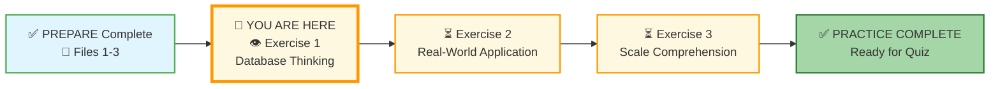
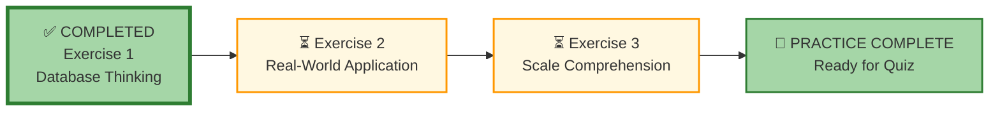



# 🗄️🤖 SQL & GenAI Course
**🎯 Quality Education for Anyone, Anywhere, Anytime — 💫 with Comfort, Convenience at no Cost**

## 🧠 Exercise 1: Database Thinking

Welcome to your first practice exercise! This is **Stage 2 of Module 1**. You'll apply the concepts you learned in the Prepare stage through thought experiments and real‑world scenarios. **No SQL required** – just thinking, observing, and reflecting.

---

## 🌌 SQLVerse Check-In

**Welcome to your first practice on Education Planet.** In the Prepare stage, you learned to *see* the database world. Now, in Practice, you'll learn to *explore* and understand the **architecture** underneath.

Start your **exploration** now. The **understanding** you build now is the foundation of your **SQLVerse** journey.

**The difference between a coder and an Artisan is discipline.**

---

### 📍 Your Current Stage

You've completed the three concept files. Now it's time to **think like a data professional**.

---

## 🔧 Enhanced Browser Office for PRACTICE

**🚀 Kickstart: Any Computer, Any Browser, Anytime.**  
**🌍 Destination: Any country, Any city, Any Platform.**

| Tab | Purpose | What to Do |
| :--- | :--- | :--- |
| **1: The Map** | Review core concepts | • Revisit [What is a Database?](../1-sqlCommands/1-what-is-a-database.md) • Revisit [Database Components](../1-sqlCommands/2-database-components.md) • Revisit [AI Co-pilot Usage](../1-sqlCommands/3-ai-copilot-usage.md) if needed. |
| **2: The Factory** | Visual exploration | • Open **[`training_institution_sample.db`](../../../../Resources/sample_databases/training_institution_sample.db)** – look at the tables and columns. • Open **[`level1_estore_basic.db`](../../../../Resources/sample_databases/level1_estore_basic.db)** – observe the structure. • No queries – just observation. |
| **3: The Consultant** | Conceptual Q&A | • Ask questions like: "What tables would a library need?" or "How would you track orders in a database?" • Ensure your AI is still in **[Student Mode](../../../STUDENT_MODE_PROMPT_LEVEL1.md)**. ❌ **NO SQL – conceptual only**. |
| **4: The Vault** | Save your work | • Save your answers to `database-thinking-answers.md` in:  `Learning/Level-1-beginner/Level1-1-ACQUIRE/Module1-Introduction-Database-AICo-pilot/2-practiceExercises/` |

---

### 🛠️ Module 1 Toolkit

🚀 Foundation First, AI Next, Projects Last.  
💎 Gemstone by Gemstone, Skill by Skill.

| | | | |
|---|---|---|---|
| **Browser Office** | 🔧 [Troubleshooting Common Issues](../../../../Setup/STEP1_COMMISSION_BROWSER_OFFICE.md) | 🔄 [Browser Office Workflow](../../../../Setup/STEP2_ESTABLISH_LEARNING_RITUAL.md) | ⌨️ [Tab Operations & Shortcuts](../../../../Setup/STEP3_MASTER_TAB_OPERATIONS.md) |
| **ACQUIRE Section** | 🗄️ [Database Ecosystem](../../../Guides/Section1-ACQUIRE/2_Database_Ecosystem.md) | 📚 [Knowledge Base (Vault)](../../../Guides/Section1-ACQUIRE/3_Knowledge_Base.md) | 🧠 [Mindset Tuning](../../../Guides/Section1-ACQUIRE/4_Mindset.md) |

---

## 📝 Exercises

### 1. Spreadsheet vs. Database – When to Switch?

For each scenario below, decide whether a **spreadsheet** or a **database** would be more appropriate. Explain your reasoning in 1‑2 sentences.

| Scenario | Your Choice & Why |
|----------|-------------------|
| a) A teacher tracking grades for 30 students in one class. | |
| b) An online store managing 10,000 products, customer orders, and inventory across multiple warehouses. | |
| c) A small club keeping a list of 50 members and their contact info. | |
| d) A hospital storing patient records, appointments, and billing information for millions of patients over 10 years. | |

---

### 2. Spot the Tables

Think about a familiar system. For each system below, list at least **three tables** you think would be needed to store its data. (Don't worry about exact column names – just think about the main categories of information.)

**Example:**  
System: *A school*  
Tables: `students`, `teachers`, `courses`, `enrollments`

| System | Possible Tables |
|--------|-----------------|
| a) An online bookstore (like Amazon Books) | 1.  2.  3. |
| b) A hospital | 1.  2.  3. |
| c) A social media platform (like Instagram) | 1.  2.  3. |

*Challenge:* For one of the systems, try to think of a **fourth** table and describe what it would store.

**🔑 Primary Key Check:**  
Remember your **Primary Key (Passport)** from File 2. For the hospital's `patients` table, what column would you use as the unique identifier so that if two patients have the same name, the database won't get confused? Write your answer here: `_________________`

---

### 3. The Analogy Game

Develop your mental model of how databases work by thinking through analogies and concepts. For each scenario, complete the database analogy. After you fill in your answers, put your AI Co‑pilot to work using the **"Critique My Analogy"** method we learned in File 3. For each of the three analogies, ask your AI: *"Is this a good analogy? Where does this analogy fail or break down?"*

**1. Filing Cabinet System:**
   - Database = `_________`
   - File Folder = `_________`
   - Document in Folder = `_________`
   - Tab on Document = `_________`

**2. Library System:**
   - Database = `_________`
   - Book Category = `_________` 
   - Book = `_________`
   - Chapter in Book = `_________`

**3. Restaurant Kitchen:**
   - Database = `_________`
   - Recipe Book = `_________`
   - Individual Recipe = `_________`
   - Ingredient = `_________`

**Artisan Bonus:** When you ask your AI to critique your analogy, use this follow‑up:  
> *"If I add a 'Primary Key' to this analogy, what object in the [Kitchen/Library/Filing Cabinet] would represent it best?"*

After you discuss with your AI, jot down the key insights in your Vault.

---

### 4. Real-World Scale

Databases can handle billions of rows; spreadsheets choke at around a million. Match the following real‑world examples to the approximate scale they would require (choose from: *thousands*, *millions*, *billions*, *trillions*).

| Example | Scale |
|---------|-------|
| a) Number of books in a large public library | |
| b) Number of Google searches per day | |
| c) Number of active users on Facebook | |
| d) Number of transactions processed by Visa in a year | |

**Reflection:** What does this tell you about the importance of databases in modern life?

---

### 5. Design a Simple Table

Imagine you're building a system to track your personal movie collection. You want to store:
- Movie title
- Year released
- Director
- Your rating (1–5)
- Whether you've loaned it to someone

What **columns** would you put in a single `movies` table? Write the column names and a brief description of the type of data each would hold (e.g., text, number, date).

| Column Name | Data Type | Description |
|-------------|-----------|-------------|
|             |           |             |
|             |           |             |
|             |           |             |
|             |           |             |
|             |           |             |

*(Add more rows if needed.)*

---

### 6. The Big Picture

In your own words, answer the following:

- **What is the single most important reason to use a database instead of a spreadsheet?**
- **Why do you think we're spending time on these thinking exercises before writing any SQL?**

---

## ✅ When You're Done

1. Save your answers in your Vault as `database-thinking-answers.md`.
2. Move on to the next exercise: **[Real-World Application](./2-real-world-application.md)**.

> 🗄️ **Vault Pro‑Tip:** When saving your `database-thinking-answers.md`, use **Markdown tables** (like the ones in this file) to keep your work organized and readable for your future self! Your future self will thank you when revisiting these notes weeks or months later.

Remember: there are no “wrong” answers here – only opportunities to think more deeply. If you're unsure, ask your Consultant (Tab 3) for hints, but try to reason it out yourself first.

---

## 🧭 Practice Navigation

### Your Progress Through Exercises

| Previous Step | Next Step |
|:---:|:---:|
| [← Back to Module 1 Guide](../MODULE1_GUIDE.md) | [Continue to Exercise 2: Real-World Application →](./2-real-world-application.md) |

---

*Part of our mission for 🎯 Quality Education for Anyone, Anywhere, Anytime — 💫 with Comfort, Convenience at no Cost.*

**Level 1 | Module 1 | Practice Exercise 1 | Next: [Real-World Application](./2-real-world-application.md)**