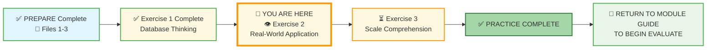
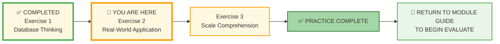



# 🗄️🤖 SQL & GenAI Course
**🎯 Quality Education for Anyone, Anywhere, Anytime — 💫 with Comfort, Convenience at no Cost**

## 🌍 Exercise 2: Real-World Application

Welcome to the second practice exercise! This continues **Stage 2 of Module 1**. You'll now take the concepts you've learned and apply them to realistic scenarios. **No SQL required** – just thinking, analyzing, and documenting.

---

## 🌌 SQLVerse Check-In

**Your exploration of Education Planet continues.** In Exercise 1, you learned to *think* like an architect. Now you will **traverse** to different **Planets** – Healthcare, Aviation, Big Data, and more. Each of these planets will have its own world of databases: hospitals, airlines, social media, and the apps you use every day.

Remember what we learned in *File 1: What is a Database?* – Every **domain** is a planet which hosts **databases** that are waiting to be **explored**. The world is full of databases waiting to be **discovered**.

Start **noticing** them.

**The difference between a coder and an Artisan is discipline.**

---

### 📍 Your Current Stage

You've completed Exercise 1. Now you'll see how databases appear in the world around you.

---

## 🔧 Enhanced Browser Office for PRACTICE

**🚀 Kickstart: Any Computer, Any Browser, Anytime.**  
**🌍 Destination: Any country, Any city, Any Platform.**

| Tab | Purpose | What to Do |
| :--- | :--- | :--- |
| **1: The Map** | Review core concepts | • Revisit [What is a Database?](../1-sqlCommands/1-what-is-a-database.md) • Revisit [Database Components](../1-sqlCommands/2-database-components.md) if needed. |
| **2: The Factory** | Visual exploration | • Open **[`training_institution_sample.db`](../../../../Resources/sample_databases/training_institution_sample.db)** – look at the tables and columns for inspiration. • Open **[`level1_estore_basic.db`](../../../../Resources/sample_databases/level1_estore_basic.db)** – observe real e‑store structure. |
| **3: The Consultant** | Conceptual Q&A | • Ask questions like: "What tables would you need for a library system?" or "How would you track orders and customers?" • Ensure your AI is still in **[Student Mode](../../../STUDENT_MODE_PROMPT_LEVEL1.md)**. ❌ **NO SQL – conceptual only**. |
| **4: The Vault** | Save your work | • Save your answers to `real-world-application-answers.md` in:  `Learning/Level-1-beginner/Level1-1-ACQUIRE/Module1-Introduction-Database-AICo-pilot/2-practiceExercises/` |

---

### 🛠️ Module 1 Toolkit

🚀 Foundation First, AI Next, Projects Last.  
💎 Gemstone by Gemstone, Skill by Skill.

| | | | |
|---|---|---|---|
| **Browser Office** | 🔧 [Troubleshooting Common Issues](../../../../Setup/STEP1_COMMISSION_BROWSER_OFFICE.md) | 🔄 [Browser Office Workflow](../../../../Setup/STEP2_ESTABLISH_LEARNING_RITUAL.md) | ⌨️ [Tab Operations & Shortcuts](../../../../Setup/STEP3_MASTER_TAB_OPERATIONS.md) |
| **ACQUIRE Section** | 🗄️ [Database Ecosystem](../../../Guides/Section1-ACQUIRE/2_Database_Ecosystem.md) | 📚 [Knowledge Base (Vault)](../../../Guides/Section1-ACQUIRE/3_Knowledge_Base.md) | 🧠 [Mindset Tuning](../../../Guides/Section1-ACQUIRE/4_Mindset.md) |

---

## 📈 Your PRACTICE Journey

**📍 You are here:** Exercise 2 – Real-World Application. After completing all three exercises, you'll return to the Module Guide to begin the EVALUATE stage.

---

## 📝 Exercises

### 1. Database or Spreadsheet? – New Scenarios

Decide whether a **spreadsheet** or a **database** is more appropriate for each scenario. Explain your choice in 1‑2 sentences.

| Scenario | Your Choice & Why |
|----------|-------------------|
| a) A food truck owner tracking daily sales, inventory of ingredients, and customer feedback for one location. | |
| b) A chain of 50 coffee shops needing to manage employee schedules, sales from all locations, and supply orders. | |
| c) A personal workout log tracking exercises, reps, and weights for a single user. | |
| d) A university tracking student enrollments, course offerings, professor assignments, and grades across multiple campuses. | |

---

### 2. Identify Tables and Relationships

For each real‑world system described below, list at least **four tables** that would be needed and explain briefly how they relate to each other.

**Example:**  
System: *Online bookstore*  
Tables: `books`, `authors`, `customers`, `orders`, `order_items`  
Relationships:  
- `books` connects to `authors` (an author writes many books).  
- `orders` connects to `customers` (a customer places many orders).  
- `order_items` connects `orders` and `books` (many‑to‑many resolved).

| System | Tables | Relationships |
|--------|--------|---------------|
| a) A hospital management system (patients, doctors, appointments, billing) | 1.  2.  3.  4. | |
| b) A social media platform (users, posts, comments, likes) | 1.  2.  3.  4. | |
| c) An airline reservation system (flights, passengers, bookings, payments) | 1.  2.  3.  4. | |

---

### 3. The Importance of Uniqueness

Imagine a school's `students` table has the following columns:  
`first_name`, `last_name`, `birth_date`, `enrollment_date`.

- If two students have the same name **and** the same birth date, how could you tell them apart?  
- What column would you add to make each student unique?  
- What would you call that column (hint: it's like a passport for each student)?  

**Now think about a real challenge:**  
A hospital's `patients` table has two patients named "John Smith". Without a unique identifier, the database could mix up their medical records. What could go wrong? List two potential problems.

| Problem 1 | |
|-----------|-|
| Problem 2 | |

---

### 4. Database vs Spreadsheet Decision

**When should a business switch from spreadsheets to a database? List 3 signs:**

1. `__________________________________`
2. `__________________________________`
3. `__________________________________`

---

### 5. App Analysis

**Choose an app you use regularly and analyze its database needs:**

**App Name:** `____________________`

**What information does this app remember about you?**
- `__________________________________`
- `__________________________________`
- `__________________________________`

**Why does this app need a database instead of spreadsheets?**
- `__________________________________`
- `__________________________________`
- `__________________________________`

---

### 6. Real-World Observation

Take a walk (mentally or physically) through your day. Identify **three systems or processes** that likely rely on a database. For each one:
- Name the system (e.g., your banking app, the grocery store checkout, Netflix recommendations).
- List at least two tables you think might exist in its database.
- Share one question you could ask your AI Co‑pilot to learn more about how that system works.

Record your observations below.

| System | Possible Tables | AI Question |
|--------|-----------------|--------------|
| 1. | | |
| 2. | | |
| 3. | | |

---

### 7. The Big Picture

In your own words, answer:

- **How does understanding real-world systems as collections of tables change the way you see everyday technology?**
- **What's one thing you're still curious about after these exercises?**

---

## 🧠 Real-World Application — The Data Detective

Welcome to **Detective Exercise**. Now that you've mastered the "Thinking" stage, it's time to put your boots on the ground. In this exercise, you will step into the **Factory** (Tab 2) to explore real database files. You won't be writing code yet, but you will be performing "Visual Reconnaissance."

### 🔍 Part 1: Visual Reconnaissance (The E-Store)

**Task:** Load the `level1_estore_basic.db` in **Tab 2**. Look at the sidebar listing the tables.

| Detective Question | Your Finding (Table & Column) |
| --- | --- |
| **1. The Location Scout:** If you wanted to find out which **cities** your customers live in, which table and column would you look at? | **Table:**     **Column:** |
| **2. The Price Check:** If a customer asks how much the "Gaming Mouse" costs, which table holds the **prices**? | **Table:**     **Column:** |
| **3. The Timeline:** You need to see a list of every purchase made in **January**. Which table tracks the dates of purchases? | **Table:**     **Column:** |

---

### 🔗 Part 2: The "Thread" Connection

In `level1_estore_basic.db`, open the `orders` table. You will see a column named `customer_id`. You will *not* see the customer's name (like "John Doe") in this table.

> 🎨 **Artisan Tip:** In your mind, imagine a thin red line connecting the `customer_id` in the `orders` table directly to the same `customer_id` in the `customers` table. That line is the **Relationship**. Without it, the data is just a pile of numbers. With it, the data becomes a story.

**The Mystery:**
Why is the name missing? Why did the architects use a `customer_id` number instead of just typing the name next to the order?

**Your Reasoning:**

> *Write 1-2 sentences on why separating "Who the customer is" (Customers Table) from "What they bought" (Orders Table) is safer for a business.*

---

### 🏫 Part 3: Institutional Knowledge

Switch your database in **Tab 2** to `training_institution_sample.db`.

**The Scenario:**
A student wants to enroll in a course but only has 4 weeks available. You need to find a course that fits their schedule.

1. **Identify the Table:** Where is the course information stored?
2. **Identify the Column:** Which column tells you how long (duration) the course lasts?
3. **The Discovery:** Look at the data. Can you find a course that is exactly 4 weeks or less?

---

### 🤖 Part 4: Socratic Verification (Tab 3)

Copy and paste this prompt into your **Consultant (Tab 3)** to verify your logic for Part 2:

> *"I am looking at an 'Orders' table that only has a 'customer_id' and not the 'customer_name'. I suspect this is done to ensure data integrity in case a customer changes their name. Am I thinking about 'Relational Databases' correctly? What is this concept called in professional database design?"*

---

### 💎 DESIGNER'S PERIGON

### *The Visionary's Lens: The Power of the "ID"*

In this exercise, you encountered the **Foreign Key**—though we haven't officially named it yet. It's that `student_id` you saw in the `payments` table of the training database.

Think of it like a **tracking number** on a package. The package doesn't need to have your entire life story printed on the box; it just needs a number that points back to the post office's main database. This makes the system fast, light, and incredibly accurate.

Let us have a cursory glance at the Foreign Key with respect to the `payments` table. The table records the payments made by a student in installments. Here `payment_id` is declared as the Primary Key. By now you have clearly understood that the Primary Key is a passport and cannot be duplicated – which means every payment made by the student will have a unique `payment_id` (just like a bill number). The `student_id` is declared as the **FOREIGN KEY** which references the `student_id` in the `students` table. This means that the `student_id` in the `payments` table is linked to the `student_id` in the `students` table (where `student_id` is the PRIMARY KEY). The keyword here is **REFERENCES**, which tightly couples the two tables. In database terminology, this defines the **Relationship** between the two tables, which establishes the following:

1. The `student_id` in the `payments` table must be available in the `students` table – i.e., you cannot enter some random value that is not present in the `students` table.
2. The `student_id` representing a student record in the `students` table cannot be removed if that `student_id` is present in the `payments` table. This means you cannot accidentally delete a student record when a payment is pending.

This type of integrity check cannot be enforced in spreadsheets. Now you can understand why corporations spend millions of dollars to keep their data secure in a database.

Another significant point here is the difference between primary key and foreign key. A Primary Key in a table cannot be duplicated, but a **FOREIGN KEY CAN BE DUPLICATED**. When a student pays fees in 3 installments, there will be 3 records with the same `student_id` in the `payments` table, where duplication is allowed. But the `student_id` in the `students` table cannot be duplicated because it is the primary key.

When you learn to "connect the dots" between tables, you are moving from being a data user to a **Data Architect**.

---

### ✅ Progress Check for Visual Reconnaissance

- [ ] I have explored both sample databases in Tab 2.
- [ ] I identified the correct tables and columns for the E-Store.
- [ ] I understand why we use IDs instead of repeating names.
- [ ] I have saved my findings in my Vault.

---

## ✅ When You're Done

1. Save all your answers in your Vault as `real-world-application-answers.md`. Include your detective findings and reflections.
2. Move on to the next exercise: **[Scale Comprehension](./3-scale-comprehension.md)**.

> 🗄️ **Vault Pro‑Tip:** Use Markdown tables to keep your answers organized. For longer designs, use code blocks with comments. Your future self will thank you!

Remember: there are no “wrong” answers – only opportunities to think more deeply. If you're unsure, ask your Consultant (Tab 3) for hints, but try to reason it out yourself first.

---

## 🧭 Practice Navigation

| Previous Step | Next Step |
|:---:|:---:|
| [← Back to Exercise 1: Database Thinking](./1-database-thinking-exercises.md) | [Continue to Exercise 3: Scale Comprehension →](./3-scale-comprehension.md) |

---

*Part of our mission for 🎯 Quality Education for Anyone, Anywhere, Anytime — 💫 with Comfort, Convenience at no Cost.*

**Level 1 | Module 1 | Practice Exercise 2 | Next: [Scale Comprehension](./3-scale-comprehension.md)**