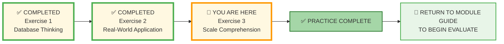
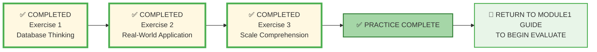



# 🗄️🤖 SQL & GenAI Course
**🎯 Quality Education for Anyone, Anywhere, Anytime — 💫 with Comfort, Convenience at no Cost**

## 📏 Exercise 3: Scale Comprehension

Welcome to the final practice exercise of **Module 1**. So far, you've learned to think in tables and connect data like a detective. Now, we address the **grandeur** of databases. Why do the world's largest companies rely on them? It comes down to **Scale**.

---

## 🌌 SQLVerse Check-In

**You've explored multiple planets through thought experiments** – Healthcare, Aviation, Social Media. You've seen their databases: hospitals, airlines, and the apps you use daily. Now, it's time to understand the **scale** at which these worlds operate.

Remember: Every **domain** is a planet. Every planet hosts **databases** waiting to be explored. But some **databases** are so **vast** they **rival** solar systems – and a *deeper understanding of their scale* makes the difference between **knowing** the database and **owning** the database.

An **Artisan** owns the database.

Welcome to the **scale** of the universe.

**The difference between a coder and an Artisan is discipline.**

---

### 📍 Your Current Stage

```mermaid
flowchart LR
    A["✅ PREPARE Complete<br/>📘 Files 1-3"] --> B
    B["✅ Exercise 1 Complete<br/>Database Thinking"] --> C
    C["✅ Exercise 2 Complete<br/>Real-World Application"] --> D
    D["📍 YOU ARE HERE<br/>👁️ Exercise 3<br/>Scale Comprehension"] --> E
    E["✅ PRACTICE COMPLETE"] --> F
    F["🔄 RETURN TO MODULE GUIDE<br/>TO BEGIN EVALUATE"]
    
    style A fill:#e1f5fe,stroke:#4caf50,stroke-width:2px
    style B fill:#fff8e1,stroke:#4caf50,stroke-width:2px
    style C fill:#fff8e1,stroke:#4caf50,stroke-width:2px
    style D fill:#fff8e1,stroke:#ff9800,stroke-width:4px
    style E fill:#a5d6a7,stroke:#2e7d32,stroke-width:2px
    style F fill:#e8f5e8,stroke:#4caf50,stroke-width:2px
```

You've completed Exercises 1 and 2. Now you'll grasp the massive scale that separates spreadsheets from databases.

---

## 🔧 Enhanced Browser Office for PRACTICE

**🚀 Kickstart: Any Computer, Any Browser, Anytime.**  
**🌍 Destination: Any country, Any city, Any Platform.**

| Tab | Purpose | What to Do |
| :--- | :--- | :--- |
| **1: The Map** | Review core concepts | • Revisit [What is a Database?](../1-sqlCommands/1-what-is-a-database.md) • Revisit the **ocean vs. asteroid** analogy below. |
| **2: The Factory** | Explore scale visually | • Open **[`training_institution_sample.db`](../../../../Resources/sample_databases/training_institution_sample.db)** – notice how many rows are in the `students` table (only ~8). But imagine millions! • Open **[`level1_estore_basic.db`](../../../../Resources/sample_databases/level1_estore_basic.db)** – again, small sample, but think about Amazon's scale. |
| **3: The Consultant** | Ask about scale | • Use the prompts in Part 2 to ask about indexing. • Ask: "Why can't Excel handle billions of rows?" • Ensure your AI is still in **[Student Mode](../../../STUDENT_MODE_PROMPT_LEVEL1.md)**. ❌ **NO SQL – conceptual only**. |
| **4: The Vault** | Save your work | • Save your answers to `scale-comprehension-answers.md` in:  `Learning/Level-1-beginner/Level1-1-ACQUIRE/Module1-Introduction-Database-AICo-pilot/2-practiceExercises/` |

---

### 🛠️ Module 1 Toolkit

🚀 Foundation First, AI Next, Projects Last.  
💎 Gemstone by Gemstone, Skill by Skill.

| | | | |
|---|---|---|---|
| **Browser Office** | 🔧 [Troubleshooting Common Issues](../../../../Setup/STEP1_COMMISSION_BROWSER_OFFICE.md) | 🔄 [Browser Office Workflow](../../../../Setup/STEP2_ESTABLISH_LEARNING_RITUAL.md) | ⌨️ [Tab Operations & Shortcuts](../../../../Setup/STEP3_MASTER_TAB_OPERATIONS.md) |
| **ACQUIRE Section** | 🗄️ [Database Ecosystem](../../../Guides/Section1-ACQUIRE/2_Database_Ecosystem.md) | 📚 [Knowledge Base (Vault)](../../../Guides/Section1-ACQUIRE/3_Knowledge_Base.md) | 🧠 [Mindset Tuning](../../../Guides/Section1-ACQUIRE/4_Mindset.md) |

---

## 📈 Your PRACTICE Journey

**📍 You are here:** Exercise 3 – Scale Comprehension. After completing this exercise, you'll return to the Module Guide to begin the EVALUATE stage.

---

## 📝 Exercise 1: Numbers that Matter

**Fill in the scale comparison:**

| Metric | Spreadsheet | Database |
|--------|-------------|----------|
| Maximum Rows | `_________` | `_________` |
| Concurrent Users | `_________` | `_________` |
| Typical Slowdown Point | `_________` rows | `_________` rows |
| Real-time Capability | `_________` | `_________` |

---

## 📝 Exercise 2: Enterprise Examples

**Research and note one example for each:**

**Company with massive database needs:**
- Company: `_________`
- What they store: `_________`
- Estimated data volume: `_________`

**When database failure would be catastrophic:**
- Business: `_________`
- Impact of downtime: `_________`
- Why spreadsheets can't help: `_________`

---

## 📝 Exercise 3: Your Scale Imagination

**Imagine you're building the next big social app:**

1. What's the maximum users you could handle with spreadsheets?
   `__________________________________`

2. What would break first as you grow?
   `__________________________________`

3. Why would investors care about your database choice?
   `__________________________________`

---

## 🌊 Exercise 4: Scale Comprehension — From Ponds to Oceans

Spreadsheets are like a **backpack**—great for carrying what you need for a day trip. Databases are like a **cargo ship**—designed to move millions of tons across oceans.

### 🏗️ Part 1: The Breaking Point

Imagine a global payment processor like **Visa**. They process roughly **200 million transactions every day**.

1. **The Math:** If Visa used a single spreadsheet (which has a limit of about 1 million rows), how many spreadsheets would they fill **every single day**?
2. **The Search:** If you were a customer service agent trying to find *one specific transaction* from three years ago across those thousands of spreadsheets, how long do you think it would take?
3. **The Database Solution:** A database doesn't "open" the whole file to find one row. It uses something called an **Index** (like a book's index).

---

### 🔍 Part 2: The Speed Test (Socratic Sparring)

Open **Tab 3 (The Consultant)** and let's dive into the "Magic" of database speed. Copy and paste this prompt:

> *"Explain to me like I'm an artisan apprentice: How does a database find one specific row out of a billion in less than a second? Use an analogy involving a massive library or a giant warehouse. Why would a spreadsheet fail at this same task?"*

**Vault Action:** Summarize the AI's explanation of **Indexing** in your own words. Why is "skipping the search" better than "searching everything"?

---

### 🛰️ Part 3: Real-World "Ocean" Examples

Match the App to the "Oceanic" data it must manage.

| App / System | The "Ocean" of Data it Manages |
| --- | --- |
| **1. Netflix** | A. Trillions of sensor readings from plane engines for safety. |
| **2. Uber** | B. Billions of "Watch History" records to suggest your next show. |
| **3. Boeing** | C. Millions of real-time GPS coordinates for every driver and rider. |
| **4. YouTube** | D. Billions of comments, likes, and video timestamps. |

**Reflection:** If any of these systems "crashed" for even 10 minutes because their database couldn't handle the scale, what would the real-world consequence be?

---

### 🧪 Part 4: The Artisan's Thought Experiment

**Scenario:** You are building an app that tracks every heartbeat of every person on Earth for a health study.

* **The Question:** Is this a "Spreadsheet" project or a "Database" project?
* **The Challenge:** How many rows of data would you generate in just **one minute** if there are 8 billion people?
* **The AI Follow-up:** Ask your AI: *"What kind of specialized databases are used for 'Time-Series' data like heartbeats or stock market prices?"*

---

## ✅ When You're Done

1. Save all your answers in your Vault as `scale-comprehension-answers.md`.
2. Return to the Module 1 Guide to begin the **EVALUATE** stage (Stage 3).

> 🗄️ **Vault Pro‑Tip:** Use Markdown tables and bullet points to keep your answers organized. Your future self will thank you!

Remember: there are no “wrong” answers – only opportunities to think more deeply. If you're unsure, ask your Consultant (Tab 3) for hints, but try to reason it out yourself first.

---

## 💎 DESIGNER'S PERIGON

### *The Visionary's Lens: Scale as a Mindset*

Spreadsheets are for you. Databases are for the world.

When you think at the scale of billions, you stop seeing data as rows in a table and start seeing it as a living, breathing ecosystem. Every click, every search, every transaction is a pulse in the global digital organism.

As you finish these exercises, take a moment to look at your phone or computer. Almost every click you make triggers a database "Select" somewhere in the world.

When you type a search into Google, you aren't searching the internet; you are searching Google's **Index of the internet**—a database of unfathomable scale. You are no longer just a user of these systems; you are beginning to understand the **Engine** that makes modern civilization possible.

**The Artisan's Truth:**

> **A spreadsheet is an asteroid; a database is a solar system.**
> 
> You're not just learning to store data – you're learning to capture the flow of human experience. In the next module, we stop *looking* at the engine and start *driving* it. You will write your first `SELECT` statement and command the data to appear.

---

## ✅ PRACTICE COMPLETE

- [ ] I have completed the Visa "Breaking Point" math.
- [ ] I understand the basic concept of an **Index**.
- [ ] I have identified the "Oceanic" scale of global apps.
- [ ] I have saved my final Practice reflections in my Vault.

---

## 🧭 Practice Navigation

**Congratulations!** You have completed the **PRACTICE** phase.

| Previous Step | Next Step |
|:---:|:---:|
| [← Back to Exercise 2: Real-World Application](./2-real-world-application.md) | [Return to Module 1 Guide →](../MODULE1_GUIDE.md) to begin EVALUATE |

---

*Part of our mission for 🎯 Quality Education for Anyone, Anywhere, Anytime — 💫 with Comfort, Convenience at no Cost.*

**Level 1 | Module 1 | Practice Exercise 3 | Next: EVALUATE Stage**