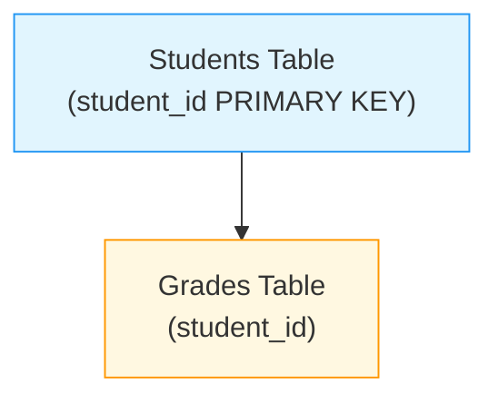
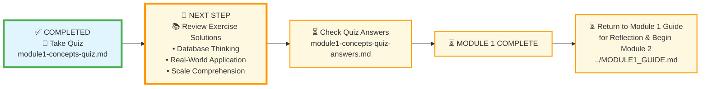




# 🗄️🤖 SQL & GenAI Course
**🎯 Quality Education for Anyone, Anywhere, Anytime — 💫 with Comfort, Convenience at no Cost**

## 📝 Module 1: Concepts Quiz

Welcome to the **EVALUATE** stage! This short quiz will help you confirm that you've absorbed the core concepts from Module 1. Take your time – it's not timed, and there's no pressure. The goal is to identify any areas you might want to review before moving on to Module 2.

---

## 🌌 SQLVerse Check-In

<div style="border-left: 4px solid #9c27b0; background-color: #f3e5f5; padding: 15px; margin: 20px 0; border-radius: 0 8px 8px 0;">

**You've completed your journey across Education Planet.** You've learned to *see* the database world, *explored* its architecture, and *understood* the scale at which it operates. Now, it's time to prove your mastery.

This quiz isn't a test – it's your **certification** as a SQLVerse Explorer. Every question reflects a concept you've internalized through the Prepare and Practice stages.

Remember: The difference between **knowing** the database and **owning** the database is about to be measured. An **Artisan** owns the database.

**The difference between a coder and an Artisan is discipline.**

</div>

---

### 📍 Your Current Stage

```mermaid
flowchart LR
    A["✅ PREPARE Complete<br/>📘 Files 1-3"] --> B
    B["✅ PRACTICE Complete<br/>👁️ Exercises 1-3"] --> C
    C["📍 YOU ARE HERE<br/>📝 Concepts Quiz"] --> D
    D["📚 Review Exercise Solutions<br/>• Database Thinking<br/>• Real-World Application<br/>• Scale Comprehension"] --> E
    E["✅ Check Quiz Answers"] --> F
    F["🎉 MODULE 1 COMPLETE"] --> G
    G["🔄 Return to Module 1 Guide<br/>for Reflection & Begin Module 2"]
    
    style A fill:#e1f5fe,stroke:#4caf50,stroke-width:2px
    style B fill:#fff8e1,stroke:#4caf50,stroke-width:2px
    style C fill:#e8f5e8,stroke:#ff9800,stroke-width:4px
    style D fill:#fff8e1,stroke:#ff9800,stroke-width:2px
    style E fill:#fff8e1,stroke:#ff9800,stroke-width:2px
    style F fill:#a5d6a7,stroke:#2e7d32,stroke-width:2px
    style G fill:#fff8e1,stroke:#ff9800,stroke-width:2px
```



You’ve completed all preparation and practice. Now let’s solidify your understanding with this quiz. Afterward, you’ll check your answers, review exercise solutions, and return to the Module 1 Guide for final reflection before beginning Module 2.

---

## 🧠 Quiz Questions

### Part 1: Multiple Choice

Choose the best answer for each question.

**1. What is a database?**
* [ ] A) A collection of spreadsheets saved in a folder
* [ ] B) A structured collection of data managed by a DBMS, designed for efficient storage and retrieval
* [ ] C) A type of computer used only by large corporations
* [ ] D) A software for creating pie charts

---

**2. Which of the following is a key advantage of databases over spreadsheets?**
* [ ] A) Databases can only be used by one person at a time
* [ ] B) Databases can handle billions of rows and concurrent users
* [ ] C) Databases require less storage space
* [ ] D) Databases are easier to set up than spreadsheets

---

**3. Which of the following scenarios is the most compelling reason for a business to switch from a spreadsheet to a database?**
* [ ] A) The need to store information for more than one year.
* [ ] B) The need for multiple employees to update and access interconnected data simultaneously without errors.
* [ ] C) The desire to create colorful charts and graphs for a weekly meeting.
* [ ] D) The need to perform simple addition and subtraction on a list of 50 items.

---

**4. Which of these is a major consequence of "Data Integrity" failing in a hospital database?**
* [ ] A) The background color of the app changes.
* [ ] B) A patient is given the wrong medication because their record was confused with someone else's.
* [ ] C) The hospital's website takes 5 seconds longer to load.
* [ ] D) The database requires more electricity to run.

---

**5. In a database table, what is a primary key?**
* [ ] A) The first column in the table
* [ ] B) A unique identifier for each row (like a passport)
* [ ] C) A column that can contain duplicate values
* [ ] D) A special key that unlocks the database

---

**6. What is the primary purpose of a "Foreign Key" in a database table?**
* [ ] A) To prevent any duplicate data from ever being entered into that specific column.
* [ ] B) To act as a "thread" that links a record in one table to a unique record in another table.
* [ ] C) To encrypt sensitive data.
* [ ] D) To provide a summary of all the numerical data in a table.

---

**7. You are designing a database for a library. Which of the following would be the most appropriate set of tables?**
* [ ] A) Library_Name, Total_Books, Address
* [ ] B) Books, Authors, Members, Loans
* [ ] C) Page_1, Page_2, Page_3
* [ ] D) Title, Author_Name, Genre, Member_Name

---

**8. Why is it a "best practice" to use an AI Co-pilot in "Student Mode" rather than just asking for the final SQL code?**
* [ ] A) Because AI is incapable of writing correct SQL code.
* [ ] B) To build "mental muscle" and ensure you understand the logic before relying on automation.
* [ ] C) Because Student Mode makes the AI respond faster.
* [ ] D) Because professional developers never use AI.

---

**9. In the ACQUIRE phase, what is the role of your AI Co-pilot (Tab 3)?**
* [ ] A) To write SQL code for you
* [ ] B) To provide conceptual explanations and answer "what is" questions
* [ ] C) To debug your queries automatically
* [ ] D) To replace your need to learn SQL

---

**10. You find a column named `student_id` in both a "Students" table and a "Grades" table. In the "Grades" table, this column is likely a:**

Look at the diagram below. The arrow shows how the `student_id` in the `Grades` table connects to the `Students` table.



* [ ] A) Primary Key
* [ ] B) Foreign Key
* [ ] C) Database Engine
* [ ] D) Data Type

---

### Part 2: True or False

Mark each statement as True or False.

**11.** A database can have multiple tables, but they cannot be related to each other.  
**12.** A primary key column can contain duplicate values.  
**13.** Databases are only used by large companies like Amazon and Facebook.  
**14.** Spreadsheets are great for collaboration among hundreds of users at the same time.  
**15.** The `student_id` in a `payments` table that links to a `students` table is an example of a foreign key.  
**16.** Google Search uses a database to index the internet.  
**17.** In Module 1, we wrote our first SQL queries to retrieve data.

---

### Part 3: Short Answer

Write 1‑3 sentences for each question.

**18.** Explain the difference between a primary key and a foreign key in your own words.

---

**19.** Give one real‑world example of a situation where a database would be absolutely necessary and a spreadsheet would fail. Explain why.

---

**20.** Why did we spend so much time on concepts and analogies (like the ocean/asteroid and the passport) before touching any SQL?

---

**21.** In your own words, what does it mean to use AI as a "thinking partner" rather than a "search engine"?

---

### Part 4: Apply Your Knowledge

**22.** Imagine you are designing a database for a small online store. List at least three tables you would need and one column for each table. Identify the primary key for each table.

| Table Name | Columns (include at least 3) | Primary Key |
|------------|-------------------------------|-------------|
|            |                               |             |
|            |                               |             |
|            |                               |             |

---

**23.** A friend says: "I've been using Excel for my business for years, and it works fine. Why would I need a database?" Write a short response (2‑3 sentences) explaining one key reason why they might eventually need to switch.

---

### Part 5: Scenario Analysis

**24. Small Business Dilemma**  
*A local bakery uses spreadsheets to track inventory, customers, and orders. They're growing rapidly and considering switching to a database system.*

**What three signs would indicate it's time for them to switch?**
1. _______________________________________________________
2. _______________________________________________________
3. _______________________________________________________

---

**25. Scale Imagination**  
*Imagine you're building a new ride-sharing app like Uber.*

*Remember the **Aquarium vs. Ocean** and **Asteroid vs. Solar System** analogies from the exercises – think about the massive scale of data a successful ride-sharing app would generate.*

**What database challenges might you face if you become successful with 10 million users?**
__________________________________________________________
__________________________________________________________
__________________________________________________________

---

## ✅ When You're Done

1. Write your answers in a new file `quiz_answers.md` inside your Vault at:
   ```
   Learning/Level-1-beginner/Level1-1-ACQUIRE/Module1-Introduction-Database-AICo-pilot/3-quizCheckpoint/
   ```
2. Check your answers against the detailed solutions in the **[module1-concepts-quiz-answers.md](../4-exerciseAndQuizSolutions/module1-concepts-quiz-answers.md)** file (located in the `4-exerciseAndQuizSolutions` folder). This file contains explanations for all quiz questions as well as sample answers for the exercises.
3. For any questions you missed, review the relevant concept file or practice exercise.
4. Once you're confident, celebrate – you've completed Module 1!

---

## 🧭 Evaluation Navigation


| Previous Step | Next Step |
|:---:|:---:|
| [← Back to Module 1 Guide](../MODULE1_GUIDE.md) | [Continue to Exercise 1 Solutions →](../4-exerciseAndQuizSolutions/1-database-thinking-exercises-solutions.md) |

---

*Part of our mission for 🎯 Quality Education for Anyone, Anywhere, Anytime — 💫 with Comfort, Convenience at no Cost.*

**Level 1 | Module 1 | Concepts Quiz | Next: [Exercise 1 Solutions](../4-exerciseAndQuizSolutions/1-database-thinking-exercises-solutions.md)**