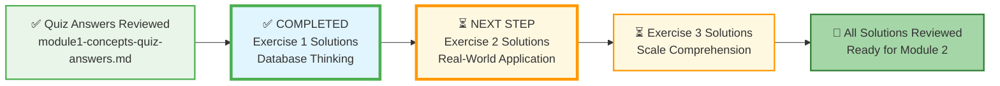



# 🗄️🤖 SQL & GenAI Course
**🎯 Quality Education for Anyone, Anywhere, Anytime — 💫 with Comfort, Convenience at no Cost**

## 🧠 Exercise 1: Database Thinking – Solutions & Sample Answers

Welcome to the solutions for Exercise 1! Use this guide to compare your own answers and deepen your understanding. Remember, there is often more than one “right” way to think about these scenarios – the goal is to build your intuition and mental models.

---

## 🌌 SQLVerse Check-In

**Your journey through Education Planet continues.** You've completed the quiz and checked your answers. Now you're reviewing the Exercise Solutions – the final step before earning your **SQLVerse Explorer** badge.

Remember: The difference between **knowing** the database and **owning** the database is about to be sealed. An **Artisan** owns the database.

**The difference between a coder and an Artisan is discipline.**

---

### 📍 Your Current Stage

```mermaid
flowchart LR
    A["✅ Quiz Completed<br/>📝 module1-concepts-quiz.md"] --> B
    B["📍 YOU ARE HERE<br/>📚 Exercise 1 Solutions<br/>Database Thinking"] --> C
    C["⏳ Exercise 2 Solutions<br/>Real-World Application"] --> D
    D["⏳ Exercise 3 Solutions<br/>Scale Comprehension"] --> E
    E["⏳ Quiz Answers<br/>module1-concepts-quiz-answers.md"] --> F
    F["🎉 READY FOR MODULE 2"]
    
    style A fill:#e1f5fe,stroke:#4caf50,stroke-width:2px
    style B fill:#fff8e1,stroke:#ff9800,stroke-width:4px
    style C fill:#fff8e1,stroke:#ff9800,stroke-width:2px
    style D fill:#fff8e1,stroke:#ff9800,stroke-width:2px
    style E fill:#fff8e1,stroke:#ff9800,stroke-width:2px
    style F fill:#a5d6a7,stroke:#2e7d32,stroke-width:2px
```

You've completed the quiz and checked your answers. Now review these exercise solutions to see how your thinking compares.

---

### 1. Spreadsheet vs. Database – When to Switch?

For each scenario, decide whether a spreadsheet or database is more appropriate. The key is to consider **scale, concurrency, data integrity, and relationships**.

| Scenario | Sample Answer | Reasoning |
|----------|---------------|-------------|
| a) A teacher tracking grades for 30 students in one class. | **Spreadsheet** | Simple, flat data, single user, low volume. A spreadsheet is perfectly adequate. |
| b) An online store managing 10,000 products, customer orders, and inventory across multiple warehouses. | **Database** | High volume, multiple related entities (products, orders, customers), need for concurrency, and data integrity across transactions. |
| c) A small club keeping a list of 50 members and their contact info. | **Spreadsheet** | Small dataset, no complex relationships, one or two users. A spreadsheet is simpler and faster to set up. |
| d) A hospital storing patient records, appointments, and billing information for millions of patients over 10 years. | **Database** | Massive scale, critical need for data integrity (life-or-death), strict security, and concurrency requirements. |

---

### 2. Spot the Tables (Sample Answers)

For each system, list at least three tables you think would be needed. Your answers may vary – the important thing is to think in terms of **entities** (nouns) that the system must track.

| System | Possible Tables | Explanation |
|--------|-----------------|-------------|
| a) An online bookstore | `books`, `authors`, `customers`, `orders` | Books and authors are core entities; customers and orders track purchases. A many-to-many between books and orders is often resolved with an `order_items` table. |
| b) A hospital | `patients`, `doctors`, `appointments`, `medications` | Patients and doctors are central; appointments link them; medications are prescribed. Additional tables like `prescriptions` may also be needed. |
| c) A social media platform (Instagram) | `users`, `posts`, `comments`, `likes` | Users create posts; comments and likes are interactions linked to both users and posts. |

**🔑 Primary Key Check:**  
In the hospital's `patients` table, the best unique identifier is a **`patient_id`** (auto-generated) or a **`social_security_number`** (if available). Never use name alone – two patients could share the same name, leading to dangerous record mix‑ups.

---

### 🏛️ The Artisan's Insight: Entity Separation

Notice in the **Hospital** and **Instagram** examples how we separate the *person* from the *action*.

* In a spreadsheet, you might have one row that says: `Patient Name | Date | Doctor | Medication`.
* In a database, we have a `Patient` table and an `Appointment` table.

**Why?** Because one patient has many appointments. If we put it all in one row, we'd have to repeat the patient's phone number and address every time they see a doctor. That's "Redundancy," and it's the enemy of the Artisan.

---

### 3. The Analogy Game

Analogies help build mental models. Here are sample completions – your answers may differ, but they should follow the same pattern (container → table → row → column).

| System | Database Component | Your Analogy (Sample) |
|--------|---------------------|------------------------|
| **Filing Cabinet** | Database = Cabinet File Folder = Table Document in Folder = Row Tab on Document = Column | The whole cabinet holds everything; each folder is a distinct category (e.g., Customers); each document is one record; tabs on the document label specific fields (e.g., Name, Date). |
| **Library** | Database = Library Building Book Category = Table Book = Row Chapter in Book = Column | The building houses all books; categories (e.g., Fiction, Non‑fiction) are like tables; each book is a record; chapters are like columns (each contains a specific type of data). |
| **Restaurant Kitchen** | Database = Kitchen Recipe Book = Table Individual Recipe = Row Ingredient = Column | The kitchen is the whole environment; a recipe book (e.g., Desserts) is a table; each recipe is a row; ingredients listed in the recipe are like columns (each ingredient is a field). |

**Artisan Bonus – Primary Key in the Analogy:**  
- In the **filing cabinet**, the folder label (e.g., "Customer ID") that uniquely identifies the document is the primary key.  
- In the **library**, the unique catalog number on the book spine is the primary key.  
- In the **kitchen**, the recipe name (if unique) could be the primary key, but often a recipe ID (like a number in the index) works better.

---

### 💡 Reflection

How did your answers compare? If you found different tables or analogies, that's fine – the key is whether your reasoning supports the structure. Discuss with your AI Consultant if you want to explore alternative designs.

---

## ✅ When You're Done

- [ ] I've compared my answers with these samples.
- [ ] I understand why each scenario leans toward spreadsheet or database.
- [ ] I can explain the role of a primary key in the tables I designed.
- [ ] I'm ready to move to the next exercise solutions.

---

## 🧭 Navigation for EVALUATE

| Previous Step | Next Step |
|:---:|:---:|
| [← Back to Quiz Answers](./module1-concepts-quiz-answers.md) | [Continue to Exercise 2 Solutions →](./2-real-world-application-solutions.md) |

---

*Part of our mission for 🎯 Quality Education for Anyone, Anywhere, Anytime — 💫 with Comfort, Convenience at no Cost.*

**Level 1 | Module 1 | Exercise 1 Solutions | Next: Exercise 2 Solutions**