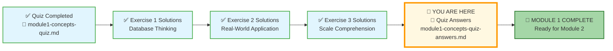
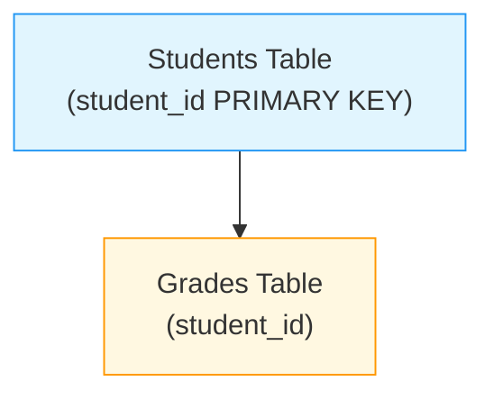



# 🗄️🤖 SQL & GenAI Course
**🎯 Quality Education for Anyone, Anywhere, Anytime — 💫 with Comfort, Convenience at no Cost**

## 📖 Module 1: Concepts Quiz – Answers & Explanations

Congratulations on completing the Module 1 quiz! Use this guide to check your answers and deepen your understanding. For each question, we've provided not just the correct answer, but the *reasoning* behind it – because understanding *why* is the Artisan's way.

---
## 🌌 SQLVerse Check-In

**You've almost completed your journey through Education Planet.** You've explored database thinking, connected real-world systems, and understood the scale at which the universe operates. Now, you're about to verify your knowledge by checking your quiz answers – the final step before earning your **SQLVerse Explorer** badge.

Remember: The difference between **knowing** the database and **owning** the database is about to be sealed. An **Artisan** owns the database.

**The difference between a coder and an Artisan is discipline.**

---

### 📍 Your Current Stage

You've completed the quiz and checked your answers. Now it's time to review the exercise solutions and then return to the Module 1 Guide for final reflection before starting Module 2.

---

### 📁 Solution Files Overview

| File | Purpose |
|------|---------|
| **module1-concepts-quiz-answers.md** (this file) | Detailed answers and explanations for the Module 1 quiz |
| **1-database-thinking-exercises-solutions.md** | Sample answers and reasoning for Exercise 1: Database Thinking |
| **2-real-world-application-solutions.md** | Sample answers and reasoning for Exercise 2: Real-World Application |
| **3-scale-comprehension-solutions.md** | Sample answers and reasoning for Exercise 3: Scale Comprehension |

Take time to review these solutions, compare them with your own answers, and reflect on any differences. Learning from multiple approaches is a key Artisan skill.

---

## 🧠 Quiz Solutions

### Part 1: Multiple Choice Answers

**1. What is a database?**
* ✅ **B) A structured collection of data managed by a DBMS, designed for efficient storage and retrieval**
* ❌ A) A collection of spreadsheets saved in a folder
* ❌ C) A type of computer used only by large corporations
* ❌ D) A software for creating pie charts

> **Why B is correct:** A database is fundamentally about structure and management. The DBMS (Database Management System) is what gives databases their power – it's the "engine" we talked about in File 1.

---

**2. Which of the following is a key advantage of databases over spreadsheets?**
* ✅ **B) Databases can handle billions of rows and concurrent users**
* ❌ A) Databases can only be used by one person at a time
* ❌ C) Databases require less storage space
* ❌ D) Databases are easier to set up than spreadsheets

> **Why B is correct:** This is the "Ocean vs. Aquarium" difference. Scale and concurrency are the superpowers of databases. Spreadsheets simply can't handle millions of users accessing data simultaneously.

---

**3. Which of the following scenarios is the most compelling reason for a business to switch from a spreadsheet to a database?**
* ✅ **B) The need for multiple employees to update and access interconnected data simultaneously without errors**
* ❌ A) The need to store information for more than one year
* ❌ C) The desire to create colorful charts and graphs for a weekly meeting
* ❌ D) The need to perform simple addition and subtraction on a list of 50 items

> **Why B is correct:** The "tipping point" is when data becomes interconnected and multiple people need to work with it at the same time. This is when spreadsheets break and databases shine.

---

**4. Which of these is a major consequence of "Data Integrity" failing in a hospital database?**
* ✅ **B) A patient is given the wrong medication because their record was confused with someone else's**
* ❌ A) The background color of the app changes
* ❌ C) The hospital's website takes 5 seconds longer to load
* ❌ D) The database requires more electricity to run

> **Why B is correct:** Data integrity isn't an abstract concept – it has real-world consequences. When integrity fails, lives can be at risk. This is why databases have built-in "guardrails" that spreadsheets lack.

---

**5. In a database table, what is a primary key?**
* ✅ **B) A unique identifier for each row (like a passport)**
* ❌ A) The first column in the table
* ❌ C) A column that can contain duplicate values
* ❌ D) A special key that unlocks the database

> **Why B is correct:** The "passport" metaphor from File 2 is exactly right. Just as your passport uniquely identifies you anywhere in the world, a primary key uniquely identifies each row in a table.

---

**6. What is the primary purpose of a "Foreign Key" in a database table?**
* ✅ **B) To act as a "thread" that links a record in one table to a unique record in another table**
* ❌ A) To prevent any duplicate data from ever being entered into that specific column
* ❌ C) To encrypt sensitive data
* ❌ D) To provide a summary of all the numerical data in a table

> **Why B is correct:** The "thread" metaphor from Exercise 2 captures it perfectly. A foreign key is the connection that weaves tables together into a relational system.

---

**7. You are designing a database for a library. Which of the following would be the most appropriate set of tables?**
* ✅ **B) Books, Authors, Members, Loans**
* ❌ A) Library_Name, Total_Books, Address
* ❌ C) Page_1, Page_2, Page_3
* ❌ D) Title, Author_Name, Genre, Member_Name

> **Why B is correct:** Each of these represents a distinct "entity" or "thing" in the library system. They capture the core nouns of the domain – what the library needs to track.

---

**8. Why is it a "best practice" to use an AI Co-pilot in "Student Mode" rather than just asking for the final SQL code?**
* ✅ **B) To build "mental muscle" and ensure you understand the logic before relying on automation**
* ❌ A) Because AI is incapable of writing correct SQL code
* ❌ C) Because Student Mode makes the AI respond faster
* ❌ D) Because professional developers never use AI

> **Why B is correct:** This is the heart of the "Foundation First" philosophy. You're building neural pathways, not just collecting answers. The struggle is where the learning happens.

---

**9. In the ACQUIRE phase, what is the role of your AI Co-pilot (Tab 3)?**
* ✅ **B) To provide conceptual explanations and answer "what is" questions**
* ❌ A) To write SQL code for you
* ❌ C) To debug your queries automatically
* ❌ D) To replace your need to learn SQL

> **Why B is correct:** During ACQUIRE, the AI is a dictionary and a tutor – not a ghostwriter. This boundary is what ensures you build genuine understanding.

---

**10. You find a column named `student_id` in both a "Students" table and a "Grades" table. In the "Grades" table, this column is likely a:**

* ✅ **B) Foreign Key**
* ❌ A) Primary Key
* ❌ C) Database Engine
* ❌ D) Data Type

> **Why B is correct:** The arrow shows the relationship. The `student_id` in the `Grades` table points back to (references) the `student_id` in the `Students` table. That's the definition of a foreign key – it's the "thread" connecting two tables.

---

### Part 2: True or False

**11.** A database can have multiple tables, but they cannot be related to each other.
* **✅ FALSE** – The power of a relational database is precisely that tables *can* and *should* be related. Relationships are what make data meaningful.

**12.** A primary key column can contain duplicate values.
* **✅ FALSE** – Uniqueness is the entire point of a primary key. It's the "passport" that guarantees each record can be identified separately.

**13.** Databases are only used by large companies like Amazon and Facebook.
* **✅ FALSE** – Every modern app, even small ones, uses a database. Your phone alone has dozens of databases for contacts, messages, photos, and apps.

**14.** Spreadsheets are great for collaboration among hundreds of users at the same time.
* **✅ FALSE** – This is where spreadsheets break down. Databases are designed for exactly this kind of concurrent access.

**15.** The `student_id` in a `payments` table that links to a `students` table is an example of a foreign key.
* **✅ TRUE** – Exactly. It's the thread connecting a payment record to the student who made it.

**16.** Google Search uses a database to index the internet.
* **✅ TRUE** – One of the largest and most sophisticated databases in existence. Every search queries this massive index.

**17.** In Module 1, we wrote our first SQL queries to retrieve data.
* **✅ FALSE** – Module 1 was purely conceptual. We built mental models. SQL writing begins in Module 2.

---

### Part 3: Short Answer (Sample Responses)

**18. Explain the difference between a primary key and a foreign key in your own words.**

> A **Primary Key** is the unique ID for a record within its own table (like your ID number on your birth certificate). A **Foreign Key** is that same ID appearing in a *different* table to create a link (like your ID number appearing on a school transcript).

**19. Give one real‑world example of a situation where a database would be absolutely necessary and a spreadsheet would fail. Explain why.**

> A global banking system. A spreadsheet would fail because millions of people need to withdraw money at the exact same second (concurrency), and the data must be 100% accurate (integrity) across billions of transactions. One corrupted cell could drain thousands of accounts.

**20. Why did we spend so much time on concepts and analogies (like the ocean/asteroid and the passport) before touching any SQL?**

> To build a "mental map." SQL syntax is just a language; the concepts are the ideas you're expressing. If you understand *why* data needs to be separated and linked, learning the code becomes a simple matter of translation rather than a confusing chore.

**21. In your own words, what does it mean to use AI as a "thinking partner" rather than a "search engine"?**

> A search engine gives you answers; a thinking partner gives you understanding. When you ask AI "Why does this work?" instead of "Write this for me," you're building your own mental muscles. It's the difference between watching someone lift weights and doing the lift yourself.

---

### Part 4: Apply Your Knowledge (Sample Table Design)

**22. Online Store Database Design**

| Table Name | Columns (include at least 3) | Primary Key |
|------------|-------------------------------|-------------|
| **Customers** | `customer_id` (PK), `name`, `email`, `join_date` | `customer_id` |
| **Products** | `product_id` (PK), `product_name`, `price`, `category` | `product_id` |
| **Orders** | `order_id` (PK), `customer_id` (FK), `order_date`, `total_amount` | `order_id` |

> **Note:** The `customer_id` in the `Orders` table is a foreign key linking each order to the customer who placed it.

**23. Response to Excel‑only business friend:**

> "Excel is great for your current size, but as you grow, you'll face problems that Excel can't solve: multiple people editing at once, data getting corrupted, and reports taking forever to generate. A database prevents these headaches and scales with your business. Think of it as trading a rowboat for a ship before you cross the ocean."

---

### Part 5: Scenario Analysis (Sample Responses)

**24. Small Business Dilemma – Bakery Signs to Switch:**

1. Multiple staff members getting "File is locked" errors when trying to update the spreadsheet simultaneously.
2. Difficulty tracking which customer bought which item without re‑typing names and order details constantly.
3. The spreadsheet becoming slow or crashing as the row count grows beyond 50,000 rows.

**25. Scale Imagination – Uber Challenges with 10 Million Users:**

*Remember the **Aquarium vs. Ocean** and **Asteroid vs. Solar System** analogies – think about the massive scale of data a successful ride-sharing app would generate.*

- **Latency:** Finding the nearest driver among millions in milliseconds requires sophisticated indexing and optimization.
- **Concurrency:** Handling 100,000 ride requests happening at the exact same second from different cities.
- **Data Volume:** Storing trillions of GPS data points to calculate fair pricing, track driver locations, and optimize routes.
- **Real‑time Updates:** Every driver's location updates constantly – that's a firehose of data that must be processed instantly.

---

## 🏆 The Socratic Scorecard

Use this guide to assess your readiness for Module 2.

| Score Range | Level | Recommendation |
|-------------|-------|----------------|
| **18–25 Correct** | 🏅 **Master Architect** | You have internalized the "Solar System" mindset. You understand not just the facts, but the *why* behind them. You are ready for Module 2. |
| **10–17 Correct** | 🛠️ **Journeyman** | You have a solid grasp of the basics. Review the "Passport vs. Thread" concepts and the difference between spreadsheets and databases before starting SQL. |
| **Below 10** | 🎓 **Apprentice** | Re‑visit Concept Files 1 and 2. Ask your AI Consultant to explain "Relational Databases" using a new analogy. The foundation must be solid before you build upon it. |

---

## 🎉 What's Next?

You've completed Module 1! You now possess:

- ✅ A clear understanding of what databases are and why they matter
- ✅ Mental models for tables, rows, columns, schemas, and keys
- ✅ The ability to think about real‑world systems as collections of related data
- ✅ A working relationship with your AI Co‑pilot as a thinking partner
- ✅ A growing Vault of notes, exercises, and reflections

**Module 2 awaits, where you'll write your first SQL queries and command the data to appear!**

---

## 🧭 Evaluation Navigation

```mermaid
flowchart LR
    A["✅ Quiz Completed<br/>📝 module1-concepts-quiz.md"] --> B
    B["✅ Exercise 1 Solutions<br/>Database Thinking"] --> C
    C["✅ Exercise 2 Solutions<br/>Real-World Application"] --> D
    D["✅ Exercise 3 Solutions<br/>Scale Comprehension"] --> E
    E["✅ COMPLETED<br/>📖 Quiz Answers<br/>module1-concepts-quiz-answers.md"] --> F
    F["🎉 MODULE 1 COMPLETE<br/>Ready for Module 2"] --> G
    G["🔄 Return to Module 1 Guide<br/>for Reflection & Begin Module 2"]
    
    style A fill:#e1f5fe,stroke:#4caf50,stroke-width:2px
    style B fill:#e1f5fe,stroke:#4caf50,stroke-width:2px
    style C fill:#e1f5fe,stroke:#4caf50,stroke-width:2px
    style D fill:#e1f5fe,stroke:#4caf50,stroke-width:2px
    style E fill:#e1f5fe,stroke:#4caf50,stroke-width:4px
    style F fill:#a5d6a7,stroke:#2e7d32,stroke-width:2px
    style G fill:#fff8e1,stroke:#ff9800,stroke-width:2px
```

| Previous Step | Next Step |
|:---:|:---:|
| [← Back to Concepts Quiz](../3-quizCheckpoint/module1-concepts-quiz.md) | [Return to Module 1 Guide →](../MODULE1_GUIDE.md) |

---

*Part of our mission for 🎯 Quality Education for Anyone, Anywhere, Anytime — 💫 with Comfort, Convenience at no Cost.*

**Level 1 | Module 1 | Quiz Solutions | Next: Module 1 Guide**