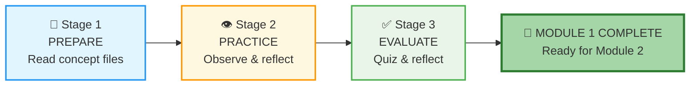
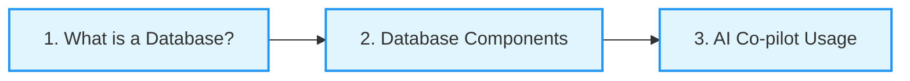
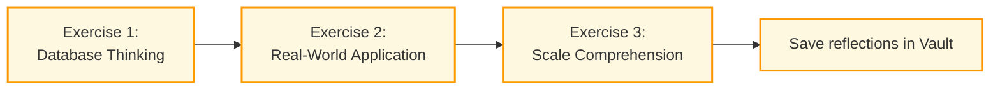
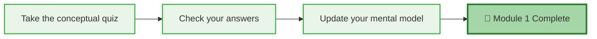

# 🗄️🤖 SQL & GenAI Course
**🎯 Quality Education for Anyone, Anywhere, Anytime — 💫 with Comfort, Convenience at no Cost**

## 🗺️ Module 1 Guide: Your Conceptual Foundation

This guide follows the **PREPARE → PRACTICE → EVALUATE** rhythm. After each stage, you'll return to this Guide to reflect and track your progress before beginning the next stage.

---

<div align="center" style="border: 2px solid #ff9800; border-radius: 8px; padding: 15px; margin: 20px 0; background: #fff8e1;">

### 📍 Your Position in the 4 A's Journey

| Phase | Current Module | AI Role |
|-------|----------------|---------|
| **🔴 ACQUIRE** (Weeks 1-4) | **Module 1: Introduction to Databases** | **Conceptual Guide Only** |

**You are here:** Building your mental model *before* writing any SQL.

</div>

---

## 🏢 **The Browser Office: Your Universal Launchpad**

**🚀 Kickstart: Any Computer, Any Browser, Anytime.**  
**🌍 Destination: Any country, Any city, Any Platform.**

### **📋 The Standard Four-Tab Setup (Levels 1 & 2)**
The Browser Office transforms any computer with a browser into a complete learning environment—no installations, universally accessible.

| Tab | Purpose | Tools & Examples | Description |
| :--- | :--- | :--- | :--- |
| **1: The Map** | Learning content & navigation | Course Repository (GitHub) | Your central hub for all course materials, module guides, and resources. |
| **2: The Factory** | Hands-on practice | SQLite Online | An online SQL environment where you'll run queries and experiment with databases. |
| **3: The Consultant** | AI assistance & explanations | ChatGPT, Claude, Gemini | Your AI learning partner, configured to provide conceptual guidance without writing code for you. |
| **4: The Vault** | Progress tracking & portfolio | GitHub Web, notes | Your personal GitHub repository where you'll store all your work, reflections, and completed exercises. |

> **Keyboard Shortcuts:** `Ctrl+1` / `Cmd+1` for Tab 1, `Ctrl+2` / `Cmd+2` for Tab 2, `Ctrl+3` / `Cmd+3` for Tab 3, `Ctrl+4` / `Cmd+4` for Tab 4.

---

### 🔧 **Need Help?**

| 🔧 Troubleshooting | 🔄 Workflow | ⌨️ Tab Operations |
| :---: | :---: | :---: |
| [Troubleshooting Common Issues](../../../Setup/STEP1_COMMISSION_BROWSER_OFFICE.md) | [Browser Office Workflow](../../../Setup/STEP2_ESTABLISH_LEARNING_RITUAL.md) | [Tab Operations & Shortcuts](../../../Setup/STEP3_MASTER_TAB_OPERATIONS.md) |

---

## 🏢 **Your Browser Office for Module 1 (Conceptual Mode)**

🚀 Foundation First, AI Next, Projects Last.  
💎 Gemstone by Gemstone, Skill by Skill.

For this module, here's exactly how to use each tab:

| Tab | Purpose | Tools & Examples for This Module | Description |
| :--- | :--- | :--- | :--- |
| **1: The Map** | Learn core concepts | • [What is a Database?](./1-sqlCommands/1-what-is-a-database.md)<br>• [Database Components](./1-sqlCommands/2-database-components.md)<br>• [AI Co-pilot Usage](./1-sqlCommands/3-ai-copilot-usage.md) | Read these three concept files in order to build your foundational understanding. |
| **2: The Factory** | Visual exploration (not querying yet) | • Open **`training_institution_sample.db`** – just LOOK at the tables in the left panel<br>• Open **`level1_estore_basic.db`** – observe table names, column names<br>• **No queries written this module** | Use SQLite Online to explore the structure of real databases. No querying—just observation. |
| **3: The Consultant** | Conceptual Q&A only | • "What's the difference between a database and a spreadsheet?"<br>• "Why are tables called tables?"<br>• "How will the AI help me learn SQL?"<br>❌ **NO SQL – conceptual only** | Ask your AI conceptual questions to deepen understanding. Never ask for SQL code. |
| **4: The Vault** | Concept notes & mental models | • Save concept notes to: `Learning/Level-1-beginner/Level1-1-ACQUIRE/Module1-Introduction-Database-AICo-pilot/1-sqlCommands/`<br>• Draw your own mental models<br>• Answer reflection questions | Store all notes, reflections, and mental models in your personal GitHub repository. |

---

<div style="border: 2px solid #f44336; border-radius: 10px; padding: 15px; margin: 20px 0; background: #ffebee;">

### 🔴 **Your ACQUIRE Foundation**

| 🗄️ Database Ecosystem | 📚 Knowledge Base | 🧠 Mindset Tuning |
| :---: | :---: | :---: |
| [Database Ecosystem](../../Guides/Section1-ACQUIRE/2_Database_Ecosystem.md) | [Knowledge Base (Vault)](../../Guides/Section1-ACQUIRE/3_Knowledge_Base.md) | [Mindset Tuning](../../Guides/Section1-ACQUIRE/4_Mindset.md) |

</div>

---

## 📚 **Deep Philosophy: Why Conceptual First?**

### **The House Analogy**
Imagine someone handed you a hammer and said "build a house" without ever explaining what walls are, why foundations matter, or how rooms connect. You'd hammer randomly and probably hurt yourself.

SQL is the hammer. Databases and tables are the *structure* you're building on.

This module is you walking around a finished house, understanding: "Ah, this is a wall. This is a room. This is how they connect." Then, when you pick up the hammer in Module 2, you know exactly what you're building.

### **The Browser Office in Conceptual Mode**
Even though you're not writing queries, your four tabs still work together:
- **Tab 1:** Reads concepts and builds understanding
- **Tab 2:** Shows you *real* databases – you see tables, you observe structure
- **Tab 3:** Answers your "what is" questions conceptually
- **Tab 4:** Captures your mental models for future reference

You're learning the system before using the system. This is the Artisan's way.

---
## 📈 The PREPARE → PRACTICE → EVALUATE Rhythm

This guide follows a three‑stage rhythm designed to build your conceptual foundation step by step.



| Stage | Folder | Purpose |
|-------|--------|---------|
| **📘 PREPARE** | `1-sqlCommands/` | Learn core concepts |
| **👁️ PRACTICE** | `2-practiceExercises/` | Observe real databases and think like a data professional |
| **✅ EVALUATE** | `3-quizCheckpoint/` + `4-exerciseAndQuizSolutions/` | Check your understanding |

**Important:** After each stage, you'll complete a reflection in this Guide before moving to the next stage. When you finish all three stages, you'll be ready to proceed to Module 2.

---

# 📘 STAGE 1: PREPARE – Core Concepts



Read these three files **in order**. They build your mental model from the ground up. Use **Tab 1 (The Map)** to access them, and **Tab 3 (The Consultant)** for any conceptual questions.

| File | What You'll Learn | Outcome |
|------|-------------------|---------|
| **📘 File 1: What is a Database?** | Discover the invisible engine behind every app, learn the difference between spreadsheets and databases, and understand why databases are mission‑critical for modern business. | You can explain what a database is using a simple analogy and name three real‑world applications that rely on databases. |
| **📘 File 2: Database Components: What's Under the Hood** | Meet the building blocks: tables, rows, columns, and schemas. See how they work together to organize millions of records, and visualize the "ocean vs. drop" scale difference from spreadsheets. | You can describe the structure of a table (rows and columns) and explain how a schema organizes multiple tables. |
| **📘 File 3: AI Co-pilot: Your SQL Learning Partner** | Learn how to use AI as a conceptual explainer (not a code generator), discover the "3‑Question Rule" for deeper understanding, and explore sample prompts you can use right now. | You can formulate effective conceptual questions for the AI and know when and how to use it during your learning. |

---

### 🚀 Kickstart Your Journey

➡️ **[Begin Your Stage 1: What is a database?](./1-sqlCommands/1-what-is-a-database.md)**  
*Take this step. This opens the gate to Module 1.*

---

### ✅ STAGE 1 COMPLETE – READY FOR NEXT STAGE

**🎉 Congratulations!** You've built a solid understanding of the core database engine. You have learned the fundamentals of databases before using SQL.

**Proceed to Next Stage:**
➡️ **📖 Next Step:** Read the **STAGE 2** section below  
   **🎯 Action:** Start your next stage of the Foundation Building journey.

<div align="center" style="border: 1px solid #2196f3; padding: 15px; margin: 20px 0; background: #e3f2fd; border-radius: 8px;">

### ✅ **BEFORE YOU BEGIN STAGE 2**

**What are the 3 impressive milestones you achieved in your STAGE 1 journey?**

1. _________________________________________
2. _________________________________________
3. _________________________________________

**Document these 3 foundational insights in your Vault.**

*This step marks your official completion of STAGE 1.*

**Ready for the next stage? Proceed to STAGE 2 below.**  

</div>

---

# 👁️ STAGE 2: PRACTICE – Observe, Think, Apply



Now you'll apply what you learned by working through three practice exercises. These are designed to deepen your understanding **without writing SQL**. All exercises are in the **[`2-practiceExercises/`](./2-practiceExercises/)** folder. Complete them in order.

| Exercise | What You'll Do | Outcome |
|----------|----------------|---------|
| **1. Database Thinking Exercise** | Reflect on core concepts and test your intuition with thought experiments. | You can articulate why certain data scenarios require a database over a spreadsheet and identify potential table structures from everyday situations. |
| **2. Real-World Application** | Identify databases in everyday life and think about how they might be structured. | You can look at a common system (e.g., a library, an online store) and visualize the tables and relationships that would power it. |
| **3. Scale Comprehension** | Grasp the massive scale at which databases operate – from thousands to trillions of records. | You can explain the concept of scale in databases and appreciate why performance and design matter in real‑world applications. |

For each exercise, use **Tab 2 (The Factory)** to open the sample databases if you need a visual reference, and **Tab 3 (The Consultant)** to ask clarifying questions. Save your answers and reflections in **Tab 4 (The Vault)** at:
```
Learning/Level-1-beginner/Level1-1-ACQUIRE/Module1-Introduction-Database-AICo-pilot/2-practiceExercises/
```

---

### 🚀 Continue Your Journey

➡️ **[Begin Stage 2: Database Thinking Exercise](./2-practiceExercises/1-database-thinking-exercises.md)**  
*Practice transforms knowledge into understanding.*

---

### ✅ STAGE 2 COMPLETE – READY FOR NEXT STAGE

**🎉 Great work!** You've practiced thinking like a data professional and explored real-world database applications.

**Proceed to Next Stage:**
➡️ **📖 Next Step:** Read the **STAGE 3** section below  
   **🎯 Action:** Start your final stage of the Foundation Building journey.

<div align="center" style="border: 1px solid #ff9800; padding: 15px; margin: 20px 0; background: #fff8e1; border-radius: 8px;">

### ✅ **BEFORE YOU BEGIN STAGE 3**

**What are the 3 most important insights you gained from the practice exercises?**

1. _________________________________________
2. _________________________________________
3. _________________________________________

**Document these insights in your Vault alongside your exercise reflections.**

*This step marks your official completion of STAGE 2.*

**Ready for the final stage? Proceed to STAGE 3 below.**  

</div>

---

# ✅ STAGE 3: EVALUATE – Quiz & Reflect



This stage confirms your understanding and solidifies your mental model.

### ✅ Your Evaluation Tasks

1. **Take the quiz:** Go to `3-quizCheckpoint/quiz.md`.
   - Answer the 5‑10 conceptual questions.
   - Write your answers in a new file `quiz_answers.md` inside your Vault at:
     ```
     Learning/Level-1-beginner/Level1-1-ACQUIRE/Module1-Introduction-Database-AICo-pilot/3-quizCheckpoint/
     ```

2. **Check your answers:** Open `4-exerciseAndQuizSolutions/quiz_solutions.md`.
   - Compare your answers with the solutions.
   - For any you missed, read the explanation carefully.

3. **Update your mental model:** Go back to your `my_mental_model.md` file (created in Stage 2) and add:
   - One new insight from the quiz.
   - One concept you want to remember for Module 2.

---

### 🚀 Complete Your Journey

➡️ **[Begin Stage 3: Take the Quiz](./3-quizCheckpoint/quiz.md)**  
*Evaluation turns knowledge into mastery.*

---

### ✅ STAGE 3 COMPLETE – MODULE 1 FINISHED

**🎉 Outstanding!** You have successfully evaluated your understanding and solidified your conceptual foundation.

<div align="center" style="border: 1px solid #4caf50; padding: 15px; margin: 20px 0; background: #e8f5e8; border-radius: 8px;">

### ✅ **REFLECT BEFORE MOVING ON**

**What was the most challenging concept in the quiz, and why?**

_______________________________________________________

**What is the one idea from this module that you will carry forward into SQL learning?**

_______________________________________________________

**Document these reflections in your Vault's `my_mental_model.md`.**

*This step marks your official completion of Module 1.*

</div>

---
## ✅ Module Completion Checklist

Before moving to Module 2, ensure you can:

- [ ] Explain to a friend: "A database is like a digital filing cabinet; tables are the drawers inside with organized folders."
- [ ] Open Tab 2, look at the tables in `training_institution_sample.db`, and name 3 tables you see.
- [ ] Point to a column name and explain what kind of data lives there.
- [ ] Describe the three phases of AI integration in this course (conceptual tutor, code accelerator, professional partner).
- [ ] Locate your saved concept notes and mental models in your Vault.
- [ ] Feel **ready and curious** for Module 2.

---


## 📚 Deep Philosophy: Why This Matters

### The Foundation You've Built

In an age where AI can generate SQL instantly, the most valuable professionals aren't those who can prompt best—they're those who **understand what the AI is doing** and can verify its work.

By spending time now on **concepts before code**, you've built:
- **Mental models** that will make every query meaningful
- **Intuition** for how data is organized
- **Curiosity** that turns "what" into "why"
- **Ownership** of your learning journey

### The Browser Office in Conceptual Mode

You've now used all four tabs in **conceptual mode**:
- **Tab 1:** Read and learned
- **Tab 2:** Observed real databases
- **Tab 3:** Asked conceptual questions
- **Tab 4:** Documented your understanding

This same rhythm—with Tab 2 becoming your query workshop—will carry you through the rest of Level 1.

---


# 💎 DESIGNER'S PERIGON

<div style="border: 3px solid #9c27b0; border-radius: 10px; padding: 20px; margin: 25px 0; background: linear-gradient(135deg, #f3e5f5 0%, #e1bee7 100%);">

### *Beyond SQL – Learning to Think with AI*

Welcome to the **SQLVerse** – where every domain is a planet and every database is a world to explore. You've just completed your first journey across **Education Planet**, learning the fundamental laws that govern all data: what databases are, how they're built, and how to learn with your AI guide, The Consultant.

**What Other Courses Tell You:**  
> "Here's how to use AI to write code faster."

**What the Designer's Perigon Reveals:**  
> "You've just learned something far more valuable than SQL syntax. You've learned **how to think with AI**."

</div>


---

## 🎨 The Art of Conversation

Your biggest takeaway from Module 1 isn't about databases or tables. It's this:

**You have learned to use your AI Assistant for healthy, conceptual discussion.**

Not as a crutch. Not as a code generator. But as a **thinking partner**.

When you asked:
- *"What's another analogy for a database?"*
- *"Why can't Excel handle what Facebook handles?"*
- *"What do beginners usually get wrong about tables?"*

You weren't just getting answers. You were practicing a **skill that will outlast any syntax** – the art of productive conversation with AI.

---

## 🚀 Why This Matters for Your Projects

When you start building real projects in later modules, this skill becomes your superpower:

| Instead of Asking | You'll Learn to Ask |
|-------------------|---------------------|
| "Write SQL for a budget tracker" | "What tables would a budget tracker need? How should they relate?" |
| "Fix my query" | "My query returns unexpected results. What concepts might I be misunderstanding?" |
| "Make this faster" | "What are the tradeoffs between different approaches to this problem?" |

You can discuss:
- **Project Architecture** – "Should I use three tables or four? What are the design considerations?"
- **Documentation Tools** – "How do professionals document database schemas? What tools do they use?"
- **Table Design** – "Is this normalized? Should it be?"
- **Any thought that comes to mind** about your project.

---

## 🌟 The Artisan's Truth

> **You're not just learning SQL. You're learning to think – with AI as your companion, not your replacement.**

This single skill – the ability to have productive, conceptual conversations with AI – will serve you across every project, every technology, every career change. It's the meta‑skill that makes all other skills easier to learn.

**And you've already begun.**

> *"On Education Planet, you learned to walk. Soon, on E-Commerce and HR Planets, you'll learn to run. And through it all, your Consultant will be there – not to carry you, but to help you find your own path."*

*Walk through your day tomorrow and notice: where else could a thoughtful conversation with AI help you think more clearly? The skill transfers. The mindset grows. The Artisan emerges.*

</div>

---

## 🎉 MODULE 1 COMPLETE

<div align="center" style="border: 3px solid #4caf50; border-radius: 10px; padding: 25px; margin: 30px 0; background: linear-gradient(135deg, #e8f5e8, #c8e6c9);">

### ✅ Congratulations, You've Built Your Conceptual Foundation!

**You have successfully:**
- Learned what databases are and why they matter
- Understood tables, rows, columns, and schemas
- Practiced thinking like a data professional
- Evaluated your understanding through quiz and reflection
- Established the ground rules for your AI Co-pilot

---

### 🎓 **Your Achievement Awaits**

You've successfully completed Module 1! Your journey from curious observer to **SQLVerse Explorer** is complete.

**View your official certificate here:**  
[📜 **MODULE 1 CERTIFICATE →**](./MODULE1_GRADUATION.md)

*Print it, share it, celebrate it. Then return here to continue your journey.*

---

<div align="center" style="border: 1px solid #2196f3; padding: 20px; margin: 30px 0; background: #e1f5fe; border-radius: 8px;">

### 💎 **REFLECT BEFORE YOU PROCEED**

**What was the most powerful insight you gained from understanding database fundamentals? How has your view of everyday technology changed?**

_______________________________________________________
_______________________________________________________

**Which concept from this module do you think will be most essential when you start writing SQL in Module 2?**

_______________________________________________________

*Document these reflections in your Vault. They're the evidence of your evolution from Observer to Explorer.*

</div>

---

### 🚀 **Ready for the Next Adventure?**

You are now ready for Module 2, where you'll write your first SQL queries!


# [▶️ **PROCEED TO MODULE 2: SELECT & WHERE**](../Module2-BasicRetrieval-SelectAndWhere/README.md)

</div>


*Part of our mission for 🎯 Quality Education for Anyone, Anywhere, Anytime — 💫 with Comfort, Convenience at no Cost.*

**Level 1 | Module 1 Guide | Conceptual Foundation | Next: Module 2 – SELECT & WHERE**