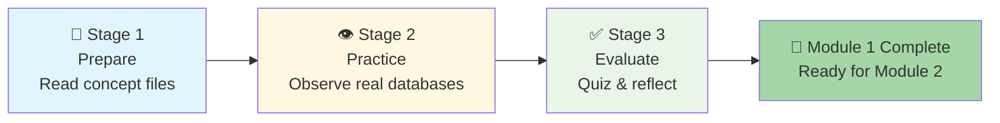



# 🗄️🤖 SQL & GenAI Course
**🎯 Quality Education for Anyone, Anywhere, Anytime — 💫 with Comfort, Convenience at no Cost**

## 📖 Module 1: Introduction to Databases & Your AI Co-pilot

Welcome to your first module! This is a **conceptual foundation** – no SQL yet. You'll learn what databases actually are (conceptually and physically), how they're structured, and how to establish the ground rules for interacting with your AI Co-pilot (Tab 3) to ensure you are learning, not just copying.

## 📊 **Your ACQUIRE Journey – Where You Are Now**

```mermaid
flowchart LR
    A["<span style='font-size:14px'>💎<br/>ACQUIRE INDUCTION<br/>Foundation Gemstone Collection<br/>🤖 AI: Conceptual Polishing ONLY</span>"]
    B["<span style='font-size:14px; font-weight:bold; background-color:#fff8e1'>📍 YOU ARE HERE<br/>📘 MODULE 1<br/>Introduction to Databases<br/>Conceptual Foundation</span>"]
    C["<span style='font-size:14px'>🔍<br/>MODULE 2<br/>SELECT & WHERE<br/>Basic Data Retrieval</span>"]
    D["<span style='font-size:14px'>📊<br/>MODULE 3<br/>Sorting, Aggregation, Grouping<br/>Organizing & Summarizing</span>"]
    E["<span style='font-size:14px'>🔗<br/>MODULE 4<br/>Joining Tables<br/>Combining Data Sources</span>"]
    F["<span style='font-size:14px'>💎<br/>FOUNDATION BUILT<br/>4 Core Modules Mastered<br/>Factory Protocol Active</span>"]
    G["<span style='font-size:14px'>🏆<br/>ACQUIRE COMPLETE<br/>✅ Watch Me → Now You Do It<br/>✅ Dual-Phase Mastery</span>"]
    
    A --> B --> C --> D --> E --> F --> G
    
    style A fill:#fff8e1,stroke:#ff9800,stroke-width:2px
    style B fill:#fff8e1,stroke:#ff9800,stroke-width:4px
    style C fill:#e1f5fe,stroke:#2196f3,stroke-width:2px
    style D fill:#e1f5fe,stroke:#2196f3,stroke-width:2px
    style E fill:#e1f5fe,stroke:#2196f3,stroke-width:2px
    style F fill:#a5d6a7,stroke:#2e7d32,stroke-width:2px
    style G fill:#81c784,stroke:#2e7d32,stroke-width:3px
```

### 📍 You Are Here
- **Phase:** 🔴 ACQUIRE (Weeks 1‑4)
- **Module:** 1 of 4 – Introduction to Databases
- **Mode:** Conceptual (no code)

---
## 🎯 Quick Overview

| Goal | Understand databases, tables, and AI's role |
|------|---------------------------------------------|
| Time | 1‑2 days (no pressure) |
| Structure | **Prepare → Practice → Evaluate** (three simple stages) |

---

## 🧭 **Your Learning Compass for This Module**

**Journey Stage:** Foundation Building – **Conceptual Orientation** (No SQL yet!)  
**AI Co-pilot Role:** Conceptual Explainer – answers "what is" questions only  
**Primary Goal:** Understand what databases and tables are, how they organize data, and how your AI Co-pilot will support your learning – **before writing a single line of SQL**

**What This Means for You:**
- **🧠 Mindset Focus:** You cannot command what you do not understand. This module builds your mental model of how data lives and breathes. No typing – just thinking, visualizing, and understanding.
- **🤖 AI Guidelines:** Your Consultant (Tab 3) can answer questions like "What is a database?" "What's the difference between a table and a spreadsheet?" "How will the AI help me learn?" – but will never show SQL. That comes later.
- **🎯 Success Metric:** By module's end, you can explain to a complete beginner: what a database is, what a table is, how they relate, why this structure powers the modern world, and how your AI Co-pilot fits into your learning journey.

> **Philosophical Anchor:** "Before the architect draws blueprints, they must understand what a foundation is. This module is your understanding of the ground beneath all data work."

---

## 🎯 **Learning Objectives**

By completing this module, you will be able to:

1. **Define** what a database is in plain, simple language.
2. **Explain** what a table is and how it organizes data into rows and columns.
3. **Distinguish** between a database, a table, a row, and a column.
4. **Identify** common real-world examples of databases (banking, e-commerce, social media).
5. **Describe** the role of your AI Co-pilot in this course and how it will support your learning at each stage.
6. **Articulate** why understanding this foundation matters before learning SQL.

---

## 🏢 **The Browser Office: Your Universal Launchpad**

**🚀 Kickstart: Any Computer, Any Browser, Anytime.**  
**🌍 Destination: Any country, Any city, Any Platform.**

### **📋 The Standard Four-Tab Setup (Levels 1 & 2)**
The Browser Office transforms any computer with a browser into a complete learning environment—no installations, universally accessible.

| Tab | Purpose | Tools & Examples | Keyboard Shortcut |
| :--- | :--- | :--- | :--- |
| **1: The Map** | Learning content & navigation | Course Repository (GitHub) | `Ctrl+1` / `Cmd+1` |
| **2: The Factory** | Hands-on practice | SQLite Online | `Ctrl+2` / `Cmd+2` |
| **3: The Consultant** | AI assistance & explanations | ChatGPT, Claude, Gemini | `Ctrl+3` / `Cmd+3` |
| **4: The Vault** | Progress tracking & portfolio | GitHub Web, notes | `Ctrl+4` / `Cmd+4` |

---

## 📋 **Prerequisites**

Before beginning Module 1, ensure you have:

- [ ] **Induction Verification Complete:** You scored 10+ points on the **[Post-Calibration Readiness Test](../../Guides/SECTION1_INDUCTION_FINISH.md)**
- [ ] **Browser Office Open:** All four tabs configured and accessible
- [ ] **Databases Loaded (just to LOOK):** Both `.db` files open in Tab 2 – you're just observing, not querying
- [ ] **Student Mode Active:** Your Consultant (Tab 3) configured with the Student Mode prompt
- [ ] **Vault Ready:** Your GitHub repository structure matches Pillar 3 requirements
- [ ] **Curiosity Activated:** You're ready to understand, not yet to do

---

## 🧠 **Mindset: The Power of Understanding First**

### **Why No SQL in Module 1?**
Most courses throw you into `SELECT * FROM table` on Day 1. You type, it works, you feel smart – but you don't actually understand what just happened.

This course does the opposite.

**You will not write a single SQL query in Module 1.** Not one. Instead, you will:
- Understand what a database *is*
- See how tables organize data
- Recognize that rows = records, columns = attributes
- Know why this structure exists
- Understand how your AI Co-pilot will support you at each stage

Then, when you write your first `SELECT` in Module 2, you'll understand **what you're actually doing**. The syntax becomes meaningful because the concept is already in place.

### **The 3-Attempt Rule? Not Yet**
The 3-Attempt Rule applies to writing queries. Since you're not writing any, you don't need it here. Instead, practice the **3-Question Rule**:

1. **What do I think this means?** (your intuition)
2. **What does the material say?** (check Tab 1)
3. **What does the Consultant explain?** (ask Tab 3 conceptually)

### **The Struggle Log? Optional**
If any concept feels confusing, absolutely log it. But this module is designed to be low-stress – pure understanding, no performance pressure.

---

## 📈 Your Three‑Stage Journey

**📘 Stage 1: Prepare** – Build your foundation by reading three concept files. You'll learn what databases are, how they're structured, and how to use your AI Co-pilot effectively.

**👁️ Stage 2: Practice** – Apply your knowledge by observing real databases. Explore tables and columns, and work through exercises that train you to think like a data professional.

**✅ Stage 3: Evaluate** – Confirm your understanding with a short conceptual quiz. Reflect on what you've learned and update your mental model before moving on.

Each stage is fully explained in the **Module 1 Guide**. You'll find detailed instructions, mermaid diagrams for every step, and links to all the files you need.

---
## 🚀 **Ready to Begin?**

No typing. No syntax. No pressure. Just understanding.

**Ready? Let's begin your conceptual foundation.**

# [▶️ **GO TO MODULE 1 GUIDE**](./MODULE1_GUIDE.md)

*Part of our mission for 🎯 Quality Education for Anyone, Anywhere, Anytime — 💫 with Comfort, Convenience at no Cost.*

**Level 1 | Module 1: Introduction to Databases & AI Co-pilot | Conceptual Foundation | Next: Module 1 Guide**