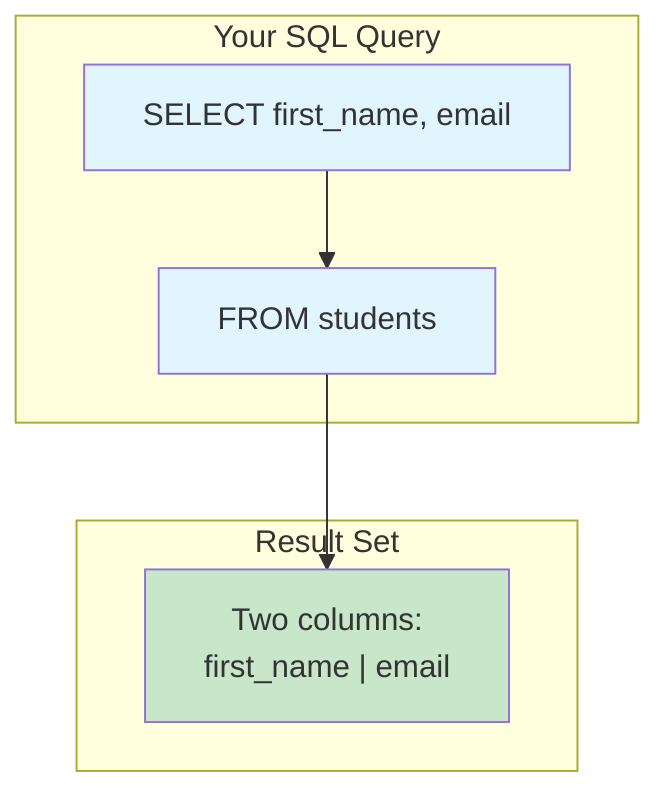
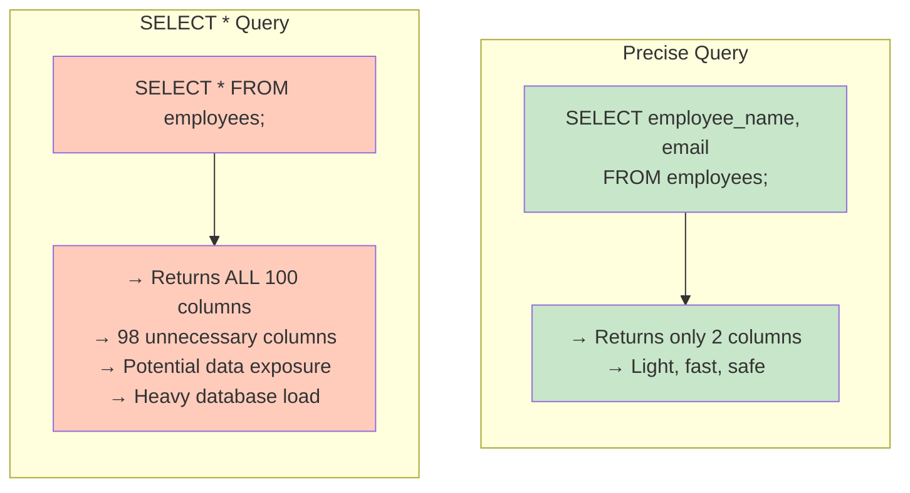

# 🗄️🤖 SQL & GenAI Course
**🎯 Quality Education for Anyone, Anywhere, Anytime — 💫 with Comfort, Convenience at no Cost**

## 📘 File 1: The SELECT Clause – Your First Command

Welcome to your first real SQL command! This is where you stop thinking *about* data and start **commanding** it. The `SELECT` statement is how you ask a database for specific information. Think of it as shining a flashlight into a dark room – you get to see exactly what you point at.

---

### 📍 Your Current Stage – PREPARE Journey

```mermaid
flowchart LR
    A["📍 YOU ARE HERE<br/>📘 File 1<br/>The SELECT Clause"] --> B
    B["📘 File 2<br/>The WHERE Clause"] --> C
    C["📘 File 3<br/>Logical Operators"] --> D
    D["📘 File 4<br/>IN & BETWEEN"] --> E
    E["📘 File 5<br/>LIKE & Wildcards"] --> F
    F["📘 File 6<br/>NULL Handling"] --> G
    G["📘 File 7<br/>DISTINCT & Aliases"] --> H
    H["✅ PREPARE COMPLETE"] --> I
    I["🔄 RETURN TO MODULE GUIDE<br/>TO BEGIN PRACTICE SECTION"]
    
    style A fill:#e1f5fe,stroke:#2196f3,stroke-width:4px
    style B fill:#e1f5fe,stroke:#2196f3,stroke-width:2px
    style C fill:#e1f5fe,stroke:#2196f3,stroke-width:2px
    style D fill:#e1f5fe,stroke:#2196f3,stroke-width:2px
    style E fill:#e1f5fe,stroke:#2196f3,stroke-width:2px
    style F fill:#e1f5fe,stroke:#2196f3,stroke-width:2px
    style G fill:#e1f5fe,stroke:#2196f3,stroke-width:2px
    style H fill:#fff8e1,stroke:#ff9800,stroke-width:2px
    style I fill:#e8f5e8,stroke:#4caf50,stroke-width:2px
```



You're in **Stage 1: PREPARE**, working through seven concept files. This is the first file – your very first SQL command. After completing all seven, you'll return to the Module Guide to begin the PRACTICE stage.

---

## 🔧 Enhanced Browser Office for PREPARE

**🚀 Kickstart: Any Computer, Any Browser, Anytime.**  
**🌍 Destination: Any country, Any city, Any Platform.**

| Tab | Purpose | What to Do |
| :--- | :--- | :--- |
| **1: The Map** | Read concept files | You're here – reading this file. Next up: `2-the-where-clause.md`. |
| **2: The Factory** | Run queries | Keep **[`training_institution_sample.db`](../../../Resources/sample_databases/training_institution_sample.db)** loaded in Tab 2. Run every example query you see in this file. |
| **3: The Consultant** | Conceptual Q&A | Ask about syntax, what `SELECT` does, or why a query returns certain results. **Configure AI with [Student Mode Prompt](../../../STUDENT_MODE_PROMPT_LEVEL1.md) which prevents code generation by default.** |
| **4: The Vault** | Save your work | Save your successful queries in: `Learning/Level-1-beginner/Level1-1-ACQUIRE/Module2-BasicRetrieval-SelectAndWhere/1-sqlCommands/` |

---

### 🛠️ Module 2 Toolkit

🚀 Foundation First, AI Next, Projects Last.  
💎 Gemstone by Gemstone, Skill by Skill.

| | | | |
|---|---|---|---|
| **Browser Office** | 🔧 [Troubleshooting Common Issues](../../../Setup/STEP1_COMMISSION_BROWSER_OFFICE.md) | 🔄 [Browser Office Workflow](../../../Setup/STEP2_ESTABLISH_LEARNING_RITUAL.md) | ⌨️ [Tab Operations & Shortcuts](../../../Setup/STEP3_MASTER_TAB_OPERATIONS.md) |
| **ACQUIRE Section** | 🗄️ [Database Ecosystem](../../Guides/Section1-ACQUIRE/2_Database_Ecosystem.md) | 📚 [Knowledge Base (Vault)](../../Guides/Section1-ACQUIRE/3_Knowledge_Base.md) | 🧠 [Mindset Tuning](../../Guides/Section1-ACQUIRE/4_Mindset.md) |

---

## 🧠 Understanding the DBMS: The Engine Behind the Database

Before we dive into SQL, let's clarify a concept we touched in Module 1: the **Database Management System (DBMS)**.

A **database** is just a collection of data – like a digital filing cabinet. But a **DBMS** is the software that lets you interact with that cabinet: open drawers, add files, search, sort, and secure everything. It's the engine that makes a database useful.

### Spreadsheet vs. DBMS

| Aspect | Spreadsheet | DBMS |
|--------|-------------|------|
| **What it is** | A single file you open with Excel/Sheets | A software system that manages data (e.g., MySQL, PostgreSQL, SQLite) |
| **Data storage** | Cells in a grid | Tables with strict structure, relationships, and rules |
| **Access** | Usually one person at a time | Thousands of users concurrently |
| **Security** | Basic password on file | Granular user permissions, encryption, audit logs |
| **Scale** | Slows down after ~100,000 rows | Handles billions of rows efficiently |
| **Query language** | Formulas and filters | SQL (Structured Query Language) |

The DBMS we're using in this course is **SQLite** – a lightweight, file‑based DBMS. When you load a `.db` file in SQLite Online, you're actually connecting to a DBMS that reads that file. It's perfect for learning because it requires no setup and runs anywhere.

> 💡 **Key Insight:** SQL is the language you speak to the DBMS. The DBMS translates your commands into actions on the actual data files.

---

## 🎯 What You'll Learn

By the end of this file, you will be able to:

- Write a basic `SELECT` statement
- Retrieve all columns from a table using `SELECT *`
- Retrieve specific columns by name
- Understand the difference between `SELECT *` and selecting individual columns
- Add comments to your SQL code
- Run your first queries and see results

---

## 📊 Our Practice Table: `students`

For all examples in this file, we'll use the **`students`** table from the Training Institution database. Here's what it looks like:

| student_id | first_name | last_name | email | phone | enrollment_date | total_fees | fees_paid |
|------------|------------|-----------|-------|-------|-----------------|------------|-----------|
| 101 | Sarah | Chen | sarah.chen@email.com | 555-0101 | 2024-01-15 | 4500.00 | 3000.00 |
| 102 | Mike | Rodriguez | mike.rod@email.com | 555-0102 | 2024-01-20 | 5200.00 | 5200.00 |
| 103 | Jessica | Park | jessica.park@email.com | 555-0103 | 2024-02-01 | 4500.00 | 2000.00 |
| 104 | David | Thompson | david.t@email.com | 555-0104 | 2024-02-10 | 4800.00 | 4800.00 |
| 105 | Lisa | Johnson | lisa.j@email.com | 555-0105 | 2024-02-15 | 5200.00 | 3000.00 |
| 106 | Alex | Kumar | alex.kumar@email.com | 555-0106 | 2024-03-01 | 4500.00 | 4500.00 |
| 107 | Maria | Garcia | maria.g@email.com | 555-0107 | 2024-03-10 | 3800.00 | 2000.00 |
| 108 | James | Wilson | james.w@email.com | 555-0108 | 2024-03-15 | 5200.00 | 0.00 |
| 109 | Priya | Patel | priya.p@email.com | 555-0109 | 2024-04-01 | 4500.00 | 1500.00 |
| 110 | Carlos | Mendez | carlos.m@email.com | 555-0110 | 2024-04-05 | 3800.00 | 3800.00 |

*(10 rows total – you can see them all in your Factory!)*

---

## 🤔 When Should You Use SELECT?

### ✅ Use SELECT When:
1. **Retrieving data** – anytime you need to see information from the database.
2. **Exploration** – checking what's in a table (`SELECT * FROM table;`).
3. **Answering questions** – "What are the names of our students?"
4. **Building reports** – extracting specific columns for analysis.
5. **Data validation** – confirming data was inserted or updated correctly.

### ❌ Avoid SELECT When:
1. **You need to modify data** – use `INSERT`, `UPDATE`, or `DELETE` instead.
2. **You're creating or altering database structures** – that's the job of `CREATE`, `ALTER`, and other DDL commands.


**The Artisan's Rule:**  
> *"SELECT is your window into the database. Use it intentionally – show only what you need, when you need it. In production, where tables can be massive, always pair SELECT with precise filters (coming in File 2) to keep your queries fast, safe, and respectful of the database's power."*

---

## 🧱 The Anatomy of a Basic Query

The `SELECT` statement is the most used command in SQL. It is how you tell the database, *"Of all the information you have, I only want to see these specific pieces."*

A SQL query is essentially a sentence. The most basic version has two parts:

1. **SELECT:** Which columns do you want?
2. **FROM:** Which table are they in?

Here's a visual of how the query flows:



**Question:** How do we retrieve a list of student first names and their email addresses?

```sql
SELECT first_name, email 
FROM students;
```

**Try it now in Tab 2.**  
**Expected Result:** A two‑column table showing each student's first name next to their email.  
**What you're seeing:** The database returned exactly the columns we asked for, in the order we specified. The `FROM` clause told it which table to look in.

---

## 🔍 Your First Query: SELECT *

The simplest query asks for **everything** from a table. The asterisk (`*`) means "all columns."

**Question:** What does the entire `students` table look like?

```sql
SELECT * FROM students;
```

**Try it now in Tab 2.**  
**Expected Result:** All 10 rows of the `students` table, with every column displayed.  
**What you're seeing:** The asterisk `*` is a shortcut that tells the database "give me every column." This is great for your learning session where we have a handful of data in the dataset, but use it sparingly in production.

> 💡 **Pro Tip:** `SELECT *` is great for exploration, but in real projects, you'll usually specify exactly which columns you want. Why? Less data = faster queries.

---

## 🎯 Selecting Specific Columns

Instead of taking everything, you can ask for exactly what you need. List column names after `SELECT`, separated by commas.

**Question:** How can we get a simple list of student first names and their last names?

```sql
SELECT first_name, last_name FROM students;
```

**Try it now in Tab 2.**  
**Expected Result:** A clean, two‑column list of all students' first and last names.  
**What you're seeing:** Only the columns we requested appear. The database filters out all other columns, giving us exactly what we need.

**Question:** Can we change the order of columns in the output?

```sql
SELECT last_name, first_name FROM students;
```

**Try it now in Tab 2.**  
**Expected Result:** Same data, but now last names appear first, followed by first names.  
**What you're seeing:** The database respects the order you specify in `SELECT`. This lets you control how your output looks without changing the underlying table.

---

### 🚿 The "Sieve" Metaphor

Imagine the `students` table is a bucket of mixed materials (name, email, phone, enrollment date, fees).

- `SELECT *` is like dumping the whole bucket out – you get everything, but you have to sift through the pile.
- `SELECT first_name` is like using a sieve that only lets the "first name" particles through. You get exactly what you need, nothing extra.

This is the essence of SQL: you control exactly what data comes back. (In File 2, you'll add a **Guardrail** – the `WHERE` clause – to filter rows, not just columns.)

---

### 🏛️ The Artisan's Guardrail: Syntax vs. Logic

- **Syntax** is the spelling and grammar – the commas, the semicolons, the correct keywords.
- **Logic** is what you are actually asking for – the meaning behind your query.

Take this query:

```sql
SELECT first_name, last_name, email FROM students;
```

- **Syntax rules:**  
  1. Column names must be separated by commas.  
  2. The query must end with a semicolon.  
  3. Keywords (`SELECT`, `FROM`) must be spelled correctly.

- **The underlying LOGIC:**  
  *"I want to list the first name, last name, and email address of all students."*

SQL defines the **grammar**.  
You decide the **logic** based on your requirement.

**Question:** What happens if we make a syntax error?

```sql
-- Let's intentionally forget a comma
SELECT first_name last_name FROM students;
```

**Try it now in Tab 2.**  
**Expected Result:** An error message like "near 'last_name': syntax error".  
**What you're seeing:** The database is confused because without a comma, it thinks `last_name` is a nickname (alias) for `first_name` – and then it sees `FROM` where another column or comma should be. Always separate column names with commas.

**Question:** What about a logical error – asking for a column that doesn't exist?

```sql
SELECT middle_name FROM students;
```

**Try it now in Tab 2.**  
**Expected Result:** An error: "no such column: middle_name".  
**What you're seeing:** Your grammar was perfect, but the logic was flawed – you asked for something that doesn't exist.

> 🔍 **Artisan Insight:** Syntax errors are easier to fix – the database tells you exactly where you mis‑spoke. Logical errors require you to think harder about what you really need. Both are essential parts of learning.

---

## 📝 Adding Comments

Comments help you remember what your query does. They're ignored by the database but read by humans (including future you!).

**Single-line comment:**

**Question:** How can we document our query for others (or our future selves)?

```sql
-- This query gets student contact info
SELECT first_name, last_name, email FROM students;
```

**Try it now in Tab 2.**  
**Expected Result:** The comment is ignored, and the query runs normally.  
**What you're seeing:** The double dash `--` tells the database to ignore everything after it on that line. It's just for us humans.

**Multi-line comment:**

```sql
/*
 * Student Contact Information
 * Used for sending newsletters
 * Announcing the new courses being introduced
 */
SELECT first_name, last_name, email FROM students;
```

**Try it now in Tab 2.**  
**Expected Result:** Same as before – comments ignored, query runs.  
**What you're seeing:** The `/* */` block lets you write longer notes spanning multiple lines.

---

## ⚠️ Common Mistakes (And How to Fix Them)

### Mistake 1: Forgetting the comma between columns

**Question:** What happens if we forget to separate column names with commas?

```sql
-- Wrong:
SELECT first_name last_name email FROM students;
```

**Try it now in Tab 2.**  
**Expected Result:** Error: "near 'last_name': syntax error".  
**What you're seeing:** The database tries to interpret `last_name` as an alias for `first_name`, then gets confused because more words follow. The fix: add commas.

**The fix:**
```sql
-- Right:
SELECT first_name, last_name, email FROM students;
```

---

### Mistake 2: Misspelling a column name

**Question:** What if we type a column name incorrectly?

```sql
-- Wrong:
SELECT first_nam FROM students;
```

**Try it now in Tab 2.**  
**Expected Result:** Error: "no such column: first_nam".  
**What you're seeing:** The column name doesn't match anything in the table. Check your spelling against the table schema.

**The fix:**
```sql
-- Right:
SELECT first_name FROM students;
```

---

### Mistake 3: Forgetting the semicolon

```sql
-- Wrong (in most SQL tools):
SELECT * FROM students
```

**The fix:**
```sql
-- Right:
SELECT * FROM students;
```

> 💡 **Pro Tip:** In many SQL tools, a missing semicolon causes an error. SQLite Online accepts it, but it's an excellent habit to **always end your statements with a semicolon**. It tells the database "this is the end of my query" and makes your code portable across different environments.

---

> 🔧 **Fix it:** If you get an error, read it carefully. The database is telling you exactly what's wrong. This is a conversation – listen to what it's saying. These tips apply to any mistake you encounter, not just the ones listed here.

---

## 🧪 Practice Challenges

Now it's your turn. Write these queries in your Factory and save each one in your Vault with the suggested filename.

**Challenge 1: The Contact List**  
Get a simple list of student first names and phone numbers.  
*Save as:* `1-1-contact-list.sql`  
*Expected:* Two columns: first_name and phone, for all students.

**Challenge 2: The Enrollment Report**  
Show last name, enrollment date, and total fees for each student.  
*Save as:* `1-2-enrollment-report.sql`  
*Expected:* Three columns with enrollment details.

**Challenge 3: The Student ID Card**  
Create a custom view with student ID, first name, last name, and email (in that order).  
*Save as:* `1-3-student-id-card.sql`  
*Expected:* Four columns showing each student's ID, first name, last name, and email.

**Challenge 4: The Commented Query**  
Write a query that retrieves `first_name` and `fees_paid`, with a comment explaining what it does.  
*Save as:* `1-4-commented-query.sql`  
*Expected:* A working query with a descriptive comment.

**Challenge 5: The Comma Detective**  
Write a query that selects `first_name` and `email` – but intentionally leave out the comma between them. Observe the error. Then fix it by adding the comma.  
*Save both attempts as:* `1-5-comma-detective.sql` (with comments).  
*Expected:* First query fails with a syntax error; second query works.

---

## 📋 SELECT Quick Reference Card

### Basic Syntax

| Pattern | Example | What It Does |
|---------|---------|--------------|
| `SELECT * FROM table;` | `SELECT * FROM students;` | Returns all columns |
| `SELECT col1, col2 FROM table;` | `SELECT first_name, email FROM students;` | Returns specific columns |
| `-- comment` | `-- Student list` | Adds a comment |

### Common Column Patterns

| You Want | Query |
|----------|-------|
| All student data | `SELECT * FROM students;` |
| Just names and emails | `SELECT first_name, last_name, email FROM students;` |
| Custom order | `SELECT email, first_name FROM students;` |

### Critical Rules

| Rule | Wrong ❌ | Right ✅ |
|------|---------|---------|
| **Separate columns with commas** | `SELECT first_name last_name` | `SELECT first_name, last_name` |
| **End with semicolon** | `SELECT * FROM students` | `SELECT * FROM students;` |
| **Column names must exist** | `SELECT middle_name` | `SELECT first_name` |

**Memory Aid:**  
> *"Commas between, semicolon at the end."*

**Save this reference in your Vault as:** `1-select-reference-card.md`

---

## ✅ Progress Check

After reading this and trying the examples, can you:

- [ ] Write a `SELECT *` query confidently?
- [ ] Select specific columns in any order?
- [ ] Add a comment to your SQL?
- [ ] Identify and fix a missing comma error?
- [ ] Read and understand a database error message?
- [ ] Save your working queries in your Vault?
- [ ] Explain the difference between syntax and logic?

**If yes → You're ready for File 2: The WHERE Clause!**

---

## 💎 DESIGNER'S PERIGON

<div style="border: 3px solid #9c27b0; border-radius: 10px; padding: 20px; margin: 25px 0; background: linear-gradient(135deg, #f3e5f5 0%, #e1bee7 100%);">


### *The Art of Asking*

You've just taken your first step into the **SQLVerse** – a universe where every domain is a planet and every database is a world waiting to be explored.

The examples you've seen so far come from **Education Planet** – our training ground. But the SQLVerse is vast:

| Domain (Real World) | Our Universe (SQLVerse) |
|---------------------|-------------------------|
| 🏫 Student Records | **Education Planet** |
| 🛒 Online Store | **E-Commerce Planet** |
| 🏢 Employee Data | **HR Planet** |
| 💳 Banking Transactions | **Fintech Planet** |

Throughout your journey, you'll visit all these worlds. The SQL you learn on Education Planet works **everywhere** – only the data changes, never the laws.

And your first law? The SELECT command you just wrote. But look closer – you didn't just "write code." You **asked a question**.

When you typed `SELECT first_name, last_name FROM students;`, you were essentially saying: *"Database, please show me the first and last names of every student you know."* And it answered instantly.

This is the beginning of a conversation. Every query is a question. Every result is an answer. The more precisely you ask, the more valuable the answers become.

---

### 🍽️ The Restaurant Menu

Imagine walking into your favorite restaurant. You don't shout, *"Bring me everything!"* to the waiter. You browse the menu and order exactly what you're in the mood for: maybe a warm bowl of **Tomato soup**, followed by the grilled salmon, and a slice of cheesecake.

**SQL is your waiter.** The table is the menu. `SELECT` is how you place your order:

```sql
SELECT tomato_soup, salmon, cheesecake FROM menu;
```

The kitchen (database) prepares only those dishes and serves them to you. No wasted effort, no overflowing plates. You get exactly what you asked for.

---

### 🎨 The Artist's Palette

A painter doesn't squeeze every tube of paint onto the palette. They study the scene, then choose a handful of colors – the exact shades needed to capture light, shadow, and emotion. The rest stay in the box, untouched, waiting for another canvas.

**You are the artist.** The database is your paint box. `SELECT` is your hand, reaching for precisely the columns you need to create your report, your analysis, your dashboard.

Every column you **don't** select is paint left in the tube – ready for another project, another day. This is artistry: knowing what to use, and having the wisdom to leave the rest.

---

### 🗣️ Reading Queries Aloud

Here's a secret that will unlock SQL for you: **every query you write can be spoken as an ordinary English sentence.**

Try it:

- `SELECT first_name, last_name FROM students;`  
  *"Select first name and last name from the students table."*

- `SELECT email, enrollment_date FROM students;`  
  *"Select email and enrollment date from the students table."*

When you're stuck, read your query aloud. If it sounds awkward in English, it's probably awkward in SQL. This simple trick trains your brain to think in the language of data.

---

### ❗ The Artisan's Warning: Why SELECT * Can Be Dangerous

In this course, `SELECT *` is fine – our tables are small. But in the real world, databases can be enormous. Imagine you're exploring the **HR Planet** in the SQLVerse, and you come across a table with **100 columns** – including sensitive data like `social_security_number`, `home_address`, or `bank_account_details`.

**The Intentional Way:**  
You write `SELECT employee_name, email FROM employees;`  
You get exactly **two pieces of data**. It's light, fast, and safe. You're a responsible citizen of the SQLVerse.

**The Dangerous Way:**  
You write `SELECT * FROM employees;`  
You accidentally pull **all 100 columns**. You've now dragged **98 pieces of data you didn't need** across the universe – some of it private, some of it sensitive – and you've forced the database to work **50 times harder** than necessary.



**Professionals avoid `SELECT *` for three reasons:**

1. **Performance:** Why ask the database to move 100 columns across the SQLVerse if you only need 2?
2. **Clarity:** Other Artisans exploring your query see exactly what data you're using.
3. **Security:** You might accidentally pull sensitive data you shouldn't see – a serious matter in any planet of the SQLVerse.

**The Artisan's Production Rule:**  
> *"Only ask for what you need. The SQLVerse is powerful – respect that power by using it wisely."*

---

### 🧭 The Artisan's Truth

> *"A craftsman doesn't just use tools – they converse with their materials. You've just spoken your first word in the language of data. And remember: only ask for what you need."*

> *"Precision is not about limitation – it's about intention. Every column you include should have a purpose. Every column you omit is a decision that keeps your work clear, fast, and meaningful."*
</div>

---

## 🧭 File Navigation

```mermaid
flowchart LR
    A["✅ COMPLETED<br/>📘 File 1<br/>The SELECT Clause"] --> B
    B["📘 File 2<br/>The WHERE Clause"] --> C
    C["📘 File 3<br/>Logical Operators"] --> D
    D["📘 File 4<br/>IN & BETWEEN"] --> E
    E["📘 File 5<br/>LIKE & Wildcards"] --> F
    F["📘 File 6<br/>NULL Handling"] --> G
    G["📘 File 7<br/>DISTINCT & Aliases"] --> H
    H["✅ PREPARE COMPLETE"] --> I
    I["🔄 RETURN TO MODULE GUIDE<br/>TO BEGIN PRACTICE SECTION"]
    
    style A fill:#e1f5fe,stroke:#4caf50,stroke-width:4px
    style B fill:#e1f5fe,stroke:#2196f3,stroke-width:2px
    style C fill:#e1f5fe,stroke:#2196f3,stroke-width:2px
    style D fill:#e1f5fe,stroke:#2196f3,stroke-width:2px
    style E fill:#e1f5fe,stroke:#2196f3,stroke-width:2px
    style F fill:#e1f5fe,stroke:#2196f3,stroke-width:2px
    style G fill:#e1f5fe,stroke:#2196f3,stroke-width:2px
    style H fill:#fff8e1,stroke:#ff9800,stroke-width:2px
    style I fill:#e8f5e8,stroke:#4caf50,stroke-width:2px
```



| Previous Step | Next Step |
|:---:|:---:|
| [← Back to Module 2 Guide](../MODULE2_GUIDE.md) | [Continue to File 2: The WHERE Clause →](./2-the-where-clause.md) |

---

*Part of our mission for 🎯 Quality Education for Anyone, Anywhere, Anytime — 💫 with Comfort, Convenience at no Cost.*

**Level 1 | Module 2 | File 1: The SELECT Clause | Next: [The WHERE Clause](./2-the-where-clause.md)**