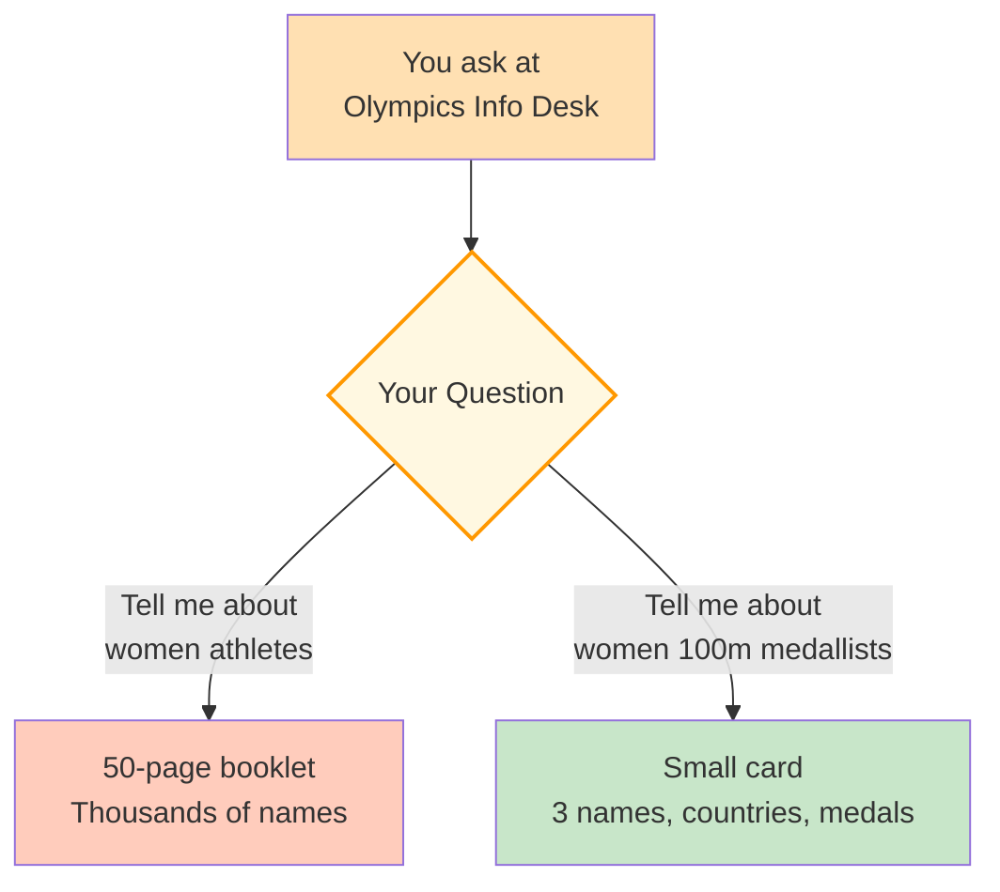
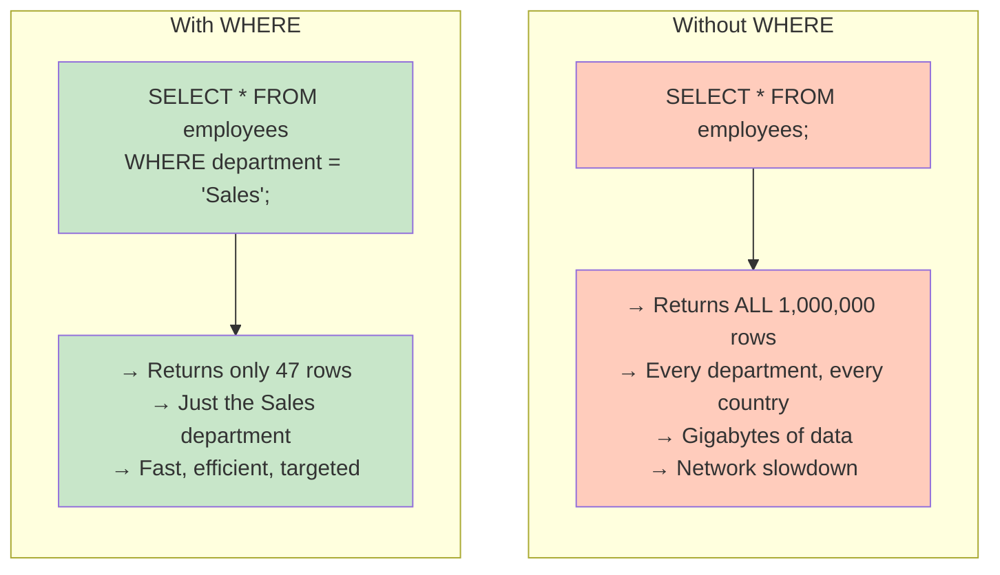

# 🗄️🤖 SQL & GenAI Course
**🎯 Quality Education for Anyone, Anywhere, Anytime — 💫 with Comfort, Convenience at no Cost**

## 📘 File 2: The WHERE Clause – Filtering Your Data

Congratulations! You've learned to retrieve data with `SELECT`. But often you don't want *all* rows – you want only the ones that meet certain conditions. That's where the `WHERE` clause comes in. It's the **guardrail** that lets you filter exactly what you see.

---

### 📍 Your Current Stage – PREPARE Journey

```mermaid
flowchart LR
    A["✅ COMPLETED<br/>📘 File 1<br/>The SELECT Clause"] --> B
    B["📍 YOU ARE HERE<br/>📘 File 2<br/>The WHERE Clause"] --> C
    C["📘 File 3<br/>Logical Operators"] --> D
    D["📘 File 4<br/>IN & BETWEEN"] --> E
    E["📘 File 5<br/>LIKE & Wildcards"] --> F
    F["📘 File 6<br/>NULL Handling"] --> G
    G["📘 File 7<br/>DISTINCT & Aliases"] --> H
    H["✅ PREPARE COMPLETE"] --> I
    I["🔄 RETURN TO MODULE GUIDE<br/>TO BEGIN PRACTICE SECTION"]
    
    style A fill:#e1f5fe,stroke:#4caf50,stroke-width:4px
    style B fill:#e1f5fe,stroke:#2196f3,stroke-width:4px
    style C fill:#e1f5fe,stroke:#2196f3,stroke-width:2px
    style D fill:#e1f5fe,stroke:#2196f3,stroke-width:2px
    style E fill:#e1f5fe,stroke:#2196f3,stroke-width:2px
    style F fill:#e1f5fe,stroke:#2196f3,stroke-width:2px
    style G fill:#e1f5fe,stroke:#2196f3,stroke-width:2px
    style H fill:#fff8e1,stroke:#ff9800,stroke-width:2px
    style I fill:#e8f5e8,stroke:#4caf50,stroke-width:2px
```



You're in **Stage 1: PREPARE**. You've mastered `SELECT`, now it's time to add filters. After completing all seven files, you'll return to the Module Guide to begin the PRACTICE stage.

---

## 🔧 Enhanced Browser Office for PREPARE

**🚀 Kickstart: Any Computer, Any Browser, Anytime.**  
**🌍 Destination: Any country, Any city, Any Platform.**

| Tab | Purpose | What to Do |
| :--- | :--- | :--- |
| **1: The Map** | Read concept files | You're here – reading this file. Next up: `3-logical-operators.md`. |
| **2: The Factory** | Run queries | Keep **[`training_institution_sample.db`](../../../Resources/sample_databases/training_institution_sample.db)** loaded. Run every example query. |
| **3: The Consultant** | Conceptual Q&A | Ask about comparison operators, `WHERE` syntax, or why results appear. **Configure AI with [Student Mode Prompt](../../../STUDENT_MODE_PROMPT_LEVEL1.md) (no code generation).** |
| **4: The Vault** | Save your work | Save successful queries in: `Learning/Level-1-beginner/Level1-1-ACQUIRE/Module2-BasicRetrieval-SelectAndWhere/1-sqlCommands/` |

---

### 🛠️ Module 2 Toolkit

🚀 Foundation First, AI Next, Projects Last.  
💎 Gemstone by Gemstone, Skill by Skill.

| | | | |
|---|---|---|---|
| **Browser Office** | 🔧 [Troubleshooting Common Issues](../../../Setup/STEP1_COMMISSION_BROWSER_OFFICE.md) | 🔄 [Browser Office Workflow](../../../Setup/STEP2_ESTABLISH_LEARNING_RITUAL.md) | ⌨️ [Tab Operations & Shortcuts](../../../Setup/STEP3_MASTER_TAB_OPERATIONS.md) |
| **ACQUIRE Section** | 🗄️ [Database Ecosystem](../../Guides/Section1-ACQUIRE/2_Database_Ecosystem.md) | 📚 [Knowledge Base (Vault)](../../Guides/Section1-ACQUIRE/3_Knowledge_Base.md) | 🧠 [Mindset Tuning](../../Guides/Section1-ACQUIRE/4_Mindset.md) |

---

## 🎯 What You'll Learn

By the end of this file, you will be able to:

- Write a `WHERE` clause to filter rows based on conditions
- Use comparison operators: `=`, `<>`, `>`, `<`, `>=`, `<=`
- Filter numbers and text  correctly
- Understand the order of execution: `FROM` → `WHERE` → `SELECT`
- Combine multiple conditions (preview of next file)

---

## 📊 Our Practice Table: `students`

We'll continue using the `students` table. Here's a reminder of its structure:

| student_id | first_name | last_name | email | phone | enrollment_date | total_fees | fees_paid |
|------------|------------|-----------|-------|-------|-----------------|------------|-----------|
| 101 | Sarah | Chen | sarah.chen@email.com | 555-0101 | 2024-01-15 | 4500.00 | 3000.00 |
| 102 | Mike | Rodriguez | mike.rod@email.com | 555-0102 | 2024-01-20 | 5200.00 | 5200.00 |
| 103 | Jessica | Park | jessica.park@email.com | 555-0103 | 2024-02-01 | 4500.00 | 2000.00 |
| 104 | David | Thompson | david.t@email.com | 555-0104 | 2024-02-10 | 4800.00 | 4800.00 |
| 105 | Lisa | Johnson | lisa.j@email.com | 555-0105 | 2024-02-15 | 5200.00 | 3000.00 |
| 106 | Alex | Kumar | alex.kumar@email.com | 555-0106 | 2024-03-01 | 4500.00 | 4500.00 |
| 107 | Maria | Garcia | maria.g@email.com | 555-0107 | 2024-03-10 | 3800.00 | 2000.00 |
| 108 | James | Wilson | james.w@email.com | 555-0108 | 2024-03-15 | 5200.00 | 0.00 |
| 109 | Priya | Patel | priya.p@email.com | 555-0109 | 2024-04-01 | 4500.00 | 1500.00 |
| 110 | Carlos | Mendez | carlos.m@email.com | 555-0110 | 2024-04-05 | 3800.00 | 3800.00 |

---

## 🤔 When Should You Use WHERE?

### ✅ Use WHERE When:
1. **Filtering rows** – you need only a subset of data that meets specific criteria.
2. **Answering targeted questions** – "Which students owe money?" or "Who enrolled after a certain date?"
3. **Data analysis** – focusing on a segment (e.g., high‑value customers, recent transactions).
4. **Data cleaning** – finding rows with missing or erroneous values (combined with `IS NULL` later).
5. **Building reports** – extracting only relevant records for a specific audience.

### ❌ Avoid WHERE When:
1. **You need all rows** – if you really want the whole table (in very small datasets like product category or department lists), skip `WHERE`.
2. **You're aggregating across all rows** – operations like counting totals or calculating averages often intentionally omit `WHERE`.

**The Artisan's Rule:**  
> *"WHERE is your precision tool. Use it to cut through the noise and find exactly what matters."*

---

## 🔍 Introducing the WHERE Clause

In File 1, you learned how to pick your columns (horizontal filtering). Now, you will learn how to pick your **rows** (vertical filtering). The `WHERE` clause is the most powerful tool for cutting through the noise to find the specific records that matter.

The `WHERE` clause goes after `FROM` and specifies which rows to keep. Think of it as a **filter** – only rows that satisfy the condition pass through.

**Question:** Which students have total fees greater than 4500?

```sql
SELECT first_name, last_name, total_fees
FROM students
WHERE total_fees > 4500;
```

**Try it now in Tab 2.**  
**Expected Result:** Mike (5200), Lisa (5200), James (5200).  
**What you're seeing:** The `WHERE` clause filtered out all rows where `total_fees` was not greater than 4500, leaving only the three students with higher fees.

---

## 🏛️ The Artisan's Guardrail: WHERE Comes After FROM

If `SELECT` is the sieve that chooses which columns fall through, `WHERE` is the **Guardrail** that stops certain rows from appearing in your results.

Without a `WHERE` clause, your query returns **every single row** in the table. In a small training database, that's fine. In a company like Amazon or Visa, that's a disaster.

The order of execution in a SQL query is important:

1. **FROM** – Identify the table
2. **WHERE** – Filter rows
3. **SELECT** – Choose columns

### 🧱 The Syntax: Adding the Filter

The `WHERE` clause always comes **after** the `FROM` clause.

```sql
SELECT column_names
FROM table_name
WHERE condition;
```

Even though you write `SELECT` first, the database thinks in this order. So you can only filter on columns that actually exist in the table (you can't use a column alias from `SELECT` in `WHERE` – we'll cover that later).

---

## ⚖️ Comparison Operators

To create a condition, you need to compare values. SQL uses standard mathematical symbols. Here are the most common operators you'll use in `WHERE`:

| Operator | Meaning | Example |
|----------|---------|---------|
| `=` | Equal to | `WHERE first_name = 'Sarah'` |
| `<>` or `!=` | Not equal to | `WHERE total_fees <> 4500` |
| `>` | Greater than | `WHERE fees_paid > 3000` |
| `<` | Less than | `WHERE enrollment_date < '2024-03-01'` |
| `>=` | Greater than or equal | `WHERE total_fees >= 5200` |
| `<=` | Less than or equal | `WHERE student_id <= 105` |

> 💡 **Important:** Text and Dates must be wrapped in **single quotes** (`'...'`). Numbers do not need quotes.

---

### 🏛️ The Artisan's Insight: Data Types Matter


Notice how we treat numbers and text differently:

* **Numbers:** `WHERE total_fees > 4000` (Math works here)
* **Text:** `WHERE first_name = 'Sarah'` (Single quotes are mandatory)

If you try to do math on a name (`WHERE first_name > 10`), the DBMS engine will stall because the data types don't match. Text matching behaviour (case sensitivity) varies by database — we'll explore this more in the **Filtering by Text** section below.

---

## 🔢 Filtering by Number

**Question:** Which students have paid exactly 5200.00?

```sql
SELECT first_name, last_name, fees_paid
FROM students
WHERE fees_paid = 5200.00;
```

**Try it now in Tab 2.**  
**Expected Result:** Mike Rodriguez  
**What you're seeing:** The condition `fees_paid = 5200.00` kept only the rows where the paid amount exactly matches 5200.00. Mike is the only one.

**Question:** Which students still owe money (paid less than total fees)?

```sql
SELECT first_name, last_name, total_fees, fees_paid
FROM students
WHERE fees_paid < total_fees;
```

**Try it now in Tab 2.**  
**Expected Result:** Sarah, Jessica, Lisa, Maria, James, Priya  
**What you're seeing:** The `<` operator compares two numbers, keeping rows where `fees_paid` is strictly less than `total_fees`. These students have an outstanding balance.

**Question:** Which students have paid exactly what they owe (no balance)?

This question requires comparing two columns — `fees_paid` and `total_fees` — rather than comparing a column to a fixed value.

```sql
SELECT first_name, last_name, total_fees, fees_paid
FROM students
WHERE fees_paid = total_fees;
```

**Try it now in Tab 2.**  
**Expected Result:** Mike, David, Alex, Carlos.  
**What you're seeing:** The condition checks for equality between two columns. Only rows where they match are returned. This is your first example of a **column-to-column comparison** — a pattern you'll use often when analysing data relationships.

---

## 📅 Filtering by Date

Dates are written as strings in the format `'YYYY-MM-DD'`.

**Question:** Which students enrolled after March 1, 2024?

```sql
SELECT first_name, last_name, enrollment_date
FROM students
WHERE enrollment_date > '2024-03-01';
```

**Try it now in Tab 2.**  
**Expected Result:** Maria, James, Priya, Carlos.  
**What you're seeing:** The `>` operator compares dates strictly. Alex (Mar 1) is excluded because `>` requires a date *after* March 1. To include the boundary, use `>=`.

---

## 📝 Filtering by Text

Text filters require single quotes. SQLite's default text comparison is case‑insensitive for ASCII characters, but this varies by database. As a safe habit, always match the exact capitalisation you're searching for.

**Question:** Which student is named 'Priya'?

```sql
SELECT first_name, last_name, email
FROM students
WHERE first_name = 'Priya';
```

**Try it now in Tab 2.**  
**Expected Result:** Priya Patel.  
**What you're seeing:** The condition `first_name = 'Priya'` matched exactly one row. If there were multiple Priyas, they'd all appear.

---

## 🧪 Practice Challenges

Now it's your turn. Write these queries in your Factory and save each one in your Vault with the suggested filename.

**Challenge 1: The Budget Students**  
Find students with total fees less than 4000.  
*Save as:* `2-1-budget-students.sql`  
*Expected:* Maria (3800), Carlos (3800)

**Challenge 2: The Named Student**  
Find the student with first name 'Carlos'.  
*Save as:* `2-2-carlos.sql`  
*Expected:* Carlos Mendez

**Challenge 3: The February Cohort**  
Find students enrolled on or after February 1, 2024.  
*Save as:* `2-3-february-cohort.sql`  
*Expected:* Jessica, David, Lisa, Alex, Maria, James, Priya, Carlos

**Challenge 4: The Fully Paid**  
Find students who have paid exactly what they owe (no balance).  
*Save as:* `2-4-fully-paid.sql`  
*Expected:* Mike, David, Alex, Carlos

**Challenge 5: The Small Payers**  
Find students who have paid 2000 or less.  
*Save as:* `2-5-small-payers.sql`  
*Expected:* Jessica (2000), Maria (2000), James (0)

**Challenge 6: The Debt Collector**  
Find all students who still owe money (paid less than total fees).  
*Save as:* `2-6-debt-collector.sql`  
*Expected:* Sarah, Jessica, Lisa, Maria, James, Priya

**Challenge 7: The Early Bird**  
Find students who enrolled before February 1, 2024.  
*Save as:* `2-7-early-bird.sql`  
*Expected:* Sarah, Mike

**Challenge 8: The High Roller**  
Find students whose total fees are exactly 5200.00.  
*Save as:* `2-8-high-roller.sql`  
*Expected:* Mike, Lisa, James

**Challenge 9: The Not-So-High Rollers**  
Find students whose total fees are **not** equal to 5200.00. Use the `<>` operator.  
*Save as:* `2-9-not-high-roller.sql`  
*Expected:* Sarah, Jessica, David, Alex, Maria, Priya, Carlos  
*What this teaches:* The `<>` operator (or `!=`) excludes specific values, giving you everything else.

---

## 📋 WHERE Quick Reference Card

### Basic Syntax

```sql
SELECT column1, column2
FROM table
WHERE condition;
```

### Comparison Operators

| Operator | Meaning | Example |
|----------|---------|---------|
| `=` | Equal to | `WHERE city = 'London'` |
| `<>` or `!=` | Not equal | `WHERE status <> 'inactive'` |
| `>` | Greater than | `WHERE price > 100` |
| `<` | Less than | `WHERE age < 18` |
| `>=` | Greater than or equal | `WHERE score >= 90` |
| `<=` | Less than or equal | `WHERE quantity <= 5` |

### Data Type Rules

| Data Type | How to Write | Example |
|-----------|--------------|---------|
| **Numbers** | No quotes | `WHERE total_fees > 5000` |
| **Text** | Single quotes | `WHERE first_name = 'Sarah'` |
| **Dates** | Single quotes, YYYY-MM-DD | `WHERE enrollment_date > '2024-01-01'` |

### Order of Execution

1. **FROM** – identifies the table
2. **WHERE** – filters rows
3. **SELECT** – picks columns

**Memory Aid:**  
> *"FROM the table, WHERE you filter, SELECT what you see."*

**Save this reference in your Vault as:** `2-where-reference-card.md`

---

## ✅ Progress Check

After reading this and trying the examples, can you:

- [ ] Write a `WHERE` clause with a comparison operator?
- [ ] Filter numbers correctly without quotes?
- [ ] Filter text with single quotes?
- [ ] Filter dates using the `YYYY-MM-DD` format?
- [ ] Explain the order of execution (`FROM` → `WHERE` → `SELECT`)?
- [ ] Save your working queries in your Vault?

**If yes → You're ready for File 3: Logical Operators!**

---

# 💎 DESIGNER'S PERIGON

<div style="border: 3px solid #9c27b0; border-radius: 10px; padding: 20px; margin: 25px 0; background: linear-gradient(135deg, #f3e5f5 0%, #e1bee7 100%);">

### *The Art of Precision*

Welcome back to the **SQLVerse**  – where every domain is a planet and every database is a world to explore. Today on **Education Planet**, you're learning to filter the noise and find what matters.

As you journey through the SQLVerse, remember the worlds that await:

| Domain (Real World) | Our Universe (SQLVerse) |
|---------------------|-------------------------|
| 🏫 Student Records | **Education Planet** |
| 🛒 Online Store | **E-Commerce Planet** |
| 🏢 Employee Data | **HR Planet** |
| 💳 Banking Transactions | **Fintech Planet** |

The SQL you learn here works **everywhere** – only the data changes, never the laws.

---

### 🏅 The Olympics Analogy

Imagine you're at the Paris Olympics 2024. You walk up to an information desk and ask:



| Your Question | What You Get |
|---------------|--------------|
| *"Tell me about women athletes."* | A 50‑page booklet listing every female athlete in every sport. Thousands of names. |
| *"Tell me about women 100m medallists."* | A small card with three names, their countries, and their medal times. |

**Same database. Same topic. Radically different answers.**

`SELECT` without `WHERE` is the 50‑page booklet – overwhelming, unfiltered, and full of noise.  
`WHERE` is the small card – precise, useful, and instantly actionable.

*In the age of AI and Big Data, the person who can find the needle in the haystack is more valuable than the person who can simply find the haystack.*

---

### 🧭 The Explorer's Compass

Every time you land on a new planet in the SQLVerse – whether it's Education, HR, or E-Commerce – your first command should be:

```sql
SELECT * FROM table_name LIMIT 5;
```

This simple query lets you:
- **Peek at the world's structure** – What columns exist? What kind of data lives here?
- **Sample without overloading** – Just 5 rows, not millions.
- **Plan your next move** – Before you write complex filters, know what you're filtering.

Think of it as stepping off your ship and taking a quick look around before venturing deeper. In the SQLVerse, a little exploration prevents a lot of headaches.

---

### 🗝️ The Artisan's Insight

In the beginning, you might be tempted to pull all the data and "look through it" yourself. Resist this. Every row you **filter out** at the database level saves energy, time, and mental bandwidth.

The database isn't just a storage room – it's a **search engine for your own data**. `WHERE` is how you tell it what matters.

Every condition you write is a **constraint** – a boundary that separates useful data from noise. The more precisely you constrain, the more valuable your answers become. This is the essence of thinking like an analyst: knowing exactly what to include and, just as importantly, what to leave out.

---

### ❗ The Artisan's Warning: Why Unfiltered Queries Can Be Dangerous

In File 1, you learned why selecting too many **columns** is wasteful across the SQLVerse. Now imagine selecting too many **rows**. On **HR Planet**, a table might have 1,000,000 employee records across dozens of countries. Without a `WHERE` clause, every query returns **everything**.

**The Intentional Way:**  
You add a `WHERE` clause that filters for employees in the Sales department. Your query now returns only **47 rows** – exactly what you need.

**The Dangerous Way:**  
You query `SELECT * FROM employees;`  
You pull **all 1,000,000 rows**. Gigabytes of data. Network slowdown. Potential crash.



**The Artisan's Warning:**

| Without WHERE | With WHERE |
|---------------|------------|
| Returns **every row** in the table | Returns only rows that match your condition |
| Can crash your database on large tables | Keeps queries fast and efficient |
| Forces you to sift through irrelevant data | Gives you exactly what you need |
| Wastes network bandwidth and memory | Respects system resources |

---

### 🧭 The Artisan's Truth

> *"SELECT without WHERE is like asking for the whole library when you only need one book. Be precise – filter your rows, not just your columns."*

> *"Precision isn't just about getting the right answer – it's about having the wisdom to ignore everything else."*

> *"And when you land on a new world, remember The Explorer's Compass: `SELECT * FROM table_name LIMIT 5;`. A quick look around before you dive deep."*

</div>

---

## 🧭 File Navigation

```mermaid
flowchart LR
    A["✅ COMPLETED<br/>📘 File 1<br/>The SELECT Clause"] --> B
    B["✅ COMPLETED<br/>📘 File 2<br/>The WHERE Clause"] --> C
    C["📘 File 3<br/>Logical Operators"] --> D
    D["📘 File 4<br/>IN & BETWEEN"] --> E
    E["📘 File 5<br/>LIKE & Wildcards"] --> F
    F["📘 File 6<br/>NULL Handling"] --> G
    G["📘 File 7<br/>DISTINCT & Aliases"] --> H
    H["✅ PREPARE COMPLETE"] --> I
    I["🔄 RETURN TO MODULE GUIDE<br/>TO BEGIN PRACTICE SECTION"]
    
    style A fill:#e1f5fe,stroke:#4caf50,stroke-width:4px
    style B fill:#e1f5fe,stroke:#4caf50,stroke-width:4px
    style C fill:#e1f5fe,stroke:#2196f3,stroke-width:2px
    style D fill:#e1f5fe,stroke:#2196f3,stroke-width:2px
    style E fill:#e1f5fe,stroke:#2196f3,stroke-width:2px
    style F fill:#e1f5fe,stroke:#2196f3,stroke-width:2px
    style G fill:#e1f5fe,stroke:#2196f3,stroke-width:2px
    style H fill:#fff8e1,stroke:#ff9800,stroke-width:2px
    style I fill:#e8f5e8,stroke:#4caf50,stroke-width:2px
```



| Previous Step | Next Step |
|:---:|:---:|
| [← Back to File 1: The SELECT Clause](./1-the-sieve-select.md) | [Continue to File 3: Logical Operators →](./3-logical-operators.md) |

---

*Part of our mission for 🎯 Quality Education for Anyone, Anywhere, Anytime — 💫 with Comfort, Convenience at no Cost.*

**Level 1 | Module 2 | File 2: The WHERE Clause | Next: [Logical Operators](./3-logical-operators.md)**

