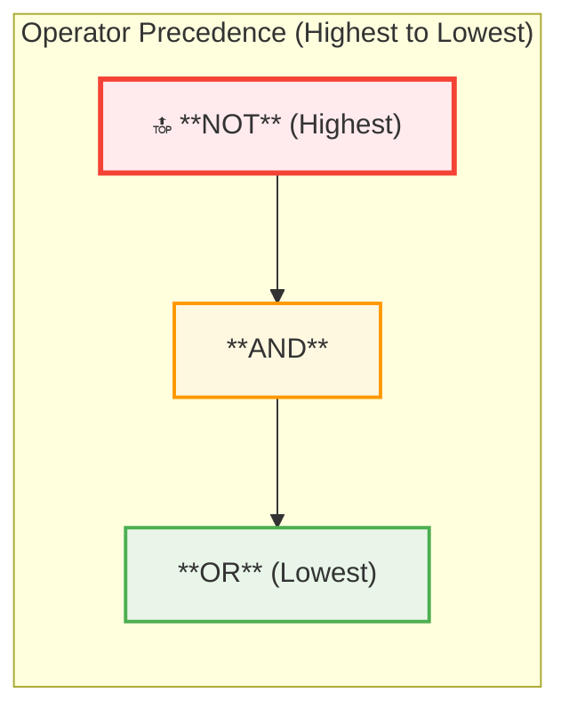
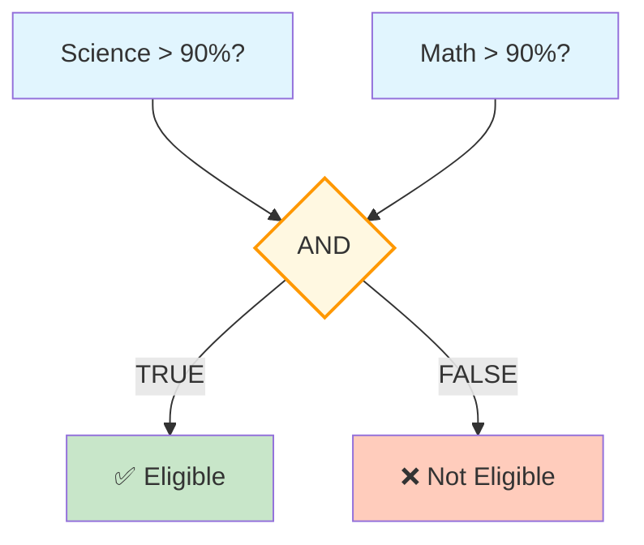
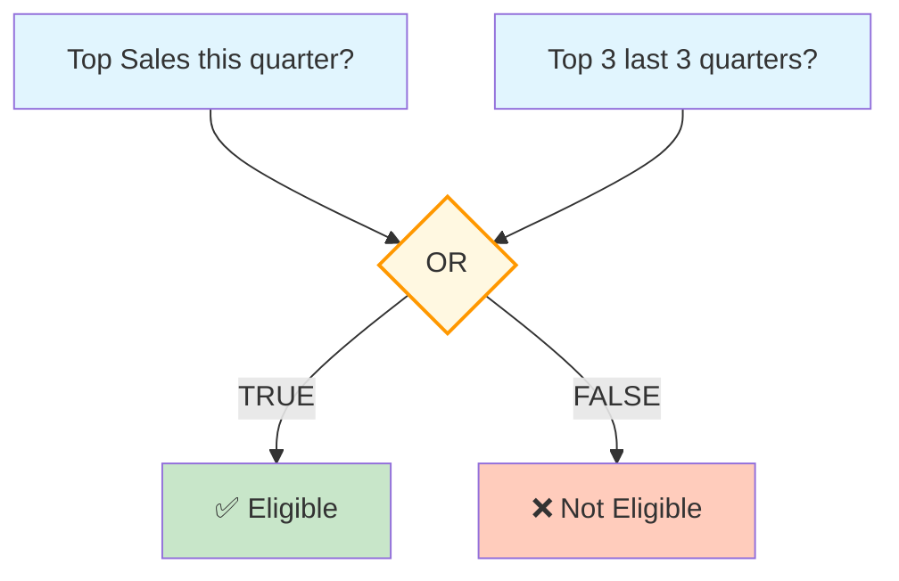
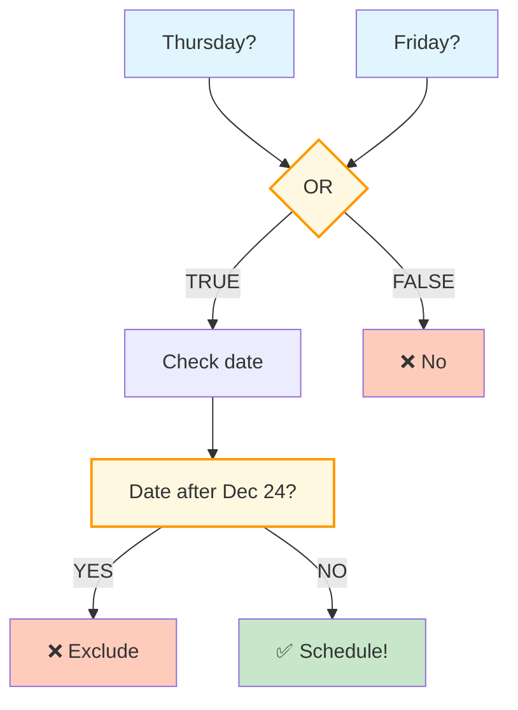

# 🗄️🤖 SQL & GenAI Course
**🎯 Quality Education for Anyone, Anywhere, Anytime — 💫 with Comfort, Convenience at no Cost**

## 📘 File 3: Logical Operators – Combining Conditions

Great work! You've mastered filtering with single conditions. But real‑world questions are rarely that simple. You often need to ask: *"Find students who live in New York **and** have paid their fees"* or *"Find students enrolled in Web Development **or** Data Science."* That's where logical operators come in. They let you combine multiple conditions into powerful, precise filters.

---

### 📍 Your Current Stage – PREPARE Journey


You're in **Stage 1: PREPARE**. You've mastered `SELECT` and single‑condition `WHERE`. Now you'll learn to combine conditions with logical operators. After completing all seven files, you'll return to the Module Guide to begin the PRACTICE stage.

---

## 🔧 Enhanced Browser Office for PREPARE

**🚀 Kickstart: Any Computer, Any Browser, Anytime.**  
**🌍 Destination: Any country, Any city, Any Platform.**

| Tab | Purpose | What to Do |
| :--- | :--- | :--- |
| **1: The Map** | Read concept files | You're here – reading this file. Next up: `4-in-between.md`. |
| **2: The Factory** | Run queries | Keep **[`training_institution_sample.db`](../../../Resources/sample_databases/training_institution_sample.db)** loaded. Run every example query. |
| **3: The Consultant** | Conceptual Q&A | Ask about `AND`/`OR`/`NOT`, operator precedence, or why a combined condition returns certain rows. **Configure AI with [Student Mode Prompt](../../../STUDENT_MODE_PROMPT_LEVEL1.md) (no code generation).** |
| **4: The Vault** | Save your work | Save successful queries in: `Learning/Level-1-beginner/Level1-1-ACQUIRE/Module2-BasicRetrieval-SelectAndWhere/1-sqlCommands/` |

---

### 🛠️ Module 2 Toolkit

🚀 Foundation First, AI Next, Projects Last.  
💎 Gemstone by Gemstone, Skill by Skill.

| | | | |
|---|---|---|---|
| **Browser Office** | 🔧 [Troubleshooting Common Issues](../../../Setup/STEP1_COMMISSION_BROWSER_OFFICE.md) | 🔄 [Browser Office Workflow](../../../Setup/STEP2_ESTABLISH_LEARNING_RITUAL.md) | ⌨️ [Tab Operations & Shortcuts](../../../Setup/STEP3_MASTER_TAB_OPERATIONS.md) |
| **ACQUIRE Section** | 🗄️ [Database Ecosystem](../../Guides/Section1-ACQUIRE/2_Database_Ecosystem.md) | 📚 [Knowledge Base (Vault)](../../Guides/Section1-ACQUIRE/3_Knowledge_Base.md) | 🧠 [Mindset Tuning](../../Guides/Section1-ACQUIRE/4_Mindset.md) |

---

## 🎯 What You'll Learn

By the end of this file, you will be able to:

- Use `AND` to require that **all** conditions are true
- Use `OR` to require that **at least one** condition is true
- Use `NOT` to exclude rows that match a condition
- Combine multiple operators in a single `WHERE` clause
- Understand operator precedence (order of evaluation)
- Use parentheses to control the logic

---

## 📊 Our Practice Table: `students`

We'll continue using the `students` table. Here's a quick refresher:

| student_id | first_name | last_name | email | phone | enrollment_date | total_fees | fees_paid |
|------------|------------|-----------|-------|-------|-----------------|------------|-----------|
| 101 | Sarah | Chen | sarah.chen@email.com | 555-0101 | 2024-01-15 | 4500.00 | 3000.00 |
| 102 | Mike | Rodriguez | mike.rod@email.com | 555-0102 | 2024-01-20 | 5200.00 | 5200.00 |
| 103 | Jessica | Park | jessica.park@email.com | 555-0103 | 2024-02-01 | 4500.00 | 2000.00 |
| 104 | David | Thompson | david.t@email.com | 555-0104 | 2024-02-10 | 4800.00 | 4800.00 |
| 105 | Lisa | Johnson | lisa.j@email.com | 555-0105 | 2024-02-15 | 5200.00 | 3000.00 |
| 106 | Alex | Kumar | alex.kumar@email.com | 555-0106 | 2024-03-01 | 4500.00 | 4500.00 |
| 107 | Maria | Garcia | maria.g@email.com | 555-0107 | 2024-03-10 | 3800.00 | 2000.00 |
| 108 | James | Wilson | james.w@email.com | 555-0108 | 2024-03-15 | 5200.00 | 0.00 |
| 109 | Priya | Patel | priya.p@email.com | 555-0109 | 2024-04-01 | 4500.00 | 1500.00 |
| 110 | Carlos | Mendez | carlos.m@email.com | 555-0110 | 2024-04-05 | 3800.00 | 3800.00 |

---

## 🤔 When Should You Use Logical Operators?

### ✅ Use Logical Operators When:
1. **Multiple criteria** – you need to filter based on more than one condition.
2. **Flexible matching** – you want records that meet ANY of several conditions (`OR`).
3. **Strict requirements** – you need records that meet ALL given conditions (`AND`).
4. **Exclusion** – you want to remove records that match a pattern (`NOT`).
5. **Complex business logic** – translating real‑world rules into SQL (e.g., "discount for loyalty program members OR first‑time buyers").

### ❌ Avoid Logical Operators When:
1. **Single condition suffices** – don't overcomplicate; use a simple `WHERE`.
2. **You can use simpler alternatives** – `IN` is often cleaner than multiple `OR`s.

**The Artisan's Rule:**  
> *"Use logical operators to build bridges between conditions. But keep your bridges simple and clear."*

---

## 🔗 Introducing Logical Operators

Logical operators let you combine multiple conditions in your `WHERE` clause. Think of them as the glue that builds complex questions.

- **`AND`** – All conditions must be true.
- **`OR`** – At least one condition must be true.
- **`NOT`** – Reverses a condition (true becomes false, false becomes true).

### 🏗️ The Three Pillars: AND, OR, NOT

| Operator | Rule | Outcome |
| --- | --- | --- |
| **`AND`** | **All** conditions must be true. | Narrower results (strict). |
| **`OR`** | **At least one** condition must be true. | Broader results (inclusive). |
| **`NOT`** | The condition must **not** be true. | Excludes specific rows. |

---

### 🧩 The AND Operator (The Strict Filter)

Use `AND` when you want to narrow down results – every condition must be satisfied.

**Question:** Which students have total fees over 4000 AND have paid more than 3000?

```sql
SELECT first_name, last_name, total_fees, fees_paid
FROM students
WHERE total_fees > 4000 AND fees_paid > 3000;
```

**Try it now in Tab 2.**  
**Expected Result:** Mike, David, Alex.  
**What you're seeing:** The `AND` operator kept only rows where both `total_fees > 4000` AND `fees_paid > 3000` were true.  
- Mike: 5200 > 4000 ✓, 5200 > 3000 ✓ → included  
- David: 4800 > 4000 ✓, 4800 > 3000 ✓ → included  
- Alex: 4500 > 4000 ✓, 4500 > 3000 ✓ → included  
- Sarah: 4500 > 4000 ✓, 3000 > 3000? No (equal, not greater) → excluded  
- Lisa: 5200 > 4000 ✓, 3000 > 3000? No → excluded  
- James: 5200 > 4000 ✓, 0 > 3000? No → excluded  

---

### 📊 The Strict Filter – AND Truth Table

| Condition 1 | Condition 2 | Result (`AND`) |
|:-----------:|:-----------:|:--------------:|
| TRUE        | TRUE        | TRUE           |
| TRUE        | FALSE       | FALSE          |
| FALSE       | TRUE        | FALSE          |
| FALSE       | FALSE       | FALSE          |

> **Only when both conditions are true does the row pass the filter.**

---

### 🧩 The OR Operator (The Wider Net)

Use `OR` when you want to broaden results – at least one condition must be true.

**Question:** Which students enrolled before February 1, 2024 OR after March 1, 2024?

```sql
SELECT first_name, last_name, enrollment_date
FROM students
WHERE enrollment_date < '2024-02-01' OR enrollment_date > '2024-03-01';
```

**Try it now in Tab 2.**  
**Expected Result:** Sarah, Mike, Maria, James, Priya, Carlos.  
**What you're seeing:**  
- Before Feb 1: Sarah (Jan 15), Mike (Jan 20) → included.  
- After Mar 1: Maria (Mar 10), James (Mar 15), Priya (Apr 1), Carlos (Apr 5) → included.  
- Excluded: Jessica (Feb 1), David (Feb 10), Lisa (Feb 15), Alex (Mar 1) – they satisfy neither condition.

---

### 📊 The Wider Net – OR Truth Table

| Condition 1 | Condition 2 | Result (`OR`) |
|:-----------:|:-----------:|:-------------:|
| TRUE        | TRUE        | TRUE          |
| TRUE        | FALSE       | TRUE          |
| FALSE       | TRUE        | TRUE          |
| FALSE       | FALSE       | FALSE         |

> **If at least one condition is true, the row passes.**

---

### 🧩 The NOT Operator (The Exclusion)

Use `NOT` to exclude rows that match a condition. While simple inequality can often be written with `<>` or `!=`, `NOT` shines when you need to negate a complex expression.

**Question:** Which students have total fees **not equal** to 4500? (The simple way)

```sql
SELECT first_name, last_name, total_fees
FROM students
WHERE total_fees <> 4500;   -- or use !=
```

**Try it now in Tab 2.**  
**Expected Result:** Mike, David, Lisa, James.  
**What you're seeing:** `<>` (or `!=`) means "not equal to". It's the most direct way to express inequality.

But what if you need to negate a more involved condition, like "students who are NOT (enrolled in Q1 AND have paid in full)"? That's where the `NOT` operator becomes essential.

**Question:** Which students are **not** from the set with last names 'Chen' or 'Patel'? (Using `NOT` with a complex condition)

```sql
SELECT first_name, last_name
FROM students
WHERE NOT (last_name = 'Chen' OR last_name = 'Patel');
```

**Try it now in Tab 2.**  
**Expected Result:** Mike, Jessica, David, Lisa, Alex, Maria, James, Carlos. (All except Sarah and Priya.)  
**What you're seeing:** `NOT` flips the truth of the entire expression inside parentheses. This is much clearer than trying to rewrite the logic with `AND` and `<>`.

> 💡 `NOT` is especially useful with operators like `IN`, `BETWEEN`, and `LIKE` – we'll see those in later files.

---

### 📊 The Exclusion – NOT Truth Table

| Condition | Result (`NOT`) |
|:---------:|:--------------:|
| TRUE      | FALSE          |
| FALSE     | TRUE           |

> **`NOT` simply flips the truth value – it turns TRUE into FALSE and FALSE into TRUE.**

---

### 🏛️ The Artisan's Guardrail: Operator Precedence

Just like in math ($2 + 3 \times 5$), SQL has an order of importance. `AND` is usually processed before `OR`. To avoid confusion and ensure your logic is correct, **always use parentheses** when mixing operators.

When you combine `AND` and `OR`, the order matters. SQL follows a precedence rule:

- `NOT` has the highest precedence
- `AND` comes next
- `OR` has the lowest precedence

**Question:** What happens when we mix `AND` and `OR` without parentheses?

```sql
-- Ambiguous query:
SELECT first_name, last_name, total_fees
FROM students
WHERE first_name = 'Sarah' OR first_name = 'Mike' AND total_fees > 4000;
```

**Try it now in Tab 2.**  
**Expected Result:** Sarah, Mike.  
**What you're seeing:** Because `AND` has higher precedence, the query is interpreted as:
```sql
WHERE first_name = 'Sarah' OR (first_name = 'Mike' AND total_fees > 4000)
```
- Sarah is included regardless of fees.
- Mike is included only if his fees > 4000 (which they are).
- This is probably NOT what you intended if you wanted "(Sarah OR Mike) AND total_fees>4000".

**The fix – use parentheses:**

**Question:** Which students are named Sarah OR Mike, AND have total fees over 4000?

```sql
SELECT first_name, last_name, total_fees
FROM students
WHERE (first_name = 'Sarah' OR first_name = 'Mike') AND total_fees > 4000;
```

**Try it now in Tab 2.**  
**Expected Result:** Sarah, Mike.  
**What you're seeing:** The parentheses force the `OR` to be evaluated first, then the `AND` applies to the combined result. (Both Sarah and Mike have fees >4000, so both appear.)

**Example with dates:**

**Question:** Find students enrolled in Q1 2024 (Jan–Mar) OR with last name 'Patel'.

```sql
-- Without parentheses, it's ambiguous but works as:
WHERE enrollment_date >= '2024-01-01' AND enrollment_date <= '2024-03-31' OR last_name = 'Patel';
-- Which is equivalent to:
WHERE (enrollment_date >= '2024-01-01' AND enrollment_date <= '2024-03-31') OR last_name = 'Patel';
```

**Try it now in Tab 2.**  
**Expected Result:** Students in Q1 (Sarah through James) plus Priya Patel (April, but last name matches).  
**What you're seeing:** Because `AND` has higher precedence, the `OR` applies to the result of the `AND` condition. This is likely what you want: Q1 students OR anyone named Patel.

**Question:** What if you wanted students enrolled in Q1 who are either named Patel OR have paid >5000?

```sql
WHERE enrollment_date >= '2024-01-01' AND enrollment_date <= '2024-03-31' 
  AND (last_name = 'Patel' OR fees_paid > 5000);
```

**Try it now in Tab 2.**  
**Expected Result:** Mike (paid >5000) – because he's in Q1 and satisfies the OR.  
**What you're seeing:** The parentheses ensure the `OR` groups the name and payment conditions, and the `AND` combines that group with the date range.

> 🔍 **Pro Tip:** Always use parentheses when mixing `AND` and `OR`. It makes your code easier to read and prevents subtle bugs. When in doubt, add parentheses!

---

## 🧪 Practice Challenges

Now it's your turn. Write these queries in your Factory and save each one in your Vault with the suggested filename.

**Challenge 1: High Payers with Debt**  
Find students with `total_fees > 5000` **AND** `fees_paid < total_fees`.  
*Save as:* `3-1-high-debt.sql`  
*Expected:* Lisa, James.

**Challenge 2: March Enrollees or Full Payers**  
Find students enrolled in March (`enrollment_date >= '2024-03-01' AND enrollment_date < '2024-04-01'`) **OR** who have paid in full (`fees_paid = total_fees`).  
*Save as:* `3-2-march-or-full.sql`  
*Expected:* Alex, Maria, James, Mike, David, Carlos.

**Challenge 3: NOT Before February**  
Find students who are **NOT** enrolled before February 1, 2024. Use the `NOT` operator explicitly.  
*Save as:* `3-3-not-before-feb.sql`  
*Hint:* `WHERE NOT enrollment_date < '2024-02-01'`  
*Note:* This is logically identical to `WHERE enrollment_date >= '2024-02-01'`. The database sees them as the same condition.  
*Expected:* Jessica, David, Lisa, Alex, Maria, James, Priya, Carlos.

**Challenge 4: Strict Filter (AND)**  
Which students have total fees greater than 4500 **AND** have paid at least 3000?  
*Save as:* `3-4-strict-filter.sql`  
*Expected:* Mike, Lisa, David.  
*Why:* Mike (5200 > 4500, 5200 ≥ 3000), Lisa (5200 > 4500, 3000 ≥ 3000), David (4800 > 4500, 4800 ≥ 3000). Alex is excluded because total_fees = 4500 is **not** greater than 4500.

**Challenge 5: Broad Net (OR)**  
Which students have first names 'Sarah' OR last names 'Patel'?  
*Save as:* `3-5-broad-net.sql`  
*Expected:* Sarah Chen, Priya Patel.

**Challenge 6: Complex Exclusion**  
Which students do NOT have total fees of 4500 or 5200?  
*Save as:* `3-6-complex-exclusion.sql`  
*Expected:* David, Maria, Carlos.  
*Hint:* `NOT (total_fees = 4500 OR total_fees = 5200)`

**Challenge 7: Precedence Puzzle**  
Find students with total fees greater than 4500 **AND** either first name 'Mike' OR last name 'Patel'. Write the query **without parentheses** and then **with parentheses**. Compare the results.

- Without parentheses (relying on default precedence):  
  `WHERE total_fees > 4500 AND first_name = 'Mike' OR last_name = 'Patel'`  
  *Expected:* Mike, Priya. (Priya is included because of the `OR` regardless of fees.)

- With parentheses (forcing the intended logic):  
  `WHERE total_fees > 4500 AND (first_name = 'Mike' OR last_name = 'Patel')`  
  *Expected:* Mike only. (Priya's fees are 4500, not greater, so she is excluded.)

*Save both queries as:* `3-7-precedence-puzzle.sql` (with comments).

**Challenge 8: Triple Threat**  
Find students who are either:
- Enrolled in Q1 2024 (Jan–Mar) **AND** have paid more than 2000, **OR**
- Have last name 'Johnson'

*Save as:* `3-8-triple-threat.sql`  
*Expected:* Sarah, Mike, David, Lisa, Alex.  
*Note:* Jessica and Maria are excluded because they paid exactly 2000 (not >2000). James is excluded because he paid 0. Lisa Johnson is already in the Q1 group, so the OR condition doesn't add new rows.

---

## 📋 Logical Operators Quick Reference Card

### The Three Operators

| Operator | Meaning | Effect |
|----------|---------|--------|
| **`AND`** | Both conditions must be true | Narrows results |
| **`OR`** | At least one condition true | Broadens results |
| **`NOT`** | Reverses a condition | Excludes matching rows |


# 📊 Truth Tables Made Simple

Truth tables show all possible combinations of conditions and whether the row passes (TRUE) or is filtered out (FALSE). Let's make them concrete using our `students` table.

---

## 🧩 The AND Operator – Both Must Be True

| Condition 1 | Condition 2 | Result | What it means for a student row |
|:-----------:|:-----------:|:------:|----------------------------------|
| ✅ TRUE     | ✅ TRUE     | ✅ TRUE | The student satisfies **both** conditions → included in results. |
| ✅ TRUE     | ❌ FALSE    | ❌ FALSE | The student satisfies the first condition but not the second → excluded. |
| ❌ FALSE    | ✅ TRUE     | ❌ FALSE | The student satisfies the second condition but not the first → excluded. |
| ❌ FALSE    | ❌ FALSE    | ❌ FALSE | The student satisfies **neither** condition → excluded. |

**Example:**  
`WHERE total_fees > 4000 AND fees_paid > 3000`

- **Mike** (fees=5200, paid=5200) → both TRUE → included.
- **Sarah** (fees=4500, paid=3000) → first TRUE (4500>4000), second FALSE (3000 not >3000) → excluded.
- **Maria** (fees=3800, paid=2000) → first FALSE → excluded, regardless of second.

> **Only when both boxes are checked ✅✅ does the row make the cut.**

---

## 🧩 The OR Operator – At Least One Must Be True

| Condition 1 | Condition 2 | Result | What it means for a student row |
|:-----------:|:-----------:|:------:|----------------------------------|
| ✅ TRUE     | ✅ TRUE     | ✅ TRUE | The student satisfies **both** conditions → included (obviously). |
| ✅ TRUE     | ❌ FALSE    | ✅ TRUE | The student satisfies at least the first → included. |
| ❌ FALSE    | ✅ TRUE     | ✅ TRUE | The student satisfies at least the second → included. |
| ❌ FALSE    | ❌ FALSE    | ❌ FALSE | The student satisfies **neither** condition → excluded. |

**Example:**  
`WHERE enrollment_date < '2024-02-01' OR enrollment_date > '2024-03-01'`

- **Sarah** (Jan 15) → first TRUE → included.
- **Priya** (Apr 1) → second TRUE → included.
- **David** (Feb 10) → both FALSE → excluded (not before Feb, not after Mar).

> **If at least one box is checked ✅, the row gets through.**

---

## 🧩 The NOT Operator – Flip the Truth

| Condition | Result (`NOT`) | What it means |
|:---------:|:--------------:|----------------|
| ✅ TRUE   | ❌ FALSE       | If the condition is true, `NOT` makes it false → row excluded. |
| ❌ FALSE  | ✅ TRUE        | If the condition is false, `NOT` makes it true → row included. |

**Example:**  
`WHERE NOT (last_name = 'Chen' OR last_name = 'Patel')`

- **Mike** (last_name = 'Rodriguez') → condition inside parentheses is FALSE, so `NOT` makes it TRUE → included.
- **Sarah** (last_name = 'Chen') → condition TRUE → `NOT` makes it FALSE → excluded.

> **`NOT` is like a light switch: it turns TRUE into FALSE and FALSE into TRUE.**
----


# ⚖️ Operator Precedence: Who Goes First?

Just like in math (where multiplication happens before addition), SQL has rules about the order in which it evaluates logical operators. This order is called **operator precedence**.

## 📊 The Precedence Ladder

Think of it as a ladder: the highest operators are evaluated first, then the next, and so on.



### 🥇 **NOT** – The Boss (Highest)
`NOT` is evaluated **first**. If you have `NOT something`, that gets processed before any `AND` or `OR`.

### 🥈 **AND** – The Manager (Middle)
After `NOT`, `AND` is evaluated next. Conditions joined by `AND` are grouped together before `OR` is considered.

### 🥉 **OR** – The Assistant (Lowest)
`OR` is evaluated **last**. It combines the results of higher‑priority operations.

---

## 🧪 Why Precedence Matters

Consider this query without parentheses:

```sql
WHERE first_name = 'Sarah' OR first_name = 'Mike' AND total_fees > 4000
```

Because `AND` has higher precedence, SQL reads it as:

```sql
WHERE first_name = 'Sarah' OR (first_name = 'Mike' AND total_fees > 4000)
```

That means:
- It finds all rows named 'Sarah' (regardless of fees).
- It also finds rows named 'Mike' **if** their fees are >4000.
- Other Mikes with fees ≤4000 are excluded.

If you wanted "(Sarah OR Mike) AND fees >4000", you must use parentheses to override precedence:

```sql
WHERE (first_name = 'Sarah' OR first_name = 'Mike') AND total_fees > 4000
```

---

## 🚀 The Golden Rule

**Always use parentheses when mixing `AND` and `OR`.**  
Even if you think you know the rules, parentheses make your intention crystal clear to both the database and other humans reading your code.

```sql
-- Clear and safe:
WHERE (first_name = 'Sarah' OR first_name = 'Mike') AND total_fees > 4000
```
---


# 🎯 Best Practices for Logical Operators

Using logical operators effectively is an art. Follow these guidelines to write clean, correct, and maintainable queries.

---

## 1️⃣ **Always Use Parentheses When Mixing `AND` and `OR`**

Even if you think you know the precedence rules, parentheses make your intention unmistakable—for the database and for humans.

### ❌ Confusing (relies on precedence)
```sql
WHERE first_name = 'Sarah' OR first_name = 'Mike' AND total_fees > 4000
```

### ✅ Crystal Clear
```sql
WHERE (first_name = 'Sarah' OR first_name = 'Mike') AND total_fees > 4000
```

**Why:** Without parentheses, the query might not mean what you think. Parentheses remove all doubt.

---

## 2️⃣ **Use `NOT` for Complex Negations, `<>` for Simple Inequality**

For simple "not equal to", use `<>` or `!=` – they are more direct and readable.  
Reserve `NOT` for negating complex expressions, like `NOT (condition1 OR condition2)`.

### Instead of
```sql
WHERE NOT total_fees = 4500   -- works but less common
```

### Use
```sql
WHERE total_fees <> 4500
```

### But for complex logic, `NOT` is your friend:
```sql
WHERE NOT (last_name = 'Chen' OR last_name = 'Patel')
```

---

## 3️⃣ **Test with a Small Dataset First**

Always try your complex `WHERE` clauses on a small subset of data (or a test table) to verify the logic. Our `students` table is perfect for this—it's small enough to check results manually.

---

## 4️⃣ **Keep It Simple**

If you find yourself writing a very long chain of `AND`/`OR`, consider whether the logic can be simplified. Sometimes a helper column in the database or a different approach (like using `IN`) can make the query cleaner.

---

## 📋 Common Patterns with Logical Operators

| Pattern | Example | Explanation |
|---------|---------|-------------|
| **Both conditions** | `WHERE status = 'active' AND age >= 18` | All conditions must be true. |
| **Either condition** | `WHERE city = 'London' OR city = 'Paris'` | At least one condition true. |
| **Exclusion (simple)** | `WHERE status <> 'inactive'` | Not equal to a value. |
| **Exclusion (complex)** | `WHERE NOT (status = 'inactive' OR status = 'suspended')` | Negates a group of conditions. |
| **Mixed with parentheses** | `WHERE (dept = 'Sales' OR dept = 'Marketing') AND salary > 50000` | Sales or Marketing employees earning >50000. |
| **Three‑way logic** | `WHERE (age < 18 OR age > 65) AND member = TRUE` | Members who are either minors or seniors. |

---


## ✅ Progress Check

After reading this and trying the examples, can you:

- [ ] Write a query using `AND` to narrow results?
- [ ] Write a query using `OR` to broaden results?
- [ ] Use `NOT` to exclude rows (both simple and complex)?
- [ ] Combine `AND` and `OR` with parentheses to control logic?
- [ ] Explain operator precedence (`NOT` > `AND` > `OR`)?
- [ ] Save your working queries in your Vault?

**If yes → You're ready for File 4: IN & BETWEEN!**

---

## 💎 DESIGNER'S PERIGON

<div style="border: 3px solid #9c27b0; border-radius: 10px; padding: 20px; margin: 25px 0; background: linear-gradient(135deg, #f3e5f5 0%, #e1bee7 100%);">


### *The Logic of Decision Making*

Welcome back to the **SQLVerse** – where every domain is a planet and every database is a world to explore. Today on **HR Planet**, you're discovering that logical operators are more than just code – they represent how we make decisions in the real world.

| Domain (Real World) | Our Universe (SQLVerse) |
|---------------------|-------------------------|
| 🏫 Student Records | **Education Planet** |
| 🛒 Online Store | **E-Commerce Planet** |
| 🏢 Employee Data | **HR Planet** (You are here) |
| 💳 Banking Transactions | **Fintech Planet** |

We've seen logical operators shape decisions on **Education Planet**. Soon, you'll apply them on **E-Commerce Planet** in your practical exercises. The SQL you learn here works **everywhere** – only the data changes, never the laws.

- **AND** is the logic of **Requirements**: *"I want a car that is safe AND fuel-efficient."*
- **OR** is the logic of **Options**: *"I want to go to the beach OR the magic show."*
- **NOT** is the logic of **Avoidance**: *"I want any dessert that is NOT chocolate."*

---

### 💼 **Practical Examples Across the SQLVerse**

#### 1️⃣ **Scholarship Eligibility – Education Planet**


> **What's happening:** Both conditions must be true. The `AND` acts as a strict gatekeeper – only students who excel in **both** subjects pass.

---

#### 2️⃣ **Promotion – HR Planet**


> **What's happening:** At least one condition must be true. The `OR` broadens the net – exceptional performance either now or recently qualifies the candidate. On **HR Planet**, this same logic helps identify employees ready for leadership roles.

---

#### 3️⃣ **Team Lunch – HR Planet**


> **What's happening:** First, the day must be a Thursday **or** Friday (`OR`). Then the date must **not** be on or after Christmas (`NOT`). This excludes both Christmas Day and any later dates, ensuring the lunch happens well before the holiday.

---

These examples mirror the structure of SQL `WHERE` clauses:

- **Scholarship** → `WHERE science_score > 90 AND math_score > 90`
- **Promotion** → `WHERE current_quarter_top = TRUE OR top_3_last_3_quarters = TRUE`
- **Lunch** → `WHERE (day = 'Thursday' OR day = 'Friday') AND date < '2024-12-25'`

We have seen how Logical Operators work seamlessly across **HR Planet** and **Education Planet** in the above three examples.

---

### 🧭 The Explorer's Compass

Before you write complex logical conditions on any new planet, remember:

```sql
SELECT * FROM table_name LIMIT 5;
```

A quick peek at the data structure prevents logical errors later. Know your world before you shape it.

---

### 🧠 The Artisan's Insight

Every complex query you write is just a formalisation of the same kind of logical thinking you use every day. Recognise the pattern, apply the right operator, and the database becomes an extension of your reasoning.

The ability to combine conditions is what separates data retrieval from data analysis. Anyone can pull a column. An analyst knows how to ask:

*"Show me high‑value employees who are either in the leadership program **or** have completed advanced training, but **not** if they are on a performance improvement plan."*

That's a `WHERE` clause with multiple `AND`, `OR`, and `NOT` – and parentheses to make it crystal clear. On **HR Planet**, these questions reveal the stories of careers, growth, and potential.

---

### 🧭 The Artisan's Truth

> *"A single condition is a question. Multiple conditions are a conversation. In the SQLVerse, every AND builds requirements, every OR opens possibilities, and every NOT draws boundaries. Master them all, and no question is too complex."*

</div>

---

## 🧭 File Navigation


| Previous Step | Next Step |
|:---:|:---:|
| [← Back to File 2: The WHERE Clause](./2-the-where-clause.md) | [Continue to File 4: IN & BETWEEN →](./4-in-between.md) |

---

*Part of our mission for 🎯 Quality Education for Anyone, Anywhere, Anytime — 💫 with Comfort, Convenience at no Cost.*

**Level 1 | Module 2 | File 3: Logical Operators | Next: [IN & BETWEEN](./4-in-between.md)**