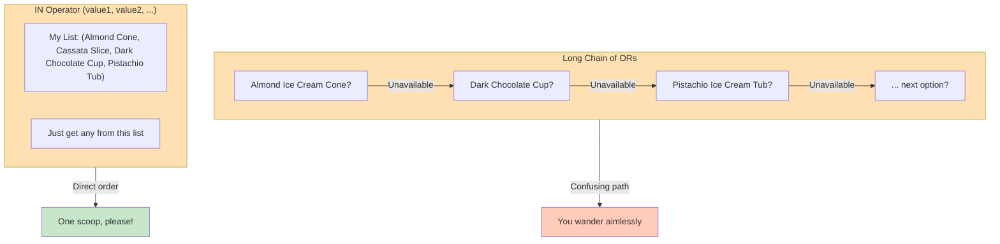
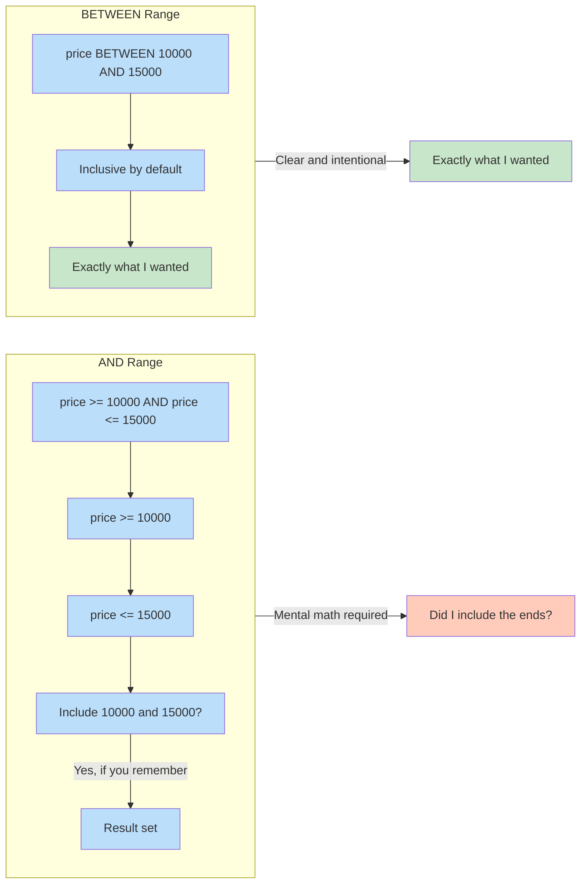

# 🗄️🤖 SQL & GenAI Course  
**🎯 Quality Education for Anyone, Anywhere, Anytime — 💫 with Comfort, Convenience at no Cost**

## 📘 File 4: IN & BETWEEN – Cleaner Filters

You've mastered logical operators, but sometimes even `AND` and `OR` can get clunky. When you need to check if a value matches **any item in a list** or falls **within a range**, SQL gives you two elegant shortcuts: `IN` and `BETWEEN`. They make your queries cleaner, easier to read, and harder to mess up.

---

### 📍 Your Current Stage – PREPARE Journey


You've completed **File 4**. Next, you'll learn about pattern matching with wildcards in File 5. After finishing all seven concept files, you'll return to the Module Guide to begin the PRACTICE stage.

---

## 🔧 Enhanced Browser Office for PREPARE

**🚀 Kickstart: Any Computer, Any Browser, Anytime.**  
**🌍 Destination: Any country, Any city, Any Platform.**

| Tab | Purpose | What to Do |
| :--- | :--- | :--- |
| **1: The Map** | Read concept files | You're here – reading this file. Next up: `5-like-wildcards.md`. |
| **2: The Factory** | Run queries | Keep **[`training_institution_sample.db`](../../../Resources/sample_databases/training_institution_sample.db)** loaded. Run every example query. |
| **3: The Consultant** | Conceptual Q&A | Ask about `IN` vs. multiple `OR`, `BETWEEN` inclusivity, or performance. **Configure AI with [Student Mode Prompt](../../../STUDENT_MODE_PROMPT_LEVEL1.md) (no code generation).** |
| **4: The Vault** | Save your work | Save successful queries in: `Learning/Level-1-beginner/Level1-1-ACQUIRE/Module2-BasicRetrieval-SelectAndWhere/1-sqlCommands/` |

---

### 🛠️ Module 2 Toolkit

🚀 Foundation First, AI Next, Projects Last.  
💎 Gemstone by Gemstone, Skill by Skill.

| | | | |
|---|---|---|---|
| **Browser Office** | 🔧 [Troubleshooting Common Issues](../../../Setup/STEP1_COMMISSION_BROWSER_OFFICE.md) | 🔄 [Browser Office Workflow](../../../Setup/STEP2_ESTABLISH_LEARNING_RITUAL.md) | ⌨️ [Tab Operations & Shortcuts](../../../Setup/STEP3_MASTER_TAB_OPERATIONS.md) |
| **ACQUIRE Section** | 🗄️ [Database Ecosystem](../../Guides/Section1-ACQUIRE/2_Database_Ecosystem.md) | 📚 [Knowledge Base (Vault)](../../Guides/Section1-ACQUIRE/3_Knowledge_Base.md) | 🧠 [Mindset Tuning](../../Guides/Section1-ACQUIRE/4_Mindset.md) |

---

## 🎯 What You'll Learn

By the end of this file, you will be able to:

- Use `IN` to match any value in a list
- Use `BETWEEN` to filter values within a range (inclusive)
- Combine `IN` and `BETWEEN` with `NOT` (`NOT IN`, `NOT BETWEEN`)
- Write cleaner, more readable queries instead of long chains of `OR` or `AND`
- Apply these operators to numbers, text, and dates

---

## 📊 Our Practice Table: `students`

We'll continue using the `students` table. Here's a quick refresher:

| student_id | first_name | last_name | email | phone | enrollment_date | total_fees | fees_paid |
|------------|------------|-----------|-------|-------|-----------------|------------|-----------|
| 101 | Sarah | Chen | sarah.chen@email.com | 555-0101 | 2024-01-15 | 4500.00 | 3000.00 |
| 102 | Mike | Rodriguez | mike.rod@email.com | 555-0102 | 2024-01-20 | 5200.00 | 5200.00 |
| 103 | Jessica | Park | jessica.park@email.com | 555-0103 | 2024-02-01 | 4500.00 | 2000.00 |
| 104 | David | Thompson | david.t@email.com | 555-0104 | 2024-02-10 | 4800.00 | 4800.00 |
| 105 | Lisa | Johnson | lisa.j@email.com | 555-0105 | 2024-02-15 | 5200.00 | 3000.00 |
| 106 | Alex | Kumar | alex.kumar@email.com | 555-0106 | 2024-03-01 | 4500.00 | 4500.00 |
| 107 | Maria | Garcia | maria.g@email.com | 555-0107 | 2024-03-10 | 3800.00 | 2000.00 |
| 108 | James | Wilson | james.w@email.com | 555-0108 | 2024-03-15 | 5200.00 | 0.00 |
| 109 | Priya | Patel | priya.p@email.com | 555-0109 | 2024-04-01 | 4500.00 | 1500.00 |
| 110 | Carlos | Mendez | carlos.m@email.com | 555-0110 | 2024-04-05 | 3800.00 | 3800.00 |

---

## 🤔 When Should You Use IN and BETWEEN?

### ✅ Use `IN` When:
1. You need to match any value from a specific list (e.g., countries, categories, IDs).
2. You have a short, fixed list of options.
3. You want to replace multiple `OR` conditions for clarity.

### ✅ Use `BETWEEN` When:
1. You need to filter by a continuous range (e.g., dates, prices, scores).
2. You want inclusive bounds (start and end included).
3. You prefer concise, readable code over compound `AND` conditions.

### ❌ Avoid Them When:
1. The list is extremely long (consider a join or subquery later).
2. You need exclusive bounds (use `>` and `<` instead).
3. You're dealing with `NULL` values – especially with `NOT IN`.  
   > **Warning:** If your `NOT IN` list contains a `NULL`, the query will return no rows at all because `NULL` represents an unknown value. We'll dive into this in File 6, but for now, keep your `IN` lists `NULL`‑free.

**The Artisan's Rule:**  
> *"Use `IN` for choices, `BETWEEN` for ranges. Let your code say exactly what you mean."*

---

## 🔍 Introducing IN – The List Matcher

The `IN` operator allows you to specify multiple values in a `WHERE` clause. It is a much cleaner alternative to multiple `OR` conditions.

**Question:** Which students have last names Chen, Patel, or Mendez?

```sql
SELECT first_name, last_name
FROM students
WHERE last_name IN ('Chen', 'Patel', 'Mendez');
```

**Try it now in Tab 2.**  
**Expected Result:** Sarah Chen, Priya Patel, Carlos Mendez.  
**What you're seeing:** `IN` checks if the column matches any value in the list. It's like a multiple‑choice question for the database.

Without `IN`, you'd have to write:

```sql
WHERE last_name = 'Chen' OR last_name = 'Patel' OR last_name = 'Mendez';
```

`IN` is shorter, clearer, and less prone to mistakes.

---

### 📋 IN with Numbers

**Question:** Which students have total fees of either 4500 or 5200?

```sql
SELECT first_name, last_name, total_fees
FROM students
WHERE total_fees IN (4500, 5200);
```

**Try it now in Tab 2.**  
**Expected Result:** Sarah (4500), Mike (5200), Jessica (4500), Lisa (5200), Alex (4500), James (5200), Priya (4500).  
**What you're seeing:** Numbers work just like text in an `IN` list. The list can mix types, but usually we keep it consistent.

---

### 🚫 NOT IN – The Excluder

**Question:** Which students have total fees that are NOT 4500 or 5200?

```sql
SELECT first_name, last_name, total_fees
FROM students
WHERE total_fees NOT IN (4500, 5200);
```

**Try it now in Tab 2.**  
**Expected Result:** David (4800), Maria (3800), Carlos (3800).  
**What you're seeing:** `NOT IN` excludes all rows where the column matches any value in the list.

> ⚠️ **NULL caution:** If your list contained a `NULL` (e.g., `NOT IN (4500, NULL)`), the query would return an empty set. We'll explain why in File 6.

---

## 🔢 Introducing BETWEEN – The Range Finder

The `BETWEEN` operator selects values within a given range. The values can be numbers, text, or dates.

**Crucial Rule:** `BETWEEN` is **inclusive**. This means the start and end values are included in the results.

**Question:** Which students have total fees between 4000 and 5000 (inclusive)?

```sql
SELECT first_name, last_name, total_fees
FROM students
WHERE total_fees BETWEEN 4000 AND 5000;
```

**Try it now in Tab 2.**  
**Expected Result:** Sarah (4500), Jessica (4500), David (4800), Alex (4500), Priya (4500).  
**What you're seeing:** The range includes all fees from 4000 up to 5000. Notice that 4800 is included, and 4500 appears multiple times.

Without `BETWEEN`, you'd write:
```sql
WHERE total_fees >= 4000 AND total_fees <= 5000;
```

`BETWEEN` is more concise and immediately signals a range.

---

### 📅 BETWEEN with Dates

**Question:** Which students enrolled in the first quarter of 2024 (January through March)?

```sql
SELECT first_name, last_name, enrollment_date
FROM students
WHERE enrollment_date BETWEEN '2024-01-01' AND '2024-03-31';
```

**Try it now in Tab 2.**  
**Expected Result:** Sarah, Mike, Jessica, David, Lisa, Alex, Maria, James – 8 students enrolled in Jan, Feb, or March.  
**What you're seeing:** Dates must be in ISO format (`YYYY-MM-DD`). `BETWEEN` works perfectly with chronological order.

---

### 🚫 NOT BETWEEN – Outside the Range

**Question:** Which students enrolled **outside** the first quarter of 2024?

```sql
SELECT first_name, last_name, enrollment_date
FROM students
WHERE enrollment_date NOT BETWEEN '2024-01-01' AND '2024-03-31';
```

**Try it now in Tab 2.**  
**Expected Result:** Priya (Apr 1), Carlos (Apr 5).  
**What you're seeing:** `NOT BETWEEN` gives you everything outside the specified range.

---

## 🏛️ The Artisan's Guardrail: IN vs. Multiple OR

`IN` is not just shorter – it's also **faster** in many databases because the database can optimize the list lookup. It also makes your intention crystal clear: "I want any of these values."

Compare these two equivalent queries:

```sql
-- Clunky OR chain
WHERE last_name = 'Chen' OR last_name = 'Patel' OR last_name = 'Mendez';

-- Clean IN
WHERE last_name IN ('Chen', 'Patel', 'Mendez');
```

`IN` communicates "check membership in a set" at a glance.

---

## 📏 Exclusive Ranges: When NOT to Use BETWEEN

`BETWEEN` is always inclusive. If you need an exclusive range (e.g., fees greater than 4000 **and** less than 5000, **excluding** 4000 and 5000), you must use `>` and `<`.

**Question:** How would you get fees strictly greater than 4000 and strictly less than 5000 (excluding the boundaries)?

```sql
SELECT first_name, last_name, total_fees
FROM students
WHERE total_fees > 4000 AND total_fees < 5000;
```

**Try it now in Tab 2.**  
**Expected Result:** Sarah (4500), Jessica (4500), David (4800), Alex (4500), Priya (4500).  
**What you're seeing:** All fees that are >4000 and <5000. Note that 4500 and 4800 both satisfy the condition. This is different from `BETWEEN 4000 AND 5000`, which would also include any hypothetical student with fees exactly 4000 or 5000 (though we don't have any).

---

## 🧪 Practice Challenges

Now it's your turn. Write these queries in your Factory and save each one in your Vault with the suggested filename.

**Challenge 1: Specific Last Names**  
Find students whose last name is 'Rodriguez', 'Johnson', or 'Wilson' using `IN`.  
*Save as:* `4-1-name-list.sql`  
*Expected:* Mike Rodriguez, Lisa Johnson, James Wilson.

**Challenge 2: The February Cohort**  
Which students enrolled in February 2024? (February 2024 had 29 days, but for simplicity use up to Feb 28.)  
*Save as:* `4-2-february-cohort.sql`  
*Expected:* Jessica (Feb 1), David (Feb 10), Lisa (Feb 15).

**Challenge 3: Mid‑Range Payers**  
Which students have `fees_paid` between 1500 and 3000 (inclusive)?  
*Save as:* `4-3-mid-range-payers.sql`  
*Expected:* Sarah (3000), Jessica (2000), Lisa (3000), Maria (2000), Priya (1500).

**Challenge 4: Excluded IDs**  
Which students have `student_id` NOT in the set (101, 102, 103)?  
*Save as:* `4-4-excluded-ids.sql`  
*Expected:* All students except Sarah, Mike, Jessica.

**Challenge 5: Q2 Enrollees**  
Which students enrolled in the second quarter of 2024 (April–June)?  
*Save as:* `4-5-q2-enrollees.sql`  
*Expected:* Priya (Apr 1), Carlos (Apr 5).

**Challenge 6: Exclusive Fees**  
Which students have `total_fees` greater than 4000 **and** less than 5000? (Compare with Challenge 3 – note the difference.)  
*Save as:* `4-6-exclusive-fees.sql`  
*Expected:* Sarah, Jessica, David, Alex, Priya (all with fees 4500 or 4800).

---

## ⚠️ Common Mistakes

- **Forgetting commas in the `IN` list:**  
  `IN ('Chen' 'Patel')` → should be `IN ('Chen', 'Patel')`

- **Using wrong date format:**  
  `'01-01-2024'` → use `'2024-01-01'` (ISO format)

- **Assuming `BETWEEN` is exclusive:** It's inclusive. For exclusive, use `>` and `<`.

- **Forgetting that `NULL` in a `NOT IN` list breaks the query:** We'll cover this in File 6.

> 🔧 **Fix it:** Always double‑check commas, date formats, and inclusivity. When in doubt, test with a small dataset.

---

## 📋 IN & BETWEEN Quick Reference Card

| Operator | Purpose | Example | Result |
|----------|---------|---------|--------|
| **`IN`** | Match any value in a list | `WHERE city IN ('NY', 'LA')` | Rows with city NY or LA |
| **`NOT IN`** | Exclude values in a list | `WHERE city NOT IN ('NY', 'LA')` | Rows with any other city |
| **`BETWEEN`** | Inclusive range | `WHERE price BETWEEN 10 AND 20` | Prices 10, 11, ..., 20 |
| **`NOT BETWEEN`** | Outside inclusive range | `WHERE price NOT BETWEEN 10 AND 20` | Prices <10 or >20 |

### Memory Aid  
> *"IN picks from a list, BETWEEN draws a line. Both make your queries shine."*

**Save this reference in your Vault as:** `4-in-between-reference-card.md`

---

## ✅ Progress Check

After reading this and trying the examples, can you:

- [ ] Write a query using `IN` to match a list of values?
- [ ] Use `NOT IN` to exclude a list of values?
- [ ] Write a query using `BETWEEN` for numeric ranges?
- [ ] Use `BETWEEN` with dates correctly?
- [ ] Explain the difference between `IN` and multiple `OR`?
- [ ] Remember that `BETWEEN` is inclusive?
- [ ] Save your working queries in your Vault?

**If yes → Shorthand mastered → You're ready for File 5: LIKE & Wildcards!**

---

# 💎 DESIGNER'S PERIGON

<div style="border: 3px solid #9c27b0; border-radius: 10px; padding: 20px; margin: 25px 0; background: linear-gradient(135deg, #f3e5f5 0%, #e1bee7 100%);">


### *The Art of Elegance*

Welcome back to the **SQLVerse** – where every domain is a planet and every database is a world to explore. You've just seen how `IN` and `BETWEEN` work on **Education Planet**. Now let's understand why they're so powerful.

As you continue your journey across the SQLVerse, here's where you stand:

| Domain (Real World) | Our Universe (SQLVerse) |
|---------------------|-------------------------|
| 🏫 Student Records | **Education Planet** |
| 🛒 Online Store | **E-Commerce Planet** |
| 🏢 Employee Data | **HR Planet** |
| 💳 Banking Transactions | **Fintech Planet** |

You've mastered logical operators on HR Planet. Now on Education Planet, you've discovered that `IN` and `BETWEEN` are not just shortcuts – they're a statement of intent. When you use them, you're telling the database (and anyone reading your code) exactly what you mean.

Code is read much more often than it is written. An Artisan doesn't just write code that "works"—they write code that **communicates**. When you use `IN` instead of five `OR` statements, you are telling the next person who reads your code (which might be you in six months): *"I am looking for a specific set of items."* When you use `BETWEEN`, you are clearly defining a **boundary**.

---

<div style="border-left: 4px solid #ff9800; background-color: #fff3e0; padding: 15px; margin: 15px 0; border-radius: 0 10px 10px 0;">

### 🍦 The Ice Cream Shop Analogy



A long chain of `OR`s is like giving directions turn by turn: *"Almond Ice Cream Cone UNAVAILABLE → Dark Chocolate Cup UNAVAILABLE → Pistachio Ice Cream Tub."*

`IN` is like saying, *"Get any one of (Almond Ice Cream Cone, Cassata Slice, Dark Chocolate Cup, Pistachio Ice Cream Tub)."*

It's cleaner, clearer, and harder to get lost. You're not wandering through a maze of unavailable options – you're walking up to the counter with a list.

</div>

---

<div style="border-left: 4px solid #2196f3; background-color: #e3f2fd; padding: 15px; margin: 15px 0; border-radius: 0 10px 10px 0;">

### 📱 The Mobile Phone Analogy



A range expressed with `AND` is like saying, *"From this price to that price, but don't forget to include the ends."*

`BETWEEN` is like saying, *"Give me any mobile priced between ₹10,000 and ₹15,000."*

It's inclusive, intentional, and elegant. You're not doing mental math at every step – you're drawing a clear boundary and saying "everything inside this circle."

</div>

---

### 💼 **Real-World Examples Across the SQLVerse**

#### 1️⃣ **Education Planet – Finding Specific Courses**
```sql
SELECT course_name, instructor 
FROM courses 
WHERE course_id IN (201, 203, 205);
```
*"Show me only the courses I'm interested in – no endless OR chains."*

#### 2️⃣ **HR Planet – Salary Ranges for Promotion Review**
```sql
SELECT employee_name, department, salary 
FROM employees 
WHERE salary BETWEEN 60000 AND 80000;
```
*"Find me mid-career professionals in the promotion bracket."*

#### 3️⃣ **E-Commerce Planet – Customers in Target Cities**
```sql
SELECT customer_name, email, city 
FROM customers 
WHERE city IN ('Mumbai', 'Delhi', 'Bangalore');
```
*"Our marketing campaign focuses on these three cities."*

---

### 🧭 The Explorer's Compass

Before you use `IN` or `BETWEEN` on any new planet, remember to explore first:

```sql
SELECT * FROM table_name LIMIT 5;
```

Know what values exist in your columns before you start listing them in `IN` clauses or setting `BETWEEN` boundaries.

---

### 🧠 The Artisan's Insight

`IN` and `BETWEEN` are not just syntax – they're a philosophy. They represent the difference between **telling the database how to do something** (long OR chains, manual AND ranges) and **telling it what you want**.

This is the essence of declarative thinking: state your intent clearly, and let the database figure out the rest.

**The Artisan's Truth:**

> *"Elegance in code is not about saving keystrokes. It's about making your intent so obvious that the next person (including future you) doesn't have to guess."*

> *"IN and BETWEEN are two of SQL's most elegant tools; they reduce the 'noise' so the 'logic' can shine through. Use them with pride."*

> *"On Education Planet, HR Planet, or E-Commerce Planet – the laws of elegance remain the same."*

</div>

---

## 🧭 File Navigation


| Previous Step | Next Step |
|:---:|:---:|
| [← Back to File 3: Logical Operators](./3-logical-operators.md) | [Continue to File 5: LIKE & Wildcards →](./5-like-wildcards.md) |

---

*Part of our mission for 🎯 Quality Education for Anyone, Anywhere, Anytime — 💫 with Comfort, Convenience at no Cost.*

**Level 1 | Module 2 | File 4: IN & BETWEEN | Next: [LIKE & Wildcards](./5-like-wildcards.md)**