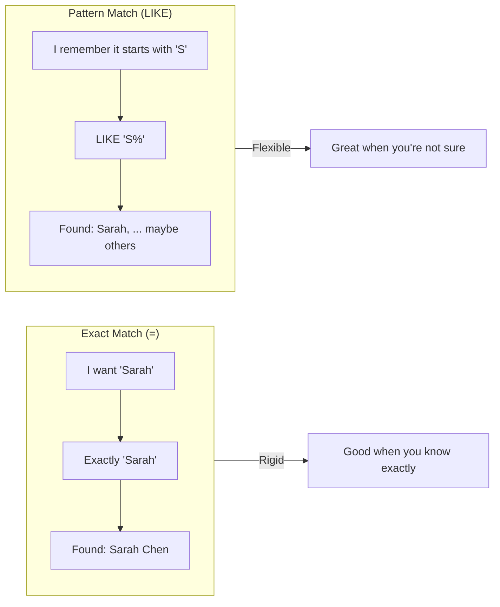

# 🗄️🤖 SQL & GenAI Course
**🎯 Quality Education for Anyone, Anywhere, Anytime — 💫 with Comfort, Convenience at no Cost**

## 📘 File 5: LIKE & Wildcards – Finding Patterns


You've learned to filter with exact matches and ranges. But what if you don't know the exact value? What if you only remember part of a name, or want to find all emails from a certain domain? That's where `LIKE` comes in – it's your **"Detective's Magnifying Glass."**

This is the tool that finds all emails ending in `.edu` or all customers whose names start with `Mc`. When you only have a fragment of memory, `LIKE` turns it into a query.

---

### 📍 Your Current Stage – PREPARE Journey



You're in **Stage 1: PREPARE**. Files 1–4 are complete. Now you'll learn to search for patterns using `LIKE`. After completing all seven files, you'll return to the Module Guide to begin the PRACTICE stage.

---

## 🔧 Enhanced Browser Office for PREPARE

**🚀 Kickstart: Any Computer, Any Browser, Anytime.**  
**🌍 Destination: Any country, Any city, Any Platform.**

| Tab | Purpose | What to Do |
| :--- | :--- | :--- |
| **1: The Map** | Read concept files | You're here – reading this file. Next up: `6-null-handling.md`. |
| **2: The Factory** | Run queries | Keep **[`training_institution_sample.db`](../../../Resources/sample_databases/training_institution_sample.db)** loaded. Run every example query. |
| **3: The Consultant** | Conceptual Q&A | Ask about wildcards, case sensitivity, or escaping characters. **Configure AI with [Student Mode Prompt](../../../STUDENT_MODE_PROMPT_LEVEL1.md) (no code generation).** |
| **4: The Vault** | Save your work | Save successful queries in: `Learning/Level-1-beginner/Level1-1-ACQUIRE/Module2-BasicRetrieval-SelectAndWhere/1-sqlCommands/` |

---

### 🛠️ Module 2 Toolkit

🚀 Foundation First, AI Next, Projects Last.  
💎 Gemstone by Gemstone, Skill by Skill.

| | | | |
|---|---|---|---|
| **Browser Office** | 🔧 [Troubleshooting Common Issues](../../../Setup/STEP1_COMMISSION_BROWSER_OFFICE.md) | 🔄 [Browser Office Workflow](../../../Setup/STEP2_ESTABLISH_LEARNING_RITUAL.md) | ⌨️ [Tab Operations & Shortcuts](../../../Setup/STEP3_MASTER_TAB_OPERATIONS.md) |
| **ACQUIRE Section** | 🗄️ [Database Ecosystem](../../Guides/Section1-ACQUIRE/2_Database_Ecosystem.md) | 📚 [Knowledge Base (Vault)](../../Guides/Section1-ACQUIRE/3_Knowledge_Base.md) | 🧠 [Mindset Tuning](../../Guides/Section1-ACQUIRE/4_Mindset.md) |

---

## 🎯 What You'll Learn

By the end of this file, you will be able to:

- Use `LIKE` to search for patterns in text
- Use the **Chameleon `%`** to match any sequence of characters
- Use the **Placeholder `_`** to match a single character
- Combine wildcards for flexible pattern matching
- Use `NOT LIKE` to exclude patterns
- Understand case sensitivity in your database

---

## 📊 Our Practice Table: `students`

We'll continue using the `students` table. Here's a quick refresher:

| student_id | first_name | last_name | email | phone | enrollment_date | total_fees | fees_paid |
|------------|------------|-----------|-------|-------|-----------------|------------|-----------|
| 101 | Sarah | Chen | sarah.chen@email.com | 555-0101 | 2024-01-15 | 4500.00 | 3000.00 |
| 102 | Mike | Rodriguez | mike.rod@email.com | 555-0102 | 2024-01-20 | 5200.00 | 5200.00 |
| 103 | Jessica | Park | jessica.park@email.com | 555-0103 | 2024-02-01 | 4500.00 | 2000.00 |
| 104 | David | Thompson | david.t@email.com | 555-0104 | 2024-02-10 | 4800.00 | 4800.00 |
| 105 | Lisa | Johnson | lisa.j@email.com | 555-0105 | 2024-02-15 | 5200.00 | 3000.00 |
| 106 | Alex | Kumar | alex.kumar@email.com | 555-0106 | 2024-03-01 | 4500.00 | 4500.00 |
| 107 | Maria | Garcia | maria.g@email.com | 555-0107 | 2024-03-10 | 3800.00 | 2000.00 |
| 108 | James | Wilson | james.w@email.com | 555-0108 | 2024-03-15 | 5200.00 | 0.00 |
| 109 | Priya | Patel | priya.p@email.com | 555-0109 | 2024-04-01 | 4500.00 | 1500.00 |
| 110 | Carlos | Mendez | carlos.m@email.com | 555-0110 | 2024-04-05 | 3800.00 | 3800.00 |

---


## 🔍 Introducing LIKE – The Detective's Magnifying Glass

Sometimes you don't have the exact value – you have a clue. A name that starts with "Sar", an email that ends with "gmail.com". `LIKE` is how you tell the database: *"I'm looking for something that matches this pattern."*

### 🔎 The Wildcards: Your Detective Tools

| Symbol | Code Name | What It Does | Example |
|--------|-----------|--------------|---------|
| **`%`** | The Chameleon | Matches **any number** of characters (zero, one, or many) | `'S%'` finds "Sarah", "Smith", "S" |
| **`_`** | The Placeholder | Matches **exactly one** character | `'M_ke'` finds "Mike" |

> 💡 Think of `%` as a chameleon that can become any string; `_` as a placeholder that marks a single missing letter.
---
## 🤔 When Should You Use LIKE?

### ✅ Use LIKE When:
1. **Partial matches** ("Find names starting with 'Mc'")
2. **Search functionality** (user types partial text)
3. **Pattern detection** ("Find all .edu emails")
4. **Fuzzy matching** (you remember part of the value)
5. **Category grouping** ("All products containing 'book'")

### ❌ Use Exact Match (=) When:
1. **You know the full value** ("Find customer_id = 12345")
2. **Performance matters** (= is much faster than LIKE)
3. **Numeric comparisons** (price = 50.00)
4. **Boolean logic** (is_active = TRUE)

**The Artisan's Rule:**  
> *"Use = when you know exactly what you're looking for. Use LIKE when you're hunting with a clue."*
---
### 🎯 LIKE Performance Tip

```sql
-- Slower (must scan entire column):
WHERE name LIKE '%Smith%'

-- Faster (can use index):
WHERE name LIKE 'Smith%'
```

**Why?** Starting with `%` means the database can't use indexes—it must check every single row. Starting with a letter lets it jump to that section of the index.

**Practical advice:** If you control the search, encourage users to start their search terms with known characters.

---
### 🧩 The Chameleon `%` – Any Sequence


This is your go‑to for most fuzzy searches.

#### Example 1: Names Starting with 'J'

**Question:** Which students have first names starting with the letter 'J'?

```sql
SELECT first_name, last_name
FROM students
WHERE first_name LIKE 'J%';
```

**Try it now in Tab 2.**  
**Expected Result:** Jessica Park  and James Wilson.  
**What you're seeing:** The `%` wildcard matched any characters after the 'J', so it caught "Jessica" and "James"  (and would catch any other J‑starting names if available). Try the same query with 'S%' instead of 'J%' and observe what result you get.

#### Example 2: Emails Ending with a Domain

**Question:** Which students use a specific email provider (e.g., 'email.com')?

```sql
SELECT first_name, email
FROM students
WHERE email LIKE '%@email.com';
```

**Try it now in Tab 2.**  
**Expected Result:** All students (since they all have that domain).  
**What you're seeing:** The `%` before `@email.com` matches any characters, effectively finding all rows where the email ends with that domain.

#### Example 3: Names Containing a Pattern

**Question:** Which students have last names containing the letters 'ar' anywhere?

```sql
SELECT first_name, last_name
FROM students
WHERE last_name LIKE '%ar%';
```

**Try it now in Tab 2.**  
**Expected Result:** Park, Garcia, etc. (students whose last names include 'ar').  
**What you're seeing:** The `%` on both sides of 'ar' matches any characters before and after, so it finds 'ar' anywhere in the last name and you get Jessica Park  and Maria Garcia in your output.

#### Example 4: Names ending with the letter 'a'

**Question:** Which students have their first name ending with 'a'?

```sql
SELECT first_name, last_name
FROM students
WHERE first_name LIKE '%a';
```

**Try it now in Tab 2.**  
**Expected Result:** Jessica, Maria, etc. (students whose first names end with 'a').  
**What you're seeing:** The `%a` before 'a' matches any characters before a, and the character 'a' at the end matches only if the first name ends with the letter 'a'. You see Jessica Park, Lisa Johnson, Maria Garcia and Priya Patel in the output.

---


### 🧩 The Placeholder `_` – Exactly One Character


Use this when you know the exact length of the missing part.

#### Example 1: 4‑Letter First Names Starting with 'M'

**Question:** Which students have exactly 4 letters in their first name and start with 'M'?

```sql
SELECT first_name
FROM students
WHERE first_name LIKE 'M___';
```

**Try it now in Tab 2.**  
**Expected Result:** Mike (4 letters).  
**What you're seeing:** The pattern `'M___'` means 'M' followed by exactly three more characters. Mike fits; Maria (5 letters) does not.

#### Example 2: Names with fixed number of characters

**Question:** Which first names have exactly five characters?

```sql
SELECT first_name
FROM students
WHERE first_name LIKE '_____';
```

**Try it now in Tab 2.**  
**Expected Result:** Sarah, David etc.  
**What you're seeing:** The `_` stands for exactly one character, so the pattern '_____' matches exactly five character where each `_` represents any alphabet. You see the names Sarah, David, Maria, James and Priya in your output.

#### Example 3: The `M_ke` Pattern

**Question:** Which first names match the pattern where the second character can be anything, followed by 'ke'?

```sql
SELECT first_name
FROM students
WHERE first_name LIKE 'M_ke';
```

**Try it now in Tab 2.**  
**Expected Result:** Mike (M + any char + k + e).  
**What you're seeing:** The `_` stands for exactly one character, so 'Mike' matches ('i' fills the `_'), while names like 'Mack' do not (don't end with 'ke').---


### 🧩 Combining Wildcards


You can mix both wildcards in one pattern.

**Question:** Which students have an email where the second character is 'a'?

```sql
SELECT first_name, email
FROM students
WHERE email LIKE '_a%';
```

**Try it now in Tab 2.**  
**Expected Result:** Sarah Chen (sarah.chen@... – second char is 'a') and possibly others.  
**What you're seeing:** The `_` matches exactly one character (the first letter), then 'a' must be the second character, and `%` matches everything after.

---


### 🚫 NOT LIKE – Excluding Patterns


To find rows that do **not** match a pattern, use `NOT LIKE`.

**Question:** Which students have last names that do NOT end with the letter 'n'?

```sql
SELECT first_name, last_name
FROM students
WHERE last_name NOT LIKE '%n';
```

**Try it now in Tab 2.**  
**Expected Result:** Students like Park, Garcia, etc. – those whose last names do not end in 'n'.  
**What you're seeing:** The `%` matches any characters, and `NOT LIKE` excludes rows where the pattern `%n` (ends with 'n') is true.

---


## 🏛️ The Artisan's Guardrail: Case Sensitivity

**Important for this module:** We're using **SQLite**, which treats `LIKE` as **case‑insensitive** for English letters by default.

**Test it yourself – run both queries:**

```sql
WHERE first_name LIKE 'sarah';   -- finds Sarah Chen
WHERE first_name LIKE 'SARAH';   -- also finds Sarah Chen
```

Both work exactly the same in SQLite.

**What about other databases?**  
In PostgreSQL, `LIKE` is case‑sensitive. If you need case‑insensitive there, you'd use `ILIKE`. We'll cover that in Level 3. For now, just know that the behavior can vary – always check your database's documentation.

---

## 🧪 Try It Now


Write these queries in your Factory:

1. Find students whose last name starts with 'G' (`LIKE 'G%'`). (Garcia)
2. Find students whose first name has exactly 4 letters (`____`). (Mike, Alex, Lisa? Check: Mike=4, Alex=4, Lisa=4, James=5, etc.)
3. Find students whose email contains 'kumar' (`LIKE '%kumar%'`). (Alex)
4. Find students whose first name ends with 'a' (`LIKE '%a'`). (Sarah, Jessica, Maria, Priya)
---

## 🔍 Detective's Case File – Test Your Skills

Let's put your detective skills to the test in **Tab 2**. Try these real‑world pattern searches.

### 1. 🔎 The Gmail Search

**Question:** Which students use a specific email provider (e.g., 'email.com')?

```sql
SELECT first_name, email FROM students WHERE email LIKE '%email.com';
```

**Try it now in Tab 2.**  
**Expected Result:** All students (since they all use this domain).  
**What you're seeing:** The `%` matches any characters before the domain, so every row qualifies. If you change the domain to `'%gmail.com'`, you'd see zero rows (none use Gmail).

### 2. 🔎 The Name Fragment

**Question:** Which students have the letters "ar" anywhere in their first name?

```sql
SELECT first_name FROM students WHERE first_name LIKE '%ar%';
```

**Try it now in Tab 2.**  
**Expected Result:** Sarah, Maria, Carlos.  
**What you're seeing:** The `%` on both sides of 'ar' finds the pattern anywhere in the name.

### 3. 🔎 The Specific Pattern

**Question:** Which students have a first name of exactly 5 letters starting with 'C'?

```sql
SELECT first_name FROM students WHERE first_name LIKE 'C____';
```

**Try it now in Tab 2.**  
**Expected Result:** No rows. (Carlos is 6 letters, so he doesn't match.)  
**What you're seeing:** The pattern `'C____'` requires exactly 5 letters total. Our data has no such name. This teaches that patterns are precise – if you want to find Carlos, you'd use `'C%'` instead.

---

## ⚠️ Common Mistakes


### Mistake 1: Forgetting quotes around the pattern
```sql
-- Wrong:
WHERE last_name LIKE %J%

-- Right:
WHERE last_name LIKE '%J%'
```

### Mistake 2: Using `=` instead of `LIKE` for patterns
```sql
-- Wrong (looks for literally '%J%'):
WHERE last_name = '%J%'

-- Right:
WHERE last_name LIKE '%J%'
```

### Mistake 3: Confusing `%` and `_`
- `%` = Chameleon (any number of characters)
- `_` = Placeholder (exactly one)

```sql
-- 'A%'  : starts with A, then anything
-- 'A_'  : starts with A, then exactly one more character
```

### Mistake 4: Assuming case‑sensitivity without testing
In SQLite, it's case‑insensitive; in other databases it may be sensitive. When in doubt, test with both cases.

> 🔧 **Fix it:** Always enclose patterns in quotes. Use `%` for flexible matching, `_` for fixed‑length placeholders.

---

## 🧪 Try It Yourself  – LIKE & Wildcard Mastery


**Challenge 1: The Name Search**  
**Question:** Which students have 'ar' anywhere in their last name?

```sql
-- Your query here
-- Hint: Use the Chameleon on both sides of 'ar'
-- Save as: 5-1-lastname-ar.sql
```

**Expected Result:** Students like Park, Garcia (last names containing 'ar')  
**What this teaches:** The Chameleon `%` matches any characters before and after.

---

**Challenge 2: The Four-Letter Club**  
**Question:** Which students have first names that are exactly 4 letters long and start with 'M'?

```sql
-- Your query here  
-- Hint: M followed by exactly three Placeholders
-- Save as: 5-2-m-four-letters.sql
```

**Expected Result:** Mike (4 letters starting with M)  
**What this teaches:** The Placeholder `_` represents exactly one character. Use multiple `_` for exact lengths.

---

**Challenge 3: The Email Domain Filter**  
**Question:** Which students have email addresses from the 'email.com' domain?

```sql
-- Your query here
-- Hint: What character comes RIGHT before the domain?
-- Save as: 5-3-email-domain.sql
```

**Expected Result:** All students (they all use @email.com)  
**What this teaches:** Ending patterns use `%` at the start.

---

**Challenge 4: The Phone Tracker**  
**Question:** Which students' phone numbers end with '08'?

```sql
-- Your query here
-- Hint: The Chameleon first, then exact match at the end
-- Save as: 5-4-phone-ends-08.sql
```

**Expected Result:** James Wilson (phone ends in 08)  
**What this teaches:** Combining wildcards with exact text.

---

**Challenge 5: The Exclusion List**  
**Question:** Which students' first names do NOT start with 'J'?

```sql
-- Your query here
-- Hint: NOT LIKE with a starting pattern
-- Save as: 5-5-not-j-names.sql
```

**Expected Result:** Everyone except Jessica and James  
**What this teaches:** NOT LIKE excludes patterns—useful for "everyone except" scenarios.

---
## 📋 LIKE & Wildcards Quick Reference Card

### The Two Wildcards

| Wildcard | Name | Matches | Example | Finds |
|----------|------|---------|---------|-------|
| `%` | The Chameleon | Any number of characters (0+) | `'S%'` | Sarah, Sam, S |
| `_` | The Placeholder | Exactly one character | `'M_ke'` | Mike (not Make or Mke) |

### Common Patterns

| Pattern | What It Finds | SQL Example |
|---------|--------------|-------------|
| **Starts with** | Names beginning with 'A' | `LIKE 'A%'` |
| **Ends with** | Emails ending in '.edu' | `LIKE '%.edu'` |
| **Contains** | Text with 'son' anywhere | `LIKE '%son%'` |
| **Exactly 5 letters** | Names like "Sarah" | `LIKE '_____'` (five underscores) |
| **NOT containing** | Excludes a pattern | `NOT LIKE '%gmail%'` |

### Critical Rules

| Rule | Wrong ❌ | Right ✅ |
|------|---------|---------|
| **Patterns need quotes** | `LIKE %J%` | `LIKE '%J%'` |
| **Use LIKE, not =** | `WHERE name = '%J%'` | `WHERE name LIKE '%J%'` |
| **Case sensitivity** | Depends on database | Test both cases if unsure |

### Performance Tip
```sql
-- Slow (can't use index):
WHERE name LIKE '%Smith%'

-- Fast (can use index):  
WHERE name LIKE 'Smith%'
```
> **The Artisan's Secret:** When you start a pattern with a letter (e.g., `'S%'`), the database can use an **Index**—think of it like using the alphabetical tabs in a physical dictionary to jump straight to the "S" section. When you start with a wildcard (e.g., `'%S%'`), the database has to read every single page of the dictionary from start to finish!

**Memory Aid:** 
- `%` = Chameleon (changes to match anything)
- `_` = Placeholder (holds exactly one spot)

**Save this reference in your Vault as:** `5-wildcards-reference-card.md`

---
## ✅ Progress Check

After reading this and trying the examples, can you:

- [ ] Write a query using `LIKE` with the `%` wildcard?
- [ ] Use the `_` wildcard to match a single character?
- [ ] Combine both wildcards in one pattern?
- [ ] Use `NOT LIKE` to exclude patterns?
- [ ] Save your working queries in your Vault?

**If yes → Pattern matching mastered → You're ready for File 6: NULL Handling!**

---

## 💎 DESIGNER'S PERIGON

<div style="border: 3px solid #9c27b0; border-radius: 10px; padding: 20px; margin: 25px 0; background: linear-gradient(135deg, #f3e5f5 0%, #e1bee7 100%);">


### *The Art of Fuzzy Thinking*

Welcome back to the **SQLVerse** – where every domain is a planet and every database is a world to explore. Today on **Education Planet**, we have learnt that not all searches need to be exact. Sometimes, a pattern is enough.

Have you ever tried to search for a song when you only remember a few words of the lyrics? Or looked for a friend in a crowd when you only know the color of their shirt? That's exactly what `LIKE` does – it's the art of **fuzzy matching**.



`LIKE` acknowledges that real life isn't always perfect. Sometimes you don't have the exact data – you have a memory, a hunch, a pattern. `LIKE` is the tool that turns those fuzzy memories into results.

`LIKE` is the bridge between human memory and computer precision. Humans remember fragments; computers require patterns.

To truly master the "Art of Fuzzy Thinking," it helps to visualize how the database engine scans through your text using these two tools.

* **The `%` (Percent)** is like an accordion; it can stretch to cover an entire sentence or shrink to nothing.
* **The `_` (Underscore)** is a rigid box; it occupies exactly one slot, no more, no less.

---

### 🤔 "Is This Just Mathematical Theory?"

Got bored with fuzzy thinking? Feel like this file is turning into a mathematical theorem with wildcards and abstract logic? Thinking this entire wildcard business is not of much use in real life and learning it is a waste of time?

**NOT AT ALL.**

This humble tool can be a **lifesaver** in situations you encounter every day. Let's make it real.

---

### 📱 Scenario One: Your Android Contacts

Did you know you're already using wildcards? Open the Contacts app on your Android phone. When you type a name, you're essentially performing a `LIKE '%searchterm%'` query. Your Android phone uses **SQLite** for its contacts database – the same database engine you're learning right now.

Try this: Search for "ar" in your contacts. Notice how it finds "Arun", "Carla", "Martha" – anyone with those letters anywhere in their name. You've just used the `%ar%` wildcard in real life!

Try any **wildcard pattern** you have learned here in your **Android mobile**. You will get the same intended results.

---

### 🛍️ Scenario Two: E‑Commerce Lucky Draw – E-Commerce Planet

Imagine a company is opening its online store in a new city. They announce a lucky draw with 10 prizes for customers who shop on the first day. You need to select 10 winners from 10,000 people. Your job: define the selection criteria using wildcards and other conditions:

1. **Time‑based selection:** Customers who shopped in the first 10 minutes **OR** the last 10 minutes of the day.
2. **Order size:** Customers who purchased more than 5 items.
3. **City pride:** Customers whose name **starts with** the city's name (e.g., customers whose first name starts with "Mum" for Mumbai, or "Del" for Delhi).

```sql
SELECT * FROM customers
WHERE (order_time <= '00:10' OR order_time >= '23:50')
  AND items_count > 5
  AND first_name LIKE 'Mum%';  -- Wildcard in action!
```

Wildcards aren't just theory – they're how you build fair, creative selection criteria.

---

### 💳 Scenario Three: Your Personal Credit Card Analysis (ANALYZE Phase Preview) – Fintech Planet

After completing all of Level 1, you'll be able to analyze your own financial data. Here's a **preview** of what you'll accomplish in the **ANALYZE phase (Module 6)**:

**The Vision (What You'll Be Able to Do):**
```sql
-- Coffee spending analysis
SELECT * FROM transactions WHERE description LIKE '%bucks%';

-- Online shopping patterns  
SELECT * FROM transactions 
WHERE description LIKE '%amazon%' OR description LIKE '%flipkart%';

-- Restaurant spending by category
SELECT * FROM transactions 
WHERE description LIKE '%pizza%' OR description LIKE '%olive%';
```

**When You'll Actually Do This:**

| Your Stage | What You Can Do |
|-----------|----------------|
| **NOW (Module 2)** | Learning LIKE patterns with sample data |
| **Module 5** | Using AI to refine complex queries |
| **Module 6** | Studying professional financial dashboards |
| **ARCHITECT Phase** | Importing YOUR credit card CSV and analyzing it |

**Skills You'll Need First:**
- ✅ CSV import techniques (Module 6: Data Import & Export)
- ✅ Complex multi-condition queries (Module 3: Aggregation)  
- ✅ Data aggregation and grouping (Module 3: GROUP BY)
- ✅ AI partnership for analysis (Module 5: GenAI Walkthrough)

**Why We Show You Now:**
This preview demonstrates that `LIKE` isn't academic theory—it's a tool you'll use to understand your own life through data. We show the destination now; the complete Level 1 journey gives you the roadmap to get there.

**For Now:** Master wildcards with the `students` table. Each pattern you learn here builds toward analyzing your own data later.

Once you reach the **ANALYZE** phase, you'll have the skills and guidance to actually perform these steps. This is just a glimpse of the power waiting for you.

---

### 🎯 What Sets This Course Apart

Other courses teach you syntax. This course teaches you **how to think** with data.

A simple wildcard has led you to:
- Understand how your phone's contacts app works.
- Design fair selection criteria for a business contest.
- Preview how you'll import and analyze your own financial data.

This is the difference between learning SQL and becoming a **Data Artisan**. You're not just memorizing commands – you're discovering how to apply them to your life, your finances, and your world.

---

### 🧭 The Explorer's Compass

Before you start pattern matching on any new planet, remember to explore first:

```sql
SELECT * FROM table_name LIMIT 5;
```

See what kind of text lives in your columns before you start guessing patterns.

---

### 🧠 The Artisan's Insight

`LIKE` teaches us something beautiful about data: **it's allowed to be messy**. Real life doesn't always fit into neat equals signs. People misspell names. Descriptions vary. Memories fade.

`LIKE` is your tool for meeting the data where it is – imperfect, fuzzy, human.

**The Artisan's Truth:**

> *"Exact matches are for machines. Patterns are for humans. When you use LIKE, you're programming with empathy – you're allowing for the messiness of real-world data. That's what separates a good query from a truly useful one."*

> *"Precision is finding what you know exists. Pattern matching is discovering what you suspect exists. Master the wildcards, and you can find a needle in a haystack—even if you've forgotten what the needle looks like."*

> *"The tools you learn here aren't just for passing tests. They're for understanding your world, one query at a time."*
</div>

---

## 🧭 File Navigation

```mermaid
flowchart LR
    A["✅ COMPLETED<br/>📘 File 1<br/>The SELECT Clause"] --> B
    B["✅ COMPLETED<br/>📘 File 2<br/>The WHERE Clause"] --> C
    C["✅ COMPLETED<br/>📘 File 3<br/>Logical Operators"] --> D
    D["✅ COMPLETED<br/>📘 File 4<br/>IN & BETWEEN"] --> E
    E["📍 YOU ARE HERE<br/>📘 File 5<br/>LIKE & Wildcards"] --> F
    F["📘 File 6<br/>NULL Handling"] --> G
    G["📘 File 7<br/>DISTINCT & Aliases"] --> H
    H["✅ PREPARE COMPLETE"] --> I
    I["🔄 RETURN TO MODULE GUIDE<br/>TO BEGIN PRACTICE SECTION"]
    
    style A fill:#e1f5fe,stroke:#4caf50,stroke-width:4px
    style B fill:#e1f5fe,stroke:#4caf50,stroke-width:4px
    style C fill:#e1f5fe,stroke:#4caf50,stroke-width:4px
    style D fill:#e1f5fe,stroke:#4caf50,stroke-width:4px
    style E fill:#e1f5fe,stroke:#2196f3,stroke-width:4px
    style F fill:#e1f5fe,stroke:#2196f3,stroke-width:2px
    style G fill:#e1f5fe,stroke:#2196f3,stroke-width:2px
    style H fill:#fff8e1,stroke:#ff9800,stroke-width:2px
    style I fill:#e8f5e8,stroke:#4caf50,stroke-width:2px
```


| Previous Step | Next Step |
|:---:|:---:|
| [← Back to File 4: IN & BETWEEN](./4-in-between.md) | [Continue to File 6: NULL Handling →](./6-null-handling.md) |

---

*Part of our mission for 🎯 Quality Education for Anyone, Anywhere, Anytime — 💫 with Comfort, Convenience at no Cost.*

**Level 1 | Module 2 | File 5: LIKE & Wildcards | Next: [NULL Handling](./6-null-handling.md)**