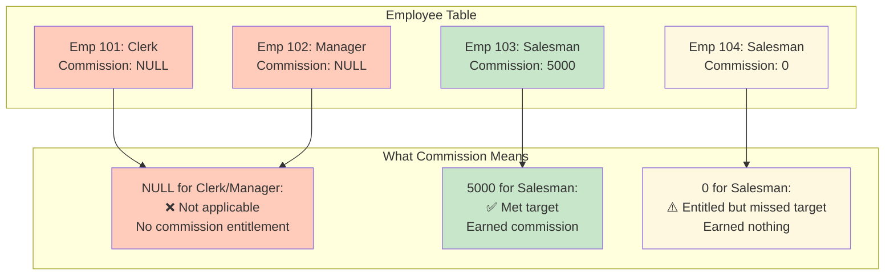

# 🗄️🤖 SQL & GenAI Course
**🎯 Quality Education for Anyone, Anywhere, Anytime — 💫 with Comfort, Convenience at no Cost**

## 📘 File 6: NULL Handling – The Unknown

You've learned to filter with precision using `WHERE`, logical operators, and wildcards. But real‑world data is messy. Sometimes a value is simply **missing**. In SQL, we call this `NULL`. It's not zero, it's not an empty string – it's **unknown**. This file teaches you how to handle the unknown with confidence.

This is the **"Ghost in the Machine."** `NULL` is not zero, and it’s not an empty string—it is the **absence** of a value. This is where most beginners (and many pros) trip up because normal math doesn't work on ghosts.

---

### 📍 Your Current Stage – PREPARE Journey

```mermaid
flowchart LR
    A["✅ COMPLETED<br/>📘 File 1<br/>The SELECT Clause"] --> B
    B["✅ COMPLETED<br/>📘 File 2<br/>The WHERE Clause"] --> C
    C["✅ COMPLETED<br/>📘 File 3<br/>Logical Operators"] --> D
    D["✅ COMPLETED<br/>📘 File 4<br/>IN & BETWEEN"] --> E
    E["📍 YOU ARE HERE<br/>📘 File 6<br/>NULL Handling"] --> F
    F["📘 File 7<br/>DISTINCT & Aliases"] --> G
    G["✅ PREPARE COMPLETE"] --> H
    H["🔄 RETURN TO MODULE GUIDE<br/>TO BEGIN PRACTICE SECTION"]
    
    style A fill:#e1f5fe,stroke:#4caf50,stroke-width:4px
    style B fill:#e1f5fe,stroke:#4caf50,stroke-width:4px
    style C fill:#e1f5fe,stroke:#4caf50,stroke-width:4px
    style D fill:#e1f5fe,stroke:#4caf50,stroke-width:4px
    style E fill:#e1f5fe,stroke:#2196f3,stroke-width:4px
    style F fill:#e1f5fe,stroke:#2196f3,stroke-width:2px
    style G fill:#fff8e1,stroke:#ff9800,stroke-width:2px
    style H fill:#e8f5e8,stroke:#4caf50,stroke-width:2px
```



You're in **Stage 1: PREPARE**. Files 1–4 are complete. Now you'll learn to handle missing data. After completing all seven files, you'll return to the Module Guide to begin the **PRACTICE** stage.

---

## 🔧 Enhanced Browser Office for PREPARE

**🚀 Kickstart: Any Computer, Any Browser, Anytime.**  
**🌍 Destination: Any country, Any city, Any Platform.**

| Tab | Purpose | What to Do |
| :--- | :--- | :--- |
| **1: The Map** | Read concept files | You're here – reading this file. Next up: `7-distinct-aliases.md`. |
| **2: The Factory** | Run queries | Keep **[`training_institution_sample.db`](../../../Resources/sample_databases/training_institution_sample.db)** loaded. Run every example query. |
| **3: The Consultant** | Conceptual Q&A | Ask about `NULL`, `IS NULL`, or how `NULL` behaves in comparisons. **Configure AI with [Student Mode Prompt](../../../STUDENT_MODE_PROMPT_LEVEL1.md) (no code generation).** |
| **4: The Vault** | Save your work | Save successful queries in: `Learning/Level-1-beginner/Level1-1-ACQUIRE/Module2-BasicRetrieval-SelectAndWhere/1-sqlCommands/` |

---

### 🛠️ Module 2 Toolkit

🚀 Foundation First, AI Next, Projects Last.  
💎 Gemstone by Gemstone, Skill by Skill.

| | | | |
|---|---|---|---|
| **Browser Office** | 🔧 [Troubleshooting Common Issues](../../../Setup/STEP1_COMMISSION_BROWSER_OFFICE.md) | 🔄 [Browser Office Workflow](../../../Setup/STEP2_ESTABLISH_LEARNING_RITUAL.md) | ⌨️ [Tab Operations & Shortcuts](../../../Setup/STEP3_MASTER_TAB_OPERATIONS.md) |
| **ACQUIRE Section** | 🗄️ [Database Ecosystem](../../Guides/Section1-ACQUIRE/2_Database_Ecosystem.md) | 📚 [Knowledge Base (Vault)](../../Guides/Section1-ACQUIRE/3_Knowledge_Base.md) | 🧠 [Mindset Tuning](../../Guides/Section1-ACQUIRE/4_Mindset.md) |

---

## 🎯 What You'll Learn

By the end of this file, you will be able to:

- Understand what `NULL` means in SQL (it's not zero, not empty – it's unknown)
- Test for `NULL` using `IS NULL` and `IS NOT NULL`
- Avoid the common pitfall of using `= NULL`
- Recognize how `NULL` behaves in expressions and comparisons
- Handle `NULL` in `WHERE` clauses correctly

---

## 🌟 Bonus Skill: Adding Data with `INSERT`

So far, you've only queried existing data. But what if you need to add new rows? Let's learn how – it's easier than you think! This is an **unexpected surprise** in your NULL‑handling journey. You came here to learn about `NULL`, and along the way you'll also pick up the basics of inserting data. Future modules will explore more advanced techniques.

### 🔧 Adding Data with `INSERT`

The simplest way to add a row is with the `INSERT` statement:

```sql
INSERT INTO table_name (column1, column2, ...)
VALUES (value1, value2, ...);
```

For example, let's add a new student with all information provided:

```sql
-- Add a student with a phone number (no NULLs)
INSERT INTO students (student_id, first_name, last_name, email, phone, enrollment_date, total_fees, fees_paid)
VALUES (113, 'Emma', 'Brown', 'emma.b@email.com', '555-0113', '2024-05-05', 4800.00, 4800.00);
```

**Question:** Was Emma successfully added?

**Try it now in Tab 2:**  
```sql
SELECT * FROM students WHERE student_id = 113;
```
**Expected Result:** A new row with all columns filled.  
**What you're seeing:** Emma's record appears, proving the `INSERT` worked.

But what if you want to leave a value blank – say, omit a phone number? Since we are in the process of learning about **NULL values**, let's add some records with NULL values. If the column allows `NULL` (most do), you can simply skip it in the column list, and the database will insert `NULL` automatically.

```sql
-- Add two students without phone numbers (they'll get NULL)
INSERT INTO students (student_id, first_name, last_name, email, enrollment_date, total_fees, fees_paid)
VALUES 
    (111, 'Ben', 'Johnson', 'ben.j@email.com', '2024-05-01', 5200.00, 0.00),
    (112, 'Sam', 'Anderson', 'sam.a@email.com', '2024-05-02', 3800.00, 3800.00);
```

> 💡 **Note:** The phone column is omitted, so it becomes `NULL`. Perfect for our NULL experiments!

**Question:** Did Ben and Sam get added with NULL phones?

**Try it now in Tab 2:**  
```sql
SELECT * FROM students WHERE student_id IN (111,112);
```
**Expected Result:** Two new rows, with `phone` showing `NULL`.  
**What you're seeing:** Ben and Sam appear, and their phone columns are empty – that's `NULL` displayed.

We have successfully **added** three new students to our table:
1. **Emma** – Complete record (has phone)
2. **Ben** – Missing phone (NULL)
3. **Sam** – Missing phone (NULL)

**Congratulations!** You have learned how to add a complete record and also how to add records with missing pieces of information (**with NULL**) which can be updated later.

---

## 📊 Our Practice Table: `students` – Now with Real NULLs!

After adding Emma, Ben, and Sam, our `students` table looks like this (new rows highlighted):

| student_id | first_name | last_name | email | phone | enrollment_date | total_fees | fees_paid |
|------------|------------|-----------|-------|-------|-----------------|------------|-----------|
| 101 | Sarah | Chen | sarah.chen@email.com | 555-0101 | 2024-01-15 | 4500.00 | 3000.00 |
| 102 | Mike | Rodriguez | mike.rod@email.com | 555-0102 | 2024-01-20 | 5200.00 | 5200.00 |
| 103 | Jessica | Park | jessica.park@email.com | 555-0103 | 2024-02-01 | 4500.00 | 2000.00 |
| 104 | David | Thompson | david.t@email.com | 555-0104 | 2024-02-10 | 4800.00 | 4800.00 |
| 105 | Lisa | Johnson | lisa.j@email.com | 555-0105 | 2024-02-15 | 5200.00 | 3000.00 |
| 106 | Alex | Kumar | alex.kumar@email.com | 555-0106 | 2024-03-01 | 4500.00 | 4500.00 |
| 107 | Maria | Garcia | maria.g@email.com | 555-0107 | 2024-03-10 | 3800.00 | 2000.00 |
| 108 | James | Wilson | james.w@email.com | 555-0108 | 2024-03-15 | 5200.00 | 0.00 |
| 109 | Priya | Patel | priya.p@email.com | 555-0109 | 2024-04-01 | 4500.00 | 1500.00 |
| 110 | Carlos | Mendez | carlos.m@email.com | 555-0110 | 2024-04-05 | 3800.00 | 3800.00 |
| **111** | **Ben** | **Johnson** | **ben.j@email.com** | **NULL** | **2024-05-01** | **5200.00** | **0.00** |
| **112** | **Sam** | **Anderson** | **sam.a@email.com** | **NULL** | **2024-05-02** | **3800.00** | **3800.00** |
| **113** | **Emma** | **Brown** | **emma.b@email.com** | **555-0113** | **2024-05-05** | **4800.00** | **4800.00** |

**Notice:** Ben and Sam have nothing in the phone column—that's `NULL` being displayed!

**Perfect!** We now have real NULLs in our database. Let's learn how to work with them.

---

## 👻 What is NULL?

`NULL` represents **missing or unknown information**. It's a placeholder for data that doesn't exist or isn't known yet.

- It is **not** the same as zero (`0`).
- It is **not** the same as an empty string (`''`).
- It is **not** equal to anything, **not even itself**.

Think of it like an empty seat on a bus. The seat exists (the column exists), but there's no passenger (the value is missing).

---

### 🚫 The Trap: Why `=` Doesn't Work with NULL

You cannot use `=` or `<>` to find `NULL`. Why? Because you can't compare something to a value that doesn't exist.

**First, try the wrong way** (yes, make the mistake on purpose!):

**Question:** How many students have a phone number equal to NULL?

```sql
-- Run this "wrong" query in Tab 2:
SELECT first_name, last_name, phone
FROM students
WHERE phone = NULL;
```

**Try it now in Tab 2.**  
**Expected Result:** Zero rows returned.  
**What you're seeing:** No rows appear – even though we know Ben and Sam have `NULL` phones. The query returned nothing.

**Why did this fail?** Because `phone = NULL` doesn't mean "phone is missing." It asks: "Is phone equal to unknown?" And comparing anything to unknown is... unknown. SQL treats unknown as false in `WHERE` clauses.

**Now try the right way:**

**Question:** How many students have a missing phone number?

```sql
-- The correct query:
SELECT first_name, last_name, phone
FROM students
WHERE phone IS NULL;
```

**Try it now in Tab 2.**  
**Expected Result:** Two rows (Ben Johnson and Sam Anderson).  
**What you're seeing:** Two rows appear – the students with missing phone numbers.

**The Lesson:** `NULL` is a state, not a value. Use `IS NULL`, never `= NULL`.

---

### 🧩 Finding Non‑NULL Values

To find rows that have a value (are not missing), use `IS NOT NULL`.

**Question:** How many students have provided a phone number?

```sql
-- Find students who have a phone number recorded
SELECT first_name, last_name, phone
FROM students
WHERE phone IS NOT NULL;
```

**Try it now in Tab 2.**  
**Expected Result:** 11 students (everyone except Ben and Sam)  
**What you're seeing:** The database returned only rows where phone has a value – NULLs are automatically excluded when you check `IS NOT NULL`.

---

### 🧩 The "Contact List" – Combining NULL Checks

A common real‑world need: get everyone who provided **at least one** contact method.

**Question:** Which students have either a phone number or an email (i.e., at least one contact method)?

```sql
SELECT first_name, phone, email
FROM students
WHERE phone IS NOT NULL OR email IS NOT NULL;
```

**Try it now in Tab 2.**  
**Expected Result:** All 13 rows (since every student has an email)  
**What you're seeing:** The full list of students. If there were a student with no phone and no email, they'd be filtered out – this pattern is essential for data cleaning.

---

### 🧪 NULL in Comparisons

What happens when you compare a value to `NULL`?

| Expression | Result |
|------------|--------|
| `42 = NULL` | `NULL` (unknown) |
| `42 <> NULL` | `NULL` (unknown) |
| `NULL = NULL` | `NULL` (unknown) |
| `NULL <> NULL` | `NULL` (unknown) |

All comparisons with `NULL` yield `NULL` – not true, not false. This is why `WHERE` clauses treat `NULL` as false, and rows with NULL are excluded unless you explicitly ask for them with `IS NULL`.

---

### ➕ NULL in Expressions – The Spreading Ghost

When you do math with `NULL`, the ghostliness spreads – the entire result becomes `NULL`.

**Question:** What is the amount owed (`total_fees - fees_paid`) for each student?

```sql
-- Run this query in Tab 2:
SELECT 
    first_name,
    total_fees,
    fees_paid,
    total_fees - fees_paid AS amount_owed
FROM students;
```

**Try it now in Tab 2.**  
**Expected Result:** All students show a calculated `amount_owed`; Ben and Sam have `total_fees` and `fees_paid`, so their `amount_owed` is a number.  
**What you're seeing:** Every row has a numeric `amount_owed` because none of the `fees_paid` columns are NULL in our data.

**But what if fees_paid was NULL?** Let's simulate:

**Question:** What happens when you subtract NULL from a number?

```sql
-- Mathematical demonstration:
SELECT 
    'Ben Johnson' AS name,
    5200 AS total_fees,
    NULL AS fees_paid,
    5200 - NULL AS amount_owed;
```

**Try it now in Tab 2.**  
**Expected Result:** The `amount_owed` column shows `NULL`.  
**What you're seeing:** `amount_owed` is `NULL` – because when you subtract NULL from a number, you get NULL. The ghost infected the calculation.

> **Hint:** You'll learn `COALESCE` later to replace NULLs with defaults; for now, just observe that NULL propagates.

**Real‑World Impact:**
Imagine a financial report where unpaid students show NULL instead of their actual debt. Your dashboard would be broken! This is why data quality matters.

**Later** (in Module 5), you'll learn `COALESCE()` to replace NULLs with defaults:
```sql
5200 - COALESCE(fees_paid, 0)  -- Treats NULL as 0
```

But for now, just understand: **NULL spreads like a virus in calculations.**

---

### 🏛️ The Artisan's Guardrail: Always Explicitly Handle NULL

When writing queries, always consider: could this column contain NULLs? If so, your logic must account for it.

- Use `IS NULL` / `IS NOT NULL` when you need to include or exclude missing data.
- In calculations, be aware that `NULL` propagates – wrap columns with functions like `COALESCE` to provide defaults if needed.
- When combining conditions with `AND`/`OR`, remember that `NULL` can make the whole expression `NULL` (treated as false in `WHERE`).

---
## 🎨 The Artisan's Query Rhythm

Throughout this module – from your very first `SELECT` in File 1 to the final polish in this file – every query has followed a consistent pattern:

1. **The Question** – a clear question that the query answers.
2. **The Query** – shown in a code block.
3. **"Try it now in Tab 2."** – an invitation to run it.
4. **"Expected Result:"** – what you should see if you've done it right.
5. **"What you're seeing:"** – an explanation of the output, reinforcing the concept.

We call this **"The Artisan's Query Rhythm"** – a disciplined way to learn by doing, observing, and understanding. You've been training like an athlete, one rep at a time, across seven files and countless queries. Use it in every practice session to build deep, lasting knowledge.

**Why this matters:** This rhythm isn't just for learning – it's how you'll debug queries, explain your work to colleagues, and think through data problems for the rest of your career.

> 💡 **Pro Tip:** When you're stuck on a query, walk through the rhythm:
> 1. State the question aloud
> 2. Write the query
> 3. Run it
> 4. Check if the result matches your expectation
> 5. If not, ask "What am I actually seeing?"

---

## 🧪 Try It Yourself – NULL Mastery Challenges

**Challenge 1: The Missing Contact**  
Find all students who have NEITHER a phone NOR an email.
```sql
-- Hint: Use AND to combine two NULL checks
-- Save as: 6-1-no-contact.sql
```

**Challenge 2: The Partial Record**  
Find students who have an email but are missing a phone number.
```sql
-- Hint: Combine IS NOT NULL and IS NULL
-- Save as: 6-2-email-only.sql
```

**Challenge 3: NULL Propagation Demo**  
Demonstrate how NULL spreads in calculations using two queries:

**Part A:** Calculate debt for all students (should work normally)
```sql
SELECT first_name, total_fees, fees_paid, 
       total_fees - fees_paid AS amount_owed
FROM students
WHERE student_id >= 111;  -- Just our new students
```

**Part B:** Simulate what happens if fees_paid was NULL
```sql
SELECT 'Ghost Demo' AS scenario,
       5200 AS total_fees,
       NULL AS fees_paid,
       5200 - NULL AS amount_owed;
```

> **Hint:** You'll learn `COALESCE` later; for now, just observe the NULL result.

Save as: `6-3-null-propagation-demo.sql`

**Challenge 4: The Trap Test**  
Try to find students using `WHERE phone = NULL`. Verify it returns zero rows. Then fix it with `IS NULL`.
```sql
-- First run the wrong one, observe the failure
-- Then run the correct one
-- Save as: 6-4-null-trap-fixed.sql
```

**Challenge 5: The Exclusion**  
Find all students EXCEPT those with NULL phone numbers.
```sql
-- Hint: IS NOT NULL
-- Save as: 6-5-exclude-nulls.sql
```

Save each successful query in your Vault. These are your NULL‑handling gemstones.

---

## ⚠️ Common Mistakes

### Mistake 1: Using `= NULL`
```sql
-- Wrong:
WHERE phone = NULL

-- Right:
WHERE phone IS NULL
```

### Mistake 2: Assuming NULL is the same as empty string or zero
```sql
-- NULL is not '' and not 0
```

### Mistake 3: Forgetting NULL in logical conditions
```sql
-- This excludes rows where salary is NULL, even if you might want them
WHERE salary > 50000   -- NULLs are excluded

-- If you want to include NULLs as "not > 50000", you must add OR salary IS NULL
WHERE salary > 50000 OR salary IS NULL
```

> 🔧 **Fix it:** Always test for NULL explicitly. Use `IS NULL` and `IS NOT NULL` whenever you need to include or exclude missing data.

---

## 🌍 NULL in the Wild: Common Real‑World Scenarios

### Scenario 1: The Optional Survey Response
```sql
-- A customer satisfaction survey where "rating" is optional
SELECT customer_name, rating
FROM surveys
WHERE rating IS NULL;  -- Find customers who didn't rate
```
**Interpretation:** NULL means "no opinion provided," not "rated zero stars."

### Scenario 2: The Pending Application
```sql
-- Job applications where "interview_date" is NULL means not yet scheduled
SELECT applicant_name, interview_date
FROM applications
WHERE interview_date IS NULL
  AND application_status = 'Under Review';
```
**Interpretation:** NULL interview date means pending, not rejected.

### Scenario 3: The Optional Phone Number
```sql
-- Customer accounts where phone is optional
SELECT email, phone
FROM customers
WHERE phone IS NOT NULL;  -- Only customers we can call
```
**Interpretation:** You're building a calling list – NULLs would break your dialer system.

**The Pattern:** Always ask yourself: *"What does NULL mean in THIS context?"*

---

## 💎 DESIGNER'S PERIGON

<div style="border: 3px solid #9c27b0; border-radius: 10px; padding: 20px; margin: 25px 0; background: linear-gradient(135deg, #f3e5f5 0%, #e1bee7 100%);">


### *The Art of Knowing What You Don't Know*

Welcome back to the **SQLVerse** – where every domain is a planet and every database is a world to explore. Today on **Education Planet**, we faced the voids. Because every world has its missing pieces.

In life, we often deal with unknowns. How much will it rain tomorrow? What's your colleague's phone number? How many stars are in the galaxy? `NULL` is SQL's way of saying, "I don't know."

Embracing `NULL` is embracing honesty. A database that never uses `NULL` might be hiding missing data behind fake zeros or empty strings. But zeros and empty strings are **misleading** – they imply there is a value when there isn't.

`NULL` is the database's way of being truthful: "This information is not available."

A `NULL` in a "Customer Satisfaction" column doesn't mean the customer was unhappy—it means they didn't answer. A `NULL` in a "Date of Death" column in a hospital database is a very good thing!

As an Artisan, you must decide: Is a `NULL` an error that needs fixing, or is it a piece of information itself?

---

### 🏢 HR Planet: The Commission Conundrum

To simplify the concept of NULLs, consider this HR scenario:

There is a table containing the records of all the employees in a company. The fields are `Emp_id`, `First_name`, `Last_name`, `Designation`, `Basic_pay`, `Allowances`, and `Commission`. Only employees with the designation `'SALESMAN'` are entitled to commission.



For other employees (e.g., clerks, managers), you **cannot** put `0` in the `Commission` column, because that would imply they are entitled to commission but earned none. That would be misleading. Instead, you put `NULL` – meaning "not applicable."

Now, for a salesman, a `0` in the commission column means he is entitled to commission but did **not** meet the target – he earned zero commission. That's a meaningful zero.

This distinction is crucial:
- `0` means "I have a value, and that value is zero."
- `NULL` means "I don't have a value at all – this concept doesn't apply to me."

---

### 🛒 E-Commerce Planet: Missing Customer Data

On **E-Commerce Planet**, NULLs tell their own stories:

```sql
-- Customers who never provided their phone number
SELECT customer_name, email FROM customers WHERE phone IS NULL;

-- Orders with missing shipping dates (not yet shipped)
SELECT order_id, order_date FROM orders WHERE shipping_date IS NULL;

-- Products without a category (needs attention)
SELECT product_name FROM products WHERE category IS NULL;
```

Each NULL carries meaning. A missing phone might mean the customer chose not to share. A missing shipping date means the order is still processing. A missing category means someone forgot to tag the product.

---

### 🏫 Education Planet: Incomplete Student Records

Back on **Education Planet**, NULLs appear in student records:

```sql
-- Students who haven't taken the final exam yet
SELECT student_name FROM students WHERE final_exam_score IS NULL;

-- Courses without an assigned instructor
SELECT course_name FROM courses WHERE instructor IS NULL;

-- Students with missing phone numbers
SELECT student_name FROM students WHERE phone IS NULL;
```

---

### 🎯 The NULL Decision Framework

When you encounter NULL in your analysis, ask these three questions:

1. **What does NULL mean here?**
   - Missing data (we should have it but don't)
   - Not applicable (doesn't make sense for this record)
   - Unknown (we'll never know)

2. **What should I do with NULLs?**
   - Exclude them (`WHERE col IS NOT NULL`)
   - Include them separately (`GROUP BY CASE WHEN col IS NULL...`)
   - Replace them with defaults (`COALESCE(col, 0)`)

3. **What happens if I ignore NULLs?**
   - Calculations break (5 - NULL = NULL)
   - Counts are wrong (`COUNT(*)` vs `COUNT(col)`)
   - Reports mislead (showing incomplete data as complete)

**Master these questions, and NULL becomes your ally, not your enemy.**

---

### 🧭 The Explorer's Compass

Before you decide how to handle NULLs on any new planet, explore first:

```sql
SELECT * FROM table_name LIMIT 5;
```

Look for NULLs. See where they appear. Understand what they might mean before you decide how to handle them.

---

### 🧠 The Analyst's Dilemma

When analyzing data, you must decide how to treat the unknowns:

- Should you exclude them? (Sometimes yes, if they're irrelevant.)
- Should you group them? (Often useful to see patterns in missingness.)
- Should you replace them with a default? (Use `COALESCE` for that.)

Every choice has consequences. An Artisan doesn't ignore NULLs – they make a conscious decision about how to handle them.

**The Artisan's Truth:**

> *"NULL is not a mistake; it's a message. It tells you that something is missing. Your job is to decide what that means for your analysis."*

> *"Zero is a quantity. A blank is a string. NULL is a question mark. Treat them differently, or your analysis will tell lies. Learning to handle the 'unknown' is what makes your data 'trustworthy'."*

> *"Across every planet in the SQLVerse – HR, E-Commerce, Education – NULLs speak the same language. Listen carefully, and they'll tell you what's missing."*

</div>

---

## ✅ Progress Check

After reading this and trying the examples, can you:

- [ ] Explain what `NULL` represents in SQL?
- [ ] Correctly test for `NULL` using `IS NULL` and `IS NOT NULL`?
- [ ] Avoid the trap of using `= NULL`?
- [ ] Understand that `NULL` propagates in expressions?
- [ ] Save your working queries in your Vault?

**If yes → You've mastered NULL handling → You're ready for File 7: DISTINCT & Aliases!**

---

## 🧭 File Navigation

```mermaid
flowchart LR
    A["✅ COMPLETED<br/>📘 File 1<br/>The SELECT Clause"] --> B
    B["✅ COMPLETED<br/>📘 File 2<br/>The WHERE Clause"] --> C
    C["✅ COMPLETED<br/>📘 File 3<br/>Logical Operators"] --> D
    D["✅ COMPLETED<br/>📘 File 4<br/>IN & BETWEEN"] --> E
    E["✅ COMPLETED<br/>📘 File 5<br/>LIKE & Wildcards"] --> F
    F["📍 YOU ARE HERE<br/>📘 File 6<br/>NULL Handling"] --> G
    G["📘 File 7<br/>DISTINCT & Aliases"] --> H
    H["✅ PREPARE COMPLETE"] --> I
    I["🔄 RETURN TO MODULE GUIDE<br/>TO BEGIN PRACTICE SECTION"]
    
    style A fill:#e1f5fe,stroke:#4caf50,stroke-width:4px
    style B fill:#e1f5fe,stroke:#4caf50,stroke-width:4px
    style C fill:#e1f5fe,stroke:#4caf50,stroke-width:4px
    style D fill:#e1f5fe,stroke:#4caf50,stroke-width:4px
    style E fill:#e1f5fe,stroke:#4caf50,stroke-width:4px
    style F fill:#e1f5fe,stroke:#2196f3,stroke-width:4px
    style G fill:#e1f5fe,stroke:#2196f3,stroke-width:2px
    style H fill:#fff8e1,stroke:#ff9800,stroke-width:2px
    style I fill:#e8f5e8,stroke:#4caf50,stroke-width:2px
```



| Previous Step | Next Step |
|:---:|:---:|
| [← Back to File 5: LIKE & Wildcards](./5-like-wildcards.md) | [Continue to File 7: DISTINCT & Aliases →](./7-distinct-aliases.md) |

---

*Part of our mission for 🎯 Quality Education for Anyone, Anywhere, Anytime — 💫 with Comfort, Convenience at no Cost.*

**Level 1 | Module 2 | File 6: NULL Handling | Next: [DISTINCT & Aliases](./7-distinct-aliases.md)**


