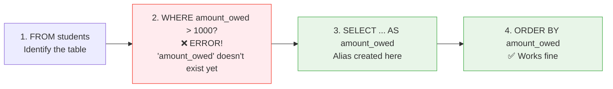

# 🗄️🤖 SQL & GenAI Course
**🎯 Quality Education for Anyone, Anywhere, Anytime — 💫 with Comfort, Convenience at no Cost**

## 📘 File 7: DISTINCT & Aliases – Polishing the Results

Congratulations! You've mastered the core of data retrieval: selecting, filtering, and handling NULLs. Now it's time to **polish** your results. In File 7, we move from "what" data to retrieve to "how" to present it cleanly. 

Sometimes you need to see only unique values (`DISTINCT`) or give your columns a cleaner, more readable name (`AS` – aliases). These are the finishing touches that turn raw output into professional reports. `DISTINCT` removes the clutter of duplicates, and `Aliases` make technical column names human-friendly.

This is the **"Artisan's Finishing Brush."** `DISTINCT` cuts through the noise; aliases make your output speak your language.

---

### 📍 Your Current Stage – PREPARE Journey



You're in **Stage 1: PREPARE**. Files 1–6 are complete. This is your final concept file. After this, you'll return to the Module Guide to begin the PRACTICE stage.

---
### 🌌 The SQLVerse Journey – Your Destination

You're about to complete your journey across the SQLVerse through Education Planet. Here's the path you've walked:

```mermaid
flowchart LR
    subgraph SQLVERSE["🌌 THE SQLVERSE"]
        direction LR
        Start["File 1<br/>SELECT"] --> File2["File 2<br/>WHERE"]
        File2 --> File3["File 3<br/>Logical Ops"]
        File3 --> File4["File 4<br/>IN & BETWEEN"]
        File4 --> File5["File 5<br/>LIKE"]
        File5 --> File6["File 6<br/>NULL"]
        File6 --> Current["📍 File 7<br/>DISTINCT & Aliases<br/>YOU ARE HERE"]
        Current --> Bonus1["✨ Bonus 1<br/>Query Rhythm"]
        Bonus1 --> Bonus2["✨ Bonus 2<br/>INSERT Preview"]
        Bonus2 --> Complete["✅ PREPARE<br/>COMPLETE"]
        Complete --> Practice["🔄 PRACTICE<br/>STAGE"]
        Practice --> Portfolio["📂 CEO Report<br/>Portfolio Piece"]
    end
    
    style Start fill:#e1f5fe,stroke:#2196f3
    style File2 fill:#e1f5fe,stroke:#2196f3
    style File3 fill:#e1f5fe,stroke:#2196f3
    style File4 fill:#e1f5fe,stroke:#2196f3
    style File5 fill:#e1f5fe,stroke:#2196f3
    style File6 fill:#e1f5fe,stroke:#2196f3
    style Current fill:#fff8e1,stroke:#ff9800,stroke-width:4px
    style Bonus1 fill:#e1f5fe,stroke:#9c27b0,stroke-width:2px
    style Bonus2 fill:#e1f5fe,stroke:#9c27b0,stroke-width:2px
    style Complete fill:#c8e6c9,stroke:#4caf50,stroke-width:2px
    style Practice fill:#e8f5e8,stroke:#4caf50
    style Portfolio fill:#fff3e0,stroke:#ff9800,stroke-width:2px
```



**This is where you're headed.** The path ahead is clear – bonus skills, portfolio piece, and the PRACTICE stage beyond. Let's take the final steps together. 🚀

---

## 🔧 Enhanced Browser Office for PREPARE

**🚀 Kickstart: Any Computer, Any Browser, Anytime.**  
**🌍 Destination: Any country, Any city, Any Platform.**

| Tab | Purpose | What to Do |
| :--- | :--- | :--- |
| **1: The Map** | Read concept files | You're here – reading this file. After this, return to the Module Guide. |
| **2: The Factory** | Run queries | Keep **[`training_institution_sample.db`](../../../Resources/sample_databases/training_institution_sample.db)** loaded. Run every example query. |
| **3: The Consultant** | Conceptual Q&A | Ask about `DISTINCT`, aliases, or execution order. **Configure AI with [Student Mode Prompt](../../../STUDENT_MODE_PROMPT_LEVEL1.md) (no code generation).** |
| **4: The Vault** | Save your work | Save successful queries in: `Learning/Level-1-beginner/Level1-1-ACQUIRE/Module2-BasicRetrieval-SelectAndWhere/1-sqlCommands/` |

---

### 🛠️ Module 2 Toolkit

🚀 Foundation First, AI Next, Projects Last.  
💎 Gemstone by Gemstone, Skill by Skill.

| | | | |
|---|---|---|---|
| **Browser Office** | 🔧 [Troubleshooting Common Issues](../../../Setup/STEP1_COMMISSION_BROWSER_OFFICE.md) | 🔄 [Browser Office Workflow](../../../Setup/STEP2_ESTABLISH_LEARNING_RITUAL.md) | ⌨️ [Tab Operations & Shortcuts](../../../Setup/STEP3_MASTER_TAB_OPERATIONS.md) |
| **ACQUIRE Section** | 🗄️ [Database Ecosystem](../../Guides/Section1-ACQUIRE/2_Database_Ecosystem.md) | 📚 [Knowledge Base (Vault)](../../Guides/Section1-ACQUIRE/3_Knowledge_Base.md) | 🧠 [Mindset Tuning](../../Guides/Section1-ACQUIRE/4_Mindset.md) |

---

## 🎯 What You'll Learn

By the end of this file, you will be able to:

- Use `SELECT DISTINCT` to eliminate duplicate rows from your results
- Apply `DISTINCT` to single and multiple columns
- Use column aliases (`AS`) to rename output columns for clarity
- Understand that aliases can be used in `ORDER BY` (preview – full coverage in **Module 3**) but not in `WHERE`
- Combine `DISTINCT` with aliases to create clean, readable reports

---

## 📊 Our Practice Table: `students`

We'll continue using the `students` table. Here's a refresher:

| student_id | first_name | last_name | email | phone | enrollment_date | total_fees | fees_paid |
|------------|------------|-----------|-------|-------|-----------------|------------|-----------|
| 101 | Sarah | Chen | sarah.chen@email.com | 555-0101 | 2024-01-15 | 4500.00 | 3000.00 |
| 102 | Mike | Rodriguez | mike.rod@email.com | 555-0102 | 2024-01-20 | 5200.00 | 5200.00 |
| 103 | Jessica | Park | jessica.park@email.com | 555-0103 | 2024-02-01 | 4500.00 | 2000.00 |
| 104 | David | Thompson | david.t@email.com | 555-0104 | 2024-02-10 | 4800.00 | 4800.00 |
| 105 | Lisa | Johnson | lisa.j@email.com | 555-0105 | 2024-02-15 | 5200.00 | 3000.00 |
| 106 | Alex | Kumar | alex.kumar@email.com | 555-0106 | 2024-03-01 | 4500.00 | 4500.00 |
| 107 | Maria | Garcia | maria.g@email.com | 555-0107 | 2024-03-10 | 3800.00 | 2000.00 |
| 108 | James | Wilson | james.w@email.com | 555-0108 | 2024-03-15 | 5200.00 | 0.00 |
| 109 | Priya | Patel | priya.p@email.com | 555-0109 | 2024-04-01 | 4500.00 | 1500.00 |
| 110 | Carlos | Mendez | carlos.m@email.com | 555-0110 | 2024-04-05 | 3800.00 | 3800.00 |
| 111 | Ben | Johnson | ben.j@email.com | NULL | 2024-05-01 | 5200.00 | 0.00 |
| 112 | Sam | Anderson | sam.a@email.com | NULL | 2024-05-02 | 3800.00 | 3800.00 |
| 113 | Emma | Brown | emma.b@email.com | 555-0113 | 2024-05-05 | 4800.00 | 4800.00 |

---

## 🧼 The `DISTINCT` Operator (Removing the Clutter)

In a large table, values repeat often. If you want to know which cities your students come from, you don't want to see "New York" listed 50 times. You just want the **unique** list.

**Visualizing DISTINCT:**

```
┌─────────────────┐        ┌─────────────────┐
│ Original Data   │        │ After DISTINCT  │
├─────────────────┤        ├─────────────────┤
│ New York        │        │ New York        │
│ New York        │   →    │ London          │
│ London          │        │ Paris           │
│ Paris           │        └─────────────────┘
│ London          │
│ New York        │
└─────────────────┘
```

**The "Cluttered" way:**

```sql
SELECT city FROM students; 
-- Returns: New York, New York, London, Paris, London...
```

**The "Artisan" way:**

```sql
SELECT DISTINCT city FROM cities;
-- Returns: New York, London, Paris (Unique values only!)
```

Let us apply this concept for`students` table`:

**Question:** What are the unique fee levels we're charging students?

```sql
SELECT DISTINCT total_fees FROM students;
```

**Try it now in Tab 2.**  
**Expected Result:** 4 unique values: 3800.00, 4500.00, 4800.00, 5200.00  
**What you're seeing:** Each fee tier appears once, showing our pricing structure clearly. The duplicates (4500 appears multiple times) are gone.

> 💡 `DISTINCT` applies to all selected columns. If you select multiple columns, it removes rows where **all** selected columns are identical. For example, `SELECT DISTINCT last_name, first_name` would give you unique name pairs.

---
## 🤔 When Should You Use DISTINCT?

### ✅ Use DISTINCT When:
1. **Creating dropdown lists** (unique cities, categories, etc.)
2. **Finding variety** ("How many different fee levels exist?")
3. **Removing accidental duplicates** (cleaning bad data)
4. **Summarizing options** (all available enrollment dates)

### ❌ Avoid DISTINCT When:
1. **You need row counts** (DISTINCT removes rows, skewing counts)
2. **Duplicates are meaningful** (multiple orders from same customer)
3. **Performance matters** (DISTINCT is slower—it must compare all rows)
4. **You're debugging** (duplicates might reveal underlying data issues)

**The Artisan's Rule:**  
> *"Use DISTINCT to answer 'what options exist?' Not to hide data quality problems."*

---
## 🏷️ Aliases: `AS` (Professional Nicknames)

Database column names are often technical and ugly (e.g., `std_enrl_dt_2024`). Using an **Alias** lets you rename the column in your final report without changing the actual table.

**Scenario:** Create a Student Admission Report for the Board of Directors.
**Question:** How can we make our report more readable for non-technical people at Corporate?

```sql
SELECT first_name, enrollment_date AS Admission_Date
FROM students;
```
**Try it now in Tab 2.**  
**Expected Result:** Column headers show "first_name" and "Admission_Date" – much clearer!  
**What you're seeing:** The alias temporarily renames the column in the output only. The table itself remains unchanged.

> 💡 **Pro Tip:** If your alias has spaces, wrap it in quotes: `AS "Date Joined"`.


### 🧮 Aliases with Calculated Columns

Aliases are especially useful when you create calculated columns.

**Scenario:** Create a Payment Outstanding Report for the Board of Directors.
**Question:** How much does each student still owe on their fees?

```sql
SELECT first_name, last_name, total_fees - fees_paid AS "amount outstanding"
FROM students;
```

**Try it now in Tab 2.**  
**Expected Result:** A third column appears named "amount outstanding" showing the calculation.  
**What you're seeing:** The alias gives a meaningful name to the calculation, making the output self-explanatory.

---

### 🏛️ The Artisan's Guardrail: Alias Usage Restrictions

**Important:** You cannot use a column alias in the `WHERE` clause of the same query. Why? Because of execution order: `WHERE` is evaluated before `SELECT`, so the alias hasn't been created yet.

**Behind‑the‑Scenes: How SQL Executes Your Query**



**💡 Why it matters:** As you can see in the diagram, the `WHERE` filter is applied before the `SELECT` list is even looked at. That's why the database doesn't recognize your new nickname (alias) yet!

```sql
-- This will NOT work:
SELECT first_name, last_name, total_fees - fees_paid AS amount_owed
FROM students
WHERE amount_owed > 1000;   -- ERROR!

-- You must repeat the expression:
WHERE total_fees - fees_paid > 1000;
```
**Note:** Aliases can be used in `ORDER BY` (which runs after SELECT), but we'll cover **ORDER BY** thoroughly in **Module 3**.

---
## 🎨 Professional Alias Guidelines

### Naming Conventions (Choose One Style)

```sql
-- Snake case (recommended for code)
SELECT total_fees AS total_amount FROM students;

-- Camel case (common in programming)
SELECT total_fees AS totalAmount FROM students;

-- Title case with spaces (most readable for non-technical users)
SELECT total_fees AS "Total Amount (USD)" FROM students;
```

### Common Alias Patterns

| Original Column | Professional Alias | Use Case |
|----------------|-------------------|----------|
| `std_id` | `"Student ID"` | Reports for managers |
| `enrl_dt` | `enrollment_date` | Code clarity |
| `tot_fees - fees_pd` | `"Balance Due"` | Business dashboards |
| `first_name` | `"First Name"` | User‑friendly displays |

**Remember:** Aliases are for your **AUDIENCE**. Code for developers, readable names for business users. Choose the style that fits who will read your report.

---

## 🧪 Try It Now (Training DB)

Run these final PREPARE queries in **Tab 2**:

1. **Unique Fees:** See all the different fee levels being charged.
```sql
SELECT DISTINCT total_fees FROM students;
```

2. **The Friendly Report:** Create a report with readable headers.
```sql
SELECT first_name AS "Student Name", fees_paid AS "Amount Paid"
FROM students;
```


**(Note: In SQLite, you can use the alias directly in `ORDER BY`. Sorting the results in ascending or descending order of "Amount Paid" will be explored fully in Module 3.)**

---

## ⚠️ Common Mistakes

### Mistake 1: Forgetting `DISTINCT` when you need it
```sql
-- Without DISTINCT, you get duplicates
SELECT last_name FROM students;

-- If you only want unique last names, use DISTINCT
SELECT DISTINCT last_name FROM students;
```

### Mistake 2: Using `DISTINCT` unnecessarily
It's slower because the database must compare rows. Use it only when needed.

### Mistake 3: Using alias in WHERE
```sql
-- Wrong:
SELECT total_fees - fees_paid AS balance
FROM students
WHERE balance > 0;

-- Right:
WHERE total_fees - fees_paid > 0;
```

### Mistake 4: Putting quotes around a simple alias without spaces
Both are okay, but if you use quotes, you must use double quotes or brackets in some databases. In SQLite, double quotes work. Single quotes are for strings, not aliases.


### 🏷️ Alias Naming Best Practices

**Simple aliases (no spaces):** No quotes needed
```sql
SELECT first_name AS student_name FROM students;
```

**Aliases with spaces:** Use double quotes
```sql
SELECT first_name AS "Student Name" FROM students;
```

**Pro tip:** Avoid spaces in aliases when possible. Use underscores instead:
- ✅ `student_name` (clean, no quotes needed)
- ⚠️ `"Student Name"` (works but requires quotes)

> 💡 **SQL Standard:** Double quotes are the official SQL standard for identifiers like aliases. Single quotes are for strings only. Stick to double quotes for maximum compatibility across different database systems.

---

## 🧪 Try It Yourself – DISTINCT & Alias Challenges

**Challenge 1: Unique Enrollment Dates**  
**Question:** On which distinct dates did students enroll in our program?

```sql
-- Your query here
-- Hint: Use DISTINCT on enrollment_date
-- Save as: 7-1-unique-dates.sql
```

**Expected Result:** A list of unique enrollment dates (no duplicates)  
**What this teaches:** DISTINCT removes duplicate rows from results.

---

**Challenge 2: Name Combinations**  
**Question:** Are there any students who share the exact same first AND last name?

```sql
-- Your query here
-- Hint: Use DISTINCT on both first_name and last_name
-- Save as: 7-2-unique-names.sql
```

**Expected Result:** 13 rows (all students, since no duplicates exist)  
**What this teaches:** DISTINCT on multiple columns requires ALL selected columns to match for a row to be considered a duplicate.

---

**Challenge 3: Payment Status Report**  
**Question:** What percentage of their total fees has each student paid?

```sql
-- Calculate: (fees_paid / total_fees) * 100
-- Alias the calculation as "Payment Percent"
-- Also alias first_name as "Student"
-- Save as: 7-3-payment-status.sql
```

**Expected Result:** Clean column names like "Student" and "Payment Percent"  
**What this teaches:** Aliases make calculations readable and professional.

---

**Challenge 4: The Alias Trap**  
**Question:** Can you use your "Payment Percent" alias to filter results?

```sql
-- First, try this (it will fail!):
SELECT first_name AS Student, 
       (fees_paid / total_fees) * 100 AS "Payment Percent"
FROM students
WHERE "Payment Percent" > 50;

-- Then fix it by repeating the calculation in WHERE
-- Save both attempts as: 7-4-alias-trap-fixed.sql
```

**Expected Result:** First query fails with error. Second query (with calculation in WHERE) works.  
**What this teaches:** Aliases are created in SELECT, which runs AFTER WHERE. You can't use them in WHERE.

---

**Challenge 5: Professional Student Roster**  
**Question:** Create the cleanest, most readable student roster possible.

```sql
-- Show: first_name, last_name, email, enrollment_date
-- Use aliases to make every column name business-friendly
-- (Example: "First Name", "Last Name", "Email Address", "Enrolled On")
-- Save as: 7-5-professional-roster.sql
```

**Expected Result:** Column headers that any non-technical person could understand immediately.  
**What this teaches:** Good aliases make data accessible to everyone.

---
### 🧪 **DISTINCT with Duplicates – See It in Action!**

The current `students` table has mostly unique fee values. Let's create a **real duplicate scenario** so you can see `DISTINCT` do its magic.

**Step 1: Add two new students with duplicate fee amounts**
```sql
-- Add students with fees that already exist in the table
INSERT INTO students (student_id, first_name, last_name, email, phone, enrollment_date, total_fees, fees_paid)
VALUES 
    (114, 'Oliver', 'Smith', 'oliver.s@email.com', '555-0114', '2024-05-10', 4500.00, 2000.00),
    (115, 'Sophia', 'Lee', 'sophia.lee@email.com', '555-0115', '2024-05-12', 5200.00, 1000.00);
```

> 🎉 **Notice something?** In File 6, you created 3 records with `INSERT`. Now you've just created 2 more. **You've mastered the `INSERT` command!** This is the power of building skills – what felt new in File 6 is now second nature.

**Step 2: Run these queries to see the difference**

```sql
-- Without DISTINCT – see all the duplicates
SELECT total_fees FROM students;

-- With DISTINCT – only unique values remain
SELECT DISTINCT total_fees FROM students;
```

**What you'll see:**


| Without DISTINCT | With DISTINCT |
|------------------|---------------|
| 3800, 3800, 3800 | 3800 |
| 4500, 4500, 4500, 4500 | 4500 |
| 4800, 4800 | 4800 |
| 5200, 5200, 5200, 5200 | 5200 |
| *(15+ rows, unordered)* | *(4 clean rows)* |

**The "Aha!" moment:** Despite adding two new students, the `DISTINCT` query still returns only **4 rows** – because 4500 and 5200 already existed. **Duplicates vanish; unique values remain.** (In Module 3, you'll learn to sort these results with `ORDER BY`.)


---


## ✨ Bonus Skill 1: The Artisan's Query Rhythm – Your Secret Weapon

Throughout this module, every query followed a simple, powerful pattern:

| Step | What You Do |
|------|-------------|
| **1. The Question** | State clearly what you're trying to find |
| **2. The Query** | Write the SQL code |
| **3. Try it now** | Run it in Tab 2 |
| **4. Expected Result** | Know what success looks like |
| **5. What you're seeing** | Understand why you got that result |

We call this **"The Artisan's Query Rhythm"** – a disciplined way to learn by doing, observing, and understanding. You've been training like an athlete, one rep at a time, across seven files and countless queries.

**Use this rhythm in every practice session, every debug session, every real‑world analysis.** It turns confusion into clarity and questions into insights.

> 💡 **Pro Tip:** Stuck on a query? Walk through the rhythm aloud. The step you skip is usually where the bug hides.
---

## ✨ Bonus Skill 2: A Glimpse Beyond – Adding New Data

You've mastered reading data. But what about creating it? Remember in File 6 when we added Ben, Sam, and Emma using `INSERT`?

```sql
-- Adding new students (from File 6)
INSERT INTO students (student_id, first_name, last_name, email, enrollment_date, total_fees, fees_paid)
VALUES 
    (111, 'Ben', 'Johnson', 'ben.j@email.com', '2024-05-01', 5200.00, 0.00),
    (112, 'Sam', 'Anderson', 'sam.a@email.com', '2024-05-02', 3800.00, 3800.00);
```

Notice something powerful? The `WHERE` conditions you've mastered work exactly the same way with `INSERT`, `UPDATE`, and `DELETE`:

```sql
-- Preview: Find students to update (uses your WHERE skills!)
SELECT * FROM students WHERE phone IS NULL;

-- Future module: Update them
UPDATE students SET phone = '555-0000' WHERE phone IS NULL;

-- Future module: Delete them
DELETE FROM students WHERE phone IS NULL AND enrollment_date < '2024-01-01';
```

**The Insight:** Every filtering skill you've learned in Module 2 – `AND`, `OR`, `IN`, `BETWEEN`, `LIKE`, `IS NULL` – transfers directly to modifying and deleting data. You're not just learning to read; you're learning to **control** data.

In **Module 3**, you'll become a true data steward, mastering the full cycle: `INSERT`, `UPDATE`, `DELETE`, and the transactions that keep data safe.

---

## 🎯 BONUS CHALLENGE: The CEO's Report – A Final Cumulative Challenge

You've now mastered every concept in Module 2. It's time to bring it all together – `SELECT`, `WHERE`, `IN`, `BETWEEN`, `LIKE`, `NULL`, `DISTINCT`, aliases – in one comprehensive real‑world scenario. This challenge is your opportunity to work as a real data analyst.

You've been hired as a junior data analyst for the **E‑Store**. The CEO needs a one‑page report to understand their customers, products, and sales. Your mission: answer the following business questions using SQL queries on the **`level1_estore_basic.db`** database.

> **📌 Important:** For this challenge, switch your **Factory (Tab 2)** to the **E‑Store database**:  
> [`level1_estore_basic.db`](../../../Resources/sample_databases/level1_estore_basic.db)  
> All questions below refer to tables in this database (`customers`, `products`, `orders`, `order_items`).
> **📁 Need a Quick Refresher on the E-Store Tables?**
>
> The **Module 2 Toolkit** (right here in this file) contains a link to the **Database Ecosystem** guide. That guide includes complete table diagrams and column descriptions for the E-Store database.
>
> Use it if you need to:
> - Check column names
> - See how tables like `customers`, `orders`, and `products` connect
> - Verify what data is available before writing your queries
>
> **Think of it as your reference manual – open it whenever you need a quick reminder.**

---

### 🧠 The CEO's Questions

1. **Where are our customers located?**  
   - List all unique cities where customers live.  
   - Use `DISTINCT` and alias the column as `Customer Cities`.

2. **Which products cost between $50 and $150?**  
   - Show `product_name` and `price`.
   - Use `BETWEEN` and alias `price` as `Price (USD)`.

3. **Find customers whose email domain is NOT 'email.com'.**  
   - Use `NOT LIKE` to find them.  
   - Alias the result columns nicely.

4. **What products have "book" in their name?**  
   - Use `LIKE` to find any product containing the word "book".  
   - Show `product_name` and `category`, with aliases.

5. **Which orders have quantities of 1, 2, or 3?**  
   - Use `IN` to filter `order_items` for these quantities.  
   - Display `order_id`, `product_id`, `quantity`, and alias `quantity` as `Qty`.

6. **What are the unique product categories we sell?**
   -  Use `DISTINCT` to find all unique categories. 
   -  Alias the column as `Product Categories`.

7. **Find customers whose names start with 'A' or end with 'e'.**  
   - Use `LIKE` with `%` and `OR`.  
   - Show `name` and `email`.

---


### 🌟 Your First Portfolio Piece

This isn't just another exercise. This is your **first professional portfolio piece**.

When you complete this challenge, you'll have something tangible to show employers:
- ✅ Seven real business questions
- ✅ Clean, documented SQL queries
- ✅ Insights a CEO would actually care about

Save your work carefully. Document your thinking. This is the kind of artifact that turns interviews into job offers.

---

### 🧠 The CEO Mindset

A CEO doesn't care about syntax. They care about answers:
- *"Where are my customers?"*
- *"What products are selling?"*
- *"How can I reach more people?"*

Your job as a Data Artisan is to translate their questions into SQL and translate your results back into business insights. That's exactly what this challenge builds.

---

### 🎨 Apply the Artisan's Query Rhythm

For each of the 7 questions, document your work using the rhythm you've mastered:

1. **The Question** – the business question you're answering.
2. **The Query** – your SQL code.
3. **The Result** – what you see when you run it.
4. **The Interpretation** – what the result tells you about the business.


```markdown
Create a markdown file in your Vault named `ceo-report-rhythm.md` and structure it like this:

```
## Q1: Where are our customers located?

**Question:** List all unique cities where customers live.

**Query:**
SELECT DISTINCT city AS "Customer Cities"
FROM customers;

**Result:** 
[Paste the actual output from Tab 2]

**Interpretation:**
We have customers in [city names]. This helps us target marketing efforts in those regions.
```
```

---

Repeat for all 7 questions. This disciplined approach will turn your SQL practice into a professional portfolio piece. Future employers love seeing clear, structured problem‑solving!

---


### 📂 **Portfolio Placement: The CEO SUITE**

This isn't just another exercise – it's your first **executive-level deliverable**. Store it where it belongs:

```
Projects/Level-1-beginner/CEO SUITE/
├── ceo-report-rhythm.md    # Full documentation with insights
└── queries/                 # Individual SQL files
    ├── 1-unique-cities.sql
    ├── 2-price-range.sql
    ├── 3-non-email-domains.sql
    ├── 4-books.sql
    ├── 5-small-orders.sql
    ├── 6-category-count.sql
    └── 7-name-patterns.sql
```
**Why "CEO SUITE"?** Because this work answers questions that matter to leadership. When future employers see a dedicated folder for executive-level analysis, they'll know you think beyond syntax – you think about business impact.

---
### 🏁 Bonus Challenge Complete

You've just simulated the work of a real data analyst: taking business questions, translating them into SQL, and producing clean, readable reports. This is exactly what awaits you in the ANALYZE phase and in your career.

**The Artisan's Truth:**

> *"Every query you write is a conversation with data. Today you held a conversation that would make any CEO proud. Keep polishing, keep questioning, and keep growing."*

---

## ✅ Progress Check

After reading this and trying the examples, can you:

- [ ] Use `SELECT DISTINCT` to get unique values from one or more columns?
- [ ] Apply column aliases with `AS` to rename output columns?
- [ ] Understand why aliases can't be used in `WHERE`?
- [ ] Use aliases in `ORDER BY`?
- [ ] Explain the **Artisan's Query Rhythm** and why it matters?
- [ ] Preview how `WHERE` skills transfer to `UPDATE` and `DELETE`?
- [ ] Save your working queries in your Vault?

**If yes → You've mastered DISTINCT and Aliases!**

---

## 💎 DESIGNER'S PERIGON

<div style="border: 3px solid #9c27b0; border-radius: 10px; padding: 20px; margin: 25px 0; background: linear-gradient(135deg, #f3e5f5 0%, #e1bee7 100%);">


### *The Art of Presentation*

Welcome back to the **SQLVerse** – where every domain is a planet and every database is a world to explore. Today on **Education Planet**, we add the finishing touches. Because every world deserves to be seen at its best.

A master craftsman doesn't just build – they present. The finest woodworker sands and varnishes. The best chef plates with care. And the Data Artisan polishes their output.

`DISTINCT` is your sandpaper – it removes the rough duplicates that clutter your view. Aliases are your label maker – they tell the world what each column means, in plain language.

In the corporate world, you don't just "dump data" on a manager's desk. You present **Information**.

- `DISTINCT` is about **Efficiency** – telling the story in as few words as possible by cutting out the noise.
- `Aliases` are about **Empathy** – making sure the person reading your report understands it instantly without needing a technical dictionary.
---

### 🏦 Fintech Planet: Clean Transaction Reports

**Before Aliases:**
```sql
SELECT trans_id, trans_amount, trans_date, acct_balance FROM transactions;
-- Output: "trans_id", "trans_amount", "trans_date", "acct_balance"
```

**After Aliases:**
```sql
SELECT 
    trans_id AS "Transaction ID",
    trans_amount AS "Amount ($)",
    trans_date AS "Date",
    acct_balance AS "Balance After"
FROM transactions
WHERE trans_amount > 1000;
-- Output: "Transaction ID", "Amount ($)", "Date", "Balance After"
```

**The Unpolished Version:**
```sql
SELECT customer_id, trans_amount - fees FROM transactions WHERE status = 'pending';
```

**The Artisan's Version:**
```sql
SELECT 
    customer_id AS "Customer",
    trans_amount - fees AS "Net Amount",
    trans_date AS "Processed On"
FROM transactions
WHERE status = 'pending'
ORDER BY "Net Amount" DESC;
```

The numbers haven't changed. But now, a bank manager can read this report instantly – no technical dictionary required. On **Fintech Planet**, clarity isn't just professional; it's essential for compliance and customer trust.

---

### 🌌 The SQLVerse Journey – Complete

You've traveled across the SQLVerse, mastering each planet's unique challenges. Look how far you've come:

```mermaid
flowchart LR
    subgraph SQLVERSE["🌌 THE SQLVERSE"]
        direction LR
        M1F1["File 1<br/>SELECT"] --> M1F2["File 2<br/>WHERE"]
        M1F2 --> M1F3["File 3<br/>Logical Ops"]
        M1F3 --> M1F4["File 4<br/>IN & BETWEEN"]
        M1F4 --> M1F5["File 5<br/>LIKE"]
        M1F5 --> M1F6["File 6<br/>NULL"]
        M1F6 --> Current["📍 File 7<br/>DISTINCT & Aliases<br/>YOU ARE HERE"]
        Current --> PrepComplete["✅ PREPARE<br/>COMPLETE"]
        PrepComplete --> Practice["🔄 PRACTICE STAGE<br/>🛒 E-Commerce Planet"]
        Practice --> Evaluate["📝 EVALUATE STAGE"]
        Evaluate --> Reflection["📖 Module 2 Guide<br/>for Reflection"]
        Reflection --> NextModule["📂 Module 3<br/>🏫 Education Planet<br/>Sorting & Aggregation"]
    end
    
    style M1F1 fill:#e1f5fe,stroke:#4caf50,stroke-width:2px
    style M1F2 fill:#e1f5fe,stroke:#4caf50,stroke-width:2px
    style M1F3 fill:#e1f5fe,stroke:#4caf50,stroke-width:2px
    style M1F4 fill:#e1f5fe,stroke:#4caf50,stroke-width:2px
    style M1F5 fill:#e1f5fe,stroke:#4caf50,stroke-width:2px
    style M1F6 fill:#e1f5fe,stroke:#4caf50,stroke-width:2px
    style Current fill:#fff8e1,stroke:#ff9800,stroke-width:4px
    style PrepComplete fill:#c8e6c9,stroke:#4caf50,stroke-width:2px
    style Practice fill:#e8f5e8,stroke:#4caf50,stroke-width:2px
    style Evaluate fill:#fff8e1,stroke:#ff9800,stroke-width:2px
    style Reflection fill:#fff8e1,stroke:#ff9800,stroke-width:2px
    style NextModule fill:#e1f5fe,stroke:#2196f3,stroke-width:2px
```



From your first `SELECT` on Education Planet to handling NULLs on HR Planet, from pattern matching on E-Commerce Planet to now – the final polish. Every concept, every planet, every query has led you here.

### ✨ Your Journey at a Glance

| Stage | What You Mastered |
|-------|-------------------|
| **Files 1-6** | Core SQL concepts across Education, HR, and E-Commerce planets |
| **File 7** | Presentation polish with `DISTINCT` and Aliases |
| **✨ Bonus 1** | The Artisan's Query Rhythm – your methodology for life |
| **✨ Bonus 2** | INSERT preview – your first step into data modification |
| **📂 CEO Report** | Your first professional portfolio piece |

From your first `SELECT` to handling NULLs, from pattern matching to polishing results – and now, with two bonus skills in your toolkit, you're ready for the PRACTICE stage and beyond.

The laws of the SQLVerse are now yours. **Go forth and explore every planet you come across.** 🚀

---

### 🎯 What Sets This Course Apart

| Other Courses Teach You... | This Course Taught You... |
|---------------------------|---------------------------|
| `SELECT` syntax | **Asking questions** – Every query is a conversation with data |
| `WHERE` filters | **Filtering the noise** – Finding signal in the chaos |
| `AND`/`OR`/`NOT` operators | **Layering logic** – Building complex decisions from simple rules |
| `IN` and `BETWEEN` shortcuts | **Writing with elegance** – Code that communicates intent |
| `LIKE` and wildcards | **Fuzzy thinking** – Finding patterns when you don't have exact matches |
| `NULL` handling | **Knowing what you don't know** – Treating missing data honestly |
| `DISTINCT` and aliases | **Presentation** – Turning raw output into professional reports |
| **The Artisan's Query Rhythm** | **Methodology** – A disciplined approach to learning and problem-solving |
| **INSERT preview** | **Future readiness** – Your WHERE skills transfer everywhere |

**The Difference:** You're not just memorizing commands – you're discovering how to apply them to your life, your work, and your world. That's the journey from SQL user to **Data Artisan**.

---
### 🛠️ The Artisan's Final Polish

When you hand a report to a manager, they shouldn't have to ask, *"What does this column mean?"* If you've used your Aliases correctly, the data speaks for itself. Clear names build trust, and trust is the most valuable currency on any planet in the SQLVerse.

---

### 🧠 The Artisan's Truth

> *"A data professional is part detective and part storyteller. Filtering finds the truth; DISTINCT and Aliases help you tell that truth clearly. Your report is your signature – make it professional."*

> *"You've journeyed across the SQLVerse – from Education to HR to E-Commerce. You've faced NULLs, tamed wildcards, and polished your results. The laws of the SQLVerse are now yours."*

> *"The PREPARE stage is complete. The PRACTICE stage awaits. Go forth and query."*

</div>

---

## 🎉 PREPARE COMPLETE

Congratulations! You've completed all seven concept files for Module 2. You now know how to:

- Retrieve data with `SELECT`
- Filter with `WHERE`, comparison operators, and logical operators
- Use `IN` and `BETWEEN` for cleaner conditions
- Search patterns with `LIKE` and wildcards
- Handle `NULL` correctly
- Polish results with `DISTINCT` and aliases
- Apply the **Artisan's Query Rhythm** as a disciplined practice
- Preview data modification with `INSERT`
- Tackle a comprehensive **CEO Report** using all concepts

**You are now ready for the PRACTICE stage!**

---

## 🧭 File Navigation

```mermaid
flowchart LR
    A["✅ COMPLETED<br/>📘 File 1<br/>The SELECT Clause"] --> B
    B["✅ COMPLETED<br/>📘 File 2<br/>The WHERE Clause"] --> C
    C["✅ COMPLETED<br/>📘 File 3<br/>Logical Operators"] --> D
    D["✅ COMPLETED<br/>📘 File 4<br/>IN & BETWEEN"] --> E
    E["✅ COMPLETED<br/>📘 File 5<br/>LIKE & Wildcards"] --> F
    F["✅ COMPLETED<br/>📘 File 6<br/>NULL Handling"] --> G
    G["📍 YOU ARE HERE<br/>📘 File 7<br/>DISTINCT & Aliases"] --> H
    H["✅ PREPARE COMPLETE"] --> I
    I["🔄 RETURN TO MODULE GUIDE<br/>TO BEGIN PRACTICE SECTION"]
    
    style A fill:#e1f5fe,stroke:#4caf50,stroke-width:4px
    style B fill:#e1f5fe,stroke:#4caf50,stroke-width:4px
    style C fill:#e1f5fe,stroke:#4caf50,stroke-width:4px
    style D fill:#e1f5fe,stroke:#4caf50,stroke-width:4px
    style E fill:#e1f5fe,stroke:#4caf50,stroke-width:4px
    style F fill:#e1f5fe,stroke:#4caf50,stroke-width:4px
    style G fill:#e1f5fe,stroke:#2196f3,stroke-width:4px
    style H fill:#fff8e1,stroke:#ff9800,stroke-width:2px
    style I fill:#e8f5e8,stroke:#4caf50,stroke-width:2px
```


| Previous Step | Next Step |
|:---:|:---:|
| [← Back to File 6: NULL Handling](./6-null-handling.md) | [Return to Module 2 Guide →](../MODULE2_GUIDE.md) |

---

*Part of our mission for 🎯 Quality Education for Anyone, Anywhere, Anytime — 💫 with Comfort, Convenience at no Cost.*

**Level 1 | Module 2 | File 7: DISTINCT & Aliases | Next: Return to Module 2 Guide**


