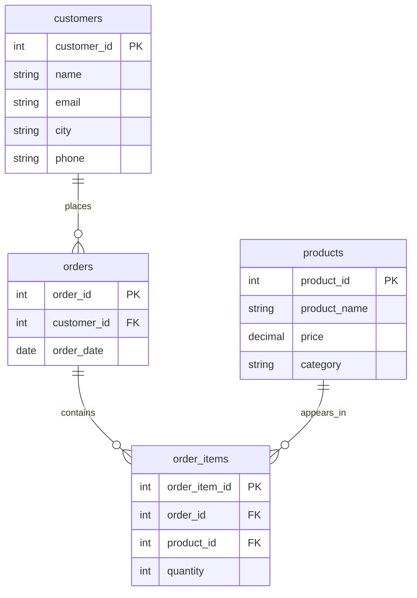
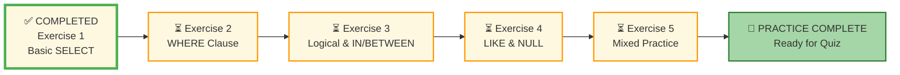




# 🗄️🤖 SQL & GenAI Course
**🎯 Quality Education for Anyone, Anywhere, Anytime — 💫 with Comfort, Convenience at no Cost**

## 🧠 Exercise 1: Basic SELECT

Welcome to your first practice exercise in Module 2! You've learned how to retrieve data using `SELECT`. Now it's time to apply that knowledge to a new database – the **E‑Store** database. No more Training Institution – you're now working with real customer and product data. This change is crucial because it helps you realize that while the *data* changes, the *SQL logic* remains your constant, reliable tool.

---
## 🌌 SQLVerse Check-In

<div style="border-left: 4px solid #9c27b0; background-color: #f3e5f5; padding: 15px; margin: 20px 0; border-radius: 0 8px 8px 0;">

**The laws of the SQLVerse are no longer mysteries to you. You have the keys.** Now you're on **E-Commerce Planet** – where the same rules apply, but the data tells a different story.

The SQLVerse is waiting. Your portfolio is calling.

**The difference between a coder and an Artisan is discipline.**

</div>

---

### 📍 Your Current Stage

```mermaid
flowchart LR
    A["✅ PREPARE Complete<br/>📘 Files 1-7"] --> B
    B["📍 YOU ARE HERE<br/>👁️ Practice Exercise 1<br/>Basic SELECT"] --> C
    C["⏳ Practice Exercise 2<br/>WHERE Clause"] --> D
    D["⏳ Practice Exercise 3<br/>Logical & IN/BETWEEN"] --> E
    E["⏳ Practice Exercise 4<br/>LIKE & NULL"] --> F
    F["⏳ Practice Exercise 5<br/>Mixed Practice"] --> G
    G["✅ PRACTICE COMPLETE<br/>Ready for Quiz"]
    
    style A fill:#e1f5fe,stroke:#4caf50,stroke-width:2px
    style B fill:#fff8e1,stroke:#ff9800,stroke-width:4px
    style C fill:#fff8e1,stroke:#ff9800,stroke-width:2px
    style D fill:#fff8e1,stroke:#ff9800,stroke-width:2px
    style E fill:#fff8e1,stroke:#ff9800,stroke-width:2px
    style F fill:#fff8e1,stroke:#ff9800,stroke-width:2px
    style G fill:#a5d6a7,stroke:#2e7d32,stroke-width:2px
```



You've completed all seven concept files. Now it's time to put your skills to work with the **E‑Store database**.

---

## 🔧 Enhanced Browser Office for PRACTICE

**🚀 Kickstart: Any Computer, Any Browser, Anytime.**  
**🌍 Destination: Any country, Any city, Any Platform.**

| Tab | Purpose | What to Do |
| :--- | :--- | :--- |
| **1: The Map** | Reference materials | • Keep your **[Module 2 Reference Guide](./module2-reference.md)** handy for quick syntax reminders.<br>• Complete the exercises below. |
| **2: The Factory** | Run queries | Switch to the **E‑Store database**: **[`level1_estore_basic.db`](../../../Resources/sample_databases/level1_estore_basic.db)**. Run every query in these exercises. |
| **3: The Consultant** | Conceptual Q&A | If you get stuck, ask for hints – but follow the **3‑Attempt Rule**:<br>1. Try from memory/intuition.<br>2. Check the concept file or reference guide.<br>3. Ask the Consultant for a conceptual hint. **[Configure with Student Mode Prompt](../../../STUDENT_MODE_PROMPT_LEVEL1.md)** to ensure AI only provides conceptual guidance, not code. |
| **4: The Vault** | Save your work | Save each successful query in your Vault at: `Learning/Level-1-beginner/Level1-1-ACQUIRE/Module2-BasicRetrieval-SelectAndWhere/2-practiceExercises/` |

---

### 🛠️ Module 2 Toolkit

🚀 Foundation First, AI Next, Projects Last.  
💎 Gemstone by Gemstone, Skill by Skill.

| | | | |
|---|---|---|---|
| **Browser Office** | 🔧 [Troubleshooting Common Issues](../../../Setup/STEP1_COMMISSION_BROWSER_OFFICE.md) | 🔄 [Browser Office Workflow](../../../Setup/STEP2_ESTABLISH_LEARNING_RITUAL.md) | ⌨️ [Tab Operations & Shortcuts](../../../Setup/STEP3_MASTER_TAB_OPERATIONS.md) |
| **ACQUIRE Section** | 🗄️ [Database Ecosystem](../../Guides/Section1-ACQUIRE/2_Database_Ecosystem.md) | 📚 [Knowledge Base (Vault)](../../Guides/Section1-ACQUIRE/3_Knowledge_Base.md) | 🧠 [Mindset Tuning](../../Guides/Section1-ACQUIRE/4_Mindset.md) |

---

## 🏛️ Meet Your Dataset: The E‑Store Schema

As you work through these challenges, visualize how the `SELECT` statement interacts with the database structure. You are essentially pointing at a specific "cabinet" (Table) and asking for specific "files" (Columns).

### 📋 The E‑Store Tables

| Table | Columns (key ones in **bold**) | What It Tells Us |
|-------|--------------------------------|------------------|
| **`customers`** | `customer_id`, **`name`**, **`email`**, **`city`**, `phone` | Who our customers are and where they live. |
| **`products`** | `product_id`, **`product_name`**, **`price`**, **`category`** | What products we sell and how much they cost. |
| **`orders`** | **`order_id`**, `customer_id`, **`order_date`** | When each order was placed and which customer placed it. |
| **`order_items`** | `order_item_id`, `order_id`, `product_id`, **`quantity`** | The line‑item details – which products and how many. |

> **💡 Pro Tip:** Before you start writing queries, run a quick `SELECT * FROM` each table in your Factory to see the actual data. It will make the challenges much easier!

```sql
-- Quick warm‑up: explore each table
SELECT * FROM customers;
SELECT * FROM products;
SELECT * FROM orders;
SELECT * FROM order_items;
```

---

### 🔗 A Peek at Relationships (Preview)

The tables are designed to work together. Here's a simple diagram to show how they connect:



- `orders.customer_id` links to `customers.customer_id`
- `order_items.product_id` links to `products.product_id`
- `order_items.order_id` links to `orders.order_id`

You'll learn how to connect tables using these links in **Module 4 (Joining Tables)** . For now, just focus on querying one table at a time.

---

## 🚀 How to Work Through These Challenges

**Step‑by‑Step Guide:**

1. **Open your Factory (Tab 2)** and ensure you have loaded `level1_estore_basic.db`.
2. **Type your query** for each Challenge.
3. **Observe the result.** Does the column header match what you expected?
4. **Once successful, copy the code** and save it to your Vault (Tab 4).

---

### 🏛️ The Anatomy of Your First Queries

As you work through these challenges, visualize how the `SELECT` statement interacts with the database structure. You are essentially pointing at a specific "cabinet" (Table) and asking for specific "files" (Columns).

---

### 💡 Artisan's Pro‑Tips for Exercise 1

1. **The Case of Case Sensitivity:** SQL keywords like `SELECT` and `FROM` are case‑insensitive, but writing them in **UPPERCASE** is the "Artisan's way." It makes your code readable at a glance.
2. **The Star Trap (`SELECT *`):** Challenge 4 asks you to use the asterisk. In a small practice database, this is fine. In a real‑world database with millions of rows and 100 columns, it's like asking a librarian to "bring me every book in the building" when you only wanted one page. Use it for exploration, but be precise for production!
3. **The Scissors Analogy:** When you write `SELECT name, email FROM customers`, imagine a giant sheet of paper covered in data. Your query is like a pair of scissors, cutting out only the strips of paper you actually need to read. **Efficiency isn't just about speed; it's about clarity.** The less you cut, the cleaner your result.

4. **The Order of Operations:** Remember that even though you write `SELECT` first, the database actually looks at `FROM` first to find the table before it picks the columns.

**Precision is the foundation of data mastery.**

---

### 🧠 Conceptual Sanity Checks

- **Challenge 1 (Directory):** You'll be looking at the `customers` table. Ensure you separate the column names with a **comma**—forgetting that comma is the #1 reason for a syntax error in your first week!
- **Challenge 4 (The Star):** When you run `SELECT * FROM order_items`, notice how the database presents the information. It will show you every single column defined in the table schema. It's the "all‑you‑can‑eat" buffet of data.
- **Challenge 5 (Custom Order):** This is a test of your **Control**. The database stores columns in a specific order, but *you* are the architect of the report. If you put `email` first in your `SELECT` list, the database must obey.

---

## 📝 Challenges


### Challenge 1: Customer Directory
**Question:** What are the names and emails of all our customers?

```sql
-- Your query here
-- Hint: SELECT ... FROM customers
-- Save as: 1-1-customer-directory.sql
```

**Expected Result:** A list of all customer names and emails.  
**Row Count:** 5 rows  
**What this teaches:** Basic `SELECT` on a single table.

---

### Challenge 2: Product Catalog
**Question:** Show the product name and price for every product in the store.

```sql
-- Your query here
-- Hint: products table
-- Save as: 1-2-product-catalog.sql
```

**Expected Result:** All product names and prices.  
**Row Count:** 5 rows  
**What this teaches:** Selecting specific columns.

---

### Challenge 3: Order Headers
**Question:** Retrieve the order ID and order date for all orders.

```sql
-- Your query here
-- Hint: orders table
-- Save as: 1-3-order-headers.sql
```

**Expected Result:** A list of order IDs and dates.  
**Row Count:** 5 rows  
**What this teaches:** Retrieving data from a specific table (`orders`).

---

### Challenge 4: Complete Order Details
**Question:** Get all information from the `order_items` table.

```sql
-- Your query here
-- Hint: Use SELECT *
-- Save as: 1-4-order-details.sql
```

**Expected Result:** All columns and rows from `order_items`.  
**Row Count:** 6 rows  
**What this teaches:** Using `SELECT *` for exploration (but reminding to avoid in production).

---

### Challenge 5: Custom Column Order
**Question:** Retrieve customer emails and names, but show email first, then name.

```sql
-- Your query here
-- Hint: You control the order in SELECT
-- Save as: 1-5-custom-order.sql
```

**Expected Result:** Two columns: email, then name.  
**Row Count:** 5 rows  
**What this teaches:** Column order in output is up to you.

---

## ✅ When You're Done

- [ ] I successfully ran all queries.
- [ ] I saved each query in my Vault.
- [ ] I understand the difference between `SELECT *` and selecting specific columns.
- [ ] I'm ready for the next exercise.

---

## 🧭 Practice Navigation

### Your Progress Through Exercises



| Previous Step | Next Step |
|:---:|:---:|
| [← Back to Module 2 Guide](../MODULE2_GUIDE.md) | [Continue to Exercise 2: WHERE Clause →](./2-where-operators.md) |

---

*Part of our mission for 🎯 Quality Education for Anyone, Anywhere, Anytime — 💫 with Comfort, Convenience at no Cost.*

**Level 1 | Module 2 | Practice Exercise 1 | Next: [WHERE Clause](./2-where-operators.md)**
