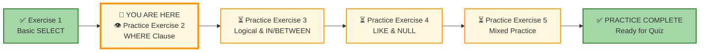
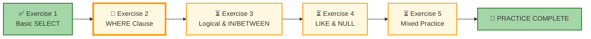




# 🗄️🤖 SQL & GenAI Course
**🎯 Quality Education for Anyone, Anywhere, Anytime — 💫 with Comfort, Convenience at no Cost**

## 🧠 Exercise 2: WHERE Clause – Filtering Your Data

Great work on mastering basic `SELECT`! Now it's time to add precision. In this exercise, you'll use the **`WHERE`** clause with **comparison operators** to filter rows and find exactly the data you need. Remember: in the real world, you rarely want *all* the data – you want answers to specific questions.

---

## 🌌 SQLVerse Check-In

<div style="border-left: 4px solid #9c27b0; background-color: #f3e5f5; padding: 15px; margin: 20px 0; border-radius: 0 8px 8px 0;">

**The laws of the SQLVerse are no longer mysteries to you. You have the keys.** Still on **E-Commerce Planet** – now it's time to filter the noise and find what matters.

The SQLVerse is waiting. Your portfolio is calling.

**The difference between a coder and an Artisan is discipline.**

</div>

---

### 📍 Your Current Stage



You've completed Exercise 1. Now you'll add filtering power to your queries.

---

## 🔧 Enhanced Browser Office for PRACTICE

**🚀 Kickstart: Any Computer, Any Browser, Anytime.**  
**🌍 Destination: Any country, Any city, Any Platform.**

| Tab | Purpose | What to Do |
| :--- | :--- | :--- |
| **1: The Map** | Reference materials | • Keep your **[Module 2 Reference Guide](./module2-reference.md)** handy.<br>• Review File 2 (`2-the-where-clause.md`) if needed. |
| **2: The Factory** | Run queries | Keep the **E‑Store database**: **[`level1_estore_basic.db`](../../../Resources/sample_databases/level1_estore_basic.db)** loaded.  |
| **3: The Consultant** | Conceptual Q&A | If you get stuck, ask for hints – but follow the **3‑Attempt Rule**:<br>1. Try from memory/intuition.<br>2. Check the concept file or reference guide.<br>3. Ask the Consultant for a conceptual hint. **[Configure with Student Mode Prompt](../../../STUDENT_MODE_PROMPT_LEVEL1.md)** to ensure AI only provides conceptual guidance, not code. |
| **4: The Vault** | Save your work | Save each successful query in your Vault at: `Learning/Level-1-beginner/Level1-1-ACQUIRE/Module2-BasicRetrieval-SelectAndWhere/2-practiceExercises/` |
---
### 🛠️ Module 2 Toolkit

🚀 Foundation First, AI Next, Projects Last.  
💎 Gemstone by Gemstone, Skill by Skill.

| | | | |
|---|---|---|---|
| **Browser Office** | 🔧 [Troubleshooting Common Issues](../../../Setup/STEP1_COMMISSION_BROWSER_OFFICE.md) | 🔄 [Browser Office Workflow](../../../Setup/STEP2_ESTABLISH_LEARNING_RITUAL.md) | ⌨️ [Tab Operations & Shortcuts](../../../Setup/STEP3_MASTER_TAB_OPERATIONS.md) |
| **ACQUIRE Section** | 🗄️ [Database Ecosystem](../../Guides/Section1-ACQUIRE/2_Database_Ecosystem.md) | 📚 [Knowledge Base (Vault)](../../Guides/Section1-ACQUIRE/3_Knowledge_Base.md) | 🧠 [Mindset Tuning](../../Guides/Section1-ACQUIRE/4_Mindset.md) |

---

## 🏛️ The E‑Store Schema (Quick Recap)

| Table | Columns (key ones in **bold**) | What It Tells Us |
|-------|--------------------------------|------------------|
| **`customers`** | `customer_id`, **`name`**, **`email`**, **`city`**, `phone` | Who our customers are. |
| **`products`** | `product_id`, **`product_name`**, **`price`**, **`category`** | What we sell and prices. |
| **`orders`** | **`order_id`**, `customer_id`, **`order_date`** | When orders were placed. |
| **`order_items`** | `order_item_id`, `order_id`, `product_id`, **`quantity`** | Details of each order. |

> **💡 Pro Tip:** If you need a refresher on the data, run `SELECT * FROM each_table;` again.

---

## 💡 Artisan's Pro‑Tips for Exercise 2

1. **Quote Your Text:** Always wrap text values in single quotes: `WHERE city = 'Chicago'`. Forgetting quotes is the #1 cause of syntax errors.

2. **Numbers Don't Need Quotes:** `WHERE price > 100` is correct. `WHERE price > '100'` might work, but it's not best practice.

3. **Date Format Matters:** SQLite expects dates in `'YYYY-MM-DD'` format. Like text dates should also be wrapped in single quotes. Stick to this and you'll never have issues with date types.

4. **The Boundary Test:** When using `>` vs `>=`, ask yourself: "Do I want to include the boundary value?" Test with small numbers to be sure.

5. **The Precision Principle:** `WHERE` is your surgical tool. The more precise your condition, the more valuable your result.

**Precision is the foundation of data mastery.**

---
### 🧠 Conceptual Sanity Checks

Before you start writing queries, test your understanding:

1. **What's the difference between these two conditions?**
   - `WHERE price > 100`
   - `WHERE price >= 100`
   
   *If the cheapest product is exactly $100, which query would include it?*

2. **Why must 'Chicago' have quotes, but 100 doesn't?**
   
   *What would happen if you wrote `WHERE city = Chicago` without quotes?*

3. **Date puzzle:** If today is Oct 3, 2025, and you want orders from "the last 3 days" – would you use `>` or `>=` to include Oct 3rd?

4. **The NOT EQUAL trap:** What's the difference between:
   - `WHERE category <> 'Electronics'`
   - `WHERE NOT category = 'Electronics'`
   
   *(They're the same! Just different syntax.)*

**If any of these feel fuzzy, review [File 2: The WHERE Clause](../1-sqlCommands/2-the-where-clause.md) before diving into the challenges.**

---

## 📝 Challenges

### Challenge 1: Pricey Products
**Question:** Which products have a price greater than 100?

```sql
-- Your query here
-- Hint: Use > on the price column
-- Save as: 2-1-pricey-products.sql
```

**Expected Result:** Products with price > 100 (Laptop, Headphones).  
**Row Count:** 2 rows  
**What this teaches:** Filtering numbers with `>`.

---

### Challenge 2: Chicago Customers
**Question:** Find all customers who live in Chicago.

```sql
-- Your query here
-- Hint: city = 'Chicago'
-- Save as: 2-2-chicago-customers.sql
```

**Expected Result:** Bob Johnson, Eva Gomez.  
**Row Count:** 2 rows  
**What this teaches:** Exact text matching with `=`.

---

### Challenge 3: Recent Orders
**Question:** Retrieve all orders placed on or after October 3, 2025.

```sql
-- Your query here
-- Hint: Use >= with the correct date format 'YYYY-MM-DD'
-- Save as: 2-3-recent-orders.sql
```

**Expected Result:** Orders from Oct 3, 4, 5 (order_ids 3, 4, 5).  
**Row Count:** 3 rows  
**What this teaches:** Date comparisons with `>=`.

---

### Challenge 4: Non-Electronics Products
**Question:** Find products that are **not** in the 'Electronics' category.

```sql
-- Your query here
-- Hint: Use <> or !=
-- Save as: 2-4-non-electronics.sql
```

**Expected Result:** Coffee Maker, SQL Essentials Book, Blender.  
**Row Count:** 3 rows  
**What this teaches:** The "not equal" operator (`<>` or `!=`).

---

### Challenge 5: Large Quantity Orders
**Question:** Which order items have a quantity greater than 1?

```sql
-- Your query here
-- Hint: quantity > 1
-- Save as: 2-5-large-quantities.sql
```

**Expected Result:** The order item with quantity 2 (Alice's 2 Headphones).  
**Row Count:** 1 row  
**What this teaches:** Filtering with `>` on integer columns.

---

## ✅ When You're Done

- [ ] I successfully ran all 5 queries.
- [ ] I saved each query in my Vault.
- [ ] I understand the difference between filtering numbers, text, and dates.
- [ ] I can explain when to use `=` vs `<>` vs `>` vs `>=`.
- [ ] I'm ready for the next exercise.

---

## 🧭 Practice Navigation



| Previous Step | Next Step |
|:---:|:---:|
| [← Exercise 1: Basic SELECT](./1-basic-select.md) | [Continue to Exercise 3: Logical & IN/BETWEEN →](./3-logical-and-in-between.md) |

---

*Part of our mission for 🎯 Quality Education for Anyone, Anywhere, Anytime — 💫 with Comfort, Convenience at no Cost.*

**Level 1 | Module 2 | Practice Exercise 2 | Next: [Logical & IN/BETWEEN](./3-logical-and-in-between.md)**

