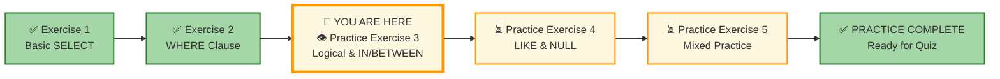
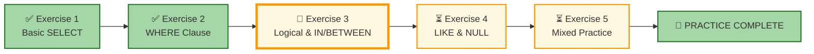




# 🗄️🤖 SQL & GenAI Course
**🎯 Quality Education for Anyone, Anywhere, Anytime — 💫 with Comfort, Convenience at no Cost**

## 🧠 Exercise 3: Logical Operators & IN/BETWEEN

Great work on mastering basic filtering! Now it's time to add more sophisticated logic to your queries. In this exercise, you'll **combine** conditions using **`AND`/`OR`**, match **values** in a list with **`IN`**, and define **ranges** with **`BETWEEN`**. These tools let you build **sophisticated filters** that answer **complex business questions**.

---

## 🌌 SQLVerse Check-In

<div style="border-left: 4px solid #9c27b0; background-color: #f3e5f5; padding: 15px; margin: 20px 0; border-radius: 0 8px 8px 0;">

**The laws of the SQLVerse are no longer mysteries to you. You have the keys.** Still on **E-Commerce Planet** – business questions are getting more complex. Time to layer your logic to ask sophisticated questions.

The SQLVerse is waiting. Your portfolio is calling.

**The difference between a coder and an Artisan is discipline.**

</div>

---

### 📍 Your Current Stage



You've completed Exercises 1 and 2. Now you'll add logical power to your queries.

---

## 🔧 Enhanced Browser Office for PRACTICE

**🚀 Kickstart: Any Computer, Any Browser, Anytime.**  
**🌍 Destination: Any country, Any city, Any Platform.**

| Tab | Purpose | What to Do |
| :--- | :--- | :--- |
| **1: The Map** | Reference materials | • Keep your **[Module 2 Reference Guide](./module2-reference.md)** handy.<br>• Review Files 3 (`3-logical-operators.md`) and 4 (`4-in-between.md`) if needed. |
| **2: The Factory** | Run queries | Keep the **E‑Store database**: **[`level1_estore_basic.db`](../../../Resources/sample_databases/level1_estore_basic.db)** loaded. |
| **3: The Consultant** | Conceptual Q&A | Follow the **3‑Attempt Rule**. Ask for conceptual hints only. |
| **4: The Vault** | Save your work | Save each successful query in your Vault at: `Learning/Level-1-beginner/Level1-1-ACQUIRE/Module2-BasicRetrieval-SelectAndWhere/2-practiceExercises/` |

---

### 🛠️ Module 2 Toolkit

🚀 Foundation First, AI Next, Projects Last.  
💎 Gemstone by Gemstone, Skill by Skill.

| | | | |
|---|---|---|---|
| **Browser Office** | 🔧 [Troubleshooting Common Issues](../../../Setup/STEP1_COMMISSION_BROWSER_OFFICE.md) | 🔄 [Browser Office Workflow](../../../Setup/STEP2_ESTABLISH_LEARNING_RITUAL.md) | ⌨️ [Tab Operations & Shortcuts](../../../Setup/STEP3_MASTER_TAB_OPERATIONS.md) |
| **ACQUIRE Section** | 🗄️ [Database Ecosystem](../../Guides/Section1-ACQUIRE/2_Database_Ecosystem.md) | 📚 [Knowledge Base (Vault)](../../Guides/Section1-ACQUIRE/3_Knowledge_Base.md) | 🧠 [Mindset Tuning](../../Guides/Section1-ACQUIRE/4_Mindset.md) |

---

## 🏛️ The E‑Store Schema (Quick Recap)

| Table | Columns (key ones in **bold**) | What It Tells Us |
|-------|--------------------------------|------------------|
| **`customers`** | `customer_id`, **`name`**, **`email`**, **`city`**, `phone` | Who our customers are. |
| **`products`** | `product_id`, **`product_name`**, **`price`**, **`category`** | What we sell and prices. |
| **`orders`** | **`order_id`**, `customer_id`, **`order_date`** | When orders were placed. |
| **`order_items`** | `order_item_id`, `order_id`, `product_id`, **`quantity`** | Details of each order. |

> **💡 Pro Tip:** If you need a refresher on the data, run `SELECT * FROM each_table;` again.

---

## 💡 Artisan's Pro‑Tips for Exercise 3

1. **AND is Narrow, OR is Wide:** `AND` requires all conditions to be true (fewer rows). `OR` requires at least one condition to be true (more rows).

2. **IN is Your Friend:** Instead of `city = 'NY' OR city = 'Chicago'`, write `city IN ('NY', 'Chicago')`. Cleaner and faster.

3. **BETWEEN is Inclusive:** `BETWEEN 50 AND 100` includes both 50 and 100. If you need exclusive bounds, use `>` and `<`.

4. **Parentheses Save Lives:** When mixing `AND` and `OR`, always use parentheses to make your logic clear – to the database and to humans.

5. **NULL is Not a Value:** Remember, `NULL` means "unknown." It won't match any condition unless you explicitly use `IS NULL`.

**Logic is the language of precise questions.**

---

## 🧠 Conceptual Sanity Checks

Before you start writing queries, test your understanding:

1. **AND vs. OR:** If you want products that are **both** 'Electronics' **and** affordable (<200), which operator do you use? What if you want products that are **either** 'Electronics' **or** affordable?

2. **IN vs. Multiple OR:** Write two versions of a query finding customers in 'New York' or 'Chicago' – one with `OR`, one with `IN`. Which is cleaner?

3. **BETWEEN Boundaries:** If you use `BETWEEN 50 AND 100`, is a product priced at exactly 50 included? What about 100?

4. **Parentheses Puzzle:** Without parentheses, which operator has higher precedence – `AND` or `OR`? Why does this matter?

5. **The Empty Result:** If you write `WHERE category IN ('Electronics', 'Books') AND price > 1000`, and no products match, is your query wrong or just honest?

**If any of these feel fuzzy, review [File 3: Logical Operators](../1-sqlCommands/3-logical-operators.md) and [File 4: IN & BETWEEN](../1-sqlCommands/4-in-between.md) before diving into the challenges.**

---

## 📝 Challenges

### Challenge 1: Affordable Electronics
**Question:** Find products that are in the 'Electronics' category **and** have a price less than 200.

```sql
-- Your query here
-- Hint: Use AND
-- Save as: 3-1-affordable-electronics.sql
```

**Expected Result:** Headphones (150).  
**Row Count:** 1 row  
**What this teaches:** Combining two conditions with `AND` – both must be true.

---

### Challenge 2: Customers in NY or Chicago
**Question:** List customers who live in 'New York' or 'Chicago'.

```sql
-- Your query here
-- Hint: Use IN
-- Save as: 3-2-ny-chicago.sql
```

**Expected Result:** Alice Smith (NY), Bob Johnson (Chicago), Charlie Lee (NY), Eva Gomez (Chicago).  
**Row Count:** 4 rows  
**What this teaches:** Using `IN` to match any value in a list.

---

### Challenge 3: Mid-Range Products
**Question:** Find products with prices between 50 and 100 (inclusive).

```sql
-- Your query here
-- Hint: Use BETWEEN
-- Save as: 3-3-mid-range.sql
```

**Expected Result:** Coffee Maker (80), Blender (60).  
**Row Count:** 2 rows  
**What this teaches:** Using `BETWEEN` for inclusive ranges.

---

### Challenge 4: Orders in Q4 2025
**Question:** Find all orders placed between October 1, 2025 and December 31, 2025 (inclusive).

```sql
-- Your query here
-- Hint: Use BETWEEN with dates
-- Save as: 3-4-q4-orders.sql
```

**Expected Result:** All orders in Oct–Dec 2025 (all 5 orders).  
**Row Count:** 5 rows  
**What this teaches:** Date ranges with `BETWEEN`.

---

### Challenge 5: Bulk Orders
**Question:** Find order items where the quantity is between 2 and 5 (inclusive).

```sql
-- Your query here
-- Hint: Use BETWEEN for quantity
-- Save as: 3-5-bulk-orders.sql
```

**Expected Result:** The order item with quantity 2 (Alice's 2 Headphones).  
**Row Count:** 1 row  
**What this teaches:** Using `BETWEEN` with integer columns.

---

### Challenge 6: Products Not in Electronics or Appliances
**Question:** Find products whose category is **not** 'Electronics' and **not** 'Appliances'.

```sql
-- Your query here
-- Hint: Use NOT IN
-- Save as: 3-6-not-electronic-appliances.sql
```

**Expected Result:** SQL Essentials Book (Books category only).  
**Row Count:** 1 row  
**What this teaches:** `NOT IN` to exclude multiple values.

---

### Challenge 7: Books or Cheap Electronics
**Question:** Find products that are either in the 'Books' category **or** are electronics with a price less than 200.

```sql
-- Your query here
-- Hint: Use parentheses to group OR before AND
-- Save as: 3-7-books-or-cheap-electronics.sql
```

**Expected Result:** 
- SQL Essentials Book (Books)
- Headphones (Electronics, price 150 < 200)  
**Row Count:** 2 rows  
**What this teaches:** Mixing `AND` and `OR` with parentheses – the `OR` groups two alternatives, and the price condition applies only to electronics.

---

## 📊 Challenge Summary

| Challenge | Concept | Table | Row Count |
|-----------|---------|-------|-----------|
| 1 | AND | products | 1 |
| 2 | IN | customers | 4 |
| 3 | BETWEEN (numbers) | products | 2 |
| 4 | BETWEEN (dates) | orders | 5 |
| 5 | BETWEEN (integers) | order_items | 1 |
| 6 | NOT IN | products | 1 |
| 7 | AND/OR with parentheses | products | 2 |

---

## ✅ When You're Done

- [ ] I successfully ran all 7 queries.
- [ ] I saved each query in my Vault.
- [ ] I understand the difference between `AND` and `OR`.
- [ ] I can use `IN` and `NOT IN` to match lists.
- [ ] I can use `BETWEEN` for numeric and date ranges.
- [ ] I can mix `AND` and `OR` with parentheses.
- [ ] I'm ready for the next exercise.

---

## 🧭 Practice Navigation



| Previous Step | Next Step |
|:---:|:---:|
| [← Exercise 2: WHERE Clause](./2-where-operators.md) | [Continue to Exercise 4: LIKE & NULL →](./4-like-and-null.md) |

---

*Part of our mission for 🎯 Quality Education for Anyone, Anywhere, Anytime — 💫 with Comfort, Convenience at no Cost.*

**Level 1 | Module 2 | Practice Exercise 3 | Next: [LIKE & NULL](./4-like-and-null.md)**


