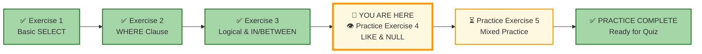

# 🗄️🤖 SQL & GenAI Course
**🎯 Quality Education for Anyone, Anywhere, Anytime — 💫 with Comfort, Convenience at no Cost**

## 🧠 Exercise 4: LIKE & NULL Handling

You've mastered exact matches and ranges. But real-world data is messy. Sometimes you only remember part of a name, and sometimes data is simply missing. In this exercise, you'll learn to search for patterns with `LIKE` and handle missing information with `NULL`. 

You'll now explore **pattern matching** with **`LIKE`** and the **tricky** concept of **`NULL`**.These skills separate beginners from professionals who can tame messy, real-world datasets.

---

## 🌌 SQLVerse Check-In

<div style="border-left: 4px solid #9c27b0; background-color: #f3e5f5; padding: 15px; margin: 20px 0; border-radius: 0 8px 8px 0;">

**The laws of the SQLVerse are no longer mysteries to you. You have the keys.** Still on **E-Commerce Planet** – every world has its messy data and missing pieces. Time to handle them like an Artisan.

The SQLVerse is waiting. Your portfolio is calling.

**The difference between a coder and an Artisan is discipline.**

</div>

---

### 📍 Your Current Stage



You've completed Exercises 1-3. Now you'll learn to handle patterns and missing data.

---

## 🔧 Enhanced Browser Office for PRACTICE

**🚀 Kickstart: Any Computer, Any Browser, Anytime.**  
**🌍 Destination: Any country, Any city, Any Platform.**

| Tab | Purpose | What to Do |
| :--- | :--- | :--- |
| **1: The Map** | Reference materials | • Keep your **[Module 2 Reference Guide](./module2-reference.md)** handy.<br>• Review Files 5 (`5-like-wildcards.md`) and 6 (`6-null-handling.md`) if needed. |
| **2: The Factory** | Run queries | Keep the **E‑Store database**: **[`level1_estore_basic.db`](../../../Resources/sample_databases/level1_estore_basic.db)** loaded. |
| **3: The Consultant** | Conceptual Q&A | Follow the **3‑Attempt Rule**. Ask for conceptual hints only. |
| **4: The Vault** | Save your work | Save each successful query in your Vault at: `Learning/Level-1-beginner/Level1-1-ACQUIRE/Module2-BasicRetrieval-SelectAndWhere/2-practiceExercises/` |

---

### 🛠️ Module 2 Toolkit

🚀 Foundation First, AI Next, Projects Last.  
💎 Gemstone by Gemstone, Skill by Skill.

| | | | |
|---|---|---|---|
| **Browser Office** | 🔧 [Troubleshooting Common Issues](../../../Setup/STEP1_COMMISSION_BROWSER_OFFICE.md) | 🔄 [Browser Office Workflow](../../../Setup/STEP2_ESTABLISH_LEARNING_RITUAL.md) | ⌨️ [Tab Operations & Shortcuts](../../../Setup/STEP3_MASTER_TAB_OPERATIONS.md) |
| **ACQUIRE Section** | 🗄️ [Database Ecosystem](../../Guides/Section1-ACQUIRE/2_Database_Ecosystem.md) | 📚 [Knowledge Base (Vault)](../../Guides/Section1-ACQUIRE/3_Knowledge_Base.md) | 🧠 [Mindset Tuning](../../Guides/Section1-ACQUIRE/4_Mindset.md) |

---

## 🏛️ The E‑Store Schema (Quick Recap)

| Table | Columns (key ones in **bold**) | What It Tells Us |
|-------|--------------------------------|------------------|
| **`customers`** | `customer_id`, **`name`**, **`email`**, **`city`**, `phone` | Who our customers are. |
| **`products`** | `product_id`, **`product_name`**, **`price`**, **`category`** | What we sell and prices. |
| **`orders`** | **`order_id`**, `customer_id`, **`order_date`** | When orders were placed. |
| **`order_items`** | `order_item_id`, `order_id`, `product_id`, **`quantity`** | Details of each order. |

> **💡 Pro Tip:** For this exercise, pay special attention to the `customers` table – we'll need to add some NULL values to practice NULL handling.

---


## 📊 Adding NULL Values for Practice

The current E‑Store database has no NULL values. Let's add some customers with missing phone numbers so you can practice handling NULLs. Remember, you've already mastered **`INSERT`** in File 6 (Education Domain) and practiced it again in File 7. Now it's time to **ace** with that skill in the **E‑Commerce domain**!

```sql
-- First, let's see our current customers
SELECT * FROM customers;

-- Add new customers with NULL phone numbers
INSERT INTO customers (customer_id, name, email, city, phone) VALUES
(6, 'Frank Miller', 'frank@email.com', 'Boston', NULL),
(7, 'Grace Chen', 'grace@email.com', 'Seattle', NULL),
(8, 'Henry Garcia', 'henry@email.com', 'Miami', NULL);

-- Add a customer with a phone number for comparison
INSERT INTO customers (customer_id, name, email, city, phone) VALUES
(9, 'Ivy Patel', 'ivy@email.com', 'Austin', '555-0201');

-- Verify the NULLs
SELECT customer_id, name, phone FROM customers ORDER BY customer_id;
```

**Expected Result:**
- IDs 1-5: Original customers
- IDs 6-8: New customers with NULL phones
- ID 9: New customer with phone

> **🎉 INSERT Mastery Check:** In File 6, you added Ben, Sam, and Emma to the Education database. In File 7, you added Oliver and Sophia. Now you've just added 4 more customers to the E-Store database. **You're an INSERT pro!** The syntax is identical – only the table and column names change. This is skill transfer in action.

---

### 📋 **Updated Customer Table After INSERTs**

| customer_id | name | email | city | phone |
|-------------|------|-------|------|-------|
| 1 | Alice Smith | alice@email.com | New York | 555-0101 |
| 2 | Bob Johnson | bob@email.com | Chicago | 555-0102 |
| 3 | Charlie Lee | charlie@email.com | New York | NULL |
| 4 | David Kim | david@email.com | San Francisco | NULL |
| 5 | Eva Gomez | eva@email.com | Chicago | 555-0105 |
| 6 | Frank Miller | frank@email.com | Boston | NULL |
| 7 | Grace Chen | grace@email.com | Seattle | NULL |
| 8 | Henry Garcia | henry@email.com | Miami | NULL |
| 9 | Ivy Patel | ivy@email.com | Austin | 555-0201 |

---

**Now it's time to ace the rest of Exercise 4!** 🚀

---
## 💡 Artisan's Pro‑Tips for Exercise 4

1. **LIKE is for Patterns, = is for Exact:** Use `LIKE` when you're not sure of the exact value. Use `=` when you need precision.

2. **% is Wild, _ is Wild-Lite:** `%` matches any number of characters (zero to infinity). `_` matches exactly one character.

3. **NULL is Not Zero or Empty String:** `NULL` means "unknown" or "not applicable." It's not the same as 0, '', or a space.

4. **IS NULL, Not = NULL:** You cannot use `= NULL` – it always returns false. Always use `IS NULL` or `IS NOT NULL`.

5. **NULL Spreads:** Any calculation involving NULL becomes NULL. Be careful with aggregations!

**Patterns and voids – master them both.**

---

## 🧠 Conceptual Sanity Checks

Before you start writing queries, test your understanding:

1. **Wildcard Meanings:** What would these patterns match?
   - `LIKE 'a%'`
   - `LIKE '%a'`
   - `LIKE '%a%'`
   - `LIKE 'a_'`
   - `LIKE '_a_'`

2. **The NULL Trap:** Why does `WHERE phone = NULL` return no rows, even when NULLs exist? What's the correct way to find NULLs?

3. **Email Domains:** If you want to find all customers with Gmail addresses, what pattern would you use?

4. **Optional Phone Numbers:** In a real business, what's the difference between a customer with `phone = NULL` and a customer with `phone = ''` (empty string)?

5. **The Spreading NULL:** If `price` is 100 and `discount` is NULL, what is `price - discount`? Why?

**If any of these feel fuzzy, review [File 5: LIKE & Wildcards](../1-sqlCommands/5-like-wildcards.md) and [File 6: NULL Handling](../1-sqlCommands/6-null-handling.md) before diving into the challenges.**

---

## 📝 Challenges

### Challenge 1: Names Starting with 'A'
**Question:** Find all customers whose names start with the letter 'A'.

```sql
-- Your query here
-- Hint: Use LIKE with 'A%'
-- Save as: 4-1-names-starting-A.sql
```

**Expected Result:** Alice Smith.  
**Row Count:** 1 row  
**What this teaches:** Using `%` to match any characters after a pattern.

---

### Challenge 2: Names Ending with 'e'
**Question:** Find all customers whose names end with the letter 'e'.

```sql
-- Your query here
-- Hint: Use LIKE with '%e'
-- Save as: 4-2-names-ending-e.sql
```

**Expected Result:** Alice Smith, Charlie Lee, Eva Gomez.  
**Row Count:** 3 rows  
**What this teaches:** Using `%` to match any characters before a pattern.

---

### Challenge 3: Email Domain Search
**Question:** Find all customers whose email contains 'email.com' (the domain).

```sql
-- Your query here
-- Hint: Use LIKE with '%email.com%'
-- Save as: 4-3-email-domain.sql
```

**Expected Result:** All 5 customers (all have @email.com addresses).  
**Row Count:** 5 rows  
**What this teaches:** Using `%` on both sides to find a pattern anywhere in a string.

---

### Challenge 4: Five-Letter Names
**Question:** Find customers whose names have exactly 5 letters (first name only).  
*Hint: First names only – you'll need to think about how names are stored.*

```sql
-- Your query here
-- Hint: Names are stored as full name. This is tricky! You might need to use multiple patterns or think differently.
```


> **💡 Instructor Note:** Since names are stored as full names (e.g., 'Alice Smith'), this challenge is intentionally tricky. In a real database, first and last names would be in separate columns. This challenge teaches you to think about data structure limitations and adapt your queries accordingly. Focus on understanding the `_` wildcard pattern rather than getting the exact result.

**What this teaches:** Real-world data isn't always perfectly structured for simple queries. Sometimes you need to think creatively or acknowledge limitations.

---

### Challenge 5: Customers with Phone Numbers
**Question:** Find all customers who have provided a phone number (phone is NOT NULL).

```sql
-- Your query here
-- Hint: Use IS NOT NULL
-- Save as: 4-5-has-phone.sql
```

**Expected Result:** Alice, Bob, Eva.  
**Row Count:** 3 rows  
**What this teaches:** Using `IS NOT NULL` to find rows with values.

---

### Challenge 6: Customers Missing Phone Numbers
**Question:** Find all customers who have NOT provided a phone number (phone is NULL).

```sql
-- Your query here
-- Hint: Use IS NULL
-- Save as: 4-6-missing-phone.sql
```

**Expected Result:** Charlie, David.  
**Row Count:** 2 rows  
**What this teaches:** Using `IS NULL` to find missing data.

---

### Challenge 7: Gmail Users with Phones
**Question:** Find customers whose email contains 'gmail.com' AND who have provided a phone number.  
*(Note: Our sample data doesn't have Gmail addresses – this is a logic exercise.)*

```sql
-- Your query here
-- Hint: Combine LIKE and IS NOT NULL with AND
-- Save as: 4-7-gmail-with-phone.sql
```

**Expected Result:** No rows in current data, but the query structure is what matters.  
**Row Count:** 0 rows  
**What this teaches:** Combining pattern matching with NULL checks.

---

### Challenge 8: The NULL Trap
**Question:** Run this query and observe what happens:
```sql
SELECT name, phone FROM customers WHERE phone = NULL;
```

Now fix it to correctly find customers with NULL phones.

```sql
-- First run the wrong one, see the result
-- Then write the correct version
-- Save both as: 4-8-null-trap.sql
```

**Expected Result:** Wrong query returns 0 rows. Correct query returns Charlie and David.  
**What this teaches:** Why `= NULL` never works, and how to use `IS NULL` correctly.

---

## 📊 Challenge Summary

| Challenge | Concept | Table | Row Count |
|-----------|---------|-------|-----------|
| 1 | LIKE 'A%' | customers | 1 |
| 2 | LIKE '%e' | customers | 3 |
| 3 | LIKE '%email.com%' | customers | 5 |
| 4 | Pattern thinking | customers | (conceptual) |
| 5 | IS NOT NULL | customers | 3 |
| 6 | IS NULL | customers | 2 |
| 7 | LIKE + IS NOT NULL | customers | 0 |
| 8 | NULL trap demonstration | customers | 2 (corrected) |

---

## ✅ When You're Done

- [ ] I successfully ran all 8 queries.
- [ ] I saved each query in my Vault.
- [ ] I understand the difference between `%` and `_` wildcards.
- [ ] I can find patterns anywhere in text using `LIKE`.
- [ ] I know why `= NULL` doesn't work and how to use `IS NULL` correctly.
- [ ] I can combine pattern matching with NULL checks.
- [ ] I'm ready for the final practice exercise.

---

## 🧭 Practice Navigation


| Previous Step | Next Step |
|:---:|:---:|
| [← Exercise 3: Logical & IN/BETWEEN](./3-logical-and-in-between.md) | [Continue to Exercise 5: Mixed Practice →](./5-mixed-practice.md) |

---

*Part of our mission for 🎯 Quality Education for Anyone, Anywhere, Anytime — 💫 with Comfort, Convenience at no Cost.*

**Level 1 | Module 2 | Practice Exercise 4 | Next: [Mixed Practice](./5-mixed-practice.md)**


