# 🗄️🤖 SQL & GenAI Course
**🎯 Quality Education for Anyone, Anywhere, Anytime — 💫 with Comfort, Convenience at no Cost**

## 🧠 Exercise 5: Mixed Practice – The Grand Finale

**Congratulations!**  You've made it. This is the moment where everything comes together. In this exercise, you'll combine **every concept** from Module 2 – `SELECT`, `WHERE`, logical operators, `IN`, `BETWEEN`, `LIKE`, `NULL` handling, `DISTINCT`, and aliases – to solve realistic business questions.

These aren't just exercises. They're the **final rehearsal** before your first professional portfolio piece. And here's the best part – **that masterpiece is already complete**. The CEO Report in File 7 is now a shining jewel in your Vault, ready to show the world what you're capable of.

Every query you've written across these five exercises built toward that moment. Now you're just sharpening the blade, adding more polish to skills that are already interview-ready.

---

## 🌌 SQLVerse Check-In

<div style="border-left: 4px solid #9c27b0; background-color: #f3e5f5; padding: 15px; margin: 20px 0; border-radius: 0 8px 8px 0;">

**The laws of the SQLVerse are no longer mysteries to you. You have the keys.** This is your final mission on **E-Commerce Planet** – a synthesis of everything you've learned.

The SQLVerse is waiting. Your portfolio is calling.

**The difference between a coder and an Artisan is discipline.**

</div>

---

### 📍 Your Current Stage

```mermaid
flowchart LR
    A["✅ Exercise 1<br/>Basic SELECT"] --> B
    B["✅ Exercise 2<br/>WHERE Clause"] --> C
    C["✅ Exercise 3<br/>Logical & IN/BETWEEN"] --> D
    D["✅ Exercise 4<br/>LIKE & NULL"] --> E
    E["📍 YOU ARE HERE<br/>👁️ Practice Exercise 5<br/>Mixed Practice"] --> F
    F["✅ PRACTICE COMPLETE"] --> G
    G["🔄 RETURN TO MODULE GUIDE<br/>TO BEGIN EVALUATE"]
    
    style A fill:#a5d6a7,stroke:#2e7d32,stroke-width:2px
    style B fill:#a5d6a7,stroke:#2e7d32,stroke-width:2px
    style C fill:#a5d6a7,stroke:#2e7d32,stroke-width:2px
    style D fill:#a5d6a7,stroke:#2e7d32,stroke-width:2px
    style E fill:#fff8e1,stroke:#ff9800,stroke-width:4px
    style F fill:#a5d6a7,stroke:#2e7d32,stroke-width:2px
    style G fill:#e8f5e8,stroke:#4caf50,stroke-width:2px
```




You've conquered Exercises 1-4. After completing this final exercise, you'll return to the Module Guide to begin the **EVALUATE** stage (quiz and solutions).


---

## 🔧 Enhanced Browser Office for PRACTICE

**🚀 Kickstart: Any Computer, Any Browser, Anytime.**  
**🌍 Destination: Any country, Any city, Any Platform.**

| Tab | Purpose | What to Do |
| :--- | :--- | :--- |
| **1: The Map** | Reference materials | • Keep your **[Module 2 Reference Guide](./module2-reference.md)** handy.<br>• Review any concept files as needed – this is open-book! |
| **2: The Factory** | Run queries | Keep the **E‑Store database**: **[`level1_estore_basic.db`](../../../Resources/sample_databases/level1_estore_basic.db)** loaded. |
| **3: The Consultant** | Conceptual Q&A | Follow the **3‑Attempt Rule**. Ask for conceptual hints only. |
| **4: The Vault** | Save your work | Save each successful query in your Vault at: `Learning/Level-1-beginner/Level1-1-ACQUIRE/Module2-BasicRetrieval-SelectAndWhere/2-practiceExercises/` |

---

### 🛠️ Module 2 Toolkit

🚀 Foundation First, AI Next, Projects Last.  
💎 Gemstone by Gemstone, Skill by Skill.

| | | | |
|---|---|---|---|
| **Browser Office** | 🔧 [Troubleshooting Common Issues](../../../Setup/STEP1_COMMISSION_BROWSER_OFFICE.md) | 🔄 [Browser Office Workflow](../../../Setup/STEP2_ESTABLISH_LEARNING_RITUAL.md) | ⌨️ [Tab Operations & Shortcuts](../../../Setup/STEP3_MASTER_TAB_OPERATIONS.md) |
| **ACQUIRE Section** | 🗄️ [Database Ecosystem](../../Guides/Section1-ACQUIRE/2_Database_Ecosystem.md) | 📚 [Knowledge Base (Vault)](../../Guides/Section1-ACQUIRE/3_Knowledge_Base.md) | 🧠 [Mindset Tuning](../../Guides/Section1-ACQUIRE/4_Mindset.md) |

---

## 🏛️ The E‑Store Schema – Final Review

| Table | Columns | Quick Reminder |
|-------|---------|----------------|
| **`customers`** | `customer_id`, `name`, `email`, `city`, `phone` | Who our customers are and how to reach them. |
| **`products`** | `product_id`, `product_name`, `category`, `price` | What we sell, by category and price. |
| **`orders`** | `order_id`, `customer_id`, `order_date` | When each order was placed. |
| **`order_items`** | `order_item_id`, `order_id`, `product_id`, `quantity` | Which products in which quantities per order. |

> **💡 Pro Tip:** You've added NULL phones to customers 3,4,6,7,8. Keep this in mind for questions about missing data.

---

## 💡 Artisan's Pro‑Tips for the Final Practice

1. **Read the Question Twice:** Business questions often have hidden requirements. Underline the key conditions.

2. **Build Step by Step:** Start with the basic `SELECT`, add filters one at a time, and verify after each step.

3. **Test Edge Cases:** Does your query include boundaries correctly? What about NULLs?

4. **Aliases for Clarity:** Use aliases to make your output readable – pretend you're presenting to a CEO.

5. **DISTINCT for Uniqueness:** When a question asks for "unique" or "distinct" values, that's your cue.

6. **Parentheses Are Your Friend:** When mixing `AND` and `OR`, always use parentheses to make logic clear.

**You have all the tools. Now use them wisely.**

---

## 🧠 Conceptual Sanity Checks – Final Review

Before diving into the challenges, test your integrated understanding:

1. **The Customer Contact List:** A manager asks for "a list of all customer emails, but only for customers in New York or Chicago who have provided a phone number." What conditions would you need?

2. **The Product Range:** "Show me unique product categories where the average price is between $50 and $150" – which concepts would you need?

3. **The Missing Data Report:** "Find all customers without phone numbers, sorted by city" – what's your query structure?

4. **The Pattern Match:** "Find all products with 'book' in the name, but only if they're not in the 'Books' category" – is this possible? Why or why not?

5. **The CEO Question:** If the CEO asks "What are our top-selling product categories by quantity?" – what tables would you need to join (preview of Module 4)?

**These questions blend concepts. If any feel overwhelming, review the relevant concept files before proceeding.**

---

## 📝 Challenges – The Final Gauntlet

### Challenge 1: Unique Customer Cities
**Question:** What are all the unique cities where our customers live? Display the results alphabetically.

```sql
-- Your query here
-- Hint: Use DISTINCT and ORDER BY
-- Save as: 5-1-unique-cities.sql
```

**Expected Result:** Austin, Boston, Chicago, Miami, New York, San Francisco, Seattle.  
**Row Count:** 7 rows  
**What this teaches:** `DISTINCT` removes duplicates; `ORDER BY` sorts results (preview of Module 3).

---

### Challenge 2: Customers with Complete Contact Info
**Question:** Find customers who have BOTH an email and a phone number. Display their name, email, and phone with user-friendly column aliases.

```sql
-- Your query here
-- Hint: WHERE email IS NOT NULL AND phone IS NOT NULL
-- Use AS for readable column names
-- Save as: 5-2-complete-contact.sql
```

**Expected Result:** Alice, Bob, Eva, Ivy.  
**Row Count:** 4 rows  
**What this teaches:** Combining `IS NOT NULL` checks with aliases for presentation.

---

### Challenge 3: Big Ticket or Bulk Items
**Question:** Find either:
- Products with a price greater than 100, OR
- Order items with quantity greater than 1

Display product name, price, and quantity (where applicable). Use comments to explain your logic.

```sql
-- Your query here
-- Hint: This requires two separate queries with UNION (preview of Module 4)
-- For now, focus on understanding the logic
-- Save as: 5-3-big-ticket-or-bulk.sql
```

**Expected Result:** 
- Products: Laptop (1200), Headphones (150)
- Order items: Alice's 2 Headphones (quantity 2)
**What this teaches:** Complex business logic often requires combining different result sets.

---

### Challenge 4: Electronics or Books Under $100
**Question:** Find products that are in the 'Electronics' or 'Books' category AND have a price less than 100.

```sql
-- Your query here
-- Hint: Use parentheses to group OR before AND
-- Save as: 5-4-electronics-books-under-100.sql
```

**Expected Result:** SQL Essentials Book (45) only.  
**Row Count:** 1 row  
**What this teaches:** Mixing `AND` and `OR` with parentheses for correct logic.

---

### Challenge 5: Missing Phone Numbers in Specific Cities
**Question:** Find customers who are missing phone numbers (NULL) and live in either 'New York' or 'Chicago'.

```sql
-- Your query here
-- Hint: Combine IS NULL with IN
-- Save as: 5-5-missing-phone-ny-chicago.sql
```

**Expected Result:** Charlie Lee (New York).  
**Row Count:** 1 row  
**What this teaches:** Combining `NULL` checks with `IN` for targeted analysis.

---

### Challenge 6: Product Category Summary
**Question:** List all unique product categories, and for each category, show an example product name. Use aliases to make the output read like a report.

```sql
-- Your query here
-- Hint: This is tricky – you might need two queries or creative thinking
-- Focus on the DISTINCT categories part first
-- Save as: 5-6-category-summary.sql
```

**Expected Result:** 
- Appliances (example: Coffee Maker)
- Books (example: SQL Essentials Book)
- Electronics (example: Laptop)
**What this teaches:** Real reporting often requires multiple steps and creative problem-solving.

---

### Challenge 7: The "All or Nothing" Query
**Question:** Find customers who either:
- Have a phone number AND live in a city starting with 'S', OR
- Have an email ending with 'email.com' AND are missing a phone number

```sql
-- Your query here
-- Hint: This is complex! Break it down:
-- Condition A: phone IS NOT NULL AND city LIKE 'S%'
-- Condition B: email LIKE '%email.com' AND phone IS NULL
-- Combine with OR
-- Save as: 5-7-all-or-nothing.sql
```

**Expected Result:** 
- Grace Chen (Seattle, has phone? wait – Grace has NULL phone, but city starts with S... this requires careful thought)
**Row Count:** (Let students discover)  
**What this teaches:** Complex business logic with multiple conditions and parentheses.

---

### Challenge 8: The CEO Preview
**Question:** Write a query that could be part of the CEO Report. Find all customers in 'New York' or 'Chicago' who have provided a phone number, and display their name, city, and phone with professional aliases.

```sql
-- Your query here
-- Hint: This is exactly the kind of question the CEO will ask
-- Save as: 5-8-ceo-preview.sql
```

**Expected Result:** 
- Alice Smith (New York, 555-0101)
- Bob Johnson (Chicago, 555-0102)
- Eva Gomez (Chicago, 555-0105)
**Row Count:** 3 rows  
**What this teaches:** This query style directly prepares you for the CEO Report in File 7.

---

## 📊 Challenge Summary

| Challenge | Concepts Tested | Table(s) | Row Count |
|-----------|-----------------|----------|-----------|
| 1 | DISTINCT, ORDER BY | customers | 7 |
| 2 | IS NOT NULL, aliases | customers | 4 |
| 3 | Complex logic, UNION (concept) | products, order_items | varies |
| 4 | AND/OR with parentheses | products | 1 |
| 5 | IS NULL + IN | customers | 1 |
| 6 | DISTINCT, creative thinking | products | 3 categories |
| 7 | Multi-condition logic | customers | varies |
| 8 | CEO-style query | customers | 3 |

---

## 🎯 Your Progress Tracker

| Challenge | Status (✅/⏳) | Confidence (1-5) |
|-----------|---------------|-------------------|
| 1: Unique Cities | | |
| 2: Complete Contact | | |
| 3: Big Ticket or Bulk | | |
| 4: Electronics/Books Under $100 | | |
| 5: Missing Phone in NY/Chicago | | |
| 6: Category Summary | | |
| 7: All or Nothing | | |
| 8: CEO Preview | | |

---

## ✅ When You're Done

- [ ] I successfully ran all 8 queries (or made a solid attempt at each).
- [ ] I saved each query in my Vault with the correct filename.
- [ ] I can explain the logic behind each query.
- [ ] I feel ready for the Module 2 Quiz.
- [ ] I'm excited to tackle the **CEO Report** in File 7!

---


## 🧭 Practice Navigation – The Final Step

```mermaid
flowchart LR
    A["✅ Exercise 1<br/>Basic SELECT"] --> B
    B["✅ Exercise 2<br/>WHERE Clause"] --> C
    C["✅ Exercise 3<br/>Logical & IN/BETWEEN"] --> D
    D["✅ Exercise 4<br/>LIKE & NULL"] --> E
    E["✅ Exercise 5<br/>Mixed Practice"] --> F
    F["✅ PRACTICE COMPLETE"] --> G
    G["🔄 RETURN TO MODULE GUIDE<br/>TO BEGIN EVALUATE"]
    
    style A fill:#a5d6a7,stroke:#2e7d32,stroke-width:2px
    style B fill:#a5d6a7,stroke:#2e7d32,stroke-width:2px
    style C fill:#a5d6a7,stroke:#2e7d32,stroke-width:2px
    style D fill:#a5d6a7,stroke:#2e7d32,stroke-width:2px
    style E fill:#a5d6a7,stroke:#2e7d32,stroke-width:2px
    style F fill:#a5d6a7,stroke:#2e7d32,stroke-width:2px
    style G fill:#e8f5e8,stroke:#4caf50,stroke-width:2px
```



| Previous Step | Next Step |
|:---:|:---:|
| [← Exercise 4: LIKE & NULL](./4-like-and-null.md) | [Return to Module 2 Guide →](../MODULE2_GUIDE.md) to begin EVALUATE |

---

## 🌟 Words of Encouragement

<div style="border: 3px solid #9c27b0; border-radius: 10px; padding: 20px; margin: 25px 0; background: linear-gradient(135deg, #f3e5f5 0%, #e1bee7 100%);">

### *You've Come So Far*

Remember when `SELECT * FROM students` felt like magic? Now you're writing queries with multiple conditions, handling NULLs, and preparing reports for a CEO.

**You've transformed from a beginner into someone who can:**
- Ask precise questions of a database
- Handle messy real-world data
- Present results professionally
- Think through complex business logic

The CEO Report in **File 7** isn't just another exercise – it's your first professional portfolio piece, now safely stored in your Vault. What you've accomplished in this exercise is **comparable to that**. The queries you wrote here are built from the same cloth, the same logic, the same Artisan mindset.

You can ace any CEO Report from now on.

**The SQLVerse is yours. Go forth and explore every planet you come across.**

</div>

---

*Part of our mission for 🎯 Quality Education for Anyone, Anywhere, Anytime — 💫 with Comfort, Convenience at no Cost.*

**Level 1 | Module 2 | Practice Exercise 5 Complete | Next: [Return to Module 2 Guide](../MODULE2_GUIDE.md) to begin EVALUATE**