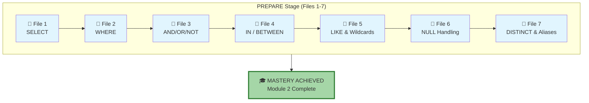
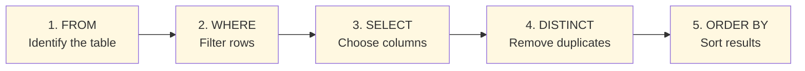
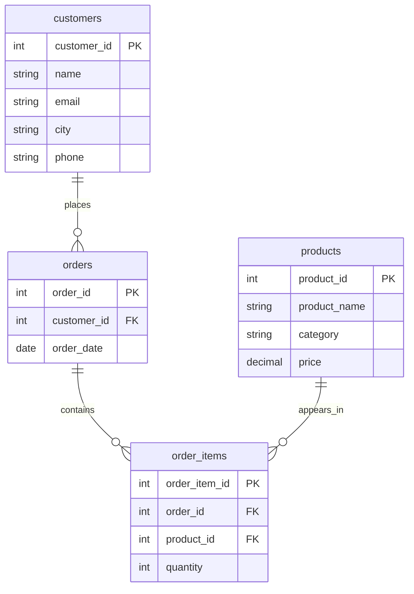

# 🗄️🤖 SQL & GenAI Course
**🎯 Quality Education for Anyone, Anywhere, Anytime — 💫 with Comfort, Convenience at no Cost**

## 📘 Module 2: SQL Reference for Practice

### Your Module 2 Mastery Report

This document is the **distilled essence** of everything you've mastered in the **PREPARE** stage. It's your official Data Artisan's reference – a tool you'll return to again and again during practice.

---
## 🌌 SQLVerse Check-In

<div style="border-left: 4px solid #9c27b0; background-color: #f3e5f5; padding: 15px; margin: 20px 0; border-radius: 0 8px 8px 0;">

**The laws of the SQLVerse are no longer mysteries to you. You have the keys.** You've journeyed across Education Planet, mastered the tools of E-Commerce Planet, and glimpsed the depths of HR and Fintech worlds.

This reference guide is your **field manual** – the collected wisdom of every planet you've visited. Keep it close as you venture into the PRACTICE stage and beyond.

**The difference between a coder and an Artisan is discipline.**

</div>

---

## 🧭 Your Journey from Files 1–7



---

## 🧠 Order of Execution – How SQL Really Thinks



**💡 Artisan's Insight:** You write `SELECT` first, but the database thinks in this order. This explains why you can't use aliases in `WHERE` – they don't exist yet! Aliases are only available after the `SELECT` step, which is why they work in `ORDER BY`.

---
## 🏛️ The E‑Store Schema – Your Practice World


### Tables at a Glance *(2 sample rows shown per table)*

---

#### **`customers`** – Who shops with us
| customer_id | name | email | city | phone |
|-------------|------|-------|------|-------|
| 1 | Alice Smith | alice@email.com | New York | 555-0101 |
| 2 | Bob Johnson | bob@email.com | Chicago | 555-0102 |

*(The full table contains 5 original customers plus 4 added for NULL practice.)*

---

#### **`products`** – What we sell
| product_id | product_name | category | price |
|------------|--------------|----------|-------|
| 1 | Laptop | Electronics | 1200.00 |
| 2 | Coffee Maker | Appliances | 80.00 |

*(The full table contains 5 products.)*

---

#### **`orders`** – When they bought
| order_id | customer_id | order_date |
|----------|-------------|------------|
| 1 | 1 | 2025-10-01 |
| 2 | 2 | 2025-10-01 |

*(The full table contains 5 orders.)*

---

#### **`order_items`** – What they bought, how many
| order_item_id | order_id | product_id | quantity |
|---------------|----------|------------|----------|
| 1 | 1 | 1 | 1 |
| 2 | 1 | 3 | 1 |

*(The full table contains 6 order items.)*

---

### 🔗 Entity Relationship Diagram



**Relationships Explained:**
- A customer can place **many orders** (one-to-many)
- An order can contain **many products** through order_items (many-to-many via junction table)
- A product can appear in **many orders** (many-to-many)


---
## 📑 **Module 2 Quick Reference**


### **1. The Foundation: SELECT & FROM**

*The core of every query.*

```sql
SELECT column1, column2 FROM table_name;  -- Specific columns
SELECT * FROM table_name;                 -- All columns (use sparingly!)
```

---

### **2. The Filter: WHERE**

*Narrowing down your search.*

| Operator | Meaning | Example |
|----------|---------|---------|
| `=`      | Equals  | `WHERE city = 'London'` |
| `<>` or `!=` | Not Equal | `WHERE status != 'Inactive'` |
| `>` / `<` | Greater / Less Than | `WHERE total_fees > 4000` |
| `>=` / `<=` | Greater / Less or Equal | `WHERE fees_paid >= 1000` |

---

### **3. The Logic: AND, OR, NOT**

*Combining conditions.*

- **`AND`** – All conditions must be true. (Narrower results)
- **`OR`** – At least one condition must be true. (Broader results)
- **`NOT`** – Reverses a condition (excludes matching rows).
- **Parentheses `()`** – Always use them to group logic when mixing operators.

**💡 Artisan's Insight:** *"When your WHERE clause gets long, don't read it as one big sentence. Read it as a series of checkpoints. Parentheses are your way of grouping these gates together so the data doesn't get lost in the wrong corridor."*

Example: `(A OR B) AND C`

---

### **4. The Shorthands: IN & BETWEEN**

*Cleaner code for lists and ranges.*

| Operator | Purpose | Example |
|----------|---------|---------|
| **`IN`** | Matches any value in a list | `WHERE last_name IN ('Chen', 'Park', 'Kumar')` |
| **`BETWEEN`** | Matches a range (**inclusive**) | `WHERE total_fees BETWEEN 3000 AND 5000` |

> 💡 `NOT IN` and `NOT BETWEEN` also work – just add `NOT` before the operator.

---

### **5. The Detective: LIKE & Wildcards**

*Searching for patterns.*

| Symbol | Meaning | Example |
|--------|---------|---------|
| **`%`** | Zero, one, or multiple characters | `WHERE first_name LIKE 'S%'` (starts with S) |
| **`_`** | Exactly one character | `WHERE first_name LIKE 'M_ke'` (Mike) |

**💡 Artisan's Insight:** *"Think of `%` as a 'wild card' that can represent a whole sentence, a single word, or nothing at all. Think of `_` as a single 'placeholder' – exactly one character must stand there."*

Combine them freely: `LIKE '%ar%'` finds "ar" anywhere.

---

### **6. The Ghosts: NULL Handling**

*Dealing with missing data.*

- **`IS NULL`** – Finds missing values.
- **`IS NOT NULL`** – Finds rows that have data.
- **⚠️ Warning:** Never use `= NULL` – it will never work!

**💡 Artisan's Insight:** *"NULL is a ghost. You can't ask if a ghost 'equals' something; you can only ask if it 'is' there."*

**Real‑world example – The Contact List:**
```sql
SELECT first_name, phone, email
FROM students
WHERE phone IS NOT NULL OR email IS NOT NULL;
```

---

### **7. The Polish: DISTINCT & Aliases**

*Presentation and clarity.*

| Feature | Purpose | Example |
|---------|---------|---------|
| **`DISTINCT`** | Removes duplicate rows | `SELECT DISTINCT city FROM customers;` |
| **`AS` (alias)** | Renames a column in the output | `SELECT first_name AS "Student Name" FROM students;` |

**Important:** Aliases can be used in `ORDER BY` but **not** in `WHERE` (because `WHERE` runs before `SELECT`).

---


## 🏛️ Module 2 Synthesis: The Artisan’s Toolkit

You have built a complete engine for data retrieval. Think of your query as a pipeline:

1. **`FROM`**: You pick your source (The `students` table).
2. **`WHERE`**: You filter the raw material (using logical operators, `IN`, `BETWEEN`, `LIKE`, and `NULL` checks).
3. **`SELECT`**: You choose the specific gems you want to keep.
4. **`DISTINCT`**: You remove the duplicates to find unique insights.
5. **`AS`**: You polish and label your results for the final report.

---

## 🛡️ Guardrail Summary: Common Student "Pitfalls"

Before you move into the **PRACTICE** stage, keep these three rules of thumb in your pocket:

| Rule | Reminder |
|------|----------|
| **The Ghost Rule** | Never use `= NULL`. Always use `IS NULL`. |
| **The Inclusive Rule** | `BETWEEN` always includes the start and end values. |
| **The Alias Rule** | You can name a column in `SELECT`, but you can't use that name to filter in `WHERE`. |
| **The Parentheses Rule** | When mixing `AND` and `OR`, always use `()` to make logic clear. |

---

## 🚀 Transition to PRACTICE

The **PREPARE** stage was about acquisition—absorbing the "what" and the "why." Now, we enter the **PRACTICE** stage. This is where you move from reading to doing. You will face real-world scenarios that will test your intuition and help you build "muscle memory" for these commands.

Before you step into the **PRACTICE** stage, take a moment to look at this summary. It isn't just a list of keywords; it's a blueprint for how information flows from a messy database into a clear, professional report.

---

### 🎓 The Transition: From Theory to Muscle Memory

In the **PREPARE** stage, you were an observer. In the **PRACTICE** stage, you become the lead investigator. You will no longer follow step-by-step instructions; instead, you will be given "Business Requests"—vague, real-world problems that you must solve using the tools in this Reference Guide.

---

### 🛠️ Final Practice Checklist

As you head to the **Module 2 Practice Section**, keep these final Artisan tips in mind:

1. **Check your Logic**: When using `AND` and `OR` together, always use parentheses `()` to avoid unexpected results.
2. **Verify the Boundaries**: Remember that `BETWEEN 10 AND 20` includes both 10 and 20.
3. **Mind the Case**: In many professional databases, `'London'` is not the same as `'london'`. Pay attention to capitalization in your strings!
4. **Embrace NULL**: It's not an error – it's information about what you don't know.

---

## 💎 DESIGNER'S PERIGON

<div style="border: 3px solid #9c27b0; border-radius: 10px; padding: 20px; margin: 25px 0; background: linear-gradient(135deg, #f3e5f5 0%, #e1bee7 100%);">

### *The Art of Presentation*

A master craftsman doesn't just build – they present. The finest woodworker sands and varnishes. The best chef plates with care. And the Data Artisan polishes their output.

`DISTINCT` is your sandpaper – it removes the rough duplicates that clutter your view. Aliases are your label maker – they tell the world what each column means, in plain language.

In the corporate world, you don't just "dump data" on a manager's desk. You present **Information**.

- `DISTINCT` is about **Efficiency** – telling the story in as few words as possible by cutting out the noise.
- `Aliases` are about **Empathy** – making sure the person reading your report understands it instantly without needing a technical dictionary.

---

### 🏆 Your Module 2 Mastery Report

This document is **your official certification** that you have mastered the fundamentals of SQL retrieval and filtering. The concepts summarized here are not just academic exercises – they are the tools used daily by data professionals in:

- 🏦 **Banking** – finding suspicious transactions
- 🛍️ **E‑Commerce** – analyzing customer behavior
- 🏥 **Healthcare** – tracking patient outcomes
- 📊 **Business Intelligence** – building dashboards
- 💳 **Fintech** – understanding spending patterns

You have progressed from a learner to a **practitioner**. The queries you can now write are the same ones used by analysts, data scientists, and database administrators in corporations worldwide.

**This is your Module 2 Mastery Report – a document of professional caliber, certifying that you command the language of data with precision, clarity, and purpose.**

---

### 🧠 The Artisan's Truth

> *"Code is a conversation. Use these tools to make your questions precise, your results clean, and your intent unmistakable."*

> *"The SQLVerse is vast, but you now carry its map. Every planet you visit – Education, E-Commerce, HR, Fintech – follows the same laws. You have the keys. Go forth and explore."*

</div>
---

*Part of our mission for 🎯 Quality Education for Anyone, Anywhere, Anytime — 💫 with Comfort, Convenience at no Cost.*

**Level 1 | Module 2 | Reference Guide**