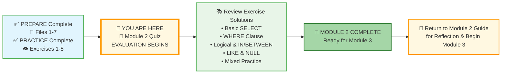
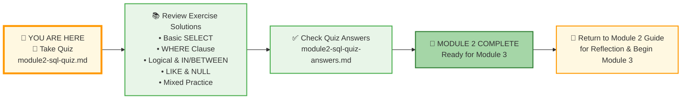




# 🗄️🤖 SQL & GenAI Course
**🎯 Quality Education for Anyone, Anywhere, Anytime — 💫 with Comfort, Convenience at no Cost**

## 📝 Module 2 Quiz: Basic SQL Retrieval

Welcome to the **EVALUATE** stage! This quiz will help you confirm that you've mastered all the SQL concepts from Module 2. Take your time – it's not timed, and there's no pressure. The goal is to identify any areas you might want to review before moving on to Module 3.

---

### 📍 Your Current Stage




### 📋 Complete Journey at a Glance

| Stage | Status | What's Included |
|-------|--------|-----------------|
| **Start** | ✅ Complete | PREPARE (Files 1-7) + PRACTICE (Exercises 1-5) |
| **A** | 🔄 Current | Module 2 Quiz – EVALUATION begins |
| **B** | ⏳ Next | Review all 5 exercise solutions |
| **C** | 🎉 Goal | Module 2 Complete – Ready for Module 3 |
| **D** | 🔙 Final | Return to Guide for reflection |

You've completed all preparation and practice. Now you begin the **EVALUATE** stage. After the quiz, you'll check your answers, review exercise solutions, and celebrate your Module 2 completion.


---

## 🌌 SQLVerse Check-In

<div style="border-left: 4px solid #9c27b0; background-color: #f3e5f5; padding: 15px; margin: 20px 0; border-radius: 0 8px 8px 0;">

**You've journeyed across E-Commerce Planet, mastered every concept, and built your first portfolio piece.** This quiz isn't a test – it's a celebration of how far you've come.

The SQLVerse is waiting. Your portfolio is calling.

**The difference between a coder and an Artisan is discipline.**

</div>

---

### 🧭 Your Evaluation Path


### 📋 Evaluation Steps Explained

| Step | Action | Purpose |
|------|--------|---------|
| **1** | Take the Module 2 Quiz | Test your understanding of all concepts |
| **2** | Review Exercise Solutions | Compare your practice work with expert solutions |
| **3** | Check Quiz Answers | Verify your quiz responses and learn from explanations |
| **4** | Module 2 Complete | Celebrate your achievement! |
| **5** | Return to Guide | Reflect and prepare for Module 3 |

---

## 📋 Part 1: Multiple Choice (10 Questions)

*Choose the best answer for each question.*

---

**1. Which SQL clause is used to filter rows based on a condition?**  
a) `SELECT`  
b) `FROM`  
c) `WHERE`  
d) `DISTINCT`

---

**2. What is the correct way to test for NULL values in SQL?**  
a) `WHERE column = NULL`  
b) `WHERE column IS NULL`  
c) `WHERE column == NULL`  
d) `WHERE column <> NULL`

---

**3. Which operator would you use to find products with a price between 50 and 100 (inclusive)?**  
a) `WHERE price > 50 AND price < 100`  
b) `WHERE price IN (50, 100)`  
c) `WHERE price BETWEEN 50 AND 100`  
d) `WHERE price >= 50 OR price <= 100`

---

**4. What does the `%` wildcard represent in a `LIKE` pattern?**  
a) Exactly one character  
b) Zero or more characters  
c) A single digit  
d) The end of a string

---

**5. Which of the following queries will return all customers who live in either 'New York' or 'Chicago'?**  
a) `SELECT * FROM customers WHERE city = 'New York' OR 'Chicago'`  
b) `SELECT * FROM customers WHERE city IN ('New York', 'Chicago')`  
c) `SELECT * FROM customers WHERE city = 'New York' AND city = 'Chicago'`  
d) `SELECT * FROM customers WHERE city BETWEEN 'New York' AND 'Chicago'`

---

**6. Why does `WHERE amount_owed > 1000` fail when `amount_owed` is an alias?**  
a) Aliases cannot be used in any clause  
b) The `WHERE` clause executes before `SELECT`, so the alias doesn't exist yet  
c) Aliases must be written in uppercase  
d) `>` doesn't work with aliases

---

**7. Which statement about `DISTINCT` is TRUE?**  
a) It removes duplicate rows based on all selected columns  
b) It can only be used with a single column  
c) It automatically sorts the results  
d) It ignores NULL values

---

**8. What will `SELECT * FROM products WHERE category <> 'Electronics';` return?**  
a) All products in the Electronics category  
b) All products not in the Electronics category  
c) Products with NULL category  
d) An error because `<>` is invalid

---

**9. In SQLite, what is the correct format for dates?**  
a) `MM-DD-YYYY`  
b) `DD/MM/YYYY`  
c) `YYYY-MM-DD`  
d) Any format works the same

---

**10. Which logical operator has the highest precedence in SQL?**  
a) `AND`  
b) `OR`  
c) `NOT`  
d) They all have equal precedence

---

## 📝 Part 2: Write the Query (5 Questions)

*Write a SQL query to answer each business question using the E‑Store database.*

---


**11. Question:** List all unique cities where customers live.

```sql
-- Your query here
```

---

**12. Question:** Find all products that are in the 'Electronics' category and have a price less than 200.

```sql
-- Your query here
```

---

**13. Question:** Find customers who have NOT provided a phone number (phone is NULL).

```sql
-- Your query here
```

---

**14. Question:** Find all orders placed in October 2025 (between October 1 and October 31 inclusive).

```sql
-- Your query here
```

---

**15. Question:** Find customers whose names start with 'A' or end with 'e', and display their name and email with user-friendly column aliases.

```sql
-- Your query here
```
---

## 🧠 Part 3: Conceptual Questions (5 Questions)

*Answer in 2-3 sentences.*

---

**16. Explain the difference between `=` and `LIKE` when searching text. When would you use each?**

---

**17. Why can't you use `= NULL` in SQL? What's the correct way to check for NULL values?**

---

**18. What is the order of execution in a SQL query? Why does this matter for aliases?**

---

**19. When would you use `IN` instead of multiple `OR` conditions? Give an example.**

---

**20. What does it mean to be a Data Artisan rather than just a coder? How has this mindset shaped your learning in Module 2?**

---

## ✅ When You're Done

1. Write your answers in a new file `module2-quiz-answers.md` inside your Vault at:
   ```
   Learning/Level-1-beginner/Level1-1-ACQUIRE/Module2-BasicRetrieval-SelectAndWhere/3-quizCheckpoint/
   ```
2. Check your answers against the detailed solutions in the **[module2-sql-quiz-answers.md](../4-exerciseAndQuizSolutions/module2-sql-quiz-answers.md)** file (located in the `4-exerciseAndQuizSolutions` folder). This file contains explanations for all quiz questions as well as sample answers for the exercises.
3. For any questions you missed, review the relevant concept file or practice exercise.
4. Once you're confident, celebrate – you've completed Module 2!

---

## 🧭 Evaluation Navigation


| Previous Step | Next Step |
|:---:|:---:|
| [← Back to Module 2 Guide](../MODULE2_GUIDE.md) | [Continue to Basic SELECT Solutions →](../../4-exerciseAndQuizSolutions/1-basic-select-solutions.md) |

---


*Part of our mission for 🎯 Quality Education for Anyone, Anywhere, Anytime — 💫 with Comfort, Convenience at no Cost.*

**Level 1 | Module 2 | SQL Quiz | Next: [Exercise 1 Solutions](../../4-exerciseAndQuizSolutions/1-basic-select-solutions.md)**