


# 🗄️🤖 SQL & GenAI Course
**🎯 Quality Education for Anyone, Anywhere, Anytime — 💫 with Comfort, Convenience at no Cost**

## 📖 Exercise 1 Solutions: Basic SELECT

This document contains the solutions for all challenges in **Exercise 1: Basic SELECT**. Use it to check your work, understand alternative approaches, and reinforce your learning.

---

## 🌌 SQLVerse Check-In

<div style="border-left: 4px solid #9c27b0; background-color: #f3e5f5; padding: 15px; margin: 20px 0; border-radius: 0 8px 8px 0;">

**The laws of the SQLVerse are no longer mysteries to you. You have the keys.** You've completed your first practice on E-Commerce Planet. Now check your solutions and see the Artisan's approach.

**The difference between a coder and an Artisan is discipline.**

</div>

---
### 📍 Your Current Stage

```mermaid
flowchart LR
    Quiz["✅ Quiz Complete<br/>📝 Module 2 Quiz"] --> Ex1
    Ex1["📍 YOU ARE HERE<br/>📖 Exercise 1 Solutions<br/>Basic SELECT"] --> Ex2
    Ex2["⏳ Exercise 2 Solutions<br/>WHERE Clause"] --> Ex3
    Ex3["⏳ Exercise 3 Solutions<br/>Logical & IN/BETWEEN"] --> Ex4
    Ex4["⏳ Exercise 4 Solutions<br/>LIKE & NULL"] --> Ex5
    Ex5["⏳ Exercise 5 Solutions<br/>Mixed Practice"] --> QuizAns
    QuizAns["⏳ Quiz Answers<br/>module2-sql-quiz-answers.md"] --> Complete
    Complete["🎉 MODULE 2 COMPLETE<br/>Ready for Module 3"] --> Guide
    Guide["🔄 Return to Module 2 Guide<br/>for Reflection & Begin Module 3"]
    
    style Quiz fill:#e1f5fe,stroke:#4caf50,stroke-width:2px
    style Ex1 fill:#fff8e1,stroke:#ff9800,stroke-width:4px
    style Ex2 fill:#fff8e1,stroke:#ff9800,stroke-width:2px
    style Ex3 fill:#fff8e1,stroke:#ff9800,stroke-width:2px
    style Ex4 fill:#fff8e1,stroke:#ff9800,stroke-width:2px
    style Ex5 fill:#fff8e1,stroke:#ff9800,stroke-width:2px
    style QuizAns fill:#fff8e1,stroke:#ff9800,stroke-width:2px
    style Complete fill:#a5d6a7,stroke:#2e7d32,stroke-width:2px
    style Guide fill:#fff8e1,stroke:#ff9800,stroke-width:2px
```




You are currently reviewing **Exercise 1 Solutions**. After this, you'll work through Exercises 2-5 solutions, then check your quiz answers, and finally complete Module 2.

---

## 📝 Challenge Solutions


### Challenge 1: Customer Directory

**Question:** What are the names and emails of all our customers?

**Solution:**
```sql
SELECT name, email
FROM customers;
```

**Expected Result:** A list of all customer names and emails.  
**Row Count:** 5 rows (original customers) – more if you added NULL practice customers

**What you're seeing:** This basic `SELECT` retrieves two specific columns from the `customers` table. Notice that the order of columns in the result matches the order in your `SELECT` statement.

---

### Challenge 2: Product Catalog

**Question:** Show the product name and price for every product in the store.

**Solution:**
```sql
SELECT product_name, price
FROM products;
```

**Expected Result:** All product names and prices.  
**Row Count:** 5 rows

| product_name | price |
|--------------|-------|
| Laptop | 1200.00 |
| Coffee Maker | 80.00 |
| SQL Essentials Book | 45.00 |
| Headphones | 150.00 |
| Blender | 60.00 |

**What you're seeing:** Simple column selection from the `products` table. The Artisan's way is to always specify exactly the columns you need.

---

### Challenge 3: Order Headers

**Question:** Retrieve the order ID and order date for all orders.

**Solution:**
```sql
SELECT order_id, order_date
FROM orders;
```

**Expected Result:** A list of order IDs and dates.  
**Row Count:** 5 rows

| order_id | order_date |
|----------|------------|
| 1 | 2025-10-01 |
| 2 | 2025-10-01 |
| 3 | 2025-10-03 |
| 4 | 2025-10-04 |
| 5 | 2025-10-05 |

**What you're seeing:** The `orders` table contains only the essential information about each order – its ID, which customer placed it, and when. The customer details are stored separately (that's database normalization in action!).

---

### Challenge 4: Complete Order Details

**Question:** Get all information from the `order_items` table.

**Solution:**
```sql
SELECT * FROM order_items;
```

**Expected Result:** All columns and rows from `order_items`.  
**Row Count:** 6 rows

| order_item_id | order_id | product_id | quantity |
|---------------|----------|------------|----------|
| 1 | 1 | 1 | 1 |
| 2 | 1 | 3 | 1 |
| 3 | 2 | 2 | 1 |
| 4 | 3 | 4 | 2 |
| 5 | 4 | 3 | 1 |
| 6 | 4 | 5 | 1 |

**What you're seeing:** `SELECT *` returns every column. In a small practice database, this is fine for exploration. But remember the Artisan's warning: in production with millions of rows and hundreds of columns, `SELECT *` can be dangerous. Always ask: "Do I really need every column?"

**Artisan's Insight:** Notice how `order_items` connects orders to products. The `order_id` links to the `orders` table, and `product_id` links to the `products` table. This is how relational databases create connections between different pieces of information.

---

### Challenge 5: Custom Column Order

**Question:** Retrieve customer emails and names, but show email first, then name.

**Solution:**
```sql
SELECT email, name
FROM customers;
```

**Expected Result:** Two columns: email, then name.  
**Row Count:** 5 rows (or more with NULL practice customers)

| email | name |
|-------|------|
| alice@email.com | Alice Smith |
| bob@email.com | Bob Johnson |
| charlie@email.com | Charlie Lee |
| david@email.com | David Kim |
| eva@email.com | Eva Gomez |

**What you're seeing:** You control the column order in the output. The database stores columns in a fixed order, but your `SELECT` statement determines how they appear in the result. This is your first taste of presentation control – something you'll master with aliases in File 7!

---

## 🎯 Key Takeaways from Exercise 1

| Concept | Takeaway |
|---------|----------|
| **SELECT** | Choose exactly the columns you need |
| **FROM** | Specify which table to query |
| **Column order** | You control the output order |
| **SELECT *** | Great for exploration, use sparingly in production |
| **E-Store schema** | Tables store related data separately |

---

## 💡 Artisan's Reflection

After completing these exercises, ask yourself:

- [ ] Can I retrieve any column from any table in the E-Store database?
- [ ] Do I understand the difference between `SELECT *` and selecting specific columns?
- [ ] Can I control the order of columns in my output?
- [ ] Am I comfortable with the structure of the `customers`, `products`, `orders`, and `order_items` tables?

**If yes, you're ready for Exercise 2: WHERE Clause!**

---


### 🧭 EVALUATE Navigation

```mermaid
flowchart LR
    Quiz["✅ Quiz Complete<br/>📝 Module 2 Quiz"] --> Ex1
    Ex1["✅ COMPLETED<br/>📖 Exercise 1 Solutions<br/>Basic SELECT"] --> Ex2
    Ex2["⏳ Exercise 2 Solutions<br/>WHERE Clause"] --> Ex3
    Ex3["⏳ Exercise 3 Solutions<br/>Logical & IN/BETWEEN"] --> Ex4
    Ex4["⏳ Exercise 4 Solutions<br/>LIKE & NULL"] --> Ex5
    Ex5["⏳ Exercise 5 Solutions<br/>Mixed Practice"] --> QuizAns
    QuizAns["⏳ Quiz Answers<br/>module2-sql-quiz-answers.md"] --> Complete
    Complete["🎉 MODULE 2 COMPLETE<br/>Ready for Module 3"] --> Guide
    Guide["🔄 Return to Module 2 Guide<br/>for Reflection & Begin Module 3"]
    
    style Quiz fill:#e1f5fe,stroke:#4caf50,stroke-width:2px
    style Ex1 fill:#e1f5fe,stroke:#4caf50,stroke-width:4px
    style Ex2 fill:#fff8e1,stroke:#ff9800,stroke-width:2px
    style Ex3 fill:#fff8e1,stroke:#ff9800,stroke-width:2px
    style Ex4 fill:#fff8e1,stroke:#ff9800,stroke-width:2px
    style Ex5 fill:#fff8e1,stroke:#ff9800,stroke-width:2px
    style QuizAns fill:#fff8e1,stroke:#ff9800,stroke-width:2px
    style Complete fill:#a5d6a7,stroke:#2e7d32,stroke-width:2px
    style Guide fill:#fff8e1,stroke:#ff9800,stroke-width:2px
```



| Previous Step | Next Step |
|:---:|:---:|
| [← Back to Quiz](../3-quizCheckpoint/module2-sql-quiz.md) | [Continue to Exercise 2 Solutions →](./2-where-operators-solutions.md) |
---

*Part of our mission for 🎯 Quality Education for Anyone, Anywhere, Anytime — 💫 with Comfort, Convenience at no Cost.*

**Level 1 | Module 2 | Exercise 1 Solutions | Next: [WHERE Clause Solutions](./2-where-operators-solutions.md)**


