


# 🗄️🤖 SQL & GenAI Course
**🎯 Quality Education for Anyone, Anywhere, Anytime — 💫 with Comfort, Convenience at no Cost**

## 📖 Exercise 2 Solutions: WHERE Clause

This document contains the solutions for all challenges in **Exercise 2: WHERE Clause**. Use it to check your work, understand alternative approaches, and reinforce your learning.

---

## 🌌 SQLVerse Check-In

<div style="border-left: 4px solid #9c27b0; background-color: #f3e5f5; padding: 15px; margin: 20px 0; border-radius: 0 8px 8px 0;">

**The laws of the SQLVerse are no longer mysteries to you. You have the keys.** You've mastered filtering on E-Commerce Planet. Now check your solutions and see the Artisan's approach.

**The difference between a coder and an Artisan is discipline.**

</div>

---
### 📍 Your Current Stage

```mermaid
flowchart LR
    Quiz["✅ Quiz Complete<br/>📝 Module 2 Quiz"] --> Ex1
    Ex1["✅ COMPLETED<br/>📖 Exercise 1 Solutions<br/>Basic SELECT"] --> Ex2
    Ex2["📍 YOU ARE HERE<br/>📖 Exercise 2 Solutions<br/>WHERE Clause"] --> Ex3
    Ex3["⏳ Exercise 3 Solutions<br/>Logical & IN/BETWEEN"] --> Ex4
    Ex4["⏳ Exercise 4 Solutions<br/>LIKE & NULL"] --> Ex5
    Ex5["⏳ Exercise 5 Solutions<br/>Mixed Practice"] --> QuizAns
    QuizAns["⏳ Quiz Answers<br/>module2-sql-quiz-answers.md"] --> Complete
    Complete["🎉 MODULE 2 COMPLETE<br/>Ready for Module 3"] --> Guide
    Guide["🔄 Return to Module 2 Guide<br/>for Reflection & Begin Module 3"]
    
    style Quiz fill:#e1f5fe,stroke:#4caf50,stroke-width:2px
    style Ex1 fill:#e1f5fe,stroke:#4caf50,stroke-width:4px
    style Ex2 fill:#fff8e1,stroke:#ff9800,stroke-width:4px
    style Ex3 fill:#fff8e1,stroke:#ff9800,stroke-width:2px
    style Ex4 fill:#fff8e1,stroke:#ff9800,stroke-width:2px
    style Ex5 fill:#fff8e1,stroke:#ff9800,stroke-width:2px
    style QuizAns fill:#fff8e1,stroke:#ff9800,stroke-width:2px
    style Complete fill:#a5d6a7,stroke:#2e7d32,stroke-width:2px
    style Guide fill:#fff8e1,stroke:#ff9800,stroke-width:2px
```




You are currently reviewing **Exercise 2 Solutions**. After this, you'll work through Exercises 3-5 solutions, then check your quiz answers, and finally complete Module 2.

---

## 📝 Challenge Solutions


### Challenge 1: Pricey Products

**Question:** Which products have a price greater than 100?

**Solution:**
```sql
SELECT product_name, price
FROM products
WHERE price > 100;
```

**Expected Result:** Products with price > 100.  
**Row Count:** 2 rows

| product_name | price |
|--------------|-------|
| Laptop | 1200.00 |
| Headphones | 150.00 |

**What you're seeing:** The `WHERE` clause filters rows **before** they're returned. Only rows where the condition evaluates to TRUE make it through. Notice that products with price exactly 100 would be excluded – that's what "greater than" means.

---

### Challenge 2: Chicago Customers

**Question:** Find all customers who live in Chicago.

**Solution:**
```sql
SELECT name, email, city
FROM customers
WHERE city = 'Chicago';
```

**Expected Result:** Bob Johnson and Eva Gomez.  
**Row Count:** 2 rows

| name | email | city |
|------|-------|------|
| Bob Johnson | bob@email.com | Chicago |
| Eva Gomez | eva@email.com | Chicago |

**What you're seeing:** Text values must be wrapped in **single quotes**. The condition `city = 'Chicago'` looks for an exact match. In SQLite, text comparison is case-insensitive by default, but in many databases it's case-sensitive – so get in the habit of matching the exact case.

**Artisan's Insight:** Forgetting quotes is the #1 syntax error for beginners. Always check: if it's text or date, it needs quotes. If it's a number, no quotes.

---

### Challenge 3: Recent Orders

**Question:** Retrieve all orders placed on or after October 3, 2025.

**Solution:**
```sql
SELECT order_id, customer_id, order_date
FROM orders
WHERE order_date >= '2025-10-03';
```

**Expected Result:** Orders from Oct 3, 4, 5.  
**Row Count:** 3 rows

| order_id | customer_id | order_date |
|----------|-------------|------------|
| 3 | 1 | 2025-10-03 |
| 4 | 4 | 2025-10-04 |
| 5 | 5 | 2025-10-05 |

**What you're seeing:** Dates in SQLite follow the ISO format `'YYYY-MM-DD'`. The `>=` operator includes the boundary date (October 3) and any later dates. If you wanted strictly after October 3, you'd use `>`.

---

### Challenge 4: Non-Electronics Products

**Question:** Find products that are **not** in the 'Electronics' category.

**Solution:**
```sql
SELECT product_name, category, price
FROM products
WHERE category <> 'Electronics';
```

**Alternative solution:**
```sql
SELECT product_name, category, price
FROM products
WHERE category != 'Electronics';
```

**Expected Result:** Coffee Maker, SQL Essentials Book, Blender.  
**Row Count:** 3 rows

| product_name | category | price |
|--------------|----------|-------|
| Coffee Maker | Appliances | 80.00 |
| SQL Essentials Book | Books | 45.00 |
| Blender | Appliances | 60.00 |

**What you're seeing:** Both `<>` and `!=` mean "not equal to." They're functionally identical. Choose one style and stick with it for consistency.

---

### Challenge 5: Large Quantity Orders

**Question:** Which order items have a quantity greater than 1?

**Solution:**
```sql
SELECT order_id, product_id, quantity
FROM order_items
WHERE quantity > 1;
```

**Expected Result:** The order item with quantity 2.  
**Row Count:** 1 row

| order_id | product_id | quantity |
|----------|------------|----------|
| 3 | 4 | 2 |

**What you're seeing:** Alice ordered 2 headphones (product_id 4) in order 3. This is a simple integer comparison. In real inventory systems, queries like this might find "bulk orders" or flag potential resellers.

---

## 🎯 Key Takeaways from Exercise 2

| Concept | Takeaway |
|---------|----------|
| **WHERE clause** | Filters rows based on conditions |
| **Comparison operators** | `=`, `<>`, `>`, `<`, `>=`, `<=` |
| **Text values** | Always in single quotes: `'Chicago'` |
| **Numbers** | No quotes needed: `100` |
| **Dates** | ISO format: `'YYYY-MM-DD'` with quotes |
| **Boundary conditions** | `>` vs `>=` matters – test your logic |

---

## 💡 Artisan's Reflection

After completing these exercises, ask yourself:

- [ ] Can I filter numbers, text, and dates correctly?
- [ ] Do I understand when to use quotes and when not to?
- [ ] Can I explain the difference between `>` and `>=`?
- [ ] Do I know both ways to write "not equal to"?

**If yes, you're ready for Exercise 3: Logical Operators & IN/BETWEEN!**

---


### 🧭 EVALUATE Navigation

```mermaid
flowchart LR
    Quiz["✅ Quiz Complete<br/>📝 Module 2 Quiz"] --> Ex1
    Ex1["✅ COMPLETED<br/>📖 Exercise 1 Solutions<br/>Basic SELECT"] --> Ex2
    Ex2["✅ COMPLETED<br/>📖 Exercise 2 Solutions<br/>WHERE Clause"] --> Ex3
    Ex3["⏳ Exercise 3 Solutions<br/>Logical & IN/BETWEEN"] --> Ex4
    Ex4["⏳ Exercise 4 Solutions<br/>LIKE & NULL"] --> Ex5
    Ex5["⏳ Exercise 5 Solutions<br/>Mixed Practice"] --> QuizAns
    QuizAns["⏳ Quiz Answers<br/>module2-sql-quiz-answers.md"] --> Complete
    Complete["🎉 MODULE 2 COMPLETE<br/>Ready for Module 3"] --> Guide
    Guide["🔄 Return to Module 2 Guide<br/>for Reflection & Begin Module 3"]
    
    style Quiz fill:#e1f5fe,stroke:#4caf50,stroke-width:2px
    style Ex1 fill:#e1f5fe,stroke:#4caf50,stroke-width:4px
    style Ex2 fill:#e1f5fe,stroke:#4caf50,stroke-width:4px
    style Ex3 fill:#fff8e1,stroke:#ff9800,stroke-width:2px
    style Ex4 fill:#fff8e1,stroke:#ff9800,stroke-width:2px
    style Ex5 fill:#fff8e1,stroke:#ff9800,stroke-width:2px
    style QuizAns fill:#fff8e1,stroke:#ff9800,stroke-width:2px
    style Complete fill:#a5d6a7,stroke:#2e7d32,stroke-width:2px
    style Guide fill:#fff8e1,stroke:#ff9800,stroke-width:2px
```



| Previous Step | Next Step |
|:---:|:---:|
| [← Back to Exercise 1 Solutions](./1-basic-select-solutions.md) | [Continue to Exercise 3 Solutions →](./3-logical-and-in-between-solutions.md) |

---

*Part of our mission for 🎯 Quality Education for Anyone, Anywhere, Anytime — 💫 with Comfort, Convenience at no Cost.*

**Level 1 | Module 2 | Exercise 2 Solutions | Next: [Logical & IN/BETWEEN Solutions](./3-logical-and-in-between-solutions.md)**

